# AI FDE：Foundry 平台工程 Agent 的执行、验证与治理

> 状态：研究报告，待用户评审。核验截止：2026-10-01（UTC）。
> 方法：官方文档与发布记录核实产品契约；具名实践、伙伴教程、社区和社交材料补充实际使用信号。本研究没有登录 Foundry 租户，没有运行 AI FDE，也没有测量成功率、成本或生产效果。

## 1. 先看结论

AI FDE 是一个通过对话操作 Foundry 的工程 Agent。它把需求转成平台原生操作，处理数据管道、代码仓库、Ontology、函数和应用，再读取执行结果继续工作。其价值不只在于生成代码，而在于把**资源上下文、操作工具、运行反馈和变更审阅**接成同一条工作链。[官方概览](https://www.palantir.com/docs/foundry/ai-fde/overview)

它已经从 2025 年的公开发布与 Beta 发展到 2026-03-12 GA，并继续增加评测、机器学习、数据连接、应用仓库和可复用任务入口。GA 是可用性节点，不能倒写成首次出现，也不能据此承诺所有 enrollment 的工具、模型和功能完全一致。[Beta 公告](https://www.palantir.com/docs/foundry/announcements/2025-11)、[GA 公告](https://www.palantir.com/docs/foundry/announcements/2026-03)、[当前模式](https://www.palantir.com/docs/foundry/ai-fde/modes-and-capabilities)

最值得 EOS / Workshop 借鉴的机制，是让 Agent 在已有平台语义之上做**可验证、可归责、可审查的工作**：按任务选择上下文与工具；写入前明确副作用；用预览、CI、Evals 读取失败；最后交付资源差异和证据。扩大模型或并发不是这套机制的前提，平台能否寻址、操作、验证和审阅资源才是前提。这是本文的工程分析，不是对 Palantir 私有实现的推测。

同时，AI FDE 不消除工程责任。它沿用用户身份与服务端权限，工具审批、分支隔离、资源审批、发布是不同层。**默认分支不代表所有资源全面隔离；CI 全绿不代表业务规则正确；有 proposal 不代表必经独立第二人审核；跨资源合并也不是已证实的原子可回滚事务。**这些不是抽象风险：当前 Global Branching 文档明确列出资源创建/删除、函数与 OSDK 覆盖、外部 Action 副作用和部分合并失败的边界。[安全与治理](https://www.palantir.com/docs/foundry/ai-fde/security-and-governance)、[分支核心概念](https://www.palantir.com/docs/foundry/global-branching/core-concepts)、[集成限制](https://www.palantir.com/docs/foundry/global-branching/integrations)

公开实践足以支持“它能参与多步工程工作”的较窄结论，尚不足以给出通用交付倍数、生产质量、SLA 或替代人类 FDE 的结论。正面材料多为个人项目和生态伙伴演示；社区也有老资源兼容、配额、上下文、技能权限及审批体验的具体摩擦。本文保留日期、作者关系、解决状态和未复现条件，而不把单例包装成总体统计。

阅读路径：产品与机制见第 2–6 节；跨数据、Ontology、函数和 React 的案例见第 7 节；权限、分支和副作用见第 8–10 节；实践与视频证据见第 11–12 节；产品边界与 EOS 验证方案见第 13–15 节。完整来源、图片台账和检查分别见 [sources.md](sources.md)、[assets.md](assets.md)、[checks.md](checks.md)。

本文使用三种表述：**事实**为来源直接支持的产品行为；**分析/建议**为研究者的工程解释与方案；**未知**为本轮未取得足够证据的问题。当前文档未公开内部 planner、长期记忆、checkpoint 或统一任务 SLA，本文不替它补齐。

## 2. 定位与沿革：宣布、Beta、GA 是不同事件

AI FDE 中的 FDE 借用了 Forward Deployed Engineer 的工程定位，但本文研究的是 Palantir 产品，不是人类岗位的招聘、薪资或行业潮流。它面向“把 Foundry 资源变成可运行解决方案”的工作，而不是只在编辑器里补全代码。[概览](https://www.palantir.com/docs/foundry/ai-fde/overview)

| 时间 | 可核验事件 | 应如何理解 |
| --- | --- | --- |
| 2025 年 DevCon 3；官方视频上传于 2025-07-03 | 官方 Q2 材料将 AI FDE 列为 DevCon 3 发布工具；视频说明覆盖 transforms、Ontology、functions、applications | 证明 2025 年已公开宣布；视频上传日、会议日、PDF 公布日不能互换 |
| 2025-11-18 公告，11/17 当周起开放 | 已启用 AIP 的 enrollment 可使用 Beta | 是 Beta 可用性节点，早期界面不可当当前全部能力 |
| 2026-03-12 | AI FDE GA；公告以 modes 与当时的 skills 描述能力配置 | GA 不是首次发布；历史 skills 术语需要和当前能力、指令资产区分 |
| 2026-04-14 | 集成 AIP Evals：创建套件、运行、读结果、修订后重跑 | 闭环扩展到非确定性函数评价；不构成正确性保证 |
| 2026-05-05 公告，5/18 当周起 | Global Branching GA | 公告日与开始可用时间不同；这是平台治理能力的节点 |
| 2026-07-23 | AI FDE 支持创建 Workflow Lineage 图 | 描绘资源依赖，不等于 Agent 执行拓扑 |
| 2026-09-08 | AIP Evolve GA，协调 AI FDE agents 改进 AI 系统 | 从单任务操作扩展到有目标、验证与约束的优化工作流 |
| 2026 年 9 月滚动更新与当前专页 | 更多工具、仓库集成与已有 Skills/prefill 的交互改进；当前 modes 已列 ML | 本轮未确认 prefill / ML 首次上线日，不能统称“9 月首次新增” |

时间依据：[2025 Q2 官方材料](https://investors.palantir.com/files/Palantir%20Q2%202025%20Business%20Update.pdf)、[DevCon 3 视频](https://www.youtube.com/watch?v=SDqkGVuL1b8)、[2025-11](https://www.palantir.com/docs/foundry/announcements/2025-11)、[2026-03](https://www.palantir.com/docs/foundry/announcements/2026-03)、[2026-04](https://www.palantir.com/docs/foundry/announcements/2026-04)、[2026-05](https://www.palantir.com/docs/foundry/announcements/2026-05)、[2026-07](https://www.palantir.com/docs/foundry/announcements/2026-07)、[2026-09](https://www.palantir.com/docs/foundry/announcements/2026-09)、[release notes](https://www.palantir.com/docs/foundry/release-notes)。视频证据方法见第 12 节。

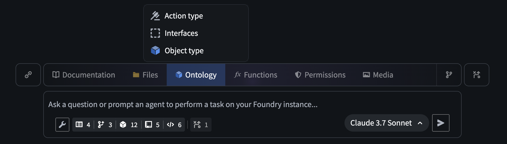

图 1｜2025-11-18 Beta 公告原图。菜单列出 Action types、Interfaces、Object types，模型栏为当时选择的 Claude 3.7 Sonnet。它证明早期已提供明确的 Ontology 上下文入口，不能据图断定今天只有这些资源或默认使用该模型。[来源](https://www.palantir.com/docs/foundry/announcements/2025-11)

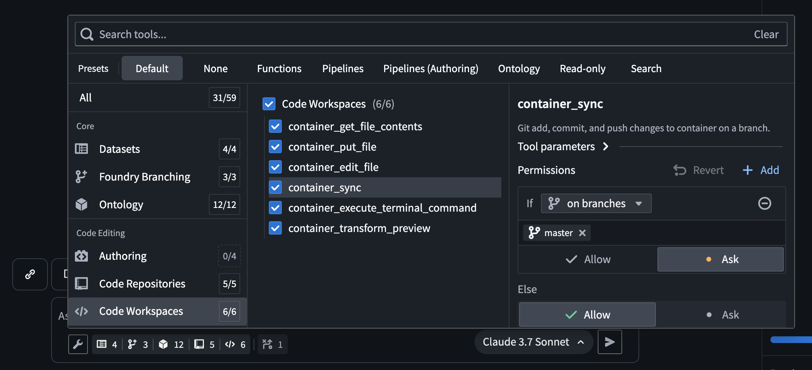

图 2｜同一 Beta 公告中的工具 presets 与分支条件审批。显示 Functions/Pipelines/Ontology/Read-only/Search 等配置和 Ask/Allow 条件；工具数和 master 规则是历史示例，不是当前默认策略。[来源](https://www.palantir.com/docs/foundry/announcements/2025-11)

三个术语应分开。**Mode** 表示当前任务类型；当前的 **capability** 表示可组合操作或 Agent 自管理能力；以 **skillRid** 引用的 **AIP Skill** 是可复用指令资源。2026 年 3 月公告把细粒度能力称为 skills，因此不能把 GA 的 Skills 菜单直接解释成后来指令资源库的完整行为。[模式专页](https://www.palantir.com/docs/foundry/ai-fde/modes-and-capabilities)、[预填会话](https://www.palantir.com/docs/foundry/ai-fde/prefill-sessions)

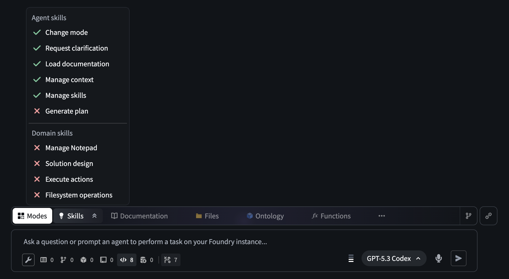

图 3｜2026-03-12 GA 公告中的 Agent skills / Domain skills 开关，包含 Change mode、Request clarification、Load documentation、Manage context 等。此图用于术语沿革；不作为 AIP Skill 资源版本、权限或加载算法的证据。[来源](https://www.palantir.com/docs/foundry/announcements/2026-03)

## 3. 谁会用它，哪些任务最合适

使用前需要 enrollment 启用 AIP；官方建议启用 Global Branching 以支持 Ontology 编辑。具体模型还需在该 enrollment 可用。官方以不同技术水平的用户为目标，但生产实现仍要求代码检查、代表数据测试与人工优化。[要求与模型支持](https://www.palantir.com/docs/foundry/ai-fde/overview)、[最佳实践](https://www.palantir.com/docs/foundry/ai-fde/best-practices)

下表是任务与角色的研究归纳，不是角色授权表。角色名称不赋予权限；实际能做什么由用户、资源和工具策略决定。

| 角色 / 典型需求 | AI FDE 可参与的工作 | 人仍需承担的责任 |
| --- | --- | --- |
| 数据工程师：脏数据、管道修改、数据源失败 | 探索输入、写 transforms / Pipeline Builder 逻辑、预览/构建、解释失败 | 质量口径、增量语义、规模、下游依赖及变更范围 |
| Ontology / 业务模型建设者 | 对象、接口、关系、Action 定义；梳理资源依赖 | 主键、业务概念、写入规则、授权模型及长期兼容 |
| 函数 / AI 应用工程师 | Logic、TypeScript、Python 函数与 Evals 迭代 | 验收真值、评测不能被放松、外部调用与发布策略 |
| React / Workshop 应用开发者 | OSDK React app / custom widget；修改已有资源 | SDK/分支兼容、宿主契约、OAuth、真实数据读写和发布 |
| 平台管理员 / 治理人员 | 权限、markings、资源访问的只读调查 | 独立审批、最小权限、数据通道政策与审计解释 |
| 新使用者 / 分析人员 | Platform Q&A 与 Exploration；结合资源理解平台 | 不把问答信心当变更许可，不跳过领域验证 |

能力依据：[AI FDE modes](https://www.palantir.com/docs/foundry/ai-fde/modes-and-capabilities)。更适合先试的任务具有清晰资源、可读失败和小范围验收，例如“把这个日期字段规范为 UTC 并列出无效行”“查清这个 source 的连接失败”“在现有函数增加一条边界规则并跑固定评测”。这些是本文建议的试点任务，不是本次产品实测结果。

暂不适合以一句话全权交出的任务包括：没有验收口径的业务重建、未盘点副作用的大规模迁移、依赖未支持分支资源的发布、涉及生产 external endpoint 的 Action 测试，以及缺乏基线的“自动把所有 Agent 优化到最好”。原因是这些任务需要额外的工程合同，不是因为本轮证明它们全部不支持。

## 4. 会话、上下文和工具：控制模型此刻看什么、做什么

### 4.1 会话入口与状态

任务从输入框发起，顶部可新建或管理会话。输入附近可以选择 mode、模型、文档和资源；outline 提供过程观察。会话只对创建者开放，不能直接与其他用户共享已执行会话；分享 prefill 链接则会为接收者创建自己的新会话。[导航](https://www.palantir.com/docs/foundry/ai-fde/navigation)、[会话安全](https://www.palantir.com/docs/foundry/ai-fde/security-and-governance)、[prefill](https://www.palantir.com/docs/foundry/ai-fde/prefill-sessions)

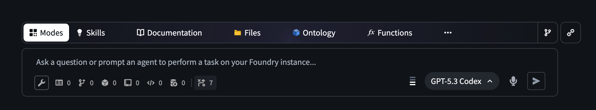

图 4｜当前导航文档的输入栏，显示 Modes、Skills、Documentation、Files、Ontology、Functions 和模型选择。GPT-5.3 Codex 是该截图的选择，不是所有租户模型可用性的证明。[来源](https://www.palantir.com/docs/foundry/ai-fde/navigation)

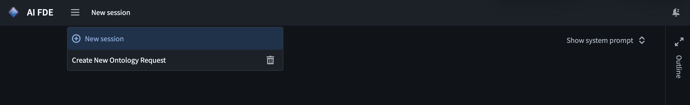

图 5｜New session 菜单与已有会话，右侧为 Outline 入口。它说明任务会话具有可见的导航；不能据这张小图推定长任务持久执行或浏览器关闭后的恢复保证。[来源](https://www.palantir.com/docs/foundry/ai-fde/navigation)

### 4.2 上下文不是权限全集

AI FDE 初始只加载少量 Foundry 基础知识，不默认获取用户业务数据。用户可提供文档包、媒体、dataset、function、branch、interface、action type、object type，也可拖拽 Foundry 链接；搜索工具可以发现相关资源。导航页“只能访问已加入 chat 的 context”必须结合这些搜索入口理解，不能解释成永远不会发现未手工附加的资源。[概览的上下文管理](https://www.palantir.com/docs/foundry/ai-fde/overview#context-management)、[导航的上下文管理](https://www.palantir.com/docs/foundry/ai-fde/navigation#manage-context)

工程上应分别看五个集合：用户有权读的资源、当前工具可搜索范围、搜索返回的候选元数据、实际加载到模型的内容、后续保留的历史。它们不是同一个集合。最小相关上下文帮助推理；后端 ACL 才强制限制数据访问。应把数据样本、schema、资源 RID、业务约束和授权范围作为可检查的输入，而不是把全部日志直接堆给模型。这是本文分析。

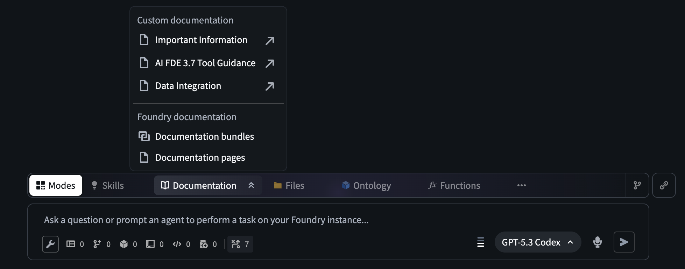

图 6｜Documentation 展开后分为自定义文档、bundles 与 pages。示例文件名包含“AI FDE 3.7 Tool Guidance”，它是文档名称，不能反推产品当前版本。[来源](https://www.palantir.com/docs/foundry/ai-fde/navigation)

### 4.3 可见历史与上下文整理

Chat outline 记录 prompts、responses 和工具调用，逐消息显示 token；历史可以摘要或移除，减少长会话占用。官方也建议只配置必要工具与上下文。其目标是收敛相关信息，而不是越少越好：删掉必要 schema、权限约束或业务规则同样会增加错误。[Chat outline](https://www.palantir.com/docs/foundry/ai-fde/navigation#chat-outline)、[工具与上下文最佳实践](https://www.palantir.com/docs/foundry/ai-fde/best-practices#limit-tools-and-context)

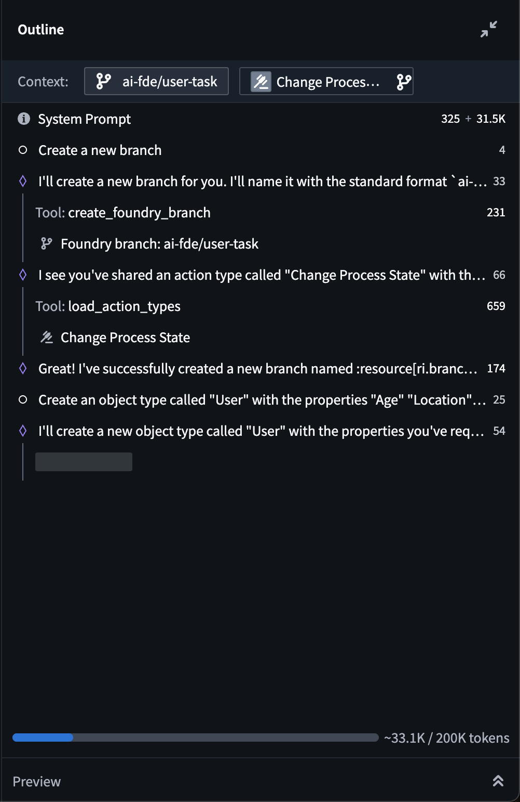

图 7｜Outline 显示 create_foundry_branch、load_action_types 等调用、资源上下文和逐消息 token。底部 200K 是所示会话的窗口，不是所有模型/会话统一上限。它也不是本研究的执行日志。[来源](https://www.palantir.com/docs/foundry/ai-fde/navigation)

### 4.4 工具选择和能力调整

Tools 菜单允许选择可用工具及审批条件。capability 可启停，Manage capabilities 允许 Agent 在任务中调整能力；这不等于提高底层权限或自动解除写入审批。把全部工具长期暴露给模型可能降低表现，官方建议按任务提供子集。[工具配置](https://www.palantir.com/docs/foundry/ai-fde/navigation#tool-configuration)、[capabilities](https://www.palantir.com/docs/foundry/ai-fde/modes-and-capabilities#capabilities)

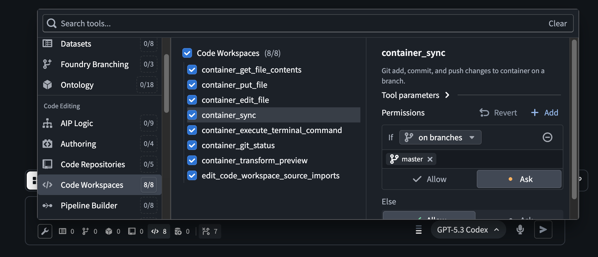

图 8｜工具菜单把类别、具体工具说明、条件审批并列，示例可见 Code Workspaces、终端、git 与 transform preview。master 上 Ask 的规则只是截图配置；工具名称可用来理解产品表面，不能据此猜测后端容器或 Agent harness 的内部架构。[来源](https://www.palantir.com/docs/foundry/ai-fde/navigation)

## 5. Modes 与资源操作矩阵

当前 mode 可手选，也可让 Agent 根据任务选择；任务变化时可中途切换。mode 加载相关文档与工具，并调整工作方式。公开证据支持“任务配置”的解释，没有证明它们是九个独立模型、九个微服务或固定子 Agent。[Modes and capabilities](https://www.palantir.com/docs/foundry/ai-fde/modes-and-capabilities)

| 当前 mode | 任务与资源 | 文档明确的配置 / 能力 | 验收重点（本文建议） |
| --- | --- | --- | --- |
| Data integration | 数据管道 | Python transforms 或 Pipeline Builder | schema、坏行、主键、增量、preview 与真实规模 build |
| Data connection | sources、egress policies | 创建、管理、诊断连接 | worker、地址/端口、TLS、策略、脱敏日志及连接测试 |
| Ontology editing | objects、links、actions | 建立/更新模型 | 主键、关系、Action 规则、索引与权限 |
| Functions editing | Logic / TypeScript / Python | 语言选择；编写与测试 | 语言和 SDK 兼容、固定验收集、函数版本 |
| Exploration | 已有平台资源 | 只读调查 | 引用可追溯、依赖盘点、明确未读取的数据 |
| Governance | 权限、访问、markings | 审计与数据保护调查 | 对象权限和模型通道政策分开 |
| Machine learning | 分类、回归、时序预测、自定义模型 | Model Studio / pro-code、编辑环境 | 数据泄漏、留出集、模型版本、部署与算力 |
| OSDK React | React 应用或 custom widget | 连接 Foundry 数据的应用构建 | OSDK/分支兼容、宿主契约、授权与发布 |
| Platform Q&A | Foundry 平台问题 | 一般问答 | 以文档回答，不将问答自动变成写操作 |

矩阵基于[当前模式文档](https://www.palantir.com/docs/foundry/ai-fde/modes-and-capabilities)，是任务归纳而非完整工具 API 清单，也不保证每个 enrollment 都启用了所有功能。ML 工具选择可进一步读[官方指南](https://www.palantir.com/docs/foundry/model-integration/what-to-use)。

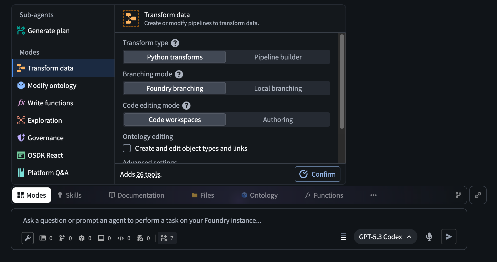

图 9｜模式菜单与 Python/Pipeline Builder、分支、编辑方式等配置。图内只有较早的七类菜单，与当前文字列出的九类不同；Data connection 和 Machine learning 的存在以当前文字/发布记录为准，不能为了完整而改绘原图。[来源](https://www.palantir.com/docs/foundry/ai-fde/modes-and-capabilities)

capability 又分两层：Agent 自管理包括换 mode、澄清、计划、加载文档、整理上下文与能力；领域能力示例包括文件夹浏览/移动、Notepad、方案图及 Ontology Action 执行。领域能力越接近真实业务写入，越需要单独检查审批与副作用，不能因为它是一个 capability 就默认为只读。[capabilities](https://www.palantir.com/docs/foundry/ai-fde/modes-and-capabilities#capabilities)

Data Connection 的 Debug with AI FDE 是一个有代表性的原生入口：从 source 携带 source/egress policy 上下文启动，检查配置、策略、egress 日志与连通性。专页仍有 Foundry worker 表述，而较新的 9/23 release note 记录扩展到 agent worker；应按最新有日期记录和目标 enrollment 核验，不能把旧专页限制永久化。[故障排查](https://www.palantir.com/docs/foundry/data-connection/troubleshooting)、[9/23 agent worker 发布记录](https://www.palantir.com/docs/foundry/release-notes/2026/#95340bd2-48a5-48b4-b04d-ca1d073b6d3a)

9/21–9/23 的更新还记录 SQL worksheet 读写、project cover page、最近 100 条会话、Developer Console 中的 OSDK React 应用代码仓库 Global Branching，以及读取/编辑已有 pro-code agent repository；SQL 读工具默认纳入 Exploration，写工具需手动添加。初始化新 pro-code agent repository 当时仍不支持。已有仓库可编辑与新建模板可用是两个不同承诺。[SQL worksheet（9/23）](https://www.palantir.com/docs/foundry/release-notes/2026/#68b31d23f14fca1471c886f5e6a07c8de4ef796c969a425d1ea8a5b07ea2d22c)、[cover page（9/21）](https://www.palantir.com/docs/foundry/release-notes/2026/#6c94d48c1ddb581ec8b3deec757e2a5f5fd6a54b1d72f62bd97ccdf2ec27aa01)、[100条会话（9/21）](https://www.palantir.com/docs/foundry/release-notes/2026/#2aff432af41b5161901781c72f558408087909e76e60603a825c8d35769119da)、[OSDK React 分支（9/21）](https://www.palantir.com/docs/foundry/release-notes/2026/#b9004d1893e824bc87e42408b2c485487352bc056d1e01df9b12c7749a24a90e)、[已有 agent repo（9/21）](https://www.palantir.com/docs/foundry/release-notes/2026/#b8ef2daac88f3f804dc48b3a4a6f52b829a85a8dad296b6699f52b7b3a8b19c9)

## 6. 任务执行与验证：闭环成立，真值仍需外部确定

### 6.1 从意图到变更包

官方闭环是：分析意图与上下文 → 判断平台操作 → 原生工具执行 → 读取结果继续决策 → 返回解释。验证例子包括 transform preview、function preview 和 Code Repositories CI；默认用分支并提出 Global Branch proposal 或代码 PR。[闭环操作](https://www.palantir.com/docs/foundry/ai-fde/overview#closed-loop-operation)、[最佳实践](https://www.palantir.com/docs/foundry/ai-fde/best-practices)

下面是**作者依据公开行为归纳的工作流图**，不是 Palantir 内部组件图。模式选择、验证工具与审批不必在每项任务机械出现一次，流程表达各自责任。

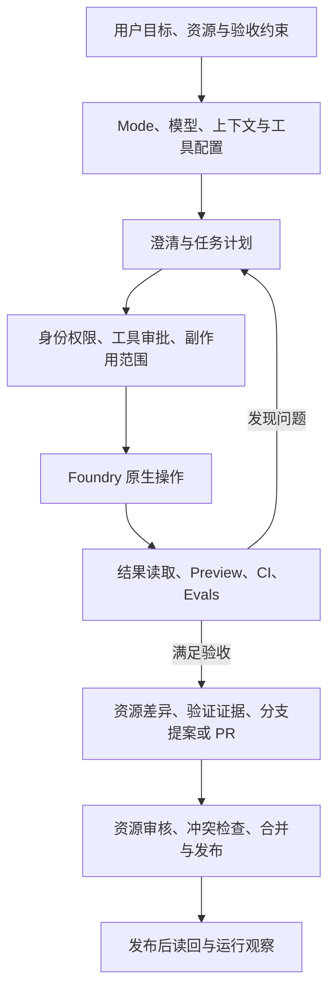
```mermaid
flowchart TD
  A[用户目标、资源与验收约束] --> B[Mode、模型、上下文与工具配置]
  B --> C[澄清与任务计划]
  C --> D[身份权限、工具审批、副作用范围]
  D --> E[Foundry 原生操作]
  E --> F[结果读取、Preview、CI、Evals]
  F -->|发现问题| C
  F -->|满足验收| G[资源差异、验证证据、分支提案或 PR]
  G --> H[资源审核、冲突检查、合并与发布]
  H --> I[发布后读回与运行观察]
```

不能据此声称使用特定开源 Agent 框架、planner、向量数据库、固定重试算法或 durable execution 引擎。公开产品行为可以由多种内部实现完成。

### 6.2 验证的证据强度

| 得到的证据 | 可以说明 | 仍不能说明 |
| --- | --- | --- |
| 代码 / 配置生成 | 存在候选变更 | 已运行或业务正确 |
| preview / compile / CI | 所测环境和输入下可执行 | 生产数据、规模和外部依赖全覆盖 |
| Evals 达标 | 指定样本与评分条件满足 | 指标充分、无过拟合、所有随机运行一致 |
| 分支集成测试 | 已测试链路的资源协调 | 所有外部副作用或资源创建都隔离 |
| proposal 获批 | 满足配置的审核规则 | 一定有独立第二人审核 |
| 发布后观测 | 特定真实负载下表现 | 长周期通用 SLA |

这是本文分析框架。官方最佳实践也要求检查生成代码、用代表性样本测试、拆解复杂任务并对生产实现人工细化。[最佳实践](https://www.palantir.com/docs/foundry/ai-fde/best-practices)

### 6.3 Evals 扩大了闭环，但不能让 Agent 自定真值

2026-04-14 集成公告确认 AI FDE 可以创建 suite、运行、阅读失败、修订函数或 suite 并重跑；当时包含 19 个内建 evaluator 与 function-backed evaluator。公告当时还列出 object-set-backed cases、多 target suites、run datasets、Marketplace evaluators 的集成限制。它们是**4 月当时的 AI FDE 工具覆盖**，没有更晚完整矩阵时不能无条件写成 10 月现状；AIP Evals 产品支持某功能也不能推导 AI FDE 工具已全部覆盖。[Evals 集成公告](https://www.palantir.com/docs/foundry/announcements/2026-04)、[Evals 概览](https://www.palantir.com/docs/foundry/aip-evals/overview)

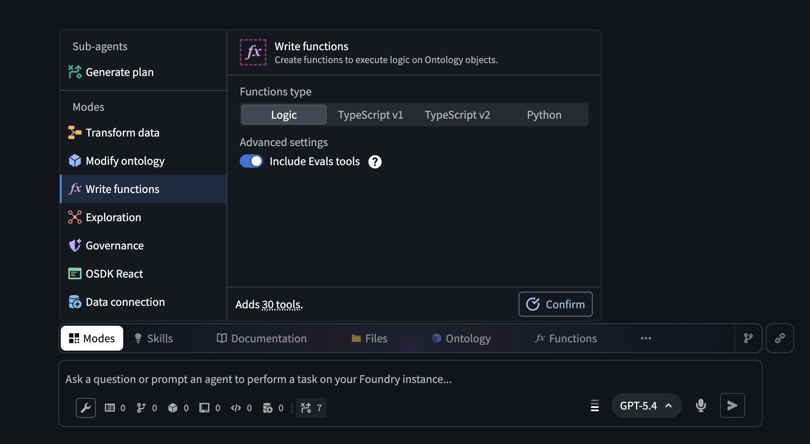

图 10｜4/14 公告原图：Write functions 模式中的 Include Evals tools。它证明当时评测被纳入函数任务的配置面；截图不能代替 10 月完整的集成支持矩阵。[来源](https://www.palantir.com/docs/foundry/announcements/2026-04)

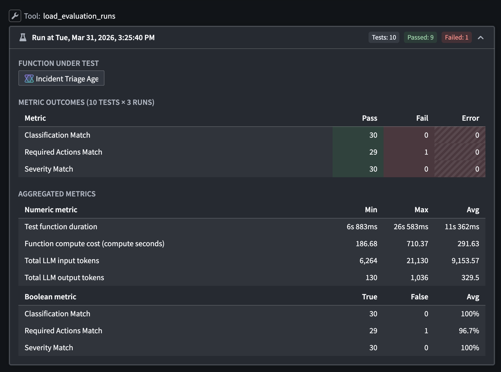

图 11｜同一公告的 load_evaluation_runs 结果卡显示 10 个测试中 9 个通过、1 个失败，Required Actions Match 为 29/30，并显示耗时、compute-seconds 和 token。它是一轮函数评测的失败证据，不是 AI FDE 产品总体成功率，也不是本研究运行结果。[来源](https://www.palantir.com/docs/foundry/announcements/2026-04)

企业闭环需要锁定业务验收合同。如果同一个 Agent 既修改函数又删弱 evaluator，最后全绿可能只是改变了口径。建议固定 baseline 资源/模型/评测版本，把 Agent 新增的探索性 tests 和 owner 锁定的 release gates 分开，保留 holdout 和多次运行方差，在 proposal 标明究竟改了函数还是改了评测。这是本文治理建议，未断言 AI FDE 内部已有这些强制约束。

### 6.4 失败恢复应先分层诊断

| 现象 | 先确认 | 建议恢复动作 / 交接条件 |
| --- | --- | --- |
| 找不到资源 / VIEW_SKILL 403 | RID、资源权限、当前工具和上下文 | 读回权限和目标，补正确上下文；不通过换模型绕权限 |
| preview / CI 失败 | 完整错误、输入、依赖、schema/语言版本 | 小范围修复后重跑同一验收；记录变更前后的证据 |
| 数据“正确”但数量/含义异常 | 主键、坏行、增量、业务日期、关联基数 | 回到业务合同；不能只改到编译通过 |
| 很慢 / 限流 | UI、上下文、模型 TPM/RPM、并发、异步 operation | 摘要必要历史、缩小工具/数据范围、按真实配额降并发；保留待完成 operation ID |
| 分支过时或冲突 | 当前 main、资源 diff、审批策略 | rebase 并人工决定真实冲突，再跑验证 |
| inactive / archived 分支 | 生命周期和数据/索引是否被清理 | 先恢复；检查重新索引、job specs、构建与已暂停 schedules |
| 部分 merge 失败 | 哪些资源已经进入 main，哪些仍在分支 | 按官方流程修错重试；不可假定整体 rollback；必要时人接管补偿 |

表中恢复动作是分析建议；分支恢复、清理后重建和部分合并语义由[core concepts](https://www.palantir.com/docs/foundry/global-branching/core-concepts)确认。普通 AI FDE 会话的 checkpoint、最大重试次数和浏览器断开后的持续执行保证仍未知；“闭环”不能代替这些运行时合同。

## 7. 端到端案例：设备维修，从管道到 Ontology、函数和 React

以下是**作者依据已证实能力设计的验证案例**，用于说明如何组织真实试点，未在本轮 Foundry 执行。它不是拼接视频后宣称产品已经跑通的案例。涉及每种资源的实际工具、分支支持和发布角色，仍须在目标 enrollment 检查。

### 7.1 先定义交付合同

业务需求：维护人员需要查看设备及未关闭工单，按停机影响、SLA 和备件可用性给出优先级，记录负责人和状态变化。输入采用合成的 `equipment`、`work_orders`、`spare_parts`，故意包含重复主键、日期字符串、空值、孤立设备 ID、晚到事件和非法状态。业务方事先规定 UTC 口径、合法状态转移、优先级规则及哪些角色能更改状态。

给 Agent 的建议请求应包含具体目标：只读取指定输入；先报告数据问题与资源计划；按批准的分支/测试资源修改；生成清洗逻辑、Equipment / WorkOrder 模型与链接、优先级函数和 React 列表；运行固定测试；提交带 diff/结果/未测边界的 proposal 或 PR。未批准时不发布、不执行生产 Action、不调用外部写端点。这里的范围是案例设计，不是对 AI FDE 默认配置的描述。

在动作前生成资源清单：已有管道/仓库、拟建 dataset、Ontology types、Action、函数语言/SDK、React repo、Developer Console app 或 widget set、Workshop 宿主。逐项填清定义隔离、数据隔离、创建可见性、外部副作用与恢复方式。即使统一显示一个 global branch，也不能省掉此步骤。[Global Branching 集成](https://www.palantir.com/docs/foundry/global-branching/integrations)

### 7.2 管道：先证明输入输出语义，再讨论建模

Data integration 可选 Python transforms 或 Pipeline Builder。建议先用 Exploration 检查 schema、样本与关联，确认坏行策略，再实现：日期显式解析并转 UTC；状态/布尔值规范；重复记录按确定规则处理；未知设备和非法日期进入可追溯异常输出，避免静默丢弃。[能力依据](https://www.palantir.com/docs/foundry/ai-fde/modes-and-capabilities)、[transform preview](https://www.palantir.com/docs/foundry/ai-fde/overview#closed-loop-operation)

验收应检查输入/有效/隔离异常/去重数量的解释、主键唯一、必填字段、引用完整性、UTC 边界和增量重跑。如果定义为“保留最新事件”，就固定相同事件时间的 tie-breaker；如果字段缺失允许为空，就写清默认值而不是让模型猜。preview 后还要在批准规模下 build 并检查实际输出和下游依赖。preview 成功并不证明大数据规模、增量或生产输入都正确。

失败分支：解析失败先读具体坏行，不扩大为“接受所有格式”；计数变少先定位去重/过滤，不改黄金答案；构建失败先分依赖、算力、权限和代码；异步构建超时先查 operation 状态，不能推断未执行。上述是试点恢复建议。

### 7.3 Ontology：定义、索引数据和业务编辑分开

候选模型包括 Equipment（稳定设备 ID）、WorkOrder（稳定工单 ID、设备引用、状态、创建/SLA 时间、负责人）及二者链接；必要时再引入 SparePart。Agent 可以生成定义，业务 owner 审核主键、关联基数、名称和“关闭”等业务含义。数据管道负责事实数据进入模型，Action 负责用户编辑，二者优先级与来源必须明确。平台允许建立对象/关系/Action，不代表该业务模型已正确。[Ontology editing](https://www.palantir.com/docs/foundry/ai-fde/modes-and-capabilities)

建议用 `AssignWorkOrder` 与 `TransitionWorkOrder` 表达有限业务操作，配置参数和 submission criteria；测试“只读用户”“非负责人”“重复关闭”“未知状态”等负面用例。这里不是本文已经运行的 Action API 示例。测试分支上的对象类型需要索引；未索引时 Action 可能有效但无法应用编辑，需依据提示处理，而不能误判为业务成功。[Branching action types](https://www.palantir.com/docs/foundry/action-types/branching-action-types)

### 7.4 函数与评测：编译、规则与随机输出分别验收

优先级函数先采用确定性合同，例如停机优先、SLA 逾期优先、同级按创建时间排序；缺字段、已关闭、无备件、夏令时边界均有固定预期。函数语言不是随意互换：若要求 TS v2 对 branched schema 编辑，应检查 local OSDK；Python function 的代码分支限制须另找获准工作路径。不能让一个“写函数”mode 名称遮住这些平台差异。[Functions editing](https://www.palantir.com/docs/foundry/ai-fde/modes-and-capabilities)、[Global Branching 限制](https://www.palantir.com/docs/foundry/global-branching/integrations)

若再加入 LLM 生成维修摘要，评测至少区分格式、事实一致性、禁止捏造和成本/耗时。固定 baseline、留出工单和重复次数，允许 Agent 增补 case，不允许自行放松 owner 的关键标准。生成、preview、CI、Evals 和发布版本分别入证据包。[Evals](https://www.palantir.com/docs/foundry/aip-evals/overview)、[4 月集成](https://www.palantir.com/docs/foundry/announcements/2026-04)

### 7.5 React / Workshop：运行时授权与宿主契约是最后一段工程

OSDK React mode 的目标可为独立应用或 custom widget。列表需要筛选、排序、loading/empty/error 状态和 Action 后反馈；测试应包含目标用户而不只开发者的权限。在独立应用路径，检查 Developer Console 的应用资源、授权与托管限制；在 widget 路径，检查 Registry 版本以及 Workshop 参数/事件绑定。后者的发布和宿主集成不是“React 页面能显示”即可完成。[模式能力](https://www.palantir.com/docs/foundry/ai-fde/modes-and-capabilities)、[Developer Console 托管](https://www.palantir.com/docs/foundry/developer-console/deploy-custom-application-on-foundry)、[Workshop custom widget 集成](https://www.palantir.com/docs/foundry/custom-widgets/embedding-in-workshop)

应用仓库加入 Global Branching 不等于 OSDK 自身可分支；开发 schema、SDK 包和运行时目标要核对一致。若采用 Pilot 的生成体验，则另读 [Pilot 报告](../pilot-2026-09/) 的 Editor/Deploy、seed/production 和发布角色边界；不能把 Pilot 的专用流程直接当作 AI FDE 所有 React 任务的实现。

### 7.6 各阶段必须留下什么

| 阶段 | 可审阅工件 | 主要阻塞 / 失败处理 | 可以进入下一步的条件 |
| --- | --- | --- | --- |
| 探索与计划 | 资源 RID、基线版本、依赖、隔离/副作用清单 | 找错资源、缺上下文、无权限 → 澄清/拒绝 | owner 确认范围与验收 |
| 清洗管道 | 代码/配置 diff、preview/build、计数/坏行 | 数据语义或规模失败 → 保留原因和样本 | 固定质量断言通过 |
| Ontology | 类型/链接/Action 差异、索引、权限矩阵 | schema/主键/索引不一致 → 修正和重测 | 领域 owner 确认模型与测试数据 |
| 函数 | 源码、语言/SDK、preview/CI、评测版本与结果 | 放松标准、main schema 混用 → 阻断 | 关键业务断言全过，未测项显式 |
| UI 与宿主 | repo diff、SDK/授权、页面流程、绑定契约 | 权限错误、绑定过期、真实写入风险 → 接管 | 目标用户流程与负面用例通过 |
| 集成与交付 | 跨资源 proposal/PR、checks、审批、构建策略 | 冲突/部分 merge → 核对成功状态后修错 | 资源审批与检查满足，发布另获授权 |
| 发布后 | 版本/URL、读回、监控、恢复责任 | 下游构建遗漏或业务异常 → 按既定方案修复 | 真实负载验收及交接完成 |

这条链最有价值的产物是可被另一个工程师接管的变更包，而不是一段“已经完成”的聊天结论。每步的状态和证据必须对应实际工件；本案例在本轮仍为待执行验证方案。

## 8. 身份、权限、工具审批和审计

### 8.1 它代理谁

AI FDE 使用发起人的已认证 Foundry session，没有独立 service account、bot 凭据或权限提升。创建仓库、修改对象、执行 Action、构建等均受同样服务端权限检查。活动通过标准 Foundry audit logs 归于用户，LLM 用量和限流也按其身份归因。[Security and governance](https://www.palantir.com/docs/foundry/ai-fde/security-and-governance)

这增强可归责性，却不自动收窄一个原本很宽的用户账号，也不能证明用户实际理解了所有获准变更。Tool approval 解决“是否同意 Agent 此次执行”，backend permission 解决“身份是否有权”，资源 review 解决“是否接受最终成果”，三者不可互代。

### 8.2 审批默认如何描述

| 操作类别 | 安全文档的默认描述 | 解释边界 |
| --- | --- | --- |
| 搜索、读定义等只读 | 自动批准 | 仍需后端权限与模型数据策略 |
| 文件编辑、dataset builds | feature branch 可自动批准；protected branch 需批准 | 不等于任何分支的创建/删除都隔离 |
| Ontology actions、创建 app/widget、发布、tag | 每次要求批准 | 这些会造成运行或交付副作用 |
| 指定工具的会话预授权 | 可按相关 branch/project 授予 | 是明确范围的同意，不是给 Agent 新身份或免服务端权限 |

依据：[安全专页](https://www.palantir.com/docs/foundry/ai-fde/security-and-governance#user-approval-for-sensitive-actions)。导航专页则概括默认分支、未分支操作和 dataset build 等副作用会要求批准，并允许 allowlist branch/project。两页的抽象层不同，不能据其中一句写成“任何 mutating tool 每次都弹窗”，也不能把 feature branch 自动批准扩成“所有副作用都免审”。实际工具配置需要现场核验。[Navigation](https://www.palantir.com/docs/foundry/ai-fde/navigation#tool-configuration)

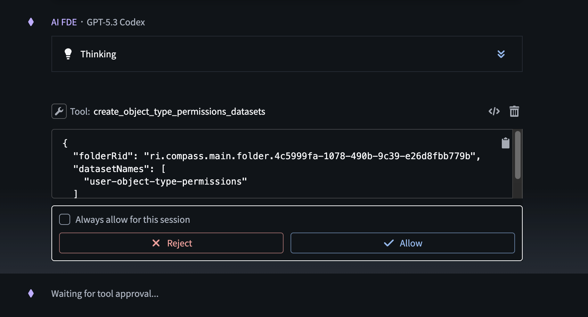

图 12｜工具调用展示具体参数以及 Reject、Allow、Always allow for this session；画面处于 Waiting for tool approval。例中的 RID 是官方示例，不是本研究租户。可借鉴的是批准前看到操作对象，不能由图推定审批一定由第二人完成。[来源](https://www.palantir.com/docs/foundry/ai-fde/navigation)

### 8.3 会话与 Markings

会话仅创建者可访问，创建时把用户可访问的 markings 应用于会话；失去其中 marking 权限会失去会话访问，恢复权限后可重新访问。不能因为某资源早已读入聊天，就认为当前失去权限后仍可随意共享它。[Session access and security](https://www.palantir.com/docs/foundry/ai-fde/security-and-governance#session-access-and-security)

AIP 模型数据策略还有独立层。当前 Markings 文档描述 token/session 级 mandatory markings 检查：token 中所有 mandatory markings 必须在模型允许列表，即使当前 prompt 没含那个 marking 的数据也可能拒绝。可使用 scoped session；registered model 的专属策略会替换 enrollment 策略，可能更严也可能更宽。不能把它简化成仅对 prompt 文本扫描标签。[Control LLM data access with Markings](https://www.palantir.com/docs/foundry/aip/control-llm-data-access-with-markings)

### 8.4 模型通道、审计与信息泄露

Palantir 的 AIP 安全文档对其管理的第三方托管模型通道说明 prompts/completions 不保留、不用于训练，并尽可能使用地域端点；适用范围依技术、合同与模型服务限制。无保留不等于不传输，不能套到用户自接 provider 或第三方 IDE 的合同。[AIP security and privacy](https://www.palantir.com/docs/foundry/aip/aip-security)

工程上还需防范“获准读写但业务上不该这样做”：敏感记录进入日志或提示、RID/分支名暴露上下文、数据中的指令诱导 Agent 扩权/发布、宽权限用户批准过大范围。本轮没有核到 AI FDE 的完整 prompt injection 防御、secret redaction 或强制信息流实现。因此这些是待测风险，不能声称产品没有任何防御，也不能用“企业级”填补证据空白。

## 9. 分支、审阅与发布：逐资源核对隔离

### 9.1 分支强项与资源覆盖

Global Branching 为管道、Ontology、函数、Workshop 等提供共同的资源变更、检查和 proposal 入口；它与跨开发/测试/生产环境的 release management 互补。统一提案提高协调能力，但每个应用的添加、rebase、merge 与支持范围仍不同。[概览](https://www.palantir.com/docs/foundry/global-branching/overview)、[集成](https://www.palantir.com/docs/foundry/global-branching/integrations)

| 当前明确边界 | 对 AI FDE 任务的直接含义 |
| --- | --- |
| 普通 Foundry resource 在分支上创建/删除会影响 main；Ontology entities 例外 | “新建资源”不能凭 branch 标签判断完全隔离 |
| TS v2 结合 branched schema 的代码修改需要 local OSDK | 仓库/SDK 形式是前置条件 |
| Python function 代码当前不能在 global branch 修改；可引用版本测试但使用 main schema | “支持写 Python 函数”不等于“支持所有 Python 分支编辑” |
| OSDK 本身当前不可 branch | React repo 可入分支与 SDK 可入分支不同 |
| 单个 global branch 对应一个 Ontology | 多 Ontology 图中其他 Ontology 仍可能是 main |
| materialization 不能在分支新建/编辑 | 不能把数据物化管理默认纳入隔离修改 |
| Restricted View 分支 backing dataset markings 变化有特殊数据可见性风险；若干 backing 类型不支持分支 | 分支不能自动代替数据保护测试 |

前三项及 OSDK 依据[integrations](https://www.palantir.com/docs/foundry/global-branching/integrations)，创建/删除依据[core concepts](https://www.palantir.com/docs/foundry/global-branching/core-concepts#editing-resources)，其余见[分支 Data Lineage](https://www.palantir.com/docs/foundry/data-lineage/branching-data-lineage)、[Materializations](https://www.palantir.com/docs/foundry/object-edits/materializations)、[Restricted Views](https://www.palantir.com/docs/foundry/security/branching-restricted-views)。这些是当前文档边界，后续更新需按日期重新核验。

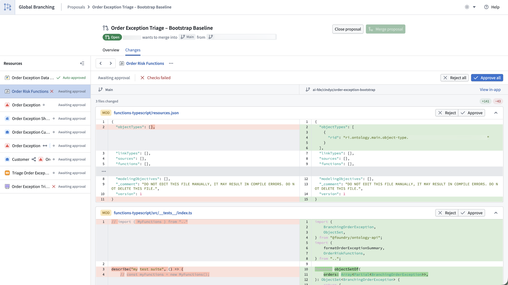

图 13｜2026 年 9 月公告的新 Changes 页签：左侧跨资源列表，右侧函数代码 diff；同时出现 Awaiting approval 与 Checks failed。分支名含 ai-fde，只说明官方例子的归属，不证明本研究执行了该案例。[来源](https://www.palantir.com/docs/foundry/announcements/2026-09)

### 9.2 Owner、资源权限与 merge 权限不同

Branch Owner / Space Administrator 管理分支元数据、角色、组织和生命周期，不能自动得到资源编辑权。任何可看 proposal 的用户，在资源审批和 checks 满足且没有 Do not merge 时可合并，可能应用自己不能编辑但已获授权审核的既有改动。未迁移到项目的 Ontology 资源还存在文档明确列出的编辑权限约束例外，需要 editor 批准，不应一概省略。[Branch security](https://www.palantir.com/docs/foundry/global-branching/branch-security)

分支组织是分支访问门槛，各资源访问仍单独控制；分支名称等 metadata 可能在组织限制外的资源上可见。不要把客户、工单敏感信息或秘密写入分支名。[Organizations](https://www.palantir.com/docs/foundry/global-branching/branch-security#organizations)

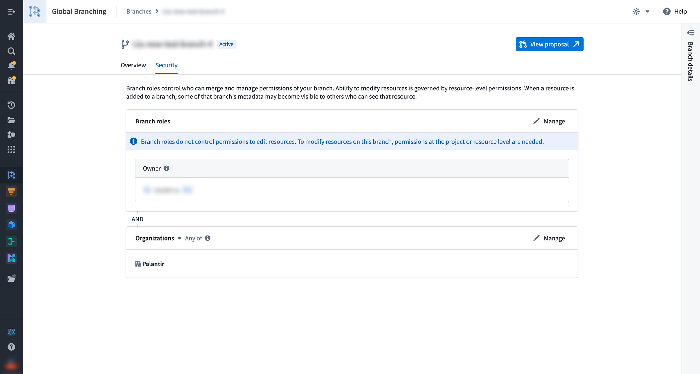

图 14｜Security 页中的 Owner / Organizations，蓝色提示明确分支角色不控制资源编辑权限。这是 Global Branching 界面，不能当成 AI FDE 自己授予权限的画面。[来源](https://www.palantir.com/docs/foundry/global-branching/branch-security)

### 9.3 Proposal 不天然保证双人制

保护策略可配置 eligible reviewers、批准人数和贡献者能否自批。默认政策可能因贡献者已有权限而自动满足，甚至一个人满足全部政策；Code Repositories / Pipeline Builder 的资源内保护政策继续存在。企业若需要独立第二人，必须显式配置，而不是只要求“有分支/有 proposal”。[Resource protection and approval policies](https://www.palantir.com/docs/foundry/global-branching/resource-protection-and-approval-policies)

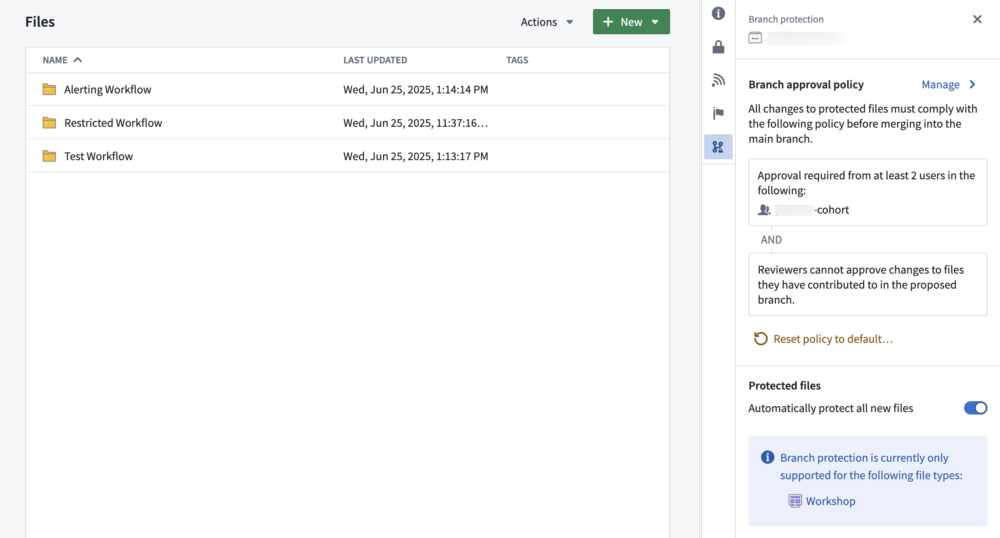

图 15｜官方 Workshop 项目例子配置至少两人批准、贡献者不可自审、新文件保护。它说明可配置的审核合同，不说明全平台默认就是这套政策；截图中的 Workshop 支持提示也不能推为整个 Global Branching 的支持全集。[来源](https://www.palantir.com/docs/foundry/global-branching/resource-protection-and-approval-policies)

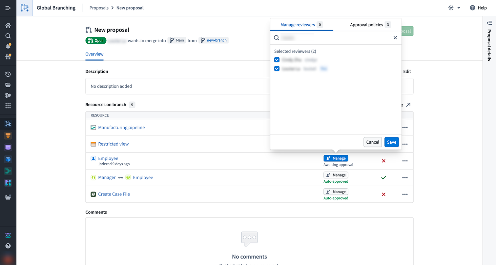

图 16｜Manage reviewers 与 Approval policies；同一列表里部分资源 Waiting、部分 Auto-approved，提醒审阅责任按资源与政策决定。人员由官方原图模糊处理，本文没有修改像素。[来源](https://www.palantir.com/docs/foundry/global-branching/core-concepts)

### 9.4 检查、构建和部分失败

Proposal 的资源检查要全部通过；真实冲突需要人工选择，不能让“自动 rebase”成为静默覆盖。单项 rejection 会阻止整个 proposal，需拒绝者重新审阅批准。合并可选择构建所有受影响资源、只构建直接修改资源或不构建；后两种可能需要额外下游构建。[Core concepts](https://www.palantir.com/docs/foundry/global-branching/core-concepts)

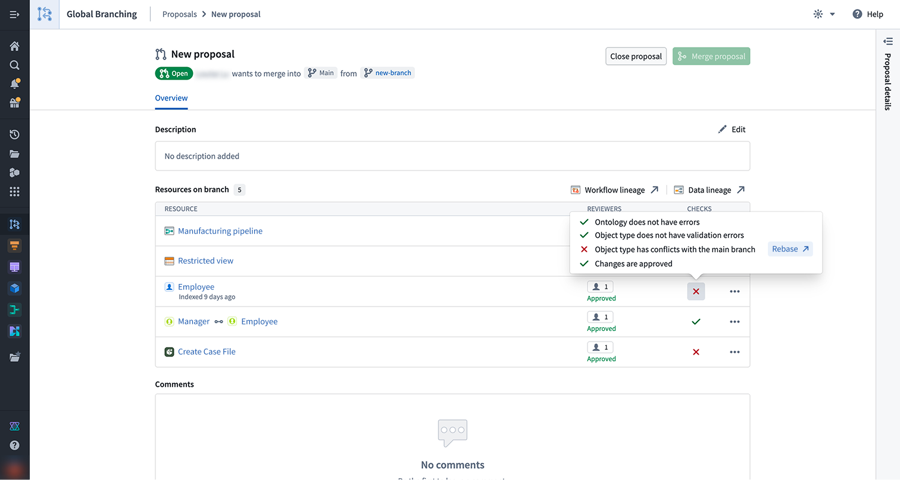

图 17｜Employee 资源的 checks 显示部分通过、与 main 冲突并提供 Rebase。Reviewers 和 Checks 是不同列；审批完成不代表可合并。[来源](https://www.palantir.com/docs/foundry/global-branching/core-concepts)

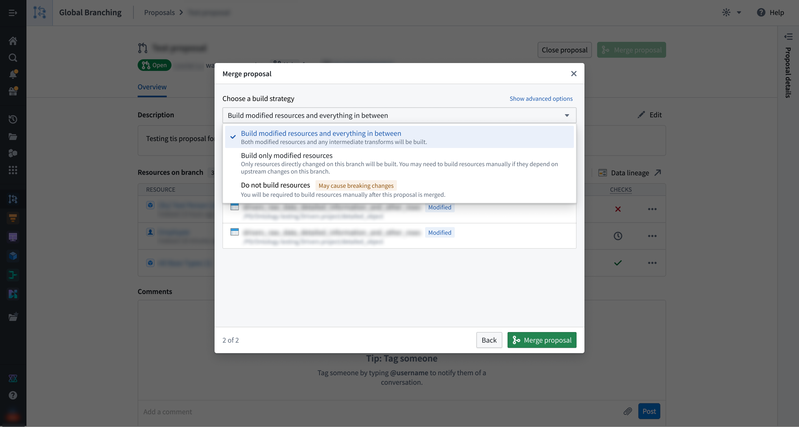

图 18｜Merge proposal 的三种构建策略。旧图首项名为“Build modified resources and everything in between”，当前正文称“Build all affected resources”；本文按正文解释当前契约，保留图文版本差异，不修改原图。[来源](https://www.palantir.com/docs/foundry/global-branching/core-concepts)

**部分 merge 失败目前不能整体 revert**：页面会列成功进入 main 和仍留分支的资源，官方要求修正错误再重试。移除分支资源也可能破坏其他 branched resources 的依赖。不能承诺删分支可撤回全部副作用，或跨资源 merge 是数据库式 ACID 事务。[部分合并与移除资源](https://www.palantir.com/docs/foundry/global-branching/core-concepts)

生命周期也影响恢复：inactive/archived 分支可能去索引并清理数据/job specs，构建失败，schedules 可能暂停。当前正文默认 inactivity 为 35 天、后续 data deletion 为 7 天，管理员可配置。旧保留设置原图与此默认有差异，故没有拿旧图展示现行默认。AI FDE 会要求重新激活/恢复后再修改；恢复后可能仍需重新索引、部署/构建和恢复 schedule。[生命周期](https://www.palantir.com/docs/foundry/global-branching/core-concepts#branch-and-proposal-lifecycle)

## 10. 数据写入、测试与外部副作用：三个平面不能混淆

**定义变更、测试中的对象编辑、外部系统调用**分别治理。Action type 定义随 proposal 审阅；分支 Action 的数据编辑仅用于测试，不 merge 回 main；外部调用则取决于具体设置与测试机制，不能从“Test”或“Branch”名字推断无副作用。[Branching action types](https://www.palantir.com/docs/foundry/action-types/branching-action-types)

| 操作 / 机制 | Ontology 数据效果 | 外部效果与限制 |
| --- | --- | --- |
| AIP Evals 中 Logic 的 Ontology edits | 每个 case 在 Ontology simulation 执行，真实 Ontology 保持不变 | 该保证针对 Ontology 编辑，不自动扩成所有任意外部 I/O 的沙箱 |
| 在 branch 真正运行 Action | 已索引分支对象产生测试编辑，不会 merge 回 main | webhook/notifications 默认不执行；带 external calls 的 function-backed action 默认整体失败；可显式开启 |
| 开启 branch webhook / external function | 仍为分支对象编辑 | 调用与 main 相同；配置为生产 endpoint 时仍访问生产 |
| Action Test run | 计算拟产生编辑并展示 proposed changes | 事后 side-effect webhooks、notifications、schedule builds 跳过；求值所需函数、writeback webhook 或 external calls 仍可能执行，并要求确认 |

依据：[Evals Ontology edits](https://www.palantir.com/docs/foundry/aip-evals/ontology-edits)、[branch Action 副作用](https://www.palantir.com/docs/foundry/action-types/branching-action-types#managing-side-effects-on-branches)、[Test run](https://www.palantir.com/docs/foundry/action-types/test-run#external-calls)。尤其不能把“side-effect webhook 跳过”误读成“writeback webhook 也不执行”，也不能把 Evals simulation 的保证套到 Action Test run。

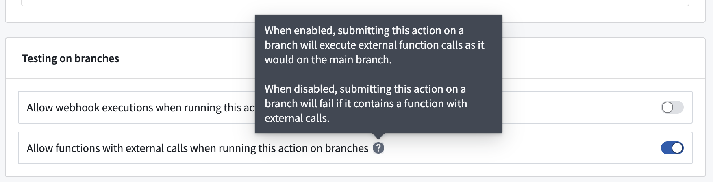

图 19｜Action 的 Testing on branches 设置同时展示 webhook 关闭与 external functions 开启；tooltip 解释开启后像 main 一样执行外部调用，关闭则含外部调用的 Action 失败。这是 Action 配置界面，不是 AI FDE 专有功能，也不是本轮操作状态。[来源](https://www.palantir.com/docs/foundry/action-types/branching-action-types)

建议在执行前给每个步骤标明：是否只改定义、是否编辑数据、外部 endpoint/收件人是谁、是否真实调用、是否幂等、如何查询结果、能否补偿。测试调用失败、超时或未返回不能证明外部操作没发生；结果未知时先查实际状态再决定重试。对 EOS 而言，一个统一“sandbox=true”标志远不如逐操作的隔离与副作用声明可靠。

## 11. 真实实践与失败反馈：把经验、问题和总体结论分开

### 11.1 证据分层

本文用 A 表示官方行为契约/带日期公告；B1 表示具名一手过程或公开工件；B2 表示带具体条件与后续的社区原帖；C 表示身份/测量不可独立核验的个案或社交信号；D 表示二手摘要、营销评分或未追溯 benchmark。等级描述证据用途，不是作者信誉打分。官方资料适合确认能力，也不能代替独立成效测量。

社区托管在 Palantir 域名并不使每条回答成为官方承诺。部分回应使用“我们发布”等措辞，但公开文本没有足够员工身份验证时，本文称“回应者”。博客职业/认证常为本人自述；YouTube 评论保留相对时间，不伪造精确日历日期。下述个案均未由本研究在目标 enrollment 复现，除特别说明外没有公开正式产品 build、模型配置或完整运行记录。

### 11.2 Mahesh：复杂家庭日历后端，但不是对照 benchmark

Mahesh Ramamurthy 于 2026-02-20 描述用 14 小时完成家庭日历后端：约 4 小时设计 Ontology、10 小时逻辑，18 个对象类型和 20 多个 Actions；过程包含自然语言需求、澄清、TypeScript、CI 修错、发布及 Action 绑定。他自述为 AWS Solutions Architect、Palantir Certified Foundry Solutions Architect，LinkedIn 索引提供有限交叉确认；认证有效期、当前雇佣及其他商业关系没有独立核验。[作者原文](https://medium.com/@MaheshRamamurthy/i-built-an-enterprise-grade-app-backend-in-14-hours-with-ai-heres-what-that-actually-means-780bc90749ba)、[本人 LinkedIn](https://www.linkedin.com/in/tenacious-mahesh-ramamurthy)

这是 B1 单例，证明有经验开发者报告了具体复杂后端产出；“enterprise-grade / production-ready”仍是作者定性。所谓同等 AWS 系统 480–600 人时或 14 周来自估算，没有建设匹配对照系统，也未公开完整会话、计时、账单、验收集或生产审计。不能计算成“实测提升数十倍”，后接的 Flutter/Nova Sonic 客户端也不能全部计入 14 小时后端时间。

### 11.3 Ontologize：从脏数据诊断到可审阅变更

Gena Coblentz / Ontologize 的 2026-06-03 Getting Started 教程及本人说明，是可归因的伙伴实践。其 LinkedIn 叙述将攀岩馆数据中的字符串日期、分类拼写、布尔编码不一致，连到探索、Python transforms、CI 和人审合并。Ontologize 官网说明由前 Palantir 工程师组成，且是 Official Palantir Training & Assessment Partner；因此具有实践背景与商业关系，不是完全独立测评。[原视频](https://www.youtube.com/watch?v=Ta19YD794RY)、[演示者说明](https://www.linkedin.com/posts/gena-coblentz_aip-foundry-palantir-activity-7468337522910179329-bySL)、[伙伴官网](https://www.ontologize.com/)

B1 证据在这里来自作者的公开过程说明、原始视频元数据和本轮有限观看的实际界面帧（见第 12 节）。局部画面补强了工具执行与错误反馈证据，但没有独立验证完整的清洗、CI、合并或生产结果。不能把其“never on main”宣传语升级成平台绝对承诺；官方仍列默认分支、未分支操作和副作用审批。作者当时观察的工具总数也不能作为 10 月固定 API 数量。后续 Functions、Voice OSDK 系列见第 12 节，只在已核验层次使用。

### 11.4 原型与社区工件提供什么价值

Michael Ellerbeck 于 2026-02-20 记录以 AI FDE 辅助生成 prompts，再组合 AIP Logic、对象、Workshop 与自动化构建持久 AI mentors。文中有自己的代码/提示词和修正过程，属于 B1 学习原型；所有后续手工操作不能归成 AI FDE 自动完成。应用生成角色倾向某些人口属性的个案，也不能算 AI FDE 平台整体偏差率。[实验原文](https://michaelellerbeck.com/2026/02/20/the-ouroboros-ai-forge-using-ai-to-build-a-system-that-uses-ai-to-teach-you-foundry-and-ai/)

社区账号 s-andthat 的 `palantir-ai-fde-library` 和 2026-03-16 发布帖，提供按任务规格、最小上下文、工具、分支、核验和失败模式组织材料的公开工件。作者真实身份/雇佣未确认；仓库中理想目录不等于所有内容实际存在，外部引文的“benchmarks”不等于统一复现实验，`skill.md` 名称也不证明可直接导入原生 AIP Skill。[GitHub 工件](https://github.com/s-andthat/palantir-ai-fde-library)、[作者发布帖](https://community.palantir.com/t/ai-fde-core-architecture-library/6199)

其方法可作为企业模板设计线索，工具和性能结论仍要回到原始证据。GitHub 托管只证明工件存在，不能自动提升成已测试的产品实现。

### 11.5 有诊断价值的社区问题与后续

下表是 B2 的“该用户当时报告了此现象”，不是当前版本必有的缺陷清单。作者为社区账号，真实身份和产品 build 未独立核验；正面/负面与后续答复同时保留。

| 日期 / 账号 / 原帖 | 实质现象与后续 | 对验证设计的意义 |
| --- | --- | --- |
| 2026-03-27 theo；3/31 shivamb 回复：[Context Management](https://community.palantir.com/t/ai-fde-context-management/6272) | 觉得管理改善但压缩积极；回应解释模型估计占用与持续清理 | 首帖“硬编码 200K”是猜测；测压缩后约束保留，不采固定阈值 |
| 2026-04-16 mellerbeck / helenq：[Pipeline Builder DSL expectations](https://community.palantir.com/t/feature-request-add-data-expectations-to-pipeline-builder-dsl/6426) | 当时 UI 的 data expectations 未暴露给 DSL，回应登记需求；未取得后续修复确认 | UI 能做不等于工具接口都覆盖；需当前最小重现，不能写成现版必缺 |
| 2026-04-28 T0m：[旧 Workshop 模块加载失败](https://community.palantir.com/t/ai-fde-error-failed-to-load-workshop-module-due-to-missing-action-parameter-rid/6506) | 新 sandbox/CRUD 正常，旧模块因 missing action parameter RID 加载失败；本轮未见解决答复 | 加入 brownfield 资源，不概括为“不支持 Workshop” |
| 2026-04-29–05-15 anaritarc / naman：[Linter](https://community.palantir.com/t/feature-request-ai-fde-able-to-integrate-linter/6513) | 回应指出已有 search_linter_recommendations，作者确认找到 | 已澄清工具发现问题，不列成当前缺陷；扫描周期另需判断 |
| 2026-05-12–05-24 Sam / jworsdale 等：[长会话性能](https://community.palantir.com/t/ai-fde-performance/6573) | 用户报大历史变慢；回应提 chat list virtualization / state memoization 改善及 Summarize above | UI 响应与模型上下文质量分开；500K 单例、200K 建议不是硬限制 |
| 2026-07-02 首帖；8/6–7 回复：[添加 Skills 的 403](https://community.palantir.com/t/welcome-skills-in-ai-fde-but-how-can-i-added/6880) | VIEW_SKILL / PermissionDenied；回应说明 Skill 是资源需 VIEW 访问 | 模板权限是实际摩擦，不代表 Skills 不可用或首次在7月出现 |
| 2026-08-18–20 Joel 等：[减少限流](https://community.palantir.com/t/any-tips-to-reduce-ai-fde-rate-limiting/7121) | 多模型限流；建议减少历史、工具、skills，传 schema/子集 | 需按 enrollment 配额测，不证明技巧一定消除限流 |
| 2026-08-31 Joel：[transform preview 审批](https://community.palantir.com/t/ai-fde-bug-approval-always-required-for-container-transform-preview/7157) | 自称已大量用于编码，同时报勾选自动允许仍再次批准；无修复确认 | 同一用户可同时满意和遇摩擦；检查具体工具/配置，不能泛化所有审批 |
| 2026-09-10 ManojMashatti / Pebble；9/25 AlexH：[子代理配置](https://community.palantir.com/t/need-configurability-for-sub-agents-in-aifde/7204)、[模型自动选择](https://community.palantir.com/t/ai-fde-model-auto-select/7276) | 回应谈 smart/balanced/fast categories；后者仍希望指定规划/实现/调试模型 | 类别选择不等于精确模型 ID；两帖可同时成立，租户控件需核验 |
| 2026-09-10–11 Mannyesp / Pebble：[简单 prompt HTTP 500](https://community.palantir.com/t/ai-fde-returns-http-500-even-for-a-simple-prompt-in-a-new-session/7205) | 回应称 9/9 的短暂服务故障已解决 | 可见无工具任务也受平台可用性影响，但不是持续故障或 SLA 统计 |

这些反馈提示失败要区分需求/模型、工具覆盖、权限、历史资源、UI、容量与服务可用性。换更聪明模型无法修正 missing RID 或 VIEW_SKILL，压缩历史也不能替代业务上下文。对已解决问题，不重播首帖指控；对无回复问题，不把“未查到修复”写成“仍未修复”。

### 11.6 强烈负面个案与性能宣传的边界

Reddit 用户 CuriousMemo 在 2026 年 7 月自称客户侧数据工程人员，批评企业应用项目中的硬编码、业务概念不一致与维护问题，并指称 AI FDE 参与。没有公开项目、repo、会话或匹配对照，身份和缺陷归因无法独立核实。作者后续也承认其他厂商迁移估算使单看项目耗时不足以断定失败。本文以 C 级个案保留“业务规则和维护性需独立审查”的风险，不能把延期或零 ROI 归因为 AI FDE。[原帖及讨论](https://www.reddit.com/r/dataengineering/comments/1v3u40k/my_experience_working_with_palantir_as_a_client/)

| 常见数字 / 叙述 | 实际证据类型 | 本文处理 |
| --- | --- | --- |
| 14 小时 vs 14 周 | 单个后端自述 vs 未建设对照估算 | 保留产出与作者，拒绝作为通用实测倍数 |
| 数据迁移“5 个月到 5 天” | 官方视频说明的案例宣传 | 没有范围/人数/基线，不外推迁移效率 |
| Evolve 案例 65% 降本 | 当前官方文档示例 | 仅解释验证包，不算本研究/总体收益 |
| 最高 90% 延迟下降；45 秒到 8.8 秒 | DevCon 6 官方说明的不同表述 | 具体45→8.8约80.4%，不把该样本写成90% |
| 外部 coding benchmark 或竞争方文档评分 | 不一定运行了 AI FDE | 不转成 AI FDE task pass rate 或稳定性评分 |

数字出处：[Mahesh](https://medium.com/@MaheshRamamurthy/i-built-an-enterprise-grade-app-backend-in-14-hours-with-ai-heres-what-that-actually-means-780bc90749ba)、[迁移视频](https://www.youtube.com/watch?v=e90qUUh8_us)、[Evolve 示例](https://www.palantir.com/docs/foundry/aip-evolve/overview)、[DevCon 6 视频](https://www.youtube.com/watch?v=GZHSCMz6Aio)。本轮未找到可独立复现、具任务集、版本、重复次数、成功判据、人力时间和成本的 AI FDE 专属公开对照基准；这只是本轮证据缺口，不是“世界上不存在”的断言。

## 12. 视频与实际画面：局部实证与未核验范围

本轮核验了视频页面的标题、频道、日期、时长、部分公开说明、章节导航和评论，并有限观看了 Ontologize Getting Started 的局部实际画面。保存的一张 13:10 帧包含 AI FDE 界面、原视频标题、频道和播放器时间。**没有完整观看视频，也没有取得可靠转写；其他视频的章节标题和二级摘要仍不作为实际演示证据。**DevCon 5 仅成功显示开场讲者，未取得有用的产品界面帧。

| 视频 / 发布信息 | 页面说明可支持什么 | 本轮不可支持什么 |
| --- | --- | --- |
| [Product Launch: AI FDE — DevCon 3](https://www.youtube.com/watch?v=SDqkGVuL1b8)，Palantir Developers，2025-07-03；Ankit Shankar | 初始平台操作定位，transforms / Ontology / functions / applications | 具体时间点、所有 UI 已自动化、任务耗时和生产可靠性 |
| [DevCon 5 AI FDE](https://www.youtube.com/watch?v=pyudERNI1Qo)，Palantir Developers，2026年3月；日期/时长显示差异见下；Ankit Shankar、Colton Rusch | 官方 Logic / Evals / branch-aware 调试循环；4月公告直接链接 | 具体失败修复发生于哪一秒，或实际成功率 |
| [Getting Started](https://www.youtube.com/watch?v=Ta19YD794RY)，Ontologize，2026-06-03，16:49；Gena | 数据管道教程入口、作者说明，以及图20所示的局部工具错误/切换结果 | 完整清洗、CI、合并、全部代码或生产结果 |
| [Ontology Functions](https://www.youtube.com/watch?v=GaSe4U2khI0)，Ontologize，2026-07-29，17:27；Gena | 使用 AI FDE 写 Ontology functions 的教程主题 | 二级 AI 摘要中的细节、时间点、语言版本和修错过程 |
| [Voice-Enabled OSDK Application](https://www.youtube.com/watch?v=_Zr2wjbenyU)，Ontologize，2026-08-12，15:09 | 页面自动章节跨权限、SDK/仓库、开发、PR/预览、发布与限制 | 仅凭标题推定前端框架、全部步骤成功或真实部署 |
| [Agent Observability & Optimization — DevCon 6](https://www.youtube.com/watch?v=GZHSCMz6Aio)，Palantir / Developers，2026-07-14，16:16；Christopher Jeganathan、Colton Rusch | AIP Inspect/Timeline 到 Evolve 的官方主题与案例陈述 | 视频UI细节、独立性能测量或全部系统平均效果 |

早期读取的 DevCon 5 页面元数据为 2026-03-09 / 15:57，本轮视频页面显示 2026-03-10 / 15:56；Getting Started 的早期时长为16:49，当前播放器显示16:48。页面时区或显示差异的原因未确认，不推定是哪一个原因，也不将差异伪装成统一精确值。官方 GA 日期仍以2026-03-12公告为准。

以下时间点本身是**页面章节导航元数据**，不是对应全部片段的已观看证据：Getting Started 的 [4:20 modes](https://www.youtube.com/watch?v=Ta19YD794RY&t=260s)、[8:49 analysis](https://www.youtube.com/watch?v=Ta19YD794RY&t=529s)、[12:35 transformation](https://www.youtube.com/watch?v=Ta19YD794RY&t=755s)；Voice OSDK 的 [8:41 PR/preview](https://www.youtube.com/watch?v=_Zr2wjbenyU&t=521s)、[10:36 hosting](https://www.youtube.com/watch?v=_Zr2wjbenyU&t=636s)；DevCon 6 的 [7:41 Evolve](https://www.youtube.com/watch?v=GZHSCMz6Aio&t=461s)、[12:46 workflow](https://www.youtube.com/watch?v=GZHSCMz6Aio&t=766s)。后两条视频页面明确标自动生成章节，导航标题不能替代画面观察。

### 12.1 实际观察：错误反馈后继续调用，但不等于完整任务通过

在2026-10-01有限观看的 Getting Started 画面中，12:35附近可读到数据关系和清洗问题归纳；这些是演示内 Agent 的分析文字，不是本研究独立复核过的数据质量结论。13:10保存帧显示一次 `change_mode` 因 `modeConfig` 参数无效失败，随后另一次 `change_mode` 显示切换到 Transform data / Python transforms 成功，下方继续出现文件夹读取调用。右侧 Outline 列出数据元信息和 SQL 查询等调用。它直接支持“同一会话可见错误、后续工具结果和上下文轨迹”的较窄观察。[实际帧对应原视频时间点](https://www.youtube.com/watch?v=Ta19YD794RY&t=790s)

这张图没有显示完整重试参数，不能证明是由哪个内部恢复算法纠正，更不能说明所有错误都可自动恢复。示例来自2026-06-03伙伴教程，正式产品build未公开；画面中的模型名称和工具集合只代表该演示，不是当前默认规格。单帧中后续模式切换成功，也不代表后续 transforms、CI 或 proposal 已通过。本研究没有运行该会话或修改其中资源。

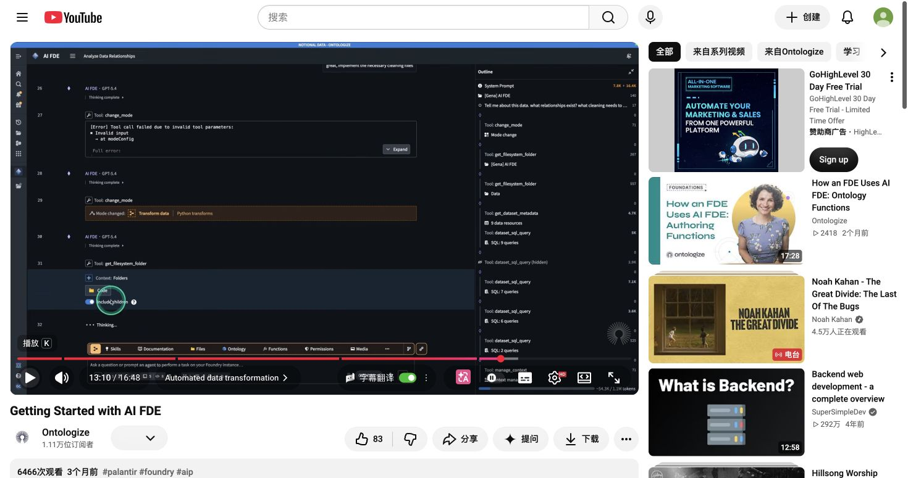

图 20｜Ontologize，Getting Started with AI FDE，13:10（播放器显示总长16:48）。上方是 `change_mode` 参数错误，下方是 Transform data / Python transforms 成功切换和后续读取。2026-10-01取得并亲自视检；保留标题、频道及播放时间，未重绘。仅核验此局部画面，未完整观看或复现流程。[原视频与时间点](https://www.youtube.com/watch?v=Ta19YD794RY&t=790s)

播放器在采集后再次显示播放错误。正常刷新后取得上述可读帧，至此停止重试；原视频的字幕导出返回无可用转写，转写面板没有提供可读文本。因此没有摘录字幕、生成逐字稿或声称旁白已核验，也未使用替代身份或绕过访问限制的方法。

### 12.2 评论仍是使用者个例

Getting Started 评论区也有相反方向的使用信号：[@VentsSansRive](https://www.youtube.com/watch?v=Ta19YD794RY&lc=UgwVrxeKDn2CmlzVmt54AaABAg)（页面“3个月前”）自称非技术使用者并报 mode 切换取消 Workshop tools；[@ajathreya](https://www.youtube.com/watch?v=Ta19YD794RY&lc=Ugz5Big2dnvesmSzAR94AaABAg)（“2个月前”）报 session 变慢；[@GeorgeGorzhiyev](https://www.youtube.com/watch?v=Ta19YD794RY&lc=UgySM_rI7i60EMLCpVR4AaABAg)（“3个月前”）强调学习与操作结合。它们是未核验身份和版本的 C 级自述，不是根因、普遍故障或学习效果统计。

后续补证应优先完整观看 DevCon 5 的函数→评测→修复链，再采管道、PR/preview 和发布状态的实际帧；保存标题、时间点、原页、日期和哈希。无法判读的帧明确标注，不能从旁白、章节或摘要补齐 UI。局部画面与字幕缺口按各自范围使用。

## 13. 与 Pilot、SuperRepo、Evolve、Codex 及 MCP 的边界

### 13.1 产品不是同一层的替代品

| 产品 / 表面 | 主要交付单位 | 与 AI FDE 的关系与证据边界 |
| --- | --- | --- |
| AI FDE | Foundry 原生资源变更与可审阅工作 | 广域平台工程执行面；不是任意业务 runtime 的通用 Agent API 承诺 |
| Pilot（当前 Beta） | Ontology、设计、seed data、React/OSDK app 或 Workshop widget | 专用应用生成体验；共享平台不证明使用相同 harness 或可无缝换会话 |
| SuperRepo（当前 Beta） | Ontology-as-code + functions + React 的 pro-code monorepo、构建 artifact、Marketplace 交付 | 代码组织与交付载体；不是另一个聊天 Agent，完整 AI FDE 组件支持矩阵未知 |
| AIP Evolve（2026-09-08 GA） | 目标、验证、约束驱动的优化提案和 agent activity | 组织 AI FDE agents 迭代改善，需评测和审阅而非随意自优化 |
| AIP Analyst | Ontology 数据探索、查询、图和分析结果 | 分析面；发现问题/形成计划不等于工程变更已完成 |
| AIP Assist | 平台帮助和文档支持 | 问答入口与操作型 Agent 应分别核对能力 |
| Codex 等外部 coding harness | 代码工作区的任务及工具调用 | 可通过 MCP 接入平台；身份、工具范围、模型合同与运行环境另有边界 |

前六项依据：[AI FDE](https://www.palantir.com/docs/foundry/ai-fde/overview)、[Pilot](https://www.palantir.com/docs/foundry/pilot/overview)、[SuperRepo](https://www.palantir.com/docs/foundry/superrepo/overview)、[Evolve](https://www.palantir.com/docs/foundry/aip-evolve/overview)、[Analyst](https://www.palantir.com/docs/foundry/aip-analyst/overview)、[Assist](https://www.palantir.com/docs/foundry/assist/overview)。Codex 边界参见[官方 Codex CLI 文档](https://learn.chatgpt.com/docs/codex/cli)及[Palantir MCP](https://www.palantir.com/docs/foundry/palantir-mcp/overview)。这里没有建立匹配实验，不进行优劣排名。

Pilot 的生成/部署与数据开关详细见[已收录 Pilot](../pilot-2026-09/)。SuperRepo 的本地 OSDK 更新、build/deploy 和 Marketplace 详细见[已收录 SuperRepo](../superrepo-2026-08/)；当前 roadmap 仍把 Python functions、Agent SDK/engine、外部 sources、Automate、data pipelines 列在开发中，不能把愿景当已交付。[SuperRepo 开发中能力](https://www.palantir.com/docs/foundry/superrepo/in-development)

2026-09-29 公告提 functions 的 VS Code workspace 全流程、终端/Codex 支持及看到 AI FDE 仓库编辑；它证明编辑环境的协作，不证明 AI FDE 内部始终运行在 VS Code，也不使 AI FDE 等同 Codex。[9 月公告](https://www.palantir.com/docs/foundry/announcements/2026-09)

OSDK React 模式与统一组件指导之间还有一条直接源码证据：`palantir/osdk-ts` PR #2628 的作者 Leolide 解释，添加 React 组件目录的 `AGENTS.md` 主要是为了让 Pilot / AI FDE 有可用的规范来源，并同意链接正式文档以避免重复。这能证明维护者对 AI 使用指导的设计目的；**不能证明每个 AI FDE / Pilot 产物都必选 `@osdk/react-components`，也不能证明库已经消除设计或交互差异。**统一高码还需检验生成代码实际 imports、主题/布局规则、无障碍、权限与回归。本稿保留这条关联，库的 API、实现和生成反馈另由源码专题深入。[作者原始评论](https://github.com/palantir/osdk-ts/pull/2628#issuecomment-3985012402)

### 13.2 Evolve 把“优化合同”产品化

Evolve 用户指定 target、goal、validation strategy、允许变更和迭代限制，再审查 proposal / agent activity。目标包括模型迁移、成本、延迟、eval 分数或自定义目标；需 AIP、AI FDE 访问及 Marketplace 产品安装。结果可以在 Global Branching 审阅，也可带反馈继续 AI FDE。[Evolve 概览](https://www.palantir.com/docs/foundry/aip-evolve/overview)

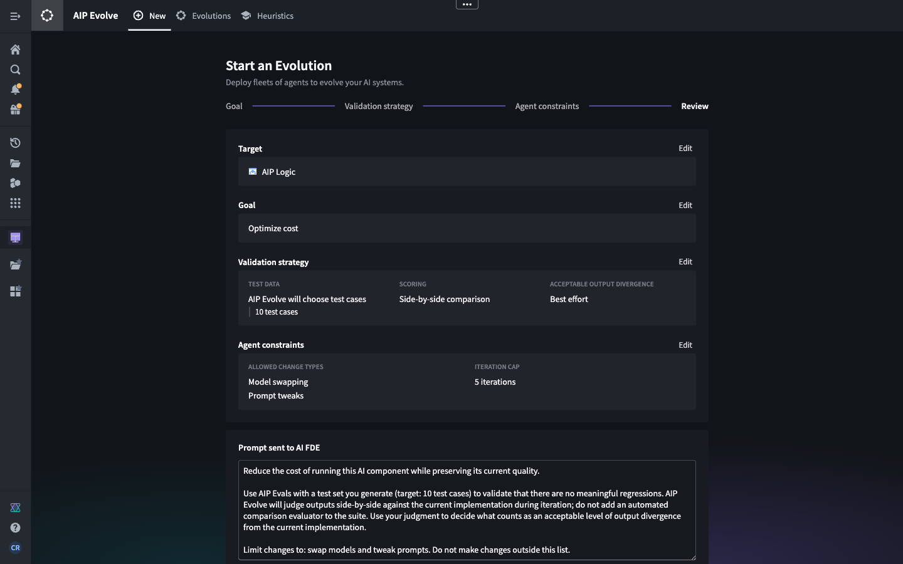

图 21｜Evolve Review 页：目标函数、Optimize cost、10 个 tests、side-by-side、model swapping/prompt tweaks、最多 5 轮。它是官方案例配置，不能当成平台统一上限；底部表示向 AI FDE 发送任务。[来源](https://www.palantir.com/docs/foundry/aip-evolve/overview)

图 22｜Evolve proposal 展示模型替换、65% compute cost 改善、测试及 Review in Branching / Resume with Feedback。65% 是官方示例，不是本轮实测或平均收益。[来源](https://www.palantir.com/docs/foundry/aip-evolve/overview)

Workflow Lineage 描绘被修改系统的资源依赖，Evolve Agent graph 描绘修改过程中的 Agent、goals、insights 和 artifacts。两种图要通过资源/任务标识关联，不能用一个 DAG 同时冒充全部过程和数据 lineage。[7 月公告](https://www.palantir.com/docs/foundry/announcements/2026-07)、[Evolve](https://www.palantir.com/docs/foundry/aip-evolve/overview)

### 13.3 可配置原生工具，不等于任意自定义工具注入

已确认 AI FDE 能写/测用户函数，能配置已有工具和 capabilities；本轮**未确认 AI FDE 本体通用的任意 MCP server / 自定义代码工具注册契约**。“customizable tools”不能直接翻成任意工具注入。也不能把别人询问 API/event 驱动 authoring agent 的社区帖子当成产品明确不支持的证明。[概览](https://www.palantir.com/docs/foundry/ai-fde/overview)、[导航](https://www.palantir.com/docs/foundry/ai-fde/navigation)

Palantir MCP 面向外部 IDE/Agent 的 platform builder；Ontology MCP 面向应用的 objects、actions、query functions 等消费能力，以 application restrictions 控制。Palantir MCP 改类型不等于直接写 Ontology 业务记录；其公开工具清单也不能冒充 AI FDE 原生完整 API。[MCP 概览](https://www.palantir.com/docs/foundry/palantir-mcp/overview)、[工具清单](https://www.palantir.com/docs/foundry/palantir-mcp/available-tools)

MCP 可选 tool search 的公开机制是启动提供 search_tools，按名称/类别/关键词本地匹配激活，不额外调用模型；客户端需支持动态 tools/list_changed，工具保留至重连。该机制有官方说明，但不能强行套成 AI FDE mode 的内部算法。[Tool search](https://www.palantir.com/docs/foundry/palantir-mcp/tool-search)

外部 harness 的数据通道也不同：Palantir MCP 本地开发需管理员启用，工具输出进入相应第三方模型 provider，适用其合同；文档限制更新/删除既有 dataset，并要求 Ontology 变更经 proposal 人审合并。不能沿用平台内 AIP 的全部隐私保证。[MCP security](https://www.palantir.com/docs/foundry/palantir-mcp/security)

## 14. 扩展、模型、容量与持续治理

### 14.1 Skills 与 prefill 是可维护入口

`/workspace/ai-fde/prefill` 接受可选 `prompt`、可重复 `skillRid` 和 `autoStart`。打开链接创建新会话；默认 `autoStart=false` 可先编辑，设为 true 仍遵循同样工具审批。长而稳定的规则放 Skill，本次变量放 prompt；Workshop 可由模块或选中对象的变量构造请求。[Pre-fill sessions](https://www.palantir.com/docs/foundry/ai-fde/prefill-sessions)

例如团队可以维护“先检查数据质量、再提出小范围变更、最后提交证据”的 Skill，从当前模块携带 module RID 启动。但 Skill 不是 backend 授权，不是共享他人会话，不应把密钥、敏感记录或日志正文塞进 URL。本轮未核到 AI FDE 的 Skill 历史版本固定、继承和完整触发算法。AIP Analyst 说明的按需 Skill 加载可作平台设计线索，不能证明 AI FDE 内部算法相同。[Analyst Skills](https://www.palantir.com/docs/foundry/aip-analyst/using-aip-analyst#skills)

9/14 发布记录可确认 Skill menu 键盘交互与预填/Evolve 会话标题的改进；没有据指定资料核到 ML 或 prefill 首次上线日。当前能力和历史发布时间应分栏记录。[Skill menu（9/14）](https://www.palantir.com/docs/foundry/release-notes/2026/#fa68fe10953b155c28317e2a64b8c68bf6b0be87c56ebcd6b02c6adaa9c92196)、[prefill/Evolve 标题（9/14）](https://www.palantir.com/docs/foundry/release-notes/2026/#655f177018e6851c30b3e73c8a8a9aaf2a05490073d4b89e982c6de6824421d8)

### 14.2 模型可替换，平台执行与数据合同仍要核验

AI FDE 有 Anthropic、OpenAI、Google、xAI 的 first-class support 和原生 tool API 支持，模型需 enrollment 启用。Registered models / BYOM 可连接外部 REST、compute module、自托管或代理；用户使用模型不意味着必须获得 backing source 读取权限。[模型支持](https://www.palantir.com/docs/foundry/ai-fde/overview#model-support)、[BYOM](https://www.palantir.com/docs/foundry/aip/bring-your-own-model)

模型更换需要重新验证 tool calling、错误解释、上下文整理、关键任务与成本，不能只看外部 coding benchmark。子代理类别选择和具体模型 ID 控制也要分别看，社区回应不能代替完整官方调度合同。未知项包括统一 step 数、最长运行、最大并发 Agent 数、普通会话 topology 和任务 SLA。

### 14.3 限流和成本不是一个“token 数”

AIP capacity 管理按模型 TPM/RPM，并有 enrollment、project、user 层以及 overrides；文档提醒低于 50K TPM / 10 RPM 可能破坏部分 AIP 功能。这是平台建议值，不是 AI FDE 固定吞吐保证。Dev Tier 限流反馈不可直接外推企业合同。[LLM capacity management](https://www.palantir.com/docs/foundry/aip/llm-capacity-management)

AI FDE 消耗 AIP tokens，换算 compute-seconds 与模型、地区、合同有关；公开价表仅适用部分默认合同。BYOM provider 费用另计，文档说明不显示在 Resource Management 的费用表中。因此任务成本要合并模型、构建/存储、失败重试和人审成本，不能据一个 eval 卡推企业账单。[AIP compute usage](https://www.palantir.com/docs/foundry/aip/aip-compute-usage)、[BYOM costs](https://www.palantir.com/docs/foundry/aip/bring-your-own-model)

官方还警告多会话高频操作会放大存储读写、GPU/compute、网络和容量需求。应测成功任务吞吐、尾部延迟、资源争用、冲突与失败成本，而不是只看单次 demo 很快。[基础设施约束](https://www.palantir.com/docs/foundry/ai-fde/best-practices#consider-infrastructure-constraints)

持续治理建议采用任务类别的准入清单：每次新增工具、Skill、模型或资源类型，重新检查最小权限、数据通道、隔离、副作用、预算、验收与恢复。模板是资产，不能靠一份长期不更新的 prompt 代替版本和回归机制。

## 15. EOS / Workshop：可借鉴机制、分期验证与指标

**本节全部是研究者的设计与试点建议，不是 EOS 现有能力说明，也不是 AI FDE 的实测结果。**样本量、目标值、停止条件需由业务、平台及安全负责人根据任务风险确认。没有证据证明 EOS 已具备相同权限、分支、日志或恢复机制；可先进行只读盘点与人工基线。

### 15.1 先让平台成为可验证的工程工作面

AI FDE 的启发在于将现有资源语义、执行接口、验证和审阅接成闭环。对 EOS，要先明确每种操作的输入、目标、身份、副作用和结果，再让 Agent 选择操作。稳定的资源 ID、明确的 schema、机器可读的失败与可查的异步状态，比增加一个大聊天框更接近可交付能力。

| 借鉴机制 | EOS / Workshop 建议 | 首先需要证明什么 |
| --- | --- | --- |
| 用户身份、backend 权限与工具审批分层 | 记录发起人、实际执行主体、批准人；每次调用鉴权 | 人工入口和 Agent 入口遵守同一数据/操作权限；拒绝后没有副作用 |
| Modes / capabilities | 按调查、管道、模型、函数、界面收敛文档和工具 | mode 切换和工具启用不能扩权；工具可见不等于可调用 |
| 当前资源启动与 prefill / Skill | 从模块、错误页或 schema conflict 带 RID/版本启动；稳定规则单独维护 | 模板权限、内容版本与本次参数可追踪；URL 不携敏感正文 |
| 逐资源分支与 proposal | 输出资源 × 操作 × 隔离矩阵和统一变更清单 | 定义、代码、数据、运行时写入、外部调用逐项验证；分支名不作总担保 |
| preview / CI / Evals | 人建立验收合同，Agent 执行与解释失败 | 独立 holdout 与关键业务测试不被 Agent 改弱；随机任务保留方差 |
| 资源图、执行事件和变更包 | 用 resource ID / run ID 关联依赖、工具事件及最终 diff | 能回答改了什么、执行了什么、验证了什么和还不知道什么 |
| 人工审阅与接管 | 将失败/未知、剩余预算和安全下一步交给负责人 | 接管人能重建实际状态并继续，不需猜聊天过程 |

这些建议对应官方已公开的机制，但“审批绑定参数摘要”“Skill 版本固定”“事件统一标识”是待实现方案，不是 AI FDE 私有实现的已知事实。[官方概览](https://www.palantir.com/docs/foundry/ai-fde/overview)、[Modes](https://www.palantir.com/docs/foundry/ai-fde/modes-and-capabilities)、[安全](https://www.palantir.com/docs/foundry/ai-fde/security-and-governance)、[最佳实践](https://www.palantir.com/docs/foundry/ai-fde/best-practices)

工具注册表可先声明：读/写/创建/删除/执行/发布语义、输入输出 schema、目标资源和版本、执行身份与权限、逐平面隔离、审批范围、幂等/状态查询、补偿前提、预算及证据出口。无法判断副作用或无法查询未知写入结果的工具，不进入自动写入范围。每个写工具应配对读回或验证工具；异步 build/publish 返回 operation ID，而不是只回“成功”。

如果 EOS 使用服务身份、短期委托凭据或异步执行，还要单独核对发起人与执行主体映射、授权期限、撤销与审计，不能照搬 AI FDE 当前 session 的归因结论。附件、日志、数据中的指令不能替代真实人的授权；应在合成环境加入诱导扩大权限、发布或外传数据的负面用例。本报告没有证明 Palantir 或 EOS 对这些用例的保证。

### 15.2 先交付变更包，再扩大自治

一个可审阅任务至少输出：

1. 目标、验收合同、发起/执行/审阅身份，模型、mode、capabilities 与已解析文档/Skill 的版本或摘要。
2. 资源、依赖、base/环境/branch，前后版本与 diff，新建/删除以及共享副作用。
3. 工具请求/结果标识、参数摘要、审批范围、执行状态、重试和预算；记录可核验事件即可，不要求公开模型内部推理。
4. 检查输入快照、预期/实际、修正 diff、独立评测、未测边界，proposal/PR 与待审批步骤。
5. 已成功/失败/未知清单、接管人、安全下一步、不可盲目重试的操作及修复/补偿前提。

包应引用受权限保护的工件，不能为审计额外复制敏感记录和密钥；接管包的查看权限也不能绕过原资源限制。任务状态可从待澄清、计划、执行、验证、待审阅到验收，另有停止/接管状态。工具成功、技术检查通过、业务验收通过分别记录，只有最后一层满足合同才算任务成功。

恢复顺序建议为：暂停新写入 → 核对请求与实际资源状态 → 分类成功/失败/未知 → 判断幂等或补偿 → 授权内修复 → 重跑受影响验收 → 更新交接包。超时不证明操作没有执行；权限撤销不允许继续用缓存；部分成功不允许声称已整体回滚；换模型也不能替代缺失资源或审批。

### 15.3 用同一条合成业务链分期验证

沿用第 7 节设备/工单/备件链，先使用合成数据与公开规则，例如约 1,000 条工单和维表，加入重复主键、空值、未知状态、迟到事件、时区边界、孤立工单和非法状态转换。黄金结果、禁止操作、角色矩阵及 UI 验收由人预先建立；holdout 不出现在 prompt / Skill 中。该规模只是起点，不是性能测试结论。

| 阶段 / 建议样本 | 允许范围与交付 | 进入下一阶段的证据 |
| --- | --- | --- |
| 0：机制盘点与约 12 个任务的人工基线 | 资源/工具/隔离矩阵；人工完成同类任务，记录时间、质量、费用 | 有可查版本/状态、明确恢复途径、独立验收与授权测试环境 |
| 1：约 20 个只读/拒绝任务 | 解释现有资源、诊断错误、提出计划；加入无权、撤销与敏感日志条件 | 正确区分可读与不可读、最小上下文、无未经授权写入，输出可复核发现 |
| 2：约 24 个单资源小改动 | 专用资源上改 transform / function / 小 UI；preview、CI、diff、人审 | 每次写入可读回、审批/证据完整；关键业务断言通过，失败可定位和接管 |
| 3：约 12 个跨资源端到端任务 | 管道→Ontology→函数/Action→React/Workshop；并发 base 变化及故障注入 | 依赖一致、权限正确、数据/外部副作用已核；冲突与部分成功被准确报告 |
| 4：约 8 个受控交付/优化任务 | 授权测试环境发布；固定目标、允许变化、holdout、预算、停止规则；再试 2/4 并发 | 发布状态可核对，负责人审阅；效果未靠削弱验收取得，容量/成本可接受 |

阶段是按证据放开能力，不是日历承诺。每项允许任务配置相邻禁止任务，例如可改测试模块不可改共享模块、可读 schema 不可读记录、可提 proposal 不可自行发布。新建普通资源、Actions、连接/egress 和外部调用逐项审阅，不能因为项目名叫 sandbox 就假定安全。

必要故障至少覆盖：旧 Workshop 配置加载、缺工具或接口覆盖、异步索引未完成、权限/Marking 撤销、写入超时响应丢失、Main 并发变化、CI/业务断言失败、跨资源部分成功、限流、会话中断和预算耗尽。正确停止并交接是安全结果，但不能自动计入任务完成或恢复成功。社区问题用于设计这些路径，不预测当前必然复现。

Evolve 类多 Agent 搜索放在后期：先有稳定基线、可变更/不可变更集合、评分与预算、holdout 和停止条件，再允许模型/prompt/架构搜索。并行不能弥补单任务缺乏资源寻址、权限、验证与证据的问题。

### 15.4 对照方法与指标必须共同定义

建议分人工流程 A、最小 Agent 流程 B、Skill/prefill 流程 C；保持同一权限、任务难度、可用文档、数据与验收合同。使用匹配变体或随机顺序减少学习效应，记录操作者经验和模型/工具/产品配置；适合的非确定任务重复至少两次。准备、prompt、审批、审阅、修补、清理都计主动人力；失败与重试费用也计入总账。

每个实验条件分别统计，样本单位是“任务变体 × 条件 × 独立运行”。`N_start` 为所有启动的普通业务运行（负面安全用例另计），`N_pass` 为按原合同验收且无安全违规的运行；同一次运行内修复不增加分母，独立新运行另计。首次成功、修复后成功、人工接管后成功分别报告；正确拒绝负面用例另用负面样本作分母。不可把失败任务删掉，再报告“成功样本很快”。

| 指标 | 定义 / 应记录内容 | 可讨论的试点门槛（建议，非实测） |
| --- | --- | --- |
| 业务质量 | `N_pass / N_start`；关键断言、审阅人发现缺陷、holdout 与随机性 | 每个发布工件关键断言 100% 通过；任务验收率 ≥90% 可作讨论起点，不能从小样本推 SLA |
| 权限与数据边界 | 实际越权/泄露/无授权执行；拒绝正确率与误拒绝 | 实际越权、泄露、应审未审为 0；不同风险用例分别报告 |
| 审批与可审查性 | 全部应审批且已执行操作的有效批准覆盖；全部已执行写操作的证据、diff、版本、状态可追踪比例，含失败/部分成功/未知 | 两项覆盖均100%；无适用审批记 N/A，不凑分母 |
| 恢复与接管 | 故障后完成业务验收且最终状态一致的运行数 / 注入故障运行数；另记状态判断、无重复副作用、恢复及重建状态时间 | 恢复率 ≥90% 可讨论；正确停止与恢复完成分列，未知结果不得伪称成功；自然故障另报，同一运行多故障不重复计运行分母，事件级另列 |
| 主动人力与墙钟 | 所有尝试的准备/交互/审批/审阅/修补/清理；成功计至验收，失败/停止计至终止，未结束注明截尾 | 匹配任务主动人力下降约20%、成功配对墙钟中位比 ≤0.8 / 尾部比 ≤1.2 可讨论；同时展示全部运行投入、成功率与小样本不确定性 |
| 成本 | 全部模型、失败重试、构建/存储和人工成本除以 `N_pass`；零成功时不可定义该均值 | 每成功任务总成本 ≤人工基线1.2倍可讨论，另核费用预算和收益 |
| 并发与容量 | 每档并发的成功任务/观测时长、p50/p95、排队、冲突、资源和费用 | 2/4 并发关键质量不降；成功率下降≤5个百分点、4并发p95≤单会话2倍可作调查起点 |

样本很少时 5 个百分点、p95 或20%差异未必可靠，须展示原始样本与区间，并按任务类别而非混合均值判断。总体更快可能只因简单任务多；更高吞吐可能带来失败、审阅积压或算力成本。也可追踪澄清次数、接管重建时间、Skill 更新回归与拒绝后再次尝试，定位具体机制而非生成不透明总分。

### 15.5 停止与重新开放要有证据

建议任何实际越权、敏感信息跨边界、应审批无有效批准、未经授权共享/生产修改立即停止受影响执行并核对状态。关键业务失败阻断发布；写入未知且无法查状态、部分成功无获准修复方案、证据/版本缺失，则停止后续依赖步骤并交接。同类失败重试两次仍无新证据可作为有界重试起点；操作副作用越大，规则应越严。

每任务/项目的费用、调用/构建、数据量、时长、并发预算提前确定；耗尽不允许另开会话或改策略绕过。重要模型、Skill、工具、权限或分支机制变化，重跑相关回归与负面用例。恢复后的重新开放要求实际状态、副作用、授权、回归与负责人决定齐备；一次恢复成功不等于全类能力重新获准。

最终扩大范围的决定应列明通过任务、仅草案任务、必须人工任务，适用角色/资源/规模/并发/预算、边界、审阅责任与停止路径。它比“演示成功所以全平台自治”更能回答企业是否应采用。

## 16. 未知项、媒体台账与后续更新

### 16.1 必须实测或向厂商确认的空白

- AI FDE 任意自定义 MCP/tool 注册、sandbox 与审批继承的正式契约；全原生工具 schema 与兼容性承诺。
- Skill 的存储/历史版本固定/继承/触发算法；普通会话子 Agent topology、并行额度和具体模型控制。
- planner、长期记忆、checkpoint、失败重试、浏览器关闭/断网后的 durable execution；统一 steps、运行时、上下文、并发与 SLA。
- 10 月 AI FDE Evals 的准确覆盖矩阵；每种资源的自动 merge/publish 策略和副作用；完整 SuperRepo 支持。
- prompt injection、工具结果/secret redaction 的可测保证；不同 BYOM/外部 harness 的数据合同。
- 代表任务成功率、主动人力、人工修改、总成本、维护性与长周期生产表现的匹配实验。

没有答案不意味着能力不存在；应把每个未知绑定明确问题、目标 enrollment/configuration 和最小测试。不能用“自主”“企业级”自动补齐公开空白。

### 16.2 本轮图像与引用如何复核

主文22张图包括21张由公开 Palantir 文档真实 `img src` 下载的原文件，以及1张来自公开伙伴教程的实际视频帧，均逐张视检；覆盖历史入口、当前会话/上下文/工具、模式、Evals、审批、跨资源审查、权限与发布、Action 外部调用和 Evolve 案例。概念插画不计真实界面图，旧保留期图因与当前正文默认值不一致未采用。图片中的模型、工具数量、功能枚举和具体配置均按图注限定，不升级为统一产品规格。

图片没有翻译、重绘或伪造，中文说明置于图注；不声称本轮客户租户截图。官方图原权利归 Palantir，伙伴视频帧原权利归原视频权利人；公开可读不等于通用再分发许可；此处仅以可归因图像支撑研究讨论。[assets.md](assets.md) 记录来源页、原URL、日期、尺寸、字节、SHA-256、视检与版本注意。[sources.md](sources.md) 记录一手/实践/社区/视频分层与访问边界；[checks.md](checks.md) 记录文件、链接、图像、索引及发布核验。

后续更新优先补完整流程的演示观察、当前 enrollment 的失败路径与验收矩阵，再做真实任务对照。文档/配置、模型、Skills、工具、分支或发布机制变化时，保留历史结论并注明新日期与证据，避免将滚动文档覆盖后的状态当成过去一直存在。
