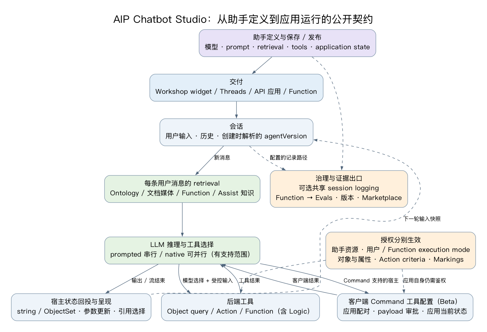
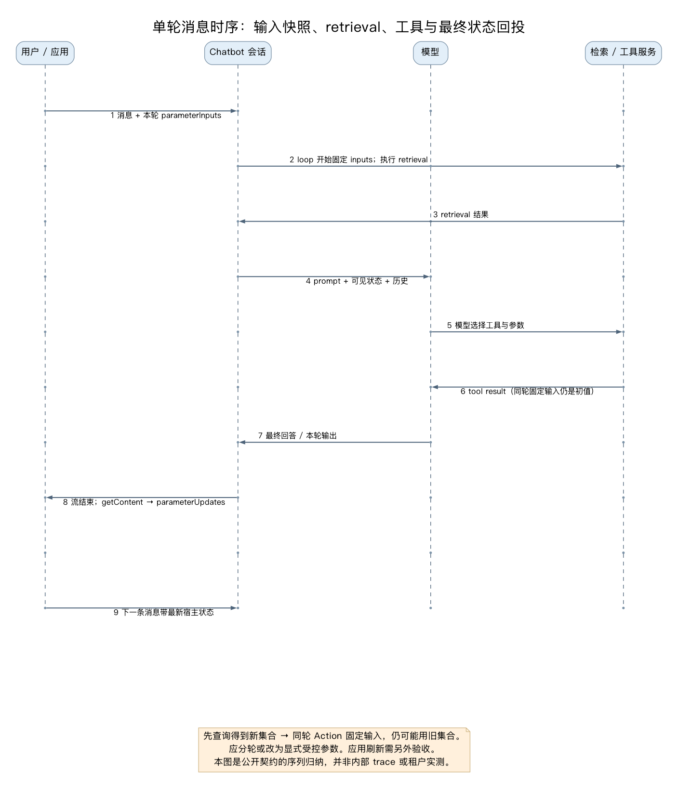
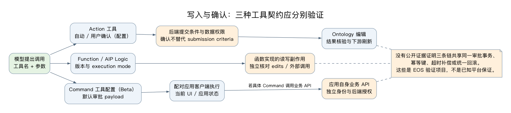
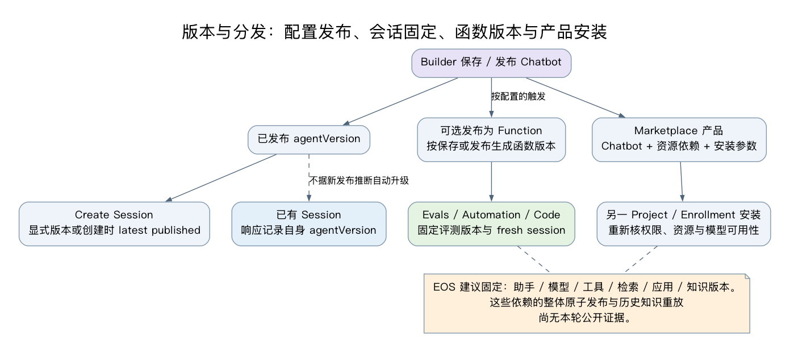

# Palantir 应用内 AI 助手体系：以 AIP Chatbot Studio 为主线

> 状态：研究报告，待用户评审。核验窗口：2026-10-01–02 UTC。主线入口：[AIP Chatbot Studio](https://www.palantir.com/docs/foundry/chatbot-studio/overview/)，原名 AIP Agent Studio。本文基于公开文档、固定版本源码、原始开发者讨论和真实可归因媒体；未登录 Foundry 租户、未运行真实业务 Action、未验证 EOS 当前部署。EOS 对照仅沿用已公开的历史静态基线。

## 1. 结论：助手是配置、数据、工具、会话与应用的组合

AIP Chatbot Studio 是企业助手的构建工作台。构建者定义模型与系统提示词、资料检索、应用变量和工具，助手在 Studio、Threads、Workshop 或自建应用中运行，也可发布为 Function 进入评测与自动化。Workshop Chatbot widget 是其中一条消费通道。官方已经把 Agent Studio / AIP Agents 更名为 Chatbot Studio / AIP Chatbots，公开 API 和部分截图仍保留 `aipAgents`、`agentRid` 等旧名。[概览](https://www.palantir.com/docs/foundry/chatbot-studio/overview/)、[Chatbots as Functions](https://www.palantir.com/docs/foundry/chatbot-studio/chatbots-as-functions/)

从 EOS 应用架构视角，最有价值的机制有六项：

1. **上下文不只是一段 prompt。**检索、模型可见状态、工具的确定性输入与对话历史分别作用；新消息默认执行配置检索，模型再决定调用工具。[Core concepts](https://www.palantir.com/docs/foundry/chatbot-studio/core-concepts/)、[Retrieval context](https://www.palantir.com/docs/foundry/chatbot-studio/retrieval-context/)
2. **应用状态具有输入、输出与引用选择三条接线。**string / ObjectSet 可映射到 Workshop 变量，查询或检索结果能确定性回投；点击引用又可改变选中对象。聊天答复与业务状态更新需分开消费。[Application state](https://www.palantir.com/docs/foundry/chatbot-studio/application-state/)
3. **读对象、写业务、调用函数与操作客户端采用不同契约。**Action 可自动或确认执行，Command 默认审阅 payload，其工具配置能力标 Beta，Function/Logic 的副作用与执行身份必须另外核对。[Tools](https://www.palantir.com/docs/foundry/chatbot-studio/tools/)、[Commands](https://www.palantir.com/docs/foundry/chatbot-studio/commands-as-tools/)
4. **自建 React 接入有公开会话 API，但不会自动得到宿主全部能力。**资源 scope、session 串行、stream 后的完整内容读取、变量回投和确认体验都是集成工作。公开 SDK 未建立任意 React 的通用 Commands dispatcher / approval 契约。[Foundry APIs](https://www.palantir.com/docs/foundry/chatbot-studio/foundry-apis/)、[接入附录](application-integration.md)
5. **可观测性和质量控制已有独立出口。**共享 session logging、Function → Evals、版本与 Marketplace 构成治理链；日志权限不自动继承业务资料敏感度，评测也不能被当成所有外部副作用的通用沙箱。[Session logging](https://www.palantir.com/docs/foundry/chatbot-studio/session-logging/)、[日志权限](https://www.palantir.com/docs/foundry/aip-observability/log-permissioning/)、[Ontology edits evaluation](https://www.palantir.com/docs/foundry/aip-evals/ontology-edits/)
6. **EOS 可以先接已有变量、事件、查询和 Action 机制。**应补状态合同、工具合同、确认与终态回查、版本清单和端到端验收；本稿没有证明 EOS 已具备新增助手能力，也不要求照搬 Palantir 私有实现。[EOS 建议与验收矩阵](eos-architecture.md)

## 2. 阅读地图与证据强度

本正文连接机制与设计取舍。需要具体配置与接口时，继续阅读以下附录：

| 文档 | 内容 |
| --- | --- |
| [构建、知识与工具](build-context-tools.md) | 模型/prompt、知识上游、三类 retrieval、visibility、快照输入、工具模式、Logic 与引用 |
| [应用接入](application-integration.md) | Workshop 现代/Legacy 边界、Commands 配对、API/OSDK、固定源码类型与 React 调用序列 |
| [治理、评测与生命周期](governance-and-lifecycle.md) | 权限/Markings、日志、会话保留、Function/Evals、版本/Marketplace、产品边界 |
| [公开实践与社区线索](public-practice.md) | 时间线、作者关系、实际报错/设计问题、当前资料校准与访问限制 |
| [EOS 架构与验证](eos-architecture.md) | 历史基线、新方案责任边界、验收场景、指标、停止与恢复 |
| [媒体观察](media-evidence.md) | 原始界面与局部视频帧、可见事实、截图版本与案例差异 |
| [来源](sources.md)、[资产](assets.md)、[检查](checks.md) | 逐项出处、时间/尺寸/哈希、完整性/公开HTTP及未执行范围 |

“官方确认”指公开文档描述的能力，仍受配置/租户/版本条件约束；源码仅证明所固定版本的客户端契约；社区/博客是作者在特定时点的经验；图片只证明可见内容。下文标明“分析”“建议”“未知”的部分不升级为产品保证。没有搬运全文、伪造 UI 或完整观看声明。

## 3. 总体架构：六个责任层

*图 D1：研究者依据官方公开契约绘制并实际渲染。不是 Palantir 私有服务拓扑或抓取的运行 trace。[可缩放 SVG](diagrams/01-system.svg)、[可编辑 DOT](diagrams/01-system.dot)。依据：[概览](https://www.palantir.com/docs/foundry/chatbot-studio/overview/)、[Tools](https://www.palantir.com/docs/foundry/chatbot-studio/tools/)、[API](https://www.palantir.com/docs/foundry/chatbot-studio/foundry-apis/)。*

| 层 | 构建/运行职责 | 需要保持的边界 |
| --- | --- | --- |
| 助手定义 | 模型、指令、retrieval、工具、变量、保存/发布 | 资源访问与依赖版本各自管理 |
| 知识与 Ontology | 文档提取/chunk/embedding、对象属性/链接、检索函数 | 原文权限、索引、引用与模型窗口不能合并为一个知识按钮 |
| 会话与推理 | 消息、历史、配置版本、检索与工具控制流 | session状态不等于宿主状态；上下文窗口不等于保留期 |
| 执行能力 | Object query、Action、Function/Logic、Commands | 模型建议、用户批准与服务端授权分别生效 |
| 应用消费 | Workshop 变量与界面、API React、函数消费 | 文字流、结构化输出、客户端执行和业务终态分别处理 |
| 治理交付 | 日志、评测、发布版本、Marketplace 依赖安装 | 日志敏感度、评测覆盖与安装权限需要独立验证 |

这是一套分析分层，不是官方公布的内部组件清单。

*图 M01：官方 Studio 原图可见 FOMC agent、Video Chunk retrieval 和模型/提示配置。保留原字节与旧 Agent 名称；它说明配置工作台结构，不是本轮租户截图。[来源](https://www.palantir.com/docs/foundry/chatbot-studio/overview/)。*

*图 M02：官方 Workshop 原图可见视频选择、播放器与聊天联动。画面使用 `aip_assist.mp4` / PLTR VIDEO AGENT，与 M01 的 FOMC 案例不同；虽然概览文字称同一助手，本研究不把两图当成同配置端到端复现。[来源](https://www.palantir.com/docs/foundry/chatbot-studio/overview/)。*

## 4. 构建与模型：行为由配置及依赖共同决定

Chatbot 是有资源访问控制的 Foundry 文件。构建流程包括选模型、配置系统提示、检索与工具、应用变量，测试后保存和发布；View 可选择配置版本，Usage 可查看会话与反馈。提示词能引用配置的工具/变量，入口还可设置 suggested prompts。模型选择器只是 enrollment 已启用模型的子集，不能把截图中的候选或供应商原生能力推成所有租户均支持。[Getting started](https://www.palantir.com/docs/foundry/chatbot-studio/getting-started/)

*图 M03：真实文档原图显示旧 Agent 名称及 GPT-4o/Claude 3.7 等当时选项，仅用来观察模型选择器；当前模型清单与 native calling 支持范围须以现行文档和租户配置核验。[来源](https://www.palantir.com/docs/foundry/chatbot-studio/getting-started/)。*

模型连接、prompt 和工具模式之间存在条件关系：prompted calling 一次只调用一个工具，兼容全部工具类型及可用模型；native calling 可并行，但限部分 Palantir-provided 模型与 Action/Object query/Function/Update variable 四类。需要 Commands 或 clarification 的流程不能只因模型供应商支持 native tools 就选择此模式。[Tool mode](https://www.palantir.com/docs/foundry/chatbot-studio/tools/#tool-mode)

**分析：**prompt 应定义任务、业务术语与失败/澄清行为；强制授权、允许字段、业务条件和写入去重需要工具及后端合同。模型退役/brownout 会影响依赖工作流，替换模型后需重新评估工具选择和业务结果，不是只换一条模型名。[模型退役](https://www.palantir.com/docs/foundry/model-catalog/model-deprecation/)

## 5. 知识上游、检索与引用

Ontology 文档路线可按“原文 Media set → 文本提取 → chunks → chunk 对象与原文链接 → embedding/vector 属性 → 检索 → 原文引用”理解。chunk 大小、重叠、分隔符影响召回和窗口占用；原文对象关联为引用核对提供基础。向量生成是知识上游工程，Chatbot 是其中一个消费端。[Document processing](https://www.palantir.com/docs/foundry/ontology/document-processing/)、[Semantic search](https://www.palantir.com/docs/foundry/ontology/overview-semantic-search/)

| Retrieval 类型 | 选择策略 | 资料和能力边界 |
| --- | --- | --- |
| Ontology | 固定 N 个对象或语义相关 K 个，可用应用 ObjectSet 缩小范围 | 选择可传给模型的属性；非可打印 media/vector 默认排除；输出与引用可绑定变量 |
| Document | 全文或 relevant chunks | relevant chunks 仍标 Beta，可能需启用；全文会消耗窗口 |
| Function-backed | 每条 query 调自定义 retrieval | 返回 prompt/可选变量，适合自定义检索；当前接口是 TS v1，TS v2 不支持此 interface |

来源：[Retrieval context](https://www.palantir.com/docs/foundry/chatbot-studio/retrieval-context/)。直接以 AIP Logic 编写该 retrieval interface 在当前页面仍写未来能力；现有路径是 TS interface wrapper 调用 Logic。TS v2 本身支持文本语义查询，不代表它已经支持 Chatbot 的特定绑定接口。

*图 M13：可见传给模型的属性配置。它能说明上下文选择面，但不能证明运行用户有权访问所有列或所有对象。[来源](https://www.palantir.com/docs/foundry/chatbot-studio/retrieval-context/)。*

Ontology/Document context 有默认 citation 提示和 UI；其它 context/tool 默认不自动提供，需要构建者配置格式与来源映射。对象引用可开对象页，PDF 引用可开原页，点击引用还可回写一个包含该对象的 static ObjectSet。中文图注与来源说明置于原图之外，未翻译重绘 UI。[Citations](https://www.palantir.com/docs/foundry/chatbot-studio/citations/)

**分析：**引用正确渲染只证明格式被识别，质量验收还要检查原文是否支持命题、用户是否可读、页码/对象是否正确、空命中是否明确。官方资料没有证明 Chatbot Studio 内置完整 hybrid/reranker、知识历史快照或权限撤销后的所有会话/日志清除机制，这些应单独核验。

## 6. 一轮消息：确定性检索、模型工具选择、状态回投

*图 D2：实际渲染的契约时序图，表示普通会话路径及 API 宿主回投；省略多次工具循环。`contextsOverride` 是跳过自动 retrieval 的 API 例外。不是平台内部调度算法或租户 trace。[SVG](diagrams/02-turn-sequence.svg)、[DOT](diagrams/02-turn-sequence.dot)。依据：[Core concepts](https://www.palantir.com/docs/foundry/chatbot-studio/core-concepts/)、[Application state](https://www.palantir.com/docs/foundry/chatbot-studio/application-state/)、[Streaming continue](https://www.palantir.com/docs/foundry/api/aip-agents-v2-resources/sessions/streaming-continue-session)。*

默认每条新消息都会执行配置 retrieval；工具则由模型在 reasoning loop 内按需选择。上下文窗口包含系统指令、历史、检索、应用状态和工具描述，溢出会出错。公开概念页建议新建 session，没有承诺普遍自动压缩历史。[Core concepts](https://www.palantir.com/docs/foundry/chatbot-studio/core-concepts/)

Application state 支持 string / ObjectSet，description 向模型解释变量角色，value visibility 控制模型是否看见值。隐藏 ObjectSet 仍能作为 retrieval 或工具实参；可见字符串也不授予后端权限。“prompt 上下文”与“工具实参上下文”在本文是分析分层，现代 Studio 没有将它们定义为两种独立正式产品。[Application state](https://www.palantir.com/docs/foundry/chatbot-studio/application-state/)

*图 M09：文档固定输入配置，说明变量可直接供 Action/Function 使用。截图助手文字没有声称订单已更新，本研究不以它证明实际写入成功。[来源](https://www.palantir.com/docs/foundry/chatbot-studio/application-state/)。*

关键限制是 **deterministic Action/Function inputs 固定为 loop 开始时初值**。同一 query 中前序工具更新的变量不会传到后续确定性输入；自动输出映射又在模型 streaming 结束时更新宿主。假设用户要求“先找高风险订单，再取消这些订单”，不能默认后一个 Action 使用刚检索的新集合。可以在宿主采用结果、明确选中并确认后发起新轮，或把依赖步骤做成经后端校验的窄业务操作。这是设计建议，不是平台保证该组合会自动修复。[Deterministic tool inputs](https://www.palantir.com/docs/foundry/chatbot-studio/application-state/#deterministic-tool-inputs)

## 7. 工具体系：对象、业务操作、函数与客户端

| 工具 | 主要作用 | 需要核对的机制 |
| --- | --- | --- |
| Object query | filter/aggregate/inspect/link traversal | 配置对象类型/属性、initial ObjectSet、结果到应用变量 |
| Action | Ontology edit | 自动/确认、submission criteria、读写权限、真实提交与刷新 |
| Function | 调 Foundry Function，含已发布 AIP Logic | latest或固定版本、参数、execution mode、实际副作用 |
| Update application variable | 模型选择更新已登记变量 | 类型/作用域/时点，不能冒充业务写入 |
| Command | 一条或多条跨应用操作 | 客户端配对、payload审批、应用当前状态与支持环境 |
| Request clarification | 暂停询问缺失信息 | 澄清结果与后端校验分别成立 |
| Legacy semantic search | 旧 vector tool | 无citation/input-output variables，不返回结果ObjectSet；推荐Ontology context |

来源：[Tools](https://www.palantir.com/docs/foundry/chatbot-studio/tools/)。Function 工具默认采用最新函数，可指定发布版本；固定 Chatbot version 不会自动固定其整个工具实现闭包。

AIP Logic 是输入→blocks→输出的业务编排，既可有确定性块，也可在块内让 LLM 选择工具。Ontology 编辑的发布/Action 消费规则、staged-write 模式与执行身份见[核心附录](build-context-tools.md)。应区分 Chatbot Function 工具、Logic Function 内部 Apply action、Logic-backed Action 这几种入口，不能把“执行了函数”直接写成“所有编辑已落库”。[Logic blocks](https://www.palantir.com/docs/foundry/logic/blocks/#apply-action)、[Staged writes](https://www.palantir.com/docs/foundry/logic/staged-writes/)

## 8. 两类确认与多种写入边界

*图 D3：研究者实际渲染的工具合同对照。Action、Function/Logic 与客户端 Command 分别核验，不推断共有审批事务或回滚。[SVG](diagrams/03-write-boundaries.svg)、[DOT](diagrams/03-write-boundaries.dot)。依据：[Tools](https://www.palantir.com/docs/foundry/chatbot-studio/tools/)、[Commands](https://www.palantir.com/docs/foundry/chatbot-studio/commands-as-tools/)、[Action permissions](https://www.palantir.com/docs/foundry/action-types/permissions/)。*

Action 可配置自动运行或用户确认，后端 submission criteria 决定是否允许执行。对 Action 的编辑权限与提交条件是两件事。行列读取控制不会自动延伸到 Action 写出保护，Markings/CBAC 与业务规则仍需配置。ObjectSet/attachment 参数目前不能直接作 submission criteria；否定型组/Marking条件对 scoped token 存在文档提示的误配风险。确认 UI 解决意图审阅，不能替代这些授权层。[Submission criteria](https://www.palantir.com/docs/foundry/action-types/submission-criteria/)、[Action permissions](https://www.palantir.com/docs/foundry/action-types/permissions/)

Logic 默认 user-scoped，也可 project-scoped；后者按项目权限执行，依赖需导入且调用者仍需相关 Markings。不能把 AI FDE 的身份声明套到 Chatbot 全部 Function/自动化路径。[Execution mode](https://www.palantir.com/docs/foundry/logic/execution-mode-settings/)

*图 M20：实际画面是 Workshop 视频助手与工具输出，Action 结果显示待点击按钮，并提醒不要称动作已执行；不是写入成功截图。原 alt 对应用场景的描述与画面不一致，台账保留这一差异。[来源](https://www.palantir.com/docs/foundry/chatbot-studio/tools/)。*

**分析：**单次 staged execution 的 Ontology 编辑暂存，不等于整个 Chatbot reasoning loop 的事务，更不等于外部通知/webhook可回滚。并行工具、用户确认之后对象变化、超时写入结果未知、取消和补偿仍需对应业务接口验证。工具文本“success”、模型“完成”和读回业务终态应分别存证。

## 9. Workshop：变量联动与 Commands 是不同通道

现代 Chatbot widget 选择 Studio 定义及版本，控制 reasoning展示，映射 application state，再把助手纳入现有筛选、列表、详情与对象操作。Textbox 自动发送等是入口行为。Workshop 页面仍留 Base configuration [Legacy]，其 prompt/tools面板不应被介绍为当前 Studio 的必经构建入口。[Workshop widget](https://www.palantir.com/docs/foundry/workshop/widgets-aip-chatbot/)、[接入附录](application-integration.md)

*图 M12：Studio 应用变量映射到 Workshop变量的真实文档界面。它证明绑定配置面；刷新传播、所有消费者可见时点和持久化需分别验收。[来源](https://www.palantir.com/docs/foundry/chatbot-studio/application-state/)。*

Commands 在用户应用客户端执行，能够访问当前应用状态/屏幕并调用应用声明的操作。工具配置选择一个或多个 Command并提供可由模型填入的 payload；执行前审批默认开启，可关闭。Studio测试通过交互模式配对，Assist/Workshop具有各自配对入口；Workshop Chatbot与 iframe内应用可自动配对。多应用配对、生命周期与支持环境见[接入附录](application-integration.md)。[Commands as tools](https://www.palantir.com/docs/foundry/chatbot-studio/commands-as-tools/)

*图 M22：真实 Approve/Reject 界面。它说明 payload审阅，不证明底层业务 API 已执行或具有某个事务保障。[来源](https://www.palantir.com/docs/foundry/chatbot-studio/commands-as-tools/)。*

Commands配置仍标 Beta；使用它的Chatbot自动采用24小时不活动会话过期。发布为Function后在不支持Commands的环境（例如Automate）会忽略它们。客户端能力不能因“同一助手”就被假定在headless消费中等价存在。[Commands](https://www.palantir.com/docs/foundry/chatbot-studio/commands-as-tools/)

## 10. OSDK / API 自建 React：真实公开路径与边界

公开 API 仍采用 `/api/v2/aipAgents` 路径和旧 `agentRid` 字段。Create session关联调用用户与Chatbot，显式传版本或取创建时最新published版本；同一session不允许并发continue。`parameterInputs`传宿主输入，`parameterUpdates`只更新配置为READ_WRITE的变量；stream返回Markdown，结束后再getContent取得完整exchange。[Create session](https://www.palantir.com/docs/foundry/api/aip-agents-v2-resources/sessions/create-session)、[Blocking continue](https://www.palantir.com/docs/foundry/api/aip-agents-v2-resources/sessions/blocking-continue-session)、[Streaming continue](https://www.palantir.com/docs/foundry/api/aip-agents-v2-resources/sessions/streaming-continue-session)

可验证的接入顺序是：Developer Console声明Ontology/类型和依赖Projects/client operations → 通过公开SDK创建session → 每次发送本轮输入并在客户端串行 → 展示文本流 → 完成后读取exchange并合并变量更新 → 更新业务UI → 错误/取消时回查content和业务状态。新增Chatbot依赖不会自动更新应用scope，必须检查。[Foundry APIs](https://www.palantir.com/docs/foundry/chatbot-studio/foundry-apis/)

*图 M30：Developer Console client operations配置原始媒体。会话write scope不是任意Ontology写权限，依赖资源scope也需配置。[来源](https://www.palantir.com/docs/foundry/chatbot-studio/foundry-apis/)。*

[接入附录](application-integration.md)固定 `palantir/foundry-platform-typescript` commit `4320149c31bcbcc2d176564d9259e343d9702d2b`、`@osdk/foundry.aipagents` 2.82.0，并列出源码签名/REST路径/请求与响应。此版本AIPAgents schema没有公开通用confirm/paused/command continuation字段；这只能支持“不能编造与widget等价的approve/resume代码”，不能据此断言任何API环境绝对没有Commands。源码检查和示意调用未进行租户执行。

## 11. 身份、授权与数据传播

至少要分别检查Chatbot文件权限、用户与token、OAuth/client operations、Ontology对象/属性、Action提交条件、Function源及execution mode、模型访问、media/custom knowledge来源和日志权限。错误可能表现为依赖不存在或无权，而不仅是助手资源不可见。[API资源配置](https://www.palantir.com/docs/foundry/chatbot-studio/foundry-apis/)、[Create session错误契约](https://www.palantir.com/docs/foundry/api/aip-agents-v2-resources/sessions/create-session)、[Function permissions](https://www.palantir.com/docs/foundry/functions/permissions/)

**分析：**前端筛选、变量visibility、tool whitelist和确认按钮各自有价值，均不能替代后端鉴权。Function/project-scoped与异步自动化还需记录实际执行主体。完整权限矩阵与Markings/日志边界见[治理附录](governance-and-lifecycle.md)。

## 12. 会话历史、共享日志与业务审计

Session logging已公开支持提示、消息、工具parsed input/result、变量输出与trace ID，每条用户消息是一条execution；日志schema可变化。工具成功结果将`llm_value`与`variable_updates`分开，final response也可能是client tool call。应把模型消费、宿主更新与业务提交作为不同证据出口。[Session logging](https://www.palantir.com/docs/foundry/chatbot-studio/session-logging/)

日志不会自动继承source executor、输入或访问数据的Markings。管理员应按可能出现的最大敏感度设置log policy；跨用户日志需对应operation/编辑权限、policy及Markings。个人过去24h日志仍需`view-execution-history`operation，通常免log access enablement；CBAC部署仍要求enablement。共享in-platform日志30天窗口不是Chatbot会话TTL。Foundry logs不是audit logs，也无100%投递保证。[Log permissions](https://www.palantir.com/docs/foundry/aip-observability/log-permissioning/)、[Configure logging](https://www.palantir.com/docs/foundry/administration/configure-logging/)

普通会话有限保留与opt-in长期保留的历史版本配置见2025-05公告；不应把Threads model mode默认值套到Studio，也不能把Commands的24h inactivity或个人日志24h写成全部Chatbot默认值。[2025-05官方公告](https://www.palantir.com/docs/foundry/announcements/2025-05/)、[治理附录](governance-and-lifecycle.md)

## 13. 评估：先有Function质量关口，再有宿主端到端验证

Chatbot可配置按每次保存或发布生成Function版本，复用Evals、Automate与代码调用。普通Function新会话应省略`sessionRid`，不能空字符串；Evals测例用`sessionRid=null`，ObjectSet输入用null或真实值，不能空。缺省Function对象集为对应类型base ObjectSet，不是自动带入Workshop当前选择。[Chatbots as Functions](https://www.palantir.com/docs/foundry/chatbot-studio/chatbots-as-functions/)

*图 M27：真实文档评测suite配置。它说明函数进入评测，不证明所有外部副作用均被模拟，也不是本研究运行评分。[来源](https://www.palantir.com/docs/foundry/chatbot-studio/chatbots-as-functions/)。*

Evals user-scoped默认以发起人权限运行；project-scoped仍Beta，依赖需导入项目，结果权限/持久化不同。Ontology simulation文档明确保护其所描述的Logic Ontology编辑，但没有证明全部Chatbot传递调用、Commands、外部HTTP/通知都自动拦截或回滚。[Run suite](https://www.palantir.com/docs/foundry/aip-evals/run-suite/)、[Ontology edits](https://www.palantir.com/docs/foundry/aip-evals/ontology-edits/)

**建议：**分开评测检索/引用、回答、tool选择/参数、业务读回；再测Workshop/React变量回投、批准/拒绝、Commands配对、取消、scope和刷新。Function评分通过不替代应用体验与授权负例通过。合成资料中的恶意指令、权限撤销、对象变化与未知写入结果应纳入负面用例。

## 14. 版本发布与Marketplace

*图 D4：实际渲染的发布合同归纳。session关联创建时的配置版本，Function版本与Marketplace安装是其它轴。[SVG](diagrams/04-release.svg)、[DOT](diagrams/04-release.dot)。依据：[Create session](https://www.palantir.com/docs/foundry/api/aip-agents-v2-resources/sessions/create-session)、[Functions](https://www.palantir.com/docs/foundry/chatbot-studio/chatbots-as-functions/)、[Marketplace](https://www.palantir.com/docs/foundry/chatbot-studio/marketplace/)。*

保存、发布、现有session、引用Function版本、模型与知识数据版本不应合成一个“latest”。Function工具默认latest尤其可能让固定Chatbot配置仍发生行为变化。公开资料没有证明整个依赖闭包原子发布或历史知识快照重放。[Tools](https://www.palantir.com/docs/foundry/chatbot-studio/tools/)

Marketplace能包装Chatbot及依赖，供其它Project/enrollment安装，并配置参数/依赖映射。媒体依赖会包装整个media set，包括Chatbot未用条目；不能假设只分发模型选中的文档。Assist agent有公开排除项，安装模型可用性、资源/函数权限和敏感媒体需要分别检查。[Marketplace](https://www.palantir.com/docs/foundry/chatbot-studio/marketplace/)、[治理附录](governance-and-lifecycle.md)

## 15. 与其它AIP产品的边界

| 产品 | 主要任务/产物 | 与应用内Chatbot的关系 |
| --- | --- | --- |
| Chatbot Studio | 构建者配置企业资料、工具、变量与可分发助手 | 主线运行助手定义与消费契约 |
| AIP Analyst | ad-hoc分析、搜索资料、Skills、保存analysis；也能调用Function和Action | 不能称只读；按分析工作流与配置方式区分，亦可嵌入应用 |
| AIP Assist | 默认平台操作知识与产品帮助 | 默认不访问业务数据；自定义来源/Chatbot扩展可另接Ontology和工具，需独立授权 |
| AI FDE | 在Foundry工程环境构建/修改资源与代码，分支/审阅/验证 | 工程创作Agent的审批与branch机制不能套给Chatbot业务运行 |
| Pilot | 生成React/OSDK应用或widget及相关Ontology产物 | 应用创建/交付，不等于已配置运行助手 |
| AIP Evolve | 以目标、评测、预算等约束迭代应用/方案 | 质量/搜索工作流，不是单个聊天面板或统一runtime协议 |

依据：[Analyst capabilities](https://www.palantir.com/docs/foundry/aip-analyst/capabilities/)、[Assist overview](https://www.palantir.com/docs/foundry/assist/overview/)、[AI FDE](https://www.palantir.com/docs/foundry/ai-fde/overview/)、[Pilot](https://www.palantir.com/docs/foundry/pilot/overview/)、[Evolve](https://www.palantir.com/docs/foundry/aip-evolve/overview/)。更精确的能力重叠与自定义Assist例外见[治理附录](governance-and-lifecycle.md)；已有[AI FDE研究](../ai-fde-2026-10/README.md)和[Pilot研究](../pilot-2026-09/README.md)保留原内容。

## 16. 公开实践如何使用

公开讨论提供架构问题与历史变化，不能取代当前官方契约。例如社区从手工日志workaround、催促自动记录，到帖内产品答复回应session logging发布，有明确时间跨度；当前已有日志不能继续写“没有自动日志”。React/OSDK的AgentNotFound、stream工具参数JSON和长对话窗口问题，应分别映射到资源scope、输出契约与会话窗口，不都归为模型不够智能。[公开实践详稿](public-practice.md)

本研究逐条保留作者/日期/关系、原帖是否解决与当前资料校准。博客与伙伴视频只用于公开实现经验或可见工作流，不将其版本、成功率或生产承诺推广。媒体观察区分已见画面与标题/字幕线索；访问失败、没有可用转写或只观察局部时如实记录。[媒体观察](media-evidence.md)、[来源台账](sources.md)

## 17. EOS启示与下一步验证

EOS的公开历史静态基线已经有变量、事件、查询、Action committed与保存发布接线。新的助手可首先作为这些机制的受控消费者：读取所属实例上下文，调用登记工具，回投类型化状态，经已有刷新链呈现结果。本轮没有重读内部代码，不能声称这一建议与当前实现已经相符。[历史EOS对照](../workshop-runtime-2026-10/eos-comparison/README.md)、[固定048108bf提交](https://github.com/501981732/palantir-research/blob/048108bf2f01cacac40f6ef72bf96e37dca686f4/research/workshop-runtime-2026-10/eos-comparison/README.md)

[EOS附录](eos-architecture.md)给出状态合同、工具合同、知识版本、日志/审计分层与完整验收矩阵。优先验证当前对象解释、筛选→列表联动、同轮固定输入陈旧、确认后对象变化、拒绝无副作用、Function隐藏写入、Command配对、流取消、响应丢失、日志权限、知识撤销与版本漂移。质量、成本、延迟和人力都以相同任务/权限/数据的人工基线衡量，不预设提效比例。

## 18. 公开证据尚未回答的问题

- 自建React/REST下Action确认的暂停、批准与恢复协议，以及headless Function的等价交互。
- 任意自建React的通用Command pairing/dispatcher/payload approval协议与支持清单。
- reasoning loop内全部状态更新时点、Object query具体模型schema/截断、native并行写冲突与恢复。
- 整个会话的事务、幂等、跨工具补偿及外部副作用回滚。
- 所有普通Chatbot的当前统一默认retention；按版本/依赖/Commands核验才可下结论。
- 文档chunks Beta的实际租户可用性、检索质量、索引更新/撤销传播与历史快照。
- 固定Chatbot后Function latest、模型和知识变化的整体重放保证。
- Marketplace安装后权限/模型/数据映射的实际跨enrollment验收。

未知不等于产品缺陷或不支持。上述问题限制本稿结论强度，并转为EOS/租户验证用例。完整文件、图片、来源和图件检查见[checks.md](checks.md)。
