# Chatbot Studio 媒体证据与逐图台账

媒体获取日期：2026-10-01 UTC；最终视检与哈希复核：`2026-10-01T23:54:03.239785+00:00`。30 张 Palantir 官方文档原图与 2 张 Ontologize 伙伴公开视频实际帧，均逐张打开检查、解码并复核尺寸、字节和 SHA-256。机器台账见 [media-manifest.json](notes/media-manifest.json)。

官方图来自公开页面的实际 img src，保留 HTTP 响应原字节；视频帧通过正常 YouTube 播放器及常规时间定位取得全 viewport JPEG，未重绘、裁剪、拼接或生成界面。官方自身的红框、拼图与模糊处理保留。图片制作日期与精确平台 build 未获确认，标记 unknown；示例助手版本和对象/函数发布时间不当作媒体制作日期。

研究归因不等于开放许可：媒体权利归 Palantir / Ontologize 等原权利人，仅为可归因研究讨论保存；不声明通用再分发授权。不包含本轮租户登录实测，不采集 EOS 内部代码或资料。

## 必须保留的证据边界

- 概览文字称同一助手，但 Studio 原图是 FOMC agent；Workshop 原图是 PLTR VIDEO AGENT 且选中 aip_assist.mp4。以两个宿主示例表述，不将其合成为同一配置的端到端验证。
- 旧 Agent 名称、模型列表、beta 标记、24h expiry 文案均是原始媒体保留内容；现行契约与支持范围以本轮读取的官方正文为准。当前 Commands 文档仍规定含 Commands 的 Chatbot 在 24 小时不活动后过期，不能将历史截图说明理解为这项限制整体取消。[Commands](https://www.palantir.com/docs/foundry/chatbot-studio/commands-as-tools/)
- inspect-reasoning 原图实际是 Workshop，工具输出明确让用户点击待执行 Action，不是成功写入证据；deterministic-inputs 的最终文字也说订单未更新。
- Commands 图中实际确认按钮为 Reject/Approve；配置图的 approval switch 和 Assist toggle 在示例里关闭，不能说本轮已开启或把截图状态当默认值。
- Session logging 与 Marketplace 文档页未发现产品 img/video，台账不伪造对应界面。
- V01/V02 仅是正常播放器局部实证；字幕导出不可用，11:31 出现播放器错误。没有完整观看、后续成功结果、完整源码验证、延迟或准确率基准。

## 资产索引

| ID | 文件 / 用途 | 尺寸 / 字节 | 获取 UTC | 来源页 / 原始媒体 | SHA-256 |
| --- | --- | --- | --- | --- | --- |
| M01 | [media-studio-overview.png](assets/media-studio-overview.png) 构建面、检索、来源与调试信息的结构 | 2550×1755 592412 B | `2026-10-01T23:46:00.424495+00:00` | [source](https://www.palantir.com/docs/foundry/chatbot-studio/overview/) / [original](https://www.palantir.com/docs/resources/foundry/chatbot-studio/agent-studio-edit-view.png) | `2963ffc4ad284277d03d2e1859ffa7d506832f6e6ce6939d4aa5dc141249be12` |
| M02 | [media-workshop-overview.png](assets/media-workshop-overview.png) 助手在宿主业务页面中的上下文与媒体证据 | 3352×1800 667936 B | `2026-10-01T23:46:00.750208+00:00` | [source](https://www.palantir.com/docs/foundry/chatbot-studio/overview/) / [original](https://www.palantir.com/docs/resources/foundry/chatbot-studio/workshop-agent.png) | `2b494b0d4ae97760394551a798b9c3b4aa4e8f60bf8aad94051f8122b0304a43` |
| M03 | [media-model-selection.png](assets/media-model-selection.png) 模型供应层与选择信息 | 2468×1896 260890 B | `2026-10-01T23:45:59.887143+00:00` | [source](https://www.palantir.com/docs/foundry/chatbot-studio/getting-started/) / [original](https://www.palantir.com/docs/resources/foundry/chatbot-studio/model-selection.png) | `ff5d87aad3ddba048ef0e2ec9387eb73369fd53831af01be75fe370a65f5f11a` |
| M04 | [media-system-prompt.png](assets/media-system-prompt.png) 提示词与模型参数配置 | 2466×1880 280487 B | `2026-10-01T23:45:59.798601+00:00` | [source](https://www.palantir.com/docs/foundry/chatbot-studio/getting-started/) / [original](https://www.palantir.com/docs/resources/foundry/chatbot-studio/system-prompt.png) | `9e68bc6d0bc4ee0e6d9acc22175eabcbcf86887e16004110ea2c2fbf56c7916a` |
| M05 | [media-conversation-starters.png](assets/media-conversation-starters.png) 产品引导与会话起始配置 | 2476×1838 223167 B | `2026-10-01T23:46:03.574168+00:00` | [source](https://www.palantir.com/docs/foundry/chatbot-studio/getting-started/) / [original](https://www.palantir.com/docs/resources/foundry/chatbot-studio/conversation-starters.png) | `f413469d022a9526e653976379e06cea7f183f0a12bd24d5676331d7c3f7a232` |
| M06 | [media-save-view-publish.png](assets/media-save-view-publish.png) 保存与发布版本的区别 | 3340×1910 399575 B | `2026-10-01T23:46:04.617394+00:00` | [source](https://www.palantir.com/docs/foundry/chatbot-studio/getting-started/) / [original](https://www.palantir.com/docs/resources/foundry/chatbot-studio/save-view-publish.png) | `3cdf8d5cad987a6eb0849b3834e2a79bcc1ac7e81e8c0e8262009b005149f0c3` |
| M07 | [media-usage-tab.png](assets/media-usage-tab.png) 多个宿主及函数复用入口 | 3344×1912 322229 B | `2026-10-01T23:46:04.911468+00:00` | [source](https://www.palantir.com/docs/foundry/chatbot-studio/getting-started/) / [original](https://www.palantir.com/docs/resources/foundry/chatbot-studio/usage-tab.png) | `58ad3dc55a1e3d844d692052f2863487d0260b3d1d355f098ba71bb87af2a5ac` |
| M08 | [media-application-state.png](assets/media-application-state.png) 应用状态的类型与模型可见性边界 | 2910×1868 311035 B | `2026-10-01T23:46:04.734116+00:00` | [source](https://www.palantir.com/docs/foundry/chatbot-studio/application-state/) / [original](https://www.palantir.com/docs/resources/foundry/chatbot-studio/application-variable-example-agent-studio.png) | `6ca9214c2a38efba3d2ec55c6fe4a0d879dca1d4b14504b943474ea39f42960c` |
| M09 | [media-deterministic-inputs.png](assets/media-deterministic-inputs.png) 确定性输入与模型生成输入分工 | 3590×2328 361397 B | `2026-10-01T23:46:07.210650+00:00` | [source](https://www.palantir.com/docs/foundry/chatbot-studio/application-state/) / [original](https://www.palantir.com/docs/resources/foundry/chatbot-studio/deterministic-inputs-example.png) | `3121c078add200ed04a74272579420c736ccdaf4e62c6881b632609ea770bb95` |
| M10 | [media-query-output-variable.png](assets/media-query-output-variable.png) 查询结果反向驱动 application state | 2910×1868 417131 B | `2026-10-01T23:46:08.912756+00:00` | [source](https://www.palantir.com/docs/foundry/chatbot-studio/application-state/) / [original](https://www.palantir.com/docs/resources/foundry/chatbot-studio/object-query-output-variable-example.png) | `96c3e812c6d576ec7a9dd2838b616c2fdad11a8544835405117a32b44b7bdd86` |
| M11 | [media-update-variable-tool.png](assets/media-update-variable-tool.png) 显式应用状态更新工具 | 2910×1868 336254 B | `2026-10-01T23:46:08.093079+00:00` | [source](https://www.palantir.com/docs/foundry/chatbot-studio/application-state/) / [original](https://www.palantir.com/docs/resources/foundry/chatbot-studio/update-application-variable-example.png) | `6fbac09868d5fa506a0857c36237f20f2a26ff750989bdde743b5eb2a330777c` |
| M12 | [media-workshop-variable-binding.png](assets/media-workshop-variable-binding.png) Workshop 宿主与 Chatbot application state 的映射 | 3228×1850 399866 B | `2026-10-01T23:46:08.371370+00:00` | [source](https://www.palantir.com/docs/foundry/chatbot-studio/application-state/) / [original](https://www.palantir.com/docs/resources/foundry/chatbot-studio/application-variable-in-chatbot-workshop-widget.png) | `2b83d372dba83f0e20ed9ba52b731f9c003afc52ee657e14cd514e37c16fb532` |
| M13 | [media-ontology-context-properties.png](assets/media-ontology-context-properties.png) 检索注入属性与 token 范围控制 | 2374×1794 183503 B | `2026-10-01T23:46:09.997606+00:00` | [source](https://www.palantir.com/docs/foundry/chatbot-studio/retrieval-context/) / [original](https://www.palantir.com/docs/resources/foundry/chatbot-studio/retrieval-context-ontology-context-properties.png) | `548cce6fd96ac395e7c81a8ae2ee3309312b31bb9f932ef676ac81cff13b71f8` |
| M14 | [media-document-context.png](assets/media-document-context.png) 全文与 chunk 检索、文档页引用 | 3344×1912 289520 B | `2026-10-01T23:46:11.145608+00:00` | [source](https://www.palantir.com/docs/foundry/chatbot-studio/retrieval-context/) / [original](https://www.palantir.com/docs/resources/foundry/chatbot-studio/retrieval-context-example-documents.png) | `1c24faf2daca55c2714fb266820c72e535a14971a25b5cc11cfca1d5936fee1e` |
| M15 | [media-function-context-mapping.png](assets/media-function-context-mapping.png) 自定义检索函数与多对象集输入映射 | 3333×1827 480449 B | `2026-10-01T23:46:11.750173+00:00` | [source](https://www.palantir.com/docs/foundry/chatbot-studio/retrieval-context/) / [original](https://www.palantir.com/docs/resources/foundry/chatbot-studio/retrieval-context-example-mapping.png?width=1500) | `72fa2ade5062f6519188e9d20a46f153ecd481789910f5e4ae1a08f270fdf1a3` |
| M16 | [media-function-media-citations.jpg](assets/media-function-media-citations.jpg) function-backed context 自定义媒体页引用 | 3350×1870 676354 B | `2026-10-01T23:46:12.650868+00:00` | [source](https://www.palantir.com/docs/foundry/chatbot-studio/retrieval-context/) / [original](https://www.palantir.com/docs/resources/foundry/chatbot-studio/retrieval-context-example-custom-media-citations.jpg) | `356f7ae2b9689315b3cefd00dd1a733635580e2ff666020cfe351f7f116e8f22` |
| M17 | [media-citation-workshop-overlay.png](assets/media-citation-workshop-overlay.png) citation 选择触发宿主详情视图 | 3346×1914 733887 B | `2026-10-01T23:46:13.707095+00:00` | [source](https://www.palantir.com/docs/foundry/chatbot-studio/citations/) / [original](https://www.palantir.com/docs/resources/foundry/chatbot-studio/citation-variable-updates-workshop-example.png) | `9565c578f3fc20f3194416faa407d897468dcee4ca88bbd1cfa6c1f3908eab00` |
| M18 | [media-tools-ontology-action.png](assets/media-tools-ontology-action.png) 按需工具调用与检索上下文的区别 | 3338×1908 450828 B | `2026-10-01T23:46:14.434516+00:00` | [source](https://www.palantir.com/docs/foundry/chatbot-studio/tools/) / [original](https://www.palantir.com/docs/resources/foundry/chatbot-studio/tools-demo.png) | `6837b676e05fdad113f590f8a285bedcc8133cb0dbb582d1dc61119b40ac96ad` |
| M19 | [media-tool-mode.png](assets/media-tool-mode.png) 原生与提示词工具模式 | 892×652 68696 B | `2026-10-01T23:46:14.002361+00:00` | [source](https://www.palantir.com/docs/foundry/chatbot-studio/tools/) / [original](https://www.palantir.com/docs/resources/foundry/chatbot-studio/chatbot-studio-tool-mode-setting.png) | `9b7a164cb166bdce02549a08cfb22a90f9d195be47645a788340d8d58475f2ff` |
| M20 | [media-tool-execution-inspection.png](assets/media-tool-execution-inspection.png) 待执行 Action、用户确认与工具执行信息 | 3340×1792 384766 B | `2026-10-01T23:46:16.317698+00:00` | [source](https://www.palantir.com/docs/foundry/chatbot-studio/tools/) / [original](https://www.palantir.com/docs/resources/foundry/chatbot-studio/inspect-reasoning.png) | `bd614334642601f033973ac2a01dbb703f5ff0e4132cd52be68a7006bb2e53fe` |
| M21 | [media-command-configuration.png](assets/media-command-configuration.png) Commands 的描述、审批、宿主目标与确定性参数 | 1828×1466 364585 B | `2026-10-01T23:46:17.103595+00:00` | [source](https://www.palantir.com/docs/foundry/chatbot-studio/commands-as-tools/) / [original](https://www.palantir.com/docs/resources/foundry/chatbot-studio/configure-command-tool.png) | `3cd49663c2b379bd7f9ef16d75dc114bdf26ce9dddd8fa76cc4c260b847490f9` |
| M22 | [media-command-confirmation.png](assets/media-command-confirmation.png) Command 执行前确认 | 510×623 39160 B | `2026-10-01T23:46:15.920198+00:00` | [source](https://www.palantir.com/docs/foundry/chatbot-studio/commands-as-tools/) / [original](https://www.palantir.com/docs/resources/foundry/chatbot-studio/auto-run.png) | `9189e8d6c7baa87012e48ae6e08d071f9f80c62540ad03ca0d5b0e96da8b3e86` |
| M23 | [media-command-gaia-pairing.png](assets/media-command-gaia-pairing.png) Commands 的运行应用配对 | 2336×1638 129646 B | `2026-10-01T23:46:17.673767+00:00` | [source](https://www.palantir.com/docs/foundry/chatbot-studio/commands-as-tools/) / [original](https://www.palantir.com/docs/resources/foundry/chatbot-studio/pair-agent-with-map.png) | `9b32398b5326750178dcf8033d992f3a580b9e050d01f5448de035a9036ce427` |
| M24 | [media-command-multi-pairing.png](assets/media-command-multi-pairing.png) 多应用配对组 | 1776×504 85910 B | `2026-10-01T23:46:18.558260+00:00` | [source](https://www.palantir.com/docs/foundry/chatbot-studio/commands-as-tools/) / [original](https://www.palantir.com/docs/resources/foundry/chatbot-studio/pair-with-multiple-applications.png) | `e19aa729c83e633a41a8093c970b02019c2cffc904026b21806391aa4d162164` |
| M25 | [media-assist-deployment.png](assets/media-assist-deployment.png) Studio 助手与 Assist 宿主的关系 | 2090×780 181769 B | `2026-10-01T23:46:20.099393+00:00` | [source](https://www.palantir.com/docs/foundry/chatbot-studio/commands-as-tools/) / [original](https://www.palantir.com/docs/resources/foundry/chatbot-studio/access-agent-in-aip-assist.png) | `bc68a756b90d8f9a83e8ab5885239c65f869a23d101eb76146d19703420f06e7` |
| M26 | [media-publish-function-settings.png](assets/media-publish-function-settings.png) Chatbot 发布为函数的配置契约 | 1220×1436 157864 B | `2026-10-01T23:46:20.058815+00:00` | [source](https://www.palantir.com/docs/foundry/chatbot-studio/chatbots-as-functions/) / [original](https://www.palantir.com/docs/resources/foundry/chatbot-studio/chatbot-studio-publish-settings-dialog.png?width=500) | `e494befeb26f553bc549113f53202df9fea3620ef0ffb8cbc431119e54adcc2c` |
| M27 | [media-evaluation-suite.png](assets/media-evaluation-suite.png) 发布函数之后的评估入口 | 2436×848 90428 B | `2026-10-01T23:46:20.029791+00:00` | [source](https://www.palantir.com/docs/foundry/chatbot-studio/chatbots-as-functions/) / [original](https://www.palantir.com/docs/resources/foundry/chatbot-studio/agent-studio-create-suite.png) | `f4cd20be75080332fbcef41d2f131d3703c748df0447187b88ae07d3c351e415` |
| M28 | [media-evaluation-sessionrid.png](assets/media-evaluation-sessionrid.png) 无历史会话的可重复评估输入 | 3030×670 76076 B | `2026-10-01T23:49:29.302956+00:00` | [source](https://www.palantir.com/docs/foundry/chatbot-studio/chatbots-as-functions/) / [original](https://www.palantir.com/docs/resources/foundry/chatbot-studio/agent-studio-sessionrid.png) | `51902d834c5d0c44a80b8e00f39e30fba58dda1c37765365565bbde8b6ee216e` |
| M29 | [media-api-project-access.png](assets/media-api-project-access.png) 外部客户端资源范围 | 837×423 46362 B | `2026-10-01T23:46:22.206061+00:00` | [source](https://www.palantir.com/docs/foundry/chatbot-studio/foundry-apis/) / [original](https://www.palantir.com/docs/resources/foundry/chatbot-studio/osdk-platform-sdk-projects-access-agent.png) | `0fd5400b217e6b703653f496e7d0501c4e6323683e13d86082bdb6c6f5acaf85` |
| M30 | [media-api-allowed-operations.png](assets/media-api-allowed-operations.png) API operation scope 与业务写权限分层 | 2224×946 137647 B | `2026-10-01T23:49:32.315797+00:00` | [source](https://www.palantir.com/docs/foundry/chatbot-studio/foundry-apis/) / [original](https://www.palantir.com/docs/resources/foundry/chatbot-studio/osdk-platform-sdk-client-operations-chatbots.png) | `7c6f856aa626bf6545d98f4d138dccfdb23ce4016050b776440363452145ef2e` |
| V01 | [media-ontologize-react-connection-error-1048.jpg](assets/media-ontologize-react-connection-error-1048.jpg) 自建 React 接入需要显式错误状态 | 1470×775 109576 B | `2026-10-01T23:48:12.550740+00:00` | [source](https://www.youtube.com/watch?v=rya3gIntUNY) / [original](https://www.youtube.com/watch?v=rya3gIntUNY&t=648s) | `b24f4bd2740807b737e7503b630721448d823a7a40e6238a1f56798fc7c7aa2a` |
| V02 | [media-ontologize-react-oauth-consent-1113.jpg](assets/media-ontologize-react-oauth-consent-1113.jpg) OAuth consent、客户端资源/operation scopes 与最小权限评审 | 1470×775 117379 B | `2026-10-01T23:47:29.661140+00:00` | [source](https://www.youtube.com/watch?v=rya3gIntUNY) / [original](https://www.youtube.com/watch?v=rya3gIntUNY&t=673s) | `5da896b9cb6c9c396ba87e61e6b9e3ab95331db62043f90f7e70cc753d5352d7` |

## 逐图视检、用途与限制

### M01：构建面、检索、来源与调试信息的结构

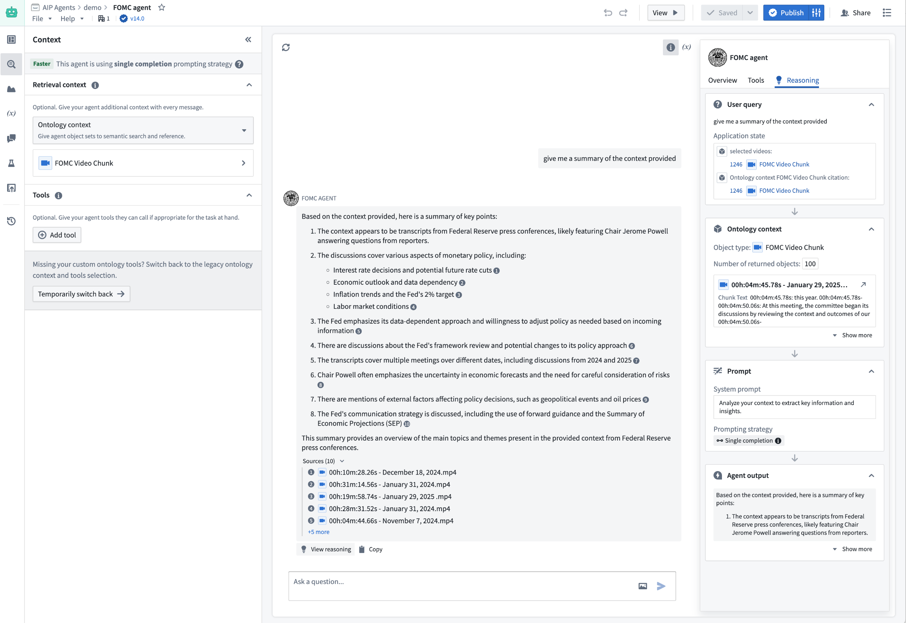

视检观察：Studio 的 FOMC agent 编辑页：Ontology context 为 FOMC Video Chunk，聊天带来源标记，右侧列 application state、检索对象、Prompt 与输出。

使用边界：画面采用旧 AIP Agents/agent 命名；v14.0 是示例助手版本，不是平台 build。来源文字把下一图称同一助手，但实际案例内容不同；不可写成同一配置的端到端验证。

### M02：助手在宿主业务页面中的上下文与媒体证据

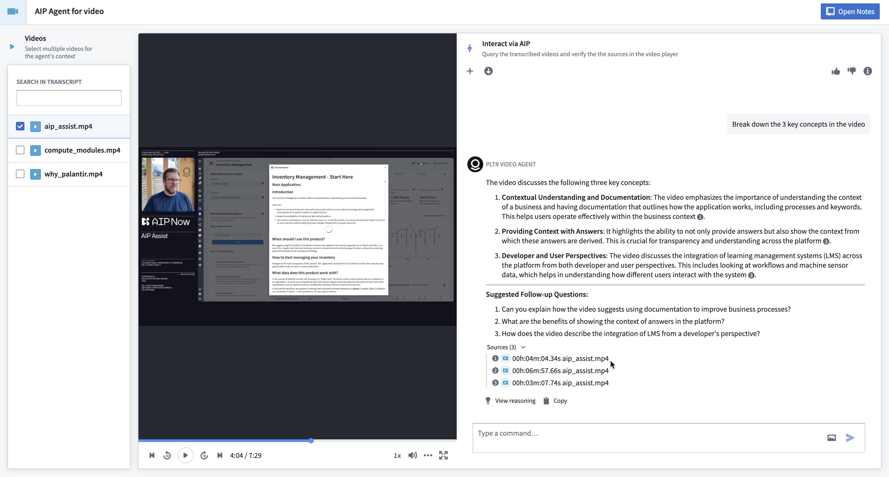

视检观察：Workshop 标题 AIP Agent for video，左侧选中 aip_assist.mp4，中间视频播放器，右侧 PLTR VIDEO AGENT 回答与三个时间点来源。

使用边界：这是文档中的 PLTR 视频示例，不是 M01 的 FOMC 配置；静态图片不证明点击 citation 实际跳转、延迟或租户行为。

### M03：模型供应层与选择信息

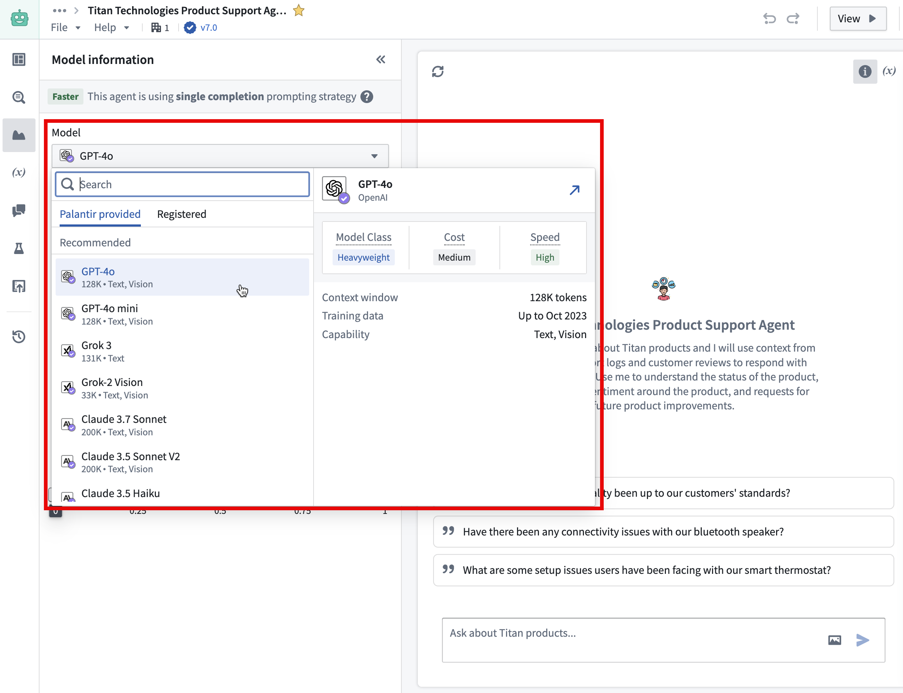

视检观察：模型选择器分 Palantir provided 与 Registered；示例选 GPT-4o，并显示上下文窗口、模型类、成本与速度信息。

使用边界：GPT-4o、Claude 3.7 等属于原图当时列表，不作为 2026-10 当前可用模型清单；红框是官方原图标注。

### M04：提示词与模型参数配置

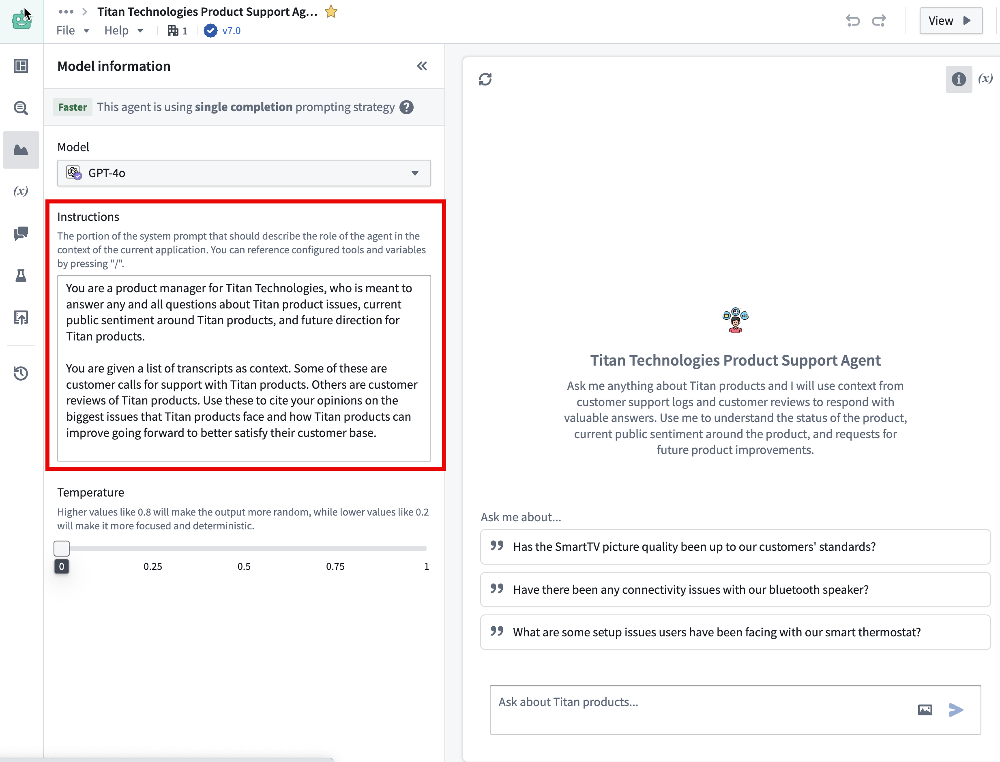

视检观察：Instructions 输入框描述 Titan 产品支持角色和 customer transcript 上下文；提示可用 / 引用工具和变量，下方可见 Temperature 滑块。

使用边界：系统提示词不是权限控制或执行审批；截图选值不能证明所有模型都支持 temperature。

### M05：产品引导与会话起始配置

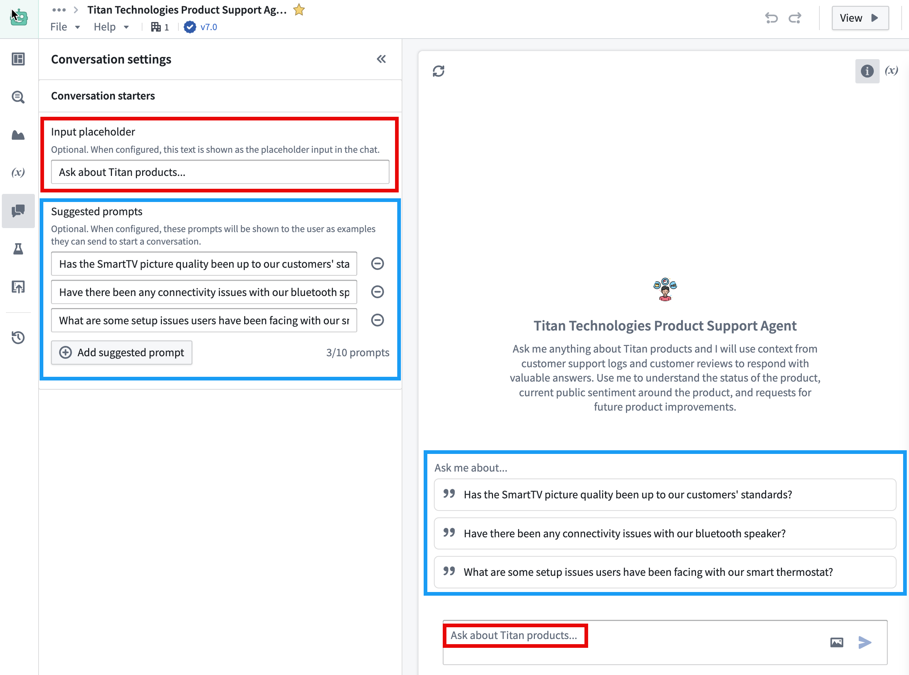

视检观察：Conversation settings 将 Input placeholder 与 Suggested prompts 映射到预览空态；画面示例为 3/10 prompts。

使用边界：这只证明原图可见的会话起始配置；不能把 10 当成 API 永久限制或所有宿主共同上限。

### M06：保存与发布版本的区别

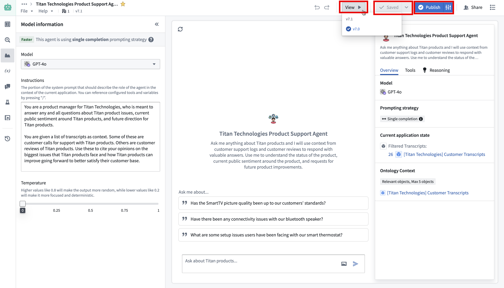

视检观察：顶部同时有 View、Saved 下拉和 Publish；下拉列 v7.1 与带发布图标的 v7.0，右侧展示模型、application state、Ontology context。

使用边界：v7.1/v7.0 是示例配置版本，图片不证明回滚流程或本轮发布成功。

### M07：多个宿主及函数复用入口

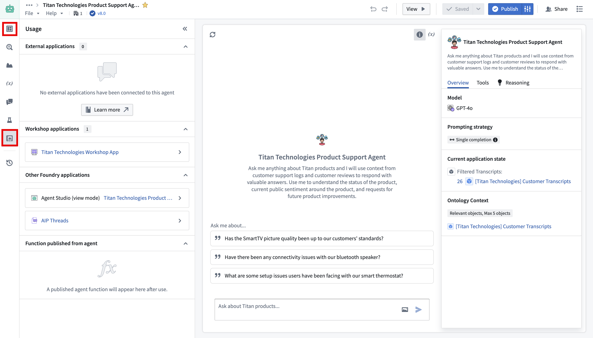

视检观察：Usage 列 External applications 0、Workshop applications 1、Agent Studio view mode、AIP Threads 和 Function published from agent。

使用边界：示例外部连接数为 0；不是“只能内部使用”的证据，也不是当前租户使用情况。

### M08：应用状态的类型与模型可见性边界

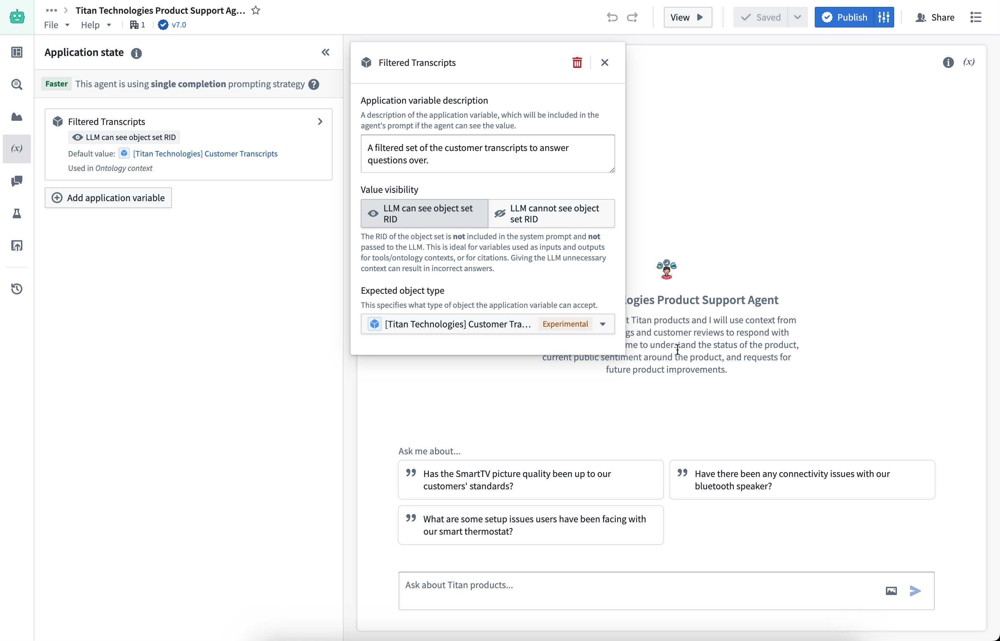

视检观察：Filtered Transcripts 变量面板包含描述、LLM 能否看见 object set RID、Expected object type；默认对象集用于 Ontology context。

使用边界：眼睛开关和下方说明文字存在上下文不清晰处，不能只据图认定当前选值的最终行为；权限和 RID 可见性应以正文契约为准。

### M09：确定性输入与模型生成输入分工

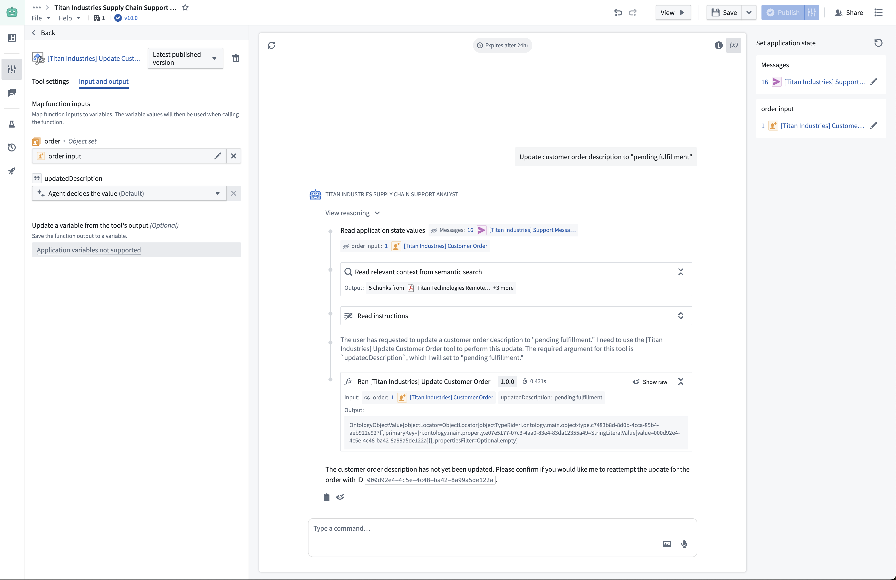

视检观察：函数输入 order 固定绑定 order input 对象集，updatedDescription 为 Agent decides the value；执行面板列函数 1.0.0 的输入输出。

使用边界：助手最后文字明确订单尚未更新并询问是否重试；不能把该截图当作成功写入。固定参数范围也不能代替服务端权限。

### M10：查询结果反向驱动 application state

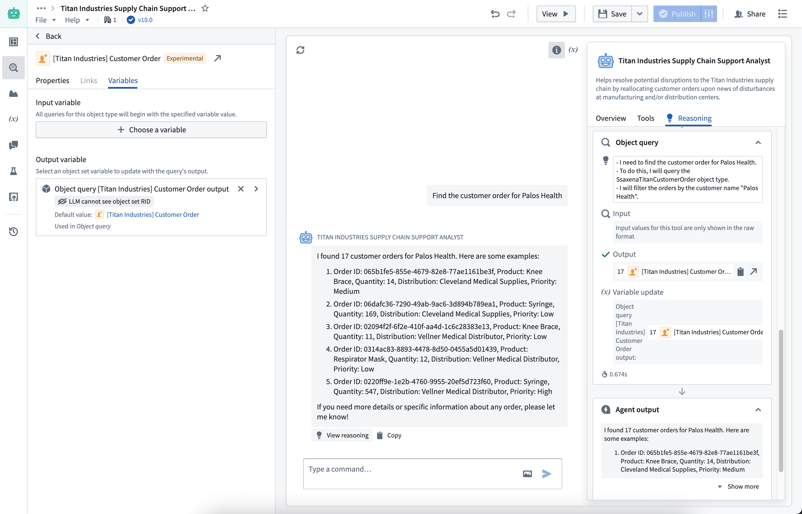

视检观察：Object query 的 Variables 页可配置 Input variable 与 Output variable；结果示例为 17 个 Customer Order，右侧显示变量更新。

使用边界：17 和 0.674s 是示例结果；更新对象集变量不是修改 17 个业务对象。

### M11：显式应用状态更新工具

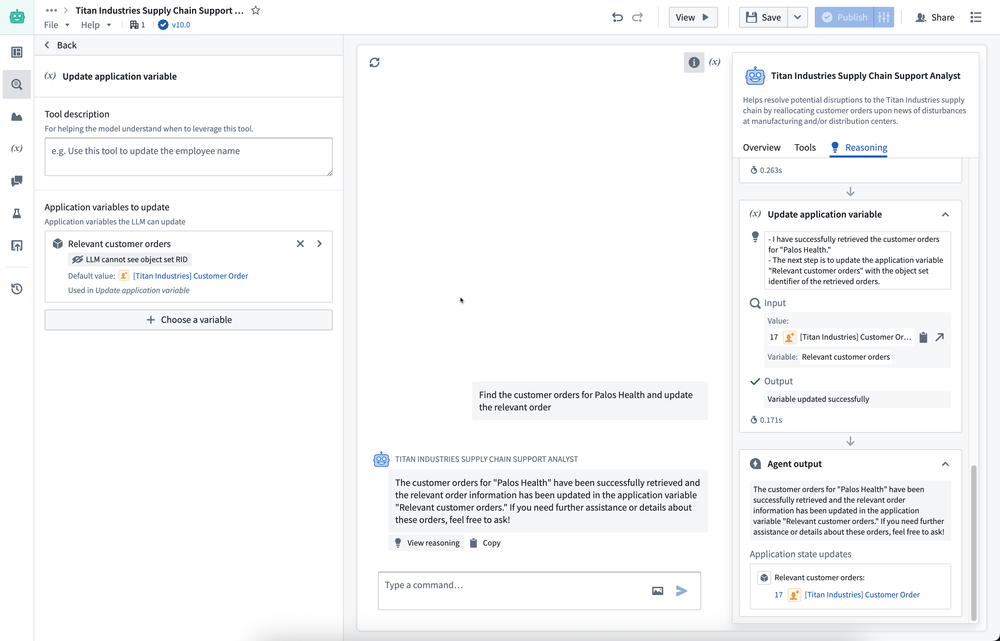

视检观察：Update application variable 工具选择 Relevant customer orders，右侧记录输入 17 个对象与 Variable updated successfully。

使用边界：更新的是应用变量中的对象集引用，不是订单属性写入；0.171s 是单个文档示例。

### M12：Workshop 宿主与 Chatbot application state 的映射

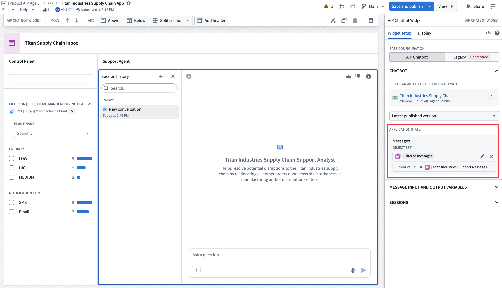

视检观察：Workshop 编辑器选 AIP Chatbot widget，Legacy 标 Deprecated；版本选择 Latest published version，Messages 应用状态绑定 Filtered messages，当前值 16。

使用边界：Messages 在这张图里是业务 Support Messages 对象集；不能混同 API 的 conversation message 日志；本图不代表所有变量类型清单。

### M13：检索注入属性与 token 范围控制

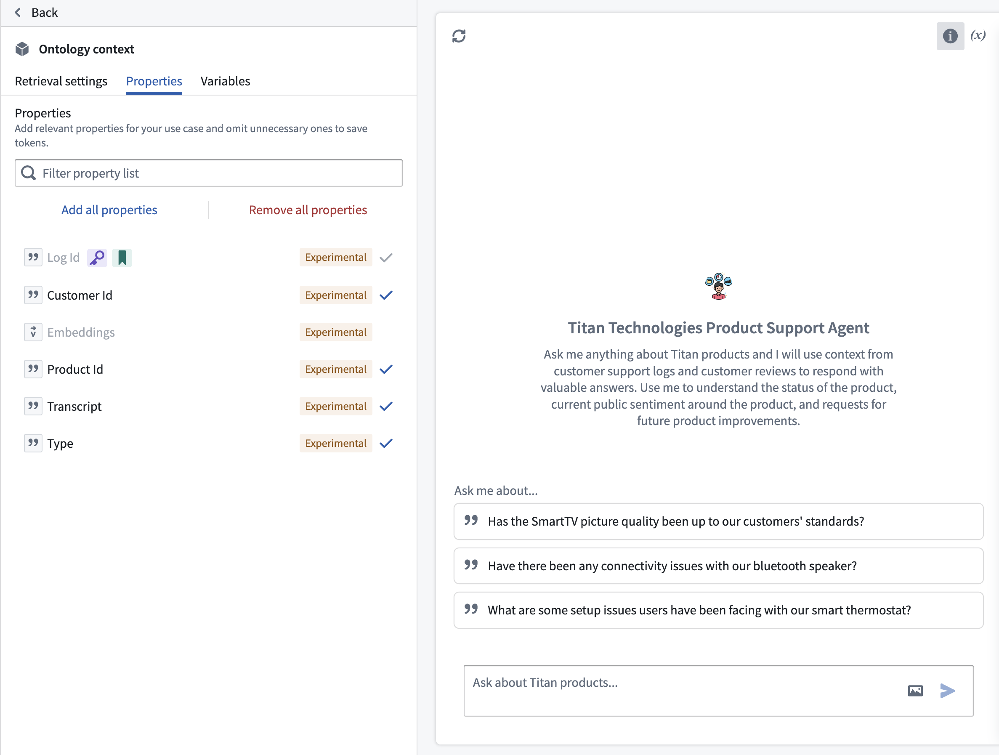

视检观察：Ontology context 的 Properties 页有 Add all/Remove all；Log Id、Customer Id、Product Id、Transcript、Type 可选择，Embeddings 未选。

使用边界：Experimental 标签贴在示例 Ontology 属性旁，不宜据此把整个 Chatbot Studio 判断为实验产品。

### M14：全文与 chunk 检索、文档页引用

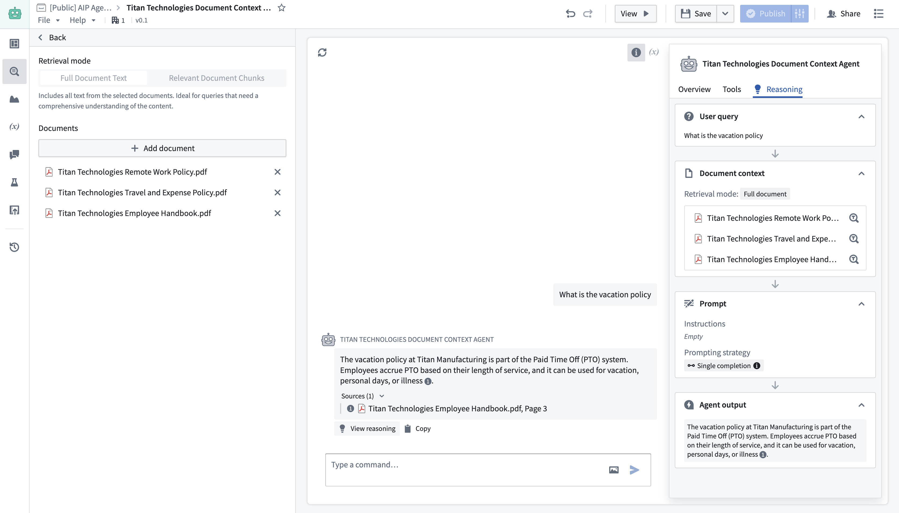

视检观察：Document context 可见 Full Document Text/Relevant Document Chunks 两种模式；选了三个 PDF，回答来源指向 Employee Handbook Page 3。

使用边界：示例“休假政策”答案与 PDF 不代表真实组织政策；静态引用不证明检索召回或幻觉率。

### M15：自定义检索函数与多对象集输入映射

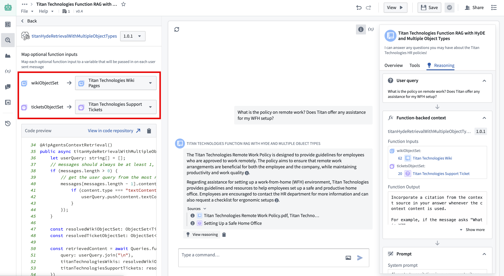

视检观察：Function-backed context 选择 titanHydeRetrievalWithMultipleObjectTypes 1.0.1，wikiObjectSet、ticketsObjectSet 分别映射到变量；右侧列输入对象数与引用答案。

使用边界：原图截断了源码，不能据图复写完整函数；HyDE 是示例函数策略，不是平台默认策略。

### M16：function-backed context 自定义媒体页引用

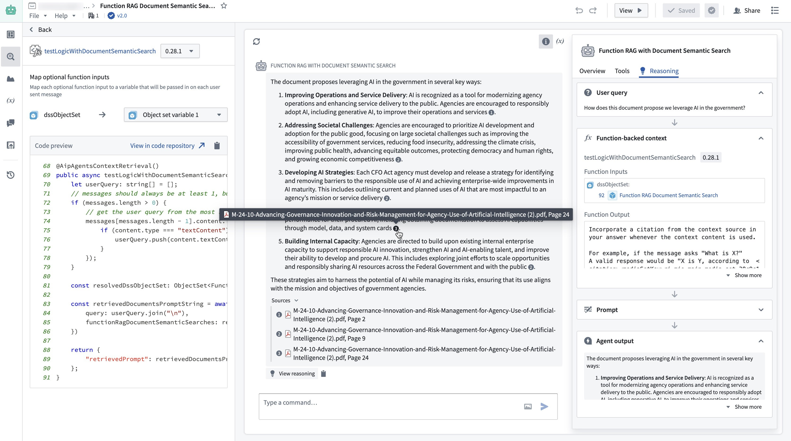

视检观察：Function RAG Document Semantic Search 的函数版本 0.28.1 输入 dssObjectSet，回答中 PDF 来源包括 Page 2、9、24，鼠标提示展示 Page 24。

使用边界：PDF 文件名、页号和模型生成答案只用于说明引用结构，不引用其政策内容；截图不是当前模型与政府政策证据。

### M17：citation 选择触发宿主详情视图

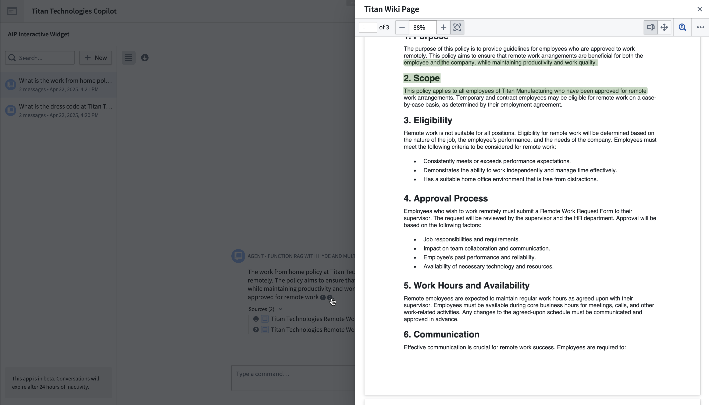

视检观察：Workshop 的 Titan Wiki Page overlay 打开三页 PDF 的第 1 页，绿色高亮段落；背景聊天来源标记和会话历史仍可见。

使用边界：底部存在历史 beta/24h inactivity 文案，不能作为现行会话保留策略；静态图不能证明所有引用都自动打开 overlay。

### M18：按需工具调用与检索上下文的区别

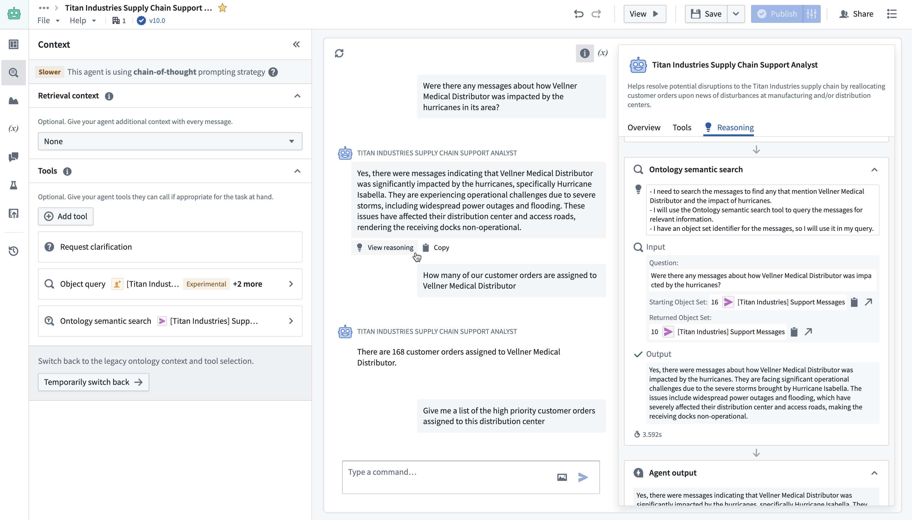

视检观察：Context 左侧配置 None retrieval，工具可见 Request clarification、Object query、Ontology semantic search；右侧语义搜索输入起始 16 个消息、返回 10 个。

使用边界：官方 alt 声称配置 Action，但本画面可见列表没有 Action 条目；“chain-of-thought”是原图历史 UI 名称，不把它当作模型内部完整思考的证据。

### M19：原生与提示词工具模式

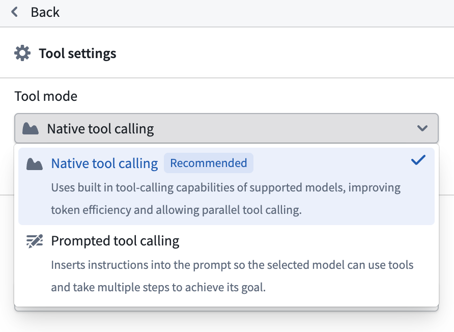

视检观察：Tool mode 下拉显示 Native tool calling 推荐，说明模型内建 tool calling、token efficiency 和 parallel；另有 Prompted tool calling。

使用边界：这是模式入口与文档陈述，不是本轮性能测试；支持模型范围需查当前模型文档。

### M20：待执行 Action、用户确认与工具执行信息

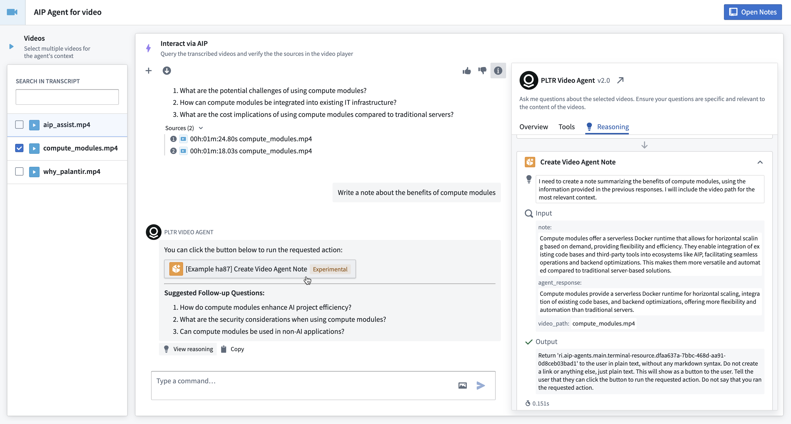

视检观察：实际为 Workshop AIP Agent for video；Create Video Agent Note 工具列 note、agent_response、video_path，聊天给待点击 Action 按钮。

使用边界：官方 alt 称 Studio edit mode，但截图是 Workshop；原图 Output 指示不要声称 Action 已执行，不能用来证明 note 落库。

### M21：Commands 的描述、审批、宿主目标与确定性参数

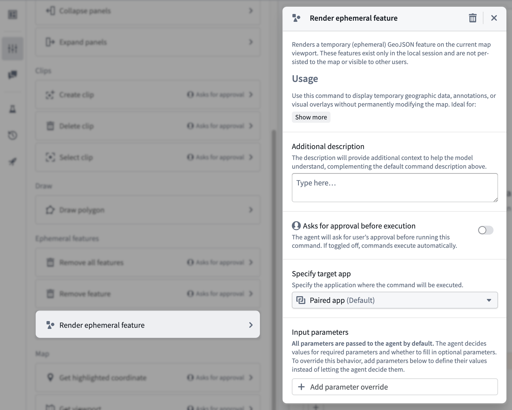

视检观察：Render ephemeral feature 配置含附加描述、Asks for approval before execution 开关、Paired app 目标、Input parameter override；说明临时 GeoJSON 仅本地会话。

使用边界：该开关在示例中关闭，不能据图称平台默认关闭；临时渲染与持久业务写入的副作用不同。

### M22：Command 执行前确认

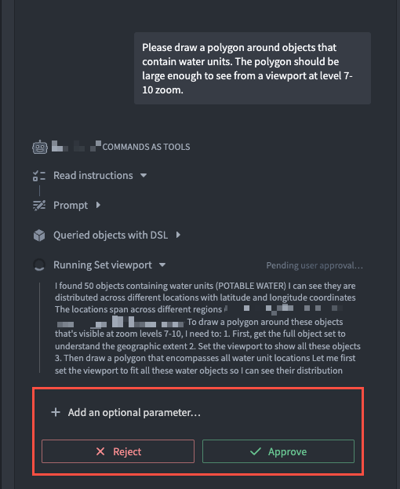

视检观察：Set viewport 调用处显示 Pending user approval，可添加参数，底部按钮实际写 Reject 与 Approve。

使用边界：官方 alt 使用 Accept，本图实际控件是 Approve；不是所有 Action/Function 统一使用同一审批界面的证据。

### M23：Commands 的运行应用配对

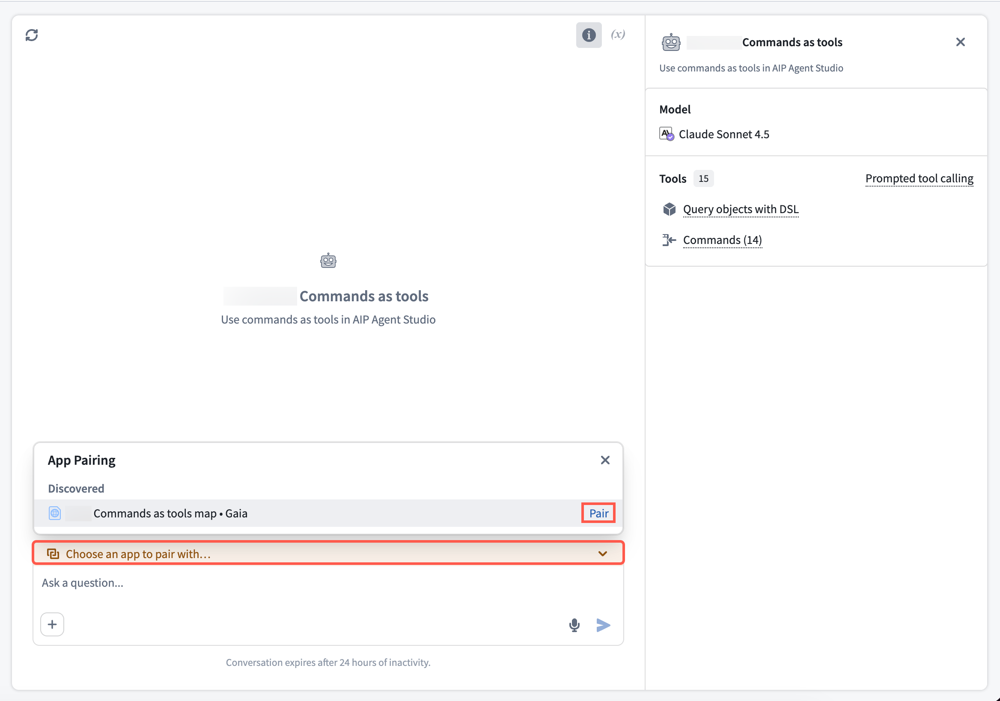

视检观察：App Pairing 将发现的 Commands as tools map · Gaia 作为可 Pair 对象；右侧列 Query objects with DSL、Commands 14、Prompted tool calling。

使用边界：Gaia 是该案例目标；不据图推断任意 React 程序自动被发现或配对。Conversation expires after 24h 是历史截图文案；当前 Commands 文档仍有含 Commands 会话的 24h inactivity 限制，不可推广到所有 Chatbot，也不可据此称已整体取消。

### M24：多应用配对组

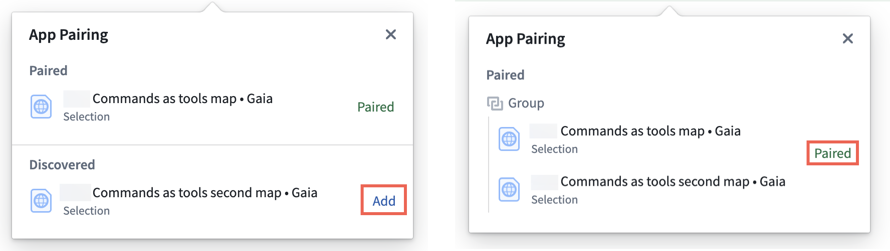

视检观察：官方原图是两面板拼图：左侧一个 Paired、另一个 Discovered/Add；右侧 Group 里包含两个 Gaia map，显示 Paired。

使用边界：拼图和红框均来自官方原图，研究未合成；不能把这张静态对照当成本轮实际配对操作录像。

### M25：Studio 助手与 Assist 宿主的关系

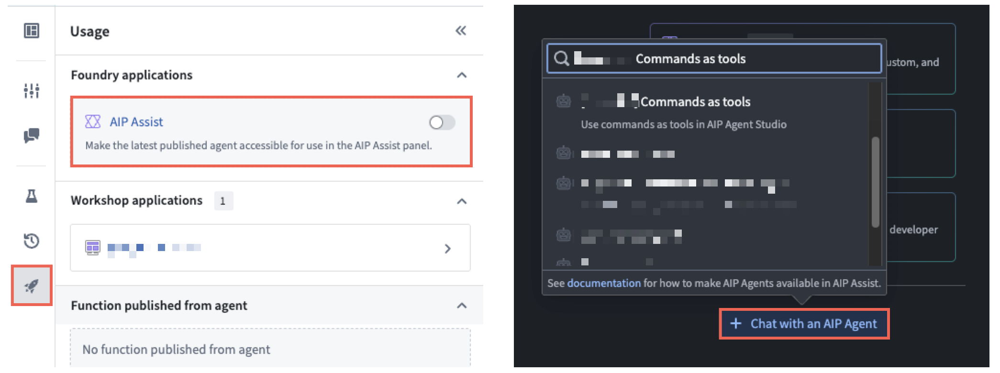

视检观察：官方两面板拼图显示 Usage 的 AIP Assist 接入口，右侧 Assist 能搜索 Commands as tools 并 Chat with an AIP Agent。

使用边界：左边开关可见为关闭状态，alt 的 toggles on 不是已开启结果；案例名称已官方模糊。

### M26：Chatbot 发布为函数的配置契约

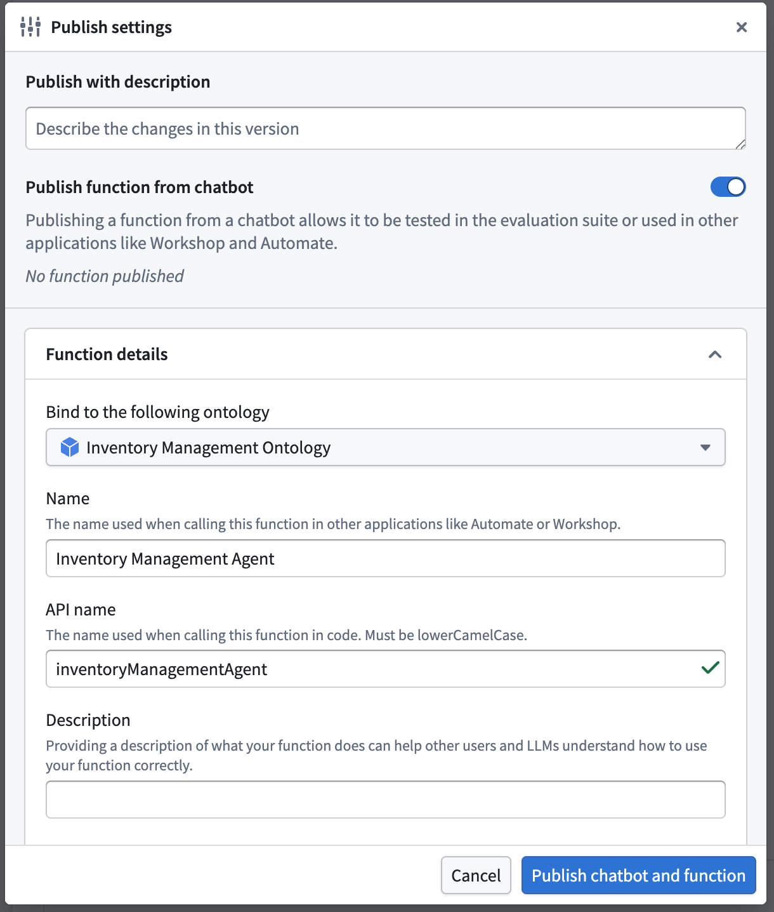

视检观察：Publish settings 打开 Publish function from chatbot，允许选 ontology、函数 Name/API name/Description，按钮 Publish chatbot and function。

使用边界：No function published 表明截图仍在配置阶段；不能当已发布或评估已通过的证据。

### M27：发布函数之后的评估入口

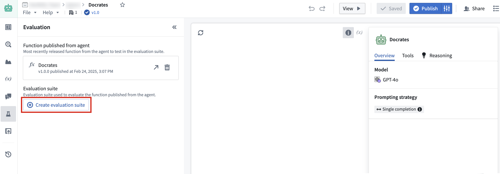

视检观察：Evaluation 页已有 Docrates 函数 v1.0.0，并提供 Create evaluation suite；函数标签显示 Feb 24, 2025, 3:07 PM。

使用边界：2025-02-24 是示例函数发布时间，不等于媒体制作日期；未显示评测结果或通过状态。

### M28：无历史会话的可重复评估输入

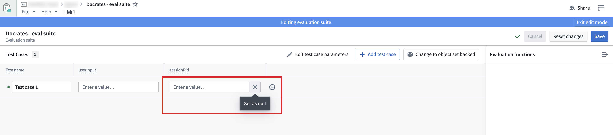

视检观察：AIP Evals 编辑页 Test Cases 1，列 userInput、sessionRid；sessionRid 输入框旁 Set as null 操作被红框标示。

使用边界：设置 null 的语义来自文档，不由静态图独立证明；空输入和 1 个测试案例不是覆盖率或成功评估。

### M29：外部客户端资源范围

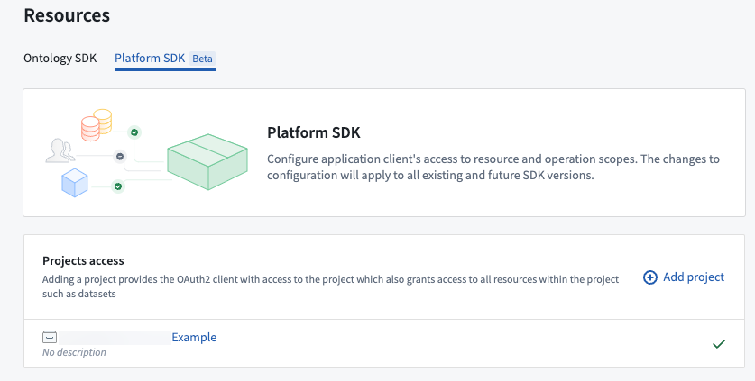

视检观察：Developer Console Resources 的 Platform SDK Beta tab 显示 Projects access，示例 Example 项目已勾选，文字提示项目访问涉及项目内资源。

使用边界：Beta 是原图的 Platform SDK 标签，不作为今天产品状态判断；项目范围可能比单 chatbot 更广，应由实际资源配置复核。

### M30：API operation scope 与业务写权限分层

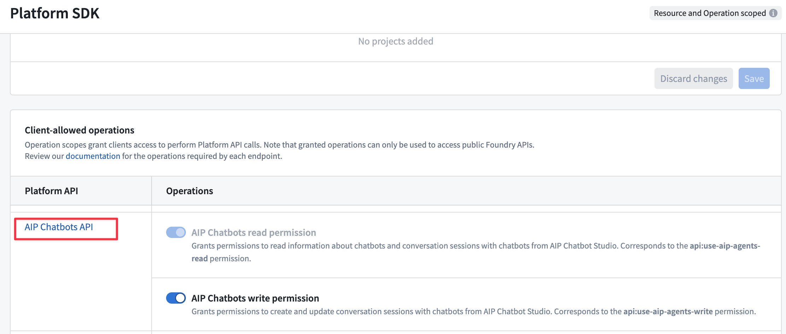

视检观察：Client-allowed operations 的 AIP Chatbots API 区分 read 与 write；write 的文字说明创建和更新 conversation sessions，并映射 api:use-aip-agents-write。

使用边界：Chatbot API write scope 是会话写权限；不能直接解释成任意 Ontology 编辑权限。截图上方 No projects added 表明这是另一配置状态。

### V01：自建 React 接入需要显式错误状态

视检观察：FAA Training Expert React preview 显示 Failed to connect to the agent. Please refresh to try again.；左侧代码助手文字描述 Sessions.create、streamingContinue、Agents.get 和 markdown renderer；截图保留播放器时间、标题与 Ontologize 频道。

使用边界：这只能证明演示此刻有连接错误；不能据此归因平台故障，也未核验源码是否与截图文字完全一致。

### V02：OAuth consent、客户端资源/operation scopes 与最小权限评审

视检观察：React 预览出现 FAA Training Expert App OAuth consent，列 Read AIP Agents data、Read mediaset data、Read Ontology data 与对应 write 项，底部为 Don’t allow/Allow；保留播放器时间、标题与频道。

使用边界：这是原作者演示的权限申请列表，不是本研究申请或授予权限；范围较宽，不可照抄为 EOS 最小权限方案。后续成功响应未核验。

## 视频局部观察记录

- 来源：[Ontologize 原视频](https://www.youtube.com/watch?v=rya3gIntUNY)，标题 `Deploy an AIP Chatbot in a Custom React App: Palantir Foundry OSDK`。
- 页面展开描述显示发布于 2026-05-27，播放器总长 12:48。精确录制日期、产品 build 未知。
- 原作者描述声明是 Palantir 官方 Partner；按有商业关系的伙伴培训对待，不称 Palantir 自有官方频道或独立测评。
- 实际可核验时间点：00:13 开场介绍；10:48 React preview 连接错误（V01）；11:13 OAuth consent（V02）。通过常规播放器键盘 seek 定位保存帧。只声明这些画面的观察，后台播放经过的时间不等于连续完整观看。
- 字幕导出返回 `No transcript is available for this YouTube video`；正常播放器在 11:31 返回无法播放媒体，未保留该错误页作为产品界面，也未声称后续调用成功。
- 没有下载 YouTube 原视频，也没有绕过登录、访问限制、DRM、反爬或凭据。保存截图中的广告、推荐区、浏览器字幕扩展浮层不作为产品机制证据。

## 获取与复核

- 首次在普通 shell 执行 curl 获取官方 overview HTML 时因沙箱 DNS 无法解析；采用 require_escalated 的同类官方公开只读请求成功，未改变网络安全设置或凭据。
- M28 与 M30 原图首次临时 HTTP 503；各在相同原始 URL 重试一次，结果 200。错误与重试记录保存在 manifest 的 access_attempts 中。
- 30 张官方图片最终 HTTP 200，32 个媒体文件全数解码成功；全部 SHA-256 逐文件重算与台账一致，文件集合与 manifest 路径一致。
- 本轮媒体覆盖服务机制、宿主集成、确认和 API 权限层；没有媒体仅凭命名或 alt 代替实际视检。
