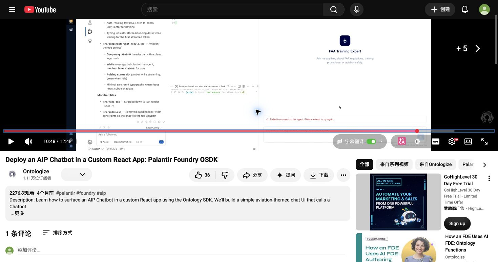
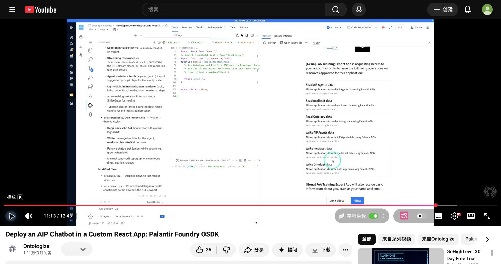

# 公开实践、开发者问题与演进证据

检索日期：2026-10-01 至 2026-10-02 UTC。本文是完整研究的公开实践附录，汇合公开文档、原帖、原作者文章、公开 SDK PR 与媒体取证。没有登录 Foundry 租户、运行产品或访问新 EOS 内部代码。视频仅有明确登记的局部观察，不声称完整观看。公开 GitHub PR 元数据与 diff 通过获准的只读 `gh api` 查询；网页正文通过 Web 工具读取，本研究通过普通公开播放器截图。来源结构化记录见 [practice-sources.json](notes/practice-sources.json)，逐媒体证据见 [媒体取证清单](notes/media-manifest.json) 与 [assets.md](assets.md)。

## 关键结论

**公开实践最有价值的线索，是识别哪些事情应由平台确定性完成，以及哪些产品能力依赖运行环境。** 提示词不是可靠的日志持久化机制；应用变量能改善工具输入，但有明确类型和取值时点；流式回答与工具过程可见性是两个接口问题；Workshop、React 和 Automate 的运行面不能互相替代。

**必须把论坛历史和现行能力分开。** 2024–2025 年的日志、client credentials、Marketplace 变量和确定性输入问题，都有后续发布或修复回复。旧帖不能独立证明 2026 年仍存在同一限制。反过来，产品团队的“即将发布”也不能当成该用户部署已验证成功。

**不能从演示推出容量、记忆或审批保证。** 自建前端中的首 token 延迟、会话超窗、长期保留、真实检索召回、写入确认和发布后的依赖重映射，需要按应用的身份与运行环境分别验收。下文建议属于 EOS 架构分析，不是对当前 EOS 产品的实测结论。

## 案例登记：原作者、日期、关系与解决状态

论坛用户身份按原帖显示名登记；未对真实姓名或雇佣关系作独立认证。“产品答复”表示其在帖子中以团队或产品实现口吻回应，并不是从昵称推定员工身份。日期与解决状态仅覆盖公开可读部分。

| 主题 | 原始问题、作者、日期 | 公开回应与状态 | 使用边界 |
| --- | --- | --- | --- |
| [自动保存聊天](https://community.palantir.com/t/automatically-store-aip-chats/2250) | lxia，2024-12-17；Workshop 用户，关系未知；在 prompt 要求每次调用 Save Chat 工具，模型仍不总调用 | narmbrust，2024-12-19；产品答复，明确这种日志工具既慢又不确定，彼时只有 workaround | 历史需求与反模式；不能据此称今天无日志 |
| [日志与反馈后续](https://community.palantir.com/t/aip-agent-store-chat-log-and-feedback-automatically/5646) | e5b2ec5eb14b5d2897c5，2025-12-09；再次询问何时自动记录 | ClaireR，2025-12-10 说明仍在开发；2026-07-14 回复已发布并给出 session-logging 文档 | 有发布回复和当前文档；未验证所有 enrollment 已配置导出 |
| [只有五个对象却超 token](https://community.palantir.com/t/aip-agent-studio-ontology-context/2833) | 7b34cce42469c527d52d，2025-02-09；把 PDF/DOCX 全文与 embedding 存为对象属性 | ClaireR，2025-02-10 建议检查属性大小、选择传入属性、改为分块；没有原作者确认结果 | 对象数并非上下文预算；原帖不是 embedding 本身必定被打印的证据 |
| [扫描文档](https://community.palantir.com/t/does-aip-agent-studio-support-scanned-document/2663) | Mouhcin，2025-01-28；文档内图片无法回答，问 token 控制、文件类型 | narmbrust 给出预处理/OCR、chunk/embedding、Ontology 或 Function context 路线；无端到端成功回报 | 2025 年接口与 OCR 问题；当时“无 token 限制配置”等不能不复核就写成当前约束 |
| [Workshop 动态媒体](https://community.palantir.com/t/can-i-pass-a-dynamically-pass-a-media-as-context-for-an-aip-agent-from-workshop/4116) | VincentF，2025-06-05；选中对象变化时，希望聊天上下文跟随媒体变化 | ssaxena 要求媒体**内容**已在对象属性，映射 object-set state 到 Ontology context；无结果回报 | 不是直接传 media reference 就能读取内容的保证 |
| [字符串 session 参数](https://community.palantir.com/t/agent-studio-issue-with-session-variable/2795) | jackmiller2003，2025-02-06；`parameterInputs` 放裸字符串报 INVALID_ARGUMENT | 作者同日自解，ClaireR 确认判别联合 `{type:"string",value:...}` | 已解决的请求编码错误 |
| [React Native 参数再现](https://community.palantir.com/t/osdk-agent-stuido-strreaming-api-invalidjson-error-when-passing-string-parameters-via-streaming-api/5497) | maddyAWS，2025-11-21；版本 9.0，把字符串嵌套在 `string` 中，出现 InvalidJson | d801127d29eec26b19b4 的回复先给错例，后明确更正为 `type` 与 `value` 同层；无作者再确认 | 不能照抄第一条回复；也不能把格式错误解释成 READ_ONLY 不接受应用输入 |
| [OSDK 入门和外部语音](https://community.palantir.com/t/osdk-with-aip-agent-studio/3556) | jpa，2025-04-16；想让 ElevenLabs 对 Ontology 提问，找不到 API 的使用方式 | narmbrust 指向完整 API 侧栏；jpa 次日承认原问题未 export function。另提 ingress 假设未解决 | API 路径和函数发布路径需分开；不把用户 ingress 猜测认定为产品根因 |
| [AgentNotFound](https://community.palantir.com/t/getting-agentnotfound-errors-in-trying-to-access-an-agent-in-osdk/4963) | JulioM，2025-09-05；配置 scopes 和 viewer 后仍无法访问 | tompp 提醒 Resources 和 scopes；启用 Agent Studio 后仍无效，作者 09-08 提内部 issue | 公开未解决；不能认定“启用应用即可修好”或“viewer 足够” |
| [子 chatbot 的 client credentials](https://community.palantir.com/t/sub-agent-sessions-are-not-getting-established-when-called-via-osdk/5103) | RajKarri，2025-09-24；父子单独可调，父调子建立 session 失败 | cosmin 09-26 说明当时函数路径限制，09-29 给预建子 session workaround；ClaireR 10-02 说明已加修复并将滚出 | 历史问题有修复通知；未独立确认该部署最终版本 |
| [多轮评估](https://community.palantir.com/t/is-it-possible-to-run-evals-in-the-same-session/4539) | RajKarri，2025-07-19；parallelization=1 仍是不同 session | comew 07-21 建议 TypeScript wrapper 在多个调用中保留 session RID；作者确认有效 | 已确认 workaround；并行度和会话连续性是不同维度 |
| [历史压缩](https://community.palantir.com/t/how-to-compact-history-of-the-session-in-aip-agent/5466) | VincentF，2025-11-17；观察到满窗后旧消息被丢弃，希望 compact | 作者自己提出定期总结、memory_summary 变量、总结函数等方案；无产品发布证据 | 用户观察/自拟方案；不是自动压缩或无限记忆保证 |
| [流式输出但长等待](https://community.palantir.com/t/aip-agent-streaming-api-not-sending-progressive-chunks-in-react-native/5514) | maddyAWS，2025-11-23；Expo/XHR 单 chunk；次日 Flutter 有 38 chunks 但约 14.8 秒才首字节 | jason 11-25 建议 Get Session Trace、检查检索/工具/模型重试；作者仍有 trace 时间字段问题 | 没有统一根因；报告的秒数只是该作者当时测试 |
| [生产负载](https://community.palantir.com/t/monitoring-aip-agents-with-production-load/5711) | peterkrauss，2025-12-18；客户站点压测称 >5 并行后响应恶化 | ssaxena 询问身份/请求规模，说明按部署扩容；缓存答复有条件；后续未给容量结论 | >5 不是平台并发上限；不得变成 SLA 或所有部署基准 |
| [Object Query 结果数量](https://community.palantir.com/t/object-query-used-by-aip-agent-is-limited-to-6-results/4718) | TieCrowdfarming / ddgcarbayo-cf，2025-08-08；看到 6 个结果而链接内更多 | ssaxena 08-15 无法复现；作者 08-26 又称仅 2 个而链接 34 个；公开未解决 | 标题“limited to 6”不是产品规范，原因可能涉及结果打印/显示而非查询集合 |
| [Marketplace 变量](https://community.palantir.com/t/application-state-variable-from-agent-studio-not-being-retained/4721) | RajKarri，2025-08-08；安装后工具变量值丢失，需手工重选再 publish | psangvong 08-11 回复已提交修复，几天后可见；无用户最终确认 | 迁移验收用例；不能继续称现行 Marketplace 不保留变量 |
| [compute module Function](https://community.palantir.com/t/aip-agent-studio-does-not-support-compute-module-functions-as-tools/4448) | CodeStrap，2025-07-10；报 FailedToScopeAgentExecution，自认为已换 retention | jason 指出仍是 indefinite；作者同日确认按正确配置 resolved，并批评 UI 设置误导 | 是 scope/retention 组合与 UI 问题，不是“所有 compute function 无法工具化” |
| [Ontology edit Function](https://community.palantir.com/t/aip-studio-agent-ad-hoc-tool/4953) | AtWorkDS，2025-09-04；TS v1 OntologyEditFunction 直接接 Function tool 受限 | ClaireR 说明应包成 Action type，通过 Action tool；作者 09-05 确认成功 | 已解决的读函数/写 Action 边界；不把 `Function` 名词当写入授权 |
| [Vega 与 Commands](https://community.palantir.com/t/aip-agent-studio-missing-native-vega-tool-but-its-available-in-aip-analyst/6501) | bj8462，2026-04-27；视频有 Vega，本人界面无同样工具 | db1234 指向 Ontology SQL 输出路径；作者 04-28 遇 Commands not found，公开未解决 | 演示路径/应用配对存在上下游依赖；不能把 Analyst 图表能力平移到 Chatbot |
| [父子 chatbot 延迟](https://community.palantir.com/t/aip-agent-calling-other-agents-are-extremely-slow/4529) | RajKarri，2025-07-18；称间接调用 60 秒、直接 7 秒 | jakehop 09 月建议 native calling/wrapper；原作者 09-24 称延迟已大幅收敛，但推测原因 | 整个会话/编排链要测；不能重复旧秒数作当前测量 |
| [AI FDE 编辑 Chatbot](https://community.palantir.com/t/ai-fde-ai-chatbot-studio/6904) | AmineBF，2026-07-07；问可否由 AI FDE 读改 chatbot、工具、retrieval | NicolasDaveau 07-08 追问目的；作者 09-07 补充想用自然语言配置，原帖仍未提供支持承诺 | 不能因同属 AIP 推定 AI FDE 已能编辑所有 Studio 资源 |

## 检索链路：数据准备与模型可见上下文是两个系统

“只有五个对象”一案足以反驳用对象数量估计上下文成本。原帖中的对象来自完整 PDF/DOCX：真正影响 token 的是被打印的属性、每段文本长度、system prompt、历史和工具描述。[原帖 2833](https://community.palantir.com/t/aip-agent-studio-ontology-context/2833)

现行官方文档允许 Ontology context 传固定 N 个对象或语义搜索 Top-K，并可选打印属性；无法打印的 media reference、vector 不会默认打印。Document context 有全文模式与 relevant chunks，后者仍标 Beta。Function-backed context 是自定义混合检索的扩展点，当前接口需 TypeScript v1；直接由 AIP Logic 编写仍是 future，官方建议 TS wrapper 调用 Logic。[Retrieval context](https://www.palantir.com/docs/foundry/chatbot-studio/retrieval-context/)

**架构分析：**检索成功不等于证据充分。语义相似能找到近似段落，却不能替代“全部满足条件的订单有多少”这种精确集合问题。对需要完整枚举/求和/过滤的任务，先用明确的业务查询产生集合或聚合值，再让模型解释；对文档问答，应保留文档、页码、chunk 与原对象关系。检索输出要同时记录“检索范围/过滤条件”和“实际送入模型的片段”，否则结果看上去有引用仍可能漏掉关键证据。

扫描文档原帖把准备链清楚拆成 OCR/解析 → chunk → embedding → Ontology → 上下文。动态 Workshop 媒体原帖也强调**媒体内容**已在对象属性；单独的 media reference 不能从这些帖子推出可直接被读取。[扫描文档](https://community.palantir.com/t/does-aip-agent-studio-support-scanned-document/2663)、[动态媒体](https://community.palantir.com/t/can-i-pass-a-dynamically-pass-a-media-as-context-for-an-aip-agent-from-workshop/4116)

**EOS 可验证建议：**使用一份普通文本 PDF、一份扫描 PDF、一份含图表 PDF 和一个有两种版本的产品记录；为每个答案核对可追踪来源、OCR 质量、版本选取和漏检。对全文/Top-K/混合检索分别测质量和成本。这里是建议测试集，不表示已测试。

## 应用状态：语义输入、确定性输入与身份不能混为一谈

2025 年两个参数错误案例来自不同客户端，最终都指向判别联合，而不是模型失败。应把业务输入的编码和校验放在客户端 SDK/适配层；不要让调用方靠读自然语言 schema 猜 JSON。[2025-02 原帖](https://community.palantir.com/t/agent-studio-issue-with-session-variable/2795)、[2025-11 原帖](https://community.palantir.com/t/osdk-agent-stuido-strreaming-api-invalidjson-error-when-passing-string-parameters-via-streaming-api/5497)

当前 application-state 文档明确 Action/Function 支持由应用变量提供确定性输入，但仅 string/object set，且取 reasoning loop 开始时的变量值；同一轮此前工具更新不改变 pinned input。自动输出变量在 LLM 完成 streaming 后更新。[Application state](https://www.palantir.com/docs/foundry/chatbot-studio/application-state/)

**架构分析：**服务端需要的用户身份、租户、账套和写入目标，不适合让模型从聊天文字重新抽取。`currentUserId` 可作为上下文帮助解释，但用户提供的同名变量本身不应成为权限依据。需要从认证主体解析权限，并在受控工具执行处再次校验目标对象。某变量“LLM 不可见”减少 token 和混淆，却不能使不可信客户端值自动可信。

**反例：**模型先查出订单 B 并改 `selectedOrder`，再调用绑定初值的写入工具；工具可能仍收到订单 A。应把具体写入提案显式绑定业务对象与版本，由确定性步骤验证再执行。这个反例是根据官方取值时点作的设计推演，不是发现的 Palantir bug。

## 会话：持久记录、上下文窗口与多轮评估

2025-02 官方社区 API 介绍仍标 Beta/24 小时、两套 client 的计划状态；该帖的 Python demo 通过 session RID 持续会话，在 streaming 完毕后读取 Content 获得最后 exchange 与 `parameterUpdates`。它是历史代码范例，不能将当时状态等同今天。[Leveling up your AIP agents](https://community.palantir.com/t/leveling-up-your-aip-agents-with-the-palantir-api/2956)

目前 Chatbot as Function 输入可省略 sessionRid 新建会话，并返回该 RID；再次传入继续会话。官方 Evals 设置强调新用例 sessionRid 应为 null，object-set 变量须设为 null 或真实值，不能留空。社区另有 wrapper 保留 RID 做连续评估的成功回报。[Chatbots as Functions](https://www.palantir.com/docs/foundry/chatbot-studio/chatbots-as-functions/)、[多轮评估原帖](https://community.palantir.com/t/is-it-possible-to-run-evals-in-the-same-session/4539)

历史 compact 帖子的“旧消息被丢弃”是用户观察；现行 Core concepts 则写上下文窗口包含 prompt、history、retrieval、state、tools，超出会报错并提示新会话。现有证据不能确认统一的自动压缩策略。[Core concepts](https://www.palantir.com/docs/foundry/chatbot-studio/core-concepts/)、[历史观察与自拟方案](https://community.palantir.com/t/how-to-compact-history-of-the-session-in-aip-agent/5466)

**EOS 可验证建议：**把“保存多久”“模型每次看到多少”“业务任务记忆保存在哪”作为三个独立配置。稳定的业务事实应落在对象/数据库并可纠正；摘要需带来源、更新时间和有界长度。测试同一用户换设备、过期 session、超窗、发布后旧 session、连续纠错等路径。多轮 eval 应固定消息序列与初始状态，并验证每步工具输出/最终业务状态，而非只打分最后一句文字。

## 执行和确认：函数入口不等于纯函数，也不等于通用前端协议

原作者 AtWorkDS 的已解决历史案例针对 TS v1 OntologyEditFunction 直接接 Function tool 的限制，改经 Action type 和 Action tool 后成功；这不概括所有语言、执行模式或函数副作用。社区的“预填大型 Action”问题还展示了用 struct → function-backed action → Markdown diff 供用户审核的实践。这个 diff 方案是 jakehop 的个人实现，不是内置标准 UI。[写函数/Action 边界](https://community.palantir.com/t/aip-studio-agent-ad-hoc-tool/4953)、[预填 Action](https://community.palantir.com/t/can-an-agent-prefill-an-action-in-workshop-for-a-user/4211)

当前 Tools 文档明确 Action 可自动或确认后执行，Function 可调用发布的 AIP Logic，并支持锁定版本。Native tool calling 可并行部分工具，但支持的模型和工具是子集。[Tools](https://www.palantir.com/docs/foundry/chatbot-studio/tools/)

Commands 文档将执行地点写在用户应用，含当前 state/screen；默认要求用户审阅 payload，可关闭；使用 Commands 会自动令会话在 24 小时不活动后失效。函数在 Automate 等不支持 Commands 的环境中执行，会忽略该工具。配置界面仍标 Beta。[Commands as tools](https://www.palantir.com/docs/foundry/chatbot-studio/commands-as-tools/)

**架构分析：**要分别验收“模型提出写入”“用户看懂变更”“确认绑定的具体 payload”“当前主体仍有权写入”“实际结果及失败”。React 接入不能因成功显示 Markdown，就认定已经获得 Workshop 的 Commands 配对、payload 审批或 UI 联动。审批对象应是稳定的结构化业务变更，而非一段可被模型重写的承诺；不经后端授权校验的按钮，也不能补上权限边界。

## 性能与日志：不要用“streaming”掩盖前置工作

React Native/Flutter 原帖经历了两种现象：没有逐块呈现，以及逐块呈现但前置等待长。后者说明完整请求可能先做多轮模型/工具工作，客户端看到文字才开始流。帖子没有证明具体服务端根因，也没有提供今天的 SLA。[流式与 TTFB 原帖](https://community.palantir.com/t/aip-agent-streaming-api-not-sending-progressive-chunks-in-react-native/5514)

生产负载原帖的 “>5 并行恶化”仅是该应用压测观察，产品答复要求补充调用身份和请求规模；社区关于 temperature=0 的同输入结果缓存，与前帖“不用 provider prompt caching”不是同一缓存层。[生产负载原帖](https://community.palantir.com/t/monitoring-aip-agents-with-production-load/5711)

**架构分析：**应测会话创建、首个过程事件、首文字、每次工具、最终响应、客户端提交状态更新的耗时。外部应用可以把排队、检索、工具执行和最终回答作为不同状态展示；不能为了制造“已开始工作”而伪造 trace 或完成状态。重试会重复写入的风险要在工具层解决，不能只做 HTTP 盲重试。

日志演进已有闭环：2024 年用 Save Chat tool workaround 不可靠；2025 年 roadmap 延迟；2026-07 帖内产品答复称已发布；当前文档描述结构化执行事件与 streaming dataset 导出，包括 session/version/trace、compiled prompt、工具调用与结果，要求导出权限和数据访问标记。[早期问题](https://community.palantir.com/t/automatically-store-aip-chats/2250)、[发布回复](https://community.palantir.com/t/aip-agent-store-chat-log-and-feedback-automatically/5646)、[当前 Session logging](https://www.palantir.com/docs/foundry/chatbot-studio/session-logging/)

**EOS 可验证建议：**日志应由执行系统确定性记录，每次执行关联配置版本、认证主体、业务对象、提案/确认/结果。应用统计和含 prompt/context 的调试日志应采用不同访问策略；不把详细日志默认送入所有分析者可见的数据集。日志数据版本也须兼容演进，当前官方文档明确事件 schema 可能改变。

## 原作者源码 PR：能证实什么，不能证实什么

下列均查询了官方仓库 PR 元数据与相关 files diff；记录的是源码演进，不代表已对租户端点进行集成测试。

| PR | 原作者、合并时间、commit | 核实到的范围 | 对本题的价值 |
| --- | --- | --- | --- |
| [osdk-ts #320 — Foundry SDK Improvements](https://github.com/palantir/osdk-ts/pull/320) | ericanderson；2024-05-14；`978ecd528dde16a6d5dd4614e3ed0d1a8153d90b` | 2.0 tokenProvider 必须返回 Promise；分离 legacy ClientContext 与 SharedClientContext；`MinimalClient` 改继承共享上下文 | OSDK 与 Platform SDK 共用客户端有实现基础，需尊重依赖版本 |
| [osdk-ts #380 — Introduce createPlatformClient](https://github.com/palantir/osdk-ts/pull/380) | ericanderson；2024-06-07；`dd6033a473d5e8bb364630eb68e3dfe4272d31bb` | 新平台客户端只建共享上下文；新增 CLI 验证入口；注释明确已有 `createClient` 可调用 Platform APIs | 不能沿用 2025 文章中“两套 client”作为永久 SDK 限制；OAuth app 的资源授权仍需单独配置 |
| [osdk-ts #3932 — streamed queries with SSE](https://github.com/palantir/osdk-ts/pull/3932) | williamhe723；2026-08-24；`bbbeca8daa36d158648c037b93e496936d1f0730` | OSDK `executeStreamingFunction` 从先前 NDJSON 改为 SSE；测试调用 `/api/v2/functions/queries/.../streamingExecute`，覆盖数组、错误、提前 break | 这是 Query/Function streaming；不能据此给 Chatbot `streamingContinue` 宣布 SSE 契约 |
| [foundry-platform-typescript #391 — add Agents namespace](https://github.com/palantir/foundry-platform-typescript/pull/391) | rkhanwani10；2026-09-21；`db1525c20b6c2daa725e7be65aae122062371fd7` | `getNamespacePlatform.ts` 同时保留 `AipAgents` 并新增 `Agents` 映射，另改 build glob | 不能看 PR 标题就认定 Chatbot Studio 的 REST/SDK 命名已改成通用 Agents |

这些 PR 不开放 Palantir Chatbot 服务端实现，不能揭示内部调度、token 拼接、实际审批存储或模型供应商行为。正文应以当前 API/types 与产品文档说明外部契约，避免把开源 SDK 当作开源运行时。

## 技术博客、伙伴演示与社媒：用作实践证据，不扩大其结论

**Andrea Zanette（2025-10-01，原作者项目文章）**在 [客户评论分析文章](https://medium.com/@andrea-zanette00/unlock-next-level-customer-insights-with-palantir-foundry-and-aip-05478620b6e8) 描述：CSV → Ontology → 按产品/用户属性过滤与关系遍历 → 子集语义搜索 → TS retrieval wrapper 调用 Logic → agent 的 Relevant reviews 输出变量 → Workshop/Vertex。他自报约 92% 检索结果，不给完整公开 eval 数据，因此这里只认可项目描述与截图，不能当平台精度基准。雇佣关系未核验。

**分析：**这个例子讲透了应用内助手的上下游：前端选择、业务对象关系、自定义检索、模型、输出集合、图表需要共同设计。也提供一个值得验证的反例：如果先让 LLM抽属性，再做确定性筛选，错误属性依然会确定性地产生错误集合。应将属性解析和检索各自评估，并允许用户看见、纠正筛选条件。

**HelmGuard/Palantir 共同演示（页面日期 2025-03-10）**的一手 [HelmGuard 页面](https://helmguard.ai/resources/aip-agents-x-helmguard-ai) 标明 Jack Miller 与 Palantir Software Engineer Natasha Armbrust，主题为 Function-backed Agent Context 和评估反馈。[Jack Miller 的原始 LinkedIn 帖](https://www.linkedin.com/posts/jack-w-miller_aip-agents-x-helmguard-ai-function-backed-activity-7305163422877306880-qJlM) 另自述 HelmGuard 使用 Palantir 开发者平台，并在 DevCon 2 演讲；页面只有相对日期 `1y`。这是有直接平台使用关系的原作者传播，不是独立性能测评。帖子中的安全与供应商合同主张未在本文复核，因此不作为平台安全结论。

**Palantir 官方技术博客（2024-07-09）**的 [Reducing Hallucinations](https://blog.palantir.com/reducing-hallucinations-with-the-ontology-in-palantir-aip-288552477383) 用虚构 Titan Industries 说明查询受控业务数据、把计算交给 Functions、将行动提案交人审核。文章自己承认 grounding 不能消灭幻觉；这些是示范设计而非真实客户 benchmark。

**Rahul Garg 的公开 LinkedIn 原帖** [AIP Chatbot / Analyst 实践](https://www.linkedin.com/posts/rahgarg_palantir-aip-chatbot-and-aip-analyst-build-activity-7500183297256398849-mccp) 描述先搭专用 operations assistant 再嵌入 Workshop，并对比 Analyst 的开放探索；页面仅显示 `1mo`，不要虚构精确发表日。视频 URL 经原帖链接得到 `https://www.youtube.com/watch?v=U6Hxj6NB3us`；本文未观看。发布者身份可确认，平台关系未独立核验。

**应谨慎处理二手架构图。** 例如 [ZeroFutureTech 2026-07-04 五层架构文章](https://zerofuturetech.substack.com/p/palantir-aip-agent-ontology-interaction) 是原作者解释，但未提供真实租户实测记录。它适合帮助找问题和官方出处，不能给平台权限、能力和性能作独立证明。第三方视频索引把 React 聊天 API 描述成“stateless endpoint”，与 session-RID 接口不相容；正文应回到官方契约，不传播这个措辞。

## 公开视频：能看到集成路径，也能看到故障与未验证的后续

### 官方 DevCon 2：Function-backed context 与评估闭环

[Palantir Developers 的 DevCon 2 官方播放列表](https://www.youtube.com/playlist?list=PLqTLGbLI0CvmMHECC332k__5HyjTHAMWL) 的公开索引列出 [AIP Agents x HelmGuard AI: Function-Backed Agent Context](https://www.youtube.com/watch?v=tbvEftV0YN0)，频道为 Palantir Developers；合作方的一手页面给出讲者与介绍。这里核实的是视频发布层、主题和参与关系，**不是已观看完整演示、验证每次调用或复现评估分数**。视频页正文抓取失败，播放列表正文仅返回页脚；频道关联以该播放列表可检索的公开索引与讲者原帖相互核对，确切上传日期没有独立核实，不能把合作方页面日期冒充视频上传日。

**架构价值（分析）：**这个官方与原作者共同发布的例子支持把检索的 Function 作为受版本和评估约束的业务组件。对 EOS，应分别评估检索函数产生的片段、模型是否正确使用证据、工具执行是否符合业务约束；不能只给最终文字一个“看起来正确”的分数。讲者页面说到生产反馈，但没有可复现数据，所以不推断它已证明某 SLA、零幻觉或安全保证。

### Ontologize：自建 React 的两处真实局部帧

[Deploy an AIP Chatbot in a Custom React App: Palantir Foundry OSDK](https://www.youtube.com/watch?v=rya3gIntUNY) 由 Ontologize 发布，普通 YouTube 页面的展开说明显示日期 **2026-05-27**，视频时长 **12:48**。说明自称 official Palantir Partner；这是有商业关系的伙伴培训内容，不能写成 Palantir 自有频道或独立测评。

本研究只通过普通公开播放器进行间断播放、键盘跳转与截图，登记了 `00:13`、`10:48`、`11:13`，没有连续完整观看；转写接口返回没有可用 transcript。下面两张是原页面全视口截图，保留播放器、标题和频道，未拼接 UI。逐图检索时间、1470×775 尺寸、字节数与 SHA-256 均在媒体清单与 assets.md 登记。

**V01，10:48。** [原始时间点](https://www.youtube.com/watch?v=rya3gIntUNY&t=648s) 的 FAA Training Expert React 预览显示 `Failed to connect to the agent. Please refresh to try again.`；左侧代码助手文字提到 `Sessions.create`、`streamingContinue`、`Agents.get` 和 Markdown 渲染器。这一帧证明该时点显示了连接错误；代码助手说明不是经执行验证的 API 示例，也不能从一帧确定错误来自 scope、资源、token、网络或 SDK。

**V02，11:13。** [原始时间点](https://www.youtube.com/watch?v=rya3gIntUNY&t=673s) 显示 FAA Training Expert App 的 OAuth consent，有 AIP Agents、mediaset、Ontology 数据读取及相应写入请求，按钮为 Don’t allow / Allow。它证明原作者应用提出了这组权限；不证明该集合是最小必要权限、已经获准，或用户随后得到正确回答。本研究没有点击授权，也未授予任何租户权限。

播放器在 **11:31** 出现“cannot play media / refresh or try later”；未取得之后成功回答的证据，也没有下载原始视频。因而不得把前一帧的连接失败和后一帧的申请界面剪成“OAuth 修复成功”叙事。**EOS 设计启示（分析）：**独立前端必须把连接诊断、认证主体、app 资源授权、API 编码和回答呈现逐层验收；一个流畅的聊天 UI 或生成出的代码说明，不能代替可追踪的真实调用与权限检查。

## 给 EOS 架构负责人的可验证建议

以下是公开实践推导的建议，不是 EOS 当前差距审计。历史 EOS 对照只能引用已公开研究，不从本文推断新内部实现。

| 设计问题 | 建议的验证方式 | 合格证据 |
| --- | --- | --- |
| 精确业务查询 vs 文档相似检索 | 同时给枚举/汇总题、语义问答题、含相近版本的题；对照全量业务结果 | 过滤条件、命中集合、片段、最终结论分别可核对 |
| 身份与工具输入 | 用可信会话主体与伪造 `userId`/tenant state 做对照 | 工具权限来自认证主体，不能随文本/变量越权 |
| 状态快照 | 一轮先更新变量再调用 pinned-input 工具；另测 stream 未结束/断线 | 写入对象、版本与用户批准对象一致，状态更新时点明晰 |
| 长会话和业务记忆 | 超窗、摘要错误纠正、过期、发布后旧 session、跨设备 | 业务事实在受控存储中可追溯/纠正；超限有明确恢复路径 |
| Action 确认 | 改 object ID、金额、版本或 payload 后复用审批，尝试权限撤回后执行 | 审批绑定具体结构化变更，执行前重新校验权限与业务前置条件 |
| Runtime 与前端 | Workshop/自建 React/无 UI Automate 跑同任务，包括 Commands | 每个环境的支持差异被显式呈现，不能静默漏做关键业务动作 |
| 多轮 eval | 固定初始业务状态与消息序列，逐轮检查工具和状态 | eval 的 session 隔离/续接有意设置；最终文字与实际业务结果均评分 |
| 延迟与容量 | 记录首过程事件/首字/结束/每工具，逐级升并发，覆盖模型 throttle 和重试 | percentile、错误类型、调用身份、配置版本明确，不能只展示 demo 秒数 |
| 持久日志 | 发消息、模型调用、检索、工具、审批、最终状态和异常分别核对 | trace 关联完整，失败也有记录；敏感 prompt/context 受权限控制 |
| 发布和 Marketplace | 在目标环境安装/升级/回滚，核对变量、Action、Function、对象和权限映射 | 安装后重新执行验收题；依赖版本与权限快照可追溯 |

这些用例可以先在获得授权的非生产样本应用中验证，然后再决定是否抽取统一助手运行时。所有推荐用例在本研究中均未执行；公开文档可证明契约，真实租户验收才能证明 EOS 方案或 Palantir 部署的实际行为。

## 解读时的边界

- 不把历史 24 小时 Beta 生命周期、两套 client 或 client credentials 缺口直接写成今日平台限制。
- 不把“用户观察到旧消息丢弃”写成官方自动记忆压缩保证。
- 不把“结果显示六个”“五并行慢”“60 秒父子调用”写成统一配额或当前 benchmark。
- 不把预填 Action 工具输入等同于任意 Workshop Action 表单的通用自动填充。
- 不把 string application variable 等同于经认证身份；不把隐藏变量当权限边界。
- 不把 `executeStreamingFunction` 的 SSE 与 `streamingContinue` 的 Markdown 响应流混用。
- 不把 `Agents` namespace PR 与原 `AipAgents`/Chatbot Studio 的命名或服务端升级混同。
- 不把视频可见界面、博客作者自报质量或产品回复中的将来时当成当前租户验证。
- 不把 View reasoning 称作模型真实思维证明；将其表述为平台暴露的过程信息，结合工具日志核对。
