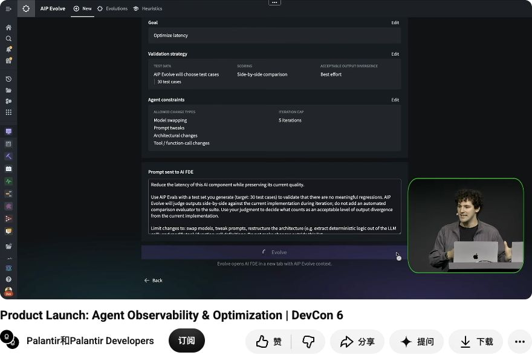
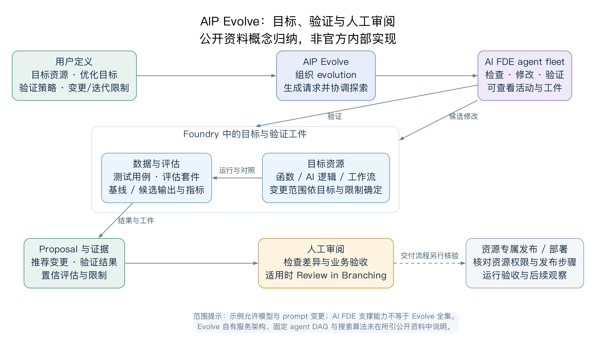
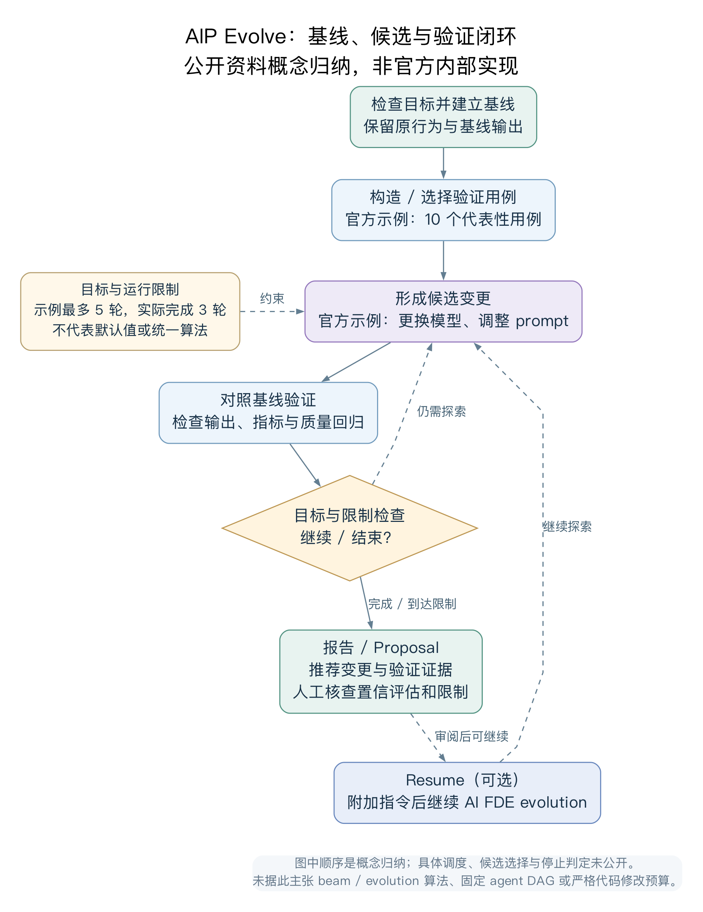
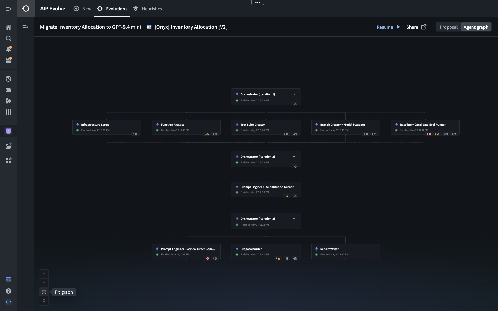
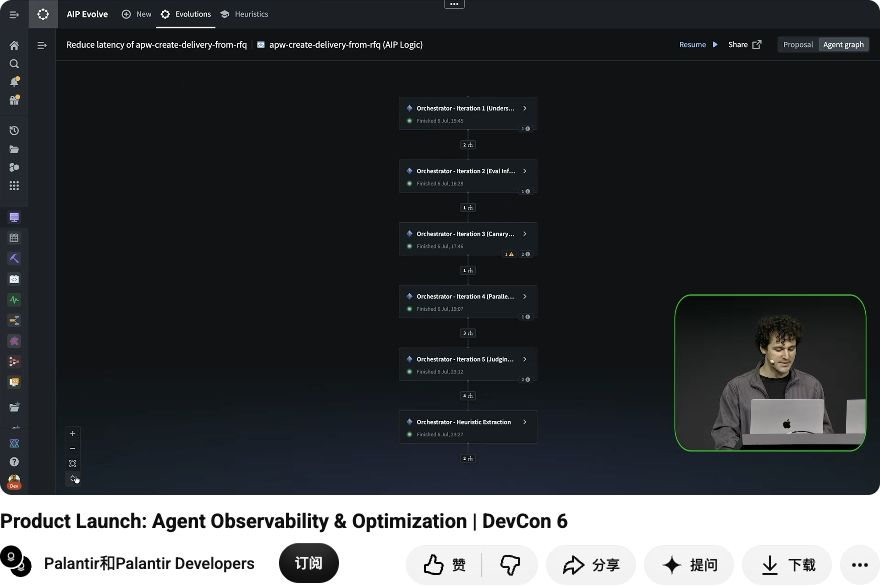
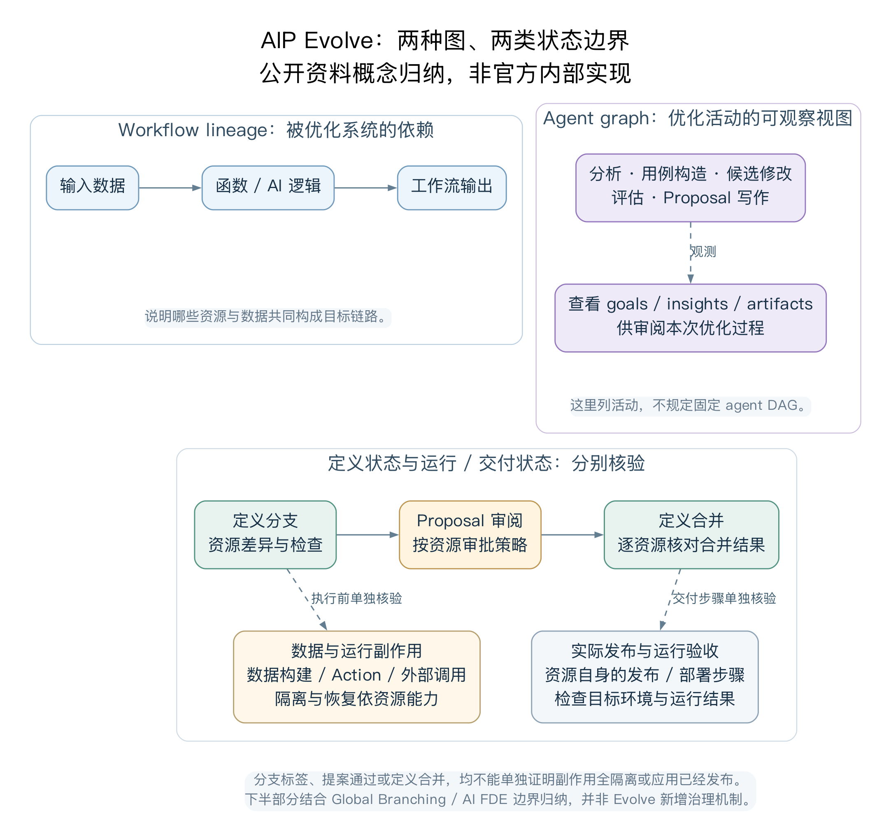
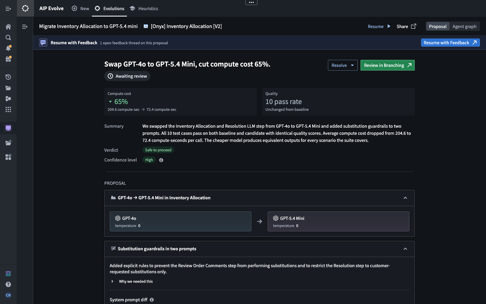

# AIP Evolve：把 AI 系统改进变成有目标、验证和审阅证据的工程迭代

> 状态：公开资料研究；文档、原帖转写与局部视频画面已核验，未在租户复现实验。核验截止：2026-10-01（UTC）。
> 产品沿革：2026-08-18 Beta、2026-09-08 GA；GA 后仍有租户可用性限制，见 §1。
> 方法：官方文档与公告、官方公开视频局部实际画面、官方原帖公开转写、开发者社区原始讨论。未登录 Foundry 租户、未运行 Evolve、未取得客户代码/评测集/账单，也未读取或发布 EOS 内部源码。收益数字均注明所属来源和未复现边界。

## 结论：它改善应用中的 AI 系统，不能先假设它优化所有页面

**已确认：** AIP Evolve 让用户指定 Foundry 目标资源、优化目标、验证策略和操作约束，再协调 AI FDE agents 探索候选变更、比较基线、形成 proposal 和可检查的 agent activity。官方目标包括模型迁移、降低成本或延迟、提高评估分数及自定义目标。它需要 AIP、AI FDE 访问、Ontology 中安装 Marketplace 产品，以及目标与验证材料权限。[当前概览](https://www.palantir.com/docs/foundry/aip-evolve/overview)、[GA 公告](https://www.palantir.com/docs/foundry/announcements/2026-09#introducing-aip-evolve-coordinate-ai-fde-agents-to-improve-ai-systems-in-foundry)

**对应用架构的实际意义（分析）：** 当分类、摘要、推荐、分配或工具决策已实现为可寻址的 AI 函数/工作流，Evolve 能把改模型、改 prompt 和部分程序结构的探索组织成可验证提案。医院原始演示还描述生成 OSDK 专家审阅界面，把业务判断接回优化。这里最值得借鉴的是“目标系统—验证工件—候选差异—审阅—发布”的链路，而不是一个会聊天的页面优化按钮。[官方演示原帖](https://www.linkedin.com/posts/palantir-technologies_aip-evolve-our-new-product-for-making-agents-activity-7466229875868356608-PuLS)、[医院专家审阅短片原帖](https://www.linkedin.com/posts/palantir-technologies_see-how-palantir-forward-deployed-engineer-activity-7485082212904800256-rMlx)

**边界：** 截至核验日，本轮取得的公开资料未披露 Evolve 完整目标类型矩阵、通用浏览器/视觉评分契约、任意 React/Workshop 页面自动优化、公开启动 API/MCP 工具、搜索算法或事务恢复保证。`custom goal`、AI FDE 会写 React、医院生成过一个审阅应用，都不能补出这些保证。本文把 Evolve 的直接事实、关联平台能力和组合建议分开。

| 判断层次 | 本文如何使用 |
| --- | --- |
| Evolve 直接事实 | 公告、概览及注明时间的实际界面说明其输入、目标、候选过程与审阅工件 |
| 关联能力 | AI FDE、Evals、Global Branching、Logic、Workshop 自身的合同；不自动认作 Evolve 默认全部调用 |
| 案例报告 | 讲者/官方演示中报告的结果；不写成独立验证、总体成功率或未来收益 |
| 分析/建议 | 平台组合路径、EOS 通用优化合同与验收设计；不判断 EOS 当前内部实现 |
| 未知 | 本轮未取得可核验规格或工件；不是证明能力绝对不存在 |

本文补充既有 [AI FDE 研究 §13.2](https://github.com/501981732/palantir-research/blob/6f2ef0eefdc5e0f2c0604eff75ed4095f582ace2/research/ai-fde-2026-10/README.md#132-evolve-把优化合同产品化)，重点展开产品迁移、程序变更、评分层次、专家反馈、成本与审批/发布边界。Pilot 的前端生成和 Workshop 的宿主运行分别见 [Pilot](https://github.com/501981732/palantir-research/blob/6f2ef0eefdc5e0f2c0604eff75ed4095f582ace2/research/pilot-2026-09/README.md)、[Workshop Runtime](https://github.com/501981732/palantir-research/blob/6f2ef0eefdc5e0f2c0604eff75ed4095f582ace2/research/workshop-runtime-2026-10/README.md)。详细机制见 [附录 A](appendices/mechanisms.md)，原始案例审计见 [附录 B](appendices/cases.md)，来源与媒体见 [sources.md](sources.md)、[assets.md](assets.md) 和 [checks.md](checks.md)。

## 1. 沿革、生命周期与实际可用性

| 时间 | 原始证据与可确认范围 | 不能推出什么 |
| --- | --- | --- |
| 2026-04-30 | 社区用户已询问 Evolve 教程，并称一度与 Evals 混淆 | 官方首发日、公开普及或该用户已成功使用 |
| 2026 年 5 月 | 官方 LinkedIn 新产品原帖及公开短片转写，评论直接连完整 Chad & Colton 演示；X 索引显示 5/29，但原帖直接读取受限 | 精确视频上传日、首次出现日期或全片已观看 |
| 2026 年 7 月 | DevCon 6 官方演示，本轮实际检查 12:11 配置和 13:12 graph 等局部帧 | 全片内容或整套优化性能已独立核验 |
| 2026-08-18 | 正式 Beta 公告，发布目标、验证、约束、提案/graph、Global Branching 和 Resume 流程 | 所有 enrollment/DevTier 已可用，或内部算法已公开 |
| 2026-08-26/27 | 用户反馈 Workshop/Workspace 入口、heuristics、feedback 与多个 proposal 的差异；`colton` 回应处于 Workshop→一级 Foundry 应用迁移期 | 9 月 GA 以后必然仍有相同缺陷或 Skills 迁移已完成 |
| 2026-09-08 | 正式 GA，仍要求 AIP、AI FDE、Marketplace 安装、目标和验证资源访问 | 所有租户、模型、资源类型完全一致或自动生产发布 |
| 2026-09-21/22 | Free Dev Tier 安装失败原帖；`colton` 回应当时 DevTier 尚不可用，争取年底提供 | 年底为承诺日期；用户报告的包大小/配额是永久统一规格 |
| 2026-10-01 | 当前公开 Evolve 导航只有 Overview；本轮未取得独立 getting-started 正文 | 用未出现的页面补造更详细产品合同 |

时间线出处：[早期教程问题](https://community.palantir.com/t/aip-evolve-where-s-the-tutorial/6526)、[5 月官方原帖](https://www.linkedin.com/posts/palantir-technologies_aip-evolve-our-new-product-for-making-agents-activity-7466229875868356608-PuLS)、[DevCon 原视频](https://www.youtube.com/watch?v=GZHSCMz6Aio)、[Beta 公告](https://www.palantir.com/docs/foundry/announcements/2026-08#introducing-aip-evolve-coordinate-ai-fde-agents-to-improve-ai-systems-in-foundry)、[迁移原帖](https://community.palantir.com/t/aip-evolve-questions-feedback/7148)、[GA 公告](https://www.palantir.com/docs/foundry/announcements/2026-09#introducing-aip-evolve-coordinate-ai-fde-agents-to-improve-ai-systems-in-foundry)、[DevTier 原帖](https://community.palantir.com/t/aip-evolve-install-error/7255)。

GA 是生命周期状态。官方生命周期另说明 Beta 演进和 GA 稳定化；具体服务可用性仍须核对所在 enrollment、启用配置、模型和资源权限。免费租户不能以 GA 公告作为安装成功保证。[Development lifecycle](https://www.palantir.com/docs/foundry/platform-overview/development-life-cycle)

### Workshop 包装走向一级应用

8 月原帖解释了一个容易误读的现象：Evolve 最初可以表现为 Workshop 应用；这说明**产品的包装/配置与审阅表面**，不证明**它优化的对象是 Workshop 页面**。回应把 heuristics 描述为类似 Skill 的最佳实践/提示，可在会话中选择性加载，当时重做并计划迁至 AIP Skills；feedback 当时仅 Workshop 的 proposal side-by-side 输出比较可用。当前截图还保留 Heuristics 和 Resume with Feedback，不能仅凭标签证明跨会话作用域、持久记忆或新版本已经完成迁移。[原帖及回应](https://community.palantir.com/t/aip-evolve-questions-feedback/7148)

社区公开数据把相关账号归在 Palantirians；本文仍以具名社区回应与时间限定，正式 GA 以公告为准。不把社区账号直接等同视频中同名讲者的已独立验证身份。[公开帖子数据](https://community.palantir.com/t/aip-evolve-questions-feedback/7148.json)

## 2. 对象与输入工件：先把优化任务写完整

官方配置分为 Goal、Validation strategy、Agent constraints、Review；最后检查生成 prompt，或 Write custom prompt，Evolve 会在新标签打开 AI FDE 并启动任务。[GA 配置流程](https://www.palantir.com/docs/foundry/announcements/2026-09#introducing-aip-evolve-coordinate-ai-fde-agents-to-improve-ai-systems-in-foundry)

| 输入 | 官方确认 | 工程解释与待核项（分析） |
| --- | --- | --- |
| Target | 选择 Foundry resource；当前示例 AIP Logic/库存分配工作流 | 需固定资源与版本、依赖及运行入口；未公开资源类型全集 |
| Goal | 模型迁移、成本、延迟、eval 分数、自定义目标 | 目标函数与业务约束分开；自定义文字不证明任意可测目标已有工具支持 |
| Test data | 选择测试案例或既有 evaluation suites；示例也可由 Evolve 选择/生成案例 | 需核样本来源、授权、代表性、expected outputs、重复与留出集 |
| Scoring | 可配评分方式和可接受输出差异 | 对基线一致不等于业务正确；“质量不下降”需要明确评价口径 |
| Change types | 选择允许的变更；当前文档示例是 model/prompt | 历史演示更广，见 §3；不等于可突破权限或随意改评测标准 |
| Iteration policy | 设置迭代上限；示例最多五轮 | 未确认美元/token/wall-time 硬上限；五轮不是产品统一上限 |
| Generated prompt | 用户可审查，最终发送 AI FDE | 自然语言约束与服务器访问控制有不同强制程度；硬性 enforcement 未披露 |

*图 1｜当前官方文档原图：AIP Logic、Optimize cost、10 cases、side-by-side、Best effort、model/prompt、最多五轮。下方生成指令要求用 AIP Evals 生成测试集，并明确不向 suite 添加自动 comparison evaluator。图中数值是实例配置，不是默认值；截图不是本研究的租户操作。[来源](https://www.palantir.com/docs/foundry/aip-evolve/overview)*

目标资源可访问并不等于全部依赖数据、评测函数和模型可用。Evolve 前置要求单独强调 target 与 validation data/suites 权限；AI FDE 也依赖当前用户会话权限。安装 Marketplace 产品提供入口，不能替代这些执行前提。[Evolve requirements](https://www.palantir.com/docs/foundry/aip-evolve/overview)、[AI FDE security](https://www.palantir.com/docs/foundry/ai-fde/security-and-governance)

## 3. 可改变什么：模型、prompt、程序结构与验证工件

| 变更或工件 | 证据等级 | 实际含义与边界 |
| --- | --- | --- |
| 模型替换 | 当前文档实例、公告和演示 | 针对既有 AI 逻辑选不同模型；不等于训练/修改基础模型权重 |
| Prompt 调整 | 当前 proposal 明示两个 substitution guardrails | 小模型迁移同时重设行为边界，避免错误扩大；不会自动证明全部用例等价 |
| 确定性逻辑替代 LLM | 官方 5 月短片叙述、9 月混合短片叙述 | 用 Ontology 查找/程序规则减少需生成推理的步骤；需核输入与异常行为 |
| 架构、tool/function-call 调整 | DevCon 12:11 实际画面与官方 5 月转写 | 历史 UI 明确允许 Architectural changes、Tool/function-call changes；不提供变更语言/资源全集或任意 graph 重写合同 |
| 测试与分析工件 | 当前 graph、proposal、医院短片 | 生成/使用 cases、baseline/candidate outputs、分析和报告；不是独立 ground truth |
| OSDK 专家审阅应用 | 医院官方原始短片转写 | 为特定业务验证创建界面，把相关上下文、并排输出、专家反馈接回迭代；不证明通用页面优化 |
| 任意 UI/UX、自动训练或无条件部署 | 本轮未知 | 不以宣传片“AI OPS”愿景、自定义目标或 AI FDE 的其他能力补成规格 |

依据：[当前实例](https://www.palantir.com/docs/foundry/aip-evolve/overview)、[5 月官方转写](https://www.linkedin.com/posts/palantir-technologies_aip-evolve-our-new-product-for-making-agents-activity-7466229875868356608-PuLS)、[医院审阅转写](https://www.linkedin.com/posts/palantir-technologies_see-how-palantir-forward-deployed-engineer-activity-7485082212904800256-rMlx)、[9 月官方短片](https://www.linkedin.com/posts/palantir-technologies_aip-evolve-reduced-cost-and-compute-time-activity-7503432895924064256-e7wk)。

*图 2｜DevCon 6 原视频 12:11 附近实际帧：Optimize latency、30 cases、side-by-side、Best effort，四类变更和五轮上限。下方指令仍将输出比较与 suite 自动 evaluator 分开。只检查了局部片段；它是历史界面证据，不能升级为当前完整支持矩阵。[原视频时间点](https://www.youtube.com/watch?v=GZHSCMz6Aio&t=731s)*

**分析：** “找更便宜的模型”只优化一个组件。“发现已有结构化数据能直接回答、移除不必要 LLM、明确工具边界”可以改变系统的调用次数、确定性和失败路径。它对应用链路有实际作用，但也提高验证难度：程序重构必须验证数据缺失、权限拒绝、分支条件、外部副作用和异常重试，不能只比较正常案例文字。

## 4. 概念架构：优化产品、执行 Agent 与应用运行分层

*图 3｜本报告自绘并实际渲染；[SVG](diagrams/01-evolve-conceptual-architecture.svg)、[可编辑源](diagrams/01-evolve-conceptual-architecture.dot)。是公开资料的职责归纳，不是 Palantir 闭源服务拓扑。人工审阅到发布的虚线表示另行核验的资源交付链，不声称 Evolve 自动完成部署。[支撑来源与 QA](diagrams/README.md)*

Evolve 是优化任务的配置、观察和证据审阅入口；AI FDE 是其启动的工程执行能力；被修改的 AI 函数、Logic、数据和评测仍是 Foundry 资源。截至核验日，本轮取得的公开资料未描述 Evolve 的服务部署拓扑、工作队列、fleet 启动机制或共享存储。这一层不能用“多 Agent”一词想象补齐。[Evolve](https://www.palantir.com/docs/foundry/aip-evolve/overview)

AI FDE 的平台上下文与原生工具可操作资源、预览函数/transform、检查 CI 结果，并按 mode 调整 capabilities。它自身支持 OSDK React、函数和 Ontology 等任务；Evolve 实际授权什么，仍要看 target、constraints、工具与审批。Pilot 的隔离容器/seed data 是另一套产品合同，不能当作 Evolve 执行环境承诺。[AI FDE overview](https://www.palantir.com/docs/foundry/ai-fde/overview)、[modes](https://www.palantir.com/docs/foundry/ai-fde/modes-and-capabilities)、[Pilot workspace](https://www.palantir.com/docs/foundry/pilot/workspace-overview)

## 5. 搜索与迭代：已披露的是工作流程，不是算法

官方描述和实例支持以下循环：检查目标工作流→形成测试与基线→提出候选修改→运行候选/比较→再次调整→整理 proposal。当前文档配置上限五轮，实际三轮；agent graph 可看 goals、insights 和 artifacts。[官方实例](https://www.palantir.com/docs/foundry/aip-evolve/overview)

*图 4｜本报告自绘；[SVG](diagrams/02-evolution-validation-flow.svg)、[源文件](diagrams/02-evolution-validation-flow.dot)。图中回边是机制归纳，不规定固定搜索/停止算法。Resume 表示可带反馈继续，不能解释为已验证断点恢复。[说明与 QA](diagrams/README.md)*

*图 5｜当前原图可见三轮 Orchestrator，分析、测试生成、branch/model swap、baseline/candidate eval、prompt engineering、proposal/report 等活动。截图标题是模型迁移，Review 图目标是 cost，不能把二者文字当完全一致的配置记录；它们用于解释不同侧面。节点徽标未打开 tooltip，本文不猜精确语义。这是一个实例，非固定 agent 数量和必经 DAG。[来源](https://www.palantir.com/docs/foundry/aip-evolve/overview)*

这里至少有两种“轮次”：Evolve 迭代是改变系统的探索轮次；Evals 每例 repetitions 是在给定候选上的重复执行。两者不能相乘后冒充完整实际调用量，因为每轮可能跑不同资源、多个候选或额外工具。

AIP Evals experiments 有公开 **grid search**：把 model/prompt 等作为函数参数，枚举参数组合并运行评测。该算法属于 Evals experiments；Evolve 如何生成、淘汰、排序候选，是否使用 beam search、进化算法、并行搜索或评分驱动规划，本轮均未取得规格。产品名称“Evolve”不能证明进化算法或权重自学习。[Evals experiments](https://www.palantir.com/docs/foundry/aip-evals/experiments)

## 6. 验证：三个评分层次必须明确

第一层是 **业务验收真值**：任务是否正确、关键规则是否保留。第二层是 **Evals metrics**：所配置 evaluation functions 对具体 cases 的结果。第三层是 **Evolve 相对比较**：候选相对当前实现的输出偏离、成本/延迟和提案判断。当前 Review 的 Best effort 指令要求 side-by-side 判断，却明确不增加 suite 自动比较 evaluator；因此 suite pass 与输出差异判断不能混成一个“全自动准确率”。[Review 原图](https://www.palantir.com/docs/resources/foundry/aip-evolve/aip-evolve-workflow-1.png)

官方 5 月转写描述 exact match、语义等价与 best effort 的选择。精确输出一致可能过严，语义判断可能忽略关键字段，最佳努力又依赖判断者标准；这些是**分析**，截至核验日，本轮取得的公开资料未披露 Evolve comparator 的模型/系统指令、校准、判分一致性、误判率或置信度计算。[官方转写](https://www.linkedin.com/posts/palantir-technologies_aip-evolve-our-new-product-for-making-agents-activity-7466229875868356608-PuLS)

### Evals 提供什么，不代表 Evolve 自动配置什么

Evals suite 由 cases、target functions、evaluation functions 组成，可按用例/汇总查看 metrics。支持 Logic、function 形式 Chatbot 和 code-authored functions；可用人工输出查看、内置 exact/regex/range/关键词/编辑距离/ROUGE/LLM judge，或自定义已发布 evaluator。Boolean 指标选 true/false，numeric 选 maximize/minimize 和可选 threshold；单次 case 的全部指标达标才 pass，case 的全部重复执行均 pass 才算通过。[Evals overview](https://www.palantir.com/docs/foundry/aip-evals/overview)、[Create suite](https://www.palantir.com/docs/foundry/aip-evals/create-suite)

| Evals 关联能力 | 对 Evolve 结果应核查的内容 |
| --- | --- |
| Logic 可测 last saved 或 published，code-authored function 测 published | 基线/候选到底指向哪个资源、分支、代码与模型版本 |
| 每例可重复；官方建议 LLM 至少三次，默认十例并行且可降并发 | 本次 evolution 实际 repeat/concurrency；不能把建议或默认写成它已执行 |
| User-scoped 默认使用发起者权限，结果私有、24 小时后删除、不入 dataset | 审阅后还能否访问原始 run 证据 |
| Project-scoped 当前 Beta，资源导入项目，项目访问者可见、长期保存，可写 dataset | 租户是否可用、是否选用、范围与访问政策是否合适 |
| Run metadata 记录 branch/version/model，可附 key-value | 实际 evidence 是否足够重现，不只保存截图里的百分比 |
| Intermediate parameters 可暴露 block 输出 | 哪一步退化、最终输出改善是否掩盖中间问题 |

依据：[Run suite](https://www.palantir.com/docs/foundry/aip-evals/run-suite)、[中间参数](https://www.palantir.com/docs/foundry/aip-evals/intermediate-parameters)。Evolve 默认采用哪种 scope、证据保留期限、是否不可修改评测工件，本轮未知。

**分析：** 自动生成 cases 是探索辅助，不是自动建立独立真值。搜索者同时选择样本、候选与评分口径会造成选择偏差；与错误基线保持一致也可能保持错误。建议锁定业务 owner 的验收集/阈值与留出集，让 Agent 生成额外探索例，但记录所有失败、不能通过删例或弱化 evaluator 获得“改善”。这些是通用验证建议，不是已证 Evolve 强制机制。

## 7. Agent graph 与 Workflow Lineage：两张图回答不同问题

Agent graph 说明“哪些 Agent 为这个 evolution 做了哪些工作、留下哪些发现和工件”；Workflow Lineage 说明“被优化的工作流由哪些资源及调用依赖构成”。一个活动图不能替代目标系统的依赖图，也不能从串行 Orchestrator 节点推出生产调用拓扑。[Evolve graph](https://www.palantir.com/docs/foundry/aip-evolve/overview)、[Workflow Lineage 概览](https://www.palantir.com/docs/foundry/workflow-lineage/overview)

*图 6｜DevCon 6 原视频 13:12 附近实际帧：目标标题为降低 `apw-create-delivery-from-rfq` 的延迟，图示五轮 Orchestrator 与 Heuristic Extraction。它与当前文档的三轮库存示例不同，证明的是该历史活动实例。此处看到了界面，未完整观看、未复现实际运行，亦不把图中阶段简称当平台固定算法。[原视频时间点](https://www.youtube.com/watch?v=GZHSCMz6Aio&t=792s)*

*图 7｜本报告自绘；[SVG](diagrams/03-graphs-and-state-boundaries.svg)、[源文件](diagrams/03-graphs-and-state-boundaries.dot)。上方区分系统依赖与优化活动，下方区分定义合并、运行副作用及真实交付。Workflow Lineage 部分是概念依赖归纳，不声称 Evolve 有同名专用内部页面。[来源及 QA](diagrams/README.md)*

**建议：** 让 proposal 同时关联目标资源、输入快照、每轮候选与 suite run，再显示应用消费和发布版本。图可帮助定位问题，但若只有 nodes/insights，没有可寻址的差异与原始结果，仍不足以验收。

## 8. 执行环境、费用、预算与失败恢复

AI FDE 在 Foundry 的用户会话中调用原生工具，初始上下文不含用户数据，之后可附加 datasets、functions、branches、Ontology 实体和文件，也可由工具读取相应资源。Outline 可检查消息、工具与 tokens。截至核验日，本轮取得的公开资料未披露 Evolve 的 fleet 进程、容器隔离、并发上限、调度、共享资源冲突规则；不能把 Pilot 的容器或外部 IDE 的执行环境移植过来。[AI FDE overview](https://www.palantir.com/docs/foundry/ai-fde/overview)、[navigation](https://www.palantir.com/docs/foundry/ai-fde/navigation)

AIP 将 LLM tokens 按模型、地区和输入/输出费率换算为 compute-seconds，AI FDE 在用量归属范围内；可导出模型/资源的 tokens、compute-seconds 和费用。公开费率对应特定默认合同，不能当所有客户报价。**Compute-seconds 是用量/计费单位，不等于 wall-clock 延迟秒数**。当前 proposal 的 204.6→72.4 是单次工作流平均 compute，不能据此计算搜索总成本。[AIP compute usage](https://www.palantir.com/docs/foundry/aip/aip-compute-usage)

| 应分开测量（建议） | 原因 |
| --- | --- |
| 每次业务调用成本 | 模型替换、调用次数和缓存可改善它 |
| 一次优化总成本 | 所有 Agent、全部候选/基线评测、构建、失败重试和人工审阅都产生开销 |
| 业务延迟/吞吐 | 可能因降成本而恶化；医院演示明确接受部分延迟代价 |
| 失败与恢复成本 | 只报告通过候选会隐藏限流、超时、编译和外部失败 |
| 月度实际收益 | 取决于量、合同、发布采用率与回归，而不是单个百分比 |

简单的**通用回本分析**可用 `优化总成本 /（基线单次成本 − 候选单次成本）` 估算需运行多少次才抵消搜索开销；只有同币种、同费用口径且差值为正时成立，未计入长期维护和事故成本。它是建议公式，非 Evolve 内置计费或收益算法。

公开预算例子是 iteration cap。未取得硬美元/token 上限、最大 wall time、取消后的在途调用处理、checkpoint、自动 retry、幂等或跨资源补偿合同。Resume 可以追加指令继续；不等于从任何失败恢复原子状态。AI FDE 高频/并行操作可能碰到容量与网络瓶颈；Logic 从 Workshop/API 调用有五分钟限时，而 Debugger 不受同一限时，测试与生产执行面应分别核验。[Evolve Resume](https://www.palantir.com/docs/foundry/aip-evolve/overview)、[AI FDE best practices](https://www.palantir.com/docs/foundry/ai-fde/best-practices)、[Logic FAQ](https://www.palantir.com/docs/foundry/logic/faq)

## 9. Proposal、审批、身份与数据安全

*图 8｜当前官方原图：GPT-4o→GPT-5.4 Mini，两处 prompt guardrails，204.6→72.4 compute-seconds/call；10 cases 通过。仍为 Awaiting review。Safe to proceed 和 High 是提案建议/信心标签，不是统计置信区间、独立验收、审批已完成或生产发布证据。[来源](https://www.palantir.com/docs/foundry/aip-evolve/overview)*

### 四个不同关口

1. Evolve **内容提案**：变更说明、outputs、验证、证据、confidence 和局限。
2. AI FDE **工具审批**：是否允许执行某次修改、Action、发布或构建。
3. Global Branching/代码库 **资源审阅**：具体差异、checks、approval policies 和 merge。
4. 业务与应用 **验收/发布**：采用哪个版本、给谁使用、是否满足业务和运行指标。

前两项不能自动完成后两项。Evolve 明确提供在适用时 Review in Branching 和带反馈 Resume；没有声称接受它的文字 proposal 就自动上线。[Evolve](https://www.palantir.com/docs/foundry/aip-evolve/overview)

AI FDE 以当前用户权限运行，无额外 bot/service account 或提权，操作进标准 audit logs；只读自动批准，mutation 需同意，可按 session/branch/project 预批准部分工具。Action、创建 app/widget、publish/tags 等类别需逐次批准；feature branch 文件修改/build 与 protected branch 的规则不同。Navigation 还提醒 unbranched changes 和 build side effects 的审批。这个合同须与实际配置并读，不应把“在 branch”解释为任何操作皆自动安全。[security](https://www.palantir.com/docs/foundry/ai-fde/security-and-governance)、[navigation](https://www.palantir.com/docs/foundry/ai-fde/navigation)

AI FDE session 仅创建者可读并受 markings 控制；Evolve 截图的 Share 不足以证明所有底层 session、proposal、graphs、案例输出都有相同共享模型和保留期。fleets 的细分身份、artifact ACL、export 和长期审计 schema 本轮未知。AIP 管理的第三方托管模型通道声明 prompts/completions 不由 provider 保留或用于训练，地域有服务/合同边界；这不表示未向模型传输验证文本，也不能自动覆盖外部 MCP client 的模型合同。[AI FDE security](https://www.palantir.com/docs/foundry/ai-fde/security-and-governance)、[AIP security/privacy](https://www.palantir.com/docs/foundry/aip/aip-security)

## 10. 分支隔离与发布：定义、数据、外部效果分别处理

Global Branching 角色管理 metadata/proposals 不自动赋予资源读写权限；默认 approval 可由贡献者既有权限满足，所以 proposal 不天然等于双人制。Custom policies 才能规定 eligible reviewers、人数和是否允许自批；Code Repositories/Pipeline Builder 还有本地政策。[branch security](https://www.palantir.com/docs/foundry/global-branching/branch-security)、[approval policies](https://www.palantir.com/docs/foundry/global-branching/resource-protection-and-approval-policies)

必须保留以下关联平台限制：

- 普通 Foundry resource 的 branch 修改与 main 隔离，但新建/删除会影响 main；Ontology entities 是例外。真实冲突需处理、checks 全通过才 merge，单项 rejection 可阻止整提案。部分 merge 失败当前不能整体 revert，须修正后重试。[core concepts](https://www.palantir.com/docs/foundry/global-branching/core-concepts)
- TS v2 对 branched schema 的代码修改需 local OSDK；Python functions 目前不能在 global branch 改代码，可引用指定函数版本但只用 main schema；Ontology SDK 产物本身不可 branch。这些限制不因 Evolve 多 Agent 而消失。[integrations](https://www.palantir.com/docs/foundry/global-branching/integrations)
- Evals 的 Ontology simulation 针对测试对象 edits，不会将这些编辑写真实 Ontology；它不是所有外部 I/O 的通用沙箱。[evaluate edits](https://www.palantir.com/docs/foundry/aip-evals/ontology-edits)
- Branch Action 的对象类型需全部索引到 branch；测试数据 edits 不合并到 main。Webhooks/notifications 默认不执行；function-backed Action 含 external calls 默认失败，显式启用后仍调用原端点。这与 Evals simulation 是不同执行机制。[branching Actions](https://www.palantir.com/docs/foundry/action-types/branching-action-types)

### 一条可以确认平台支持的应用联调路径

Logic 可发布为 Branched pre-release，只在同 branch 可见，可接入同分支 Workshop 和 function-backed actions。merge checks 要求已分支发布、无错误、与 main 同步、无待审批；API name 和已发布函数删除等仍有限制。[branching Logic](https://www.palantir.com/docs/foundry/logic/branching-logic)

因此 **优化 AI 函数→分支 pre-release→同分支 Workshop/Action 联调→资源审阅/合并→实际采用版本** 是公开能力支持的**组合路径**。这不是 Evolve 默认自动完成的产品工作流，更没有证明它已测 UI 键盘交互、权限拒绝、变量事件、异常恢复或真实用户流量。[Logic core concepts](https://www.palantir.com/docs/foundry/logic/core-concepts)、[Workshop 函数消费](https://www.palantir.com/docs/foundry/workshop/functions-use)

Workshop 的保存版本和 publish 给 viewers 分开，可配置自动发布；Registry 的 widget 新版本也不会自动升级既有 Workshop usages。Evolve proposal、merge、函数 publish、应用发布和 widget 采用版本应分别留证。[Workshop versions](https://www.palantir.com/docs/foundry/workshop/versions)、[Pilot widget release](https://www.palantir.com/docs/foundry/pilot/deploy-a-widget)

## 11. 公开案例：对象、分母与复现边界

| 案例 / 原始材料 | 报告结果 | 本轮证据与可解释范围 |
| --- | --- | --- |
| 当前库存分配文档实例 | 204.6→72.4 compute-sec/call，约 65%；10 cases 均 pass；三轮 | 文档/原图可核；没有独立 holdout、完整输入/evaluator/日志；不算真实租户实测 |
| 5 月 Chad & Colton 官方短片 | 某模型替换称 计算成本下降 97%、质量 +7 个百分点；原帖另说结构化数据移除两个 LLM calls | 短片转写已读，完整视频受限；专有模型名自动转写未定案，数字不与文档实例合并 |
| DevCon 观测与优化演示 | 本轮实际看到更广 constraints、30 cases、五轮活动图 | 证实历史界面/工件；局部观看不提供完整性能/搜索轨迹 |
| Tampa General Hospital utilization review | 两处模型替换及 prompt 调整称 计算成本下降 68%；一位专家在 90% 并排比较中偏好新结果；有延迟代价 | 两份官方短片原始转写及完整视频局部流程图；未取得病例集、专家评分记录、绝对成本和发布日志；90% 是偏好，不是准确率/临床安全率 |
| 9 月多场景官方剪辑 | 约70%；另一函数67→88 accuracy、47%更快/67%更省；另一30-case段称90% cost/compute | 缺逐段 speaker/环境/评分定义；不同数字不当同一实验或统一产品收益 |
| 社区直接使用反馈 | 概念混淆、迁移差异、多proposal链接、DevTier失败 | 有日期、作者和具体情境；不是成功案例或普遍缺陷统计 |

原始出处与样本缺口逐项见 [案例附录](appendices/cases.md)。医院最有价值的链路是把 chart/notes/labs、旧/新输出、分析、pass/fail 与意见放进任务专用 OSDK 应用，让专家反馈和 Evals 一起筛选模型，再调整 prompt。生成这个验证工具可以帮助应用开发与迭代；它没有证明对一般页面布局或前端性能做优化。[医院专家界面原帖](https://www.linkedin.com/posts/palantir-technologies_see-how-palantir-forward-deployed-engineer-activity-7485082212904800256-rMlx)

本轮也检索技术博客、GitHub/PR/示例和原创开发者帖子。取得的二手文章主要重复同一库存案例，未找到附完整代码、数据、evaluator、版本、重复次数和账单的可复现 Evolve end-to-end 工件。这是本轮检索缺口，不是它们绝对不存在。不会用社交转发当独立交叉验证。[检索与反例记录](appendices/cases.md#6-非官方材料与可复现实例)

## 12. 与 AI FDE、Pilot、Evals、Workshop 和 MCP 的边界

| 能力 | 主要职责 | 对应用链路有证据的作用 |
| --- | --- | --- |
| Evolve | 有目标/验证/约束的优化入口、活动和证据提案 | 对已有 AI 系统组织改进与审阅；特定案例生成验证应用 |
| AI FDE | Foundry 工程 Agent 与原生工具执行 | 编辑/测试函数、Ontology、OSDK 应用等；需权限与审批 |
| Pilot（Beta） | 需求→Ontology/设计/React/OSDK/seed data/部署引导 | 专用前端与 widget 创作；不是 Evolve 执行环境或优化保证 |
| AIP Evals | 函数 cases、evaluator、metrics、重复和实验 | 可重复验证非确定性 AI 行为；没有通用 UI 测试契约 |
| Workshop / Profiler | 应用布局、变量、事件、运行数据、版本和加载观测 | 优化逻辑的消费/联调与页面性能测量；Evolve 未证明自动覆盖 |
| Palantir MCP | 外部 coding agents 的平台开发工具 | 可读/query/aggregate 对象、改结构/建提案；禁止写 Ontology 业务数据 |
| Ontology MCP | OAuth 应用中的业务查询/functions/Actions | 可读业务记录、经预定义 Action 写业务数据；不同于类型/结构开发 |

依据：[AI FDE modes](https://www.palantir.com/docs/foundry/ai-fde/modes-and-capabilities)、[Pilot](https://www.palantir.com/docs/foundry/pilot/overview)、[Evals](https://www.palantir.com/docs/foundry/aip-evals/overview)、[Profiler](https://www.palantir.com/docs/foundry/workshop/performance-profiler)、[Palantir MCP tools](https://www.palantir.com/docs/foundry/palantir-mcp/available-tools)、[Ontology MCP](https://www.palantir.com/docs/foundry/ontology-mcp/overview)。

Palantir MCP 类型变更要经 proposal review、人审合并；工具目录没有 Evolve 专用工具或通用 Workshop 布局编辑工具。Ontology MCP 支持无直接人类监督的 headless 业务读写，有效权限是用户/service user、应用 maximum restrictions、requested scopes 的交集；不能给所有 MCP 业务调用套上“每次人审 proposal”的统一保证。外部 client 的模型合同也可能不同于平台内 AIP。[PMCP security](https://www.palantir.com/docs/foundry/palantir-mcp/security)、[OMCP authorization](https://www.palantir.com/docs/foundry/ontology-mcp/authentication-and-authorization)、[headless workflows](https://www.palantir.com/docs/foundry/ontology-mcp/example-mcp-workflows)

MCP 是工具/上下文接口，Evolve 是优化产品。当前未确认外部 MCP client 可配置/启动/审批 evolution，也未确认 AI FDE 本体可注册任意 MCP server；不能从协议互通推出无缝优化或会话共享。详细工具和数据边界见 [机制附录](appendices/mechanisms.md#6-mcp-与数据通道)。

## 13. EOS 可借鉴的通用设计与验证计划

以下全部是**公开研究后的平台无关建议**。本轮未检查 EOS 代码、内部结构或资源，因此不是 EOS 当前缺陷判断，也不是对接 Evolve 的实现承诺。

### 先划定可优化工件，再开放 Agent 搜索

建议第一阶段只开放一个已稳定、可寻址、有明确输入输出的 AI 函数：固定版本、baseline 与业务目标；允许 model/prompt，禁止改验收集/评分和生产数据。第二阶段再开放确定性替代/工具重构并补异常行为测试。第三阶段才考虑自动生成专家验证应用或跨资源搜索。页面视觉/布局优化须先有独立可测 UI 契约，不以 LLM 文字好评代替运行测量。

| 验收面 | 建议证据与指标 | 必须区分 |
| --- | --- | --- |
| 业务质量 | 固定案例+独立留出、关键规则零容忍、分任务/亚群失败 | 基线等价、专家偏好、客观准确率 |
| AI 调用与费用 | 全候选 run、tokens/compute、绝对单次成本、搜索总成本 | 计费 compute、wall latency、用户实际费用 |
| Action/权限 | 测试身份、拒绝场景、写效果、外部请求清单 | 定义改动、数据改动、外部效果 |
| UI 与应用运行 | 真实消费链路、加载/空/错、键盘/可访问性、状态恢复、Profiler或等价测量 | 函数 pass、页面 pass、端到端业务完成 |
| 变更审阅 | 完整差异、候选/评分版本、评测证据、风险与人工结论 | Agent confidence、政策approval、业务acceptance |
| 发布与恢复 | 资源版本、应用/widget采用版本、取消/失败/回退演练 | Resume、definition revert、事务恢复 |

Workshop 的 Profiler 实测网络、widget/variable load/reload 和总模块加载；widget mount/unmount 设置可以改善返回页面延迟，但也增加初始加载、内存或后台请求。它们说明 UI 性能有独立测量面，未说明 Evolve 已接这些指标。[Profiler](https://www.palantir.com/docs/foundry/workshop/performance-profiler)、[display optimization](https://www.palantir.com/docs/foundry/workshop/widget-display-optimization)

建议把“候选是否更好”与“优化过程是否合规且可恢复”同时验收：记录失败候选、停止耗时、限流、越界修改、权限拒绝、证据失效和人审时间；预先说明哪些可恢复、哪些须补偿。具备这些工件后，fleet 才有稳定反馈，而非只扩大试错次数。一个具体的合成验证合同示例见 [机制附录 §7](appendices/mechanisms.md#7-通用优化合同示例)。

## 14. 仍需租户或完整原始工件验证的问题

| 未知项 | 应取得的证据 |
| --- | --- |
| 目标与变更全集 | picker、feature flags、resource matrix、对函数/React/Workshop/schema/tool graph 的实际支持 |
| 约束强制程度 | 服务端 enforcement 与越界拒绝，区别自然语言提示和访问控制 |
| 判分与搜索算法 | comparator/judge设置、候选历史、ranking、stop、失败与重试策略 |
| 成本和容量 | 全过程账单、硬budget、并发/队列/超时、取消在途操作语义 |
| fleet身份与artifacts | 细分身份、审批继承、proposal/graph ACL、export和保留期 |
| 验证独立性 | 测试集/evaluator不可篡改、holdout、专家分母、重复/方差和生产回归 |
| 多proposal与恢复 | 每个正式分支提案的映射、partial merge、checkpoint与补偿记录 |
| 真正交付 | 已批准差异、构建/发布、版本采用和下游应用验收，而不只绿色信心标签 |

本研究的证据范围到公开文档、原始转写和注明时间的局部实际画面。未公开的规格、缺少的复现实验和媒体访问限制均保留在 [checks.md](checks.md)。
