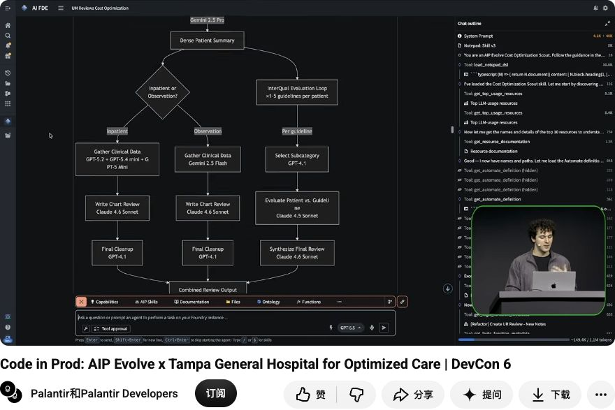

# 附录 B：沿革、案例数字与可重复性审计

> 访问：2026-10-01（UTC）。本文区分文档示例、公开视频局部实际画面、官方短片公开转写、搜索元数据和开发者自述。所有收益未由本研究复现；没有取得客户代码、评测集、账单或生产发布日志。

## 1. 库存分配：当前文档的65%究竟说明什么

原始材料：[Evolve overview](https://www.palantir.com/docs/foundry/aip-evolve/overview) 和三份原PNG，见[媒体台账](../assets.md)。任务是理解客户订单并决定库存履约，以降compute为目标、保留质量；配置自动选择10例、side-by-side、Best effort、只model/prompt、最多五轮，报告三轮。

Proposal 建议 GPT-4o→GPT-5.4 Mini，并在两个prompt加入替代商品guardrails：Review Order Comments不擅自替代，Resolution限于客户要求替代。截图两边temperature为0；这也不保证非确定性完全消失。结果是全部10例通过，平均204.6→72.4 compute-seconds/call。

按图中显示数计算 `(204.6−72.4)/204.6≈64.61%`，与约65%相容。**本研究只复核算术与原图单位，没有复现执行。**不能把它改成平均响应时间降低65%、账单节省65%或成本/准确率都保证改善。Compute-seconds的计费含义须并读[AIP compute usage](https://www.palantir.com/docs/foundry/aip/aip-compute-usage)。

缺少完整输入、case来源、重复数、evaluator/threshold、holdout、候选日志、搜索开销和生产回归；“High”“Safe to proceed”是提案标签。图标题迁移、配置cost goal的侧面差异也不能补成一致的原始运行快照。

## 2. Chad & Colton：5月演示与程序重构线索

原始关联：[官方LinkedIn原帖](https://www.linkedin.com/posts/palantir-technologies_aip-evolve-our-new-product-for-making-agents-activity-7466229875868356608-PuLS) 的作者评论明确链接[完整演示 p0pjtkg1ny4](https://www.youtube.com/watch?v=p0pjtkg1ny4)。本轮读到了短片完整可见Transcript，IAB媒体不可播放；YouTube初次正常入口要求登录确认非机器人。未完整观看。

原帖目前显示4个月前；[官方X原帖](https://x.com/PalantirTech/status/2060463832410292652) 的搜索索引日期为2026-05-29，直接读取受限。因此主文保守记为“5月官方演示”，不把索引日期当独立核定首发/视频上传日。

转写列出exact match、语义等价、best effort的差异要求；允许model/prompt、提取确定性逻辑、利用Ontology、调整tools/function calls与重构agent。五轮被称作budget，能证明迭代约束，不能证明美元/token硬上限。

短片称一次模型替换计算成本下降97%、质量增加7个百分点并改善latency；自动转写给出的具体模型名称尚未用真实画面或可靠字幕确认，本文不定案。官方正文另说找到结构化Ontology数据、消掉两个LLM calls，但没有证据证明它与97%属于同一变更或分母。不能把两项相加成收益。

这个来源支持“产品演示范围超过模型替换”的原始叙述，不能证明架构改变必然行为等价或所有target types均支持。缺公开baseline/candidate、样本、评分代码、重复数、绝对费用、全部失败与发布后回归，无法复现指标。

## 3. DevCon6：实际画面补到了什么

原始视频：[Product Launch: Agent Observability & Optimization](https://www.youtube.com/watch?v=GZHSCMz6Aio)，官方联合频道Palantir/Palantir Developers。既有研究记录上传2026-07-14；本轮未重新取得精确上传日证据，正文按2026年7月历史演示。当前播放器显示16:15，已有记录16:16，应视为页面显示差异，不自造剪辑版本原因。

本轮实际播放/观察的是局部范围：7:41附近至7:48、12:02附近至12:11、13:00附近至13:12。跳转后先播放再确认画面更新；最初缩略图没有算作对应时间帧。保存两份截图包含视频区域、标题和频道，未完整观看或取得可读字幕。

| 实际画面 | 可核内容 | 不可推出 |
| --- | --- | --- |
| [12:11截图](../assets/05-devcon-constraints-12m11s.jpg) | Optimize latency，30cases，side-by-side/Best effort，四种allowed changes，五轮；生成prompt限制与评测指令 | 当前全部目标/变更全集、hard预算、完整候选结果 |
| [13:12截图](../assets/04-devcon-agent-graph-13m12s.jpg) | AIP Logic目标 `apw-create-delivery-from-rfq`，Reduce latency标题，五轮Orchestrator及Heuristic Extraction节点 | 固定Agent DAG、五轮必需、heuristics自动跨会话学习、真实系统SLA |

图中架构与工具调用选项补强了官方文字描述。视频截图有实际界面证据，但仍没有全部case、日志、性能表或完整成功/失败历史；因此该片不用于独立效果测量。

## 4. Tampa General Hospital：业务专家进入验证闭环

原始材料：[Code in Prod官方完整视频](https://www.youtube.com/watch?v=WLleqr4GEAw)、[流程与替换短片](https://www.linkedin.com/posts/palantir-technologies_at-devcon6-see-how-dr-david-zihr-medical-activity-7485030356522336256-1oOV)、[专家审阅与迭代短片](https://www.linkedin.com/posts/palantir-technologies_see-how-palantir-forward-deployed-engineer-activity-7485082212904800256-rMlx)。两份短片官方具名Dr. David Zihr（Physician Advising Services Medical Director）与FDE Colton Rusch；短片精确上传日未核。医院完整视频扩展说明显示2026-07-14，本轮正常播放器实际观察0:00–0:11与7:07–7:17局部，读取两份短片原始可见转写，未完整观看医院视频。

*医院原视频07:17实际帧：UR Reviews Cost Optimization 的流程图包含 inpatient/observation、指南循环、chart review及模型标签。只展示公开演示的流程定义，不含可见患者记录；保存原题与频道。画面不是优化后结果或68%收益的独立测量，模型标签也不替代短片所述候选版本。[原时间点](https://www.youtube.com/watch?v=WLleqr4GEAw&t=437s)*

### 业务对象与模型替换

目标是utilization review生成工作流：AI叙述旁边放患者chart，护士审查、编辑或接受后发出。链路含确定性逻辑、agent逻辑、人类操作及上下游授权/文档。演示者让Evolve分解LLM位置、条件分支与数据流，针对criteria-matching agent的指南/患者相关性及综合叙述寻找优化。

第一份转写报告在两处把Claude Sonnet换为GPT-5 mini，计算成本下降68%，接受了部分延迟代价，Evolve判断表现等价或更好。模型名称来源是转写层证据；未将它当已运行的版本快照或独立benchmark。演示界面叙述含一个可能错转的匿名化/示例化措辞，本文不确认其程度，也没有读取真实患者数据。[流程/模型转写](https://www.linkedin.com/posts/palantir-technologies_at-devcon6-see-how-dr-david-zihr-medical-activity-7485030356522336256-1oOV)

### 验证应用与进一步迭代

第二份短片描述Evolve构建任务专用OSDK应用，基于TGH Ontology采样案例、并排旧/新输出、显示分析，把chart/notes/labs上下文放同一屏，专家逐例pass/fail和反馈。专家意见与Evals一起筛选跨供应商候选，再给各模型调prompt，增加语气、包含/排除信息及叙述结构规则。[专家应用转写](https://www.linkedin.com/posts/palantir-technologies_see-how-palantir-forward-deployed-engineer-activity-7485082212904800256-rMlx)

同一段报告计算成本下降68%、一位专家在90%的并排比较中偏好新结果。**90%指该专家在比较中的偏好比例**；没有证据支持90%准确率、90%专家一致同意、临床安全率或统计显著性。该例证实的是“为业务验证生成应用工件”的官方叙述，不是通用UI优化或Pilot参与的证明。

缺口包括：总样本数/采样规则、专家人数与盲评、随机输出顺序、评分细则、一致性、holdout、亚群失败、模型/代码版本、绝对费用/量、搜索成本及批准/发布日志。没有取得医院代码PR、病例集或专家标注记录。

另有[官方X宣传原帖](https://x.com/PalantirTech/status/2079263914139758785) 在搜索片段里提70%cost/84%更少GPT调用/90%专家偏好；原页受限，本文仅登记追踪线索。84%所对应的确定性替代段亦见9月短片，但没有完整分母，不能与68%cost相乘或合并为一个结果。

## 5. 9月混合剪辑：逐段数字分开

原始链接：[yEzGboawqNw](https://www.youtube.com/watch?v=yEzGboawqNw)、[官方LinkedIn原始可见Transcript](https://www.linkedin.com/posts/palantir-technologies_aip-evolve-reduced-cost-and-compute-time-activity-7503432895924064256-e7wk)。9月官方剪辑的精确发布日期未核；没有完整观看YouTube版。

| 可见转写中的片段 | 限定解释 |
| --- | --- |
| 医院段约70%成本改善 | 不把近似数替换掉医院独立68%段的具体条件 |
| 某production function：67%→88% accuracy，第二轮同accuracy、47%更快/67%更省 | 没有样本、评分规则、客户/函数版本；“准确率”只保留原叙述用语 |
| 另一个30cases/Evals段：换较小模型，90%cost与compute time | 不明确walltime单位、评分或绝对数；不能概括平台普遍90% |
| 较轻模型/文档embedding段 | 没有可重现版本、成本/质量分母 |
| 确定性TypeScript、Evals、注册Ontology，84%情况替代AI调用 | 可作架构替代的叙述，不知适用流量分布、异常路径或与其他数字关系 |

自动转写没有逐段speaker标签。片尾fine-tuning/training/deploying的宽泛AI OPS愿景，也不能补成Evolve已公开的通用训练/部署API。指标越醒目，越应保留对象与分母。

[Tyler Robb原帖](https://www.linkedin.com/posts/tylerjrobb_palantir-aip-evolve-activity-7503502640094461953-zyVu) 重复47%/67%引文并连官方短片，没有独立日志/工件，不作为第二次测量。

## 6. 非官方材料与可复现实例

本轮检索AIP Evolve的GitHub/PR/tutorial/blog、baseline/model migration、30cases/97%/84%以及Developer Community标签。未取得可复现的Evolve end-to-end公开代码、完整测试集、evaluator、候选版本和费用记录。这是检索结果边界，不证明它们不存在。

- [Donald Zhong（2026-09-09）](https://www.donaldzq.com/blog/ai-news-2026-09-09) 与[Vanyar Part7](https://vanyar.com/articles/what-is-palantir-part-7-the-ai-stack-that-starts-with-your-business) 基本解释官方库存示例；前者把compute cost写作average compute time，提醒不能依赖二手单位解释。
- [Data Workers生态文章](https://dataworkers.io/blog/data-workers-on-palantir/) 中的组件介绍未提供本轮可用的独立实验记录，不算客户成功案例。
- [Black Matter周报](https://blackmatter.vc/lab/the-week-the-model-labs-shipped-operating-layers-not-models) 提供5月官方X追踪线索，不是机制实现证据。
- 最有实际上下文的一手开发者材料是[4月教程混淆](https://community.palantir.com/t/aip-evolve-where-s-the-tutorial/6526)、[8月迁移反馈](https://community.palantir.com/t/aip-evolve-questions-feedback/7148)、[9月DevTier安装失败](https://community.palantir.com/t/aip-evolve-install-error/7255)。报告作者/时间/解决状态，不转成采用率或统一缺陷。

## 7. 可用性原帖的细节与建议

8/26用户描述两个入口Heuristics与feedback不同、一次session多个branch proposals但按钮仅连一个；8/27 `colton` 解释heuristics重做、反馈当时Workshop-only及产品迁移。该例提示审阅时应逐个映射正式proposal与反馈对象，不能从一个按钮推断已审阅全部资源。[迁移原帖](https://community.palantir.com/t/aip-evolve-questions-feedback/7148)

9/21 Free Dev Tier用户称安装包有66Action types，另一用户9/22提到60配额；这是具情境的普通回复，不能直接定为所有版本配额。`colton` 随后明确当时DevTier不可用，争取年底；本文没有建议删除业务类型、绕配额或自行修改Marketplace产品。[安装原帖](https://community.palantir.com/t/aip-evolve-install-error/7255)

## 8. 媒体读取边界

| 来源 | 实际已做 | 未做/限制 |
| --- | --- | --- |
| 当前官方3PNG | 公开原URL下载，逐图视检，bytes/尺寸/SHA记录 | 不是租户亲测截图 |
| DevCon观测优化视频 | 正常公开播放器局部播放，两份实际区域截图，含原题/频道 | 未完整观看，无可用全文字幕/性能复现 |
| 5月演示 | 原帖正文和完整可见短片转写 | 完整YouTube初始登录验证；LinkedIn媒体无法播放 |
| 医院两个官方短片及完整视频 | 短片正文和原始可见转写；完整视频0:00–0:11、7:07–7:17局部播放，保存07:17流程图，核上传日2026-07-14 | 本轮未完整观看；未取得患者数据或费用工件 |
| 9月混合短片 | 正文和完整可见转写 | 未核speaker与精确日期，未完整观看 |
| X原帖 | 搜索线索与登记URL | 直接读取受限，不将metadata当正文/观看 |

本机正常yt-dlp/caption尝试未成功，未用cookies、替代凭据、镜像或访问限制绕过。某正常浏览器页面后来可播放DevCon视频，已据实际画面更新证据等级；这不改写其他受限视频为已观看。台账见[assets.md](../assets.md)，访问记录见[checks.md](../checks.md)。
