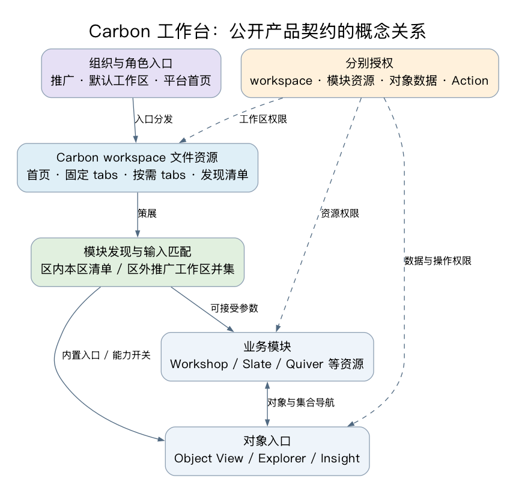
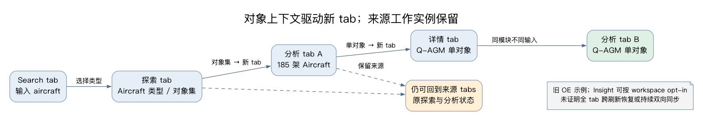
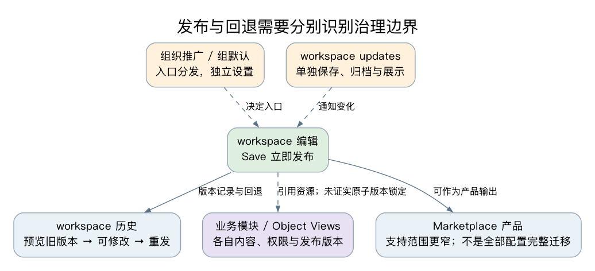

# Carbon：面向角色的统一业务工作台与对象导航外壳

> 深入中文研究，核验日期：2026-10-01。面向 EOS 应用架构负责人，聚焦应用外壳、业务工作台和应用间组合。当前公开英文文档、带日期公告和公开实践分别标明；未披露统一租户 build，不能假定所有实例同日具有相同行为。
> 本篇仅使用公开资料，未登录客户 Foundry、执行业务 Action、读取 EOS 内部代码或测试真实租户配置。EOS 内容均为架构分析和验证建议。官方截图与自绘概念图按来源区分，媒体实际读取程度见附录。

## 结论：可借鉴工作台契约，不能据此推定通用微前端能力

**Carbon 将不同业务应用、对象入口和分析资源策展成面向特定角色的工作区，让用户沿业务上下文继续工作。** 工作区有自己的首页、固定模块 tab、按需打开入口、模块发现清单和组织入口策略；跨模块导航传递对象或对象集，目标在新 tab 打开，来源模块保留当前状态。[Carbon overview](https://www.palantir.com/docs/foundry/carbon/overview/)、[Workspaces](https://www.palantir.com/docs/foundry/carbon/workspaces-overview/)、[Modules](https://www.palantir.com/docs/foundry/carbon/modules-overview/)

对 EOS 最有价值的是六项可拆开讨论的契约：

1. **工作区策展与模块实现分开。** 同一业务模块可在不同角色工作区被发现或固定；首页本身也可用模块替换。工作区不是业务应用全部代码的所有者。[Home configuration](https://www.palantir.com/docs/foundry/carbon/configuration-home/)
2. **应用注册与对象导航相连。** “Open in”依赖目标输入、当前输出及类型约束，不能只维护一个 URL 菜单。[Module discovery](https://www.palantir.com/docs/foundry/carbon/modules-discovery/)
3. **固定入口与工作实例分开。** 固定 tabs承载日常任务，新 tabs承载从来源上下文分支的工作实例；同一模块可被不同输入多次打开。[Getting started](https://www.palantir.com/docs/foundry/carbon/getting-started/)
4. **发现范围、入口分发与授权分开。** 当前工作区内只发现本区清单；工作区外汇总可访问的 promoted workspaces。推广和默认入口不会授予底层资源权限。[Permissions](https://www.palantir.com/docs/foundry/carbon/permissions-configure/)
5. **配置、业务模块和用户状态有不同生命周期。** Carbon Save立即发布配置；旧版本可预览、修改和重发；工作区更新公告和组默认设置另行保存。[Edit workspace](https://www.palantir.com/docs/foundry/carbon/workspaces-edit/)、[Version history](https://www.palantir.com/docs/foundry/carbon/workspaces-history/)
6. **探索入口正在演进。** 2026-09-21公告增加 Insight 与 modern object search 两个独立 opt-in；旧示例中的 Object Explorer 不能代表所有工作区唯一的当前入口。[September announcement](https://www.palantir.com/docs/foundry/announcements/2026-09/#explore-ontology-data-in-carbon-with-insight-analysis)

**公开证据没有证明 Carbon 是可任意装载 React/OSDK 应用的通用微前端框架。** 文档中的 dynamic modules指 Workshop、Slate、Quiver 等可创作资源；YAML枚举和资源配置不等于公开 JS 插件注册协议。外部链接、iframe、Workshop Custom Widget 与原生 Carbon module 也不是同一接入层。能够跳转到一个应用，不能推出其已实现对象参数、状态恢复、权限与发布兼容。[Navigation integration](https://www.palantir.com/docs/foundry/carbon/modules-navigation/)、[YAML reference](https://www.palantir.com/docs/foundry/carbon/code-reference/)、[Custom Widgets研究](../custom-widgets-2026-10/README.md)

| 阅读材料 | 解决的问题 |
|---|---|
| 本正文 | 工作台模型、完整业务流、分发/授权/发布、EOS取舍 |
| [模块与导航证据](notes/module-navigation-evidence.md) | 各模块输入输出、发现条件、参数限制与状态边界 |
| [公开实践](notes/public-practice.md) | 作者原帖与用户反馈、时间差异、公开源码/博客搜索范围 |
| [媒体与Insight证据](notes/media-insight-evidence.md) | 实际界面观察、最新双开关、媒体读取边界 |
| [sources](sources.md)、[assets](assets.md)、[checks](checks.md) | 来源登记、尺寸/字节/hash、检查与未证实项 |

Object Views内部布局、Standard/Configured/Legacy、Workshop变量计算和widget宿主协议沿用 [Object Views专题](../object-views-2026-10/README.md)、[Workshop Runtime](../workshop-runtime-2026-10/README.md) 与 [Custom Widgets](../custom-widgets-2026-10/README.md)。本篇只讨论它们进入工作台之后的组合关系，不重新描述其内部实现。

## 1. 总体关系：工作区是策展与导航边界

*图1｜依据公开契约自绘，Graphviz实际渲染；[可编辑源](diagrams/01-workspace-model.dot)、[SVG](diagrams/01-workspace-model.svg)。实线表示配置或导航关系，虚线表示独立授权约束。不是 Palantir 内部服务拓扑、共享 React 树或统一数据缓存实现。*

workspace是单独保存在 Project 中的文件资源，有自己的访问权限。官方建议与要暴露的 Workshop modules 放入同一文件夹，以便文件夹权限覆盖相关资源；这是权限管理的便利，不改变“资源分别授权”的规则。[Create workspace](https://www.palantir.com/docs/foundry/carbon/workspaces-create/)

| 层次 | Carbon公开职责 | EOS架构分析 |
|---|---|---|
| 组织与角色入口 | 推广workspaces、导航菜单、组默认workspace、平台首页URL | 入口分发策略应可审计，适应一人多角色 |
| 工作区外壳 | 首页、固定tabs、加号菜单、发现列表、辅助功能 | 围绕任务策展，减少必须记住的产品名称 |
| 模块契约 | 参数化应用、对象/集合输入输出、导航动作 | 定义公共上下文信封和可接受输入，避免菜单与数据断开 |
| 模块内容 | Workshop任务页、Object View详情、Explorer/Insight探索、Quiver分析等 | 页面团队保留内容所有权；外壳团队维护组合契约 |
| 资源与业务授权 | 工作区、应用资源、对象和Action各自的访问规则 | 前端隐藏入口不能成为后端授权规则 |

这里的“统一”是用户工作流可连续推进，不意味着所有模块必须同框架、同进程或同一发布批次。公开资料直接证实产品层导航，未提供 Carbon 闭源运行时拓扑。[Operational applications](https://www.palantir.com/docs/foundry/app-building/operational-apps/)、[Navigation framework](https://www.palantir.com/docs/foundry/carbon/modules-navigation/)

## 2. 首页、固定tab、按需tab：三个不同产品决策

*图2｜官方 Aviation Workspace示例原图。展示角色首页、业务入口和收藏对象；不是本次真实部署，也不证明图中每个资源对任意用户可见。[来源](https://www.palantir.com/docs/foundry/carbon/example-workspaces/)。*

默认首页提供 Ontology-aware search 和配置区块，可展示模块、对象类型、对象、探索等资源链接；首页也可替换为任一支持的模块。Home配置有logo、subtitle和A/B/C三列，区块可用列表或卡片，可选收藏对象、saved explorations等默认集合。[Workspace home](https://www.palantir.com/docs/foundry/carbon/workspaces-overview/#home-page)、[Home configuration](https://www.palantir.com/docs/foundry/carbon/configuration-home/)

*图3｜官方Home配置侧栏原图；实际画面显示首页配置，未显示替换模块的选择控件。Module-backed home能力以文字文档为依据。[来源](https://www.palantir.com/docs/foundry/carbon/configuration-home/)。*

官方航空教程先配置相关对象类型，再把 Route Alert Inbox 和 Flight Command Center 两个 Workshop modules固定在菜单栏；首页“All menu bar items”区块可随菜单资源自动填充。固定入口不是把每个具体航班都永久固定，而是保证日常任务应用始终容易找到。[Getting started](https://www.palantir.com/docs/foundry/carbon/getting-started/)

*图4｜官方Anchored modules编辑界面。[来源](https://www.palantir.com/docs/foundry/carbon/configuration-menu-bar/)。*

| 类型 | 已确认行为 | 适合的工作台用途（分析） |
|---|---|---|
| Home | 原生策展首页或module-backed homepage | 角色任务启动、公告、收藏与常用入口 |
| Anchored modules | 菜单栏永久可见的核心模块；官方建议限日常任务 | 待办、调度、关键监控 |
| New-tab modules | “+”下配置的按需模块，在新Carbon tab打开 | 非高频分析工具、辅助任务 |
| 导航生成的新tab | 当前模块输出驱动目标实例；来源状态保留 | 同一列表分支查看多个对象、比较多个输入 |

依据：[Menu bar](https://www.palantir.com/docs/foundry/carbon/configuration-menu-bar/)、[Modules](https://www.palantir.com/docs/foundry/carbon/modules-overview/)。固定tab、加号清单、discoverable清单是不同配置表；公开文档未说明它们自动双向同步，不能把“固定”直接写成“必定出现在Open in”。

*图5｜官方New-tab modules编辑界面；“+”入口与对象上下文的Open in应分别验证。[来源](https://www.palantir.com/docs/foundry/carbon/configuration-menu-bar/)。*

**EOS分析：**应明确“模块定义”和“tab实例”两个身份。日常固定入口可只占一个位置，临时实例则记录输入对象/集合、来源tab与标题。是否合并同模块同输入实例、关闭固定tab之后的行为、刷新后的恢复、重名tab显示、内存淘汰与未提交表单确认，都应是明确产品规则。本次公开资料没有给出这些策略的完整可配置契约，不能从“来源状态保留”推定。

## 3. 模块注册：内置应用与可创作资源

模块是能在 Carbon tab内打开、接收参数的应用。导航文档区分 **built-in** 与 **dynamic**：前者如 Search、Object Explorer和Object View，有预定义输入输出，不关联独立Foundry资源；后者如Workshop、Slate、Quiver等由用户创作，需配置输入输出及发现。文档并非把dynamic定义为任意远程JS加载。[Modules overview](https://www.palantir.com/docs/foundry/carbon/modules-overview/)、[Module integration](https://www.palantir.com/docs/foundry/carbon/modules-navigation/#integration-with-the-navigation-framework-for-carbon-modules)

*图6｜官方Workshop变量接口配置示例，可见external ID与Flight Alert类型/单对象约束；Carbon发现清单登记是另一步，不在此图中。[来源](https://www.palantir.com/docs/foundry/carbon/modules-discovery/)。*

Workshop的Open in接入需要两端配置：Carbon的Discoverable modules登记目标资源；Workshop暴露有external ID的ObjectSet接口变量，可加对象类型constraint。没有constraint时可在所有类型上发现，不能理解为应用逻辑已经支持所有类型。Quiver dashboard发现受创建时对象类型影响；Slate有变量时可出现在各对象类型；Vertex graph也有专门发现方式。[Discovery configuration](https://www.palantir.com/docs/foundry/carbon/modules-discovery/)

**判断边界：**“发现到”表示存在可用导航动作，“可打开”表示资源与宿主入口满足条件，“能执行业务”仍受数据与Action权限和模块逻辑约束。这三项要分别测。YAML参考有有限module type配置，而导航集成、菜单栏、Marketplace支持集合并不完全一致；应对具体入口读具体清单，不将某页列举汇总成所有场景通用支持矩阵。[YAML reference](https://www.palantir.com/docs/foundry/carbon/code-reference/)、[Marketplace limitations](https://www.palantir.com/docs/foundry/carbon/marketplace-carbon-workspace/)

对自研OSDK应用，公开资料可证实的接近路径是 **OSDK Custom Widget→Workshop→Carbon模块**，或普通外链。前者协议由Workshop承载，后者是链接。未找到可复核公开协议证明任意独立OSDK React app可直接注册为原生Carbon dynamic module，并获得同等输入输出/状态管理。这里是证据缺口，不是断言产品永远不支持。[Custom Widgets overview](https://www.palantir.com/docs/foundry/custom-widgets/overview/)、[OSDK React应用研究](../osdk-react-components-2026-09/README.md)、[公开实践附录](notes/public-practice.md)

## 4. 对象上下文导航：把工作结果传给下一步

*图7｜依据官方航空导航示例自绘并实际渲染；[源](diagrams/02-context-navigation.dot)、[SVG](diagrams/02-context-navigation.svg)。展示新tab中的工作实例和来源保留，不表示选中后持续双向同步、浏览器刷新恢复或所有表单状态永久持久化。*

*官方旧入口示例，显示Aircrafts集合探索中的Open in；未据此宣称Insight已完全复制旧界面。[来源](https://www.palantir.com/docs/foundry/carbon/modules-navigation/)。*

官方航空示例的链路是 Search→Aircraft类型探索→185架飞机的Quiver分析→Q-AGM详情→以单个Q-AGM再次进入Quiver。相同分析模块可收到不同输入而再次出现。Object Explorer结果列表也能分支为多个独立Object View tabs；Carbon之外相同导航会打开新的浏览器tab。[Navigation examples](https://www.palantir.com/docs/foundry/carbon/modules-navigation/#example-with-multiple-navigation-steps)

| 来源/目标 | 导航相关公开契约 | 对EOS的分析 |
|---|---|---|
| Search | 输入搜索词，用户选择对象或类型进入后续入口 | 搜索不是业务上下文最终身份；确认对象身份后再转任务 |
| Object Explorer | 对象集输入，当前选择集可作为输出 | “查询结果集”“选中集”“单对象焦点”要区分 |
| Object View | 输入/输出单个对象 | 详情跳下一任务应带对象身份，不能只传显示标题 |
| Workshop | interface变量接输入，应用事件触发具体目标 | 明确命名参数、输入约束和默认值 |
| Quiver/Slate等 | 专门资源接口与导航方式 | 通用信封之外仍要允许宿主适配器 |

各项精确限制见[模块与导航附录](notes/module-navigation-evidence.md)。此处是业务组合抽象，非统一API签名。Workshop内对象/集合转换、Object View布局及Action执行机制见已有专题。

*官方Q-AGM Object View示例，可观察保留的Search/Aircrafts/Quiver来源tabs及再次Open in分析。保留状态的保证以正文契约为依据，截图本身不证明刷新后恢复。[来源](https://www.palantir.com/docs/foundry/carbon/modules-navigation/)。*

**Carbon导航、URL初始化、routing与saved state不能混为一谈。** Workshop事件在Carbon内打开Carbon tab，在普通环境打开浏览器tab；interface URL在首次加载时初始化。当前module-interface另明确Carbon的Workshop tab导航支持ObjectSet filter变量；普通routing的URL限制不能反推此通道也不支持。Carbon导航文档另列空ObjectSet、NaN及若干变量类型限制，具体参见附录。[Workshop events](https://www.palantir.com/docs/foundry/workshop/concepts-events/#applications)、[Module interface](https://www.palantir.com/docs/foundry/workshop/module-interface/#carbon-navigation)、[Routing](https://www.palantir.com/docs/foundry/workshop/routing/)

Workshop 原 external ID与Carbon参数名需要分开：原ID为 `alert` 时，Carbon参数名是 `variable.alert`，Carbon URL query key是 `param.variable.alert`；Workshop中仍保留 `alert`。`variable.`前缀属于Carbon映射，不应要求修改Workshop接口原ID。[Workshop参数映射](https://www.palantir.com/docs/foundry/carbon/modules-navigation/#workshop-module-interface)

**EOS分析：**以对象身份和可解释集合表达式作为上下文，避免传递某屏DOM、某数据表行号或大数组拷贝。信封建议包含业务类型、集合/对象引用、目标参数、来源tab、创建时间与协议版本；分享前再次授权，集合作用域改变后重新校验。是否传“调用时集合快照”或“可重新求值查询”，不同产品含义应公开给用户，不能由实现偶然决定。

## 5. Open in范围：工作区内策展，工作区外汇总

在Carbon内，Open in只显示当前workspace配置的discoverable modules。Carbon外汇总用户可访问的promoted workspaces；导航文档还明确纳入主组织与guest组织，最后按当前输出能否适用于模块参数约束过滤。[Discovery scope](https://www.palantir.com/docs/foundry/carbon/modules-discovery/#module-discovery-behavior-in-carbon-and-outside-carbon)、[Union steps](https://www.palantir.com/docs/foundry/carbon/modules-navigation/#module-discovery-behavior-in-carbon-and-outside-carbon)

| 用户入口 | 候选模块范围 | 不能推出的行为 |
|---|---|---|
| 理赔workspace | 该workspace自己的清单 | 其他角色应用自动全部出现 |
| 精算workspace | 该workspace自己的清单 | 有资源权限即可自动发现 |
| 普通Object Explorer/Object View | 可访问promoted workspaces的清单并集，再匹配当前输出 | 任意link-only workspace自动加入全局目录 |
| 直接目标URL | 目标资源入口与相关授权 | 自动出现在任何Open in菜单 |

表中“理赔/精算”是解释官方发现规则的角色示例。官方社区2025-05作者讨论已经指出：仅为全局Open in，可能需要配置实际不直接使用的Carbon工作区；推广/组差异可能造成有模块资源权限却看不到导航动作。此评论与当前文档相互印证，仍是带日期实践观察。[Original discussion](https://community.palantir.com/t/object-view-for-sets-of-objects/3749)

**EOS取舍：**这套设计能避免业务角色工作台被全平台应用淹没；代价是全局应用能力目录受工作区推广策略牵动。建议把“模块能力注册”“workspace策展”“组织/角色分发”做成三个显式关系，允许同一能力有多种策展位置。诊断应能说明一个动作消失是因类型不匹配、工作区清单、分发策略、资源不可访问还是执行条件不足；这些理由适合管理界面，不必全部暴露给普通用户。

## 6. 角色化首页、组织推广与组默认工作区

*图8｜官方入口截图，实际显示Platform apps下的Carbon workspaces，Promoted apps计数为0；已推广工作区可按名称查找的行为以官方正文为依据。[来源](https://www.palantir.com/docs/foundry/carbon/overview/)。*

promoted workspaces由组织管理员配置，Navigation Menu为成员与guest显示其可访问工作区，另可提供外部应用链接；link-only工作区仍可从Project或直接URL打开。workspace General设置还可覆写组织层外链与theme。[Workspace navigation](https://www.palantir.com/docs/foundry/carbon/workspaces-navigation/)、[Access configuration](https://www.palantir.com/docs/foundry/carbon/configuration-access/)、[General configuration](https://www.palantir.com/docs/foundry/carbon/configuration-general/)

默认入口至少有四个层次，必须分别管理：

| 层次 | 当前规则 |
|---|---|
| 组织平台landing page | Control Panel设置Home page URL；希望进入默认Carbon时设为`/carbon`，还可针对组配置 |
| 组默认workspace | workspace须已promoted且组在其default列表中；设置另行保存、立即生效 |
| 用户无唯一组默认 | 首次选择promoted工作区，随后用浏览器cookie记录最近访问 |
| 一个workspace的Home | 原生首页策展或module-backed homepage，是区内内容选择 |

依据：[Landing page](https://www.palantir.com/docs/foundry/carbon/permissions-landing-page/)、[Default workspace](https://www.palantir.com/docs/foundry/carbon/permissions-default-workspace/)、[Home configuration](https://www.palantir.com/docs/foundry/carbon/configuration-home/)。如果用户有两个或更多组默认workspace，官方规则不是按优先级选胜者，而是视为没有默认，回到选择/最近访问；cookie清除或新设备也会再次选择。

**EOS分析：**面向角色的首页不意味着每个人只能有一个身份。组织管理员应能检查重叠组，展示冲突原因；用户应有可预期的工作区切换和回到任务能力。若EOS选择服务端保存最近工作台，而非浏览器cookie，应明确跨设备同步、退出组织后的失效与审计策略，这是自己的产品选择，不能归为Carbon已证实行为。

## 7. 权限分层与导航限制

Carbon有组织管理员、workspace editor和viewer三层职责。管理员推广工作区和改组织配置；editor需工作区资源edit权限，可以迭代link-only工作区但不能替管理员推广；viewer需workspace view权限。推广解决菜单可见性，直接URL仍可打开有权限的未推广资源。**工作区访问不授予其中模块、对象或其他资源访问。**[Permissions](https://www.palantir.com/docs/foundry/carbon/permissions-configure/)

关闭“Navigation out of Carbon”会隐藏或限制Carbon外壳中的外链、help、账号等入口；模块内部仍可能包含离开Carbon的动作。模块内部离开Carbon的应用导航限制在Control Panel的Application access中配置。官方Application access文档明确它仅简化前端体验，不是安全功能；真正授权仍依赖资源与数据权限。不应写成workspace天然形成数据安全隔离域。[Restrict navigation](https://www.palantir.com/docs/foundry/carbon/restrict-workspace-nav/)、[Configure application access](https://www.palantir.com/docs/foundry/administration/configure-application-access/)

**EOS验证建议：**准备“能进workspace但不能读一个模块”“能读模块但不能读其对象数据”“能读对象但不能提交Action”“guest跨组织入口”四组最小账户，检查直链、搜索、Open in、通知和后台接口。首页删除一个链接之后，直链仍可访问是否符合设计，应由权限规则决定。不要用隐藏菜单来验证拒绝授权。

AIP Assist也不是勾选开关便获得任意平台助手：General文档要求启用workspace选项、专门配置Chatbot Studio中的chatbots，并给予用户对应访问权。这是入口配置与助手资源权限相互独立的又一例。[Enable AIP Assist](https://www.palantir.com/docs/foundry/carbon/configuration-general/#enable-aip-assist)

## 8. 接入案例：待办→探索→详情→处理→分析

*图9｜官方Claim Portal原图；表示面向客户支持的管理、分流与操作入口。[来源](https://www.palantir.com/docs/foundry/carbon/example-workspaces/)。它是产品示例，未披露生产客户、规模或性能，不应当作实际客户收益证据。*

下面将官方航空/理赔示例合成为一个**EOS架构讨论用场景**，并非声称官方提供同一套完整应用：

1. **角色首页与固定待办。** workspace固定Workshop待办，首页显示关键任务、对象类型与收藏。通用首页适合稳定入口；动态数量、个性化建议或复杂任务卡片可考虑module-backed home。
2. **从集合进入探索。** 用户查看待办相关对象集；旧入口是Object Explorer，启用2026-09选项后相应exploration可由Insight承载。源任务页仍有自己的生命周期。
3. **从结果分支详情。** 选中多个对象，逐个打开Object View tabs，保留原探索列表；详情内部采用已有Object Views设计。
4. **从对象/集合进入Workshop处理。** 登记目标模块及ObjectSet参数和类型约束，让Open in展示适用动作。处理后的数据更新与列表刷新按Workshop/Action机制验证，Carbon来源状态保留不保证事务完成信号。
5. **把结果交给分析模块。** Quiver等受支持资源接收集合或对象；用户可以回来源继续选下一组。

基础事实来自[Carbon getting started](https://www.palantir.com/docs/foundry/carbon/getting-started/)、[Navigation](https://www.palantir.com/docs/foundry/carbon/modules-navigation/)、[Insight公告](https://www.palantir.com/docs/foundry/announcements/2026-09/#explore-ontology-data-in-carbon-with-insight-analysis)。业务组合与验收方法为本篇分析。

**实现这一场景时应保留两套状态。** 业务上下文决定“处理哪些对象”，来源页面状态决定“用户如何到达这里”：筛选、排序、视图、选中集、滚动、当前tab等。跨模块传参不应默认携带所有来源内部状态；保持来源活着、可分享目标上下文和刷新后恢复整个工作台，是三种不同承诺。作者2025-10 saved-state讨论明确，当时首页聚合用户saved states还牵涉资源文件夹权限和静态Resource List配置。[Saved states原帖](https://community.palantir.com/t/saved-module-states-in-carbon/5155)、[Workshop state saving](https://www.palantir.com/docs/foundry/workshop/state-saving/)

## 9. 版本治理：工作区配置不等于整套应用的原子发布

*图10｜依据公开规则自绘、实际渲染；[源](diagrams/03-release-boundaries.dot)、[SVG](diagrams/03-release-boundaries.svg)。分支表示独立治理边界，不代表平台内部事务顺序，也没有假设workspace与底层资源版本原子绑定。*

workspace编辑界面的Save立即发布更新配置，Discard丢弃未保存修改。Version history允许选择旧版本预览、再编辑并重发，未保存修改用星号标记。编辑link-only工作区可作为草稿迭代方式，但不能把Carbon Save写成Workshop的Save draft/Publish两阶段流程。[Edit workspace](https://www.palantir.com/docs/foundry/carbon/workspaces-edit/)、[History](https://www.palantir.com/docs/foundry/carbon/workspaces-history/)

workspace updates有单独编辑/保存对话框，内容可归档、恢复或删除；用户进入workspace时看未读步骤，之后可从What's New看历史。组默认设置同样独立保存、立即应用。回退workspace配置是否同时回退公告内容、组织推广、组默认、module发布版本，公开文档没有作出原子回退承诺。[Workspace updates](https://www.palantir.com/docs/foundry/carbon/workspaces-updates/)、[Default workspace](https://www.palantir.com/docs/foundry/carbon/permissions-default-workspace/)

Marketplace可分发Carbon workspace，但官方明确排除walkthroughs、非Workshop/object type/Link to Foundry Application的module types、search默认对象类型groups以及Select objects item。文档的“coming soon”仅是计划，不能写成已支持完整打包迁移。[Marketplace support](https://www.palantir.com/docs/foundry/carbon/marketplace-carbon-workspace/)

**EOS治理建议：**即便首期只做简单工作台配置，也应保存workspace版本与当次依赖清单：模块身份、接口版本、对象类型约束、目标入口、发布版本选择和可选能力。发布前检查消失资源、改名参数和权限变化；回滚说明哪些层被回退。若需要真正整套业务应用版本锁定或审批发布，必须单独设计并验证，不从“workspace有版本历史”推导。

公共用户2026-01提出希望从Workflow/Data Lineage看到Carbon暴露哪些资源，作者回复表示记录feature request。它提示组合依赖可观测性值得验证，但不证明当前完全无Lineage集成，更不能证明该feature已经交付。[Lineage反馈](https://community.palantir.com/t/data-linage-present-carbon-workspaces-as-linkable-item/5795)

## 10. 最新入口变化：Insight与modern object search

*图11｜2026-09-21官方公告截图，展示Insight analysis进入Carbon tab；截图不是完整旧链接兼容测试。[公告](https://www.palantir.com/docs/foundry/announcements/2026-09/#explore-ontology-data-in-carbon-with-insight-analysis)。*

公告描述两个workspace级独立开关：Insight替换object types、object sets及saved explorations原本的Object Explorer-style explorations；modern search同时更新搜索结果页与主页search bar。现有搜索或探索tabs在修改设置后需reopen或refresh。既有workspaces继续opt-in；新workspace未来默认启用是公告计划，截至核验日不写成所有workspace都已默认迁移。[Dated announcement](https://www.palantir.com/docs/foundry/announcements/2026-09/#explore-ontology-data-in-carbon-with-insight-analysis)

*图12｜同一公告配置截图。开关独立性是明确事实，不能用“Carbon已换新版”一个布尔值概括所有入口。*

**资料张力：**Carbon create/getting-started/navigation仍使用Object Explorer默认search、exploration和航空示例。以带日期公告补充解释旧路径，不擅自改写所有旧文档规则为Insight API。Insight本身是对象数据探索与分析入口，但不能仅据产品介绍推定旧module导航、所有Quiver/Slate入口、完整saved state和深链接兼容性。[Create workspace](https://www.palantir.com/docs/foundry/carbon/workspaces-create/)、[Insight overview](https://www.palantir.com/docs/foundry/insight/overview/)

*图13｜官方公告真实结果页截图；用于观察入口变化，未执行其中任何业务操作。另见[首页搜索截图](assets/media-modern-search-home.png)。*

**EOS分析：**工作台应把“探索目标”抽象为稳定业务能力，避免入口迁移迫使所有模块重写产品名和链接。新旧适配器共存期间，记录workspace能力开关、允许灰度，并用同一测试集合覆盖搜索→集合探索→对象详情→操作目标。不能只验证新首页能显示。

## 11. 多源交叉：公开实践能解释取舍，不能替代正式契约

本篇事实骨架来自官方文档与公告；社区原帖作为带日期实践证据，分别核对其作者、上下文与后续回复。公开源码/技术博客查找结果见[附录](notes/public-practice.md)，不把营销描述或同名碳排放产品当作Carbon工作台证据。

| 公开实践 | 可支持的判断 | 不采用的扩大结论 |
|---|---|---|
| 2025-05 Homepage Sidebar | 用户确有标准Foundry侧栏与Carbon聚焦外壳的取舍；作者提示iframe包Carbon会影响URL更新 | 已公开稳定微前端协议或确定的缓存内部拓扑 |
| 2025-04 Workshop landing page | 动态首页与原生策展组件的外观/动作组合存在需求 | 默认Carbon首页可任意插入Workshop组件 |
| 2025-10 Saved Module States | 收藏目标直链可能绕过首页公告，saved-state文件权限也影响聚合 | Carbon导航自动保存全部应用状态或任意workspace重定位 |
| 2026-03 Link possibilities | 作者说明可用完整URL，且提出改名请求 | 自定义URL已成为原生module，或改名请求已GA |
| 2026-01 Lineage | 团队希望追踪工作台暴露资源，回复记录需求 | Lineage已完整覆盖Carbon与全部依赖 |

来源：[Sidebar](https://community.palantir.com/t/carbon-homepage-sidebar/3791)、[Landing page](https://community.palantir.com/t/carbon-landing-page-in-workshop/3457)、[Saved states](https://community.palantir.com/t/saved-module-states-in-carbon/5155)、[Links](https://community.palantir.com/t/add-all-foundry-applications-as-link-possibilities-in-carbon-workspace/4374)、[Lineage](https://community.palantir.com/t/data-linage-present-carbon-workspaces-as-linkable-item/5795)。这些是原始用户/作者讨论，身份未独立核实的回复不称官方产品承诺。

## 12. EOS的取舍与验证路线

**建议优先借鉴“策展外壳+上下文导航”的产品分层。** 工作台负责入口、实例与适配契约；任务页负责业务流程；对象模型与后端负责授权与读写。先通过一个跨应用业务路径确认这些层能合作，再决定是否需要运行时微前端、远程组件加载或统一构建系统。这些是EOS的选择，不是从Carbon界面反推的技术要求。

| 决策 | 建议（架构分析） | 收益与代价 |
|---|---|---|
| 工作区粒度 | 按稳定角色/任务族策展，避免每页一个workspace | 减少入口噪声；需处理多角色切换 |
| 首页面向谁 | 固定入口用策展首页；动态任务用模块首页 | 维护更清楚；两类首页需统一品牌与导航 |
| 模块目录 | 能力注册、workspace选择、角色分发各存显式关系 | 可诊断发现缺失；增加配置治理 |
| 上下文协议 | 对象/集合身份、输入约束、版本和来源实例可追踪 | 可组合且可审计；需处理查询与快照区别 |
| tab模型 | 定义固定入口与工作实例，允许同模块不同输入 | 保留分支工作；需处理内存、重名、恢复与关闭 |
| 自研应用接入 | 分别评估链接、iframe、受控宿主协议与原生模块 | 复杂度透明；不能把所有接入承诺为同等级 |
| 发布治理 | 配置预览、依赖检查、发布记录和分层回滚 | 降低资源漂移；不应先承诺跨应用原子升级 |

以下验证用例可形成EOS评估记录，也可用于有授权租户内核对Carbon；本次没有执行这些租户测试。

| 优先级 | 验证场景 | 应记录的结果 |
|---|---|---|
| P0 | 待办筛选并选中对象，分支打开两个详情，再回来源 | 来源筛选/选中/滚动保留程度，实例身份与标题 |
| P0 | 同一处理模块分别接单对象、类型匹配集合、空集合和错类型 | 发现条件、拒绝/空状态、参数默认值；不能静默误处理 |
| P0 | 同一用户两个workspace与主/guest组织入口 | 区内清单、区外并集、组默认冲突与直链结果 |
| P0 | 资源/对象/Action权限分别拒绝 | 后端拒绝、UI解释、直链和通知是否一致 |
| P1 | 参数external ID改名或对象类型约束改变 | 旧workspace配置、深链接和saved states的兼容行为 |
| P1 | Carbon配置回退，模块发布新版本，公告独立更新 | 每层实际版本，旧资源迁移与回滚覆盖范围 |
| P1 | 关闭tab、刷新、浏览器重启、分享链接、另一设备 | 活跃状态与持久恢复边界，未提交数据处理 |
| P1 | Insight/search两个开关四种组合 | 旧探索/对象集链接、Open in、保存状态与重新打开行为 |
| P2 | 多tabs长期工作、集合规模上升 | 内存/响应/授权刷新与缓存失效；无公开性能承诺可代替测试 |
| P2 | 外链、iframe、Custom Widget→Workshop各一条接入 | URL、上下文、尺寸、主题、错误和发布兼容的具体等级 |

**尚未证实的问题：**任意原生OSDK app注册协议；全模块统一state序列化；tab数量/内存/淘汰策略；跨设备完整workspace恢复；对象操作到所有来源列表的刷新完成信号；workspace与模块版本锁定；Insight灰度后的全量旧链接兼容；Carbon资源依赖图覆盖程度。没有公开证据不表示不存在，建议在有权限的产品试验和供应商确认中逐项补证。

这份研究支持的是架构判断与可执行验证问题，不是EOS现有实现审计。媒体/来源/检查完整记录见 [sources](sources.md)、[assets](assets.md)、[checks](checks.md)。
