# Carbon：官方真实界面与 Insight 入口变化

检索与媒体获取日期：**2026-10-01 UTC**。本附录保存 Palantir 公开文档中的 **14 幅官方 PNG 原图**。这些是厂商发布的示例界面，不是本研究进入 Foundry 租户后取得的截图。原始 HTTP 响应字节未修改；红框、Column A/B/C 标签与模糊遮盖均来自官方图片。原 URL、来源页、获取 UTC、尺寸、bytes、SHA-256、解码及逐图视检结果见 [media-manifest.json](media-manifest.json)，便于阅读的逐图资产表见 [media-assets.md](media-assets.md)。不据公开访问宣称图片有开放许可证。

## 1. 有日期的最新入口变化

**已确认：2026-09-21 公告改变了 Carbon 的对象探索与搜索入口基线。** Carbon 支持 Insight analysis 与 modern object search；workspace owner 分别通过两个工作区级设置开启。Insight 开启后替代 object type、object set、saved exploration 的 Object Explorer 风格探索；现代搜索同时启用新版首页搜索框和结果页，在工作区配置的搜索范围内搜索。保存配置后，需要重开或刷新已有搜索/探索标签页。[September 2026 announcement](https://www.palantir.com/docs/foundry/announcements/2026-09#explore-ontology-data-in-carbon-with-insight-analysis)

**时间边界：**公告把“新建工作区未来默认开启”表述为后续方向，并明确已有工作区继续 opt-in。不能将这一公告写成所有工作区已迁移或 OE 已整体弃用。当前 Insight 文档仍分别定位 Insight 的分析路径与 Object Explorer 的 Ontology 发现、全域搜索及单对象查看能力。[Insight overview](https://www.palantir.com/docs/foundry/insight/overview)

**资料差异：**本次读取的 [General configuration](https://www.palantir.com/docs/foundry/carbon/configuration-general) 与 [Menu bar configuration](https://www.palantir.com/docs/foundry/carbon/configuration-menu-bar) 仍使用较早的搜索/探索例子；前者正文未描述 Insight 两开关。本研究对新入口采用有日期公告，不推断所有租户 UI 已同步。旧模块导航例子仍可说明对象参数与保留来源标签页的组合机制，但不能作为全体工作区唯一当前 UI。[Modules navigation](https://www.palantir.com/docs/foundry/carbon/modules-navigation)

### M09：Insight 在 Carbon 动态标签页内分析对象

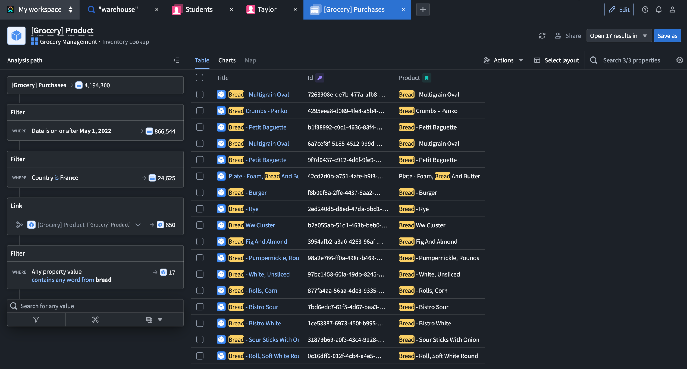

画面上方有搜索 `warehouse`、Students、Taylor 和 `[Grocery] Purchases` 标签；主体有 Analysis path、Filter、Link、结果表、Actions、Open 17 results in 与 Save as。它直接展示了分析工作面与工作区标签栏共存。左侧示例日期 May 1, 2022 是过滤条件，不是截图拍摄日期。单图不证明查询性能、完整生命周期或旧保存探索 URL 的兼容策略。来源为上述 2026-09-21 公告；文件名中的 2026-09-22 不作为图像拍摄日期。

### M10–M11：现代搜索的首页入口与结果工作面

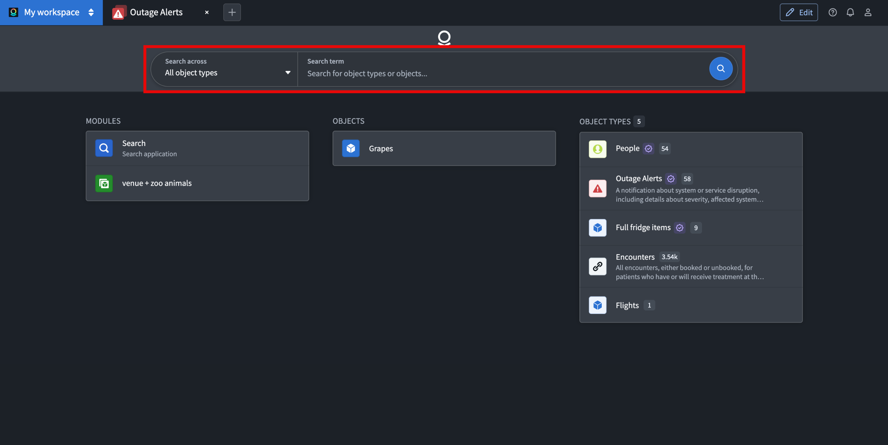

M10 显示 Search across / All object types、Search term 与搜索按钮；下方有 Modules、Objects、Object types 三列。红框来自官方。图里的 All object types 是这个示例的范围，不能推出每个工作区都全域搜索。

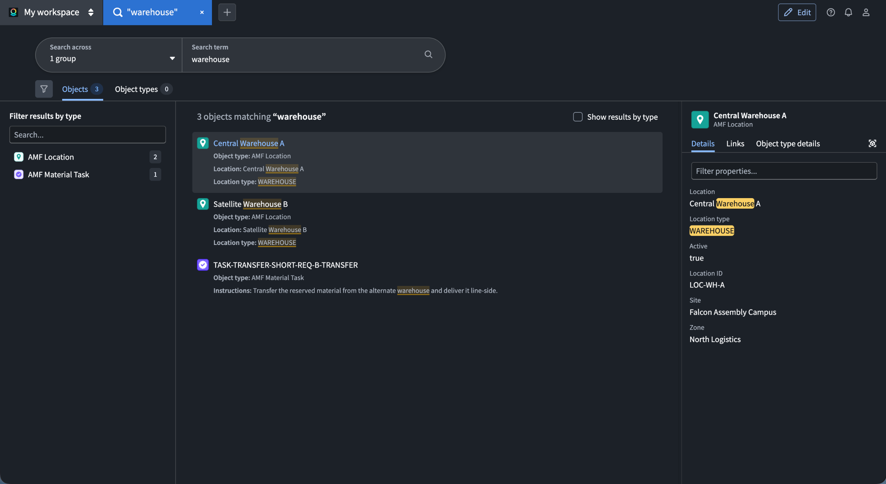

M11 显示范围 `1 group`、查询 warehouse、Objects / Object types 分类、左侧类型过滤、中央结果与右侧 Details / Links / Object type details。右侧预览 Central Warehouse A 与中央结果并列。它支持搜索到对象预览的空间关系，不能证明 preview 是哪种 Object View 配置或用户有修改权限。两图来源均为上述公告。

### M12：两开关独立配置，存在工作区作用域

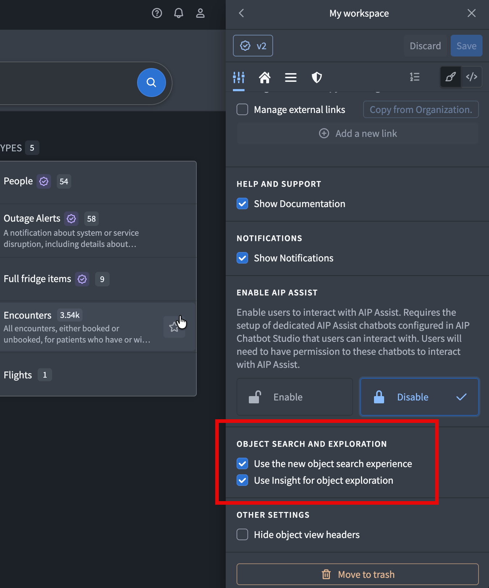

可直接看到 General 编辑页的 Object search and exploration 区域内两项：Use the new object search experience 与 Use Insight for object exploration。示例两项都选中，并不证明必须同时开启；独立性来自公告正文。画面中的 v2 是该示例工作区配置版本，不是 Carbon 软件版本。来源为上述公告。

## 2. 工作台外壳、首页和固定/动态入口

### M01–M02：业务工作区策展不同入口

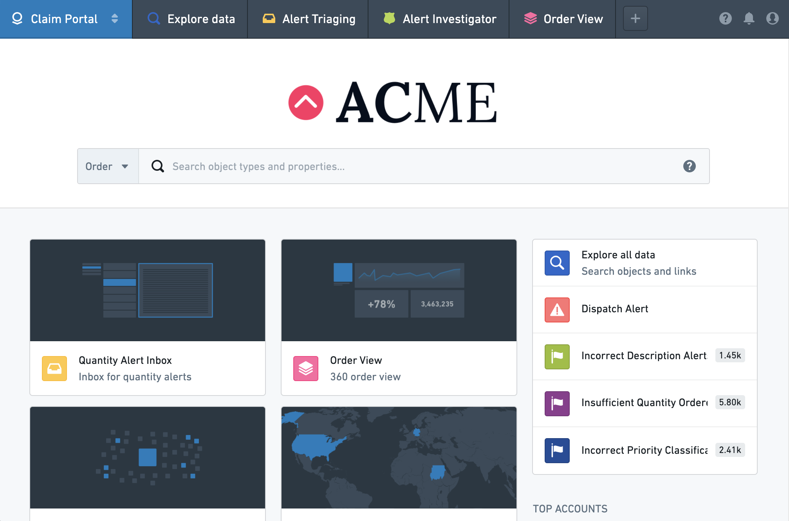

M01 顶部有 Explore data、Alert Triaging、Alert Investigator、Order View 和 `+`，首页将业务应用卡片与告警对象/类型列表放在一起。它说明厂商采用业务语言组织一个操作入口，而非要求用户先选择底层产品。

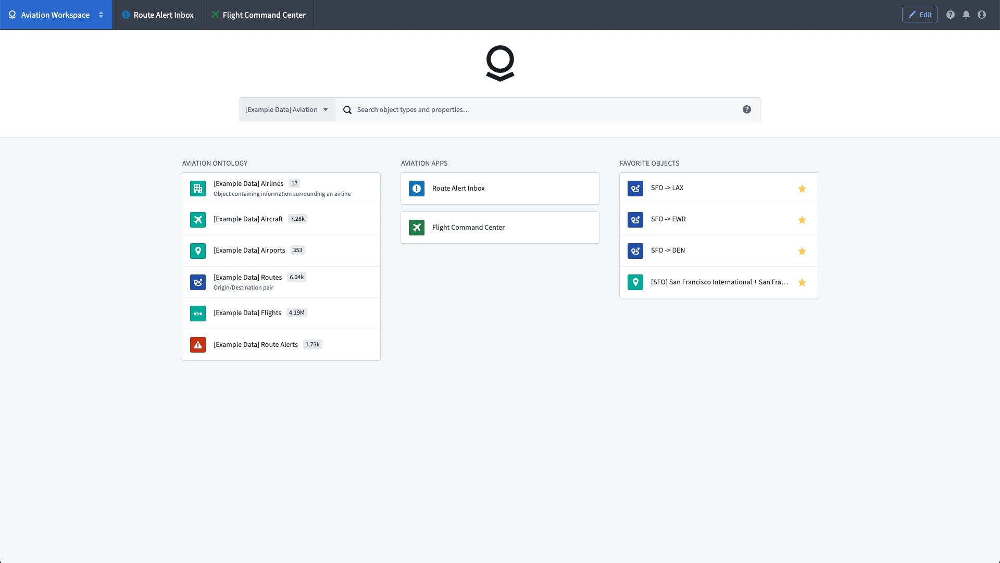

M02 顶部有 Route Alert Inbox 与 Flight Command Center；首页分为 Aviation Ontology、Aviation Apps、Favorite Objects。它直接展示对象类型、应用与用户收藏对象可以共同出现在一个首页。数量是示例数据，不能充当规模基准。两图来自 [Example workspaces](https://www.palantir.com/docs/foundry/carbon/example-workspaces)，页面没有标明原图拍摄/发布日期。

### M03：Applications Portal 提供 Carbon 入口

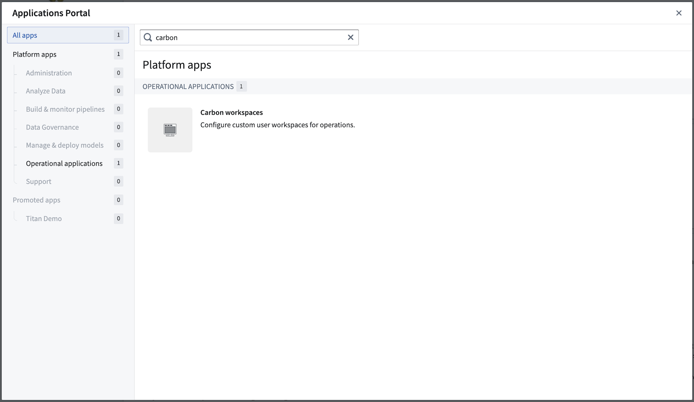

搜索 carbon 后，Platform apps / Operational applications 下出现 Carbon workspaces。图中 Promoted apps 为 0；“已推广工作区可在 Promoted apps 内按名称搜索”的规则依赖正文，不能说这张图已经展示一项已推广工作区。[Carbon overview](https://www.palantir.com/docs/foundry/carbon/overview)

### M04–M05：首页布局配置与模块首页的证据边界

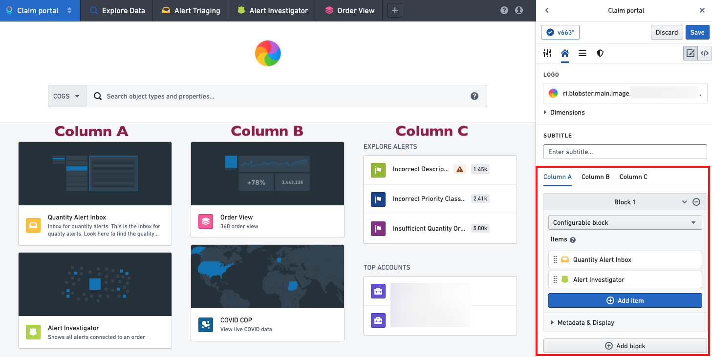

M04 直接展示三列卡片/列表与右侧配置侧栏，可见 Column A/B/C 与 configurable block；Column A/B/C 大字和红框为官方标注。它支持首页策展结构的观察，不证明布局可扩展为任意 CSS 网格。[Home configuration](https://www.palantir.com/docs/foundry/carbon/configuration-home)

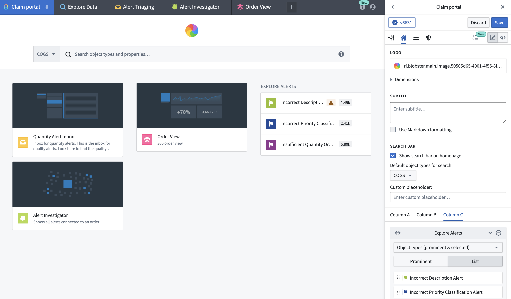

**M05 的官方 alt 是 Replacing home page with Module，但实际画面未显示模块替换按钮或模块/参数选择对话框。**图中仅能看见 Home 配置侧栏、Logo、Search bar 与 Column C。因此本图只作 Home 编辑面的旁证。配置模块作为首页、选择模块与参数、恢复最近一次默认首页的能力来自同页文字，不通过这幅截图验证。[Home configuration](https://www.palantir.com/docs/foundry/carbon/configuration-home#module-backed-home-pages)

### M06–M07：固定模块与 `+` 菜单各自配置

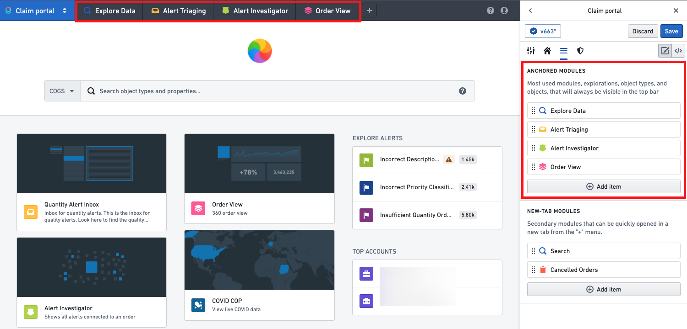

M06 顶栏 Explore Data / Alert Triaging / Alert Investigator / Order View 与侧栏 Anchored modules 列表被官方红框对应起来。

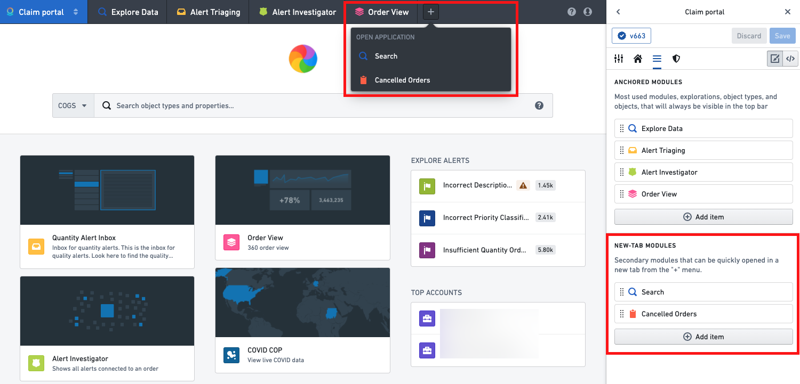

M07 的 `+` 菜单显示 Search、Cancelled Orders，与侧栏 New-tab modules 列表对应。两图说明“始终可见的业务入口”和“从菜单开启新标签页的资源”在配置上分开；不能从静图推断所有模块开关页时保持存活、内存管理策略或关闭标签后的恢复行为。[Menu bar configuration](https://www.palantir.com/docs/foundry/carbon/configuration-menu-bar)

## 3. Workshop 注册与对象集导航

### M08：Workshop interface 给宿主提供明确的输入契约

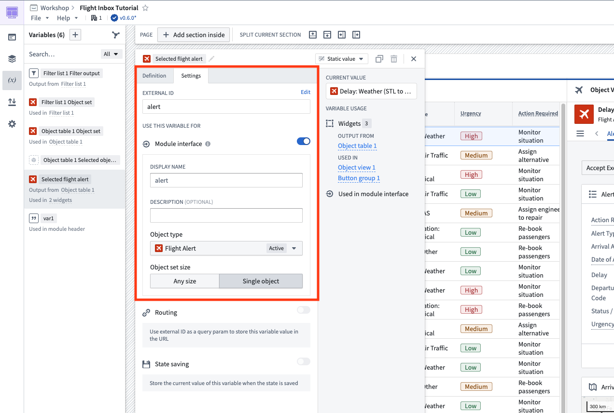

M08 的选中变量为 Selected flight alert，external ID 为 alert，Module interface 已启用，Object type 是 Flight Alert，Object set size 选择 Single object。这是一幅带具体约束的接口注册示例。不能据图称 Workshop 可接收任意外部 React 应用、任意数据类型，或所有发现模块都必须接受单对象。可发现模块所需配置与可选对象类型约束，应按文档正文判断；无类型约束时会对全部对象类型可发现。[Configure module discovery](https://www.palantir.com/docs/foundry/carbon/modules-discovery)

### M13–M14：对象集分析分支与对象详情导航

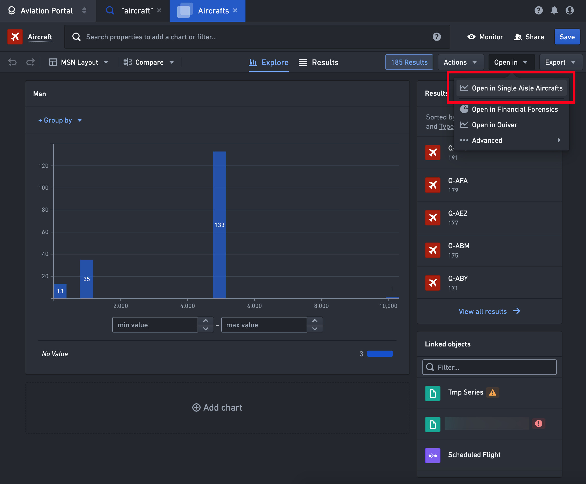

M13 可见 Aircrafts 标签、185 Results 与 Open in Single Aisle Aircrafts。这是旧 OE 风格集合界面的导航步骤截图，红框来自官方。

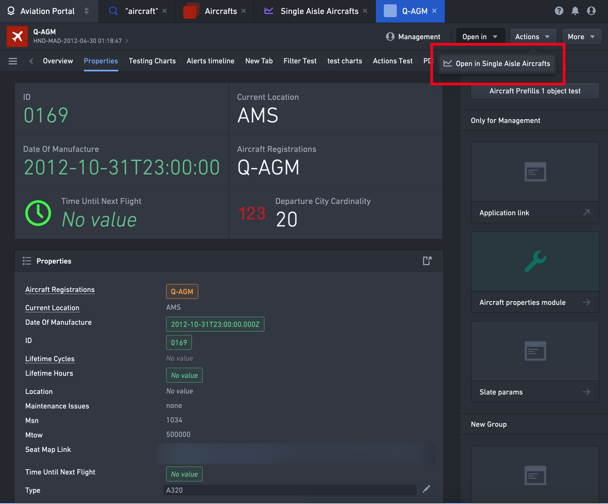

M14 的 Q-AGM 单对象标签与 aircraft 搜索、Aircrafts 集合、Single Aisle Aircrafts 分析标签并列；对象详情右上 Open in 菜单再次提供 Single Aisle Aircrafts。它与 M13 共同说明示例工作流沿着集合与对象前进，来源标签仍出现在顶栏。原始来源明确描述打开接收模块的新 Carbon 标签页并保留来源模块状态；图片不能独立证明浏览器刷新、退出/重新登录或关闭标签后仍恢复该状态。当前启用 Insight 的入口需要同时看第 1 节。[Configure navigation between modules](https://www.palantir.com/docs/foundry/carbon/modules-navigation)

## 4. 动图和视频的范围

在本次检查的 Carbon overview、example-workspaces、configuration 页面与 modules-navigation 的官方图片列表中，选用素材均为静态 PNG。另检查 Carbon modules-navigation、getting-started、configuration-general 与 Slate navigation 的公开 HTML 内容媒体链接，未发现 GIF/MP4/WebM/YouTube/Vimeo 链接，检查范围及时间记录在 [manifest](media-manifest.json)。这项有限检查不证明其他页面没有动画或视频。本附录不把静图描述为播放过的操作录像；未从静图推造动画、操作时序或性能证据。

公开网页搜索使用 Carbon / Palantir / workspace / navigation / tutorial / video 等组合；搜索结果混有 Carbon emissions 等无关同名内容，本专题排除这些结果。本次未获得可核验且已实际观看的 Carbon 工作台公开视频片段，**不发布视频关键帧、不引用未观看视频的画面，也不把搜索结果摘要当视频内容证据**。这不意味着不存在相关视频。已保存的 14 幅界面图来自可直接追溯的一手公开文档。

## 5. 仍待租户验证的入口迁移问题

以下是架构验证建议，不能当作公开资料已确认的事实：开启 Insight 后旧 OE 深链接、已保存探索与旧模块参数的兼容表现；现代搜索的 scope 与用户权限交集；两个开关分别开启时同一对象集 Open in 的发现结果；原标签的临时状态、重新加载恢复与 Action 后刷新；旧/新入口及对象预览是否共享同一配置发布指针。本次没有运行租户验收。
