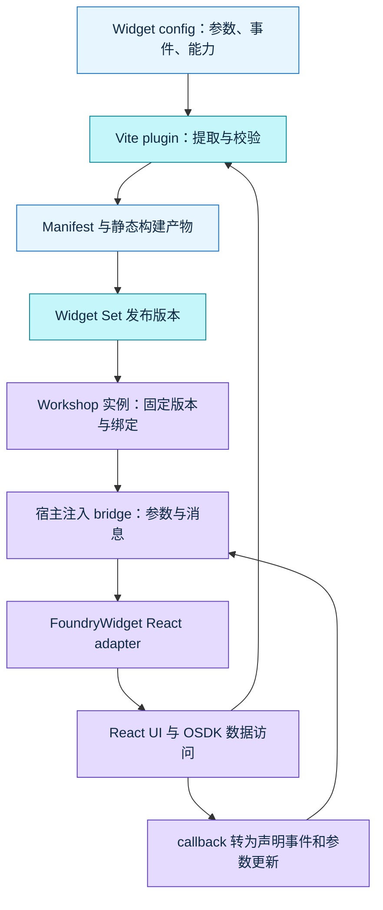

# Palantir Custom Widgets / Widget Registry：高码进入 Workshop 的宿主契约

> 研究范围：高码宿主契约、React 适配、AI 工程交付链与 EOS 实施建议。
> 核验日期：2026-10-01。产品文档为访问时快照；npm 与源码分别锁版本，不把当前 main 当成已发布版本。
> 发布基线：`@osdk/widget.api` / `widget.client` / `widget.client-react` / `widget.vite-plugin` / `create-widget` 3.74.0；发布 provenance 指向 `fb8ec172d540ef7819382ff036aa2a692614af75`。当前 main 比较快照为 `e53b94ecd5de7cdd7e864d0daa04363bdad4db4c`。
> 边界：未登录 Foundry 租户、未操作真实 Workshop/Registry、未检查 EOS 源码。本地协议探针使用真实公开 npm 包和模拟注入 bridge；它证明客户端行为，不能证明 Workshop 闭源宿主的传输、授权或故障恢复。

## 结论先行

**Custom Widgets 的核心是高码与低码之间的契约，而不只是托管一段 React。** Widget 定义声明宿主可绑定的参数、组件能发出的事件和需要的浏览器能力；Widget Set 是有权限和版本的资源，Widget Registry 管理发布与选择，Workshop 承担变量、事件、布局与最终实例配置。React UI 通过 adapter 消费契约，不会因为使用 `@osdk/react-components` 自动获得这些宿主能力。[Core concepts](https://www.palantir.com/docs/foundry/custom-widgets/core-concepts/)、[Parameters and events](https://www.palantir.com/docs/foundry/custom-widgets/parameters-and-events/)

**本专题新增的关键发现是公共客户端与真实宿主的分界。** 3.74.0 客户端调用宿主注入的 `window.__PALANTIR_WIDGET_API__`，没有直接实现 `window.parent.postMessage`。公开消息模型能核验 `ready`、参数更新、事件、resize、reload，但它不包含整个 iframe 引导、origin 校验、身份代理、事件原子性或自动恢复系统。把旧 iframe widget 包的 transport 直接套到 Registry widget 上，会形成错误结论。[发布源码 client](https://github.com/palantir/osdk-ts/blob/fb8ec172d540ef7819382ff036aa2a692614af75/packages/widget.client/src/client.ts)、[协议附录](protocol-api.md)

**React adapter 不是简单 props 转发。** 它维护异步参数状态、把 objectSet RID 水合成 OSDK ObjectSet、把对象集合回写转成宿主可消费引用，并处理 resize/HMR。事件发出后不会先修改本地 context，需要宿主回传参数；scenario 在这层仍是引用，不是自动切换全部 OSDK 查询的上下文。[FoundryWidget](https://github.com/palantir/osdk-ts/blob/fb8ec172d540ef7819382ff036aa2a692614af75/packages/widget.client-react/src/client.tsx)、[React 附录](react-adapter.md)

**对 EOS 的建议是扩展既有 Registry / Adapter / Compiler / 运行时，不是再造一个 AI 目录。** 把领域集合、事件副作用、异步状态、版本和能力进入共同契约，让手写 React、低码编排和 AI 生成消费相同定义；保留 `AI Composition IR → Compiler → Workshop DSL`，再用真实宿主验收补上 mock 无法证明的部分。详见 [EOS 实施建议](eos-implementation.md)；这些是建议，不是 EOS 当前实现的结论。

## 阅读路径与本轮增量

| 文件 | 解决的问题 |
| --- | --- |
| 本正文 | 资源、接入、身份、运行时与 AI 工程交付的整体判断 |
| [protocol-api.md](protocol-api.md) | 完整参数/API/消息、类型与值、客户端边界、协议模拟 |
| [react-adapter.md](react-adapter.md) | ObjectSet 桥接、异步状态、事件转换、React 生命周期与测试 |
| [build-release.md](build-release.md) | Vite 提取、manifest、构建校验、dev mode、CLI/CI 与版本交付 |
| [lineage-cases.md](lineage-cases.md) | 旧 iframe 路线、作者 PR、Pilot/AI FDE/MCP 与未发布方向 |
| [eos-implementation.md](eos-implementation.md) | Registry/Adapter/runtime/造物平台/AI 的具体实施建议 |
| [media-evidence.md](media-evidence.md)、[assets.md](assets.md) | 官方界面与真实视频证据、逐图说明与版权/获取边界 |
| [sources.md](sources.md)、[checks.md](checks.md) | 来源清单、固定版本、验证记录、未完成项 |

既有 [Pilot 第 10 节](../pilot-2026-09/README.md#10-custom-widgetwidget-registry--workshop-的组合路径) 已讲 Registry 发布、固定版本和 sandbox；[React origins](../osdk-react-components-2026-09/origins-and-eos.md#3-workshop--react-components--custom-widgets-是三个契约) 已分清 UI、宿主、版本治理；[osdk-ts 仓库地图](../osdk-typescript-2026-09/repository-map.md) 已定位 widget 包族。本篇不重写产品简介，继续审计它们之间具体如何接线、哪些保证仍在闭源宿主中。

## 1. Widget、Widget Set、Registry 与实例版本

| 对象 | 官方语义 | 工程上应区分的内容 |
| --- | --- | --- |
| Widget | widget set 中的一种组件，有 ID、入口和参数/事件定义 | 不是 Workshop 中某一次拖入的实例；同一实现可配置多次 |
| Widget Set | 保存前端代码版本的 Compass resource，可含多个 widgets；widget 继承其权限 | 资源权限、SDK 配置、源码/产物版本是不同维度 |
| Widget Registry | 创建、开发、查看和发布 widget sets 的平台入口 | npm registry 与 Foundry Widget Registry 不是同一服务 |
| Workshop 实例 | 选择 set、widget、版本，并绑定参数/事件与能力 | 发布新版本不会自动升级已有实例 |

依据：[Core concepts](https://www.palantir.com/docs/foundry/custom-widgets/core-concepts/)、[Embedding in Workshop](https://www.palantir.com/docs/foundry/custom-widgets/embedding-in-workshop/)、[Pilot widget deployment](https://www.palantir.com/docs/foundry/pilot/deploy-a-widget/)。Widget Set 的共享权限也不等于查看者可以访问任意 Ontology 记录；运行数据权限另见第 5 节。

*图 1｜官方 [创建文档](https://www.palantir.com/docs/foundry/custom-widgets/create/) 原图。一个 set 中列出组件名称与 ID，右侧独立显示 release 0.0.1，顶部另有 Configure SDK。它直接支撑“组件、发布版本与 SDK 配置分开”的界面观察；不是本轮创建结果。*

当前官方文档仅明确 Workshop 宿主。2025-08-21 的公告描述初次发布和后续数周的可用性安排；它没有给出本轮所有租户的启用状态或完整长期兼容承诺。公告已列出 dedicated developer mode，后续计划为 object-set 参数支持、developer mode 改进和启动性能改善；不能将 dev mode 本身写成当时尚不存在的功能，也不能据历史计划推断今天仍不支持。[历史公告](https://www.palantir.com/docs/foundry/announcements/2025-08/)、[当前 overview](https://www.palantir.com/docs/foundry/custom-widgets/overview/)、[沿革核对](lineage-cases.md)

## 2. 高码进入 Workshop：四份工件，各司其职

*自绘的公开机制归纳图。消息在公共包的注入 bridge 边界结束，不表示已知它与真实父 iframe 间的具体 transport。*

`defineConfig` 是类型契约和工具链输入；它自身不生成 Workshop 配置界面，也不实施全部运行校验。Vite plugin 从入口和配置收集信息，生成 `.palantir/widgets.config.json`；manifest 将可序列化参数元数据和入口交给平台。Workshop 再用该定义提供变量和事件配置。参数 schema、构建检查、配置面板、运行消息是相互衔接的层，不能看见其中一个就假定全部行为已证实。[参数指南](https://www.palantir.com/docs/foundry/custom-widgets/parameters-and-events/)、[发布指南](https://www.palantir.com/docs/foundry/custom-widgets/publish/)、[构建实现](build-release.md)

官方 React 模式用 `FoundryWidget config={...}` 包裹业务组件；存在 objectSet 参数时还必须提供 OSDK client。业务组件通过 `useFoundryWidgetContext.withTypes<typeof Config>()` 获得类型化值和 `emitEvent`。OSDK 数据 hooks 的 provider 是另一层职责：把 widget host 接好不等于业务查询、缓存和 Action 行为已经处理完整。[官方示例](https://www.palantir.com/docs/foundry/custom-widgets/parameters-and-events/)、[React API](react-adapter.md)

*图 2｜官方 [development](https://www.palantir.com/docs/foundry/custom-widgets/development/) 原图。右侧为 widget/version、Greeting name/Counter value 的宿主变量绑定及 Set counter value 事件入口；组件区域显示 Active dev mode。它展示 schema 与宿主配置接线后的形态，不能据静态图证明事件实际执行顺序。*

## 3. 参数与事件：不是任意 JSON，也不是普通 React props

官方公开的参数族包括 `string`、`boolean`、`number`、`timestamp`、`date`、`objectSet`、`scenario`，以及受支持 primitive 的数组。参数与事件各最多 50 个，ID 要用 camelCase；struct 和 object-set-filter 不是一等参数。3.74.0 源码还存在受限的 experimental `mapTileLayer`，不能把源码类型出现等同为官方承诺的普遍可配置能力。[参数文档](https://www.palantir.com/docs/foundry/custom-widgets/parameters-and-events/)、[实际参数定义](https://github.com/palantir/osdk-ts/blob/fb8ec172d540ef7819382ff036aa2a692614af75/packages/widget.api/src/parameters.ts)、[完整表](protocol-api.md)

| 容易误解的地方 | 核验后的含义 |
| --- | --- |
| input 参数 vs output 参数 | 配置声明参数；事件可声明并回传特定参数更新，宿主负责绑定/更新，不是 arbitrary props callback |
| objectSet vs 已加载对象数组 | wire 以集合引用表达；React adapter 水合为 OSDK ObjectSet，记录查询由数据层执行 |
| scenario vs 自动 query context | 此处传递 scenario 引用；公开 React adapter 不自动把它应用到全部查询 |
| 未绑定/加载/失败 vs null | wire 值带 AsyncValue 状态；需要分别处理未开始、加载、重载、加载成功和失败 |
| 发出事件 vs 状态已确认 | emit 不先更新本地 context；只有收到宿主参数更新才改变受控值 |
| TypeScript 能编译 vs 运行时校验 | 静态类型、plugin validation、闭源宿主检查各有边界；cast/JS 可以越过类型层 |

来源：[AsyncValue](https://github.com/palantir/osdk-ts/blob/fb8ec172d540ef7819382ff036aa2a692614af75/packages/widget.api/src/utils/asyncValue.ts)、[WidgetMessage](https://github.com/palantir/osdk-ts/blob/fb8ec172d540ef7819382ff036aa2a692614af75/packages/widget.api/src/messages/widgetMessages.ts)、[React 转换实现](react-adapter.md)。具体 metadata、数组限制、事件更新类型与未声明参数处理见 [协议附录](protocol-api.md)。

**工程判断：** 配置面板需要可绑定类型与 metadata，UI 组件仍需要自己的 props/业务类型。ObjectTable 的 `onSelectionChange` 必须转换为宿主理解的事件和集合/身份，不能把整个 callback 函数写进 manifest；FilterList 的过滤语义也不应降成一个没有 schema 的字符串。

## 4. 公共消息协议与 React 状态边界

公开 API 能观察的方向如下。完整 payload 和版本常量见 [协议表](protocol-api.md)。

| 方向 | 消息 | 可确认职责 |
| --- | --- | --- |
| Widget → host | `widget.ready` | 声明客户端可接收参数，并附 API version |
| Host → widget | `host.update-parameters` | 发送带异步状态的参数值 |
| Widget → host | `widget.emit-event` | 发出已声明事件与参数更新 |
| Widget → host | `widget.resize` | 报告内容尺寸，供宿主布局处理 |
| Widget → host | `widget.reload` | 请求宿主重载，React HMR full reload 也会调用 |

[`createFoundryWidgetClient`](https://github.com/palantir/osdk-ts/blob/fb8ec172d540ef7819382ff036aa2a692614af75/packages/widget.client/src/client.ts) 检查注入 bridge 是否存在，监听其 `message` CustomEvent；仅分发已知 host 参数更新，未知消息忽略。浏览器 window message、origin 白名单、iframe bootstrap、网络/身份代理不在这份公开 wrapper 内。`sendMessage` 的注释提到 parent frame，不能覆盖实际代码所显示的注入 API 边界。

**本地实包验证，非真实宿主验收：** 协议探针模拟上述注入 API，确认消息与订阅行为；React 探针进一步确认事件需要宿主 echo、相同 ObjectSet RID 能保持引用、scenario 透传。它还发现部分参数更新时 aggregate state 只按当前 payload 计算，而逐字段状态保留之前状态；若模拟消息没有包含旧失败字段，aggregate 可以 loaded 而该字段仍 failed。公开证据没有证明 Workshop 实际发送这种 partial payload，因此这是一项 adapter 防御与真实租户验证点，不是 Workshop 产品故障结论。[验证与边界](checks.md)、[React 详解](react-adapter.md)

React 的挂载还涉及订阅清理、ResizeObserver 和 HMR。config/OSDK client 的动态替换不能仅凭 props 名称就认定受支持；变更契约后重新应用 dev mode、必要时 remount 更符合已公开的开发流程。ErrorBoundary 能处理某些 React 渲染异常，不构成网络、异步事件、权限拒绝和所有 iframe 崩溃的自动恢复承诺。[React 实现](https://github.com/palantir/osdk-ts/blob/fb8ec172d540ef7819382ff036aa2a692614af75/packages/widget.client-react/src/client.tsx)、[开发说明](https://www.palantir.com/docs/foundry/custom-widgets/development/)

## 5. OSDK、查看者身份、权限与外网能力

Widget Set 中配置 SDK 与开启 API 是两步：选择 Ontology/资源生成 `@custom-widget/sdk`，另由有相应 enrollment workflow 的用户开启 Ontology APIs。默认 Information Security Officer 或具有 `Enable widget set unscoped API access` workflow 的自定义角色可执行后一步。runtime OSDK 以查看者身份和权限访问；`createFoundryWidgetTokenProvider()` 提供占位值，不是组件可以拿到任意用户凭据的证据。[官方 use-osdk](https://www.palantir.com/docs/foundry/custom-widgets/use-osdk/)

| 维度 | 本轮证实的内容 | 不应推断 |
| --- | --- | --- |
| 资源访问 | Widget 继承 set 权限；API/数据访问遵循 runtime 查看者权限 | 有 set Viewer 就有所有数据或写入权限 |
| API 开关 | 开启 Ontology APIs 是 enrollment 授权动作 | “unscoped”表示后端不检查用户权限 |
| token helper | 占位 token + runtime 身份代理边界 | 已逆向出真实 token 注入/转发机制 |
| 可用端点 | 文档列部分 Admin 用户端点，启用后含 Ontologies/Functions、Upload Media | 可任意调用所有 Foundry API |
| subscriptions | 当前 widgets 不支持 object set subscriptions | 通用 `@osdk/client` 支持就能在 widget 中使用 |
| 外网 | 受不可配置 CSP 限制；需用适当 Foundry 资源封装外部调用 | component 发 fetch 就能调用外部 SaaS |

依据：[supported endpoints / limitations](https://www.palantir.com/docs/foundry/custom-widgets/use-osdk/#supported-endpoints)、[network requests](https://www.palantir.com/docs/foundry/custom-widgets/development/#network-requests)。development 的“non-Ontology APIs”是概括性限制，use-osdk 的具体受支持端点列表列出例外；本报告采用更精确的 allowlist 口径，避免误写“所有 Admin/Functions 请求均不支持”。

Action 可能改变宿主传入集合背后的记录。`refreshHostDataOnAction` 可以在应用 Action 后要求 host 刷新对象集合参数，新建 sets 在 plugin 默认层开启，单 widget 可覆盖；这解决的是宿主数据陈旧，并不意味着组件缓存、任意周围变量或所有外部数据同时刷新。[Refresh host data](https://www.palantir.com/docs/foundry/custom-widgets/use-osdk/#refresh-host-data-on-action)

官方文档列出的可额外声明 iframe 能力是 `camera`、`microphone`、`autoplay`，以及 `allow-downloads`、`allow-forms`、`allow-popups`。开发者声明后，Workshop 构建者还需允许；摄像头/麦克风等仍需要最终用户浏览器许可。dev preview 临时允许与生产宿主授权不同；打开 popup 的新窗口还会继承相关 sandbox 限制。[Iframe attributes](https://www.palantir.com/docs/foundry/custom-widgets/iframe-attributes/)

3.74.0 源码的 `BrowserPermission` 还含 `allow-modals`，当前文档表未列；与 experimental `mapTileLayer` 一样，本篇只报告代码可见性，不把它写成真实租户已验证能力。[源码/文档差异](protocol-api.md#8-iframe权限外网与故障恢复已知与未知)

*图 3｜官方 iframe attributes 原图。Parameters、Events 的 Updates parameters 与 Permissions 分为三段；提示明确说明部分权限仍需用户接受浏览器 prompt。图中的灰色遮盖来自原图，未由本研究重绘或填充。它支撑三层授权的配置体验，不证明这些开关已经在本轮租户授权。*

## 6. 开发、运行时与故障：预览环境不是同一件事

| 环境 | 官方用途 | 本报告的证据边界 |
| --- | --- | --- |
| Custom widgets playground | 改尺寸、参数，查看事件/参数更新日志 | 官方文档截图，不是本轮租户操作 |
| Workshop + dev mode | 在实际绑定、事件、周围组件和布局中预览未发布实现 | 最接近真实宿主验收；本轮没有租户 |
| VS Code Workspaces preview | 工作区内预览，可与 playground/Workshop 共用 dev server | 不代表省去 runtime 限制 |
| plugin setup 页面 iframe | 触发 Vite 解析和 dev manifest 注册 | 源码明确没有 proper runtime，不是完整 Workshop simulator |
| 本地 injected-bridge mock | 隔离验证公开客户端与 adapter | 不验证身份、CSP、真正 parent transport 或后台资源 |

依据：[开发文档](https://www.palantir.com/docs/foundry/custom-widgets/development/)、[plugin 实现附录](build-release.md)、[本地验证](checks.md)。

dev mode 只覆盖当前用户，不影响其他用户，24 小时失效；Disabled、Enabled、Enabled inactive、Paused 的可见版本并不相同。inactive 可能只是当前 dev server 没有这个 widget 的 override，未必是故障。组件/样式保存可更新，参数/事件变更需重新应用 dev mode，支持该契约预览需要 plugin ≥3.34.0。[当前 development](https://www.palantir.com/docs/foundry/custom-widgets/development/)

*图 4｜同一官方开发文档原图。显示 Dynamic dimensions、参数输入、Count 26、底部 Parameter updated 日志以及 Pause/Stop。它支撑“预览包含输入和事件观察”的事实；图中计数不能作为本轮 probe 输出或性能结果。*

运行时不支持 localStorage/sessionStorage/IndexedDB；dedicated worker 支持，shared/service worker 不支持。共享状态应通过 host 参数，持久状态用 Workshop saved variables 或 Ontology。Workshop 隐藏包含布局时默认卸载 widget；要保留挂载可配置 display optimization。因此只在独立 Vite 页里测成功，不能证明导航、草稿、缓存、浏览器能力和资源清理适用于宿主。[Runtime limits](https://www.palantir.com/docs/foundry/custom-widgets/development/#understand-runtime-limitations)、[Display optimization](https://www.palantir.com/docs/foundry/workshop/widget-display-optimization/)

公开客户端的 `reload()` 是通知，不证明宿主自动重试、断线恢复或错误资产回退。实际 host ACK、事件顺序、批量更新原子性、错误隔离、最大消息量、加载超时和资源失败策略仍需真实租户证据。测试建议覆盖未绑定、失败、remount、旧版本、能力拒绝和 Action 同步，不能仅测一个 button 发出一次事件。[协议边界](protocol-api.md)、[React 测试](react-adapter.md)

## 7. 构建与发布：从 TypeScript 定义到可消费版本

通用发布可经 Foundry CI、CLI 或手动 ZIP；Pilot 的公开 UI 是 tag → Foundry CI → Widget Registry。这些背景在旧专题已覆盖，本轮进一步核对构建实现：plugin 汇集入口、生成 `workshopWidgetV1` 和 `manifestVersion: 1.0.0`，objectSet 的 OSDK 对象定义需转为可序列化资源 RID。plugin 检查入口、标识符、对象类型 RID 和只读参数等局部约束；permissions 原样写入 manifest，类型与宿主授权另行约束。[官方发布指南](https://www.palantir.com/docs/foundry/custom-widgets/publish/)、[源码与实际产物](build-release.md)

| 工件/步骤 | 本轮核验重点 |
| --- | --- |
| `@osdk/create-widget` | 真实 npm 包名及 React/TypeScript/Vite 模板；没有假定 `create-widget-set` npm 包 |
| widget config | 定义、入口和 metadata 提取；纯类型对象与可序列化 manifest 区分 |
| Vite build | 构建收集 CSS/JS/静态文件，检查生成 SDK 元数据与 event 更新 |
| `.palantir/widgets.config.json` | 公共 manifest 格式与资源声明；格式版本不等于 npm 包版本 |
| `foundry.config.json` / `widgetSet` | set RID、版本来源、自动版本配置；部署配置不等于宿主安装 |
| `@osdk/cli` | ZIP 打包、基本工件检查与发布 API；实际 CLI 稳定版本另锁，不跟 widget 3.74.0 混为一组 |
| Foundry CI / tag | 平台内发布流程；本地构建成功没有证明此流程跑过 |
| Workshop 引用 | 固定所选 set/widget 版本，升级时检查参数/事件绑定 |

dev plugin 也有平台 API：从开发入口生成 `devSettings`，调用 dev mode settings 的预览端点注册/启用。它帮助真正 Foundry runtime 使用开发资源，而不是把 host 的全部运行逻辑搬进本地 Vite。源码中出现的 API 路径是已核代码事实，不能承诺客户自己调用这些 preview API 的长期稳定性。[Build/dev 附录](build-release.md)

**本地验证发现的检查缺口：** 真实 plugin 拒绝不合法 widget/parameter ID、缺少对象类型 RID、回写只读地图图层和重复 widget；但用 JS 越过 TypeScript 后，event ID 的 camelCase、51 个参数/事件以及事件引用不存在参数，在这层没有被拒绝。这不表示真实 Registry/Workshop 接受它们；它证明生成流程不能把 plugin build 当成全部契约校验。需要组合类型检查、文档限制检查和真实宿主验收。[14 项插件检查](evidence/build-probe-results.json)

**兼容判断：** 发布新版本与消费者升级分离是已有事实；自动 semantic diff、配置迁移与全面回滚工具未由本轮公开资料证实。删除参数、改变集合类型、改事件副作用或新增能力，即使 React 编译通过，也可能改变已有实例语义。回退组件版本不能撤销已发生的生产 Action 或模型变更；EOS 的具体升级/回退设计见 [建议](eos-implementation.md#5-契约升级必须可审阅回退必须覆盖引用)。

## 8. 与旧 iframe、内建 widgets、React Components 和 AI 工具的关系

| 路线/工具 | 本轮确认的连接点 | 要保留的边界 |
| --- | --- | --- |
| 普通 Workshop Custom widget via iframe | 以托管网页 URL/旧 iframe client 接线；有公开单独仓库/包 | transport、部署/安全和变量能力不能自动套到新 Registry 路线 |
| Workshop 内建 widgets | 原生宿主配置、变量/事件和布局 | 公开 npm 组件视觉/命名相似不证明内部代码相同 |
| `@osdk/react-components` | 可用作 custom widget 内业务 UI | 不自动注册，不自动生成 host binding/manifest 或处理全部生命周期 |
| `@osdk/react` | 数据 hooks/cache/Action 与 React 状态层 | 与 host 参数状态层独立；widget runtime 有自己的 API 限制 |
| Pilot | 生成 custom widget set，提供 preview、配置和 CI 发布 | 本专题不重新论证全部生成产品能力；无租户 prompt/调用链证据 |
| AI FDE | OSDK React 模式涉及应用和 widgets，可承担开发与修改 | 不是 Widget Registry 的替代；实际 agent 使用比例未知 |
| Palantir MCP / Skill | 工具发现、转换与版本匹配开发指导 | 不构成 browser runtime；不能把工具存在推为每次生成必用 |
| SuperRepo | 领域/函数/app 工程链可与高码生态组合 | 本轮 widget preview/支持方向 PR 仍未合并，不宣称一级 Widget Set 已发布 |

来源及具体案例见 [lineage-cases.md](lineage-cases.md)，并与 [React 来源边界](../osdk-react-components-2026-09/origins-and-eos.md)、[SuperRepo 专题](../superrepo-2026-08/) 交叉核对。旧 iframe objectSet 文档和后来 temporary RID 路径还有范围差异，不能用一句“全部只支持 10k”概括所有版本/代码路径。

3.74.0 官方 npm 查询未取得 `@osdk/widget.preview` 发布包；#4102、#4104、#4120 为 open draft。#3418 则是已合并的 Pilot faux object-set 相关公共改动，可作为生成预览需求推动底层类型能力的直接证据。它仍不能单独证明 Pilot 全量依赖图或真实 runtime 的行为。[PR 状态与日期](lineage-cases.md)

## 9. AI 工程交付链与 EOS 决策

Pilot 已说明模型/设计/前端、widget 预览和发布路径；本轮公开包显示真正能约束工程产物的资产是 config、类型、manifest、adapter、依赖和验证。生成器可以生成漂亮页面，但必须同时满足宿主字段、数据语义和能力边界。[Pilot widget guide](https://www.palantir.com/docs/foundry/pilot/build-a-widget/)、[生成与发布实现](build-release.md)、[AI 沿革](lineage-cases.md)

建议 EOS 把交付单位定义成**可审阅变更包**：固定组件/领域版本、源码与 lockfile、IR/DSL、参数与事件 diff、manifest/产物 hash、mock/staging 标记、检查结果和宿主升级计划。Registry 提供权威定义，Adapter 将 React props/callback 与领域值接进宿主，运行时负责状态/事件/生命周期；造物平台连接生成、验证、保存和发布。模型修复候选工件，机械规则与权限检查仍在 Compiler、runtime 和后端。[详细实施建议](eos-implementation.md)

第一条试点应是一条真实业务切片：同一 EntitySet 输入，筛选/表格/选中对象，合法 Action 与宿主刷新，在高码页和 Workshop 类宿主复用；再做 remount、无权限、兼容新增、故意 breaking 升级与回退。mock 先验证公共 adapter，真实宿主再证明绑定、身份、CSP、布局和数据一致性。EOS 源码现状、现有字段、运行时协议和成本基线都仍待单独审计，不以本报告代答。

## 10. 证据边界与待补验收

| 已取得 | 尚未证明 |
| --- | --- |
| 当前官方文档、固定发布源码、真实 npm tarball/provenance、作者 PR 状态 | 全部客户租户的开放状态、内部 prompt/部署依赖图 |
| 公开 client / React adapter 的可运行 mock 检查 | 真 Workshop 消息 transport/origin/ACK/调度原子性 |
| 官方界面原图与可访问公开视频的有限证据 | 本轮在租户创建资源、发布版本、角色授权或生产 Action |
| manifest/build/plugin 的公开实现与本地构建验证 | Foundry CI 发布成功、Marketplace 多环境安装与回退操作 |
| 明确标注的 EOS 实施建议 | EOS 当前 Registry/Adapter/运行时已经具备或缺少某项能力 |

需要真实租户继续补：两个权限角色、未绑定/失败参数、objectSet/scenario、Action 刷新、切页卸载与 keep-mounted、契约改动 dev mode reapply、版本升级/回退、浏览器能力拒绝和资产/连接错误。需要 EOS 当前仓库继续补：权威 Registry/schema、Adapter 的 callback/回写语义、Compiler/DSL 保存链、运行时状态机和产物追踪。

完整来源、媒体获取过程、hash 和检查结果分别在 [sources.md](sources.md)、[assets.md](assets.md)、[checks.md](checks.md)。官方图片和短视频证据只为带出处的研究引用；没有镜像长视频或整篇供应商文档。
