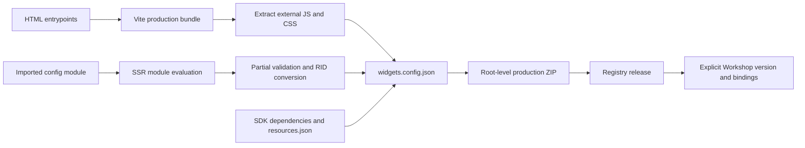

# 工程交付附录：契约如何进入构建、dev mode 与 Registry

核验日期：2026-10-01。主轴是可追溯的编译、契约和发布边界。Pilot 的 tag → Foundry CI → Registry、宿主固定版本等已知结论见[既有第 10 节](../pilot-2026-09/README.md#widget-release)，这里补其实现证据。本轮运行的是**官方公开 React 模板的无 OSDK 变体**：没有租户、用户 token、SDK mock 或 Workshop 宿主；本地构建和负例不能证明闭源平台验收成功。[本地核验记录](evidence/build-artifact-checks.json)

## 1. 先读这三个工程结论

1. **Widget contract 是生产工件的一部分。** `*.config.ts` 经 Vite 模块求值、局部验证、对象类型 RID 转换，写进 `.palantir/widgets.config.json`；宿主绑定依赖的是生成的 JSON manifest，不只是 React props 的静态类型。[抽取配置](https://github.com/palantir/osdk-ts/blob/fb8ec172d540ef7819382ff036aa2a692614af75/packages/widget.vite-plugin/src/common/extractWidgetConfig.ts#L24)、[manifest 编译](https://github.com/palantir/osdk-ts/blob/fb8ec172d540ef7819382ff036aa2a692614af75/packages/widget.vite-plugin/src/build-plugin/buildWidgetSetManifest.ts#L75)
2. **编译通过、dev mode 应用成功、真实 Workshop 正确运行是三个门。** 发布插件的校验并不完整；config 的热更新还会被插件截断，需重新设置 dev manifest。不能用 HMR 或一个可渲染的独立网页代替宿主验收。[验证器](https://github.com/palantir/osdk-ts/blob/fb8ec172d540ef7819382ff036aa2a692614af75/packages/widget.vite-plugin/src/common/validateWidgetConfig.ts#L28)、[config 热更新](https://github.com/palantir/osdk-ts/blob/fb8ec172d540ef7819382ff036aa2a692614af75/packages/widget.vite-plugin/src/dev-plugin/FoundryWidgetDevPlugin.ts#L260)
3. **当前公开交付链没有展示自动契约迁移。** CLI 的 widget version 子命令是 `list/info/delete`，没有 site 那样的 `version set`；发布不自动改变既有 Workshop 使用版本。升级或恢复旧版本时，构建者仍须检查宿主绑定和数据语义。[widget version 命令树](https://github.com/palantir/osdk-ts/blob/fb8ec172d540ef7819382ff036aa2a692614af75/packages/cli/src/commands/widgetset/version/index.ts#L20)、[官方发布行为](https://www.palantir.com/docs/foundry/custom-widgets/publish)

## 2. 版本锁定：发布源码与当前 main 分开

以下是直接读取官方 npm registry 的稳定发布版本，不能拿官网命令中的 `@latest` 或文档示例 CLI `0.26.3` 当本轮实现版本。时间为 npm `time[version]`，单位 UTC；包完整 SHA-256、SHA-512 integrity、依赖和 dist-tags 见[版本证据](evidence/build-package-versions.json)。

| 发布包 | 本轮固定版本 | npm 发布时间 UTC | 作用 |
| --- | --- | --- | --- |
| [@osdk/widget.vite-plugin](https://registry.npmjs.org/@osdk%2fwidget.vite-plugin/3.74.0) | `3.74.0` | `2026-09-29T17:26:31.552Z` | 生产 manifest 与 dev mode |
| [@osdk/create-widget](https://registry.npmjs.org/@osdk%2fcreate-widget/3.74.0) | `3.74.0` | `2026-09-29T17:21:43.031Z` | 生成 widget set 项目 |
| [@osdk/cli](https://registry.npmjs.org/@osdk%2fcli/0.101.0) | `0.101.0` | `2026-09-29T17:24:36.050Z` | ZIP 流式发布和版本查询/删除 |
| [@osdk/foundry-config-json](https://registry.npmjs.org/@osdk%2ffoundry-config-json/1.13.0) | `1.13.0` | `2026-09-11T14:18:18.758Z` | config JSON 验证与 SemVer 计算 |

前三包的 npm provenance 均指向发布提交 [`fb8ec172d540ef7819382ff036aa2a692614af75`](https://github.com/palantir/osdk-ts/commit/fb8ec172d540ef7819382ff036aa2a692614af75)，以及同一次[公开发布工作流](https://github.com/palantir/osdk-ts/actions/runs/36603145053/attempts/1)。本轮下载工件 SHA-512 与 registry integrity、provenance subject digest 一致；这是**摘要匹配和来源追踪**，没有执行签名信任链的密码学验证。[plugin provenance](https://registry.npmjs.org/-/npm/v1/attestations/@osdk%2fwidget.vite-plugin@3.74.0)

`widget.vite-plugin` 的 29 个原始 TS source-map 内容与发布提交逐字一致；`foundry-config-json` 的 4 个内容同样一致。它们也与当前 main [`e53b94ecd5de7cdd7e864d0daa04363bdad4db4c`](https://github.com/palantir/osdk-ts/commit/e53b94ecd5de7cdd7e864d0daa04363bdad4db4c) 一致。CLI/脚手架 33 个已检查 source-map 条目存的是**去除 TS 类型后的中间 JS**，与原 TS 的字节差异没有被误判为行为不兼容；该部分结论同时核对编译 JS、发布原 TS 和 provenance。逐文件记录见[source-map 审计](evidence/build-source-map-audit.json)，复核脚本为[build-artifact-audit.py](probes/build-artifact-audit.py)。版本表依据官方 registry 元数据，网页访问状态见[链接核验](evidence/build-link-checks.json)。

截至本轮，官方 npm 对 `@osdk/create-widget-set`、`@osdk/widget.preview` 返回 404。前者不能代替真正的 `@osdk/create-widget` 命令；后者不能作为已公开可安装产品宣称。正式插件根导出是默认 `FoundryWidgetPlugin`，返回 dev/build 两个插件；没有正式 `extract` 或 preview API。[发布包根导出](https://github.com/palantir/osdk-ts/blob/fb8ec172d540ef7819382ff036aa2a692614af75/packages/widget.vite-plugin/src/index.ts#L17)

## 3. 资源与版本模型：至少区分四个标识

| 标识 | 已验证角色 | 不应混同 |
| --- | --- | --- |
| Widget set RID | Compass 资源；一个 set 版本可含多个 widget，共享代码/资产 | React 组件名或某个实例 |
| Widget ID | set manifest 中的键；各 widget 有自己的入口与 contract | set RID、每个 Workshop 挂载实例 |
| `widgetSet.version` | 本次发布版本，由 package-json 或 git-describe 计算 | npm SDK 包版本 |
| `manifestVersion` / widget `type` | 本轮分别写 `1.0.0` / `workshopWidgetV1` | set 的业务版本或 semver 兼容承诺 |

前两项依据[官方资源模型](https://www.palantir.com/docs/foundry/custom-widgets/core-concepts)，后两项可直接见[manifest 构造](https://github.com/palantir/osdk-ts/blob/fb8ec172d540ef7819382ff036aa2a692614af75/packages/widget.vite-plugin/src/build-plugin/buildWidgetSetManifest.ts#L30)。版本资源还包含 locator：`repositoryRid` 可为 Widget set RID 或 Stemma code repository RID，并记录 `repositoryVersion`；release 另含 `widgetSetRid`、`version`、可选 `description`。这说明 release 可定位到授权代码仓库的构建版本，而不只是一个全局“最新版”指针。[Release](https://github.com/palantir/osdk-ts/blob/fb8ec172d540ef7819382ff036aa2a692614af75/packages/cli/src/net/widget-registry/Release.mts#L17)、[ReleaseLocator](https://github.com/palantir/osdk-ts/blob/fb8ec172d540ef7819382ff036aa2a692614af75/packages/cli/src/net/widget-registry/ReleaseLocator.mts#L17)

**未知：** 本轮没有取得 Registry 服务端版本存储、同版本重复上传策略、删除被使用版本时的精确保护规则、自动清理策略或全平台兼容矩阵。CLI 存在 delete API 不等于可以安全删除被宿主引用的版本，也不等于回滚。

## 4. 脚手架并不创建 Registry 资源

`create-osdk-widget` 收集或接受 `project/template/sdkVersion/foundryUrl/widgetSet/repository/osdkPackage/osdkRegistryUrl/skipOsdk`。它复制嵌入模板、处理 `.osdk/.no-osdk` 变体、填充 Handlebars、写 `foundry.config.json`；使用 OSDK 时才生成 scope registry `.npmrc`，token 为环境变量占位符。该 CLI **要求已存在的 Widget set RID**，没有在脚手架 `run` 中创建 Registry 资源。[CLI 选项](https://github.com/palantir/osdk-ts/blob/fb8ec172d540ef7819382ff036aa2a692614af75/packages/create-widget/src/cli.ts#L17)、[生成流程](https://github.com/palantir/osdk-ts/blob/fb8ec172d540ef7819382ff036aa2a692614af75/packages/create-widget/src/run.ts#L39)、[配置生成](https://github.com/palantir/osdk-ts/blob/fb8ec172d540ef7819382ff036aa2a692614af75/packages/create-widget/src/generate/generateFoundryConfigJson.ts#L17)

真正资源创建在 Foundry 创建向导完成，可选 In Foundry 或 Outside of Foundry；前者建立带 CI/CD 的 Code Repository 并自动发起首个 release，后者由开发者自行发布。开发预览可先于首次 release，Workshop 选择器仍要求该 widget 至少发布一次。[创建指南](https://www.palantir.com/docs/foundry/custom-widgets/create)

公开 React 模板的契约/数据层结构为：`main.config.ts` 定义输入事件；`main.tsx` 把 config 传给 `FoundryWidget`；`Widget.tsx` 使用 typed client 交互。有 OSDK 变体时，`client.ts` 使用 `window.location.origin`、生成 SDK 的 `$ontologyRid` 和 `createFoundryWidgetTokenProvider()` 构造 client。[模板入口](https://github.com/palantir/osdk-ts/blob/fb8ec172d540ef7819382ff036aa2a692614af75/packages/create-widget.template.react.v2/templates/src/main.tsx.hbs)、[OSDK client 模板](https://github.com/palantir/osdk-ts/blob/fb8ec172d540ef7819382ff036aa2a692614af75/packages/create-widget.template.react.v2/templates/src/client.ts.osdk.hbs)

**依赖漂移的真实例子：** `create-widget@3.74.0` 生成项目依旧把三个 widget 库写成 `^3.26.0`；本轮 lockfile 实际解析为 `3.74.0`。有 OSDK 的模板还对生成 SDK 使用 `latest`。因此“脚手架 3.74.0”不够锁定运行环境，需要保存 resolved lock、SDK 版本/RID、Node 和 Vite。[无 OSDK dependency 模板](https://github.com/palantir/osdk-ts/blob/fb8ec172d540ef7819382ff036aa2a692614af75/packages/create-widget.template.react.v2/templates/package.json.no-osdk.hbs)、[有 OSDK dependency 模板](https://github.com/palantir/osdk-ts/blob/fb8ec172d540ef7819382ff036aa2a692614af75/packages/create-widget.template.react.v2/templates/package.json.osdk.hbs)、[本轮 lock](evidence/build-template-package-lock.json)

## 5. 生产编译：HTML 入口只是抽取线索

`FoundryWidgetBuildPlugin` 只在 build 应用。`writeBundle` 加载 `foundry.config.json`，再创建一个使用 `build-module-evaluation-mode` 的 Vite server，调用 `ssrLoadModule` 求值默认导出，最后关闭 server；特殊 mode 避免生产构建误启动 dev mode。它不是 AST 文本提取，因此 config 及其 import 必须能在 Node/SSR 求值环境运行。[build 生命周期](https://github.com/palantir/osdk-ts/blob/fb8ec172d540ef7819382ff036aa2a692614af75/packages/widget.vite-plugin/src/build-plugin/FoundryWidgetBuildPlugin.ts#L29)、[配置求值](https://github.com/palantir/osdk-ts/blob/fb8ec172d540ef7819382ff036aa2a692614af75/packages/widget.vite-plugin/src/common/extractWidgetConfig.ts#L24)

每个 HTML 入口对应一个 entry chunk；其 `moduleIds` 必须恰有一个符合 `.config` 后缀的配置模块，否则明确报“没有/多个配置文件”。多 widget 项目配置多个 HTML inputs，并确保 widget ID 唯一；不存在“扫到目录中的每个 React 组件就自动注册”的实现。[entry chunk 与 config 关联](https://github.com/palantir/osdk-ts/blob/fb8ec172d540ef7819382ff036aa2a692614af75/packages/widget.vite-plugin/src/build-plugin/getWidgetBuildOutputs.ts#L24)、[重复 ID 检查](https://github.com/palantir/osdk-ts/blob/fb8ec172d540ef7819382ff036aa2a692614af75/packages/widget.vite-plugin/src/build-plugin/validateWidgetSet.ts#L21)

`extractBuildOutputs` 用 parse5 读取构建后的 HTML，只抽取 `<script src>` 和 `link rel=stylesheet`。script 类型仅 `module` / `text/javascript`；inline script、额外 `defer` 属性、stylesheet 的 `media` 属性在本轮探针中均被拒绝。因此不能依赖任意 HTML head/body 内容成为 Registry widget 的加载语义。[HTML 抽取约束](https://github.com/palantir/osdk-ts/blob/fb8ec172d540ef7819382ff036aa2a692614af75/packages/widget.vite-plugin/src/build-plugin/extractBuildOutputs.ts#L23)、[实测负例](evidence/build-probe-results.json)

`foundry.config.json` 与 widget config 是两套不同验证对象。前者使用 Ajv：要求 `foundryUrl` 和 `widgetSet`，set 内要求 `rid/directory`；支持可选 `repository` 和 `autoVersion`。`package-json` 从当前目录向上找 package.json；`git-describe` 使用 `--tags --first-parent --dirty`，可带 tagPrefix，默认剥去前缀 `v`；计算结果必须是 SemVer。[config schema](https://github.com/palantir/osdk-ts/blob/fb8ec172d540ef7819382ff036aa2a692614af75/packages/foundry-config-json/src/config.ts#L135)、[版本计算](https://github.com/palantir/osdk-ts/blob/fb8ec172d540ef7819382ff036aa2a692614af75/packages/foundry-config-json/src/autoVersion.ts#L36)

## 6. Contract 编译不是全面的 schema 门禁

| 检查/转换 | 3.74.0 发布实现与本地结果 | 边界 |
| --- | --- | --- |
| Widget ID | camelCase、最长 100 字符 | 不同于 React component 名 |
| Widget name/description | 最长 100 / 250 字符 | 没有完整 JSON schema 验证 |
| Parameter ID | camelCase、最长 100 字符 | 插件不验证全部参数类型组合 |
| Object set | 必须有生成 SDK 的 metadata RID；错误建议 generator ≥ 2.6.2 | 本地 RID 是结构校验，没查询 Ontology 存在性 |
| Duplicate widget IDs | set 构建拒绝 | 不迁移旧实例 |
| Map tile layer | event 不可更新该只读参数 | 配置错误在构建时可捕捉 |
| 51 个参数、51 个事件 | JS 调用插件验证器仍通过 | 不表示 Workshop 或服务端允许 |
| `bad_event` 事件 ID | 插件验证器通过 | 不表示满足产品文档要求 |
| 事件引用不存在参数 | 插件验证器通过 | TypeScript 或服务端可能另有限制 |

来源是[实际验证函数](https://github.com/palantir/osdk-ts/blob/fb8ec172d540ef7819382ff036aa2a692614af75/packages/widget.vite-plugin/src/common/validateWidgetConfig.ts#L28)、[set 验证函数](https://github.com/palantir/osdk-ts/blob/fb8ec172d540ef7819382ff036aa2a692614af75/packages/widget.vite-plugin/src/build-plugin/validateWidgetSet.ts#L21)，以及[14 例探针](probes/build-validation.mjs)。这些探针有意以 JS 绕开 TS，隔离测试插件覆盖；不替代 [API/宿主协议附录](protocol-api.md) 中的静态类型与闭源宿主边界。

Object set 的 TS contract 中 `allowedType` 是生成 OSDK 的类型定义对象；manifest 会变成 **RID 字符串**。对象类型兼容字段 `objectTypeRids` 为 `[RID]`，接口类型则是 `[]`；没有把 `apiName` 或 React prop 的对象定义直接写给配置面板。其他 parameter 原样返回；events/permissions 原样进入 manifest。`refreshHostDataOnAction` 取 config 显式值，其次取 plugin defaults，均未设置时可从 JSON 中省略；不能据此把省略值当作 `false`，平台默认值须另引产品文档。[转换代码](https://github.com/palantir/osdk-ts/blob/fb8ec172d540ef7819382ff036aa2a692614af75/packages/widget.vite-plugin/src/build-plugin/buildWidgetSetManifest.ts#L75)、[object/interface 实测输出](evidence/build-probe-results.json)

`inputSpec.discovered.sdks` 从**已安装依赖图**递归发现 package.json 中的 `osdk.packageRid` 和 `version`，去重后写入；不是从 UI 实际 API 调用动态推断权限。`resources.json.authorizations.read/requiredRead` 也可写入 discovered authorizations；缺文件是可接受状态，非法 JSON 会失败。[inputSpec 构建](https://github.com/palantir/osdk-ts/blob/fb8ec172d540ef7819382ff036aa2a692614af75/packages/widget.vite-plugin/src/build-plugin/getWidgetSetInputSpec.ts#L23)、[依赖遍历范围](https://github.com/palantir/osdk-ts/blob/fb8ec172d540ef7819382ff036aa2a692614af75/packages/widget.vite-plugin/src/common/visitNpmPackages.ts#L31)

**分析建议：** 对 AI 生成组件应另加 schema 及跨版本 diff 检查，覆盖数目、事件名称、引用、权限需求、对象类型与参数方向；不能把 vendor 插件当作完整安全或兼容性验证器。本轮没有审计 EOS 源码，无法断言 EOS 当前已有或缺少这些门禁。

## 7. Dev mode 实际流程：不是把生产 ZIP 换成本地 index.html

公开实现提供如下本地辅助路由；它们是插件私有辅助流程，不应作为 EOS 的稳定跨平台 API 依赖。

| 路由 | 源码中的目的 |
| --- | --- |
| `.palantir/setup/` | setup UI，加载入口 iframe 以触发 Vite 解析 |
| `.palantir/entrypoints` | 返回 HTML 入口列表 |
| `.palantir/finish` | 等待 config 解析齐全，生成 dev manifest 并调用 Foundry 设置 |
| `.palantir/vite-injections.js` | 提供 Vite HTML transform 的 inline 注入，支持 React refresh |

路由和 lifecycle 见[常量](https://github.com/palantir/osdk-ts/blob/fb8ec172d540ef7819382ff036aa2a692614af75/packages/widget.vite-plugin/src/common/constants.ts#L17)、[dev 插件](https://github.com/palantir/osdk-ts/blob/fb8ec172d540ef7819382ff036aa2a692614af75/packages/widget.vite-plugin/src/dev-plugin/FoundryWidgetDevPlugin.ts#L95)。finish 中 config 数小于入口数返回 `pending`；`attempt ≥ 10` 返回超时错误。这是开发 setup 的等待，不是 widget 通信的全局重试保证。

Dev manifest 形式为 `manifestVersion: "1.0.0"` + `devSettings: { baseHref, widgets, inputSpec }`。JS entrypoints 是完整开发 URL，顺序含 Vite injections、transform 产生的外部脚本和 widget code entrypoint；CSS list 为 `[]`，走 Vite 开发加载。配置仍复用生产的 `buildWidgetManifestConfig`，所以 contract/RID 转换并非另造一套。[dev manifest](https://github.com/palantir/osdk-ts/blob/fb8ec172d540ef7819382ff036aa2a692614af75/packages/widget.vite-plugin/src/dev-plugin/buildDevModeManifest.ts#L28)、[HTML 注入抽取](https://github.com/palantir/osdk-ts/blob/fb8ec172d540ef7819382ff036aa2a692614af75/packages/widget.vite-plugin/src/dev-plugin/extractInjectedScripts.ts#L31)

随后插件发起两个带 `preview=true` 的 POST：`api/v2/widgets/devModeSettingsV2/setWidgetSetManifest`（body 含 widgetSetRid/manifest）和 `.../enable`，携带 bearer token。二者须分别返回 200；`InvalidManifest` 会提示可能是插件版本与 Foundry 平台版本不匹配。**这些是客户端已发布代码的请求形状，未在真实租户执行，不能扩展为长期公开 API 或完整服务端 schema。**[网络请求](https://github.com/palantir/osdk-ts/blob/fb8ec172d540ef7819382ff036aa2a692614af75/packages/widget.vite-plugin/src/dev-plugin/network.ts#L22)、[结果与失败处理](https://github.com/palantir/osdk-ts/blob/fb8ec172d540ef7819382ff036aa2a692614af75/packages/widget.vite-plugin/src/dev-plugin/publishDevModeSettings.ts#L78)

本地模式读取 `FOUNDRY_TOKEN`；`code-workspaces` 模式从 `FOUNDRY_PROXY_TOKEN` 指定文件读取 token，并用 proxy URL、`DEV_SERVER_DOMAIN/DEV_SERVER_BASE_PATH` 组成 Foundry 与开发地址。这里是**开发 setup 身份**，不是已经证明生产 iframe 使用开发者身份；生产 viewer token 另见 [API/协议附录](protocol-api.md)。[token 选择](https://github.com/palantir/osdk-ts/blob/fb8ec172d540ef7819382ff036aa2a692614af75/packages/widget.vite-plugin/src/dev-plugin/getFoundryToken.ts#L26)、[Workspaces 适配](https://github.com/palantir/osdk-ts/blob/fb8ec172d540ef7819382ff036aa2a692614af75/packages/widget.vite-plugin/src/dev-plugin/codeWorkspacesMode.ts#L24)

**关键防误读：** setup 页的 iframe 只用于触发入口解析。源码明确没有 proper runtime，并抑制 iframe log/warn/error 与 onerror；它不是完整 mock Workshop，也不是产品 playground。当前官方 dev mode 才是个人、临时覆盖，24 小时过期；组件/styles 自动更新，契约文件需重新应用。文档的插件 `3.34.0` 下限具体适用于预览参数/事件配置变更，不能概括为整个 dev mode 的最低版本。[setup iframe 源码](https://github.com/palantir/osdk-ts/blob/fb8ec172d540ef7819382ff036aa2a692614af75/packages/widget.vite-plugin/src/client/entrypointIframe.tsx#L24)、[当前开发指南](https://www.palantir.com/docs/foundry/custom-widgets/development)

## 8. ZIP、CLI、Foundry CI 与宿主切换

CLI `widgetset deploy` 从 config/参数获取输出目录和可选 repository；读取 `.palantir/widgets.config.json` 中的 `widgetSet.version`，用 `archiver("zip").directory(directory, false)` 对目录内容打包，因此 ZIP root 必须直接含 `.palantir/` 和 assets，不能多套 `dist/`。该命令检查目录、JSON 可读和 version 存在，**没有在此函数中完整验证 manifest schema，也不负责重新运行 build**。[deploy 选项](https://github.com/palantir/osdk-ts/blob/fb8ec172d540ef7819382ff036aa2a692614af75/packages/cli/src/commands/widgetset/deploy/index.ts#L27)、[发布实现](https://github.com/palantir/osdk-ts/blob/fb8ec172d540ef7819382ff036aa2a692614af75/packages/cli/src/commands/widgetset/deploy/widgetSetDeployCommand.mts#L31)

没有 repository override 时以 widgetSet RID 发布；有 override 时以授权 Code Repository RID 发布。底层请求是 POST `api/v2/widgets/repositories/{RID}/publish?preview=true&repositoryVersion={version}`，body 为 ZIP stream，Content-Type `application/octet-stream`。list/info/delete 走 `api/v2/widgets/widgetSets/{RID}/releases[/{version}]`。它们证实客户端资源路径，不能据此补造服务端储存、验证、兼容或回滚逻辑。[publishRelease](https://github.com/palantir/osdk-ts/blob/fb8ec172d540ef7819382ff036aa2a692614af75/packages/cli/src/net/widget-registry/publishRelease.mts#L24)、[release 查询](https://github.com/palantir/osdk-ts/blob/fb8ec172d540ef7819382ff036aa2a692614af75/packages/cli/src/net/widget-registry/listReleases.mts#L21)、[删除请求](https://github.com/palantir/osdk-ts/blob/fb8ec172d540ef7819382ff036aa2a692614af75/packages/cli/src/net/widget-registry/deleteRelease.mts#L21)

Foundry Code Repository 的 tag build 自动构建并发布；外部仓库可在自己的 CI 运行 CLI，亦可 UI 手动 ZIP。新 release 不自动修改既有宿主版本。[发布指南](https://www.palantir.com/docs/foundry/custom-widgets/publish) 本轮没有租户中的 `.jemma` pipeline、tag check 或成功上传，因此**不声称 Foundry CI 已实测**，也不把 osdk-ts 自身 GitHub Actions 的 npm 发布工作流当作 Foundry CI 模板。

Node 环境还要单独控制：官方支持根 `.nvmrc`；要同步 CI，需把 `.jemma/settings.sh` 的 `NODE_INSTALLATION_VERSION` 改成读取 `.nvmrc`。未使用 nvm 时，CI 用 settings 的版本、开发环境文档默认 `18.20.8`。本轮 template build 使用 Node `22.17.0`，插件 peer 范围是 Vite `^6.3.6 || ^7.3.1`，解析到 Vite `7.3.6`；这是具体本地环境，不是 Foundry 默认 Node/Vite 兼容承诺。[Node 配置指南](https://www.palantir.com/docs/foundry/custom-widgets/manage-node-version-in-foundry-code-repository)、[插件 package peer 约束](https://github.com/palantir/osdk-ts/blob/fb8ec172d540ef7819382ff036aa2a692614af75/packages/widget.vite-plugin/package.json)

**升级/回退建议，区别于已验证产品行为：** 发布 v2 前保留 v1 的工件与 bindings 快照；在验证 Workshop 中显式选 v2，比较参数 ID/type/对象类型、事件引用、permissions、refresh 语义与 Action 结果。恢复 v1 应理解为恢复宿主选择及必要配置，而不是删 v2 或重发同版本。公开资料未承诺自动把 v2 bindings 迁回 v1，更不能承诺 UI 回退会逆转已执行 Ontology Action。

## 9. 本地实测及可以复核的交付物

运行命令使用公开 registry 与临时目录；脚手架的 stack URL/RID 为明确的研究占位符，`--skipOsdk` 选择官方分支，未假造 SDK。示例 project 可通过[复现脚本](probes/build-reproduce.sh)重建，脚本复制本轮 lock 后执行 npm ci，以免将来的 semver 解析变化改变结果。

| 检查 | 本轮结果 | 保存证据 |
| --- | --- | --- |
| 官方模板生成 | 成功；`create-widget@3.74.0` | generator 命令和版本台账 |
| lint | exit 0 | [artifact-checks](evidence/build-artifact-checks.json) |
| TypeScript + Vite production build | exit 0；4788 modules transformed | 同上 |
| Widget manifest | `manifestVersion=1.0.0`；set version `0.0.0`；JS/CSS entry paths、两个参数、一个事件、`sdks=[]` | [probe-results](evidence/build-probe-results.json) |
| 所有构建文件 | 10 个含 manifest；逐文件 bytes/SHA-256 | [artifact-checks](evidence/build-artifact-checks.json) |
| ZIP root 结构 | manifest 位于 root `.palantir/`；无 dist wrapper | 同上；Python ZIP 布局检查，未调用 CLI 上传 |
| 发布插件正负例 | 14/14 符合源码预期 | [probe-results](evidence/build-probe-results.json) |
| 发布工件来源 | 四包 integrity 匹配；前三包 provenance digest 匹配；原 TS map 33/33 匹配 | [版本](evidence/build-package-versions.json)、[source-map](evidence/build-source-map-audit.json) |
| 保存的复现脚本 | 从新临时目录生成、npm ci、lint、build、14 例探针均通过；10 个构建文件的 SHA-256 与首轮一致 | [artifact-checks](evidence/build-artifact-checks.json) |

SDK/CLI 代码含对象订阅或其他共享库模块，并不证明它们在 Custom Widget 运行时获得平台支持；本轮 no-OSDK bundle 也包含共享 websocket chunk，不能仅看包内容便宣称 widget subscriptions 可用。真实 API 支持以专题主文和当前官方 endpoint 文档为准。

**对 EOS 的实施启示（建议）**：在 Registry release 旁保存 source revision、contract hash、resolved dependency lock、SDK inputSpec、UI adapter 版本及测试结果；对 AI 生成流程分别设置源码/TS、manifest/schema、模拟协议、真实宿主绑定四道验收。预览台应单独显示“UI HMR”与“宿主 contract reload”状态，发布界面应单独显示“release 已保存”与“哪些实例已切换”。这些建议来自以上可复核边界，不代表已经查看或验证 EOS 当前实现。
