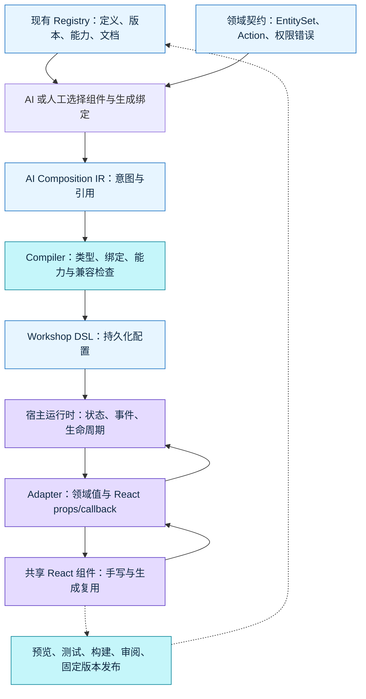

# EOS 实施建议：让高码组件进入已有组件契约和交付流程

> 全篇是工程建议，不是 Palantir 产品事实或 EOS 源码审计。没有读取 EOS Registry、Adapter、运行时或造物平台的实现；以下名称按本次研究需求使用。实施前应以实际仓库、类型和测试替换假设。Palantir 事实入口为 [协议附录](protocol-api.md)、[React 适配附录](react-adapter.md)、[构建发布附录](build-release.md)。

## 1. 首先统一谁拥有哪一份真相

建议把“可生成、可编排、可发布”的共同基础放在现有 Registry 与类型系统中。高码手写、低码配置和 AI 生成消费同一份组件定义、领域类型和行为；不要另建一个由 prompt 手工维护的 AI 组件目录。若 EOS 继续使用 `AI Composition IR → Compiler → Workshop DSL`，widget 接入应扩展编译与运行时适配，而不是让模型直接调用发布 API 或创建第二套保存流程。

*自绘建议图。箭头是建议的职责和数据流，不是对 EOS 或 Palantir 私有服务网络的还原。*

| 建设对象 | 建议持有的权威信息 | 应避免的重复或泄漏 |
| --- | --- | --- |
| Registry | 组件 ID、实现版本、契约版本、参数/事件 schema、支持的运行时、能力声明、文档、构建指纹 | 另一个 AI 手写目录；把某个宿主编辑器状态放入共享组件定义 |
| Adapter | 参数到 props、callback 到事件、EntitySet 到数据层、空值/加载/错误转换 | 重做查询缓存、权限判断或业务 Action；把函数 callback 当作可序列化 JSON |
| Workshop runtime | 变量图、绑定求值、事件调度、实例生命周期、尺寸/主题、能力授权和引用版本 | 各组件分别持久化相同业务状态；把 iframe sandbox 当成后端权限 |
| 造物平台/发布面 | 源码、lockfile、schema、构建产物、验证结果和审批记录的一致版本 | 只保存一张截图或最后一次聊天；“编译成功”直接代表生产验收 |
| AI 生成流程 | 查找可用契约、生成 IR/源码、修复检查失败、形成审阅包 | 自动提升权限；绕过 Compiler 和既有创建/保存管线 |

## 2. Registry 定义需要足够深，但界面实现保留选择

Palantir 的公开 widget contract 包含参数/事件与能力信息；objectSet 不是数组，运行时桥接要保留对象类型和集合语义。[官方参数说明](https://www.palantir.com/docs/foundry/custom-widgets/parameters-and-events/) 对 EOS 的启示是把实体身份、集合表达式和异步状态建成可验证的类型，而不是把组件都规范成某种唯一 UI 库。

建议先检查现有 Registry 是否已有以下信息，再补缺口：

| 信息 | 用途 | 最小机械检查 |
| --- | --- | --- |
| 稳定的 componentId 与 parameterId/eventId | 让实例绑定与实现版本解耦 | ID 唯一；删除或改名产生 breaking diff |
| 参数类型、方向、可空/默认/绑定约束 | 同时服务类型生成、配置面板与 Compiler | 不合法变量类型不得保存；输入与可回写参数分清 |
| EntitySet 类型和实体标识 | 数据视图、筛选、选中对象跨组件传递 | 禁止把整条业务记录任意塞进字符串或数组 |
| 事件及其可更新参数集合 | 收窄 callback 副作用，预览可解释 | 未声明事件或越界 parameter update 被拒绝 |
| 能力声明及宿主支持矩阵 | 网络、媒体、下载、打开链接、存储等 | 不支持能力在设计时提示；敏感能力要求既有授权 |
| 契约版本、实现版本、构建 hash | 判断兼容、复现预览与回退 | 发布物与 schema 指纹一致；禁止覆盖已有不可变版本 |
| 版本匹配的 props/API/配方/反例 | 给人和 AI 相同指导 | docs freshness、示例 typecheck，导入路径可解析 |

参数面板可以由 schema 生成控件和绑定选择器，但它还需要宿主知识：变量类型、可写性、表达式求值、数据权限、事件编排。单纯 JSON Schema 表单不能替代绑定引擎。反过来，schema 到配置面板的映射也不应藏在每个 React 组件里。

示意定义可以含 `componentId`、`implementationVersion`、`contractVersion`、`parameters`、`events`、`capabilities`、`runtimeSupport` 和 `artifactDigest`。这些是**建议字段，不是当前 EOS 或 Palantir API**。如果实际 Registry 已有同义字段，应复用并生成衍生文档，不新增另一份 manifest。

## 3. Adapter 把状态变成协议，不把数据层重写一遍

建议用一条“设备集合 → 筛选 → 表格 → 选中对象 → Action → 刷新”切片检查适配是否完整。共享组件可以使用 EOS 现有 UI、AntD、react-data-grid 或 OSDK 风格组件；宿主 adapter 保持窄接口。

| 场景 | Adapter 的建议行为 | 失败时用户应该看到什么 |
| --- | --- | --- |
| EntitySet 初次未到 | 保留未绑定、加载中、空集合的区别；传给数据 hooks 前验证可用 | 正确的配置/加载提示，不把未到值解释成空业务数据 |
| 宿主更新筛选 | 产生新的集合引用/查询身份，通过现有缓存与取消机制加载 | 最新条件对应结果；过期请求不覆盖新状态 |
| 表格选中变化 | callback 转成已声明事件及 typed selection 更新 | 能解释哪个事件改变了哪个宿主变量 |
| 宿主拒绝或归一化回写 | 区分本地期望值与宿主确认值，定义何时 reconcile | 明确恢复/校正，不无限循环或显示错误选中态 |
| Action 成功/失败 | 成功触发数据层失效与宿主相关集合刷新；失败保留可重试状态 | 失败不伪造成功；Action 数据与周围低码视图一致 |
| scenario/分支切换 | 同一身份必须带清楚的执行上下文，不默认全部 Main | 当前数据源和执行目标可见，避免跨上下文缓存混用 |

Palantir 的 [`refreshHostDataOnAction`](https://www.palantir.com/docs/foundry/custom-widgets/use-osdk/#refresh-host-data-on-action) 说明组件数据缓存和宿主对象集合刷新是两份责任；EOS 也应明确“哪个 Action 影响哪些查询/变量”及其失效边界。不要依赖全页面刷新来掩盖接线缺口。

双向状态需要明确语义，而不止类型：事件是否包含值更新、宿主是否确认、更新是否原子、回传是否重复、并发冲突如何解决、重新挂载是否重放。公开 Palantir 客户端并不能证明 Workshop 的所有这些保证；EOS 可以把自身要求直接写成协议与测试，而不把猜测当作可复制规范。

## 4. 生命周期与宿主能力应进入生成和验收约束

Palantir 文档明确隐藏布局默认卸载 custom widget，iframe 内存随之丢弃，localStorage/sessionStorage/IndexedDB 不支持；保留挂载可由 Workshop display optimization 配置。[运行时限制](https://www.palantir.com/docs/foundry/custom-widgets/development/#understand-runtime-limitations) EOS 是否采用 iframe 隔离或同树 React 是另一个设计决策，不能仅因 Palantir 使用 iframe 就一律迁移。

| 状态类别 | 建议归属 | 重新挂载后的预期 |
| --- | --- | --- |
| 当前筛选、选中对象、导航页、需要跨组件共享的业务状态 | 宿主变量/受控 props | 从宿主恢复 |
| 表格 hover、tooltip、临时展开、尚未提交的纯视觉状态 | 组件局部状态 | 默认重置，必要时明确持久策略 |
| 未提交的业务表单 | 明确受控草稿或组件草稿策略 | 切页/卸载前确认保存或丢弃；不可静默假定保留 |
| 服务器记录与 Action 结果 | 领域数据层/后端 | 重新查询或从正确缓存恢复 |
| 授权、运行时能力与执行身份 | 宿主/后端 | 重新校验，不从组件缓存授权决定 |

组件使用需要清理订阅、ResizeObserver、定时器、异步请求和事件 listener；remount 和 React StrictMode 不能产生重复 Action。建立 `created → initializing → ready → degraded/failed → disposed` 等可解释状态是建议，**不是对 Palantir 闭源 runtime 状态机的发现**。故障 UI 应指明“契约未绑定 / SDK 未授权 / 网络拒绝 / 发布资产缺失 / 组件抛错”，使生成器知道修复哪一层。

外网与持久存储政策应由目标 runtime 给出；AI 生成时检索到的能力矩阵要进入静态检查和预览。Palantir 的 custom widget 外网受不可配置 CSP 限制，Ontology 与其他受支持端点另外受 allowlist 和查看者权限控制；摄像头等能力还需要开发者声明、构建者允许、最终用户浏览器许可。[runtime](https://www.palantir.com/docs/foundry/custom-widgets/development/)、[支持端点](https://www.palantir.com/docs/foundry/custom-widgets/use-osdk/#supported-endpoints)、[iframe attributes](https://www.palantir.com/docs/foundry/custom-widgets/iframe-attributes/) EOS 应分别落实能力准入、执行身份和后端授权，不能用“已通过 sandbox”概括三者。

## 5. 契约升级必须可审阅，回退必须覆盖引用

建议把兼容比较放在 Registry 发布和宿主升级两个环节。语义化版本只是标签，兼容判定需要比对 schema、Adapter 和消费者约束。

| 改动 | 建议默认判断 | 应交付的审阅信息 |
| --- | --- | --- |
| 新增有默认值的可选输入 | 可能兼容 | 老实例缺省时的行为与回归 |
| 新增必填输入，删除/改名参数或事件 | breaking | 受影响实例、迁移映射、升级后的绑定 |
| 标量变数组，字符串变 EntitySet，改变 object type | breaking | 类型 diff、拒绝旧绑定、数据语义迁移 |
| callback 更新目标或 Action 副作用变化 | 即使 props 类型不变也需行为审查 | 事件 trace、权限与业务回归 |
| 新增摄像头/下载/外网能力 | 需要能力审查 | 哪些宿主支持、授权步骤、拒绝时降级 |
| 修改主题、尺寸、挂载策略 | 需要交互回归 | 布局/导航、长内容和草稿状态的变化 |
| Ontology/领域 API 升级 | 与 UI 契约一起评估 | codegen、Action、缓存键和宿主引用影响 |

发布包至少关联：源码 commit、lockfile、组件/契约版本、manifest hash、bundle hash、构建工具版本、测试摘要、预览数据来源和运行时版本。宿主实例固定引用该版本，升级时显示 schema/行为差异并验证绑定。回退应恢复原引用及其对应配置；若模型/Action 数据已被生产修改，回退 UI 不能自动回退数据，应单独设计补偿与兼容路径。

Palantir 已有版本固定与发布机制见 [Pilot 第 10 节](../pilot-2026-09/README.md#10-custom-widgetwidget-registry--workshop-的组合路径) 和 [本篇实现附录](build-release.md)。本建议额外强调消费者迁移和可观察行为；公开资料没有证明 Registry 自动提供完整契约兼容分析或迁移引擎。

## 6. AI 的交付物应该是可检查的变更包

建议生成链保持既有创建和保存流程，模型负责提出和修复候选工件：

1. **发现**：从真实 Registry 与领域 schema 取可用版本、支持参数/事件、能力和配方。Skill/MCP 可以提供入口，权威定义仍在 Registry/types。
2. **约束**：明确目标宿主、业务数据源、角色、可执行 Action、生命周期、尺寸/主题要求和不支持能力。
3. **生成**：输出引用固定版本的 IR、绑定、React 源码/adapter 与必要领域变更；不把生成器私有 UI 状态落入 DSL。
4. **编译**：使用现有 Compiler 检查组件引用、参数类型、事件更新范围、循环绑定、能力与版本，再生成 Workshop DSL。
5. **预览**：本地 mock 明示模拟身份和数据；宿主 staging 验证真实绑定、尺寸、重挂载、权限负例与 Action 同步。
6. **交付**：锁依赖并构建，汇总差异、测试、来源和预览证据，经既有审阅/发布流程形成 Registry 版本。
7. **消费升级**：对具体应用显示升级 diff、迁移绑定、回归与回退记录；把错误回馈共享组件、配方和机械规则。

模型写出了“看起来正常”的 UI，还没有证明生成流程完成。工程门禁优先于评分：错误组件/参数引用、错误 Action、越权、状态不一致或依赖构建失败应直接阻止发布。对仅视觉样式调整可轻量验证，避免每次生成都运行与风险无关的大测试集。

## 7. 建议的第一条验收切片

不预设需要先造完整 Registry 或重写全部组件。先盘点实际 EOS 契约，选一条只读集合 + 显式 Action 的流程，让高码页面与 Workshop 编排消费相同领域组件与 Adapter。

| 阶段 | 最小交付 | 通过条件与证据 |
| --- | --- | --- |
| M0 契约和固定候选 | 一个现有 Registry 组件、输入/回写/事件、稳定样本，无 Agent Harness | typecheck、绑定检查、事件 trace；老实例不受新版本影响 |
| M1 AI 生成接入 | 复用现有 Codex/生成工具，IR 经 Compiler 进入 DSL | 同一任务可复现，首轮/修复的检查输出、审阅包完整 |
| 宿主 staging | 真绑定、合法/无权限角色、切页 remount、Action 后刷新 | 真实页面短录屏和角色/版本记录；不能用 mock 代替 |
| 升级/回退 | 一个兼容新增与一个故意 breaking 改动 | 升级 diff、非法绑定被拒绝、回退恢复老引用 |
| M2 平台扩大 | 只有前述稳定后评估 Harness/批量生成/更多组件 | 衡量修复时间、重复请求、事件循环、未授权调用、回退耗时 |

上述 M0/M1/M2 是建议的投资顺序，具体命名应映射 EOS 现有工作计划。评估应使用同一业务任务、角色、数据和运行时，记录人工修复分钟、首次编译成功率、关键交互通过率和消费者升级成本；没有基线时不宣称某种方案节省百分比。

## 8. 实施前必须用 EOS 当前证据回答的问题

- Registry 定义能否生成配置面板、类型和 AI 文档，还是三处分别维护？
- 现有 Adapter 如何描述 callback、副作用和回写？宿主拒绝/归一化后谁负责恢复？
- EntitySet 是查询 AST、引用还是已加载数组？是否携带实体类型、权限上下文和 scenario/分支？
- runtime 的卸载、状态保存、事件顺序、错误隔离和能力检查是否已有明确测试？
- 造物平台保存的版本能否关联源码、schema、bundle、验证结果和宿主消费者？
- 已有 AI 创建管线、Compiler 和 DSL 各自负责什么，新增 widget 能否只增加适配层？
- 上线验收记录是否区分 mock、宿主 staging、生产身份与实际数据操作？

这些问题是下一步 EOS 源码审计的入口。本专题没有用 Palantir 的公开实现替 EOS 回答。
