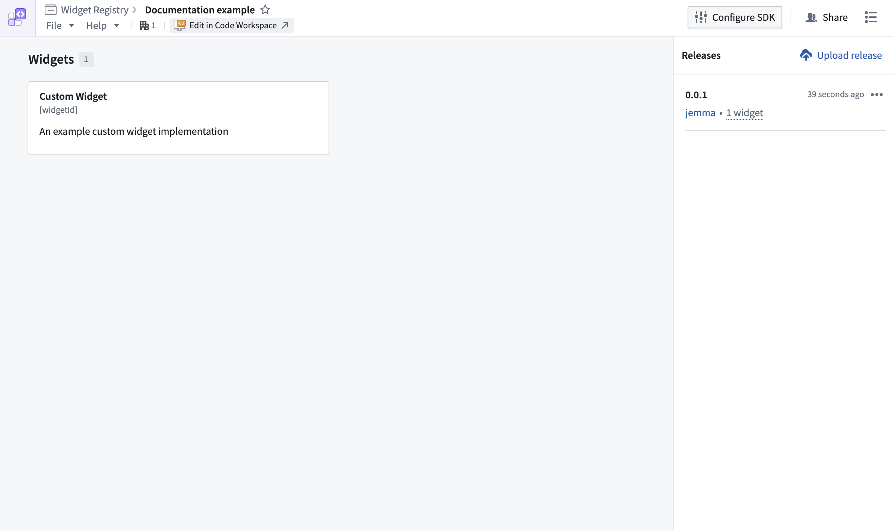
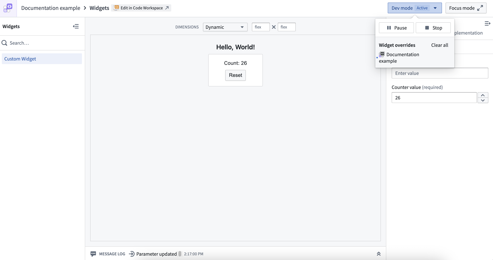
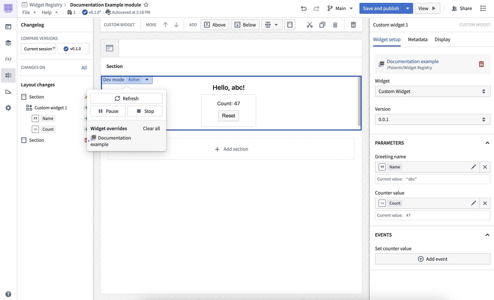
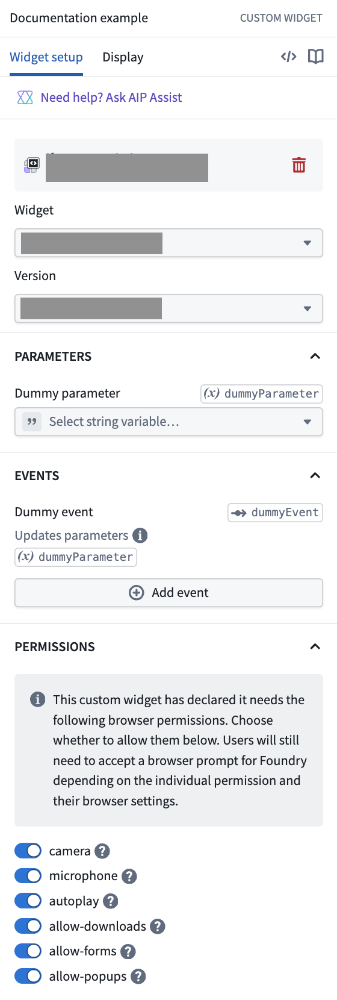
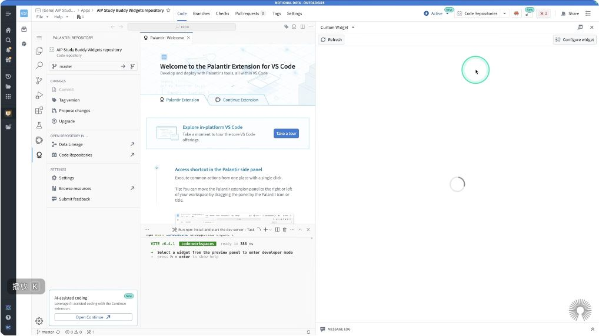

# Custom Widgets / Widget Registry：视觉与视频证据

截至 **2026-10-01 UTC**，可复核的本地材料包括 **14 张官方文档原图、1 张作者公开录像真实帧**。官方图覆盖 Registry 资源页、参数与事件、Playground/Workshop dev mode、SDK 开关、ZIP 上传、Foundry CI，以及额外 iframe 能力的宿主配置。公开录像正常访问成功过，但后续章节播放与字幕获取存在具体阻塞，**没有取得可交付短录屏**。所有本地资产的原链接、来源页、获取时间、字节、尺寸、SHA-256 与逐图观察见 [assets-media.md](assets-media.md)；机器核验见 [media-checks.json](evidence/media-checks.json)。

## 1. 最有价值的官方视觉证据

### M02：Widget Set 在 Registry 中具有 release 与开发入口

图中同时出现 Widgets 列表、`0.0.1` release、Upload release、Edit in Code Workspace、Configure SDK。它为「源码工作区、发布版本、可嵌入组件目录是相互连接但不同的对象」提供界面线索。版本的不可变性、兼容性和升级行为仍须结合文档及实际包核验，单张图无法证明这些规则。来源：[Create a widget set](https://www.palantir.com/docs/foundry/custom-widgets/create)。

### M09：Playground 将组件、输入配置和消息日志放在同一观察面

官方图的 Dev mode 为 Active；组件显示 Count 26，右侧 Counter value 也是 26，底部 Message Log 记录 Parameter updated。这支持 Playground 是检查配置与宿主交互的工作面。它是静态插图，不能单凭数值相等断言事件传输方向、时序或失败重试。来源：[Develop a widget set](https://www.palantir.com/docs/foundry/custom-widgets/development)。

### M10：Workshop 用自己的变量与事件承接高码组件

图中 Widget Version 为 `0.0.1`；Greeting name 绑定 `Name` 变量（abc），Counter value 绑定 `Count` 变量（47），Set counter value 旁提供 Add event。Workshop 的模块版本显示为 `v0.1.0`，可直观看出宿主模块与组件版本分别呈现。这里真正值得复用的是**命名参数、宿主变量、组件事件和版本选择的配置结构**；界面图片不披露底层 `postMessage` 数据包。来源：[Develop a widget set](https://www.palantir.com/docs/foundry/custom-widgets/development)。

### M14：浏览器能力要在宿主配置面再次准许

图中 EVENTS 明确显示 Updates parameters 与 `dummyParameter`，下方 PERMISSIONS 列出 camera、microphone、autoplay、allow-downloads、allow-forms、allow-popups。说明文字还要求视具体权限与浏览器设置接受 Foundry 的浏览器提示。灰色遮盖来自官方原图，本研究未改图。应把「组件声明需要」「应用构建者准许」「浏览器用户最终允许」区分开；Ontology 数据授权是另一个层面。来源：[Enable additional iframe attributes](https://www.palantir.com/docs/foundry/custom-widgets/iframe-attributes)。

## 2. 附录图库的核验价值

| 图 | 可以直接观察的内容 | 不应从图中推断的内容 |
|---|---|---|
| M01 创建向导 | In Foundry / Outside of Foundry 两条开发位置路径 | 所有组织都已启用相同入口 |
| M03 Published preview | v1.0.0、required 参数、Count 8 与消息日志 | 参数完整类型全集或动态更新时序 |
| M04 开发终端 | localhost:8080 的 `.palantir/setup/`、历史 Vite 6.3.5 | 当天 npm 最新版本 |
| M05 Code Workspace | 源码 `parameters.values`、`emitEvent`、`parameterUpdates` 与 Count 31 预览并排 | 完整宿主实现或 OSDK 数据授权结果 |
| M06–M08 dev mode 状态 | Inactive / Paused / Active 分开，Active 的资产来源 tooltip 为 localhost | 组件隐藏时卸载、storage 禁用等生命周期规则 |
| M11 SDK 配置 | Ontology APIs Enable 与生成 SDK 的 Ontology 选择 | 勾选后绕过查看者数据权限 |
| M12 ZIP 上传 | Upload new asset 及 release 列表 | 上传权限或版本覆盖规则的实际执行 |
| M13 Tag CI | tag/commit、`osdk-widget-publish`、manifest version、ZIP 与 Publish complete | 本研究真的执行了 Foundry CI；图中 CLI 是当前版 |

M13 是带 **2025-07-02** 时间信息的官方历史示例；图中 CLI 为 **0.26.3**。图片与当天发布包的版本核验必须分别记账。未重复保存 Pilot 专题已经登记的 `workshop-custom-widgets.png` 和 `workshop-parameters-and-events.png`；需要比较时可引用 [Pilot 资产目录](../pilot-2026-09/assets.md)。

## 3. 公开录像：保留可证实部分，拒绝把缓冲或广告当关键帧

### M15：Ontologize 作者录像的真实帧

- 来源：[Vibe Coding a Custom Workshop Widget](https://www.youtube.com/watch?v=U_EB06sWv-s)，频道 **Ontologize**，YouTube 展开描述显示发布时间 **2026-03-04**；时长约 **17:19**（播放器 DOM：1039.881 秒）。它是公开作者/培训方来源，不是 Palantir 官方产品文档；频道的 Palantir Partner 身份为其自身描述。
- 真实保存时点：**03:36.36**（`video.currentTime = 216.359606`）；播放器已加载（`readyState = 4`）并暂停。画面在 Foundry Code Workspace 显示 Palantir VS Code 欢迎面、dev 终端与组件预览的加载状态；顶端标明 **NOTIONAL DATA - ONTOLOGIZE**。
- 采集方式：正常 Chrome 访问公开视频，从实际播放器矩形裁取 1018×573 像素；没有下载源视频，没有增补 UI。

该帧只能证明作者录像中出现了这组开发界面，不能证明完整 AI 生成/发布流程、组件成功交互或宿主协议。画面中的 spinner 也不能被解释为本研究发现的平台故障。作者章节另提供 04:13 Prompting for the renderer、07:16 Vibe coding、08:41 Testing and refining、13:46 Integrating the widget 等入口；这些后续关键章节在本次核验中未取得可靠加载完成的帧，因此没有冒充已核验的视频细节。

### 第二候选：Object Set 读取与选择回传教程

[Palantir Foundry 自定义组件教程：Object Set 读取 Ontology 对象并回传选择](https://www.youtube.com/watch?v=kD6R1lGTQEo)，频道 **跟贝贝一起学习**，页面发布时间 **2026-09-18**，播放器时长约 **08:03**（483.661 秒）。展开描述和章节包含 02:39 main.config.ts、03:21 widget.tsx、04:56 Workshop 选择变量绑定。它是第三方教学线索，尚不足以作为官方 API 行为的证据。

正常跳转到 **04:56** 后，播放器先呈现 `readyState = 1`，画面仍停在片头；继续播放则出现 YouTube「出了点问题。请刷新或稍后重试」。这张 stale 片头截图没有保存为 04:56 的视频证据。两条视频的标准字幕导出均返回不可用；播放器出现的字幕/转写入口不等于成功获得字幕。本研究没有制作、猜测或补写所谓字幕。

## 4. 尝试记录与来源边界

媒体检查见 [media-attempts.json](evidence/media-attempts.json)，记录公开视频 URL、章节时点、实际播放器状态、metadata-only 命令与编码工具版本/结果。正片章节未持续达到可采集状态，标准字幕导出未取得可用文本；这些获取限制不能解释为 Palantir 平台故障。

因此本次**真实短录屏与可用字幕仍是缺口**，不能用静态图转视频、广告、缩略图或 mock 补齐。官方图片提供的是历史示例界面证据；协议、版本和权限规则请以本专题的文档/包/源码核验为依据。EOS 的界面与机制建议属于分析，本研究没有接触 EOS 源码或部署。后续若有合法可用的 Foundry 演示租户，可优先录制「输入变更 → Playground 消息日志 → emitEvent → Workshop 变量/动作」的短段，连同版本和事件时间戳验证；这只是未来补证方案。
