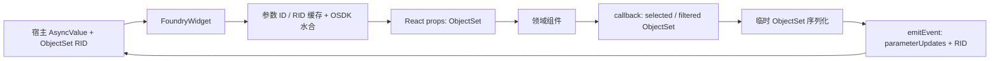

# React 适配附录：从宿主参数到 props，从 callback 到事件，以及契约如何演进

研究日：2026-10-01。主验证对象为真实 npm `@osdk/widget.client-react@3.74.0`、`@osdk/widget.client@3.74.0`、`@osdk/client@2.75.0`；适配示例另使用 `@osdk/react@2.75.0` 与 `@osdk/react-components@0.61.0`，后者仍为 [Beta][R19]。这里每份API结论按本次artifact锁定，不用历史专题的旧版本代替。本附录未登录 Foundry 租户、未审计 Workshop 闭源宿主、未检查 EOS 源码。

**结论：React wrapper 是一个小而有语义的宿主适配层，不是把 manifest 自动变成任意 React 组件的工具。** 它把宿主传来的异步参数映射成 context，为 ObjectSet 加上可用的 OSDK 对象，把组件 callback 的 ObjectSet 输出序列化回 RID，并处理 ready、尺寸、Vite full reload 与子组件渲染错误。业务组件的受控状态、宿主 echo、权限与失败恢复仍需要明确设计。公开实现也暴露出一些不能仅凭 TypeScript 类型就忽略的边界。[React wrapper][R01]、[context][R02]

## 1. 发布包与源码锁定

| 项目 | 本轮实际取得的值 | 能证明的范围 |
|---|---|---|
| npm 发布 | `3.74.0`，`2026-09-29T17:20:47.478Z` | 来自 registry 发布记录，不采用 npm 搜索页缓存的旧版本 |
| npm peers | React / React DOM / 两组 React types `^18 \|\| ^19`；OSDK client `^2.75.0`；widget.client `^3.74.0` | 支持声明，不等于所有组合的生产验证 |
| 发布包 SHA-256 | `3c67ffb38bc203430a7efb7df73cd322dc6e9e6adbc3599a5fe2c1826de80792` | 本地下载 tarball 的完整性记录 |
| 发布源码 | `fb8ec172d540ef7819382ff036aa2a692614af75` | 解码 npm publisher provenance 中的 `resolvedDependencies.gitCommit` |
| 运行时一致性 | 七个 `build/esm/*.js.map` 中的 `sourcesContent` 与该提交的原始 TS/TSX **逐字相同** | 本文审计的 runtime 对应发布包，而非仅查看移动中的 main |
| 本地执行 | Node `22.17.0`、React `19.1.1`、JSDOM `26.1.0` | 真实客户端包 + 模拟 bridge；不是浏览器租户验收 |

原始来源为 [npm registry][R00]、[3.74.0 tarball][R00T]、[npm provenance][R00P]；精简元数据和逐文件 hash 存于 [react-release.json](evidence/react-release.json)。本轮匹配了 tarball digest 和 publisher-supplied provenance，但**未执行证书链 / transparency log 的独立密码学验证**。当前 main 和已有 React Components 专题使用的提交不是此次 widget 发布提交，不能用其版本号替代这一锁定。

## 2. 公共 React API 究竟提供什么

公共根入口导出 `FoundryWidget`、`useFoundryWidgetContext` 和 `FoundryWidgetClientContext` 类型；内部 `FoundryWidgetContext` 和默认 `ErrorBoundary` 不是根入口导出。[index.ts][R03]

| API / 字段 | 确认的行为 | 适配含义 |
|---|---|---|
| `<FoundryWidget config={Config}>` | 为本次挂载创建一个 widget client，监听宿主，渲染 context provider | 这是高码组件的宿主入口，不是任意低码 renderer |
| `client` prop | 有 ObjectSet 参数时类型层要求提供；运行时用于 RID 水合和输出序列化 | 不能把仅有 token 字符串的对象当 OSDK Client |
| `initialValues` | 设置逐参数异步 map 的初值；便利聚合对象仍从 `not-started` 开始 | 本地 fixtures 不能替代 host ready/首次输入，也不能假设便利 values 已初始化 |
| `useFoundryWidgetContext.withTypes<typeof Config>()` | 返回绑定泛型的 hook；内部仍是读取同一个 context 后类型转换 | 编译期推断参数与事件；没有运行时 schema 注册或校验 |
| `asyncParameterValues` | 各参数独立的 `{ type, value: AsyncValue<…> }` | UI 应按相关字段判断加载、错误和旧值，而非只看总状态 |
| `parameters.values / state` | 便利聚合视图，values 为 Partial | 不应该强制断言所有值都存在 |
| `emitEvent` | 返回 `void`；类型收敛到 event ID 及它声明的参数更新 | callback 必须显式改写为序列化契约，不能传整个 UI 事件或组件实例 |
| `hostEventTarget` | 暴露类型化宿主事件目标 | 若自己监听，要自己移除监听；它不是完整宿主服务 API |

以上行为见 [props 与初始化][R01A]、[context 类型][R02A]、[withTypes 实现][R02B]。本地探针另确认：在 Provider 外调用 hook 不抛“缺少 Provider”错误，而是返回默认 `not-started`、空 map 和 no-op `emitEvent`。因此 AI 生成组件可能看上去能渲染，却没有接入真实宿主；应把挂载入口纳入验收。[默认 context][R02C]、[探针结果](evidence/react-probe-results.json)

## 3. 参数状态：应保留异步语义，不能过早压成 props 的裸值

`AsyncValue` 有五个 tag：`not-started`、`loading`、`loaded`、`reloading`、`failed`。其中 `loaded` 也允许 `value: undefined`；`reloading` 与 `failed` 可以携带先前值。这样可以区别“还没收到”“重新加载但有旧内容”“失败但保留旧内容”，而不是一律写成空数组。[AsyncValue 定义][R04]

**公开 wrapper 实现：** 每次 `host.update-parameters` 后，它把当前消息中的参数 merge 入 `asyncParameterValues`，但聚合状态只遍历**当前消息的 processedParameters**。优先级为 failed > loading > reloading > not-started > loaded；loading/not-started 分支的便利 values 为空，其他分支把本轮实际收集到的 `newParameterValues` 合并入旧聚合值。具体而言，`reloading.value` 只在此前聚合状态尚非 failed/loading 时收集，因此键的遍历顺序会影响本轮收集到哪些 reloading 值；并非所有携带值的参数分支都会被收集。这是公开代码边界，不能据此推定真实 Workshop 的消息键序或用户可见缺陷，也不能扩大为“可靠追踪所有参数全局状态”的保证。[收集与合并实现：client.tsx L164–215][R01B]

**本地不完整消息实验，非真实 Workshop 行为：** 先推送完整 loaded 输入；再仅推送 `title=failed`；随后仅推送 `count=loaded`。结果便利总状态变为 loaded，但逐字段 title 仍为 failed。TypeScript 的 `AsyncParameterValueMap` 是按 config 所有键生成的 map，这个探针刻意发送不完整 payload，检验运行时边界；没有证据证明真实宿主发送增量消息、允许这种消息或会出现该结果。要得出产品缺陷结论，仍需真实宿主消息证据。[类型 map][R05]、[探针源码](probes/react-adapter/probe.mjs)、[结果](evidence/react-probe-results.json)

另有一个小边界：默认初始化只拷贝 parameter 的 `type` 和 `not-started`，数组初值没有复制 `subType`，尽管扩展类型 map 在编译期包含 subtype。探针取得实际 `labels={ type:"array", value:{type:"not-started"} }`。这是初始值形状观察，不证明宿主后续数组输入缺少 subtype。[initializeParameters][R06]

**工程建议：** Adapter 先消费逐字段状态，约束“哪些输入必须齐备才能 render/Action”；明确 stale data 是否可以继续显示或操作；将首次完整输入与后续消息语义写入协议测试。`as Loaded` 或 `?? []` 可以让编译器安静，却可能抹去业务上必要的状态差异。

## 4. ObjectSet：React 不传 rows，wire 不传 OSDK 实例

输入的 wire 值是 `{ objectSetRid }`，不是序列化对象列表。React wrapper 依据 config 的 `allowedType` 调用 OSDK `hydrateObjectSetFromRid`，在值里增加 `objectSet: ObjectSet<T>`，得到 `{ objectSetRid, objectSet }`。它以 parameter ID + RID 缓存：同一参数同一 RID 复用同一个 ObjectSet 引用；RID 变化重新水合；没有 value 时清理该参数缓存。[水合与缓存][R07]

本地使用真实 OSDK Client、虚构类型和 RID 验证了引用复用：同 RID 相等、新 RID 不等，且仅水合过程的 fetch 次数为 0。**这只证明惰性对象构造，不证明真实 RID 存在、用户有权读取或 API 请求可用。** 访问 records、aggregate、Action 等仍属于后续 OSDK 请求。[探针](probes/react-adapter/probe.mjs)

输出则有一个不同的 React 便利契约：`emitEvent` 的 ObjectSet 更新值直接接收 `ObjectSet<T>`，不能把 wire 层 `{objectSetRid}` 原样作为 React 更新值。wrapper 调用 `createAndFetchTempObjectSetRid`，再送 `{ objectSetRid }`；多个 ObjectSet 参数通过 `Promise.all` 并行转换。[扩展事件类型][R02D]、[序列化实现][R08]



图中最后一条是应用需要完成的宿主 round trip；客户端的 emit 本身不会更改 context。它也不是后端 Action 事务图。

## 5. 双向状态、事件顺序和失败不是一个简单 setState

| 情况 | 当前 React 实现 | 应避免的误读 |
|---|---|---|
| 仅 primitive/array/scenario 更新 | 同步 passThrough，快速多次调用全部发送 | 不能以 ObjectSet 的 last-call 行为概括所有事件 |
| 含 ObjectSet 更新 | 异步转换；按 **event ID** 递增 call ID；转换完成时只发送该 ID 最后一次仍有效的调用 | 不是按完成时间选“最后”，不是整个 widget 只剩一次 |
| 不同事件 ID | 各自保留 call ID | 不保证两个 ID 之间有全局顺序或原子提交 |
| 同一 ID 串行完成 | 各次可发送 | 不是永久 debounce |
| 转换异常 | `emitEvent` 返回 void，异步分支没有把 Promise 返回给调用者，也没有 catch | `await emitEvent(...)` 不表示宿主已更新；错误不是 Promise API 暴露给调用者，也不是框架已成功恢复 |
| outbound emit | 发送 widget.emit-event | 不更新本地 parameter context；需真实宿主后续输入才能反映最终值 |

这些是 [emitEvent 实现][R01C]、[序列化分支][R08] 与 [作者测试][R09]直接支持的行为。作者测试分别覆盖不同事件、同 ID 乱序完成、同 ID 串行完成、无 ObjectSet 同步多发。PR [#2294 的 review](https://github.com/palantir/osdk-ts/pull/2294#discussion_r2631152449) 曾明确担心旧参数事件被异步改造后丢失；当前双分支就是不能忽略的兼容语义。作者提到未来可考虑 [emitEventAsync](https://github.com/palantir/osdk-ts/pull/2294#discussion_r2627269147)，**当前 3.74.0 context 没有该方法**。

本地实际包验证：发 `count=9` 后 context 仍是 4，收到模拟宿主 echo 才变为 9。[结果](evidence/react-probe-results.json) 这要求 Adapter 自己选择受控还是带 optimistic draft：一个文本框的输入中间态可以在 React state 中；提交语义可以发宿主 event；最终状态由何者确认必须写清。ObjectSet 的 last-call 机制适合淘汰陈旧 selection/filter 结果，不能直接被当成业务命令“每次点击都必须执行”的队列。

call ID 只在异步分支递增，没有在同步分支或卸载时统一作废。因此上述规则仅是“同ID、重叠异步转换”的保证；不能推出与同步调用交错后的全局 last-wins、所有输出取消，或卸载后 pending Promise 不会再发消息。[实现][R01C] 当前静态 event 若声明 ObjectSet 输出，类型系统要求包含该值；刻意省掉值来混合同步与异步不是合法 typed payload。

**建议：** EOS 的事件规范应拆开 state update、用户 intent、后端 command；为异步可序列化值设计可等待的结果、失败归因、取消/过期规则。需要“每次处理”的命令不能用同 ID last-call 来表达。该建议未在 EOS 实施。

## 6. Scenario、mapTileLayer、theme、尺寸、URL 各是什么边界

| 需求 | 审计结果 | 需要额外做什么 |
|---|---|---|
| Scenario | 参数只是一条 string RID，或 string RID 数组；React 扩展仅针对 ObjectSet，没有自动 ScenarioClient 水合 | 业务代码在需要时自行创建 scenario-scoped client，并管理 provider/cache 生命周期 |
| OSDK scenario client | 当前 `withScenario(client, rid)` 在 `@osdk/client/unstable-do-not-use`，源码标注 experimental / beta，同步创建，不进行网络调用 | 是 OSDK 的不稳定能力；不代表 widget 获得所有 scenario endpoint 或宿主自动切换 |
| mapTileLayer | 发布类型里有 read-only `{styleJsonUrl}`；config 源码标注 experimental；React 只透传 | 地图渲染器自行加载 style；资源权限、CSP、网络、tile origin 不能由这条 URL 推定 |
| theme | 此版 context 无 theme 字段；官方通过 CSS `prefers-color-scheme` 或 JS `window.matchMedia` 检测父应用配色 | 给组件库设置appearance并监听media change；这是浏览器配色机制，不是context主题消息。[Dark theme][D01] |
| size | wrapper 观察 `document.body` 的 border-box 后发 widget.resize；文档区分填满父容器与body内容驱动的auto layout | absolute/flex可按需要设置100%尺寸；auto不应把html/body固定100%，应让body随内容增长/缩小。最低client-react3.3.0。[Auto sizing][D02] |
| openURL / navigation | context没有openURL、typed message没有navigation；官方路径为emit event，再由Workshop把它绑定到Open URL副作用 | URL可以是静态string，或同event直接更新的string参数；不要依赖异步下游变量变换先完成。[Open URL][D03] |

来源：[参数类型][R10]、[withScenario][R11]、[context][R02]、[typed messages][R12]、[ResizeObserver][R01D]。Scenario 和 mapTileLayer 透传已由本地探针确认，未请求地图样式或真实 scenario。官方 [参数与事件文档](https://www.palantir.com/docs/foundry/custom-widgets/parameters-and-events) 的 React 示例仍使用 `OsdkProvider2` / experimental import；本次可编译示例使用实际 `2.75.0` 根入口 `OsdkProvider`。[当前 provider 导出][R13] 不应把文档中的“实时更新”措辞覆盖 widget set 的 API 限制；ObjectSet subscription 的租户可用性仍应按 widget OSDK 文档和真实验收确定。

主题的官方模板也有 [useDarkTheme](https://github.com/palantir/osdk-ts/blob/fb8ec172d540ef7819382ff036aa2a692614af75/packages/create-widget.template.react.v2/templates/src/useDarkTheme.ts)，初始化matchMedia后在change中更新，并在cleanup移除listener。Open URL的外部链接可能触发警示；若选择HTML `<a target="_blank">`/window.open这条浏览器路径，则另需`allow-popups`等能力许可，不要混同宿主Open URL event。[Open URL][D03]、[iframe能力文档][D04] 这些为官方指导，本轮没有在真实宿主测试theme切换、auto容器或Open URL。

## 7. 接入 @osdk/react-components 的具体 adapter

研究用的完整示例为 [adapter-example.tsx](probes/react-adapter/adapter-example.tsx)，通过锁定版本的 `tsc --noEmit`；这是**类型验证过的自编示例，没有启动 ObjectTable UI、没有 Foundry 数据请求，也没有提交 manifest**。其中 `MockTask` 只为编译验证的虚构定义，发布时应换成生成 SDK export；其内部 RID metadata 不足以完成 Registry manifest 验证。

该 UI 库实际 `0.61.0` 发布于 `2026-09-28T14:10:56.505Z`，publisher provenance 指向 `37cfd38676bf04edaef5847e929d914ea214c149`，与 widget wrapper 的发布提交不同。其 npm `ObjectTableApi.js.map` 中完整 API 源文与该固定提交逐字一致；下述 selection 契约按这份 artifact 解释，不能把两包混成同一次发布。[独立版本记录](evidence/react-components-release.json)

最小接线为：

```tsx
// 单独的适配模块，复用完整示例导出的 config 和虚构 MockTask。
import { ObjectTable } from "@osdk/react-components/object-table";
import { useFoundryWidgetContext } from "@osdk/widget.client-react";
import { MockTask, taskWidgetConfig } from "./adapter-example.js";

const useTaskWidget = useFoundryWidgetContext.withTypes<typeof taskWidgetConfig>();

function TaskTableAdapter() {
  const { asyncParameterValues, emitEvent } = useTaskWidget();
  // 参数的第一层 value 是 AsyncValue；其第二层 value 才是实际参数值。
  const tasks = asyncParameterValues.tasks?.value;
  if (!tasks || tasks.type === "not-started" || tasks.type === "loading") {
    return <p>等待宿主任务集…</p>;
  }
  if (tasks.type === "failed") {
    return <p role="alert">任务参数加载失败：{String(tasks.error)}</p>;
  }
  if (!tasks.value) return <p>没有绑定任务集。</p>;
  // 这里已收窄为 loaded/reloading，且实际参数值存在。
  return <ObjectTable
    objectType={MockTask}
    objectSet={tasks.value.objectSet}
    selectionMode="multiple"
    streamUpdates={false}
    onRowSelectionChanged={({ objectSet, isSelectAll }) => {
      if (objectSet) emitEvent("selectionChanged", {
        parameterUpdates: { selectedTasks: objectSet, isSelectAll },
      });
    }}
  />;
}
```

`ObjectTable.onRowSelectionChanged` 已有 `selectedRows`、`isSelectAll`、`objectSet` 三者，不能互换。Select-All 时 rows 仅包含已经加载的行；`objectSet` 表示跨页选择范围；部分选择是主键 `$in` 过滤；取消全选是 `$in: []` 的空集。[ObjectTable 契约][R14]

因此 Adapter 用 ObjectSet 表达输出范围、boolean 表达全选 intent，不把“页面中所有加载行”错当“所有匹配实体”。若要由宿主恢复完整受控 selection，还要另设主键/全选状态与 echo 策略，因为 `selectedRows` prop 要的是主键数组，而 `selectedTasks` ObjectSet 不直接提供这份数组。示例只完成输入 objectSet → 表格，以及 callback → 宿主输出；**没有宣称宿主选择集已双向恢复到表格**。[受控 selection props][R14A]

入口中同时放置 `OsdkProvider(client)` 和 `FoundryWidget(config, client)`：前者服务 OSDK React 数据 hooks / 领域组件，后者服务宿主与 ObjectSet 参数桥接。一个 provider 不自动替代另一个。[示例](probes/react-adapter/adapter-example.tsx) 已编译验证的负例另在 [contract-negative.ts](probes/react-adapter/contract-negative.ts)：不存在的 event ID、少一个声明输出、把 wire RID 代替 React ObjectSet，以及更新 read-only mapTileLayer 都被类型系统拒绝。[类型检查日志](evidence/react-typecheck.log)

**对 EOS 的建议：** Adapter 目录以“领域组件行为 → 可序列化宿主模型”的映射为中心，而不是包装每个 JSX prop。优先提供 EntitySet + selection intent、Action params + permission/error、filter AST + effective set、theme/locale、layout/resize、user-facing lifecycle 这些明确的映射。Callback 中的 Map、Date、OSDK 实例、DOM Event、函数不能未经定义直接写进低码 JSON 或跨 iframe payload。

## 8. 生命周期与故障恢复：有框架帮助，但没有完整自愈

### 8.1 初始化、ready、卸载与 dev reload

首次 effect：subscribe → 安装 `host.update-parameters` listener → ready → 观察 body → 若存在 `import.meta.hot` 则注册 `vite:beforeFullReload`。卸载时 unsubscribe bridge、disconnect observer、移除 HMR listener。公开实现没有 ready acknowledgement、宿主重连 timeout、heartbeat 或 host restart 重新握手等 React 封装。[生命周期][R01D] “没有”限于此次公开封装，不否定闭源 bridge/host 可能另有机制。

PR [#3023](https://github.com/palantir/osdk-ts/pull/3023) 记录了真实开发问题：Vite full page reload 会让 widget 空白，原来需要刷新父窗；修复在浏览器内侦听 Vite HMR hook，发送 reload 让父级处理。该 PR 于 2026-05-18 合并，进入 `3.19.0` changelog。不能把它解释为生产实例任意故障的自动恢复保证。相邻的 [#2538](https://github.com/palantir/osdk-ts/pull/2538) 则在 Vite plugin 吞掉 config hot update，避免普通全页重载；契约变更仍需要重新载入 dev mode，不是修改 React 文件就一定重设宿主 binding。

### 8.2 config/client 是挂载边界

createFoundryWidgetClient 用 `useMemo([])`；参数初值只在 useState 初始化；接收输入的 effect 是 `[]`，闭包捕获首次的 config / osdkClient；输出 emit callback 却依赖当前 `[osdkClient, config, client]`。因此把新 config 或 client prop 直接塞进同一挂载实例，可能形成输入仍用旧定义、输出使用新定义的分裂。这里是直接从代码得出的风险，不是断言 Workshop 在升级版本时一定这样挂载。[创建与 callback][R01A]、[effect][R01D]

建议 config、版本、ontology/client identity 变化时用明确 remount 边界；在真实宿主测试升级后的旧 listener、cache、draft、pending emit 是否全部结束。示例使用 `key={contractVersion}` 表达 widget 的挂载边界；若 client identity 也变化，上层应同时重设数据 provider。

### 8.3 ErrorBoundary 能救哪一类错误

当前 Boundary 包在 Provider 内部，只包住 children。它通过 React `getDerivedStateFromError` 存错误，展示标题和 error stack；开发环境再展示恢复建议。源码没有 reset/retry action、自动恢复、或把错误发成 typed widget.error 消息。[Boundary][R15] 如果缺少 injected bridge，`createFoundryWidgetClient()` 在 wrapper 自身 render 中出错，**这个内部 child Boundary 捕捉不到**。输入 listener 中的水合异常和异步序列化 rejection 也不能被当成已由 child render Boundary 处理。

验证不是一条统一whitelist：入站helper遍历payload键后直接取`config.parameters[id].type`，未知键会在事件回调中出错；ObjectSet输入还检查RID对象形状和client存在。出站无ObjectSet分支直接passThrough，含ObjectSet分支才查询event是否存在并检查client；两者都不能替代宿主端独立schema/权限验证。[输入helper][R07]、[输出helper][R08] 这是具体公开分支差异，没有把它概括成“所有参数都已校验”或“整个adapter完全不校验”。

历史 [#2214](https://github.com/palantir/osdk-ts/pull/2214) 的动机是子组件初始化错误可能阻止 ready 而让宿主无限 spinner；2025-11-27 合并。[#2216](https://github.com/palantir/osdk-ts/pull/2216) 两天后扩大捕获显示行为；[#2218](https://github.com/palantir/osdk-ts/pull/2218) 再 backport 到 release/2.5.x。这些是渲染降级的来源，不是 JavaScript 所有异步错误都能自动捕获的证据。[PR 状态记录](evidence/react-pr-status.json)

### 8.4 StrictMode 是需要测试的开发态

cleanup 没移除 `client.hostEventTarget` 上那个匿名 update listener。React StrictMode 重放 effect 时，bridge subscription 先移除后重加，但这个 client 内部 EventTarget 上可留下两条 listener。本地 React19 / JSDOM 探针用 parameter getter 计数复现：单条输入被读取 2 次；普通挂载为 1 次。[源码][R01D]、[探针结果](evidence/react-probe-results.json)

这是可复核的**本地 React 开发态观察**；本研究没证明真实 Workshop wrapper 开启 StrictMode，没证明生产重复事件或用户可见缺陷。EOS 的 wrapper 可以把 listener 函数保留并在 cleanup remove，在 mock host 与真实 iframe 各测一次 StrictMode、卸载/重挂载和 reload。

## 9. 契约演进有真实历史，不能只固定一个 npm 版本

| 时间 / 已核状态 | 一手变化 | 兼容启示 |
|---|---|---|
| 2025-10-07，[#2033](https://github.com/palantir/osdk-ts/pull/2033) 已合并 | 先加入 ObjectSet parameter 的 `{objectSetRid}`；作者说明包成对象留后续扩展空间 | wire 选可扩展 envelope，而不是以后难扩展的裸 string |
| 2025-11-27 / 29，#2214 / #2216 已合并 | ErrorBoundary 避免初始化 spinner，扩大 fallback | 运行时故障策略属于契约，不只是 UI 样式 |
| 2025-12-19，[#2294](https://github.com/palantir/osdk-ts/pull/2294) 已合并 | ObjectSet 输出自动序列化，增加 per-event last-call 与同步 passThrough | 同一 callback 名称的时间/丢弃/失败语义也会演进 |
| 2026-02-06，[#2474](https://github.com/palantir/osdk-ts/pull/2474) 已合并 | 参数由 `objectType` 改为 `allowedType`，加入 interface；manifest 增加 allowedType，保留 deprecated objectTypeRids | TS source API、发布 manifest、backend 接受格式可以各有不同迁移阶段 |
| 2026-02-17，[#2538](https://github.com/palantir/osdk-ts/pull/2538) 已合并 | widget config 变更不再触发普通 Vite full reload | 本地代码热更新与宿主契约重载不是同一流程 |
| 2026-05-18，[#3023](https://github.com/palantir/osdk-ts/pull/3023) 已合并 | HMR full reload 向父级通知 | iframe生命周期需与开发工具协作 |
| 2026-10-01 查询，[#2545](https://github.com/palantir/osdk-ts/pull/2545) 仍 open / 未合并 | 提议 lazy load OSDK client | 不能据该提案称当前 widget.client-react 已无静态 OSDK internal 依赖 |

`objectType` 当前声明为弃用提示字符串，不能把它当“两个字段都可任选”；manifest 的旧 `objectTypeRids` 则因 backend 兼容仍保留。[当前 config][R05A] PR #2033 的旧 snippet、#2294 body 曾出现的 `parameterUpdateIds` payload 拼法都不应用来覆盖当前 `parameterUpdates` 实现。文档/PR 解释历史，当前 artifact 决定可调用 API。

PR #2474 作者明确把 `objectType` → `allowedType` 定性为 breaking change，理由是旧字段即使标 deprecated，成功构建时也容易让用户忽略迁移。其 changeset 却对 widget.api / client-react / vite-plugin 标为 minor；因此仅“同一个 npm major”不足以证明 TypeScript source 与 manifest 升级兼容。这是公开 PR 的具体历史，应通过契约 diff 和编译检查判断升级成本。[作者解释与 changeset](https://github.com/palantir/osdk-ts/pull/2474)

另有三个独立版本维度：npm library semver、消息 `HostMessage.Version="1.0.0"`、用户发布的 widget set version。ready 发送的是消息 API 版本；不等于 npm `3.74.0`，更不等于某 widget set 的业务版本。只有输入输出 schema、语义和宿主 binding diff 被评审过，才能知道升级是否兼容。[HostMessage][R12A]、[ready 实现][R16]

## 10. 给 EOS 的可实施契约与测试建议

以下全部为设计建议，未审阅或修改 EOS Registry、Adapter、runtime 或造物平台实现。

| 建议交付工件 | 应包含的内容 | 本次证据为何支持优先做它 |
|---|---|---|
| Component contract | stable component ID / parameter ID / event ID、可序列化类型、对象定义引用、方向/只读性、默认/undefined/异步语义 | Widget 类型与 React props 不同；类型辅助不能替代 runtime 校验 |
| Adapter spec | input状态到props、callback到payload、selection/fullSelect、draft/echo、ObjectSet转换、theme/locale、尺寸及effect副作用 | 实际wrapper中每条映射都有边界与生命周期 |
| 升级 diff | 参数增删改名、类型/allowedType改变、event update集合改变、丢弃规则改变、OSDK/权限/capability变更 | 公开历史已发生类型与时间语义变化 |
| AI 生成允许面 | 锁定组件/API版本、生成有限manifest/adapter、给出正确和错误范例、生成后做types+schema+交互验证 | 泛型能抓API误用，但Provider缺失可静默、网络能力不由编译期保证 |
| 发布记录 | contract hash、代码/asset hash、npm锁、数据模型引用、宿主绑定、允许能力、验证环境/身份 | 版本不是单个npm数字，必须记录实际运行组合 |
| 故障与可观察性 | input失败、serialization失败、bridge失联、render失败分开；phase/correlation ID；可操作的retry/remount | 当前fallback与void emit未提供完整异步恢复协议 |

建议契约测试至少覆盖：完整首次输入；undefined / 空数组 / 空ObjectSet；loading→loaded→reloading→failed且有/无旧值；host echo 延迟与拒绝；同ID ObjectSet异步乱序、不同ID交错、primitive连续命令；序列化网络拒绝；schema unknown/missing字段；config/client升级重挂载；StrictMode；Vite full reload；父级重建iframe；Action后输入集刷新；权限拒绝；主题/尺寸与浏览器能力。哪些消息合并、哪些值可保留、哪些输出必须确认应先定义，再测试。建议还应将“真实租户完整链”和“mock bridge错误注入”保留为两种报告，避免 mock PASS 被用作上线许可。

## 11. 本轮验证与证据边界

- **PASS：** 实际 npm wrapper / client，React19，11组本地检查；见 [react-probe-results.json](evidence/react-probe-results.json)。JSDOM 模拟 DOM、ResizeObserver 与 injected bridge，所有 RID/类型虚构，未发 Foundry 请求。
- **PASS：** 自编 ObjectTable output adapter 类型检查；4个 `@ts-expect-error` 负例都由编译器拒绝；见 [react-typecheck.log](evidence/react-typecheck.log)。`skipLibCheck` 只跳过依赖库声明内部检查，应用 adapter 仍 strict；不证明运行界面、权限或发布有效。
- **PASS：** tarball hash、provenance源提交、7个runtime source map ↔ 固定提交源码逐字匹配；见 [react-release.json](evidence/react-release.json)。未独立验Sigstore证书链。
- **已审计，未在本环境运行：** 当前公开 `client.test.tsx` 4个竞态case、`extendParametersWithObjectSets.test.ts` 7个case、`transformEmitEventPayload.test.ts` 5个case。它们多用 mock client/helper，不能作真实后台证据。[竞态 tests][R09]、[水合 tests][R17]、[序列化 tests][R18]
- **未知：** 真宿主全量/增量输入保证、事件实际执行与echo时序、iframe重建/断线恢复策略、宿主主题/导航私有能力、specific tenant OSDK scenario/API支持、Registry跨版本升级后实际绑定迁移。没有从客户端推测成已验证。

复跑入口为 [probes/react-adapter](probes/react-adapter/README.md)。本附录的本地探针不绘制仿 Workshop UI，不替代专题其余部分的官方图像或真实视频取证。

完整 React 来源台账见 [react-sources.md](evidence/react-sources.md)，可与专题总 `sources.md` 一并审阅。

[R00]: https://registry.npmjs.org/@osdk%2Fwidget.client-react
[R00T]: https://registry.npmjs.org/@osdk/widget.client-react/-/widget.client-react-3.74.0.tgz
[R00P]: https://registry.npmjs.org/-/npm/v1/attestations/@osdk%2fwidget.client-react@3.74.0
[R01]: https://github.com/palantir/osdk-ts/blob/fb8ec172d540ef7819382ff036aa2a692614af75/packages/widget.client-react/src/client.tsx
[R01A]: https://github.com/palantir/osdk-ts/blob/fb8ec172d540ef7819382ff036aa2a692614af75/packages/widget.client-react/src/client.tsx#L40-L141
[R01B]: https://github.com/palantir/osdk-ts/blob/fb8ec172d540ef7819382ff036aa2a692614af75/packages/widget.client-react/src/client.tsx#L143-L232
[R01C]: https://github.com/palantir/osdk-ts/blob/fb8ec172d540ef7819382ff036aa2a692614af75/packages/widget.client-react/src/client.tsx#L99-L141
[R01D]: https://github.com/palantir/osdk-ts/blob/fb8ec172d540ef7819382ff036aa2a692614af75/packages/widget.client-react/src/client.tsx#L143-L290
[R02]: https://github.com/palantir/osdk-ts/blob/fb8ec172d540ef7819382ff036aa2a692614af75/packages/widget.client-react/src/context.ts
[R02A]: https://github.com/palantir/osdk-ts/blob/fb8ec172d540ef7819382ff036aa2a692614af75/packages/widget.client-react/src/context.ts#L75-L127
[R02B]: https://github.com/palantir/osdk-ts/blob/fb8ec172d540ef7819382ff036aa2a692614af75/packages/widget.client-react/src/context.ts#L146-L160
[R02C]: https://github.com/palantir/osdk-ts/blob/fb8ec172d540ef7819382ff036aa2a692614af75/packages/widget.client-react/src/context.ts#L129-L150
[R02D]: https://github.com/palantir/osdk-ts/blob/fb8ec172d540ef7819382ff036aa2a692614af75/packages/widget.client-react/src/context.ts#L34-L73
[R03]: https://github.com/palantir/osdk-ts/blob/fb8ec172d540ef7819382ff036aa2a692614af75/packages/widget.client-react/src/index.ts#L17-L19
[R04]: https://github.com/palantir/osdk-ts/blob/fb8ec172d540ef7819382ff036aa2a692614af75/packages/widget.api/src/utils/asyncValue.ts#L17-L58
[R05]: https://github.com/palantir/osdk-ts/blob/fb8ec172d540ef7819382ff036aa2a692614af75/packages/widget.api/src/config.ts#L93-L146
[R05A]: https://github.com/palantir/osdk-ts/blob/fb8ec172d540ef7819382ff036aa2a692614af75/packages/widget.api/src/config.ts#L33-L72
[R06]: https://github.com/palantir/osdk-ts/blob/fb8ec172d540ef7819382ff036aa2a692614af75/packages/widget.client-react/src/utils/initializeParameters.ts#L24-L34
[R07]: https://github.com/palantir/osdk-ts/blob/fb8ec172d540ef7819382ff036aa2a692614af75/packages/widget.client-react/src/utils/extendParametersWithObjectSets.ts#L33-L102
[R08]: https://github.com/palantir/osdk-ts/blob/fb8ec172d540ef7819382ff036aa2a692614af75/packages/widget.client-react/src/utils/transformEmitEventPayload.ts#L52-L136
[R09]: https://github.com/palantir/osdk-ts/blob/fb8ec172d540ef7819382ff036aa2a692614af75/packages/widget.client-react/src/client.test.tsx#L88-L322
[R10]: https://github.com/palantir/osdk-ts/blob/fb8ec172d540ef7819382ff036aa2a692614af75/packages/widget.api/src/parameters.ts#L21-L110
[R11]: https://github.com/palantir/osdk-ts/blob/fb8ec172d540ef7819382ff036aa2a692614af75/packages/client/src/scenarios/withScenario.ts#L23-L49
[R12]: https://github.com/palantir/osdk-ts/blob/fb8ec172d540ef7819382ff036aa2a692614af75/packages/widget.api/src/messages/widgetMessages.ts
[R12A]: https://github.com/palantir/osdk-ts/blob/fb8ec172d540ef7819382ff036aa2a692614af75/packages/widget.api/src/messages/hostMessages.ts
[R13]: https://github.com/palantir/osdk-ts/blob/fb8ec172d540ef7819382ff036aa2a692614af75/packages/react/src/index.ts#L17-L28
[R14]: https://github.com/palantir/osdk-ts/blob/37cfd38676bf04edaef5847e929d914ea214c149/packages/react-components/src/object-table/ObjectTableApi.ts#L885-L927
[R14A]: https://github.com/palantir/osdk-ts/blob/37cfd38676bf04edaef5847e929d914ea214c149/packages/react-components/src/object-table/ObjectTableApi.ts#L593-L626
[R15]: https://github.com/palantir/osdk-ts/blob/fb8ec172d540ef7819382ff036aa2a692614af75/packages/widget.client-react/src/ErrorBoundary.tsx#L23-L89
[R16]: https://github.com/palantir/osdk-ts/blob/fb8ec172d540ef7819382ff036aa2a692614af75/packages/widget.client/src/client.ts#L28-L151
[R17]: https://github.com/palantir/osdk-ts/blob/fb8ec172d540ef7819382ff036aa2a692614af75/packages/widget.client-react/src/utils/extendParametersWithObjectSets.test.ts
[R18]: https://github.com/palantir/osdk-ts/blob/fb8ec172d540ef7819382ff036aa2a692614af75/packages/widget.client-react/src/utils/transformEmitEventPayload.test.ts
[R19]: https://github.com/palantir/osdk-ts/blob/37cfd38676bf04edaef5847e929d914ea214c149/packages/react-components/README.md#L1-L3
[D01]: https://www.palantir.com/docs/foundry/custom-widgets/dark-theme
[D02]: https://www.palantir.com/docs/foundry/custom-widgets/auto-sizing
[D03]: https://www.palantir.com/docs/foundry/custom-widgets/open-url-in-workshop
[D04]: https://www.palantir.com/docs/foundry/custom-widgets/iframe-attributes
