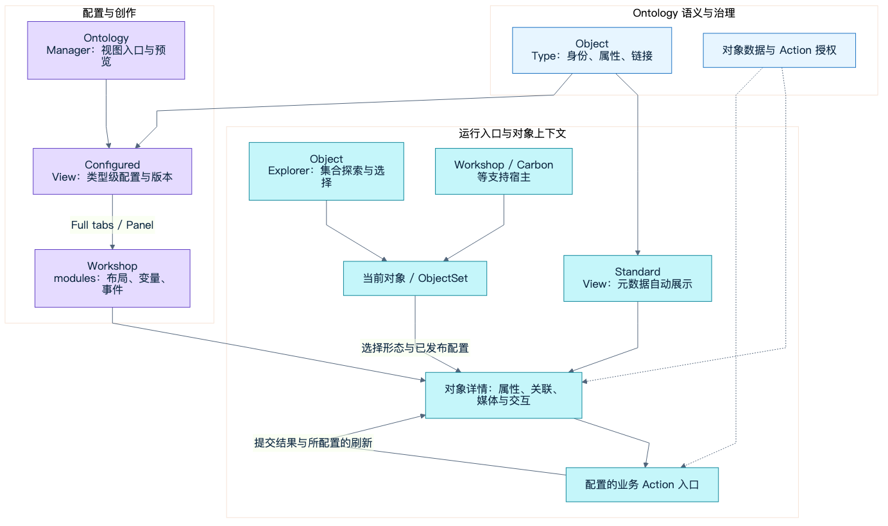
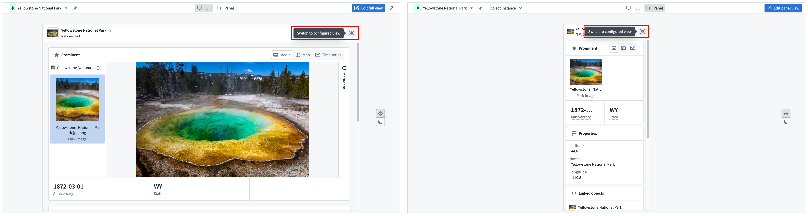
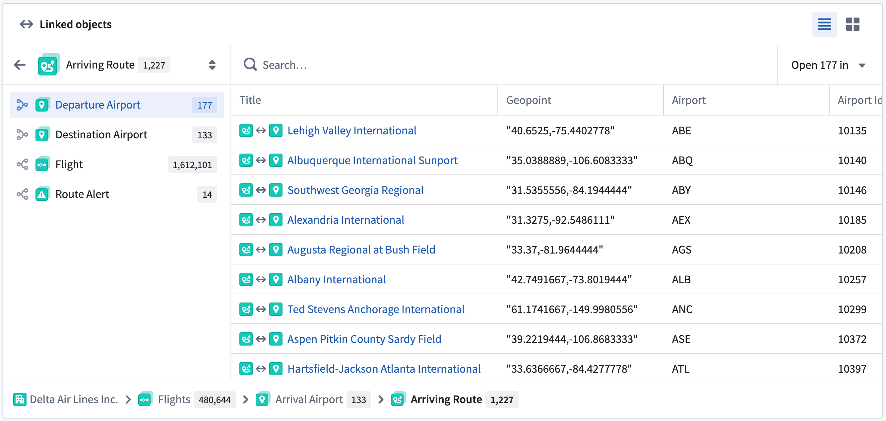
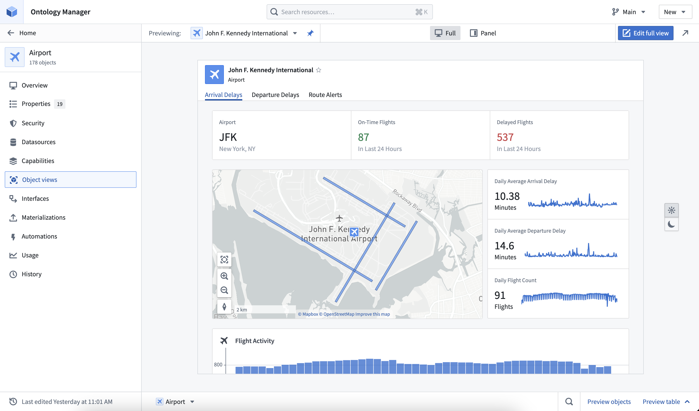
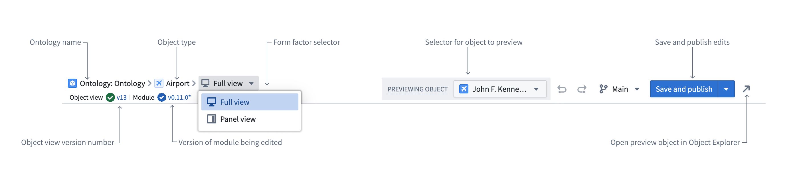
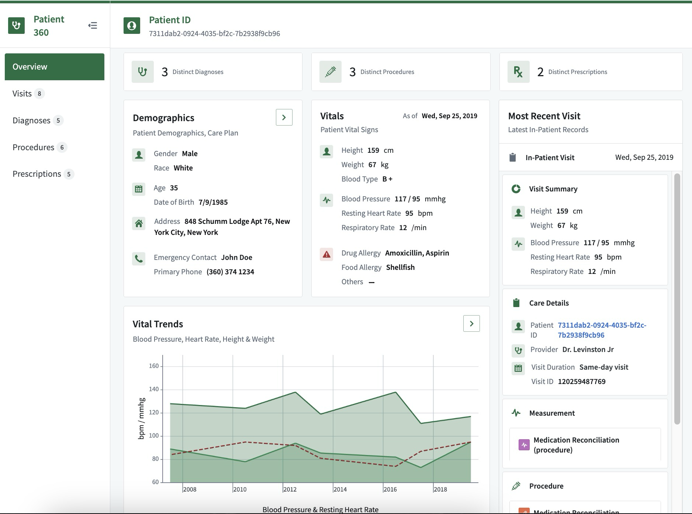
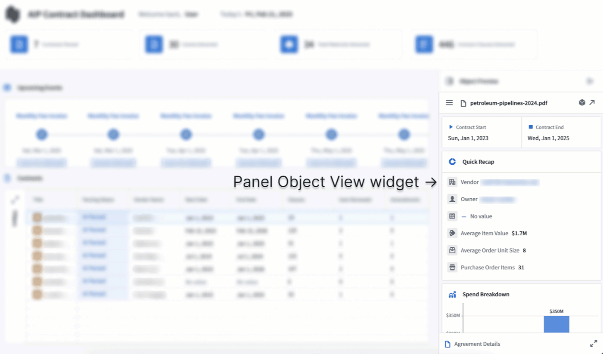
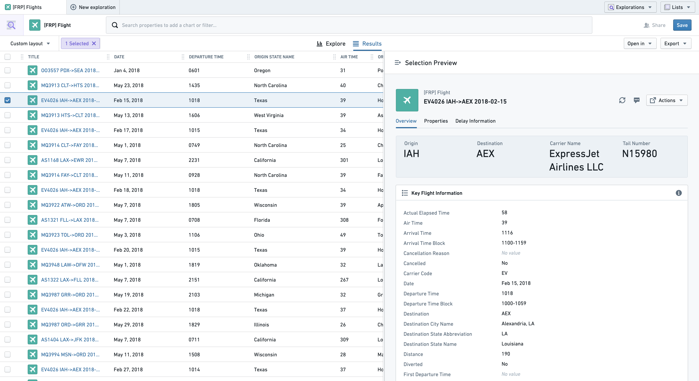
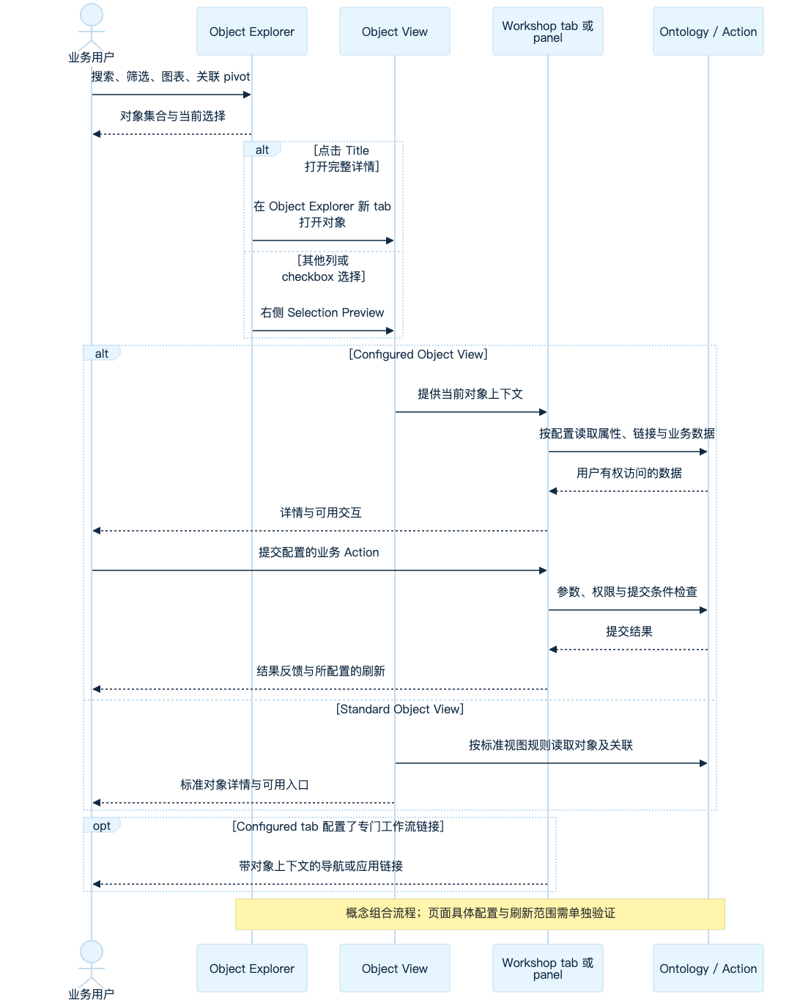
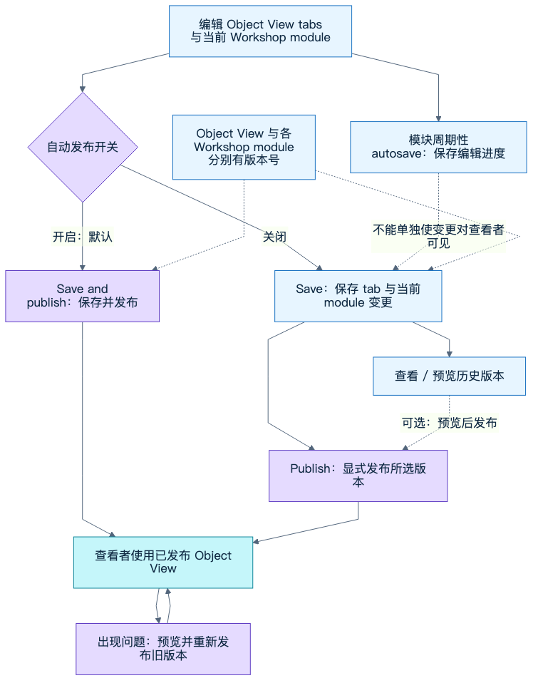

# Object Views：对象中心入口如何连接 Object Explorer 与 Workshop

> 深入中文研究，核验日期：2026-10-01。当前文档以当日公开英文页面为准，历史功能以带日期公告及作者原始评论为准；文档未披露统一产品 build，不能据此断言每个租户同日具有全部能力。
> 本篇仅使用公开 Palantir 资料，未登录 Foundry 租户、提交业务 Action 或发布真实配置，未读取 EOS 内部代码。所有 EOS 判断均标为架构分析。官方界面原图、公开网页观察与自绘概念图分别标注；视频实际读取程度见媒体附录。

## 结论与阅读目标

**Object Views 把业务对象变成可复用的应用入口。** 对象类型决定身份、属性、关联与治理；Object View 决定用户怎样看到这个对象及进入相关操作；Workshop 提供 configured 视图的布局、变量、组件和事件；Object Explorer 从对象集搜索、筛选、关联探索收敛到单个对象详情，也能直接对集合操作。这是多种应用围绕共同 Ontology 组织工作的产品关系。[Object Views](https://www.palantir.com/docs/foundry/object-views/overview/)、[Object Explorer](https://www.palantir.com/docs/foundry/object-explorer/overview/)、[Ontology-aware applications](https://www.palantir.com/docs/foundry/ontology/applications/)

当前机制最值得应用架构负责人关注的不是一个详情页编辑器，而是五组边界：

1. **Standard 保底与 Configured 业务定制并存。** Standard 根据对象类型元数据自动展示；Configured 用 Workshop 构建，创建后成为默认，仍可回到 Standard。“default”不是第三类视图，Legacy 也不是 Standard。[Overview](https://www.palantir.com/docs/foundry/object-views/overview/)
2. **Full、Panel、单对象与对象集是独立维度。** Full 综合详情与 Panel 宿主预览各有用途；当前 Panel 还有集合形态。输入 0/1/N 如何选择视图是明确产品行为，不能只用容器尺寸描述。[Panel configuration](https://www.palantir.com/docs/foundry/object-views/config-panel-views/)、[Workshop Object View widget](https://www.palantir.com/docs/foundry/workshop/widgets-object-view/)
3. **对象上下文与页面状态分开。** Object View widget 用 ObjectSet 决定当前对象；业务变量可通过 module interface 显式映射。另开应用的 URL 初始化、嵌入后的共享变量、routing 和 state saving 有不同范围。[Object View widget](https://www.palantir.com/docs/foundry/workshop/widgets-object-view/)、[Module interface](https://www.palantir.com/docs/foundry/workshop/module-interface/)
4. **配置版本、模块版本、保存与发布分开。** Object View 和各 Workshop module 分别有版本；模块周期性 autosave 不会单独让未发布视图对查看者生效。默认开启自动发布，但可关闭并显式发布、回退旧版本。[Object View versioning](https://www.palantir.com/docs/foundry/object-views/manage-versions/)
5. **发现入口、资源授权与业务执行分开。** 分享 Exploration、List、workspace 或详情链接不能代替底层对象及 Action 权限；父对象审批继承也不等于已经禁止子视图直接修改 main。[Save explorations](https://www.palantir.com/docs/foundry/object-explorer/save-explorations/)、[Branching object views](https://www.palantir.com/docs/foundry/object-views/branching-object-views/)

本篇增量是对象中心入口及其生命周期。已收录的 [Workshop Runtime](../workshop-runtime-2026-10/README.md)、[Custom Widgets](../custom-widgets-2026-10/README.md)、[OSDK React Components](../osdk-react-components-2026-09/README.md) 分别解释页面运行、宿主协议及公开 UI 库；它们不应被当作 Foundry 闭源 Object Views 的完整实现源码。本篇不转为组件生成或 EOS 实施计划。

| 阅读材料 | 解决的问题 |
|---|---|
| 本正文 | 对象入口、产品关系、跨应用主线与 EOS 架构取舍 |
| [配置与治理](notes/views-governance.md) | Standard/default/legacy、元数据、布局媒体、权限、分支、Marketplace与沿革 |
| [Explorer 流程](notes/explorer-flow.md) | 搜索、关联过滤/Pivot、详情/预览、集合Action、Exploration/List/Layout与URL |
| [Workshop与宿主边界](notes/workshop-boundaries.md) | 对象上下文、接口、routing、Actions、状态保存、Carbon及资料差异 |
| [媒体与实践证据](notes/media-evidence.md) | 官方截图/动图、作者教程、实际公开网页观察与社区演进 |
| [外部技术文章](notes/secondary-reading.md) | 技术博客的交叉阅读价值和不采用的概括 |
| [sources](sources.md)、[assets](assets.md)、[checks](checks.md) | 来源、时间、尺寸/hash、实际检查及未证实项 |

## 1. 总架构：共同对象模型，多个业务入口

*图 1｜依据公开产品文档自绘的概念关系；[Mermaid源](diagrams/01-object-entry.mmd)、[SVG](diagrams/01-object-entry.svg)。实线表示产品配置或消费关系，虚线表示授权约束；不是 Palantir 内部服务拓扑、数据注入协议或共享 React runtime。依据见本节引用与附录。*

对象类型是类型级配置锚点：发布 configured Object View 的修改会作用于该类型所有对象，而不是给每个对象拷贝一个页面。Ontology Manager 管理入口与预览，Workshop 构建实际内容，运行时由不同入口提供当前对象。用同一种创作工具不表示它们有相同资源身份、权限或发布边界。[Configured overview](https://www.palantir.com/docs/foundry/object-views/config-overview/)

| 产品/资源 | 主要职责 | 与 Object Views 的连接 | 需要保留的边界 |
|---|---|---|---|
| Ontology / Ontology Manager | 定义类型、属性、链接、Actions与治理；管理视图入口 | 从对象类型 Object views tab 预览和编辑 | schema资源可见、对象数据可读、Action可提交不是一个权限判断 |
| Standard Object View | 自动可用的对象详情及关联遍历 | Full和Panel；根据属性元数据展示 | 不需要手工Workshop配置，不是旧builder |
| Configured Object View | 面向业务的类型级详情配置 | Full tabs及Panel由Workshop modules构建 | 外层结构、各module和发布版本分别治理 |
| Object Explorer | 搜索和分析对象集 | Results/Explore进入详情；Selection Preview保留集合上下文 | Explorer layout、查询条件和静态成员不是详情配置 |
| 通用 Workshop | 面向任务的完整应用 | 能嵌入Object View；也能作为Object View内容创作工具 | 独立module资源和OV-managed module不是相同所有权 |
| Carbon | 策展应用、导航和参数化modules | 可分支打开对象详情、发现接受对象集的应用 | workspace访问不授权内容；探索入口已有2026-09 opt-in更新 |

依据：[Object permissioning](https://www.palantir.com/docs/foundry/object-permissioning/overview/)、[Configured views](https://www.palantir.com/docs/foundry/object-views/config-overview/)、[Explorer results](https://www.palantir.com/docs/foundry/object-explorer/view-results/)、[Object View widget](https://www.palantir.com/docs/foundry/workshop/widgets-object-view/)、[Carbon modules](https://www.palantir.com/docs/foundry/carbon/modules-overview/)。表中边界是基于这些公开契约的研究归纳。

## 2. Standard、Configured、Default 与 Legacy：先把代际讲清

*官方文档原图，展示Standard的两种形态；文件于核验日获取，但原图制作时间与租户build未披露。[来源](https://www.palantir.com/docs/foundry/object-views/overview/)。*

当前 overview 使用 **Standard / Configured** 两类。Standard 自动随对象类型配置展示；没有 configured 时默认展示 Standard，创建 configured 后其成为默认，但用户仍可切换回 Standard。2026-02-19 官方 GA 公告称自动视图为 **Core Object Views**，强调与 custom views 并存和 Full/Panel。公告词汇与当前文档高度对应，但没有找到正式改名日期；不能将这次 GA 写成整个 Object Views 产品的首次发布。[Overview](https://www.palantir.com/docs/foundry/object-views/overview/)、[February 2026](https://www.palantir.com/docs/foundry/announcements/2026-02/)

**“default”至少有四种不同用法：**用户初次打开的视图选择；配置页所谓自动生成的 default configured；Ontology Manager 固定的默认预览样本对象；Explorer 的个人/全局 layout 默认。再加 Legacy profile 的默认选择和 widget 的 initial tab，已经不能用一个“默认页面”字段解释所有行为。[Configured overview](https://www.palantir.com/docs/foundry/object-views/config-overview/)、[Explorer layouts](https://www.palantir.com/docs/foundry/object-explorer/explore-charts/)、[Profiles](https://www.palantir.com/docs/foundry/object-views/config-profiles/)、[Object View widget](https://www.palantir.com/docs/foundry/workshop/widgets-object-view/)

当前文档保留一处张力：配置概览既说创建 configured 才成为默认，又说每个类型自动创建 default configured Full/Panel，并随属性增改动态更新，编辑后变为用户管理。资料未解释 Standard rollout 后这套初始配置的物化和迁移条件。**本篇并列记录，不画 Standard→编辑→Configured 的唯一状态机，也不声称定制会让 Standard 停止同步。**[Default configurations](https://www.palantir.com/docs/foundry/object-views/config-overview/#default-configurations)

Legacy 是存量配置路径：旧 widget-based tabs 仍可支持和编辑，但不再新增；当前新 tab 用 Workshop。Managed Workshop tab 与已有 standalone module 也在 Legacy 配置文档中说明，因此“在 Legacy 导航下”不意味着每项规则全都已经失效。旧 tab 的 visibility/profile、跨 section filter-set、YAML、applications sidebar 应逐项标代际，不能整体套到现代编辑器。[Legacy configuration](https://www.palantir.com/docs/foundry/object-views/config-legacy-object-views/)、[Configure tabs](https://www.palantir.com/docs/foundry/object-views/config-tabs/)

| 日期 | 当时公开状态 | 与当前文档的关系 |
|---|---|---|
| 2024-04-02 | 新Object View tabs只用Workshop；旧builder仍支持但不再新增；新类型有单tab属性/关联默认内容 | 为default configured文案提供历史上下文，不能证明Standard推出后的迁移实现。[公告](https://www.palantir.com/docs/foundry/announcements/2024-04/) |
| 2026-01-29 | Object View可在Foundry Branching开发测试；当时审批未支持、变更自动批准 | 当前文档已有project approval policy，不能把当时自动批准作为当前统一规则。[公告](https://www.palantir.com/docs/foundry/announcements/2026-01/) |
| 2026-02-19 | Core Object Views GA，自动详情与custom并存，Full/Panel | 当前文档称Standard；未查到正式改名日期。[公告](https://www.palantir.com/docs/foundry/announcements/2026-02/) |
| 2026-09-21 | Carbon新增Insight/modern search，两个独立opt-in | 宿主探索入口因workspace配置不同，详见第10节。[公告](https://www.palantir.com/docs/foundry/announcements/2026-09/#explore-ontology-data-in-carbon-with-insight-analysis) |

## 3. 默认详情已经能展示属性、媒体与关联数据

*图 2｜官方 Standard 文档界面原图，本地原字节保存。可观察按关联类型组织的数据和预览入口；不是本次租户测试。[来源](https://www.palantir.com/docs/foundry/object-views/standard-object-views/)。*

Standard 根据 **visibility与base type** 展示：prominent 置于上部，normal 用表格，hidden 不显示；显著 media reference 用媒体查看器，time series用交互图表，地理类型和符合条件的经纬度时序用Map，其他显著属性用更大的卡片。Linked objects 按link type分组，可原位预览属性、打开部分关联对象继续探索，或在侧栏预览选中对象；Panel也可使用这些能力。[Standard Object Views](https://www.palantir.com/docs/foundry/object-views/standard-object-views/)

这套自动展示与 **render hints** 不是同一层。title key、visibility、formatting、type classes、render hints都属于属性元数据，但Standard自动媒体行为有明确base-type依据。Render hints文档中多处索引性能描述限OSv1/Phonograph，不能据此推断OSv2索引实现；hidden也不能作为数据安全策略的证据。[Property metadata](https://www.palantir.com/docs/foundry/object-link-types/property-metadata/)、[Render hints](https://www.palantir.com/docs/foundry/object-link-types/metadata-render-hints/)

**EOS架构分析：**元数据驱动的保底详情可让新类型立刻有入口，业务团队再维护自己的精选视图。把schema展示规则与业务页面所有权分开，能明确回答属性增加、重命名后谁自动更新、谁负责人工迁移；这比把全部默认配置复制成不可追踪的页面更容易讨论治理。

## 4. 配置路径：Ontology Manager 管理，Workshop 构建

*图 3｜官方配置概览界面原图。显示对象类型的视图预览与编辑入口；预览样本对象和默认视图选择是不同概念。[来源](https://www.palantir.com/docs/foundry/object-views/config-overview/)。*

官方配置路径是：在 Ontology Manager 打开对象类型的 **Object views** tab，选择并固定样本对象、预览 Full/Panel 和 light/dark，再用 Edit 进入 Object View editor；Object Explorer 的 More→Advanced→Edit object view 以及有权限的Panel ellipsis→Edit也提供入口。[Configured overview](https://www.palantir.com/docs/foundry/object-views/config-overview/)

*图 4｜官方标注界面图，可见Object View与当前Workshop module两个版本/编辑层；标注为官方原图内容。[来源](https://www.palantir.com/docs/foundry/object-views/config-object-views/)。*

Full每个tab有自己的Workshop module。外层可新增、重排、改名、删除tabs，内容按普通Workshop布局/变量/Scenarios构建；在当前OV-managed编辑路径中，删除tab会删除其托管module，不据此推断移除复用tab会删除共享standalone资源。只有一个tab时，浏览态隐藏tab标题。兼容配置还能按对象属性、关联目标类型权限和profile控制tab可见、显示关联数量badge，须保留其Legacy文档来源。[Full configuration](https://www.palantir.com/docs/foundry/object-views/config-object-views/)、[Tab settings](https://www.palantir.com/docs/foundry/object-views/config-tabs/)

Panel分 **Object instance** 与同类型 **Object set**。初始instance展示prominent Property List；初始set有Charts和List，前者最多五个XY charts，后者每对象最多三个属性。编辑器的宿主尺寸预设是近似预览，实际尺寸随宿主和设备变化。[Panel configuration](https://www.palantir.com/docs/foundry/object-views/config-panel-views/)

*图 5｜官方文档的Patient配置示例。说明一页可组合核心资料、关联记录与历史分析；不是在EOS实现的页面，也不证明所有医疗数据对所有用户可见。[来源](https://www.palantir.com/docs/foundry/object-views/overview/)。*

Configured中的媒体应按具体Workshop组件契约选择。Media Preview接受URL、attachment或media reference，可展示图像、音频、视频和文档；属性输入需单对象ObjectSet，外部URL受CSP约束，PDF内嵌附件不支持。专用PDF/视频/音频widgets另有增强功能。能组合这些组件，不表示所有对象视图自动拥有全部播放器行为。[Media Preview](https://www.palantir.com/docs/foundry/workshop/widgets-media-preview/)

## 5. Workshop 与 Object View 的两个组合方向

*官方GIF第31帧，偏移1.660秒；背景模糊与箭头标注来自原文件。本图只展示宿主页面与详情Panel的空间关系。[原GIF](assets/media-panel-in-workshop.gif)、[来源](https://www.palantir.com/docs/foundry/object-views/use-panel-views-in-platform/)。*

“用Workshop构建Object View”与“在Workshop应用中消费Object View”是两条关系。前者按类型治理详情配置，后者由任务应用用Object View widget显示已配置内容，还可选择形态、header、空状态和接口映射。[Configured overview](https://www.palantir.com/docs/foundry/object-views/config-overview/)、[Object View widget](https://www.palantir.com/docs/foundry/workshop/widgets-object-view/)

| 消费模式 | 当前widget文档的输入行为 | 架构含义（分析） |
|---|---|---|
| Full | ObjectSet多对象只显示第一个；可配置initial tab、换对象回初始tab、隐藏tabs | 输入类型为集合不意味着可以同时显示多对象完整详情 |
| Panel / Object instance | 总显示首个对象 | 选中集合与当前详情对象应明确区分 |
| Panel / Adaptive | 恰好一个对象显示instance；零或多个显示set | 空选择与多选也有产品语义，不能仅靠“空白占位”解释 |
| Panel / Object set | 总显示集合形态 | 集合概览不等于Explorer的完整查询、Pivot和探索状态 |

依据：[Form-factor configuration](https://www.palantir.com/docs/foundry/workshop/widgets-object-view/#form-factor-configuration-options)。外部Map/Gaia/Vertex等应用还可从panel标题打开可移动/缩放的full modal；不是只有“详情必须跳出当前页面”一种入口。[Use Full](https://www.palantir.com/docs/foundry/object-views/use-full-views-in-platform/)、[Use Panel](https://www.palantir.com/docs/foundry/object-views/use-panel-views-in-platform/)

**Workshop切换能力的资料差异必须保留。** 当前widget页写Object View Mode可选standard/configured并可提供toggle；config-overview却仍写Workshop尚不支持toggle。本文以专门widget文档描述配置入口，仍将实际可用范围列为租户验证问题。[Widget options](https://www.palantir.com/docs/foundry/workshop/widgets-object-view/)、[Overview的限制](https://www.palantir.com/docs/foundry/object-views/config-overview/)

Managed tab的模块随对象类型管理权限且不能跨Object Views独立重用；已有standalone模块可嵌入多个视图，但要独立核对资源权限与发布。转换managed→standalone是Legacy配置的手动选项，不能把对象类型同权规则自动延伸到一切嵌入资源。[Configure tabs](https://www.palantir.com/docs/foundry/object-views/config-tabs/)、[Configured permissions](https://www.palantir.com/docs/foundry/object-views/config-overview/#permissions)

## 6. 对象上下文、接口映射与导航/routing

Configured tab消费当前对象上下文；公开消费契约直接明确的是Object View widget使用ObjectSet输入决定对象，并能为某类型的full tab或panel映射额外module interface，Legacy tabs不支持该接口。managed module内部注入所用变量ID及协议未得到一手资料，本文不将其画成已知API。**module interface是页面变量接口，Ontology interface是对象类型多态模型，二者不是同一概念。**[Tab types](https://www.palantir.com/docs/foundry/object-views/config-tabs/)、[Object View widget](https://www.palantir.com/docs/foundry/workshop/widgets-object-view/)、[Module interface](https://www.palantir.com/docs/foundry/workshop/module-interface/)

对已映射接口，父变量定义成为来源，子变量的默认值/变换不继续作为该映射值的定义。普通子变量不会因为嵌入就自动与父共享；总览与专门嵌入widget文档对child更新回传措辞有差异，需区分mapped值、widget output、set event和未映射本地值，不宣称已经验证所有更新都双向传播。通用嵌入也不直接传递event configuration。[Embedded modules](https://www.palantir.com/docs/foundry/workshop/embedded-modules/)、[Embedding overview](https://www.palantir.com/docs/foundry/workshop/embedding-workshop-modules-overview/)

| 机制 | 公开契约 | 不应推断 |
|---|---|---|
| 打开Object View | 对象类型+主键或对象RID的URL；有Explorer包装和直接对象形式 | 完整tab/表单/父列表状态均写入链接 |
| Open Workshop module | 调用时interface值进入URL，首次加载初始化 | 运行中改URL自动更新全部变量 |
| 嵌入interface | 显式映射共享值；Object View可为特定tab/panel映射 | 任意child本地变量和事件自动共享 |
| Workshop routing | 当前页ID及按规则写入的interface变量；嵌入模块不继承routing | URL直接承载任意ObjectSet filter或整个会话 |
| State saving | 显式保存启用的变量及可选当前页；可手动、用链接或默认已保存状态加载 | 任意变量自动持久化、未配置字段或Action事务草稿、业务数据快照 |

依据：[Object View URLs](https://www.palantir.com/docs/foundry/object-views/generate-urls/)、[Module interface](https://www.palantir.com/docs/foundry/workshop/module-interface/)、[Routing](https://www.palantir.com/docs/foundry/workshop/routing/)、[State saving](https://www.palantir.com/docs/foundry/workshop/state-saving/)。ObjectSet在routing中的直接URL仅支持RID指定的单对象，可用其他变量间接构造过滤；state saving支持范围更宽。`embedded=true`隐藏Workspace sidebar，只是展示设置，文档没有说它建立变量桥接或改变权限。

## 7. Explorer → 详情 → Action：完整的跨应用主线

*图 6｜官方Results界面原图，保留结果集合与右侧预览的视觉证据。静态图不能证明返回、刷新或选择状态的运行行为。[来源](https://www.palantir.com/docs/foundry/object-explorer/view-results/)。*

*图 7｜自绘概念序列；[Mermaid源](diagrams/02-explore-detail-act.mmd)、[SVG](diagrams/02-explore-detail-act.svg)。配置型分支使用Workshop内容，标准视图单列；Action成功后只写“所配置的刷新”，不表示父列表、关联统计和全部组件已经同步完成。*

用户先从首页发现类型/对象，进入探索、属性及关联过滤，再用图表聚合和下钻。**关联过滤保持主类型，Pivot沿link切换主类型**：筛选“客户满足条件的订单”与探索“这些订单关联的客户”不是同一操作。Results的Title列在新Object Explorer tab打开该对象Object View；其他列或checkbox在右侧打开Selection Preview。多选预览可选前20个对象；这是预览范围，不是集合总规模。[Getting started](https://www.palantir.com/docs/foundry/object-explorer/getting-started/)、[Filter results](https://www.palantir.com/docs/foundry/object-explorer/filter-results/)、[Pivot](https://www.palantir.com/docs/foundry/object-explorer/pivot-linked/)、[View results](https://www.palantir.com/docs/foundry/object-explorer/view-results/)

Explorer提供Actions / Open In / Export。选Action会带入手工选择的对象，未选择时带入当前全部对象；超过1,000个选择对象不可用，无法确定应预填哪个参数时由用户填写。这里的上限是Explorer UI规则，不是全部Action API的统一上限。适用Action按对象类型和单对象/对象引用列表参数发现，入口隐藏type class也只是发现配置。[Apply Actions](https://www.palantir.com/docs/foundry/object-explorer/apply-actions/)、[Use actions](https://www.palantir.com/docs/foundry/action-types/use-actions/)、[Explorer configuration](https://www.palantir.com/docs/foundry/object-explorer/configure/)

Configured详情中可通过Button Group或Inline Action组合操作，使用当前对象/相关变量作为参数，成功后配置刷新、导航或新对象输出。可查看详情不代表可提交Action，成功也不等于全UI已更新。事件顺序不等待所有下游变量完成，嵌入模块的auto-refresh/settings不能直接按独立应用假定。[Workshop Actions](https://www.palantir.com/docs/foundry/workshop/actions-use/)、[Inline Action](https://www.palantir.com/docs/foundry/workshop/widgets-inline-action-form/)、[Events](https://www.palantir.com/docs/foundry/workshop/concepts-events/)、[Auto-refresh](https://www.palantir.com/docs/foundry/workshop/auto-refresh/)

**EOS架构分析：**一条可评估的对象中心路径应回答：从哪个集合选中哪个实体；详情中能读哪些关联信息；Action到底作用于选中名单还是完整条件集合；操作后如何定位新对象和继续任务。它不要求将Explorer、详情和任务应用合并为同一种页面。

## 8. “保存视图”至少包含六种状态

| 保存内容 | Palantir的公开机制 | 数据变化后意味着什么 |
|---|---|---|
| 查询意图 | Saved Exploration：搜索、filters、layout | 按相同条件得到最新结果 |
| 静态成员 | Saved List：全部或勾选对象名单 | 名单不会自动随条件增减；不等于冻结对象属性 |
| 分析呈现 | Explorer Layout：charts、columns、sorting、初始perspective | 个人默认优先全局默认，不是详情默认 |
| 详情配置 | Object View版本及各module版本 | 由发布决定用户看到的结构和内容 |
| 浏览运行值 | Workshop state saving：启用变量、可选page | 显式保存；支持手动、链接及默认已保存状态加载；external ID变更影响恢复 |
| 可分享初始化 | URL/routing | 仅支持规定的对象/变量状态，不是完整会话 |

依据：[Save explorations](https://www.palantir.com/docs/foundry/object-explorer/save-explorations/)、[Save lists](https://www.palantir.com/docs/foundry/object-explorer/save-lists/)、[Layouts](https://www.palantir.com/docs/foundry/object-explorer/explore-charts/)、[OV versioning](https://www.palantir.com/docs/foundry/object-views/manage-versions/)、[State saving](https://www.palantir.com/docs/foundry/workshop/state-saving/)、[Routing](https://www.palantir.com/docs/foundry/workshop/routing/)。

State saving的“保存”与“加载”需分别理解：启用变量不会自动捕获每次偏好变化；用户显式保存后，可以手动或用链接恢复，也可设模块默认已保存状态，在URL没有指定状态时自动应用。原生Text input、Date input等组件的未完成表单值是官方支持用例；这不等于任意未配置字段、Action事务草稿或业务数据快照都被保存。[Default saved state](https://www.palantir.com/docs/foundry/workshop/state-saving/#setting-a-default-saved-state)

两处额外限制会影响长期入口设计：Temporary ObjectSet API当前Preview，一小时过期，不能当永久保存链接；Explorer复杂search JSON文档明确示例可能过时，并建议在实际Explorer取得当前格式。Dynamic Object Set Action专门机制仍在开发、可无自动迁移弃用；不能将它推广为所有应用的稳定集合持久化能力。[Temporary ObjectSet](https://www.palantir.com/docs/foundry/api/v2/ontologies-v2-resources/ontology-object-sets/create-temporary-object-set/)、[Explorer URLs](https://www.palantir.com/docs/foundry/object-explorer/generate-urls/)、[Dynamic set Action](https://www.palantir.com/docs/foundry/object-explorer/configure/)

## 9. 发布与治理：类型级入口的变更会扩大影响范围

*图 8｜按官方versioning文档自绘；[Mermaid源](diagrams/03-save-publish.mmd)、[SVG](diagrams/03-save-publish.svg)。图描述用户可观察的操作，未宣称掌握服务端原子发布、并发锁或离线恢复协议。*

Object View保存生成新版本，tabs结构和各Workshop module分别有版本号。自动发布默认开启，按钮为Save and publish；关闭后Save和Publish分离，协调tabs与**当前module**变化。模块会周期性autosave，但Object View发布前这些变化不向查看者生效；历史可预览、重新发布，含日期/作者/描述和发布标记。官方建议多人协作或大量用户使用时关闭自动发布。[Manage versions](https://www.palantir.com/docs/foundry/object-views/manage-versions/)

这里补充了已有Workshop Runtime主题中未明确获得的autosave证据，适用范围首先是OV编辑器内的module；没有进一步证明保存周期、全部未打开tab草稿的一次性提交、CAS或当前浏览会话刷新策略。

分支把OV-managed module内容与Full tabs结构分为不同资源；模块用Workshop rebase，tabs结构有单独三列冲突处理。Legacy tabs不能在branch编辑。Project-based权限、Ontology roles及legacy datasource-derived有不同编辑/merge规则；后者main编辑需Object View Admin加任意输入datasource的Editor；branch merge的贡献者或批准者需对象类型View、所有backing datasources的Editor与Object View Admin。严格程度差异是数据源的“任意”与“所有”，不能漏掉应用权限。[Branching](https://www.palantir.com/docs/foundry/object-views/branching-object-views/)、[Permissions](https://www.palantir.com/docs/foundry/object-views/config-overview/#permissions)

**审批继承与禁止主线修改分别看。** 父类型protected且有project approval policy时，政策约束logical children；同页又明确Inherited resource protection仍under development，在其生效前OV及tabs/panels modules仍可直接编辑main。Marketplace只明确支持Workshop builder的tabs，旧builder须重建；未据此推断panels、所有standalone依赖与安装后定制冲突的自动升级保证。[Branching](https://www.palantir.com/docs/foundry/object-views/branching-object-views/)、[Marketplace](https://www.palantir.com/docs/foundry/object-views/marketplace-object-views/)

## 10. Carbon 与shell：有证据的宿主关系及最新变化

Carbon把应用作为参数化module开到workspace tabs。官方导航示例允许从Explorer列表分支打开多个Object View tabs并保留原列表状态；Object View输入/输出是单对象，Explorer输入集合、输出当前选择。Workshop的Open应用事件在普通环境打开浏览器tab，在Carbon打开Carbon tab。这证明了宿主导航和上下文关系，没有证明共享React树、同一前端runtime或内部路由服务。[Carbon navigation](https://www.palantir.com/docs/foundry/carbon/modules-navigation/)、[Modules](https://www.palantir.com/docs/foundry/carbon/modules-overview/)、[Workshop events](https://www.palantir.com/docs/foundry/workshop/concepts-events/)

Discoverable modules把接受ObjectSet接口的Workshop应用加入Open In发现：ObjectSet接口需要external ID，可选类型约束限定发现范围；无类型约束会在所有类型上发现。Carbon内限制在当前workspace清单，外部汇总用户可访问的promoted workspaces。可发现与可打开的资源授权仍需分别满足。[Module discovery](https://www.palantir.com/docs/foundry/carbon/modules-discovery/)、[Carbon permissions](https://www.palantir.com/docs/foundry/carbon/permissions-configure/)

**2026-09-21的更新改变了探索入口基线。** Carbon新增Insight analyses和modern object search，workspace owner用两个独立开关opt-in；启用Insight后，类型/集合/已保存探索的OE-style探索由Insight替代。已有workspace继续opt-in，新workspace将来默认是计划。当前导航文档的OE示例仍有参考价值，但不能称为全部workspace的唯一当前入口。[September 2026 announcement](https://www.palantir.com/docs/foundry/announcements/2026-09/#explore-ontology-data-in-carbon-with-insight-analysis)

**EOS架构分析：**shell可以负责策展入口、发现、tabs与返回上下文，对象视图负责类型级详情，任务应用负责流程编排。共同对象身份有利于组合，却不要求shell承担所有页面状态或共享一套内部实现。应通过宿主可观察契约讨论借鉴，避免仅因产品外观相似便推断技术同构。

## 11. 多源核对与历史资料的使用方式

官方当前文档回答支持契约，带日期公告回答发布沿革；社区评论回答真实使用中遇到的边界，作者教程回答历史操作路径。它们的证据强度不同，不能互相替代。

例如2025年的Object Set View社区讨论先谈入口限制，2025-11-19自称Object View Team成员的jen回复新增Object Set Panels和三种模式；当前结论应由官方panel/widget页面复核，不能继续把早期缺口写成当前限制。公开作者教程Ontologize的Object Explorer视频能提供学习路径，官方培训目录收录也不会改变其作者归属。本次无法播放的内容不声称看过或取帧。[原始讨论](https://community.palantir.com/t/object-view-for-sets-of-objects/3749)、[作者视频](https://www.youtube.com/watch?v=YuT96FVeDuc)、[媒体附录](notes/media-evidence.md)

技术博客提供跨产品框架而非配置保证；本篇读取了DevRev工程师的公开比较文章，保留其AI辅助/翻译标注，并将与对象入口有关的观点回溯官方来源。无法读取正文的博客只记访问限制。[原文](https://zenn.dev/knowledge_graph/articles/palantir-ontology-vs-devrev)、[交叉阅读附录](notes/secondary-reading.md)

公开示例与源码也需要边界：OSDK公开客户端、UI组件、Widget adapter证明的是外部应用消费Ontology与宿主契约；没有找到公开完整Object Views/Explorer前端实现。当前对象如何注入内部状态、tab生命周期、查询调度和shell桥接不能靠类名或历史`hubble`URL补造。相关第一方代码定位沿用[OSDK源码专题](../osdk-typescript-2026-09/repository-map.md)与[Custom Widget协议专题](../custom-widgets-2026-10/protocol-api.md)，不重复宣称本篇运行了其中探针。

本次额外抽查官方`osdk-ts`的固定提交`fb8ec172`中To Do公开教学示例：`Home.tsx`把所选project传给任务列表和操作入口，但页面明确声明使用in-memory mock，留给学员改成OSDK。`TaskListItem.tsx`调用传入的删除callback并控制loading状态，没有证明已调用Ontology Action。**官方仓库中的示例也必须逐文件看实现，不能把教学页面当作Object View运行时或真实写回验收。**本篇只把它用于说明“实体上下文组合”与“受治理平台入口”之间的证据边界，未运行该示例。[Home源码](https://github.com/palantir/osdk-ts/blob/fb8ec172d540ef7819382ff036aa2a692614af75/examples/example-tutorial-todo-app-sdk-2.x/src/Home.tsx)、[TaskListItem源码](https://github.com/palantir/osdk-ts/blob/fb8ec172d540ef7819382ff036aa2a692614af75/examples/example-tutorial-todo-app-sdk-2.x/src/TaskListItem.tsx)

## 12. 面向EOS的架构决策价值与验证建议（分析）

以下判断只来自公开机制，不描述EOS当前代码，不是实施排期，也不默认采用AI生成组件。

| 架构决策 | 可借鉴的机制 | 代价与应作出的明确选择 |
|---|---|---|
| 是否统一对象入口 | 类型级视图注册、稳定对象身份、元数据默认详情 | 保底视图与业务定制分别承担schema变化；跨入口要重新鉴权 |
| 详情与任务页如何分工 | Full综合详情、Panel保留宿主任务、集合Panel聚合 | 定义0/1/N与同类型限制；重交互任务仍可用独立应用 |
| 如何复用页面 | Managed与standalone所有权分开，显式module interface | 同权便利与跨应用复用灵活性有不同治理成本 |
| 如何传递上下文 | 对象身份、集合意图、业务接口、导航初始化分开 | 链接大小、过期、隐私、迁移和返回状态需要各自契约 |
| 如何保存工作 | 查询、名单、layout、配置版本、运行值分别保存 | 不用“保存视图”含混承诺数据快照、未配置字段或Action事务草稿 |
| 如何发布生产详情 | 编辑进度、保存版本、发布选择与回退分离 | 类型级变更影响全部对象；多人编辑须核实并发/草稿与主线门禁 |
| shell承担什么 | 策展/发现、tab导航、对象上下文与返回列表 | 避免把workspace访问当资源授权、把外观组合当内部runtime统一 |

建议用一组**验证问题与证据要求**支持架构评审，而非从文档直接批准方案：

| 场景 | 需要观察的证据 | 可解决的决策问题 |
|---|---|---|
| 新类型、历史类型、已定制类型增加/改名属性 | Standard与configured各自变化；编辑后所有权；默认选择 | 自动配置与用户接管的真实生命周期 |
| 从Explorer、关联对象、Action回执、直接URL打开同一对象 | 对象身份、默认视图、可见字段和目标权限结果 | 对象入口是否一致 |
| Full与各Panel模式输入0/1/N | 当前对象、集合概览、空状态、换对象initial tab | 基数语义和宿主配置是否可预测 |
| 父列表选择与详情交互 | mapped接口、普通本地值、widget output/set/reset的传播 | 接口是否支持所需业务联动 |
| 离开/返回、浏览器刷新、分享链接、保存状态重载 | 查询、选择、scroll/tab、URL初值与external ID迁移 | 哪些状态需保持、哪些重新求值 |
| 有对象权限但无关联/Action/module权限 | 入口发现、内容退化、直接链接、提交拒绝 | UI筛选与真实授权边界 |
| Action修改当前对象/关联对象 | 提交成功、详情/父集合/统计更新与用户输入变化 | 刷新范围和完成信号 |
| 多tab编辑、autosave、关闭自动发布、回退旧版 | 两层版本、查看者所见、未打开tab草稿是否纳入 | 发布的实际一致性范围 |
| 父类型protected与审批策略组合 | branch proposal/rebase与直接main修改结果 | 审批是否成为强制生产门禁 |
| Legacy迁移、standalone复用、Marketplace交付 | visibility/profile/filter/sidebar和资源权限等价性 | 保留兼容还是重建、发布依赖如何治理 |

这些实验需要获授权租户及适当测试数据；本篇交付到公开研究结论和验证问题，不将未执行实验写成通过。

## 未决问题与交付边界

最主要未决项是default configured与Standard的兼容生命周期；Workshop toggle和child变量更新的文档差异；跨tab对象切换和状态持久化；OV发布全部草稿的事务/并发协议；各宿主Action后的完整刷新；父类型resource protection在具体租户的实际上线状态。Core→Standard的改名日期、Legacy自动迁移保证、Insight启用后旧链接兼容也未获得明确证据。

主文及附录保留就近来源，媒体记录真实出处、获取时间、尺寸和SHA-256。概念图已渲染并视觉检查，证明图像可读，不证明产品运行。完整来源、资产和检查范围见 [sources](sources.md)、[assets](assets.md)、[checks](checks.md)。
