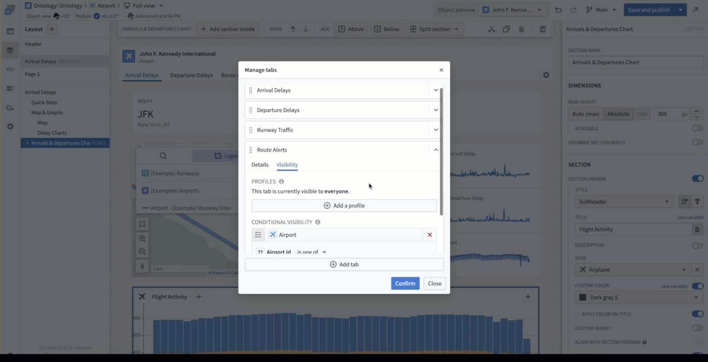
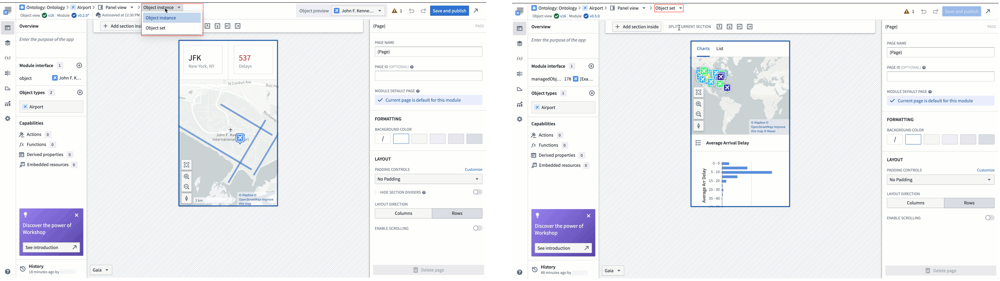
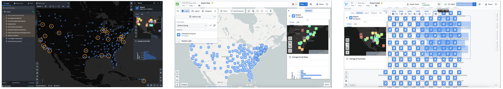
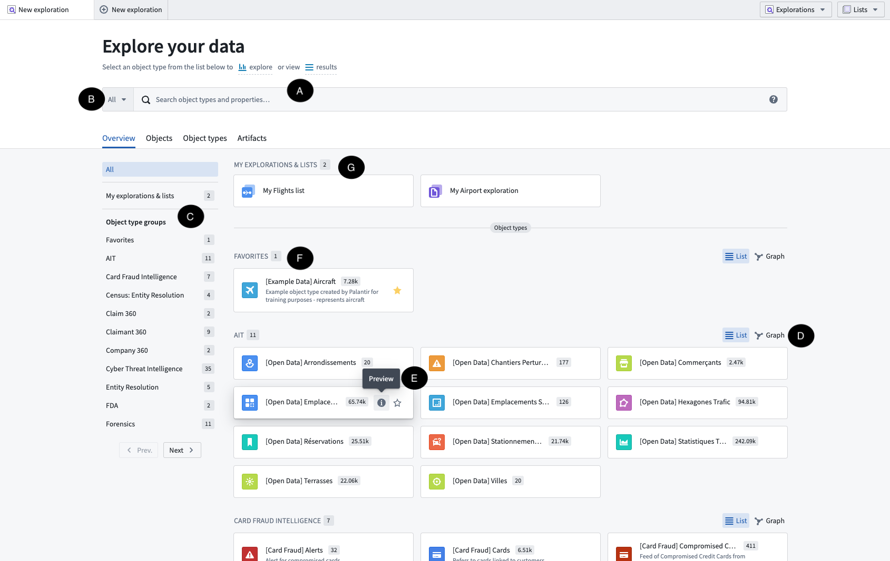

# Object Views：真实界面、公开演示与社区旁证

检索与获取日期：**2026-10-01 UTC**。本地核验通过的媒体包括 **11 个官方原始图像文件（9 个 PNG、2 个 GIF）及 2 张注明帧号与偏移时间的 GIF 派生静图**。本附录使用公开 Palantir 官方文档中的界面原图与动图；它们是厂商提供的产品示例，**不是本研究登录 Foundry 租户后取得的截图**。文件原始 URL、来源页、获取 UTC、字节、尺寸、SHA-256、格式及帧数见 [media-manifest.json](media-manifest.json)。多源目录及逐来源限制见 [media-sources.json](media-sources.json)。原文件字节未经修改；派生静图仅解码对应 GIF 帧，未增补 UI。文档原图自带的标注保留。未使用 mock 或 AI 生成界面。

## 1. 优先阅读的界面证据

### M01：Standard full/panel 保留同一对象的基本信息与媒体

官方图把同一示例对象放在 full 与 panel 两种形态中，full 区域以较大图像呈现媒体，panel 区域用紧凑缩略图和属性列表；两个画面都能看到切换 configured view 的入口。红框是官方原图的标注。它支持「对象身份及基本内容可跨 form factor 保持，宿主可选择适合空间的呈现」这一观察。图片不能证明动态切换的执行时序、移动端适配质量或所有宿主都有相同开关；当前 Workshop 的 standard/configured toggle 在概览与专门widget文档中有措辞差异，见[宿主边界附录](workshop-boundaries.md#7-两项资料冲突与待验证范围)。来源：[Object Views overview](https://www.palantir.com/docs/foundry/object-views/overview)。

### M02：Configured full 是对象级业务工作面

患者示例有 Overview、Visits、Diagnoses、Procedures、Prescriptions 页签，详情区域组合人口信息、生命体征、趋势图和最近就诊等内容。它提供了「对象详情可把基础属性、关联实体和分析视图放在同一入口」的真实产品例图，但不是医疗流程有效性的验证，也不能凭图推断这些内容全部由固定 Object View widget 自动生成。内容由配置的 Workshop 模块承载这一规则需要结合官方配置文档。来源：[Object Views overview](https://www.palantir.com/docs/foundry/object-views/overview)。

### M03：Standard linked objects 也能承接关联数据探索

图中左侧显示 Departure Airport、Destination Airport、Flight、Route Alert 等关系类别及数量，主体为关联对象结果表，右上有 Open in，底部有探索路径。它是对象关联数据进入对象集探索的界面旁证。单张图不证明链接遍历的完整查询计划、结果实时性或用户获得了所有关联对象的读取权限。来源：[Standard Object Views](https://www.palantir.com/docs/foundry/object-views/standard-object-views/)。

### M04：Ontology Manager 配置的是对象类型的可复用视图

图中在 Airport 类型的 Object views 页面预览 John F. Kennedy International 对象，顶部提供 Full / Panel 与 Edit full view。实际对象只是预览上下文，配置入口位于对象类型管理面。这支持「配置注册与预览样本分别表达」的架构观察；不能把图中某个机场视图当作每个对象各自拥有一份复制的页面配置，也不能从图中推断发布覆盖范围或权限继承规则。来源：[Configured Object View overview](https://www.palantir.com/docs/foundry/object-views/config-overview)。

### M05：Object View 配置版本与当前 Workshop 模块版本分开显示

官方标注图显示 Ontology / object type / form factor breadcrumb、Object View version number、Version of module being edited、预览对象、Save and publish、Open preview object in Object Explorer 等独立位置。它准确支持两层版本在编辑器中的区别。**图中版本值是示例，不是 2026-10-01 的软件版本基线**；发布指针、自动发布开关及跨页签一致性应引用 manage-versions 文字规则，不能只根据按钮推断。来源：[Configured full Object View](https://www.palantir.com/docs/foundry/object-views/config-object-views/)。

### M06–M07：外层页签与 panel 上下文都有独立配置

M06 原始文件是 [Manage tabs 官方动图](../assets/media-manage-tabs.gif)，共 479 帧。检查第 0、119、239、359、478 帧，可观察到添加、重排页签以及 visibility 设置；证据包静帧M06-S（media-manage-tabs-frame359.png）为第359帧，距GIF起点 **20.530秒**，未经UI增补。它展示外层Object View tabs的管理面与内层Workshop编辑器并存。不能凭操作示例断言删除页签之后的恢复机制，或visibility规则等同数据授权。来源：[Configured full Object View](https://www.palantir.com/docs/foundry/object-views/config-object-views/)。

M07 以两幅官方截图对照 object instance 与 object set 的编辑画布：前者呈现单一机场属性和地图，后者呈现集合地图及聚合图表。它能支持「同一对象类型的 panel 配置还要区分单对象与对象集输入」的观察。它不是 live tenant 的自适应行为测试，adaptive 模式的实际选择规则仍应引用当前 Object View widget 文档。来源：[Configured panel Object View](https://www.palantir.com/docs/foundry/object-views/config-panel-views)。

### M09：Object set panel 可以在三个平台宿主显示聚合上下文

原图把Gaia、Maps、Vertex的示例截图组合在一起，地图或图选择与侧边对象集信息并列，Vertex示例的信息位于左侧。它证明官方公开展示了多个宿主中的对象集panel场景。图像很宽，建议打开原文件放大阅读。它不能证明所有宿主采用同一DOM、同一状态机，或对象集panel直接替代Explorer完整探索功能。来源：[Use panel Object Views](https://www.palantir.com/docs/foundry/object-views/use-panel-views-in-platform)。

### M10：通用 Workshop 页面以 Object View widget 复用 panel

M10原始文件是 [Workshop panel官方动图](../assets/media-panel-in-workshop.gif)，共62帧。检查第0、15、31、46、61帧，能看到AIP Contract Dashboard的表格与右侧Object Preview；证据包静帧M10-S（media-panel-in-workshop-frame31.png）为第31帧，距GIF起点 **1.660秒**。背景模糊及`Panel Object View widget`箭头文字都来自官方GIF，本研究未添加。它清楚展示通用应用页面与嵌入对象详情的空间关系。图片不能证明每次选中表格行都会以何种速度更新、是否保留上次状态或Action成功后如何刷新；这些必须结合widget文档与实际测试。页面出现 **Fri, Feb 21, 2025** 是示例UI日期，不是页面发布日或本次检索时的平台日期。来源：[Use panel Object Views](https://www.palantir.com/docs/foundry/object-views/use-panel-views-in-platform)。

### M11–M12：Explorer 把对象集探索与单对象详情放在连续界面中

首页包含全局搜索、对象类型分组、对象类型预览及已存探索入口；这张图的 A–G 字母标注来自官方。它说明 Explorer 的入口同时服务「寻找某个对象」和「开始一组对象的探索」。来源：[Object Explorer Getting started](https://www.palantir.com/docs/foundry/object-explorer/getting-started)。

结果表右侧的 Selection Preview 显示所选 Flight 对象，包含 Overview、Properties、Delay Information 页签及 Actions 入口，主体为航班概要和属性列表。画面支持「探索集合中的选择可进入对象详情并提供操作入口」的观察。文档还区分点击 Title 打开新 Object Explorer tab、点击复选框或其他列在当前 Results tab 预览；这个触发差别应引用文字规则。不能从 Actions 按钮的可见性推断提交权限或操作成功，也不能把图中历史 Flights 示例页签名称视为当前所有 Object Views 的固定模板。来源：[View results](https://www.palantir.com/docs/foundry/object-explorer/view-results)。

## 2. 公开作者录像：只采信实际取得的材料

[Intro to Object Explorer](https://www.youtube.com/watch?v=YuT96FVeDuc) 的公开浏览器页面已正常读取。频道为 **Ontologize**，展开描述给出的上传日为 **2024-10-17**，播放器 UI 显示时长约 **15:18**。描述注明使用为教学创建的虚构数据；频道对 former Palantir engineers / Palantir Partner 的介绍属于作者自述，不能把该视频改标为 Palantir 官方频道作品。它是 2024 年 Explorer 的历史教学线索。

已读取的章节元数据如下。这些是作者描述中的导航标签，**不代表本研究逐段观看过**。

| 时间 | 作者章节标签 | 对研究的价值 |
|---|---|---|
| 00:33 | Starting out in Object Explorer | 探索入口 |
| 01:33 | Filtering an Object Set | 对象集过滤 |
| 03:22 | Customizing your Exploration | 探索呈现配置 |
| 06:30 | Saving your Layout | 布局状态保存 |
| 08:23 | Traversing Links | 关联对象探索 |
| 09:24 | Saving your Results | 保存探索结果 |
| 11:52 | Comparisons | 比较对象集 |
| 14:12 | Next Steps | 跨应用下一步线索 |

正常浏览器访问先出现广告，后续内容播放器报「出了点问题，请刷新或稍后重试」。最终媒体 DOM 检查为 `readyState=0`、`videoWidth=0`，没有得到可以证明已加载内容的帧；标准公开字幕导出返回不可用。metadata-only 工具正常请求也遭网络不可达。**没有交付该视频关键帧、字幕或短录屏**，广告、旧帧、缩略图和章节标签均未冒充视频内容。未完整观看，未登录演示租户，未绕过访问限制。

另一个候选是 [Product Launch: Ontology-backed App Building | DevCon 4](https://www.youtube.com/watch?v=Cgn52Qqgxeg)。[2026-06-04 社区讨论](https://community.palantir.com/t/question-regarding-drag-and-drop-workflow-from-object-explorer-to-workshop/6721)指向 Explorer → Workshop 的拖放片段：帖子文字称 **16:08**，链接 `t=972` 则是 **16:12**。本次直接页面读取被节流，未核实频道、上传日、字幕或画面，因此只能保留为后续补证线索。当前拖放机制应引用 [Workshop drag-and-drop 官方文档](https://www.palantir.com/docs/foundry/workshop/drag-and-drop)。

## 3. 多源资料如何使用

公开社区提供真实的配置摩擦和演进时间点，可帮助识别官方当前文档为何采用某些边界；它们不能替代当前行为的一手规则。

| 来源 | 可使用的旁证 | 必须保留的限制 |
|---|---|---|
| [Object View for sets of objects](https://community.palantir.com/t/object-view-for-sets-of-objects/3749)，2025-05—11 | 5 月讨论 Carbon Discoverable modules / Explorer Open in 承接对象集；11 月 19 日 jen 自称 Object View Team，宣布 Object Set Panels，并列出 adaptive / object instance / object set | 五月的旧缺口不能写成当前限制；作者职务没有独立核实，现状以官方 panel/widget 文档为准 |
| [Custom external ID support](https://community.palantir.com/t/object-views-custom-external-id-support-for-interface-variables-of-that-object-type-when-embedding-workshop-modules/1073)，2024-08-20 | 用户比较旧 Object View tab 的标准 `object` external ID 与普通父 Workshop 的映射体验，并附历史截图 | 历史配置摩擦，不能断言当前所有 configured Object Views 只接受 `object` |
| [Navigate to different Object View tab](https://community.palantir.com/t/navigate-to-different-object-view-tab-with-button/1111)，2024-08-22 | 当时建议以单个 Object View tab 内部的 Workshop tabs 承接按钮导航 | 历史回复，不能直接当作当前 routing 全集 |
| [Add all Object Properties](https://community.palantir.com/t/add-all-object-properties-to-workshop-widget-even-after-name-change/2665)，2025-01-28 | 当时 Workshop `Add all` 为显式属性列表，不自动加入后续属性；可与当前 default configured view 编辑后用户管理机制比较 | 不要混淆标准视图、未编辑默认配置、已编辑 Workshop property list 三种情况 |
| [Variable Folders](https://community.palantir.com/t/variable-folders/3017)，2025-02-28 | lrhyne 建议复杂 Workshop 拆为 sub-apps/Object Views，以 Workshop embedding / Carbon Workspace 重组 | 社区架构经验，不能扩大为 Object View 必须依赖 Carbon |
| [Can’t save new Object View](https://community.palantir.com/t/can-t-save-new-object-view-anymore/4802)，2025-08-18 | autosave 与 publish 的区别；同日回复称保存问题已经修复 | 已修复的历史事件，不能声称当前仍有该故障 |
| [Turn off Actions](https://community.palantir.com/t/turn-off-actions-from-object-explorer/144)，2024-04；2026-01 追问 | 历史呈现控制与 Action 权限的区分 | 后续没有新答案，不把旧 `hubble-oe:hide-action` 限制写成当前安全契约 |
| [Saved List versus Saved Exploration](https://community.palantir.com/t/saved-list-versus-saved-exploration/2020)，2024-11 | 动态工作队列用户案例，帮助解释固定名单与条件探索的差别 | 定义引用官方保存文档 |
| [Discover access only](https://community.palantir.com/t/records-in-search-object-discover-access-only/4875)，2025-08-27 | 用户自述应用访问获批但对象权限仍缺失 | 用户报告，未受控租户复现 |

Carbon 的关系另有 [module discovery 官方文档](https://www.palantir.com/docs/foundry/carbon/modules-discovery)：discoverable Workshop module 的对象集接口、external ID、类型约束和注册共同支撑 Open in。这个证据支持 Carbon 与跨应用发现的联系，不能推广成 Object View 的运行必然依赖 Carbon shell。

社区个人资料页面公开读取返回 403，未绕过限制；作者身份只在本人明确介绍时标为自述。本次未找到可独立核实的 Object Views 专题技术博客，不用相邻主题文章补成虚假的专题交叉证据。

## 4. 对 EOS 的观察价值（分析）

这些图片最适合支持三个应用架构判断：对象类型注册的配置与具体对象预览上下文应分别表达；详情页与嵌入 panel 可以复用对象语义，同时允许不同空间和集合上下文；集合探索、详情预览和 Action 表单应有可追溯的跳转关系。版本 header 和社区发布案例则提醒审阅配置版本、模块版本与发布指针的关联。

以上属于基于公开 Palantir 材料的通用 EOS 架构分析。没有读取 EOS 内部代码，也没有证明 EOS 当前具备、缺少或必须采用这些机制。若未来有获准租户，可补录「Explorer 筛选 → 结果选择 → full/panel 切换 → Action 权限校验 → 回到原探索」的小范围过程，并记录租户版本、对象类型、宿主与状态保存方式；本次没有执行该验证。
