# OSDK React Components：完整组件图鉴、Workshop 来源与 EOS / AI 生成影响

研究日期：2026-10-01 UTC。研究对象是官方 npm **`@osdk/react-components@0.61.0`**，不是把 monorepo main 的所有文件视为已发布 API。本文以实际 tarball、公开导出、发布提交、实现与测试源码为主；图片来自官方公告、官方 Storybook 实拍和明确标记的本地 mock。

**结论：它是值得研究的 Ontology 领域组件层，也是一种把高码应用的语义、交互和视觉收敛到共同契约的基础。** 完整 OSDK wrapper 最适合 Foundry 后端应用；EOS 自主后端更适合逐项评估 Base 层或参考分层自建。它没有公开整个 Workshop 运行时，也不能根据组件名或视觉相似断言是 Workshop 源码抽取。公开证据支持部分内部 API 来源、开源 UI 引擎复用和主动对齐 Workshop 体验。[组件贡献边界](https://github.com/palantir/osdk-ts/blob/37cfd38676bf04edaef5847e929d914ea214c149/packages/react-components/CONTRIBUTING.md#L104-L161)、[来源考证](origins-and-eos.md)

对 AI 生成而言，typed props、已有复杂交互、OSDK hooks 和可组合 Base 层能缩小生成代码需要重新发明的范围。公开实证已形成 AI 使用指导→Pilot 测试使用→反馈改进，以及 MCP 文档发现/可选迁移的关联链：[PR #2628](https://github.com/palantir/osdk-ts/pull/2628#issuecomment-3985012402)、[PR #2915](https://github.com/palantir/osdk-ts/pull/2915)、[MCP tools](https://www.palantir.com/docs/foundry/palantir-mcp/available-tools)。这证明真实整合与使用，仍不意味着每个 Pilot / AI FDE / SuperRepo 产物必选该包。

## 阅读导图

| 要解决的问题 | 阅读入口 |
|---|---|
| 有哪些组件、各自能做什么 | 本文组件目录、逐家族能力图鉴 |
| 每个参数的类型、必填、默认值、事件、受控状态 | [API reference](api-reference.md)、[Viewer / PDF 参数附录](api-viewers.md) |
| 所有 runtime / type / hook / helper 导出是否可用 | [公开符号索引](public-export-inventory.json)、[主题与扩展](theme-and-extension.md) |
| 表格与 AntD / react-data-grid 的关系 | [ObjectTable 深审](object-table.md) |
| facet、链接过滤与 ObjectSet 如何联动 | [FilterList 深审](filter-list.md) |
| Action 权限、校验、上传副作用；媒体格式与生命周期 | [ActionForm / Viewers / AIP](action-forms-and-viewers.md) |
| 从 Workshop 或哪些内部系统沉淀而来 | [来源证据与 EOS 路线](origins-and-eos.md) |
| AI 高码生成、Pilot 等产品的关系 | 本文 AI 生成章节与 [AI 产品关系深读](ai-generation.md) |
| 类型生成、client、对象缓存、Action 同步为何这样设计 | [独立底层架构篇](../osdk-typescript-2026-09/) |
| 复核来源、图片、检查结果 | [sources.md](sources.md)、[assets.md](assets.md)、[checks.md](checks.md) |

## 1. 发布版本、日期与 Beta 的准确含义

| 证据面 | 本次核实 | 解读 |
|---|---|---|
| npm `latest` | 0.61.0，2026-09-28 14:10:56.505 UTC 发布 | 研究日的实际可安装版本 |
| npm `beta` tag | 0.19.1-beta.0 | 旧渠道；不能把安装 `@beta` 当取得公告所述最新组件 |
| 官方公告 | 2026-09-29 发布介绍，仍称 Beta / 持续开发 | semver 没有 beta 后缀不意味着产品 GA |
| 核心入口迁移 | 0.57.0 起核心组件使用稳定子路径；旧 experimental aliases deprecated | 稳定的是导入路径这一项，不等于全部行为长期承诺 |
| 实际组件发布源 | `37cfd38676bf04edaef5847e929d914ea214c149` | npm provenance 中的 git commit，与 tarball 摘要对应 |
| 核心 api/client/react/generator | npm latest 2.75.0，2026-09-29，各自发布源 `fb8ec172d540ef7819382ff036aa2a692614af75` | 与 UI 包不同发布批次 |
| 检查时 main | `e53b94ecd5de7cdd7e864d0daa04363bdad4db4c`，2026-09-30 | main 版本号不是 npm 发布证据 |

来源：[npm registry](https://registry.npmjs.org/@osdk/react-components)、[官方九月公告](https://www.palantir.com/docs/foundry/announcements/2026-09)、[0.57.0 changelog](https://github.com/palantir/osdk-ts/blob/37cfd38676bf04edaef5847e929d914ea214c149/packages/react-components/CHANGELOG.md#L31-L82)。可机器读取的日期、dist-tags、integrity 和 provenance 见 [发布证据](npm-release-evidence.json) / [溯源证据](npm-provenance-evidence.json)。本次核对摘要及溯源内容，未独立验证完整签名证书链。

实际下载 component tarball 为 1,974,560 bytes，SHA-256 `804b10f753960990b02e93985f846594a32a29e58b9e43789f5076cfbe4f17bd`；SHA-512 SRI 与 registry 一致。组件目录在发布 commit 与上述 main 的限定 diff 为空，故行为引用固定到发布 commit。这个结论仅覆盖检查目录，不代表整个仓库都与 main 一致。

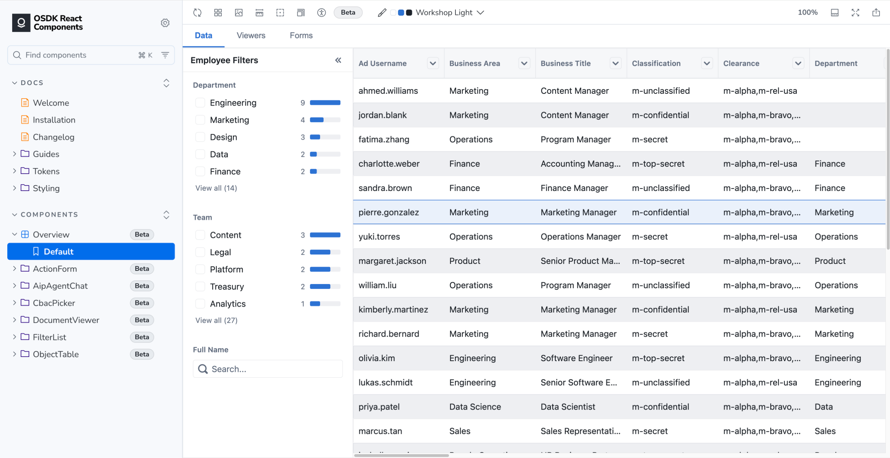

官方公告原图用于说明产品公布的组件形态；下文以实际实现核验能力。原图许可不等于源码 Apache 许可，归属和保存摘要见 [assets.md](assets.md)。

## 2. npm 真正公开什么

根入口 `@osdk/react-components` 的 JS 导出为空。应使用以下子路径；`exports` 中的 wildcard 指向打包的 `public` 文件，不是任意内部源码都属于 API。[manifest](https://github.com/palantir/osdk-ts/blob/37cfd38676bf04edaef5847e929d914ea214c149/packages/react-components/package.json#L26-L297)、[根 barrel](https://github.com/palantir/osdk-ts/blob/37cfd38676bf04edaef5847e929d914ea214c149/packages/react-components/src/index.ts#L17-L18)

| 子路径（省略包名前缀） | 主组件 / family | 定位与公开组合点 | 阶段 |
|---|---|---|---|
| `/object-table` | ObjectTable、BaseTable | 对象浏览；ColumnConfigDialog / MultiColumnSortDialog、LoadingCell / LoadingCellContent；选择、编辑、snapshot、专用 hooks/types | 稳定入口，产品 Beta |
| `/filter-list` | FilterList、BaseFilterList、FilterPopover、FilterInput | 属性/链接筛选、聚合 facet、容器与状态 helpers | 同上 |
| `/action-form` | ActionForm、BaseForm | Action 参数表单与 schema-driven 通用字段布局 | 同上 |
| `/document-viewer` | DocumentViewer | 按 MIME 选择具体媒体 renderer；没有通用 BaseDocumentViewer | 同上 |
| `/pdf-viewer` | PdfViewer、BasePdfViewer、PDF toolbar/sidebar/content/search/annotation/outline | 最丰富的 viewer composition、context、hooks | 同上 |
| `/tiff-viewer` | TiffViewer、BaseTiffViewer | 首帧 TIFF canvas；可选服务端多页转 PDF | 同上 |
| `/markdown-viewer` | MarkdownViewer、BaseMarkdownViewer | GFM Markdown 只读渲染 | 同上 |
| `/email-viewer` | EmailViewer、BaseEmailViewer | RFC822 headers/body，HTML sandbox | 同上 |
| `/spreadsheet-viewer` | SpreadsheetViewer、BaseSpreadsheetViewer | sheet tabs + 只读表格 | 同上 |
| `/image-viewer` | ImageViewer、BaseImageViewer | 浏览器 img 展示 | 同上 |
| `/video-viewer` | VideoViewer、BaseVideoViewer | 原生 video controls | 同上 |
| `/xml-viewer` | XmlViewer、BaseXmlViewer | 保留 XML 文本的 pre/code 展示 | 同上 |
| `/primitives` | ActionButton、Dialog、SkeletonBar、Tooltip、TooltipArrow | 有限公共原语；Dialog 为受控包装、Tooltip 为复合原语 | 公开基础入口 |
| `/experimental/aip-agent-chat` | AipAgentChat、BaseAipAgentChat、message text helper | LMS 对话 wrapper 与自有 transport 可用的 Base UI | Experimental |
| `/experimental/cbac-picker` | CbacPicker / Dialog、CbacBanner / Popover、Base 家族、MaxClassificationField / helpers | 内容标记选择、约束、banner | Experimental |
| `/experimental/theme` | OsdkThemeProvider、useOsdkTheme 等 | context + DOM 色彩标记，CSS tokens/layers | Experimental |
| `/styles.css` | 非 JS 的聚合样式 | 必需的 token 与组件样式导入 | 样式资产 |

这是组件家族目录，不把 hooks 或类型计作独立营销组件。去重后完整公开符号为 **98 runtime + 170 type**；旧 aliases、experimental 聚合与空根入口计入 30 个 JS manifest entry，但不重复计算同一符号。完整每个符号和所属入口由 [inventory](public-export-inventory.json) 提供，说明见 [API reference](api-reference.md)。例如内部 RangeInput/ListogramInput、ObjectSelectField 文件存在，却不等于有单独的受支持 npm 入口。

不应从旧 PR 或文件名添加 ObjectView、DocxViewer、独立 ExcelViewer、Forge Chat、conversion skill 等“已发布能力”。Docx 曾出现后移除；Spreadsheet 是当前名字。未合并 PR 仅作为历史方向证据。[历史边界](origins-and-eos.md)

## 3. 安装、React 19 和数据前提

组件 peers 声明 React/react-dom 17/18/19，OSDK api/client/react `^2.8.0`，classnames `^2.0.0`。0.61.0 tarball 的开发依赖核心是 2.73.0；本次选择核心同一版本 2.75.0 做隔离验证，不能把宽 peer 范围读成任意旧版都经测试兼容。[manifest dependencies/peers](https://github.com/palantir/osdk-ts/blob/37cfd38676bf04edaef5847e929d914ea214c149/packages/react-components/package.json#L307-L352)

```sh
# 加入已有 React 项目；React 版本按项目锁定，OSDK 核心同一版本
pnpm add @osdk/react-components@0.61.0 @osdk/api@2.75.0 \
  @osdk/client@2.75.0 @osdk/react@2.75.0 classnames@^2
```

```tsx
import { OsdkProvider } from "@osdk/react";
import type { Client } from "@osdk/client";
import { ObjectTable } from "@osdk/react-components/object-table";
import "@osdk/react-components/styles.css";
import { Employee } from "your-generated-sdk";

// client 是为获授权 Foundry 环境创建的 OSDK Client。
// Employee 是生成 SDK 中的定义，不是普通 JSON rows。
export function Employees({ client }: { client: Client }) {
  return (
    <OsdkProvider client={client}>
      <ObjectTable objectType={Employee} />
    </OsdkProvider>
  );
}
```

示意代码省略认证建立过程，不含 token 或可执行生产参数。完整 wrapper 需要正确的 Ontology 定义、读权限、metadata 和相应后端能力。Base 层可绕开部分领域取数，但 BaseTable 要 TanStack `Table<TData>`；BaseForm 的 object 字段仍依赖 OSDK provider。这里没有一个完全独立、零 OSDK peer 的通用 Base npm 包。[Base 边界](theme-and-extension.md)

**已执行的 React 19 验证很窄：** 实际安装 npm 0.61.0 + OSDK 2.75.0 + React 19.3.0，在隔离本地 harness 渲染普通 BaseForm，production build 成功，并做有限提交交互。它证明这一条路径能运行；4 项断言包括复现必填 false 的边界，不能覆盖所有组件、SSR/RSC、EOS 主题、portal 或真实 Foundry 集成。详见 [checks.md](checks.md)。核心 hooks 直接调用 useSyncExternalStore，React 17 peer 声明亦不能代替兼容实测。[架构篇 React 边界](../osdk-typescript-2026-09/)

## 4. ObjectTable：对象浏览，不是完整电子表格


**功能。** object/interface definition 或 ObjectSet 输入；自动 metadata 列、派生属性、function 列、自定义 renderer；列排序、可见性、pin、resize；行选择/焦点、行点击、局部单元格草稿编辑；导出 snapshot。底层是 TanStack Table `^8.21.3` + React Virtual `^3.13.13`，没有直接以 AntD Table/react-data-grid 为引擎。[公开 API](https://github.com/palantir/osdk-ts/blob/37cfd38676bf04edaef5847e929d914ea214c149/packages/react-components/src/public/object-table.ts#L17-L161)

**关键参数。** `objectType` 为领域定义；`objectSet` 限定集合；`columnDefinitions` 配置属性/自定义/函数列；`pageSize` 默认 50；`defaultOrderBy` 初始值 / `orderBy` 受控值与 `onOrderByChanged` 管排序；`selectedRows` 是主键受控输入，回调给已加载对象实例；`selectionMode`、`onRowClick` 定义交互；`onSubmitEdits` 承接应用写回。所有精确类型、必填和默认值见 [参数附录](api-reference.md)。

**分页、性能与语义。** “paginated”实际是后端分页取数 + 接近底部继续 fetchMore，不是内建页码控件。只有行虚拟化（估计 40px / overscan 5），已下载列表仍可增长；排序交给服务器。全选可能表示整个筛后 ObjectSet，而回调返回的实例只涵盖已加载行，两者不可混用。function 列有并发与缓存间隔成本，interface 的函数列支持要按实现限制处理。

**编辑边界。** 编辑是本地 draft 与 callback；没有自动帮 EOS 选择 Action、验证权限、建立事务或回滚。没有证据支持 Excel 式多单元格范围、剪贴板、undo/redo、完整键盘网格编辑。snapshot 默认上限 10,000，导出原始属性值而非任意 cell renderer 的格式化结果。异步校验与提交有静态风险，详见 [深审与测试边界](object-table.md)。

**EOS 建议。** 普通对象管理/探索页可直接评估 wrapper；自主后端且已用 TanStack 可适配 BaseTable；现有 AntD/react-data-grid 若满足需求，保留 UI 并在其下接相同领域 hooks，不必为统一视觉更换整个表格引擎。以下菜单和配置实拍展示它提供的是哪些现成交互：


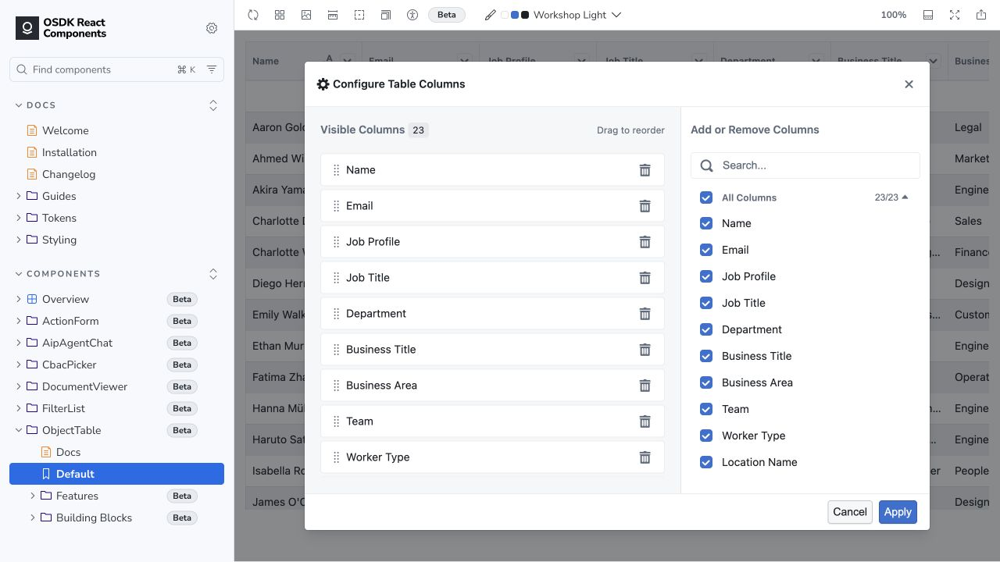

## 5. FilterList：查询构造器与聚合 facet

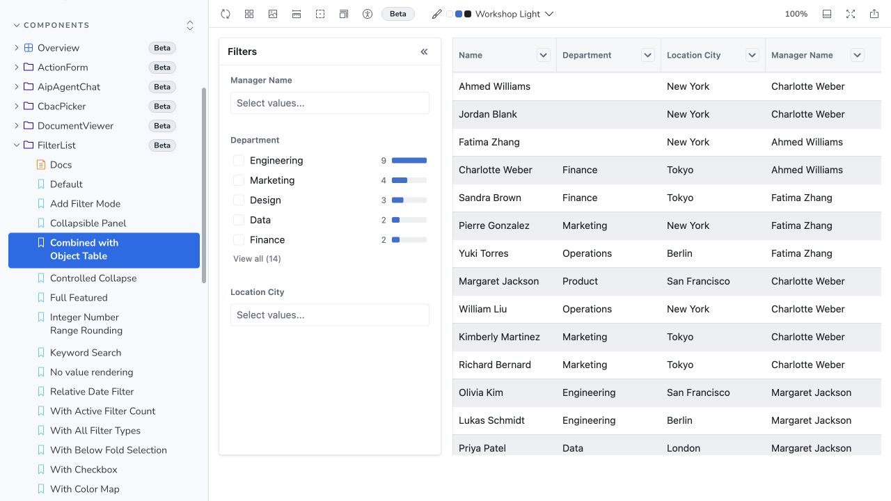

**功能。** 显式 filterDefinitions 组合关键词、分类单/多选、数值/日期范围、直方图、链接存在性与链接对象属性；支持隐藏/添加、collapse、拖拽、reset、默认种子和快照回调。FilterPopover 将组合放进弹层；FilterInput 是公共输入协调入口；BaseFilterList 提供容器、state 和 renderInput seam。

**关键参数与组合。** `objectType` / `objectSet` 给领域与基准集合；`filterDefinitions` 决定可用筛选（省略并不会按 JSDoc 自动填充所有属性）；`defaultFilterStates` 是初始种子；`onFilterStateChanged` / `onFilterListChanged` 等回调按新旧 API 区分；状态 hook 和 serialization/narrowObjectSet helpers 是公开边界。精确名字与签名以 [参数附录](api-reference.md) 为准。

**最重要的数据契约。** 输出 `whereClause` 只覆盖直接属性谓词；包含链接条件的完整结果在 `filteredObjectSet`。接下游表格时仅使用 whereClause 会丢失 linked filters。facet 请求排除自身条件，但不同 property/linked-property 的双 scope 规则并不完全相同；聚合是在对象集合上执行，不是前端扫描已加载 rows。[完整转换与 aggregation 追踪](filter-list.md)

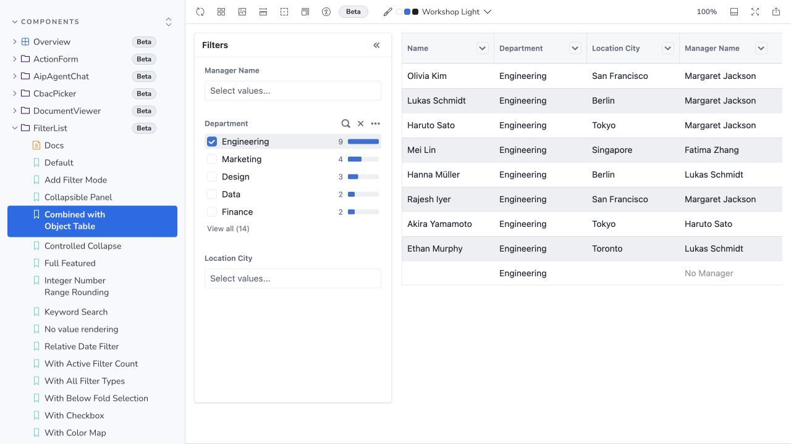

本次在官方 Storybook 实际选择 Engineering，表格同步筛选、选中状态变化。数据来自官方 faux/MSW；这验证 UI 组合，不代表生产 Ontology 查询已验证。

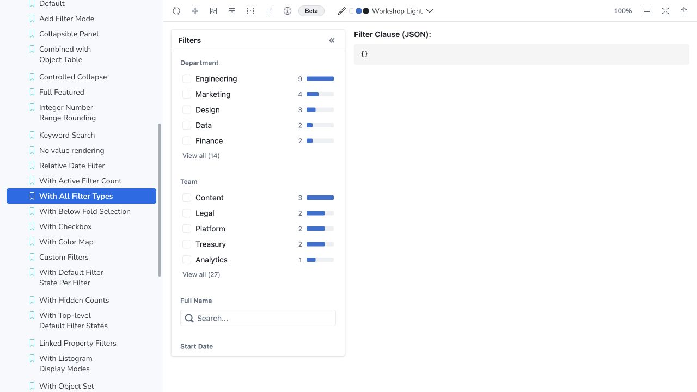

**状态限制。** 它不是完整外部受控状态机；默认值仅种子，callback 不等于父组件可任意回灌整份状态。实际 npm 纯函数 probe 发现 Date serialize/deserialize 返回 ISO 字符串而非 Date；持久化 URL/localStorage 时需显式日期 hydration。该结果是有限 helper 行为实测，不是对所有筛选路径的生产故障判定。EOS 自主后端需要自有 filter AST、空值/时区/links/facet 语义，不能只替换 HTTP 请求。

## 6. ActionForm：metadata 表单与应用负责的提交

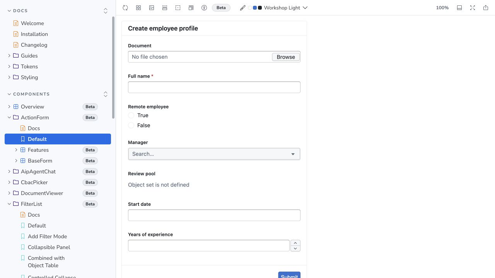

**功能。** `actionDefinition` + metadata 生成 renderer、默认字段，使用 BaseForm / React Hook Form；普通文本/数字/布尔/日期/文件/对象选择和对象集摘要；ActionForm 自定义 `formFieldDefinitions`；需要 `formContent` / sections 时组合 BaseForm；支持受控 `formState` + `onFormStateChange`；disabled / pending、required 与自定义规则；`onSubmit` 拦截、`onSuccess` / `onError` 回调。[ActionForm 深审](action-forms-and-viewers.md)

**校验不是一个概念。** 客户端 required/min/max 等已实现；后端 `$validateOnly` 在底层 action hook 可调用，但 ActionForm 没有接入该预检。`onValidationResponse` 虽公开声明，运行实现不消费。官方指南列明 allowed values、预填、条件隐藏/禁用和 Action 章节布局等尚不支持；不要把 TypeScript 属性当服务端权限/校验已经实现。

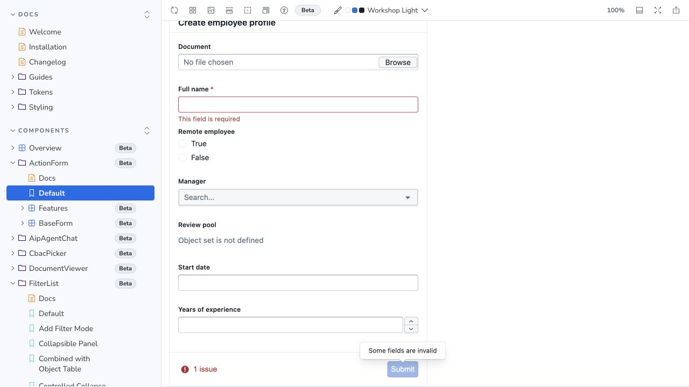

本次空姓名提交显示本地 required，未执行有效 Action。默认成功回调不等于所有其他列表/聚合已刷新，observable action 有后台广泛失效过程，详见 [架构篇](../osdk-typescript-2026-09/)。

**副作用与错误。** FilePicker 选择本身不上传；Action 提交的参数转换可能先上传附件，再执行 Action，失败不能保证先前上传没有产生资源。ActionForm 的 try/catch 将执行与自定义提交错误送 onError 并吞异常；try 之前的 coercion 抛错由 BaseForm 异步错误状态处理。coercion 不是完整值校验，应用应明确显示失败并校验输入；它不提供审批/undo/权限管理。BaseForm 普通字段可本地用，但 OBJECT_SELECT/OBJECT_SET 仍用 OSDK hooks。

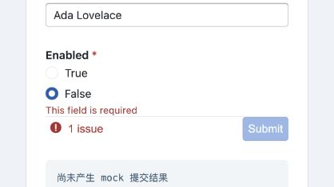

图为本地 mock 必填 False 拒绝状态的局部实拍。新增隔离 React 19 实测：required boolean 默认 False 被判为“必填为空”，optional False 可提交本地 JSON。这是实际发布包 BaseForm + 当前 RHF 解析组合的有限复现，建议在 EOS 采用前明确 false 的校验规则；详情、版本与可重跑 harness 在 [checks.md](checks.md)。没有真实 Action 或生产数据。

## 7. 文档和媒体：每种格式的能力边界

共同 wrapper 输入是 OSDK `Media`，Base 层改为 bytes/文本/URL/解析后数据。媒体 wrapper 多为组件本地 effect 取 `fetchContents()`；不能把对象 normalized cache 宣传外推为所有媒体下载共享缓存。每种 props / onLoad / onError 转发边界详见 [Viewer 参数附录](api-viewers.md)。

| 组件 | 主要输入与能力 | 关键边界 / EOS 验证点 |
|---|---|---|
| DocumentViewer | media；MIME override/fileName；按格式 dispatch，PDF/Image/Video/TIFF 特定 props | 无 DOCX/PPTX/CSV/audio/plain text 通用路由；没有任意 renderer registry |
| PdfViewer / BasePdfViewer | Media 或 URL/ArrayBuffer/Uint8Array/Blob；页码、zoom/fit、rotate、search、thumbnails/outline、annotations、可选 highlight/form | worker/CSP/bundler；highlight/download 默认关闭；事件需应用持久化；下载不保证写入编辑值 |
| TiffViewer / BaseTiffViewer | bytes → UTIF 首帧 canvas，max 输入 25,000,000 bytes | 不等于多页 viewer；DocumentViewer 的 TIFF→PDF 是可选 Foundry 服务转换 |
| MarkdownViewer / BaseMarkdownViewer | Media 或 Markdown string；react-markdown + GFM | 只读，无富文本编辑器；未配置 raw HTML plugin |
| EmailViewer / BaseEmailViewer | RFC822 bytes 或 ParsedEmail；subject/from/to/cc/date、HTML/text body | 没有附件浏览；sandbox 不自动阻止 tracking/external CSS，CSP 需评估 |
| SpreadsheetViewer / BaseSpreadsheetViewer | XLSX 或 ParsedSpreadsheet；sheet tabs、字符串单元格 table | 全量解析/渲染，无虚拟化、编辑、公式重算或完整 Excel 格式 |
| ImageViewer / BaseImageViewer | Media 或 src；img/contain、renderer error | 无标注/图像编辑；browser 格式支持；objectURL 生命周期 |
| VideoViewer / BaseVideoViewer | Media 或 src；native video controls、mimeType | codec 取决浏览器；无转码或完整专业播放器 |
| XmlViewer / BaseXmlViewer | Media 或 XML string；pre/code 保留内容 | 无语法树编辑/验证/执行 |

实现证据：[Document MIME dispatch](https://github.com/palantir/osdk-ts/blob/37cfd38676bf04edaef5847e929d914ea214c149/packages/react-components/src/document-viewer/DocumentViewer.tsx#L38-L179)、[逐 renderer 深审](action-forms-and-viewers.md)。

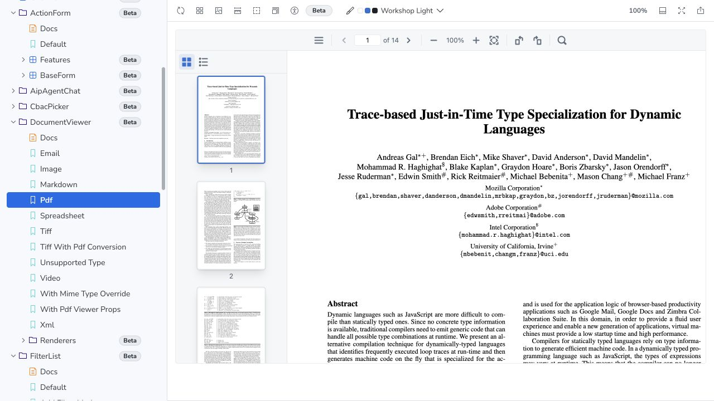

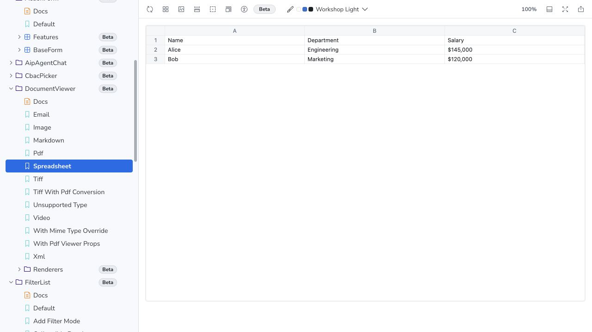

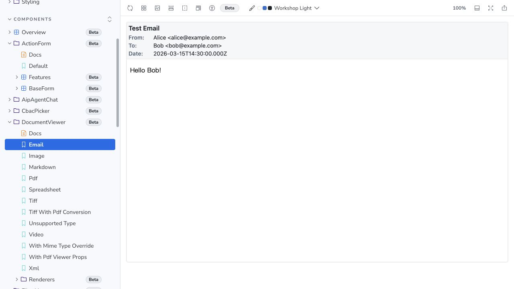

**PDF 的组合深度最值得关注。** 公共 Toolbar/Content/Sidebar/SearchBar/AnnotationLayer/OutlineSidebar，document/viewer/search/sync/outline/formFields/highlight/portals hooks 和 context 可分开使用。EOS 可自定 chrome、数据取得和保存流程；不需要仅靠 CSS 覆盖整控件。不过这些 hooks 仍绑定 PDF.js 生命周期，升级 worker、shortcut、annotationStorage patch 时要回归。

## 8. Experimental 与 primitives 也属于图鉴

**AipAgentChat / BaseAipAgentChat。** wrapper 接 PlatformClient/model/initialMessages 配置，实际接 foundryModel / useChat 的 LMS transport；名字不能证明具备 Agent tools、工作流执行、审批或多代理 runtime。Base 接 messages/status/error/send/stop callbacks，提供气泡、composer、error 与 composerFooter slots；wrapper 在该 slot 注入 model selector。initialMessages 是种子，不是外部受控消息；空白/in-flight 禁用 Send、Enter 发送、Shift+Enter 换行。截图用 Base 模拟会话，未发送模型请求。wrapper 单测为 todo，不能报告真实 AI 接线验证。[AIP 源码与 API](action-forms-and-viewers.md)

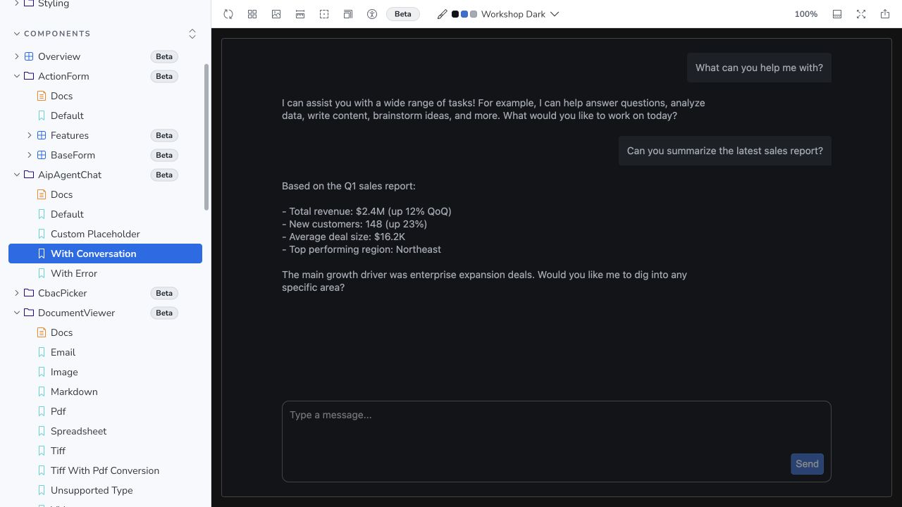

**CbacPicker / BaseCbacPicker。** classification / markings / restrictions / implied/disallowed 选择语义；banner、category search、建议选择、dialog footer 和公开 utility。wrapper 依赖平台 admin/core 数据 hooks，Base 可接已有分类数据。UI 防止不合法选择不等于后端授权；EOS 若没有同样标记体系，应先映射自有政策语义。[CBAC 详解与参数](theme-and-extension.md)

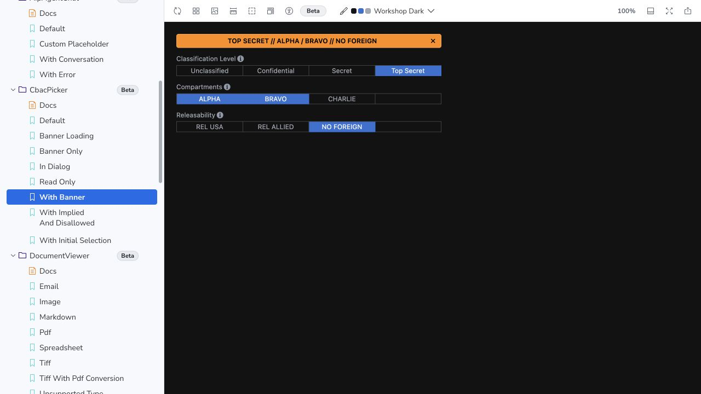

**Primitives。** ActionButton 为样式化按钮与原生按钮属性，不自动执行 Action 或管理 pending；Dialog 是内建 Base UI Portal/Backdrop/Popup 的受控包装，接受 isOpen/onOpenChange/title/children/footer；Tooltip / TooltipArrow、SkeletonBar 为有限共享基础。Tooltip 等继承 Base UI 类型，Dialog 则有自己的精简接口；公开索引说明各自导出方式。它不是完整 commonUI（没有把所有内部输入/Menu/Button 公开）。README 某处“primitives 不导出”与实际 npm 已漂移，应信任 exports 与运行 JS。[入口与漂移](theme-and-extension.md)

## 9. 主题与扩展：从 props 到 hooks，再决定 fork

包直接用 Base UI 无样式交互原语、Blueprint icons，以及本地复制的 Blueprint token CSS；不是 Radix 或整个 Blueprint core 的直接包装。主要 CSS 分层为 `osdk.tokens` 与 `osdk.components`；自定义属性覆盖是主要扩展 seam。Experimental OsdkThemeProvider 主要设置 `data-bp-color-scheme` 和 context，不是一个 CSS-in-JS theme 引擎。[CSS / Provider 源码](theme-and-extension.md)

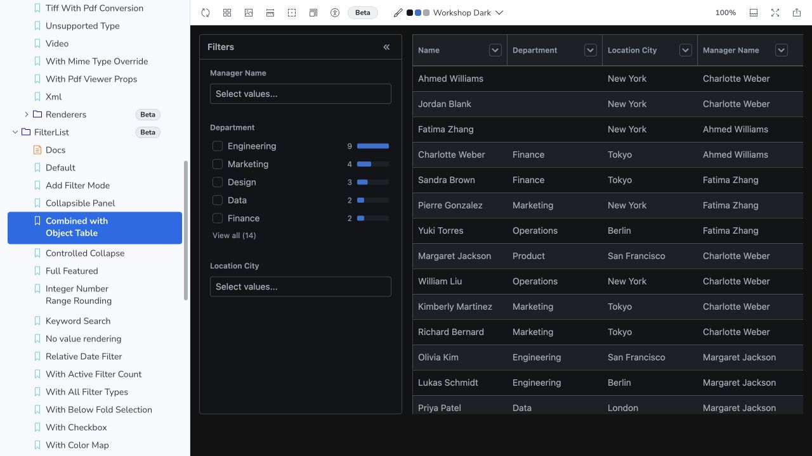

建议按此顺序决策：公开 props/renderer → 公开 hooks + Base/components → 自有 UI 接 `@osdk/react` → 贡献上游或有理由才 fork。每一层先核数据绑定：useColumnDefs/useFilterListState 等虽是 hooks，也会调用 OSDK；不能笼统称所有 hook 都可接任意 REST。Portals 的主题容器、focus/keyboard、多个 PDF 全局 shortcut、硬编码英文和可访问性需要 EOS 回归；本次没有做 WCAG 或性能合规结论。

## 10. AI 生成统一高码应用、Pilot / SuperRepo 的关系

完整产品证据矩阵、五层共享资产、四阶段落地与 A/B/C 评估见 [AI 生成深读章](ai-generation.md)。

**已确认的工程基础：** API 被要求单独定义，明确最少必填参数、默认值、受控状态；OSDK wrapper / Base UI / building blocks 分层。复杂查询和 Action 接线有 typed contracts，主题与现成交互有可复用实现。AI 可以生成这些受限制的 props、配置与组合，并由类型检查和运行验证筛错。[贡献规范](https://github.com/palantir/osdk-ts/blob/37cfd38676bf04edaef5847e929d914ea214c149/packages/react-components/CONTRIBUTING.md#L104-L161)

**已确认的边界：** React props/callback 不等于 Workshop 参数与事件协议；Custom Widgets 仍需要 host adapter、可序列化配置、变量绑定、版本与权限。组件库本身没有低代码编辑器、完整布局 runtime、部署治理或 AI 生成器。公开 #3346 曾提组件转换 recipe，但未合并，不能把它当已经发布的 AI skill。[来源与未合并提案](origins-and-eos.md)、[宿主协议](https://www.palantir.com/docs/foundry/custom-widgets/core-concepts)

**实际整合证据：** 已合并 #2628 的作者明确将指导文件面向 Pilot AI FDE；已合并 #2915 的 Tailwind 修正源于 Pilot 中 agent 实际使用组件的问题。官方 MCP 列出组件文档获取和可选组件迁移工具。可以确认官方指导与实际测试回流；不能断言每个生成项目必选此库、所有内部 prompts 已读取它或 SuperRepo 默认依赖它。[完整证据矩阵](origins-and-eos.md)

**EOS 建议（推断）：** 统一的是领域语义、组件行为和验证依据，而非强制所有表格渲染引擎一致。由同一份组件规范提供 types、属性面板 schema、AI 提示、范例、权限前提、受控状态、事件副作用和能力限制；React 高码应用与 Workshop widget 复用同一领域组件，在边界分别装 host adapter。生成器输出有限配置/组合，提交前做类型、runtime validation、交互和 backend 权限检查。保留已有 AntD/react-data-grid UI 的 adapter 路线，数据层的共享比按截图复刻更有价值。

## 11. EOS 采用路线与停止条件

| 场景 | 优先路线 | 必须验证 |
|---|---|---|
| 已使用 Foundry/OSDK | wrapper 直接复用，必要时替换 Base UI | metadata、权限、Action、副作用、失效刷新与真实响应 |
| EOS 自主后端且 TanStack table | BaseTable + 自有 query/action adapter | Table instance、列 meta、分页、排序、选择集含义 |
| EOS 已有 AntD / react-data-grid | 保留 UI；参考或复用领域 hook 契约 | 不重复服务器对象缓存；编辑语义匹配 |
| 自主媒体服务 | 优先隔离试 Base viewers/PDF parts | 文件大小、worker/CSP、下载/保存、error/cleanup |
| Workshop 低代码与高码 / AI 同时建设 | 共享领域组件规范 + 两类宿主 adapter | config 可序列化、变量/事件、权限、生命周期、版本 |

最小切片建议：一个实体列表、文字筛选与服务端 facet、一次受控修改、两个 widget 同步更新；同样领域组件在独立 React 页面和 Workshop runtime 中运行；AI 用同一 schema 生成有限配置。通过标准是正确分页/过滤/选择与状态同步、EOS 权限执行、无意外 Foundry 请求、React 19 交互和主题稳定。这里是下一步验证建议，不是声称已完成 EOS 移植。

## 12. 许可证与验证限制

组件和本次核心 OSDK 包 manifest 声明 Apache-2.0；依赖有 MIT、MIT-0 和 Apache-2.0 差异。重分发需要保留许可、版权/归属、变更说明与适用 NOTICE；Apache 不授予一般商标使用权。Blueprint 复制 tokens 与媒体 fixture 的归属也需单独处理。[许可详表](theme-and-extension.md)、[Apache 原文](https://www.apache.org/licenses/LICENSE-2.0)

本次执行 npm 元数据/tarball/provenance 对照、公开导出审计、源码行校验、纯 helper probes、官方 Storybook 有限 UI 交互，以及隔离 React 19 BaseForm 路径。没有读取生产 Ontology 或执行真实 Action / Agent / TIFF 服务转换；没有测试全仓、真实性能、全部浏览器、无障碍认证或 EOS 现有项目。图片与所有有限验证范围在 [checks.md](checks.md) 逐项列出。
