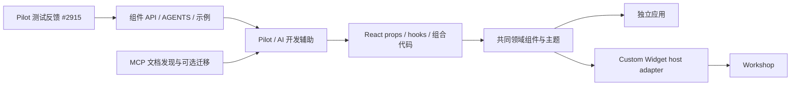
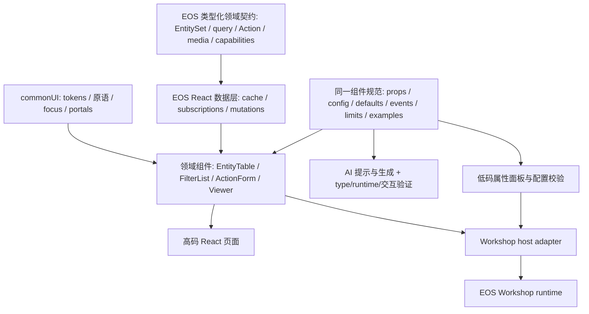

# 组件从哪里沉淀：Workshop、内部 API、公开建设与 EOS / AI 生成

研究日：2026-10-01。当前能力以 npm 0.61.0 / commit `37cfd38676bf04edaef5847e929d914ea214c149` 为准。历史 PR 提供来源和设计意图；明确区分已合并与未合并。没有访问 Palantir 私有 Workshop/Hubble/Forge 仓库，没有行级私有实现同源鉴定。

**可以向团队传达的结论：** OSDK React Components 是面向自定义 React/OSDK 应用的领域组件层，复用部分内部 API 设计与开源交互基础，主动对齐 Workshop 的若干功能与视觉。公开证据不足以称为“Workshop 内部组件整体原样抽取”。另一方面，Pilot/AI FDE 与它的关联已有明确设计目的和使用反馈，不能只说是偶然共用 OSDK；但也不能称所有 AI 输出都必选该包。

## 1. 四种来源不能混在一起

| 来源层 | 可以验证到的内容 | 对 EOS 的意义 |
|---|---|---|
| 领域语义 | Object / Interface / ObjectSet / Action / Query / Media 的 OSDK 契约 | 统一应用语言及后端协议，与表格像不像无关 |
| API 设计 | ActionForm API 明确来自内部 OSDK API 项目；ObjectTable API 曾从未具名 original repo 复制 | 可证明此前设计积累，不能自动定位 Workshop 实现 |
| 视觉与体验 | Blueprint tokens、Workshop 对齐说明、全选 parity | 可复用交互规范/设计体系；同样外观不证明同样代码 |
| 实际实现复用 | TanStack、Base UI、RHF、PDF.js；CBAC 公共同仓包迁移 | 可明确依赖与维护成本，按各自许可证评估 |

## 2. 来源证据矩阵

| 判断问题 | 原始证据 / 状态 | 可下的结论与边界 |
|---|---|---|
| 是不是 Workshop 源码抽取 | FilterList 大 PR [#2329](https://github.com/palantir/osdk-ts/pull/2329) 目标接近 Workshop；**未合并**。ObjectTable [#2467](https://github.com/palantir/osdk-ts/pull/2467) **已合并**，说明 styling 对齐 Workshop BP tokens；[#3381](https://github.com/palantir/osdk-ts/pull/3381) 全选体验对齐 | 证明功能/视觉参照，不证明代码同源 |
| 是否有公开独立建设过程 | [#2256](https://github.com/palantir/osdk-ts/pull/2256) 2025-12-17 初始化包与 API；[初始提交](https://github.com/palantir/osdk-ts/commit/d03ddbb70607f6147a2ed13b2c3accdb8ecabfbc)。[#2289](https://github.com/palantir/osdk-ts/pull/2289) 2026-01-08 才有基础表格实现，均已合并 | 可重建 API→实现的分步发展，不能断言每行原创 |
| 是否继承内部 API | [#2373](https://github.com/palantir/osdk-ts/pull/2373) 已合并，明写 ActionFormApi 来自内部 `foundry/osdk-components-api` PR14；[ObjectTableApi review](https://github.com/palantir/osdk-ts/pull/2256#discussion_r2613002245) 提及原仓库复制 | ActionForm 可定位内部 API 项目；不是 Workshop 实现仓库证明；ObjectTable 原仓库未具名 |
| 表格内核来源 | [#2289 TanStack 示例讨论](https://github.com/palantir/osdk-ts/pull/2289#discussion_r2665288263)、[review](https://github.com/palantir/osdk-ts/pull/2289#discussion_r2666368628)，当前实际 useReactTable/Virtual | TanStack 是真实基础，OSDK 增加领域/配置整合；不能称 Palantir 自研 table engine，也不能据旧讨论认定逐字复制 |
| 是否 Blueprint 包装 | [#2368](https://github.com/palantir/osdk-ts/pull/2368) 已合并 Base UI/icons/tokens；[#2329 的讨论](https://github.com/palantir/osdk-ts/pull/2329#issuecomment-3728511964) 不另做 Blueprint 层；[当前 manifest](https://github.com/palantir/osdk-ts/blob/37cfd38676bf04edaef5847e929d914ea214c149/packages/react-components/package.json#L307-L352) | 当前无直接 @blueprintjs/core 依赖：Base UI + OSDK CSS/tokens + Blueprint icons；并非所有 Blueprint 组件二次包装 |
| 更广泛组件迁移 | [#3444](https://github.com/palantir/osdk-ts/pull/3444) 已合并，把同仓公开 @osdk/cbac-components 迁入；[#2788](https://github.com/palantir/osdk-ts/pull/2788) 早期建设 | 真正可确认的包级迁入；不证明 Foundry 所有 CBAC 前端开源 |
| Chat 是否 Forge 移植 | [#3139](https://github.com/palantir/osdk-ts/pull/3139) Forge demo 移植探索 **关闭未合并**；[#3152](https://github.com/palantir/osdk-ts/pull/3152) 已合并，[作者说明](https://github.com/palantir/osdk-ts/pull/3152#discussion_r3195108992) 为新组件 | 有迁移探索；当前能力与来源以已合并实现为准 |
| 同名 ObjectView 是否已发布 | [#3141](https://github.com/palantir/osdk-ts/pull/3141) **未合并**，说明无法访问 Hubble layout，改取 metadata | 有体验类似而内部能力不同的反例；不是当前包有 ObjectView 的证据 |
| AI 转换 skill 是否已发布 | [#3346](https://github.com/palantir/osdk-ts/pull/3346) **未合并** OSDK-native recipe 提案 | 方向证据；不能当可依赖 npm/MCP 工具实现 |

历史开发还包括 FilterList 分拆的已合并 [#2415](https://github.com/palantir/osdk-ts/pull/2415)、[#2422](https://github.com/palantir/osdk-ts/pull/2422)、[#2423](https://github.com/palantir/osdk-ts/pull/2423)、[#2428](https://github.com/palantir/osdk-ts/pull/2428)、[#2429](https://github.com/palantir/osdk-ts/pull/2429)、[#2430](https://github.com/palantir/osdk-ts/pull/2430)，以及 ActionForm [#2745](https://github.com/palantir/osdk-ts/pull/2745)、PDF [#2783](https://github.com/palantir/osdk-ts/pull/2783)、DocumentViewer [#3211](https://github.com/palantir/osdk-ts/pull/3211)。这说明是逐项交付，而不是一个成熟 Workshop 包在同一日整体公开。

历史资料不可替代当前导出：DocxViewer 后由 [#3281](https://github.com/palantir/osdk-ts/pull/3281) 移除（客户端解析攻击面）；Spreadsheet 由 [#3442](https://github.com/palantir/osdk-ts/pull/3442) 改依赖、[#3799](https://github.com/palantir/osdk-ts/pull/3799) 改名。[#3974](https://github.com/palantir/osdk-ts/pull/3974) 2026-09-04 只是稳定核心导入路径；九月公告仍称 Beta。

## 3. Workshop / React components / Custom Widgets 是三个契约

| 责任 | Workshop 宿主 | react-components |
|---|---|---|
| 领域 | Ontology 对象/links/actions | 相同语义的 typed props/hooks |
| UI | 内建 widgets 与配置体验 | npm React UI、callbacks、Base/parts |
| 宿主 | variables/events/layout/widget config | 普通 React state/props；host adapter 另建 |
| 版本与治理 | widget set 版本化 Compass resource；widget 继承权限 | 本包没有实现对应平台资源/发布治理 |
| AI 生成 | 产品可以生成应用与 widget，交付仍在宿主治理内 | 组件缩小生成表面积，不构成完整生成平台 |

官方 [Custom Widgets core concepts](https://www.palantir.com/docs/foundry/custom-widgets/core-concepts) 把 parameters/events 定义为宿主传值和事件通道，而不是普通 React props 等价物。[参数与事件文档](https://www.palantir.com/docs/foundry/custom-widgets/parameters-and-events) 有自己的类型和数量边界。因此可把 React 组件用作 widget 的 UI 实现，但导入 ObjectTable 不自动取得 Workshop 的变量图、配置面板、部署或权限继承。

## 4. AI / Pilot 关联：指导→实际使用反馈→工具发现

这条关系已有公开实证，证据强于“名字相同/共用 React”的推断。

| 证据层 | 已核实来源 | 可以断言 | 不能断言 |
|---|---|---|---|
| AI 消费指导的设计目的 | 已合并 [#2628](https://github.com/palantir/osdk-ts/pull/2628)，[2026-03-02 作者评论](https://github.com/palantir/osdk-ts/pull/2628#issuecomment-3985012402) 明确希望给 Pilot AI FDE 用作可靠规范来源；当前[组件 AGENTS](https://github.com/palantir/osdk-ts/blob/37cfd38676bf04edaef5847e929d914ea214c149/packages/react-components/AGENTS.md) | 上游明确为 Pilot/AI FDE 准备 OSDK/组件使用知识 | 每次生成都会加载同一文件或必装所有组件 |
| 实际 Pilot 测试回流 | 已合并 [#2915](https://github.com/palantir/osdk-ts/pull/2915)，2026-04-02；body 说明 Pilot 测试中 agent CSS 导入顺序错误促成 Tailwind 文档修正 | 至少存在 Pilot 中实际使用该库并反馈的过程 | 当前全部 Pilot 产物默认使用此库，或可量化生成成功率 |
| 官方 AI 开发工具发现 | [Palantir MCP available tools](https://www.palantir.com/docs/foundry/palantir-mcp/available-tools) 列出 get_osdk_react_components_documentation；convert_to_osdk_react 明确可选采用组件 | 组件文档进入 AI 开发工具可发现面，转换指导可选择组件 | 所有 Agent/Pilot 使用同一 MCP 端点；公开文档即内部 prompt 实现 |
| SuperRepo/宿主组合 | 同一 OSDK/React 应用栈可与仓库和交付宿主组合 | 架构上可组合 | 未见模板/manifest 时不能说 SuperRepo 默认直接依赖该包 |

MCP 文档的 OsdkProvider2 等名称可能带历史 API 痕迹；这里只引用其工具能力与可选组件说明，实际代码仍按本次 2.75.0 公共入口核验。未合并 #3346 与上述已经公开的 MCP 工具不是同一份已发布实现，不能混为一谈。

图是已核事实支持的概念关系，不是 Palantir 私有服务网络或每次生成调用时序。**工程推断：** 这样的循环有利于减少 AI 反复重写分页、facet、Action loading/errors、主题和对象类型接线，让“生成应用”更多变成受约束组合。这也解释为什么统一高码并不需要所有 UI 使用单一 DSL：公共语义和数据契约可以保留 React、各种渲染引擎与不同宿主。

## 5. EOS 后续影响应落到哪些资产

以下为建议，未在 EOS 项目执行。

1. **commonUI 保持自有通用边界。** 不让普通按钮或弹窗依赖 Foundry；可以与领域组件共享 tokens、focus、portal 策略，但以长期 API 和可访问性为目标。
2. **领域和数据层有统一契约。** 自主后端需要明确 Entity identity / query AST / aggregate / Action validation / edits / media / capabilities。Zustand/Jotai 放本地 UI 状态，服务器实体缓存集中管理，避免三个宿主各自复制对象。
3. **同一规范供人、低码和 AI 使用。** 从组件 API/默认值/受控状态/事件/副作用/权限需求/slots/示例/限制生成参考文档、属性面板与提示。不能只给 AI 截图，也不能把 React callbacks 当 JSON 配置；宿主需要自己的可序列化模型。
4. **领域组件复用，宿主治理分别适配。** 高码页面与 Workshop widget 使用同一行为，host adapter 负责变量/事件/布局/生命周期/版本。AI 生成器不能越过后端权限和 Action 层。
5. **优先小切片验证。** 一个 EntityTable、文字与 facet、修改 Action、两个组件同步、两个宿主、同一 schema 的 AI 组合；正确行为和状态一致性比界面像 Workshop 更关键。

## 6. 直接复用、适配与参考自研

| 目标 | 路线 | 原因与条件 |
|---|---|---|
| Foundry 后端应用 | 直接试 OSDK wrapper | 复用 metadata/ObjectSet/Action 语义；权限、动态数据仍须实测 |
| 自主后端 TanStack table | 隔离 BaseTable，再 adapter | 需自建 Table instance；不能直接传 rows 替代 OSDK wrapper |
| 已有 AntD / react-data-grid | 保留 UI，复用/参考领域契约 | 统一语义、数据和副作用，允许不同表格交互需求 |
| 自主 facet/filter | Base 容器或参考实现 | 聚合、links、日期、空值和缓存由 EOS 定义 |
| 自动表单 | schema→renderer→local validate→server validate→execute 分层 | 当前 ActionForm 不涵盖全部 Workshop form 与预检 |
| PDF / 媒体 | Base viewers / parts 更有希望局部直用 | 文件获取、worker、CSP、大文件、保存与 error 路径验证 |
| 完整 Workshop 替代 | 自建 host/editor/runtime 治理 | 组件 npm 没有提供完整低代码平台 |
| AI 生成平台 | 规范/例子/MCP式发现 + 验证管道 | 公共组件是受约束积木；不保证生成准确、权限或发布治理 |

## 7. 仍然未知

没有私有 Workshop 源码同源证据；ObjectTable original repo 未具名；Pilot 的完整内部依赖图、模板选择策略、prompt 装载路径与采用比例不可由公开 PR 推定；SuperRepo 是否默认直接依赖组件需要具体模板/manifest。Beta API 的后续变化、全部 React19 / SSR、生产权限、性能与无障碍亦未由本研究证明。已确认和未确认项应随新证据更新，而不是把推断固化成事实。
