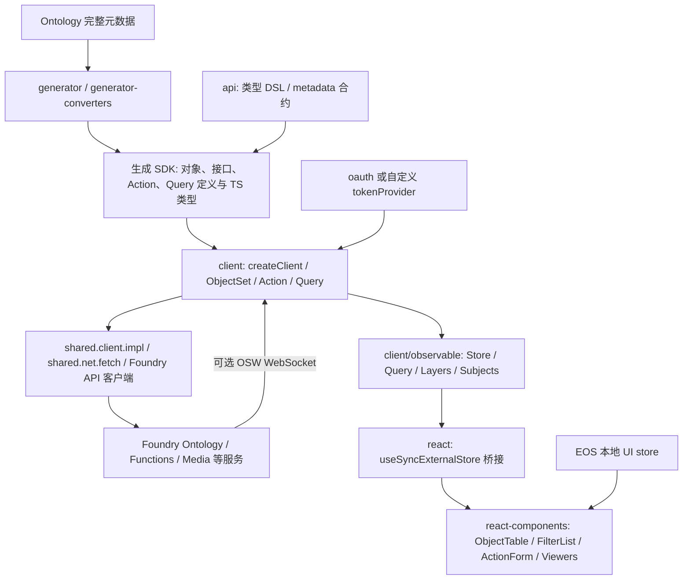

# OSDK TypeScript 底层架构：类型生成、运行时、可观察缓存与 EOS 适配

> 研究日期：2026-10-01。本文讨论底层架构，表格、筛选器、表单和主题详见[配套组件专题](../osdk-react-components-2026-09/)。核心 2.75.0 发布源固定为 `fb8ec172d540ef7819382ff036aa2a692614af75`，OAuth／共享网络包的实际发布源为 `9b93e05b5edd8c2e424480afb8cd7b4452ce56b8`，详细版本和验证边界见下一节。本文读取公开官方源码／npm，不访问生产 Ontology，不执行真实 Action，不把上游 mock 或 snapshot 的存在写成本次测试通过。

## 结论先行

**架构判断：组件层与底层运行时职责不同。** `@osdk/react-components` 负责 Ontology 专用交互界面，而 OSDK TypeScript 的底层投资主要在三条链路：把 Ontology 元数据编译为类型化 SDK；把查询 DSL 编译成 Foundry 请求并把 wire 数据转换为对象实例；用 Observable Client 维护对象身份、集合引用、动作 edits 和乐观层，再桥接 React。它既不是 AntD 这类通用视觉系统，也不是给任意 REST API 套上的通用数据缓存。其最有借鉴价值的部分，是“对象身份 + 对象集表达式 + 动作结果驱动同步”形成的连贯模型。[Client 分派][client-dispatch]、[Observable Store][store]、[React Provider][react-provider]

**对 EOS 的建议：** 如果 EOS 真正以 Foundry Ontology 为后端，优先直接复用发布包的数据层，以 adapter 对接现有 AntD／react-data-grid UI；如果 EOS 使用自主后端，先定义自己的对象身份、对象集 DSL、动作 validation／edits 契约，再借鉴缓存思想。仅把 `@osdk/react-components` 换一个 tokenProvider 或塞入普通 JSON，不能得到完整的数据适配。对于非 Ontology 业务请求保留 TanStack Query，对于表格选择、列设置、筛选草稿、未提交表单等本地状态使用 Zustand／Jotai，避免把 OSDK 服务器对象整份复制进第二个 store。本段为工程建议；下文给出事实依据与限制。

## 阅读导图

| 问题 | 入口 |
|---|---|
| 全仓包分层、脚手架/Widget/OaC/AI、测试与 release | [repository-map.md](repository-map.md) |
| Ontology metadata 如何成为 typed SDK | 本文第 3–6 节 |
| normalized cache、请求 key、Action/optimism 与订阅 | 本文第 8–10 节 |
| Zustand/Jotai/TanStack Query 与 EOS 自主后端 | 本文第 11–12 节 |
| UI、完整组件/API、Workshop 与 AI 生成 | [组件专题](../osdk-react-components-2026-09/) |
| 复核发布、来源、验证与限制 | [sources.md](sources.md)、[checks.md](checks.md) |

## 1. 先把发布源锁准确

不能给整个 monorepo 统一贴一个 npm 发布 commit。以下为本次直接读取官方 npm registry 的 `time[version]` 与 decoded SLSA provenance `resolvedDependencies[].digest.gitCommit` 的结果；各版本在 2026-10-01 查询时均为各自 `latest`，不能据此断言产品 GA。

| 包 | 实际发布版本 | npm 发布时间（UTC） | provenance commit |
|---|---|---|---|
| [@osdk/react](https://registry.npmjs.org/@osdk/react/2.75.0) | 2.75.0 | 2026-09-29 17:22:04.597 | `fb8ec172d540ef7819382ff036aa2a692614af75` |
| [@osdk/api](https://registry.npmjs.org/@osdk/api/2.75.0) | 2.75.0 | 2026-09-29 17:22:34.778 | `fb8ec172d540ef7819382ff036aa2a692614af75` |
| [@osdk/client](https://registry.npmjs.org/@osdk/client/2.75.0) | 2.75.0 | 2026-09-29 17:22:16.815 | 同上 |
| [@osdk/generator](https://registry.npmjs.org/@osdk/generator/2.75.0) | 2.75.0 | 2026-09-29 17:20:07.211 | 同上 |
| [@osdk/oauth](https://registry.npmjs.org/@osdk/oauth/1.14.0) | 1.14.0 | 2026-09-11 14:17:15.348 | `9b93e05b5edd8c2e424480afb8cd7b4452ce56b8` |
| [@osdk/shared.client.impl](https://registry.npmjs.org/@osdk/shared.client.impl/1.14.0) | 1.14.0 | 2026-09-11 14:20:55.110 | 同上 |
| [@osdk/shared.net.fetch](https://registry.npmjs.org/@osdk/shared.net.fetch/1.13.0) | 1.13.0 | 2026-09-11 14:17:02.869 | 同上 |

完整 registry 与 decoded provenance 已保存于 [codegen-auth-core-npm-evidence.json](evidence/codegen-auth-core-npm-evidence.json)。OAuth/shared 的原始文件在本地临时工作区核验；[源码比对记录](evidence/auth-source-verification.json)保存 URL、SHA-256 和逐字节对比，不在研究仓库镜像原始源码。此次读取的 9b93 OAuth/shared 文件均与 fb8ec 发布树对应文件相同；另外，对 fb8ec 与 2026-09-30 main `e53b94ecd5de7cdd7e864d0daa04363bdad4db4c` 的 `packages/generator`、`api`、`client`、`oauth`、`shared.client.impl`、`shared.net.fetch` 做 `git diff --stat`，结果为空。因此以下引用采用真实发布 commit，即便某行在 main 看起来相同。

**验证边界：** 这些 npm 元数据没有 `gitHead`；发布源来自 npm 返回的 provenance 内容。本次核对了 provenance 中的 commit、tarball 摘要与 registry integrity，并对下述 OAuth/shared sourcemap 做源码比对；未独立验证 provenance 签名的完整密码学信任链。因而本文把它称为发布溯源匹配，不把它写成独立签名认证。

另下载并核验了 OAuth/shared 三个真实 tarball 的 registry SHA-512 integrity：

| tarball | 大小 | SHA-256 |
|---|---:|---|
| oauth-1.14.0.tgz | 64,673 bytes | `070cb8724c9eb97a1ea02187e2e39f8e05ed504f65618cd2755ce467175b5ee3` |
| shared.client.impl-1.14.0.tgz | 7,329 bytes | `411ab80ff980e537d822435ddacf429525897c62bce981a2919ecfdab6d64582` |
| shared.net.fetch-1.13.0.tgz | 9,233 bytes | `c93f77f772743e428d464ca5098ab0ad6d4e9c39b96228ae76fa475d8e623fbc` |

三者在临时工作区下载核验，研究仓库保存摘要元数据而不镜像安装包。检查 npm `build/browser/*.js.map` 的 `sourcesContent`，OAuth 13 个模块、shared.client.impl 2 个模块、shared.net.fetch 4 个模块全部与发布树对应 TS 文件一致。该检查比仅比较 `package.json.version` 更能支撑“研究的源码就是包中行为”。

## 2. 分层与依赖关系



这是源码依赖关系的概念图，箭头不是网络时序。`@osdk/client` 的 dependencies 包含 Foundry ontology／functions／media 客户端、内部 shared client 与 net、`rxjs`、`@wry/trie`、`isomorphic-ws`；`@osdk/react` 则从 `@osdk/client/observable` 引入 `createObservableClient`，没有在这条实现链上使用 TanStack Query、Zustand 或 Jotai。[client package][client-package]、[react package][react-package]、[Provider L17–20、69–79][react-provider]

| 层 | 主要承担的工作 | 不应误认为 |
|---|---|---|
| `api` | 类型、ObjectSet／Action／Query 的接口合约、compile-time metadata | 已实现所有运行时行为的后端 |
| `generator` | 从 Ontology 元数据生成 SDK 文件、定义常量与 TS 类型 | 生成一套通用数据库或权限系统 |
| `client` | 请求分派、DSL 转换、wire 对象转换、平台 API 调用 | 自动跨 UI 共享所有请求结果的 normalized cache |
| `client/observable` | Store、Query、对象／集合引用、请求去重、动作同步与乐观层 | 任何 Hook 订阅都等于服务端实时推送 |
| `react` | Provider、Hook 状态、`useSyncExternalStore` 桥接 | UI 组件库或表格交互状态管理器 |
| `react-components` | OSDK 感知的表格、筛选、动作表单和媒体交互 | 面向任意 backend 的视觉组件集合 |

后两层的边界并非猜测：`@osdk/react/CONTRIBUTING.md` 明确把可跨组件复用的 OSDK 数据 Hook 放在 react，把表格选择、PDF 页面导航与 CSS 相关 Hook 放在组件层。但该文档的 Export Strategy 已落后于实际代码：它仍称现代 Hook 位于 experimental，而发布源 `src/index.ts` 已在主入口导出 `useOsdkObjects`、`useObjectSet`、`useOsdkAction`、aggregation 和 function Hook。使用 API 时以 tarball exports／barrel 为准。[职责说明][react-contributing]、[实际主入口][react-index]

## 3. 生成链路：本体元数据变成领域 SDK，执行引擎留在 client

**已核验事实。** `WireOntologyDefinition` 没有定义一种自有通用 schema，它直接扩展 `@osdk/foundry.ontologies` 的 `OntologyFullMetadata`。输入因此是 Foundry 的对象、接口、动作、查询及共享属性类型元数据，而非任意 REST/OpenAPI 配置。[WireOntologyDefinition.ts L17–20](https://github.com/palantir/osdk-ts/blob/fb8ec172d540ef7819382ff036aa2a692614af75/packages/generator/src/WireOntologyDefinition.ts#L17-L20)

生成器的边界可按下面的步骤阅读：

| 阶段/符号 | 真实职责与边界 | 证据 |
|---|---|---|
| `generateClientSdkPackage` | 接收包名、版本、`sdkVersion`、输出目录、wire ontology、最小文件系统和依赖版本；签名仍允许 `"1.1"`，实现明确抛错拒绝生成 v1。分别生成 module/commonjs，再写 package.json/tsconfig。 | [generateClientSdkPackage.ts L29–85](https://github.com/palantir/osdk-ts/blob/fb8ec172d540ef7819382ff036aa2a692614af75/packages/generator/src/generateClientSdkPackage.ts#L29-L85) |
| `generateClientSdkVersionTwoPointZero` | 校验输出目录，增强 ontology，构建 `GenerateContext`；依次生成根 index、metadata、每个 object/interface/action/query。所谓 v2 是 SDK 格式，不是 npm 2.0.0 版本。 | [v2.0/generateClientSdkVersionTwoPointZero.ts L32–98](https://github.com/palantir/osdk-ts/blob/fb8ec172d540ef7819382ff036aa2a692614af75/packages/generator/src/v2.0/generateClientSdkVersionTwoPointZero.ts#L32-L98) |
| `EnhancedOntologyDefinition` | 对输入 objectTypes/actionTypes/queryTypes/interfaceTypes/sharedPropertyTypes 做 remap，解析本地与外部定义；保留 `raw`，缺失引用抛 GeneratorError。 | [EnhancedOntologyDefinition.ts L43–125](https://github.com/palantir/osdk-ts/blob/fb8ec172d540ef7819382ff036aa2a692614af75/packages/generator/src/GenerateContext/EnhancedOntologyDefinition.ts#L43-L125) |
| `generatePerObjectDataFiles` / `generatePerInterfaceDataFiles` | 每个本地定义生成 `ontology/objects/<name>.ts` 或 `ontology/interfaces/<name>.ts`；`ForeignType` 不重复生成，barrel 仅导出本地增强定义。 | [object 文件 L26–74](https://github.com/palantir/osdk-ts/blob/fb8ec172d540ef7819382ff036aa2a692614af75/packages/generator/src/v2.0/generatePerObjectDataFiles.ts#L26-L74)、[interface 文件 L25–79](https://github.com/palantir/osdk-ts/blob/fb8ec172d540ef7819382ff036aa2a692614af75/packages/generator/src/v2.0/generatePerInterfaceDataFiles.ts#L25-L79) |
| `generatePerActionDataFiles` | wire Action 元数据转为参数类型、单次/批量签名及定义常量；类型侧含 `__DefinitionMetadata`，运行时常量主动去掉 description/displayName/modifiedEntities/parameters/rid/status。它不生成业务规则的执行函数。 | [Action 生成 L62–121](https://github.com/palantir/osdk-ts/blob/fb8ec172d540ef7819382ff036aa2a692614af75/packages/generator/src/v2.0/generatePerActionDataFiles.ts#L62-L121)、[类型/运行时分界 L205–258](https://github.com/palantir/osdk-ts/blob/fb8ec172d540ef7819382ff036aa2a692614af75/packages/generator/src/v2.0/generatePerActionDataFiles.ts#L205-L258) |
| `generatePerQueryDataFilesV2` | 生成 Parameters/ReturnType/Signature、QueryDefinition 常量；`queryVersionReferences` 可给定固定版本或版本范围；重复从新旧两种版本接口指定同一 query 会抛错。 | [query 生成 L130–241](https://github.com/palantir/osdk-ts/blob/fb8ec172d540ef7819382ff036aa2a692614af75/packages/generator/src/v2.0/generatePerQueryDataFiles.ts#L130-L241)、[重复检查 L47–54](https://github.com/palantir/osdk-ts/blob/fb8ec172d540ef7819382ff036aa2a692614af75/packages/generator/src/v2.0/generateClientSdkVersionTwoPointZero.ts#L47-L54) |

Object 生成文件同时输出 TS namespace（PropertyKeys、Links、Props、StrictProps、ObjectSet、OsdkInstance）、类型定义和很小的运行时常量。常量实际包含 `type`、`apiName`、`osdkMetadata`、主键信息、`internalDoNotUseMetadata.rid`；完整属性/链接类型被放在编译期 `__DefinitionMetadata` 中。不要把 IDE 能 hover 出属性 metadata 解释为 JS 常量内就携带全部运行时展示配置。[wireObjectTypeV2ToSdkObjectConstV2.ts L106–146](https://github.com/palantir/osdk-ts/blob/fb8ec172d540ef7819382ff036aa2a692614af75/packages/generator/src/v2.0/wireObjectTypeV2ToSdkObjectConstV2.ts#L106-L146)、[createDefinition L295–342](https://github.com/palantir/osdk-ts/blob/fb8ec172d540ef7819382ff036aa2a692614af75/packages/generator/src/v2.0/wireObjectTypeV2ToSdkObjectConstV2.ts#L295-L342)

`OntologyMetadata.ts` 输出 `$ExpectedClientVersion = "2.75.0"`、额外 user-agent、Ontology RID 与生成分支信息；输入使用 ontology API namespace 时可不输出 RID。`exportOntologyMetadata` 是默认关闭的额外生成选项，会写原始 metadata JSON 与 ESM/CJS 声明 shim。此处只验证生成代码与 snapshot；没有对新生成 SDK 执行一次 npm pack，因此不把“生成器写了 JSON”扩展为“每种打包路径都已经验证能消费 JSON”。[generateMetadata.ts L22–55](https://github.com/palantir/osdk-ts/blob/fb8ec172d540ef7819382ff036aa2a692614af75/packages/generator/src/v2.0/generateMetadata.ts#L22-L55)、[L80–103](https://github.com/palantir/osdk-ts/blob/fb8ec172d540ef7819382ff036aa2a692614af75/packages/generator/src/v2.0/generateMetadata.ts#L80-L103)

生成包 peer 依赖是 `@osdk/api` 和 `@osdk/client`，而非把完整执行器复制进每个领域 SDK。依赖版本可传入独立 peer 范围；生成包提供 import/require 双入口，编译目标分别为 NodeNext/ES2020 与 commonjs/es2018。这形成“领域定义包按业务 schema 发布，通用运行时单独升级”的结构。[getExpectedDependencies L150–167](https://github.com/palantir/osdk-ts/blob/fb8ec172d540ef7819382ff036aa2a692614af75/packages/generator/src/generateClientSdkPackage.ts#L150-L167)、[编译目标 L101–137](https://github.com/palantir/osdk-ts/blob/fb8ec172d540ef7819382ff036aa2a692614af75/packages/generator/src/generateClientSdkPackage.ts#L101-L137)、[exports L189–247](https://github.com/palantir/osdk-ts/blob/fb8ec172d540ef7819382ff036aa2a692614af75/packages/generator/src/generateClientSdkPackage.ts#L189-L247)

**测试证据边界。** 生成器覆盖空对象、外部对象/共享属性/动作引用、命名空间、metadata JSON/shim、固定 query 版本和新旧版本 API 冲突等 snapshot/输出测试；它们证明给定 mock metadata 的代码产出，不证明真实 Foundry 元数据权限、所有服务版本兼容性或真实 Action 能执行。[generator 测试 L2156–2301](https://github.com/palantir/osdk-ts/blob/fb8ec172d540ef7819382ff036aa2a692614af75/packages/generator/src/v2.0/generateClientSdkVersionTwoPointZero.test.ts#L2156-L2301)、[版本测试 L3035–3098](https://github.com/palantir/osdk-ts/blob/fb8ec172d540ef7819382ff036aa2a692614af75/packages/generator/src/v2.0/generateClientSdkVersionTwoPointZero.test.ts#L3035-L3098)。`@osdk/api` 的 Quickinfo snapshots README 还明确说它不是 type-correctness test，而是 pin 编辑器 hover 文本；不能把这些 snapshot 写成运行时集成测试。[Quickinfo README L3–18](https://github.com/palantir/osdk-ts/blob/fb8ec172d540ef7819382ff036aa2a692614af75/packages/api/src/__quickinfo_snapshot__/README.md#L3-L18)

## 4. API DSL 与运行时 Client/ObjectSet 的边界

`@osdk/api` 以 TypeScript 领域契约为主：ObjectTypeDefinition、InterfaceDefinition、ActionDefinition、QueryDefinition、ObjectSet、WhereClause、Osdk 类型、选列/nullable/聚合类型等。它不是完全零运行时代码，例如根入口也导出 `DistanceUnitMapping`、`isOk`、DurationMapping；更准确的说法是“主要承载可复用类型与少量值”，不能写成“所有东西都是类型”。[api 根入口 L17–62](https://github.com/palantir/osdk-ts/blob/fb8ec172d540ef7819382ff036aa2a692614af75/packages/api/src/index.ts#L17-L62)、[L158–200](https://github.com/palantir/osdk-ts/blob/fb8ec172d540ef7819382ff036aa2a692614af75/packages/api/src/index.ts#L158-L200)

`CompileTimeMetadata<T>` 正是从可选的 `__DefinitionMetadata` 中抽出 TS 信息；运行时 ObjectTypeDefinition 需要的基础标识只有 `type`/`apiName`，主键及 metadata 为可选字段。Action/Query 也采用这种编译信息与运行时标识分离。[ObjectTypeDefinition.ts L27–28、179–186](https://github.com/palantir/osdk-ts/blob/fb8ec172d540ef7819382ff036aa2a692614af75/packages/api/src/ontology/ObjectTypeDefinition.ts#L179-L186)、[ActionDefinition L118–125](https://github.com/palantir/osdk-ts/blob/fb8ec172d540ef7819382ff036aa2a692614af75/packages/api/src/ontology/ActionDefinition.ts#L118-L125)、[QueryDefinition L37–44](https://github.com/palantir/osdk-ts/blob/fb8ec172d540ef7819382ff036aa2a692614af75/packages/api/src/ontology/QueryDefinition.ts#L37-L44)

`createClient(baseUrl, ontologyRid, tokenProvider, options?, fetchFn?)` 将网络上下文、ontology provider、对象工厂和 objectSetFactory 组合成 callable Client。它同步创建包装器，按传入定义的 `type` 分派：object/interface 返回 ObjectSet；action 返回绑定了 applyAction/batchApplyAction 的 invoker；query 返回 executeFunction invoker。这不是给每个 object 自动做 fetch；远程请求发生在后续终端方法里。[createClient.ts L109–158](https://github.com/palantir/osdk-ts/blob/fb8ec172d540ef7819382ff036aa2a692614af75/packages/client/src/createClient.ts#L109-L158)、[分派 L164–203](https://github.com/palantir/osdk-ts/blob/fb8ec172d540ef7819382ff036aa2a692614af75/packages/client/src/createClient.ts#L164-L203)、[公开签名 L442–471](https://github.com/palantir/osdk-ts/blob/fb8ec172d540ef7819382ff036aa2a692614af75/packages/client/src/createClient.ts#L442-L471)、[上下文组成 L72–98](https://github.com/palantir/osdk-ts/blob/fb8ec172d540ef7819382ff036aa2a692614af75/packages/client/src/createMinimalClient.ts#L72-L98)

ObjectSet 是“带 domain type 的惰性远程集合表达式”。`where` 创建 wire `filter` 节点；`union`/`intersect`/`subtract` 包装相应 wire 节点，不在前端对已下载数组做等价的计算。终端 `fetchPage`、`aggregate` 绑定真正的 HTTP 执行函数，wire descriptor 置于 WeakMap。`asyncIter` 则以 snapshot 模式按 10,000 page size 循环读取 page token；这与界面组件自己的分页大小或虚拟渲染是两层职责。[createObjectSet.ts L95–181](https://github.com/palantir/osdk-ts/blob/fb8ec172d540ef7819382ff036aa2a692614af75/packages/client/src/objectSet/createObjectSet.ts#L95-L181)、[asyncIter L200–228](https://github.com/palantir/osdk-ts/blob/fb8ec172d540ef7819382ff036aa2a692614af75/packages/client/src/objectSet/createObjectSet.ts#L200-L228)

`MinimalObjectSet` 的类型组合列出了 fetchPage/asyncIter/where/asyncIterLinks/subscribe，ObjectSet 的 fetchPage 类型进一步将 `$select`、`$includeRid`、nullable 与派生属性信息反映到返回值。它在编译期限制调用形状；实际返回对象仍经过服务端查询、权限过滤与 wire→OSDK 转换。[ObjectSet.ts L117–128](https://github.com/palantir/osdk-ts/blob/fb8ec172d540ef7819382ff036aa2a692614af75/packages/api/src/objectSet/ObjectSet.ts#L117-L128)、[L160–210](https://github.com/palantir/osdk-ts/blob/fb8ec172d540ef7819382ff036aa2a692614af75/packages/api/src/objectSet/ObjectSet.ts#L160-L210)

**EOS 推断/建议。** 可借鉴“领域定义 + 集合查询 DSL + 稳定运行时”的分离，而不是直接把 ObjectSet 当 TanStack Query 的 queryKey 或把它当 Zustand/Jotai 内存数组。若 EOS 后端不具备 Foundry 的对象身份、接口、关系、聚合与 Action 语义，适配器必须显式翻译并声明不支持的运算；仅替换 baseUrl 无法复用其远程协议。以上来自输入 schema 与 ObjectSet wire 节点、运行时 API 绑定的事实，并非对 EOS 现有后端已经做过兼容性测试。

## 5. Runtime metadata、查询执行与 transport

生成类型没有代替 runtime metadata 获取。`client.fetchMetadata` 按 object/interface/action/query 转向 ontology provider，Query 仅在 `isFixedVersion` 为真时传 version；StandardOntologyProvider 为不同种类建立 client 范围内的异步 cache。Query metadata key 是 `apiName` 或 `apiName:version`，Object metadata 还确保其 implements interfaces 被加载并 deepFreeze。[fetchMetadata.ts L32–70](https://github.com/palantir/osdk-ts/blob/fb8ec172d540ef7819382ff036aa2a692614af75/packages/client/src/fetchMetadata.ts#L32-L70)、[StandardOntologyProvider.ts L43–127](https://github.com/palantir/osdk-ts/blob/fb8ec172d540ef7819382ff036aa2a692614af75/packages/client/src/ontology/StandardOntologyProvider.ts#L43-L127)

底层 metadata cache 以 `client.clientCacheKey` 的 WeakMap 分离 client；完成值与正在进行的 Promise 分开存，复用并发请求，失败移除 inProgress，不缓存失败。这是 metadata 缓存，与 React 所使用的规范化对象/对象集 observable Store 是不同机制。[Cache.ts L65–101](https://github.com/palantir/osdk-ts/blob/fb8ec172d540ef7819382ff036aa2a692614af75/packages/client/src/object/Cache.ts#L65-L101)、[L116–154](https://github.com/palantir/osdk-ts/blob/fb8ec172d540ef7819382ff036aa2a692614af75/packages/client/src/object/Cache.ts#L116-L154)

loadFullObjectMetadata 调用 `ObjectTypeV2.getFullMetadata(...,{preview:true, branch})`，Action/Query metadata 分别调用 ActionTypeV2.get/QueryType.get，再动态 import generator-converters 转为 SDK metadata。这里 `preview:true` 是请求选项，不能据此把全部 API 归为某个 npm beta dist-tag。[对象 metadata L22–35](https://github.com/palantir/osdk-ts/blob/fb8ec172d540ef7819382ff036aa2a692614af75/packages/client/src/ontology/loadFullObjectMetadata.ts#L22-L35)、[Action metadata L22–35](https://github.com/palantir/osdk-ts/blob/fb8ec172d540ef7819382ff036aa2a692614af75/packages/client/src/ontology/loadActionMetadata.ts#L22-L35)、[Query metadata L22–41](https://github.com/palantir/osdk-ts/blob/fb8ec172d540ef7819382ff036aa2a692614af75/packages/client/src/ontology/loadQueryMetadata.ts#L22-L41)

`applyQuery` 先开始获取 QueryMetadata；有参数时等 metadata 将参数转成 DataValue，有 staged edits 时先 flush，调用 Foundry Query.execute，并传 pinned version、transactionId、scenarioRid 和 branch。返回值按实际 metadata 递归 remap 成附件、Media、object/interface/objectSet 等 SDK 值；非 nullable 返回 null 会抛错，union 返回类型有明确“尚不支持”运行时分支。因此 API 类型联合中出现某数据类型，并不能单独证明客户端所有转换路径已支持。[applyQuery.ts L48–116](https://github.com/palantir/osdk-ts/blob/fb8ec172d540ef7819382ff036aa2a692614af75/packages/client/src/queries/applyQuery.ts#L48-L116)、[null/union L127–140](https://github.com/palantir/osdk-ts/blob/fb8ec172d540ef7819382ff036aa2a692614af75/packages/client/src/queries/applyQuery.ts#L127-L140)、[媒体/对象集转换 L168–220](https://github.com/palantir/osdk-ts/blob/fb8ec172d540ef7819382ff036aa2a692614af75/packages/client/src/queries/applyQuery.ts#L168-L220)

HTTP 层来自独立的共享包版本：`createSharedClientContext` 规范化 baseUrl，构造 `header mutator(retrying fetch(fetch-or-throw(fetchFn)))`；每个顶层请求从 tokenProvider 取得 token，设置 `Authorization: Bearer ...`，拼接 Fetch-User-Agent。`fetch-or-throw` 将非 2xx JSON 错误转成 PalantirApiError，text/html/网络异常转成 UnknownError；外层重建错误并保留 cause 以补充调用栈。[createSharedClientContext.ts L29–108](https://github.com/palantir/osdk-ts/blob/9b93e05b5edd8c2e424480afb8cd7b4452ce56b8/packages/shared.client.impl/src/createSharedClientContext.ts#L29-L108)、[createFetchOrThrow.ts L27–77](https://github.com/palantir/osdk-ts/blob/9b93e05b5edd8c2e424480afb8cd7b4452ce56b8/packages/shared.net.fetch/src/createFetchOrThrow.ts#L27-L77)

重试实现使用 fetch-retry：最多 3 次重试，初始 1,000ms 的指数退避与 ±50% jitter；PalantirApiError 仅 statusCode 429/503 可重试，其他未知错误仍返回可重试。代码含 `QoS-Retry-Hint: do-not-retry` 检查。**边界：** 这是源码策略说明，本次没有执行网络故障/负载测试；不能描述为已经验证全部实际 HTTP 返回路径的 hint 生效。实现也没有按 GET/POST 分类、没有专门的 401→refresh→replay 路径；tokenProvider 是在 retry wrapper 外绑定的，请求重试不会自动再取一个新 token。[createRetryingFetch.ts L21–66](https://github.com/palantir/osdk-ts/blob/9b93e05b5edd8c2e424480afb8cd7b4452ce56b8/packages/shared.net.fetch/src/createRetryingFetch.ts#L21-L66)、[header mutator L25–36](https://github.com/palantir/osdk-ts/blob/9b93e05b5edd8c2e424480afb8cd7b4452ce56b8/packages/shared.net.fetch/src/createFetchHeaderMutator.ts#L25-L36)

**测试证据边界。** StandardOntologyProvider 测试使用 LegacyFauxFoundry，断言第一次 fetchPage 有 fullMetadata/loadObjects/interface 请求，第二次只剩 loadObjects；这是 mock HTTP 下的 metadata 缓存行为证据。Query metadata branch/version 测试 mock QueryType.get；query 集成测试亦使用 LegacyFauxFoundry，覆盖参数/返回对象、接口、集合、struct/map/聚合/media、pinned/unpinned version，而非生产服务的权限或规模。[metadata cache 测试 L17–64](https://github.com/palantir/osdk-ts/blob/fb8ec172d540ef7819382ff036aa2a692614af75/packages/client/src/ontology/StandardOntologyProvider.test.ts#L17-L64)、[branch/version metadata 测试 L23–63](https://github.com/palantir/osdk-ts/blob/fb8ec172d540ef7819382ff036aa2a692614af75/packages/client/src/ontology/loadQueryMetadata.test.ts#L23-L63)、[Query mock setup L67–81](https://github.com/palantir/osdk-ts/blob/fb8ec172d540ef7819382ff036aa2a692614af75/packages/client/src/queries/queries.test.ts#L67-L81)、[Query pin 测试 L501–527](https://github.com/palantir/osdk-ts/blob/fb8ec172d540ef7819382ff036aa2a692614af75/packages/client/src/queries/queries.test.ts#L501-L527)

## 6. OAuth：Public、Confidential、Authless 均是 token provider

| 机制 | 已核验实现 | 适用边界 |
|---|---|---|
| `createPublicOauthClient` | 无 client_secret，token_endpoint_auth_method 为 none；authorization code + PKCE S256，随机 state/codeVerifier；验证 auth callback 的 state，再交换 token。 | 浏览器应用的登录与 callback；需服务端配置 clientId/redirect URI。不是把服务账号 secret 放到 React 中。 |
| `createConfidentialOauthClient` | 由 oauth4webapi 发 client credentials grant；输入 client_id/client_secret/url/scopes，返回 common 的 token provider。 | 官方后端指南要求选择 Backend service 与 Application's permissions，由 Developer Console 创建服务用户。不能从库导出推导该账号有全部 Ontology 权限。 |
| `createAuthlessClient` | 返回 async function，结果恒为字面字符串 `PUBLIC`。 | 它不是匿名越权绕过；SDK 不决定服务端接受哪个公开资源。仅测试该函数不能验证租户公开配置或业务数据可公开。 |

实现来源：[Public 配置 L191–209](https://github.com/palantir/osdk-ts/blob/9b93e05b5edd8c2e424480afb8cd7b4452ce56b8/packages/oauth/src/createPublicOauthClient.ts#L191-L209)、[callback L290–331](https://github.com/palantir/osdk-ts/blob/9b93e05b5edd8c2e424480afb8cd7b4452ce56b8/packages/oauth/src/createPublicOauthClient.ts#L290-L331)、[PKCE redirect L348–367](https://github.com/palantir/osdk-ts/blob/9b93e05b5edd8c2e424480afb8cd7b4452ce56b8/packages/oauth/src/createPublicOauthClient.ts#L348-L367)、[Confidential L37–84](https://github.com/palantir/osdk-ts/blob/9b93e05b5edd8c2e424480afb8cd7b4452ce56b8/packages/oauth/src/createConfidentialOauthClient.ts#L37-L84)、[Authless L17–27](https://github.com/palantir/osdk-ts/blob/9b93e05b5edd8c2e424480afb8cd7b4452ce56b8/packages/oauth/src/createAuthlessClient.ts#L17-L27)、[官方后端 TypeScript 指南](https://www.palantir.com/docs/foundry/developer-console/how-to-bootstrapping-server-side-typescript)

Public 默认 scopes 为 api:read-data、api:write-data、api:use-ontologies-read、api:use-ontologies-write，`tokenStorage` 默认为 localStorage；支持 sessionStorage/none。存储的是 refresh_token、refreshTokenMarker 和 requestedScopes，access token 保存在 common closure 的内存对象中。`none` 不请求 offline_access；scope 或 refresh marker 与已存值不匹配时不会复用旧 refresh token。[defaults L66–85](https://github.com/palantir/osdk-ts/blob/9b93e05b5edd8c2e424480afb8cd7b4452ce56b8/packages/oauth/src/utils.ts#L66-L85)、[refresh 检查 L222–287](https://github.com/palantir/osdk-ts/blob/9b93e05b5edd8c2e424480afb8cd7b4452ce56b8/packages/oauth/src/createPublicOauthClient.ts#L222-L287)、[存储/内存 token L176–202](https://github.com/palantir/osdk-ts/blob/9b93e05b5edd8c2e424480afb8cd7b4452ce56b8/packages/oauth/src/common.ts#L176-L202)、[offline_access L354–367](https://github.com/palantir/osdk-ts/blob/9b93e05b5edd8c2e424480afb8cd7b4452ce56b8/packages/oauth/src/createPublicOauthClient.ts#L354-L367)

common 提供 signIn、refresh、signOut、getTokenOrUndefined 和事件监听；并发 signIn 共用 pendingSignIn Promise，token 缺失/过期时重新 signIn；Public refresh 定时器设在到期前 60 秒，signOut 发 revocation 并清理存储。Confidential 传入 refresh=undefined，因此过期后的 token provider 再发 client credentials grant，而不是使用 Public 的 refresh token 路径。[common.ts L205–280](https://github.com/palantir/osdk-ts/blob/9b93e05b5edd8c2e424480afb8cd7b4452ce56b8/packages/oauth/src/common.ts#L205-L280)、[Confidential common 调用 L55–64](https://github.com/palantir/osdk-ts/blob/9b93e05b5edd8c2e424480afb8cd7b4452ce56b8/packages/oauth/src/createConfidentialOauthClient.ts#L55-L64)

**授权边界。** 官方 OSDK overview 明确将应用 token 的实体范围与用户自身数据权限相结合，row/column 访问控制在读取时执行；读取后的 response payload 与应用 downstream 行为不会自动继续受这些 read controls 保护。生成 SDK 包只说明应用选择了某组实体及 TS 定义，不授予用户读/写权限。[官方 OSDK overview](https://www.palantir.com/docs/foundry/ontology-sdk/overview)。Developer Console 管理角色、OAuth client 配置权限与应用使用权限也有独立说明；不能把能安装 npm、能生成 SDK、能访问 hosted page 合并成“能够运行所有 Action”。[官方 Permissions](https://www.palantir.com/docs/foundry/developer-console/permissions)

**验证边界。** 上游 PublicOAuth 测试以 mock oauth4webapi/common 验证 scopes、refresh marker、storage 选择、offline_access；不是实际登录或权限测试。[publicOauth.test.ts L214–290](https://github.com/palantir/osdk-ts/blob/9b93e05b5edd8c2e424480afb8cd7b4452ce56b8/packages/oauth/src/publicOauth.test.ts#L214-L290)、[tokenStorage 测试 L522–655](https://github.com/palantir/osdk-ts/blob/9b93e05b5edd8c2e424480afb8cd7b4452ce56b8/packages/oauth/src/publicOauth.test.ts#L522-L655)。本次另用 Node 直接 import 已核 integrity 的 OAuth npm `build/browser/createAuthlessClient.js`，确认返回 Promise、返回 PUBLIC、重复调用仍为 PUBLIC，结果 PASS、无网络；该内部文件路径只用于分发产物核验，不作为用户可依赖的 npm subpath 示例。没有安装新依赖或执行整个上游 Vitest 套件。

## 7. React 19 与发布入口的真实边界

发布源 `@osdk/react` 的 peerDependencies 接受 `react`、`react-dom`、`@types/react` 的 `^17 || ^18 || ^19`，api／client peer 范围是 `^2.15.0`，Foundry admin／core 为 optional peer。它的开发依赖仍用 React `^18.3.1` 和 `@types/react ^18.3.24`。因此“声明允许 React 19”是已核验事实；“我们已证明 React 19 下全部 Hook 和 UI 都通过集成测试”不是本次证据支持的结论。[peer／devDependencies][react-package]

版本对齐也不能只看宽 peer 范围。包内 `AGENTS.md` 明确提醒 react 直接使用 client 的 observable runtime，react／client／api 需要比声明范围更紧的版本匹配，尤其 prerelease 应同线；并给出以 CHANGELOG 的 Updated dependencies 回溯精确版本的步骤。这是维护者的使用约束，不能据 `^2.15.0` 擅自混装较早 client 与 2.75 react。[安装与版本说明][react-agents]

`OsdkProvider` 接收 `client`，内部 `useMemo` 自动创建 Observable Client，注册 React user-agent，并可接入开发工具。每个 Provider／client 组合形成自己的 Store；不要在多个分支反复创建 client／Provider，再期待得到全应用单一缓存。现有 Hook 读取 Context；`useOsdkObjects` 把 canonicalized 选项传到 `observeList`，用 `makeExternalStore` 转换 observer callback，最终调用 `React.useSyncExternalStore`。[Provider][react-provider]、[列表 Hook][react-objects]、[桥接实现][react-external-store]

**分析：** 这条桥接方式与 React 的 external store 机制契合；但本文没有 Foundry 生产 Ontology、权限数据或 React 19 实际服务联调，因此 SSR／RSC、生产权限边界、并发渲染所有场景仍需 EOS 自己的验收矩阵。特别是 `useOsdkObjects` 此处调用 `useSyncExternalStore(subscribe, getSnapShot)`，未提供 server snapshot；不能从 React peer 范围进一步推导“直接支持服务器渲染”。[useSyncExternalStore 调用 L388][react-objects]

## 8. Observable Client 到底缓存什么

### 8.1 缓存属于 client/observable，React 只是消费者

`ObservableClientImpl` 把 observeObject／List／Aggregation／Function／Links／ObjectSet 委派给 Store helpers，applyAction／validateAction 绑定到 Store；它并非每个 Hook 各起一份独立 query cache。Store 同时保存 canonicalizers、CacheKeys、Queries、ObjectCacheKeyRegistry、Layers、Subjects，以及各查询 helper。[ObservableClientImpl L86–285][observable-impl]、[Store L107–231][store]

Store 中每个 cache key 有一个 subject，数据按“每个 layer、每个 key”保存；`Subjects` 以 `BehaviorSubject` 发布当前 entry；collection storage 是 `ObjectCacheKey[]` 和 totalCount，而不是每个列表复制整份对象。`createCollectionConnectable` 通过 `combineLatest` 订阅各对象 key、把对象解析回 list，再使用 ReplaySubject 缓存最近 payload。由此一个对象更新可以传播到多个持有该引用的列表／详情视图。[Store L92–96][store]、[Subjects L26–74][subjects]、[collection storage][collection-storage]、[collection resolution][collection-connectable]

### 8.2 对象身份与变体：normalized 不等于全世界只存一次

官方文档用 `Todo:1` 一份缓存解释 normalization，这是便于理解的概念说明。真实 `ObjectCacheKey` 除 apiName、primaryKey 外，还含 RDP（runtime derived properties）配置、select 字段集合、loadPropertySecurityMetadata、includeAllBaseObjectProperties 等维度。不同 `$select` 的同一主键会有独立查询，测试也明确要求如此；安全元数据维度的 key uniqueness 部分只在 helper 单测检查，FauxFoundry 不能完整模拟。[对象 key][object-key]、[variant 测试 L1533–1614][store-variants]、[官方缓存说明][cache-doc]

`ObjectCacheKeyRegistry` 根据对象 type／primaryKey 管理 variants。`ObjectsHelper.propagateWrite` 先比较 data／status，再把 tombstone 或对象数据传播到活跃兄弟变体；partial select 更新会保留 sibling 的其他字段，derived fields 也按已计算／目标追踪字段合并。只向当前被观察或处于 microtask cleanup 的 key 传播，而不是任意历史无观察条目。因此更精确的说法是：**按对象身份组织缓存，同时保留加载语义不同的变体，通过 registry 进行受控字段合并与失效。**[ObjectQuery 注册 L180–228][object-query]、[propagateWrite L155–280][objects-helper]

这对 EOS 有两个启示（工程建议）：把 `(backend/tenant/ontology/type, primaryKey)` 明确为业务 identity，跨用户或环境切换时重建数据缓存；并把 partial field selection、derived field、权限标记等加载语义放进 key 或明确的合并策略。当前 OSDK Store 隔离在 client 实例外层，object key 本身没有 tenant／token；不要将这套内部 key 原封不动搬到全局多租户 store。[Store client L124、176–185][store]、[object key][object-key]

接口视图也需要区分：`$apiName` 可是 interface 名，`$objectType` 则标识其底层具体对象类型；写缓存时 ObjectsHelper 提取 InterfaceHolder 的 underlying object，并用具体 `$objectType`＋主键组织 identity，返回列表仍可呈现接口视图。EOS 的全局 selection／routing identity 应避免只拿“当前接口名＋主键”造成同一对象重复或类型混淆。[ObjectsHelper L129–147][objects-helper]、[接口与具体对象测试][interface-tests]

### 8.3 查询键与分页视图

| 查询 | 实际关键维度 | 需注意 |
|---|---|---|
| 单对象 | apiName、primaryKey、RDP、select、安全元数据、interface base properties | 同一业务对象可有多个加载变体 |
| `observeList` | object／interface、apiName、canonical where／orderBy／RDP／intersect／pivot／rids／select／security／interface flags | pageSize、autoFetchMore、dedupeInterval 不在这个共享 list key 中 |
| `observeObjectSet` | serialized base wire ObjectSet + canonical operations | operations 中包含 pageSize；不能把 observeList 的共享规则泛化到所有集合 |
| function query | apiName、固定版本（若 isFixedVersion）、canonical params | dependsOn 不是查询身份的一部分 |
| aggregation | object type、where、aggregate、RDP、intersect／ObjectSet 等 | 缓存聚合结果，不是自行完成一套聚合计算引擎 |

依据分别是 [ObjectCacheKey][object-key]、[ListCacheKey][list-key]、[ListsHelper key 构造 L105–179][lists-helper]、[ObjectSetHelper L102–175][objectset-helper]、[FunctionsHelper L59–85][functions-helper]、[AggregationCacheKey][aggregation-key]。

Where／orderBy／select／RDP 等 canonicalizer 将等价选项归一化，再使用 trie canonical cache key，避免仅因新 object literal 就产生一份缓存。这不是“任意语义等价查询都可识别”：ObjectSet 的 base wire 此处仍是 `JSON.stringify(getWireObjectSet(baseObjectSet))`；数学上等价、序列化不同的表达式是否共用结果，需要看相应 canonicalizer 和测试，不能从名字推断。[canonicalizeOptions L331–372][observable-impl]、[CacheKeys L27–56、106–155][cache-keys]、[ObjectSetHelper L102–111][objectset-helper]

列表使用 `ListQueryView` 给每个订阅者 viewLimit／pageSize／autoFetchMore，输出 slice、hasMore 与独立 fetchMore；底层 query 会按所有订阅者的最大 pageSize 去取页。一个小表格和一个大表格能共享 query，但各自展示范围不同。`autoFetchMore: true` 会把目标设为 `Number.MAX_SAFE_INTEGER`，近似持续加载所有可用页；不能把它当成只取当前屏幕可见行。[ListQueryView L40–178][list-view]、[BaseListQuery L386–427][base-list]、[共享 query 测试][list-tests]

**EOS 建议：** 若采用 react-data-grid 虚拟化，只是减少 DOM 行数；仍需控制 pageSize／fetchMore，避免开启 autoFetchMore 后把全部对象载入内存。缓存分页、网络分页、DOM 虚拟化应作为三项独立预算。

### 8.4 去重、批量加载、生命周期

`Query.revalidate` 在已有 pendingFetch 时复用同一 Promise；正常刷新若距离 lastFetchStarted 小于 全部活跃订阅 dedupeInterval 的最小值（包含 0；只有最小值 >0 才应用窗口，0 关闭窗口） 则跳过，force 则绕过去重；Hook 的 `useOsdkObjects` 默认 `2_000ms`。这是一条去重窗口，不是 TanStack 的 staleTime 契约，也不是“一定每两秒刷新”。[Query L119–220][query]、[Hook L333–357][react-objects]

非 RDP 单对象读取经 `BulkObjectLoader` 按 select／security／base flags 分组，默认 25ms 或 100 entries 触发批量查询：一个主键用 `$eq`，多个用 `$in`，再从返回页匹配各主键。RDP 对象则走 withProperties／fetchOne。这个实现减少短窗口内的 N 次对象请求，但源码还保留“需要单独网络请求计数测试”的 TODO，不能据订阅 callback 数量声称所有场景网络请求严格最少。[BulkObjectLoader L69–143、167–209][bulk-loader]、[ObjectQuery L121–177][object-query]

`AbstractHelper._subscribe` retain key；unsubscribe 延到 microtask release，以兼容 React 同 tick unmount／remount（如 StrictMode）。`RefCounts` 的零引用 key 设置死亡时间，CacheKeys 默认为 60秒 keepAlive（debug 为15秒），每秒执行 gc；cleanup 完成 subject、dispose／delete query，并 unregister object variants。Layer 用弱键 entry 存储，key 回收后数据可随 GC 回收。这是前端内存生命周期机制，没有找到本文范围内“自动落盘、离线重放或跨 tab 持久缓存”的保证。[订阅 retain／release][abstract-helper]、[RefCounts][ref-counts]、[CacheKeys L81–89、170–177][cache-keys]、[Store cleanup L253–281][store]、[Queries dispose][queries]、[Layer L31–84][layer]

## 9. 读、写、乐观更新与失效

### 9.1 普通查询并不是本地筛选整个 Ontology

Hook 的 where／orderBy／ObjectSet 等参数最终交给 client ObjectSet 的 fetchPage／aggregate；服务端执行集合表达式。缓存只在已知对象变化后尝试局部重算：简单 `$eq`／`$gt`／`$in`／`$isNull` 等可严格判断，全文搜索、正则、几何、interval 等在 `evaluateFilter` 中“strict false、loose true”，作为不确定匹配触发服务端重查。`pivotTo` 或集合 union／intersect／subtract 更依赖关系与集合语义，ObjectSetQuery 直接设置 requiresServerEvaluation。[evaluateFilter L24–69][evaluate-filter]、[ListQuery L429–550][list-query]、[ObjectSetQuery L97–105、300–340][objectset-query]

**边界：** 类型 DSL 能表达一个 filter，不意味着 normalized cache 完整实现同一个 filter 的本地语义。EOS 自主实现筛选器时应区分“构建 query”与“能否本地增量判断 membership”，不支持的分支应保守失效，而不是仿造一个与后端不同的全文／地理筛选算法。

### 9.2 Action 参数类型、服务器验证、执行与 edits

Action 的 TS 参数类型帮助调用者选择参数形状，实际 `applyAction` 仍先取 ActionMetadata、转换 DataValue，再调用 Foundry Action.apply。默认 mode 为 `VALIDATE_AND_EXECUTE`；`$validateOnly` 设为 `VALIDATE_ONLY` 并直接返回 validation，执行模式遇 `validation.result === "INVALID"` 抛 ActionValidationError。`$returnEdits` 控制是否请求并 remap edits，默认返回 undefined，而不是自动返回一个更新后的完整 object。[applyAction.ts L101–201](https://github.com/palantir/osdk-ts/blob/fb8ec172d540ef7819382ff036aa2a692614af75/packages/client/src/actions/applyAction.ts#L101-L201)

数组参数走 applyBatch；在带 transactionId 的 staged edits 上被 invariant 明确拒绝；batch returnEdits 与单次使用的选项值也不同。这些不能被表单组件“支持 Action”一句话遮掉。[applyAction.ts L121–154](https://github.com/palantir/osdk-ts/blob/fb8ec172d540ef7819382ff036aa2a692614af75/packages/client/src/actions/applyAction.ts#L121-L154)

测试显式把 TS number 参数 cast 成 string 触发服务端 mock validation：validateOnly 返回 INVALID、执行模式抛 ActionValidationError；还覆盖 `$returnEdits` true 与默认 undefined。它非常直接地说明“通过类型检查”与“运行时有效、可提交”不同。但该测试使用 LegacyFauxFoundry，不是权限充足的生产账号执行记录。[actions.test.ts L55–207](https://github.com/palantir/osdk-ts/blob/fb8ec172d540ef7819382ff036aa2a692614af75/packages/client/src/actions/actions.test.ts#L55-L207)

**EOS 建议。** 复用这套交互模型时应保留四个契约：字段/参数类型、服务器验证响应、执行结果/错误、edited entity 信息用于缓存同步。业务权限与副作用属于后端 Action 合约；表单按钮禁用、前端校验、生成参数类型都不能替代。网络层源码未证明所有 Action 在重试时的幂等性，EOS adapter 应要求后端给出可验证的幂等/去重契约，而不是从 SDK 的重试存在推导“重复提交天然安全”。此处是工程建议，未观察到真实重复执行。

### 9.3 Action Hook validation／提交是服务请求

Store `validateAction` 调用 client(action).applyAction，并设置 `$validateOnly: true`、`$returnEdits: false`；正常 applyAction 请求 `$returnEdits: true`。`useOsdkAction` 维护 isPending、isValidating、error、data 和 validationResult，并把 `$optimisticUpdate` 从提交参数取出，交给 Observable Client。[Store L283–301][store]、[ActionApplication L30–95][action-application]、[Action Hook L82–189][react-action]

`validateAction` 的 AbortController 目前没有传递到 observableClient.validateAction 的网络接口；它是在返回后检查 signal，防止过时验证结果写入当前 Hook state。因此可称“取消旧验证结果”，不能声称“已停止服务端验证或撤销请求”。applyAction 失败将 error 写入 state 并重新抛出，调用者仍需处理 Promise rejection。[Action Hook L142–197][react-action]

### 9.4 edits 驱动缓存同步：成功不等于全部面板刷新完毕

实际时序是：先建立可选 optimistic job；向 client 提交单次／batch action；根据 per-object edits（deleted／modified／added 的 objectType+primaryKey）尝试刷新并等待这些 invalidation 调用结束，把已删除对象的所有 variants 置为删除；启动 per-type invalidation 作为后台刷新；在 finally 移除 optimistic layer；返回 actionResults。精确 object invalidation 还会触发相关 link query 和明确 dependsOnObjects 的 function。这里等待的是刷新尝试结束，不保证刷新成功：`Store.invalidateObject` 返回 `Promise.allSettled`，`ActionApplication` 未检查各项 rejection，因此即使某个逐对象刷新失败，Action Promise 仍可能正常 resolve。类型级别的 RDP／aggregation／function 刷新可能较昂贵，因此也不阻塞 action Promise。[ActionApplication L42–95、98–185][action-application]、[Store L325–401][store]

这不是本文对异步代码的猜测：测试 `does not wait for broad per-type invalidation before resolving an action` 人为阻塞宽范围 refresh 并检查 action Promise 已完成；其他 FauxFoundry 测试覆盖单 action／batch 对 functions 依赖和 RDP traversed object types 的失效。[ActionApplication tests L180–425][action-tests]

手动 `invalidateObjectType`／`invalidateAll`／`invalidateObjects` 也使用 `Promise.allSettled`，其 Promise 完成表示请求均已结束，不等于每项刷新成功。消费者仍需分别检查相应数据 Hook 的 data／lastUpdated／status／error，处理可观察到的错误并提供重试；不能用 Action Hook 的提交成功替代数据刷新的成功判断。列表局部增删与 streamed removal 会保留 existingTotalCount，不能把缓存 membership 已变更扩大为“服务端精确总数也已同步”。统计／FilterList 聚合计数应看自己的数据请求和失效管线。[Store L642–704][store]、[ListQuery L538–545、664–668][list-query]

**EOS 建议：** 保存按钮可以根据 action Promise 正常完成提示动作已执行，数据面板仍按自身 loading／lastUpdated／error 表示刷新状态；对特别需要“所有相关面板一致”的工作流，adapter 另提供检查各项刷新结果并处理失败的协调，而非假设 applyAction 天然提供一致性屏障。通过 raw `client(action).applyAction` 绕过 Observable Client 时，不会自动走上述 Store action 管线；应从同一数据层调用或显式 invalidate。依据是 [ObservableClientImpl 的 applyAction 绑定][observable-impl] 与 [Store action 分派][store]。

### 9.5 乐观层的机制与适用范围

Layers 保存 truth layer 与顶部 optimistic layers；optimistic batch 在第一次写时创建 layer，普通写入 truth。读取优先 top layer，移除某 optimisticId 时重建链并给受影响 subject 发布新的 top entry。`OptimisticJob` 提供 updateObject／createObject／deleteObject，创建对象可能异步获取 metadata；结束后无论 action 成功或失败均移除该层，失败自然回退到当时的 truth，而不是一份提交前快照。[Layers L58–104、152–205][layers]、[OptimisticJob L29–127、130–152][optimistic-job]、[rollback 到更新后真值测试][store-rollback]

因此调用方要用 OSDK 对象的 `$clone()` 构造 optimistic object，而不是直接改对象属性；乐观层是一项 UI 数据假设，不能赋予操作权限或替代服务器 validation。Action 执行成功后会尝试精准 refresh；对象读取成功才把新数据写入 truth。若刷新失败，乐观层仍会在 finally 被移除，界面可能回到已有的旧缓存数据，而非最新服务器数据。调用方应结合数据 Hook 的 status／error／lastUpdated 判断是否需要重试，不能把乐观层消失当作数据已同步的证明。[官方 actions 文档][actions-doc]、[ActionApplication finally][action-application]、[Store.invalidateObject][store]、[ObjectQuery 写入 L121–177][object-query]

开发模式默认对有乐观更新的单 Action 附加 1000ms 延迟，使 UI 乐观状态可见；production 分支不执行。性能观察必须区分该人为 delay 与服务器响应耗时，并可通过 Provider devMode.actionDelayMs 设为0。[Store L185、233–249][store]、[ActionApplication L65–74][action-application]、[delay 测试 L455–532][action-tests]

### 9.6 函数依赖是显式声明，不是透明自动分析

函数查询 key 由 apiName／固定 version／canonical params 组成。`dependsOn` 把对象类型关联到 function；`dependsOnObjects` 的实例关联到 type+primaryKey。若传 ObjectSet，当前实现异步提取其类型，升格为类型级别失效，不是只监听该 ObjectSet 的精确成员。直接改外部数据、后台任务或绕过 action 的服务写入，仍需显式 invalidate 或真实 stream。Hook 不会自动分析服务器函数到底读取哪些对象。[useOsdkFunction options L34–74][react-function]、[ObservableClientImpl L169–222][observable-impl]、[FunctionQuery L84–119、198–244][function-query]

**源码审计待验证项：** FunctionsHelper 查询身份不包含 dependsOn／dependsOnObjects，Queries.get 对现有 key 直接返回已有 FunctionQuery；依赖只在 constructor 初始化。多个组件用相同 function+params、不同依赖集合时，不能未经测试就声称依赖会自动求并集。EOS 应集中定义同一 query 的依赖契约，或补一个后订阅者新增依赖的针对性测试。[FunctionsHelper L59–85][functions-helper]、[Queries L31–40][queries]、[FunctionQuery L84–89][function-query]

## 10. “订阅”的两种含义与 realtime 的边界

第一种是 **本地 cache 订阅**：React `useSyncExternalStore`／Observable observeList 订阅 Store 的 subject，它随 fetch、Action edits、optimistic write、invalidation 等变化。第二种是 **后端对象集 stream**：只有启用 streamUpdates 的可支持查询，ListsHelper 才调用 registerStreamUpdates，进而 ObjectSet.subscribe 动态加载 websocket 实现。普通 Hook 存在“subscribe”并不表示已经开 WebSocket。[React bridge][react-external-store]、[ListsHelper L73–102][lists-helper]、[createObjectSet subscribe L265–277][objectset-runtime]

后端 stream 是真实实现：ObjectSetListenerWebsocket 按 clientCacheKey 共享实例，默认从 client 解析 ontologyRid／tokenProvider，构造 WebSocket 并以 `Bearer-${token}` 子协议认证；可注入 SubscriptionConnection factory 作为测试／传输 seam。订阅请求包含 objectSet、branch、scenarioRid、propertySet、referenceSet。SubscriptionWebsocket 处理多订阅、heartbeat、闲置断开和指数 backoff 重连。[ObjectSetListenerWebsocket L85–153][osw]、[SubscriptionWebsocket L57–220][subscription-websocket]

但其有效范围必须具体说：

- observeList 若同时提供 pivotTo 或 withProperties，runtime 会忽略 streamUpdates，并仅在 development 打 warning；TypeScript 对 pivotTo+streamUpdates 已有 never overload，但运行时 guard 仍必要。ObjectSetHelper 也检查 options.withProperties 以及 base wire 中已有的 withProperties。[ListsHelper L79–100][lists-helper]、[Hook overload L235–278][react-objects]、[ObjectSetHelper L67–99][objectset-helper]
- stream 提供 base properties，不计算 derived fields。收到 ADDED_OR_UPDATED 会写 Store；REMOVED 对 list 的意义可能仅是退出该集合，所以 ListQuery 从当前列表移除其引用，不把“离开列表”误认为该对象已全局删除。[BaseListQuery L765–827][base-list]、[ListQuery L617–698][list-query]
- BaseListQuery 默认 onOutOfDate／onSuccessfulSubscription handler 仅记录日志。连接恢复、消息 out-of-date、分页 token、totalCount 与排序的完整一致性不能只凭“有重连逻辑”作保证；源码在 streamed removal 与分页 token 处保留 FIXME。[BaseListQuery L733–763][base-list]、[ListQuery L639–697][list-query]

**证据边界：** 仓库 websocket 测试使用模拟 transport／消息，覆盖 reconnect／resubscribe／backoff 等；它证明客户端协议处理的预期，不证明所有 Foundry 部署已启用 Object Set Watcher、当前用户有 subscribe 权限、服务端所有表达式支持或实时 SLA。本文没有访问生产 Ontology，也未执行任何真实 Action。[websocket 测试][osw-tests]、[client SLS 可选依赖][client-package]

## 11. 与 Zustand、Jotai、TanStack Query 如何组合

| 方案 | 官方机制／本次源码事实 | EOS 的合理使用位置 | 自己仍要承担 |
|---|---|---|---|
| OSDK Observable Client | 对象身份／variants、集合引用、Action edits、optimistic layers、显式函数依赖、可选对象集 WebSocket | Foundry Ontology 的服务器状态 | 非支持表达式／外部写入的失效、部署能力和权限验收、版本对齐 |
| Zustand | create 创建 store；set 合并状态；selector 驱动组件渲染 | 选中主键、列宽／顺序／可见性、panel 状态、筛选草稿、编辑草稿 | 请求、去重、对象 identity、关系 membership、Action edits 与服务端权限的契约 |
| Jotai | primitive／derived atoms，read 的 get 追踪依赖，值存在 store 中 | 局部可组合 UI 状态与派生视图（如 selection→toolbar 可用性） | Ontology 查询及其规范化、请求生命周期、服务端 edits 的传播 |
| TanStack Query v5 | query-key 缓存、targeted invalidation 与 background refetch；官方说明采用失效与原子更新而非自动 normalized cache | 非 Ontology REST／业务服务、或 EOS 自主 backend 的默认请求层 | 若需跨 list／detail／link 自动归一化，要另定义实体层、query membership 和 mutation effects |

比较来源为 [OSDK Store][store]、[Zustand 官方 introduction](https://zustand.docs.pmnd.rs/learn/getting-started/introduction)、[Jotai 官方 atom](https://jotai.org/docs/core/atom)、[TanStack 官方 Query Invalidation](https://tanstack.com/query/latest/docs/framework/react/guides/query-invalidation)，外部文档读取日期均为2026-10-01。这里比较的是这些库的核心默认职责，不排除它们通过 adapter、插件或应用代码实现更多能力，也不构成性能排名。

建议的 EOS 分工：

```text
服务器对象、查询结果、edits → OSDK Observable Client（Foundry路线）
选中对象的 type+pk、列配置、筛选草稿、未提交值 → Zustand／Jotai／组件状态
viewer／应用的媒体 loading、error、解码与播放／导航状态 → 对应组件 Hook／应用局部状态
与 Ontology 无关的服务请求 → TanStack Query
展示组件 → 现有 AntD／react-data-grid + 薄 adapter
```

媒体还需区分内容缓存与展示状态。组件发布源中的 `useMediaContents` 直接调用 `Media.fetchContents()`，以本地 `useState` 维护 data／loading／error；`usePdfDocument` 独立管理 PDF 加载、页数与解析错误。客户端另有 `MediaHelper` 的 metadata 查询与 Blob 内容缓存，以及 `BlobMemoryManager` 的 Blob URL 引用计数和回收。后者不意味着 viewer 的全部加载、解码和交互状态都进入规范化对象 Store，也不能据此断言所有 viewer 自动使用该内容缓存。[组件 useMediaContents L34–92](https://github.com/palantir/osdk-ts/blob/37cfd38676bf04edaef5847e929d914ea214c149/packages/react-components/src/shared/hooks/useMediaContents.ts#L34-L92)、[组件 usePdfDocument L60–114](https://github.com/palantir/osdk-ts/blob/37cfd38676bf04edaef5847e929d914ea214c149/packages/react-components/src/pdf-viewer/hooks/usePdfDocument.ts#L60-L114)、[MediaHelper L35–82、110–158](https://github.com/palantir/osdk-ts/blob/fb8ec172d540ef7819382ff036aa2a692614af75/packages/client/src/observable/internal/media/MediaHelper.ts#L35-L158)、[BlobMemoryManager L35–118](https://github.com/palantir/osdk-ts/blob/fb8ec172d540ef7819382ff036aa2a692614af75/packages/client/src/observable/internal/media/BlobMemoryManager.ts#L35-L118)

**分析：** 最危险的重复是把 `useOsdkObjects().data` 整份拷入 Zustand 或第二份 query cache，再从其副本执行本地乐观更新。这样 Store 的 registry／edits／rollback 与第二份副本各有一次真值。只存 selection key 或表单 draft 可以保留其独立职责；需要显示对象时再向唯一数据层解析。这与官方 cache-management 文档避免第二真值的建议一致。[官方 cache-management Best Practices][cache-doc]

## 12. EOS 的三条路线

| 路线 | 条件与范围 | 优点（分析） | 代价／退出条件（分析） |
|---|---|---|---|
| **直接复用** | EOS 后端就是 Foundry；能生成 SDK、配置合法 OAuth／token；UI 接受组件 Beta 的稳定性边界 | 类型／请求／缓存／动作语义端到端一致，少维护一套失效协议 | 固定 react／api／client 版本；上线前验 React19、真实权限／表达式／stream 能力；UI主题与复杂表格适配须看组件专题 |
| **adapter** | 复用 OSDK 数据层，以现有 AntD／react-data-grid 展示；filter AST→where，columns→metadata，selection→type+pk | 保留 EOS 体验，利用已有 normalized cache 和编辑同步 | adapter 要处理空值、字段投影、排序映射、cursor pages、selection跨页、loading和error；不能把fetchMore模型伪装成任意页随机跳转 |
| **自主实现** | EOS 非 Foundry 后端，或需要完全独立的模型与协议 | 可控制发布、数据契约、组件能力与后端扩展 | 需要自定义identity／wire schema／query DSL／validation／action effects；从TanStack Query起步比整体移植内部Store风险更清晰；只有跨视图一致性价值足够大时再建normalized entity layer |

adapter 的推荐边界（建议，并非当前 OSDK 公开接口）：`EntityRef(type, pk)`、`ObjectSetExpression`、`Page{rows,nextCursor,totalCount?}`、`ActionValidation`、`ActionEffects{created,updated,deleted,affectedTypes}`、`DataSource.subscribe`。每项映射到 OSDK 的公开 client／observable／react API；不要 import `__experimentalStore`、内部 Query／Layer／ObjectCacheKey Registry 来获得快捷操作，因为源码把这些标为 internal，而公开 API 的稳定承诺与内部结构不同。[ObservableClientImpl internal 注释][observable-impl]、[公开 observable barrel][observable-barrel]

**投入顺序建议：** 先做 ObjectTable＋FilterList 的只读 adapter 原型，固定一个安全 mock／测试 ontology，测50／500／5000行时网络页数与DOM虚拟化；其次接 ActionForm validation／edits 与失败 rollback；最后才试 streamUpdates。每一步都用模拟后端／授权测试环境，截图明确 mock 或实拍来源，不能将本地 UI 演示包装为 Foundry 生产集成。

## 13. 许可证：自有包 Apache，不代表整个 bundle 都同一许可

已核验的 OSDK API/client/generator/oauth/react/react-components 包 manifest 均声明 Apache-2.0；OAuth/shared 的真实 npm manifest 也一致。当前源码所有带 `license` 字段的 `packages/*/package.json` 都为 Apache-2.0，此次未找到单独根 LICENSE/NOTICE 文件；应依据实际文件头、package manifest 与下载包 notices，不能用 GitHub 仓库标题代替逐项核验。[api manifest](https://github.com/palantir/osdk-ts/blob/fb8ec172d540ef7819382ff036aa2a692614af75/packages/api/package.json#L1-L12)、[client manifest](https://github.com/palantir/osdk-ts/blob/fb8ec172d540ef7819382ff036aa2a692614af75/packages/client/package.json#L1-L12)、[generator manifest](https://github.com/palantir/osdk-ts/blob/fb8ec172d540ef7819382ff036aa2a692614af75/packages/generator/package.json#L1-L12)、[oauth manifest](https://github.com/palantir/osdk-ts/blob/9b93e05b5edd8c2e424480afb8cd7b4452ce56b8/packages/oauth/package.json#L1-L12)

组件包还引用其他作者与许可证。以下是直接读取**指定版本** npm registry 的 license 字段，作为依赖差异举例，不是 EOS 最终 lockfile 的完整 SBOM：

| 包/指定版本 | npm license 声明 | 一手来源 |
|---|---|---|
| @base-ui/react 1.2.0 | MIT | [registry](https://registry.npmjs.org/@base-ui/react/1.2.0)、[该 tag 的官方 LICENSE](https://github.com/mui/base-ui/blob/v1.2.0/LICENSE) |
| @tanstack/react-table 8.21.3 | MIT | [registry](https://registry.npmjs.org/@tanstack/react-table/8.21.3) |
| @tanstack/react-virtual 3.13.13 | MIT | [registry](https://registry.npmjs.org/@tanstack/react-virtual/3.13.13) |
| @blueprintjs/icons 6.7.0 | Apache-2.0 | [registry](https://registry.npmjs.org/@blueprintjs/icons/6.7.0) |
| pdfjs-dist 4.8.69 | Apache-2.0 | [registry](https://registry.npmjs.org/pdfjs-dist/4.8.69)、[官方 tag LICENSE](https://github.com/mozilla/pdf.js/blob/v4.8.69/LICENSE) |
| utif 3.1.0 | MIT | [registry](https://registry.npmjs.org/utif/3.1.0)、[官方 LICENSE（npm gitHead）](https://github.com/photopea/UTIF.js/blob/27f1098a67c3cfd4348c9b8fd887fcd8cd171095/LICENSE) |
| xlsx-republish 0.20.3 | Apache-2.0 | [registry](https://registry.npmjs.org/xlsx-republish/0.20.3)；这是 republish 包，需对最终 tarball 及其携带资产分别保留 notices |
| oauth4webapi 2.17.0 | MIT | [registry](https://registry.npmjs.org/oauth4webapi/2.17.0)、[官方 LICENSE（npm gitHead）](https://github.com/panva/oauth4webapi/blob/eedb247cdc36c0651a91af2a130d48bb9f5ca7e7/LICENSE.md) |

元数据记录在 `evidence/codegen-auth-license-metadata.json`。Base UI 为范围依赖，因此上述 1.2.0 仅是被核验的一个兼容版本，不声称每位用户安装结果都为 1.2.0；最终 EOS 锁文件必须再核其实际解析版本。React-components 的完整直接依赖范围可由组件 0.61.0 发布源的 package manifest 看到，不能把这张抽样表当“没有别的许可证”。[依赖列表 L307–337](https://github.com/palantir/osdk-ts/blob/37cfd38676bf04edaef5847e929d914ea214c149/packages/react-components/package.json#L307-L337)

Apache-2.0 允许按条款使用、修改和分发；分发时要提供许可文本，保留相关版权/归属通知，对修改文件标注变更，若所用发行物有 NOTICE 要保留其中相关归属；许可证没有授予使用 Palantir 商标/产品名的通用权利。MIT 同样要求在复制或 substantial portions 中保留其版权与许可通知。[Apache 2.0 官方条款 §4、§6](https://www.apache.org/licenses/LICENSE-2.0)、[MIT 条款示例（Base UI）](https://github.com/mui/base-ui/blob/v1.2.0/LICENSE)

**EOS 建议。** 比较路径时至少分开：直接装包并遵循依赖许可；fork/移植源码并保留头注释、license/notices、修改说明；自主实现交互模式并避免复制代码/品牌/受限资产。公开截图与公开 SDK 不意味着可以将私有 ontology 名称、描述、配置或内部文档公开。生成器的 `getPackageJsonContents` 没有替用户领域 SDK写一个通用 license 字段，因此 OSDK 自有代码的 Apache 声明也不能自动覆盖业务 ontology 元数据或用户生成内容。[生成 package manifest L189–247](https://github.com/palantir/osdk-ts/blob/fb8ec172d540ef7819382ff036aa2a692614af75/packages/generator/src/generateClientSdkPackage.ts#L189-L247)

## 14. 验证矩阵与仍未验证的内容

| 审计点 | 本次支持它的证据 | 不能扩大成 |
|---|---|---|
| 发布入口／React19 peer | tarball映射的发布提交、package.json、实际barrel | 所有React19场景已联调通过 |
| 同主键字段变体 | Store variant tests、ObjectsHelper key／propagation | 全部加载维度只有单实例／所有security场景已经FauxFoundry模拟 |
| shared list page view | ListQueryView、BaseListQuery、ListQuery tests L1272以后 | 任意ObjectSet都不含pageSize，或随机跳页API |
| 去重／批量 | Query.pendingFetch／dedupe、BulkObjectLoader、Store tests | 绝对最小网络次数、持久离线缓存 |
| action→functions／RDP | FauxFoundry的ActionApplication tests | 未声明的函数依赖可自动推断，或所有刷新与Action Promise同步完成 |
| websocket transport | ObjectSetListenerWebsocket源码和模拟连接测试 | 已验证某租户OSW能力、生产权限、后端表达式覆盖、实时SLA |
| filter本地增量 | evaluateFilter／ListQuery／ObjectSetQuery代码与测试 | DSL所有运算可在客户端精确执行 |

现有测试的具体入口：[Store isolation tests][invalidation-tests]、[AbstractHelper cleanup tests][helper-tests]、[ActionApplication tests][action-tests]、[FunctionQuery tests][function-tests]、[ListQuery tests][list-tests]、[React Hook tests][react-tests]。这些是审阅过的源码证据；本次研究未安装整 monorepo 或运行其测试，验证方法与结果见 [checks.md](checks.md)。权限、生产 ontology、真实 Action 执行、服务级订阅可用性与性能数字均没有本次实测支持。


**未验证范围：** 真实 Foundry 登录、公开资源配置、服务用户权限、生产 Action 成功/失败/副作用、网络异常重试实测、后端幂等性、生产 query 规模/性能、任意 EOS 后端兼容性、最终安装树全部第三方许可证。未执行上游全量测试；本报告区分审阅过的上游 mock/snapshot 与本次运行的有限 npm Authless smoke check。

## 源码证据索引（固定提交）

[client-dispatch]: https://github.com/palantir/osdk-ts/blob/fb8ec172d540ef7819382ff036aa2a692614af75/packages/client/src/createClient.ts
[client-package]: https://github.com/palantir/osdk-ts/blob/fb8ec172d540ef7819382ff036aa2a692614af75/packages/client/package.json
[react-package]: https://github.com/palantir/osdk-ts/blob/fb8ec172d540ef7819382ff036aa2a692614af75/packages/react/package.json#L102-L139
[react-agents]: https://github.com/palantir/osdk-ts/blob/fb8ec172d540ef7819382ff036aa2a692614af75/packages/react/AGENTS.md#L3-L22
[react-index]: https://github.com/palantir/osdk-ts/blob/fb8ec172d540ef7819382ff036aa2a692614af75/packages/react/src/index.ts#L21-L55
[react-contributing]: https://github.com/palantir/osdk-ts/blob/fb8ec172d540ef7819382ff036aa2a692614af75/packages/react/CONTRIBUTING.md
[react-provider]: https://github.com/palantir/osdk-ts/blob/fb8ec172d540ef7819382ff036aa2a692614af75/packages/react/src/new/OsdkProvider.tsx#L17-L99
[react-external-store]: https://github.com/palantir/osdk-ts/blob/fb8ec172d540ef7819382ff036aa2a692614af75/packages/react/src/new/makeExternalStore.ts#L69-L194
[react-objects]: https://github.com/palantir/osdk-ts/blob/fb8ec172d540ef7819382ff036aa2a692614af75/packages/react/src/new/useOsdkObjects.ts#L235-L407
[observable-barrel]: https://github.com/palantir/osdk-ts/blob/fb8ec172d540ef7819382ff036aa2a692614af75/packages/client/src/public/observable.ts#L17-L37
[observable-impl]: https://github.com/palantir/osdk-ts/blob/fb8ec172d540ef7819382ff036aa2a692614af75/packages/client/src/observable/internal/ObservableClientImpl.ts#L78-L409
[store]: https://github.com/palantir/osdk-ts/blob/fb8ec172d540ef7819382ff036aa2a692614af75/packages/client/src/observable/internal/Store.ts#L92-L723
[subjects]: https://github.com/palantir/osdk-ts/blob/fb8ec172d540ef7819382ff036aa2a692614af75/packages/client/src/observable/internal/Subjects.ts#L26-L74
[collection-storage]: https://github.com/palantir/osdk-ts/blob/fb8ec172d540ef7819382ff036aa2a692614af75/packages/client/src/observable/internal/base-list/BaseCollectionQuery.ts#L28-L68
[collection-connectable]: https://github.com/palantir/osdk-ts/blob/fb8ec172d540ef7819382ff036aa2a692614af75/packages/client/src/observable/internal/base-list/createCollectionConnectable.ts#L45-L101
[object-key]: https://github.com/palantir/osdk-ts/blob/fb8ec172d540ef7819382ff036aa2a692614af75/packages/client/src/observable/internal/object/ObjectCacheKey.ts#L25-L45
[object-query]: https://github.com/palantir/osdk-ts/blob/fb8ec172d540ef7819382ff036aa2a692614af75/packages/client/src/observable/internal/object/ObjectQuery.ts#L95-L256
[objects-helper]: https://github.com/palantir/osdk-ts/blob/fb8ec172d540ef7819382ff036aa2a692614af75/packages/client/src/observable/internal/object/ObjectsHelper.ts#L79-L315
[list-key]: https://github.com/palantir/osdk-ts/blob/fb8ec172d540ef7819382ff036aa2a692614af75/packages/client/src/observable/internal/list/ListCacheKey.ts#L25-L59
[lists-helper]: https://github.com/palantir/osdk-ts/blob/fb8ec172d540ef7819382ff036aa2a692614af75/packages/client/src/observable/internal/list/ListsHelper.ts#L73-L179
[objectset-helper]: https://github.com/palantir/osdk-ts/blob/fb8ec172d540ef7819382ff036aa2a692614af75/packages/client/src/observable/internal/objectset/ObjectSetHelper.ts#L67-L175
[aggregation-key]: https://github.com/palantir/osdk-ts/blob/fb8ec172d540ef7819382ff036aa2a692614af75/packages/client/src/observable/internal/aggregation/AggregationCacheKey.ts
[cache-keys]: https://github.com/palantir/osdk-ts/blob/fb8ec172d540ef7819382ff036aa2a692614af75/packages/client/src/observable/internal/CacheKeys.ts#L27-L177
[query]: https://github.com/palantir/osdk-ts/blob/fb8ec172d540ef7819382ff036aa2a692614af75/packages/client/src/observable/internal/Query.ts#L119-L269
[queries]: https://github.com/palantir/osdk-ts/blob/fb8ec172d540ef7819382ff036aa2a692614af75/packages/client/src/observable/internal/Queries.ts#L20-L50
[list-view]: https://github.com/palantir/osdk-ts/blob/fb8ec172d540ef7819382ff036aa2a692614af75/packages/client/src/observable/internal/ListQueryView.ts#L40-L178
[base-list]: https://github.com/palantir/osdk-ts/blob/fb8ec172d540ef7819382ff036aa2a692614af75/packages/client/src/observable/internal/base-list/BaseListQuery.ts#L386-L828
[bulk-loader]: https://github.com/palantir/osdk-ts/blob/fb8ec172d540ef7819382ff036aa2a692614af75/packages/client/src/observable/internal/BulkObjectLoader.ts#L69-L209
[abstract-helper]: https://github.com/palantir/osdk-ts/blob/fb8ec172d540ef7819382ff036aa2a692614af75/packages/client/src/observable/internal/AbstractHelper.ts#L82-L173
[ref-counts]: https://github.com/palantir/osdk-ts/blob/fb8ec172d540ef7819382ff036aa2a692614af75/packages/client/src/observable/internal/RefCounts.ts#L17-L102
[layer]: https://github.com/palantir/osdk-ts/blob/fb8ec172d540ef7819382ff036aa2a692614af75/packages/client/src/observable/internal/Layer.ts#L31-L92
[layers]: https://github.com/palantir/osdk-ts/blob/fb8ec172d540ef7819382ff036aa2a692614af75/packages/client/src/observable/internal/Layers.ts#L58-L207
[evaluate-filter]: https://github.com/palantir/osdk-ts/blob/fb8ec172d540ef7819382ff036aa2a692614af75/packages/client/src/observable/internal/evaluateFilter.ts#L24-L69
[list-query]: https://github.com/palantir/osdk-ts/blob/fb8ec172d540ef7819382ff036aa2a692614af75/packages/client/src/observable/internal/list/ListQuery.ts#L409-L698
[objectset-query]: https://github.com/palantir/osdk-ts/blob/fb8ec172d540ef7819382ff036aa2a692614af75/packages/client/src/observable/internal/objectset/ObjectSetQuery.ts#L97-L340
[action-application]: https://github.com/palantir/osdk-ts/blob/fb8ec172d540ef7819382ff036aa2a692614af75/packages/client/src/observable/internal/actions/ActionApplication.ts#L30-L185
[react-action]: https://github.com/palantir/osdk-ts/blob/fb8ec172d540ef7819382ff036aa2a692614af75/packages/react/src/new/useOsdkAction.ts#L82-L218
[optimistic-job]: https://github.com/palantir/osdk-ts/blob/fb8ec172d540ef7819382ff036aa2a692614af75/packages/client/src/observable/internal/actions/OptimisticJob.ts#L29-L152
[functions-helper]: https://github.com/palantir/osdk-ts/blob/fb8ec172d540ef7819382ff036aa2a692614af75/packages/client/src/observable/internal/function/FunctionsHelper.ts#L59-L142
[function-query]: https://github.com/palantir/osdk-ts/blob/fb8ec172d540ef7819382ff036aa2a692614af75/packages/client/src/observable/internal/function/FunctionQuery.ts#L84-L244
[react-function]: https://github.com/palantir/osdk-ts/blob/fb8ec172d540ef7819382ff036aa2a692614af75/packages/react/src/new/useOsdkFunction.ts#L34-L74
[objectset-runtime]: https://github.com/palantir/osdk-ts/blob/fb8ec172d540ef7819382ff036aa2a692614af75/packages/client/src/objectSet/createObjectSet.ts#L105-L277
[osw]: https://github.com/palantir/osdk-ts/blob/fb8ec172d540ef7819382ff036aa2a692614af75/packages/client/src/objectSet/ObjectSetListenerWebsocket.ts#L85-L223
[subscription-websocket]: https://github.com/palantir/osdk-ts/blob/fb8ec172d540ef7819382ff036aa2a692614af75/packages/client/src/objectSet/SubscriptionWebsocket.ts#L57-L220
[cache-doc]: https://github.com/palantir/osdk-ts/blob/fb8ec172d540ef7819382ff036aa2a692614af75/docs/react/cache-management.md
[actions-doc]: https://github.com/palantir/osdk-ts/blob/fb8ec172d540ef7819382ff036aa2a692614af75/docs/react/actions.md
[store-variants]: https://github.com/palantir/osdk-ts/blob/fb8ec172d540ef7819382ff036aa2a692614af75/packages/client/src/observable/internal/Store.test.ts#L1533-L1614
[store-rollback]: https://github.com/palantir/osdk-ts/blob/fb8ec172d540ef7819382ff036aa2a692614af75/packages/client/src/observable/internal/Store.test.ts#L908-L1149
[interface-tests]: https://github.com/palantir/osdk-ts/blob/fb8ec172d540ef7819382ff036aa2a692614af75/packages/client/src/observable/internal/Store.test.ts#L1766-L1881
[invalidation-tests]: https://github.com/palantir/osdk-ts/blob/fb8ec172d540ef7819382ff036aa2a692614af75/packages/client/src/observable/internal/Store.invalidation.test.ts#L58-L807
[helper-tests]: https://github.com/palantir/osdk-ts/blob/fb8ec172d540ef7819382ff036aa2a692614af75/packages/client/src/observable/internal/AbstractHelper.test.ts#L26-L106
[action-tests]: https://github.com/palantir/osdk-ts/blob/fb8ec172d540ef7819382ff036aa2a692614af75/packages/client/src/observable/internal/actions/ActionApplication.test.ts#L108-L532
[function-tests]: https://github.com/palantir/osdk-ts/blob/fb8ec172d540ef7819382ff036aa2a692614af75/packages/client/src/observable/internal/function/FunctionQuery.test.ts#L157-L449
[list-tests]: https://github.com/palantir/osdk-ts/blob/fb8ec172d540ef7819382ff036aa2a692614af75/packages/client/src/observable/internal/list/ListQuery.test.ts#L1272-L1557
[react-tests]: https://github.com/palantir/osdk-ts/blob/fb8ec172d540ef7819382ff036aa2a692614af75/packages/react/test/useOsdkObjects.test.tsx#L60-L328
[osw-tests]: https://github.com/palantir/osdk-ts/blob/fb8ec172d540ef7819382ff036aa2a692614af75/packages/client/src/objectSet/ObjectSetListenerWebsocket.test.ts#L199-L567
