# Pilot：以 Ontology 为契约的 AI 应用构建与交付

> 状态：研究报告（公开资料核验完成；待用户评审）
> 核验截止：2026-09-30；发布日期与当前文档分别标注。
> 产品状态：Beta；enrollment 可用性、功能与支持范围可能变化。
> 方法：仅采用 Palantir 官方公告、产品文档及其直接关联资料。本报告没有登录客户租户、运行 Pilot 或创建任何 Foundry 资源。

## 结论先行

**已确认：** Pilot 是 Foundry 内的自然语言应用构建器，把需求转成 Ontology 实体、设计规范、React/OSDK 前端与 seed data，并提供部署引导。当前有两种交付物：经 Developer Console 托管的独立应用，以及发布至 Widget Registry、嵌入 Workshop 的 custom widget。它仍在 Beta；官方使用“production-grade”描述产物，并不代表 Pilot 已 GA。[Pilot 概览](https://www.palantir.com/docs/foundry/pilot/overview)

**分析：** Pilot 最值得研究的不是“一句话生成页面”，而是把业务模型、交互设计、类型化数据访问、可交互预览和发布检查放进同一工作台。对 EOS Workshop AI 生成而言，可借鉴的是这条受约束的交付链和可审阅的工件，而非照搬聊天界面。

> **数据与操作风险：不能把所有 Preview 统称为安全沙箱。** Editor 默认使用容器 seed data；Deploy 接真实 Ontology，**Main 上的创建、编辑、删除 Action 会即时修改生产数据**。Widget 的 Editor 也能切换到 Production data。官方承诺构建模型不读取真实企业记录，但这与运行中的应用是否持有生产写权限是两件事。[部署说明](https://www.palantir.com/docs/foundry/pilot/deploy-an-application)、[工作区说明](https://www.palantir.com/docs/foundry/pilot/workspace-overview)、[意外编辑排错说明](https://www.palantir.com/docs/foundry/pilot/troubleshooting#unintended-edits-in-deploy-view)

建议按 [发布沿革](#history) → [端到端流程](#workflow) → [数据边界](#data-boundaries) → [两条发布路径](#application-release) → [EOS 验证计划](#eos) 阅读。全部来源见 [sources.md](sources.md)，15 张原图的下载与校验信息见 [assets.md](assets.md)。

## 1. 定位与发布沿革

| 时间 / 证据状态 | 可以确认的内容 | 不应推出的结论 |
| --- | --- | --- |
| 2026-03-05 官方公告 | 宣布 Pilot，计划从 3 月 9 日所在周向启用 AIP 的 enrollments 开放 Beta；描述隔离容器、Ontology/设计/React 生成、seed data 与独立应用部署 | 公告不证明所有租户当日开放，也不证明 GA |
| 2026-09-30 当前文档 | 概览仍为 Beta；明确列出独立应用及 custom widget 两种路径 | 当前 widget 文档不能证明该路径在 3 月首发时已经存在 |
| 日期未核实 | 本轮未取得 custom widget 路径首次上线的官方日期、Pilot GA 日期或完整逐版本变更表 | 不根据图文件名、当前导航或搜索缺失补造时间线 |

依据：[3 月 Pilot 发布公告](https://www.palantir.com/docs/foundry/announcements/2026-03#introducing-pilot-foundrys-ai-powered-tool-for-building-react-osdk-applications)、[当前概览](https://www.palantir.com/docs/foundry/pilot/overview)。Beta 的官方生命周期定义强调持续演进、可选或分批开放；不构成最终 GA 的保证。[Development lifecycle](https://www.palantir.com/docs/foundry/platform-overview/development-life-cycle#beta)

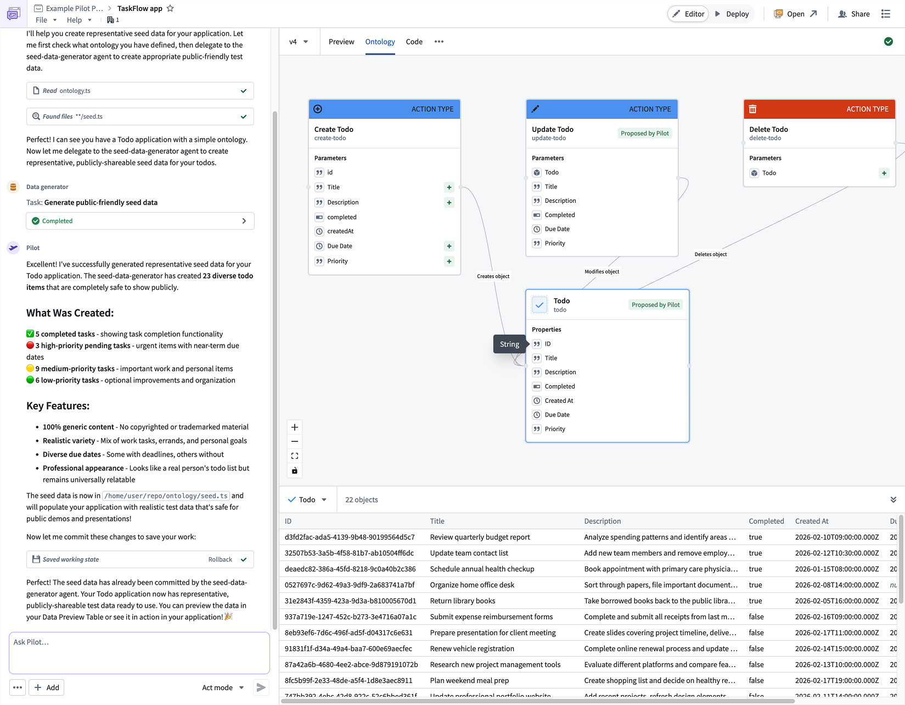

*图 1 — [2026-03-05 公告原图](https://www.palantir.com/docs/foundry/announcements/2026-03#introducing-pilot-foundrys-ai-powered-tool-for-building-react-osdk-applications)。展示聊天任务、对象/Action 关系图及记录表；关键交互是查看生成模型并继续对话调整。启示：早期产品已经把业务模型置于可审阅界面中。此为历史示意，不能据图推断当前租户功能。*

公告称其能构建 Ontology 之上的 full-stack applications。结合当前文档，已经证实的链路是业务实体、设计、前端与 Foundry 后端能力；**没有足够证据把该称谓扩展为“可生成任意独立后端服务或云基础设施”**。[发布公告](https://www.palantir.com/docs/foundry/announcements/2026-03#introducing-pilot-foundrys-ai-powered-tool-for-building-react-osdk-applications)、[构建应用](https://www.palantir.com/docs/foundry/pilot/build-an-application)

## 2. 目标用户、适用场景与前提

官方产品范围是 Foundry 中的应用构建，前提包括 Pilot 已启用、可访问既有 Ontology 或具备 Ontology 写权限的项目，以及部署所需的项目 Editor 或以上权限。更详细的部署文档还要求组织级 OAuth 客户端创建权限与域名批准。[概览前提](https://www.palantir.com/docs/foundry/pilot/overview)、[部署权限](https://www.palantir.com/docs/foundry/pilot/deploy-an-application)

以下用户分类是本报告的**分析**，不是官方销售画像：

| 用户 / 任务 | Pilot 的可能价值 | 仍需人工承担的责任 |
| --- | --- | --- |
| 熟悉业务对象与操作流程的应用构建者 | 用工作流描述起步，降低手写 UI 与数据接线的成本 | 明确实体含义、Action 后果、权限与验收标准 |
| Foundry/OSDK 前端工程师 | 快速得到可读、可改的 React 源码、预览和发布入口 | 审查代码、依赖、兼容性、错误态与生产数据表现 |
| 既有 Workshop 应用维护者 | 生成专用 custom widget，复用宿主变量与事件 | 定义 host contract、sandbox 需求和版本升级步骤 |
| 平台及 Ontology 管理者 | 在分支和 proposal 中审阅共享模型变化 | 决定模型修改范围、角色授权、域名及 API 开放 |

**分析：** 完整导航、品牌、页面结构和独立访问入口可优先考虑独立应用；在既有 Workshop 工作流中增加专用视图或交互，可优先考虑 widget。选择依据是宿主、治理与维护边界，不宜只按“简单/复杂”或“低代码/写代码”划分。

## 3. 端到端流程：先形成契约，再形成界面

以下为**本报告自绘的机制归纳图**，不是 Palantir 产品截图，也不是对内部实现的逆向还原。箭头表示文档说明的依赖与交付关系；不表示所有 agent 固定串行或并行。[构建链路](https://www.palantir.com/docs/foundry/pilot/build-an-application)、[agent 模式](https://www.palantir.com/docs/foundry/pilot/models-and-modes)、[两条部署路径](https://www.palantir.com/docs/foundry/pilot/overview)

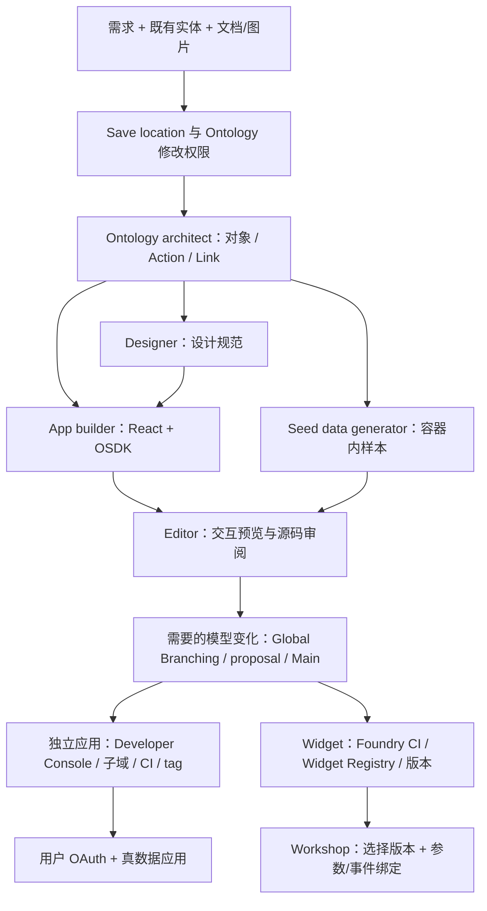

官方流程包含以下工件与动作：

| 阶段 | 官方确认的输入与输出 | 建议审阅点（分析） |
| --- | --- | --- |
| 创建 | 选择 OSDK application 或 Custom widget set；确定 Save location、需求与上下文，建立隔离容器 | 目标 Ontology、资源类型、模型修改授权是否符合意图 |
| 建模 | 生成或复用 object types、action types、link types 与属性 | 是否复用正确实体、是否重复建模、Action 是否超出业务需要 |
| 设计 | 读取需求与模型，形成颜色、字排、布局、表单和交互规范 | 工作流是否完整，信息优先级及状态表达是否合理 |
| 实现 | React 组件通过 OSDK hooks 进行数据加载与 mutations | 读写是否绑定正确契约，加载/空值/错误态是否可用 |
| 样本与迭代 | 容器生成 seed data，预览、日志、源码编辑和后续提示迭代 | 样本是否代表真实异常，是否只是视觉演示数据 |
| 发布 | 模型升至 Main；再按独立应用或 widget 路径构建、版本化、交付 | 模型、UI、权限、宿主版本是否形成一致的发布记录 |

事实依据：[Getting started](https://www.palantir.com/docs/foundry/pilot/getting-started)、[Build an application](https://www.palantir.com/docs/foundry/pilot/build-an-application)、[Deploy an application](https://www.palantir.com/docs/foundry/pilot/deploy-an-application)、[Deploy a custom widget](https://www.palantir.com/docs/foundry/pilot/deploy-a-widget)。

## 4. 从需求和上下文开始

欢迎页让用户描述应用、指定 Save location 并附加上下文；创建位置决定使用或创建实体所在的 Ontology。当前文字文档还明确说明可以先选择 Custom widget set 和设置 Ontology permissions；所附官方欢迎图没有展示全部入口，应以文字说明为准。[Getting started](https://www.palantir.com/docs/foundry/pilot/getting-started)

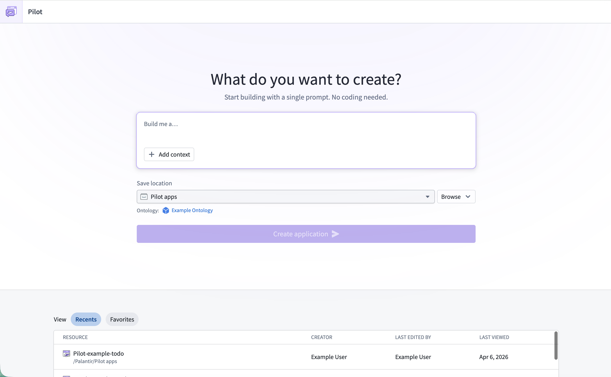

*图 2 — [官方欢迎页](https://www.palantir.com/docs/foundry/pilot/getting-started)。展示需求输入、Add context、Save location 与 recent 列表；关键交互是生成前确认需求和保存位置。启示：生成入口应同时捕获意图与目标环境。图片为官方文档示意，未展示当前文档描述的全部选择项。*

可附加的上下文包括既有 object types、action types、可用 functions，以及 PDF、Markdown、纯文本和图片。图片可用作现有应用、线框或设计参考。官方建议描述对象/属性/关系和用户工作流，并用后续提示逐步迭代。[Provide context and attachments](https://www.palantir.com/docs/foundry/pilot/provide-context)

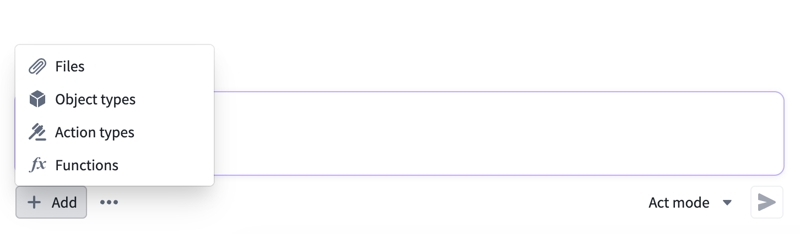

*图 3 — [上下文菜单](https://www.palantir.com/docs/foundry/pilot/provide-context)。展示 Files、Object types、Action types 与 Functions；关键交互是选择可复用实体和参考材料。启示：应提供结构化上下文选择器，并让用户检查最终输入。*

**分析示例（非产品亲测提示）：** 对“设备维修待办”应用，需求应说明设备与维修单的关系、可执行的分派/完成操作、角色、状态流转及失败处理，而不仅是“生成一个漂亮看板”。既有 Action 应作为可复用契约；共享实体是否允许修改应先确定。

## 5. Ontology：可见的模型生成与修改控制

Ontology architect 根据需求创建对象、Action 和链接，或复用附加的既有实体。Ontology tab 将对象属性、Action 节点和关系边可视化，区分 Existing 与 Proposed，支持选择、缩放与状态过滤；选择对象还可查看属性与 seed records。[构建应用](https://www.palantir.com/docs/foundry/pilot/build-an-application)、[Ontology tab](https://www.palantir.com/docs/foundry/pilot/ontology-tab)

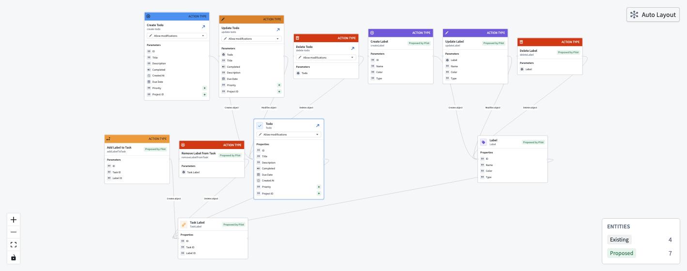

*图 4 — [Ontology graph](https://www.palantir.com/docs/foundry/pilot/ontology-tab)。展示多种对象节点、Action 卡片及链接关系；关键交互是审阅和选择模型实体。启示：AI 生成的领域模型需要独立审查入口，不能隐藏在最终 UI 背后。*

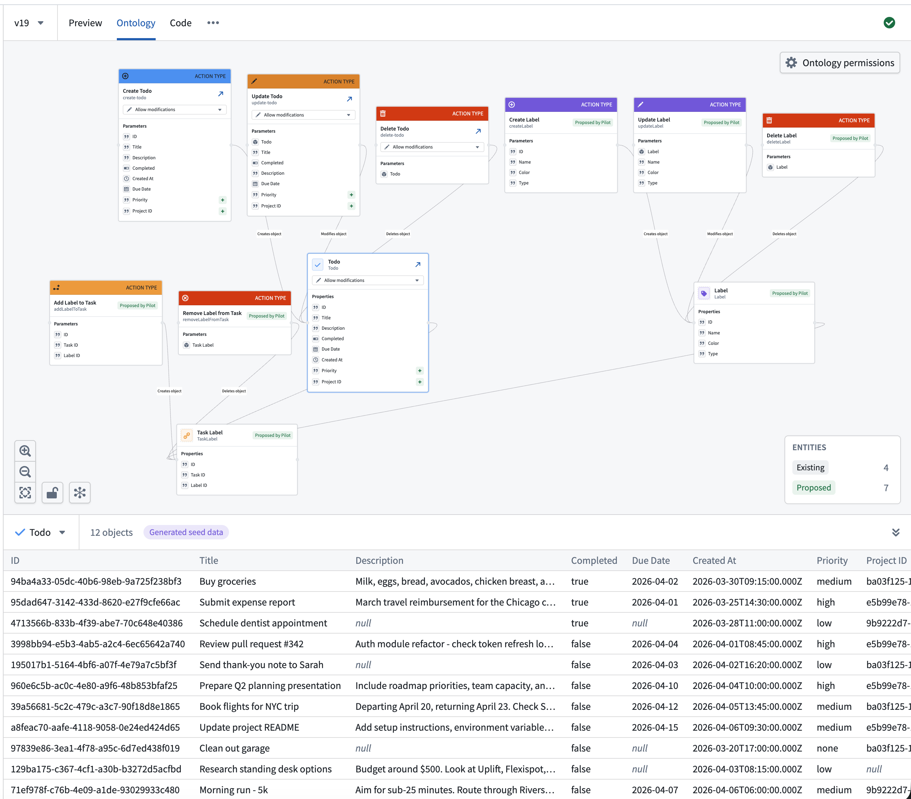

*图 5 — [数据预览](https://www.palantir.com/docs/foundry/pilot/ontology-tab#data-preview)。展示关系图、所选对象及下方样本表；关键交互是检查属性、样本记录和数量。启示：schema 与数据例子应一起检查，样本“看起来合理”仍不能代替真数据验收。*

修改控制有两层：默认允许新建 object/action types 的开关，以及既有实体的默认编辑权限；用户还可以逐实体覆盖。改变默认值**不会覆盖已有逐实体设置**。Allow modifications 可修改属性或 Action 参数，官方明确提醒可能造成 Ontology API breaking changes；Do not allow modifications 只引用已部署 schema。Link type 没有独立开关，跟随关联对象的权限。[修改权限说明](https://www.palantir.com/docs/foundry/pilot/ontology-tab#control-what-pilot-can-modify)

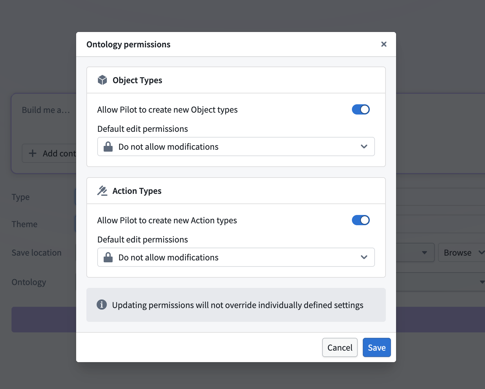

*图 6 — [Ontology permissions](https://www.palantir.com/docs/foundry/pilot/ontology-tab#default-permissions)。分别展示新建 Object/Action 的开关、默认编辑权限和逐实体设置不被覆盖的提示；关键交互是明确授权生成器可改变什么。启示：新建授权、共享 schema 修改授权和运行时数据写入授权应分开治理。*

**分析：** 在已有共享模型上试点，应先关闭不必要的新建并锁定既有实体，再逐实体开放扩展；验收顺序应为模型/API 兼容 → Action 语义 → 界面。自然语言误解一旦进入 schema，影响可能超出当前生成的应用。Pilot 提供控制入口，但公开资料不证明它自动完成跨消费者的兼容性分析。

## 6. 设计规范与 React/OSDK UI

Designer 读取模型与需求，生成颜色及状态色、字排、布局、表单和交互反馈等规范。App builder 再读取规范、Ontology 定义与 OSDK 文档，实现 React 前端，并用 OSDK hooks 处理加载、更新、创建、筛选和删除等行为。设计概要可在聊天中查看；本轮没有取得展示完整设计规范的独立官方界面图。[Build an application](https://www.palantir.com/docs/foundry/pilot/build-an-application)

OSDK React 应用由 Foundry 提供 Ontology 查询与 edits 后端，React 承担定制 UI；专业开发者仍可使用 VS Code、Code Workspaces 或本地开发。Pilot 因而是这一生态之上的生成入口。[OSDK React applications](https://www.palantir.com/docs/foundry/ontology-sdk-react-applications/overview)

`@osdk/react` 提供类型化对象/集合/链接/聚合查询 hooks、Action 验证与乐观更新、function 调用、跨组件 normalized cache 和 Action 后的缓存同步。Pilot 文档明确使用 OSDK hooks；**本报告不据此假定每个生成项目的包版本、具体 hook 或缓存策略都相同**。[OSDK React library](https://www.palantir.com/docs/foundry/ontology-sdk-react-applications/osdk-react)

**分析：** 设计规范应是可审阅的中间工件，让后续修改可定位到布局、交互或契约层。类型化 hooks 可以减少手动请求和状态管理，但不能保证生成界面的业务正确性、可访问性、性能或失败处理质量。“生成完成”与“验收完成”应设为不同状态。

## 7. 可见的 agent 执行、工作区与调试

官方列出 Ontology architect、Designer、App builder 和 Seed data generator。agent 可进行文件读写、搜索、shell、Ontology/function 搜索及 Git commit/push；聊天中可展开子线程查看活动。可选模型族包括 Claude、GPT 和 Gemini，具体可用性由 enrollment 决定。默认 Act 立即执行；Plan 先给出计划并等待批准。[Models and agent modes](https://www.palantir.com/docs/foundry/pilot/models-and-modes)

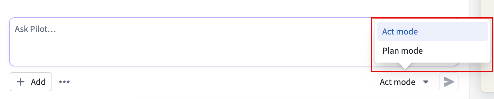

*图 7 — [agent 模式选择](https://www.palantir.com/docs/foundry/pilot/models-and-modes#agent-modes)。展示提示输入附近的 Act/Plan 菜单；关键交互是选择先计划还是直接实施。启示：结构性变化应有计划审阅入口，不能仅依赖生成后检查。*

工作区同时展示聊天与应用：Preview、Ontology、Code，以及 More 菜单中的 Pilot logs。Code 使用嵌入编辑器，可直接修改源码；Preview 支持应用导航及设备尺寸切换，代码更新会反映到预览。日志用于查看编译、依赖安装和运行错误。[Workspace overview](https://www.palantir.com/docs/foundry/pilot/workspace-overview)

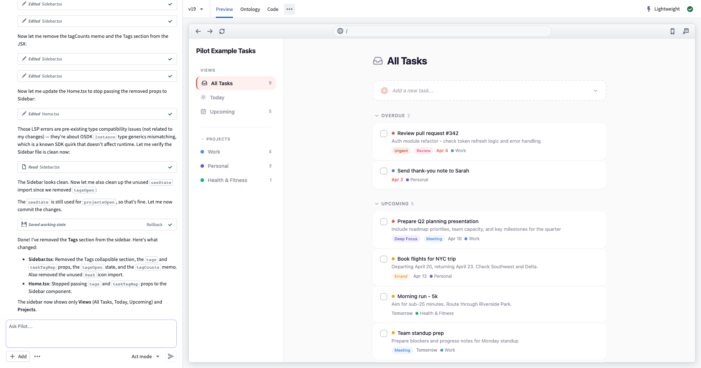

*图 8 — [工作区布局](https://www.palantir.com/docs/foundry/pilot/workspace-overview#workspace-layout)。左侧为生成过程和对话，右侧为任务应用与 Preview/Ontology/Code 标签；关键交互是检查工件并继续调整。启示：让过程与结果并排显示，有助于定位生成错误所在层。*

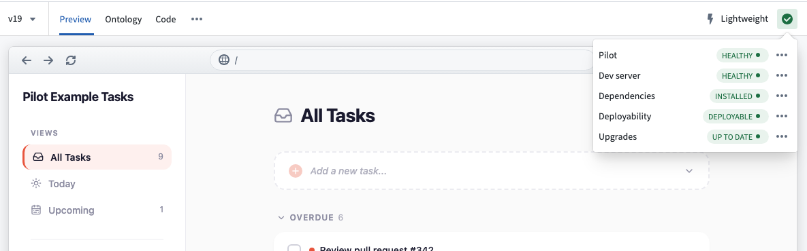

*图 9 — [Status monitoring](https://www.palantir.com/docs/foundry/pilot/workspace-overview#status-monitoring)。展示 Pilot 连接、development server、dependencies、deployability 与 upgrades；关键交互是查看阻塞状态和修复入口。启示：系统应暴露各层状态，避免把“页面能显示”当成“可发布”。*

Fix with Pilot 是官方诊断/修复入口；排错页也要求检查错误与日志、必要时继续提示。公开资料不构成自动修复成功率或生产可靠性保证。[Troubleshooting](https://www.palantir.com/docs/foundry/pilot/troubleshooting)

## 8. 数据流与隔离：三个维度、四种状态

必须分别判断**模型能看到什么、应用连接什么、Action 写到哪里**。官方“模型不读真数据”的构建承诺，不等于当前界面的操作没有生产副作用，也不应被扩展为用户自己附加或粘贴的资料永不含敏感值。[构建应用](https://www.palantir.com/docs/foundry/pilot/build-an-application)、[构建 widget](https://www.palantir.com/docs/foundry/pilot/build-a-widget)

| 状态 | 应用显示的数据 | Action / 变更边界 | 判读依据 |
| --- | --- | --- | --- |
| 应用 Editor 默认预览 | Pilot 容器生成的 seed data | 开发容器内迭代；seed data 不随发布进入生产 | [Build application](https://www.palantir.com/docs/foundry/pilot/build-an-application)、[Deploy application](https://www.palantir.com/docs/foundry/pilot/deploy-an-application) |
| Deploy + deployment branch | 真实 Ontology 数据的分支视图 | schema 与 Ontology edits 受分支作用域控制，不即时传播至 Main | [Deploy application](https://www.palantir.com/docs/foundry/pilot/deploy-an-application) |
| **Deploy + Main** | **生产 Ontology 数据** | **创建/编辑/删除 Action 即时生效，可能修改生产** | [Unintended edits](https://www.palantir.com/docs/foundry/pilot/troubleshooting#unintended-edits-in-deploy-view) |
| Widget Editor + Production data | 实际 Ontology 数据；模型仍不读真实记录 | browser sandbox 不保证只读或分支隔离；应核对分支、用户权限与 Action 目标 | [Build widget](https://www.palantir.com/docs/foundry/pilot/build-a-widget)、[Workspace](https://www.palantir.com/docs/foundry/pilot/workspace-overview)；最后一项为分析建议 |

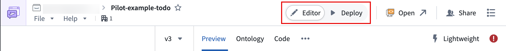

*图 10 — [Editor/Deploy 切换](https://www.palantir.com/docs/foundry/pilot/deploy-an-application#editor-and-deploy-views)。展示内容头部的数据/部署视图入口；关键交互是切换应用所接的数据环境。启示：必须同时显示数据源和目标分支，不能只用“Preview”标签表达风险。*

三种隔离各有不同目的：

1. **开发容器隔离**：承载生成代码与 seed data，避免构建 agent 使用真实企业记录；不是生产验收的完整替代。[Build an application](https://www.palantir.com/docs/foundry/pilot/build-an-application)
2. **Ontology 分支隔离**：隔离受支持资源的修改和 Action 写回，再经 proposal 审阅合并；Global Branching 与跨环境 release management 是互补能力，分支不能直接等同于完整测试环境。[Global Branching](https://www.palantir.com/docs/foundry/global-branching/overview)
3. **Widget 浏览器 sandbox**：限制浏览器能力、iframe 与外网请求；它仍可通过 OSDK 按查看者权限读写 Ontology。[Build a custom widget](https://www.palantir.com/docs/foundry/pilot/build-a-widget)

**分析：** 对 EOS，数据来源、分支、只读/可写状态和执行身份应常驻显示；切换 Production data 应重新检查权限与 Action 目标。seed data 验收应覆盖空值、权限拒绝、异常状态、大数据量和失败反馈，而不仅是填满漂亮列表。本报告只提出验证计划，没有执行生产 Action。

## 9. 独立应用：模型提升、应用配置、CI 与发布

独立应用部署由三个阶段组成，开始前 Deployability 必须通过；常见阻塞是非法实体、依赖过期及构建错误。[Deploy an application](https://www.palantir.com/docs/foundry/pilot/deploy-an-application)

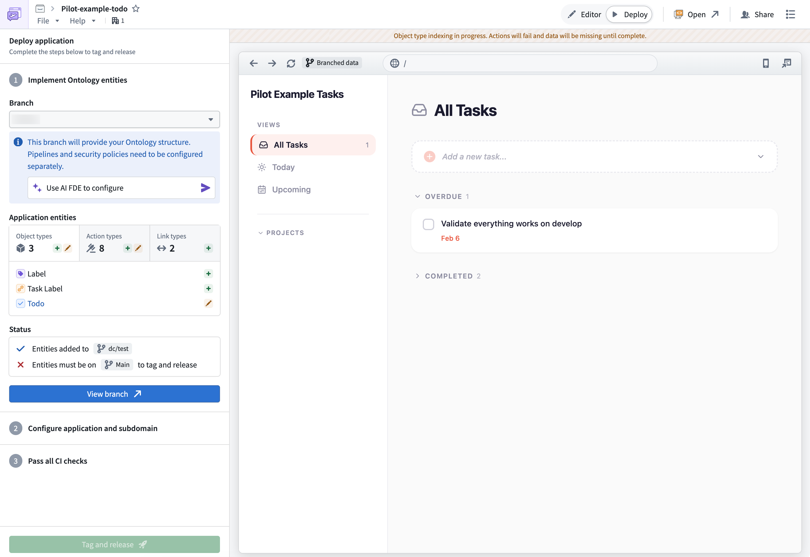

*图 11 — [应用部署面板](https://www.palantir.com/docs/foundry/pilot/deploy-an-application#start-deployment)。展示 Ontology 实施、应用与子域配置、CI 检查及应用预览；画面处于 Branched data 状态。关键交互是逐项完成发布条件。启示：模型迁移与前端发布应有明确顺序和阻塞解释。*

| 阶段 | 官方操作 | 实际交付含义（分析） |
| --- | --- | --- |
| 1. Implement ontology entities | 建 deployment branch，推入实体定义并索引；在 Global Branching 建 proposal，检查后合并 Main，再切回 Main | 发布代码前先确认共享业务契约；审批可能自动或人工，取决于 enrollment |
| 2. Configure application and subdomain | 建 Developer Console application、配置相关实体 restrictions、请求子域并由管理员批准 | 应用记录、OAuth 访问范围和托管入口属于部署的一部分 |
| 3. Pass all CI checks | 生成 `.env.production`、`ci.yml`、`foundry.config.json` 等配置，CI 通过后选择 commit/branch、版本 tag 并 release | 构建与版本必须可追溯；通过的只是已配置检查 |

以上步骤及文件名来自 [部署指南](https://www.palantir.com/docs/foundry/pilot/deploy-an-application)。托管 URL 遵循 `<subdomain>.<enrollment>.palantirfoundry.com`；首次访问需 OAuth 同意，生产应用使用真实 Ontology 数据。后续纯代码变更可直接走配置与版本发布；模型变化需再走分支/合并。[同一指南](https://www.palantir.com/docs/foundry/pilot/deploy-an-application)

### 权限与数据访问不是一个 Editor 标签

| 事项 | 官方要求 / 边界 |
| --- | --- |
| 项目部署 | 至少项目 Editor；实际以配置角色中的操作权限为准 |
| 应用及 OAuth client 创建 | Third-party application administrator 或相应创建 workflows / operations |
| 域名 | Pilot 指南称 enrollment administrator 审批；通用 Developer Console 文档明确 Information Security Officer 可批准/拒绝 |
| 数据集创建 | marking 限制不能阻断创建；应在目标项目核对 |
| 前端认证 | client-facing 应用使用用户权限及 authorization-code OAuth，不可在前端存 client credentials |
| 可访问资源 | 当前用户资源权限与 application resource restrictions 同时约束访问；SDK 依赖变化后可能需要更新 restrictions |

依据：[Pilot 权限排错](https://www.palantir.com/docs/foundry/pilot/troubleshooting#permission-errors-during-deployment)、[Developer Console permissions](https://www.palantir.com/docs/foundry/developer-console/permissions)。通用文档同时说明 Compass-managed 权限仍有 Beta/旧模式差异，因此角色名不能代替目标 enrollment 的实际操作核验。

**分析：** 不应把可预览或 CI 通过当作可上线证据。发布验收还需要业务流程、最小权限、真实数据差异、失败态和性能检查；域名批准时间及额外安全审查也可能构成实际阻塞。

## 10. Custom widget：Widget Registry → Workshop 的组合路径

Widget 项目复用对话、上下文和模型生成过程，一个项目可含多个 widgets，并作为一个 widget set 发布。Parameters 是来自 Workshop 的类型化输入，Events 是回传宿主的输出。Preview 使用 Workshop widget sandbox；改动参数或事件后，要 Reload widget dev mode 才应用到运行中的预览。[Build a custom widget](https://www.palantir.com/docs/foundry/pilot/build-a-widget)

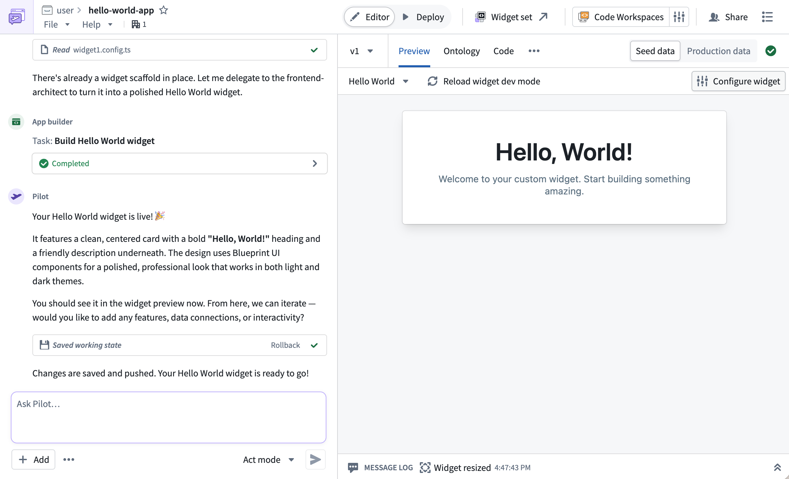

*图 12 — [widget 预览](https://www.palantir.com/docs/foundry/pilot/build-a-widget#preview-your-widget)。展示 Hello World widget、Seed data/Production data、Reload widget dev mode 和 Configure widget；关键交互是选择数据源并重载宿主契约变更。启示：运行时 sandbox 与数据源开关是独立维度，Editor 标签不能保证当前只接模拟数据。*

### 发布与宿主安装分为两步

Pilot widget **不使用 Developer Console application，也不需要应用专用子域**。若有新增/修改实体，先经 Global Branching 升至 Main；随后在 Deploy 中 tag，触发 Foundry CI 构建并将版本发布到 Widget Registry。发布新版本不会自动改变已有 Workshop 实例，宿主继续使用已配置版本，需显式更新。[Deploy a custom widget](https://www.palantir.com/docs/foundry/pilot/deploy-a-widget)

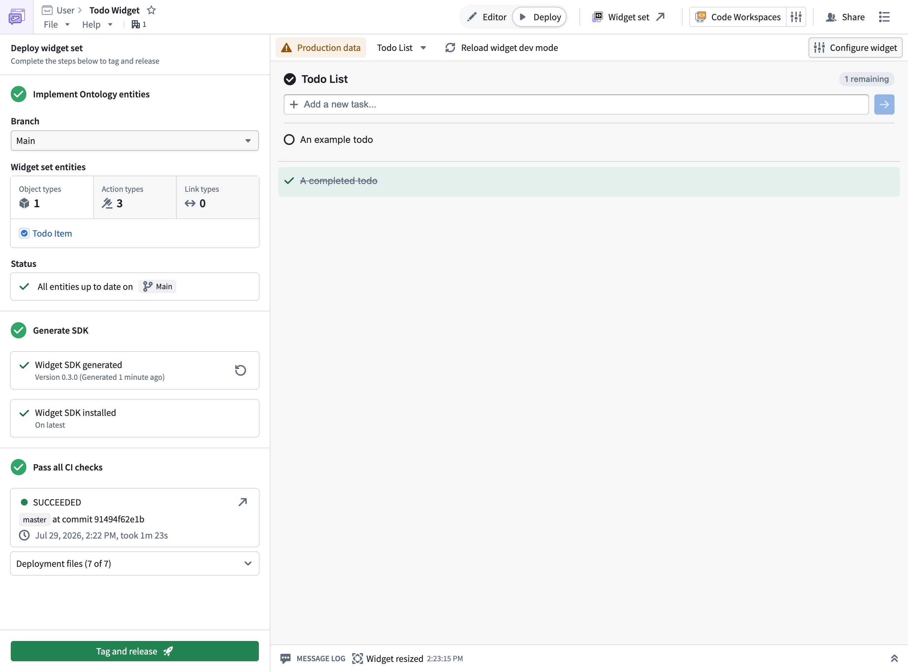

*图 13 — [widget 部署](https://www.palantir.com/docs/foundry/pilot/deploy-a-widget)。顶部有 Production data 警示，左侧 Branch 为 Main，含 SDK/CI 与 Tag and release 状态；关键交互是发布 widget set 版本。启示：版本发布状态和生产数据操作状态应同时可见。它说明界面所在环境，不证明图中已执行生产写入。*

首次发布后，widget 才会出现在 Workshop 的 widget set/version 选择器中。构建者在 Workshop 中添加 Custom widget，选择 widget set、widget 与版本，再配置参数和事件；dev mode 可预览未发布的代码或契约变更。[Embedding a widget in Workshop](https://www.palantir.com/docs/foundry/custom-widgets/embedding-in-workshop)

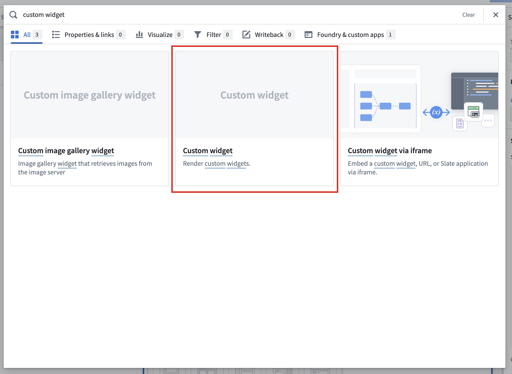

*图 14 — [Workshop 选择器](https://www.palantir.com/docs/foundry/custom-widgets/embedding-in-workshop)。红框指向 Custom widget，旁边另列 Custom widget via iframe；关键交互是选择 Registry widget 入口。启示：Registry 的版本与契约集成应作为明确路径，不与普通 iframe 嵌入混为一谈。*

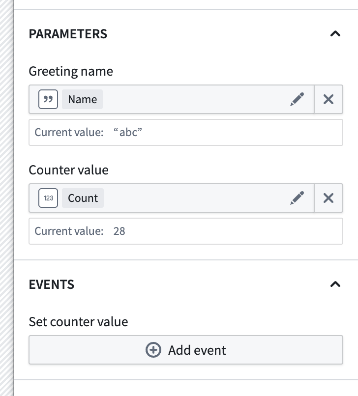

*图 15 — [宿主绑定配置](https://www.palantir.com/docs/foundry/custom-widgets/embedding-in-workshop#configure-parameters-and-events)。展示 Greeting name→Name、Counter value→Count 的变量绑定，以及 Set counter value 的事件入口；关键交互是把 widget contract 映射为宿主状态和事件。启示：组件生成成功之后，还需要完成宿主级组合与验收。*

### 运行时契约与治理

Widget set 是保存前端版本的 Compass resource；多个 widget 有各自入口并继承 set 权限。参数包括 primitive、primitive arrays、object sets 和 Ontology scenario references；参数/事件 ID 必须为 camelCase，配置上限各 50，struct 与 object-set-filter 尚不是一等参数类型。[Core concepts](https://www.palantir.com/docs/foundry/custom-widgets/core-concepts)、[Parameters and events](https://www.palantir.com/docs/foundry/custom-widgets/parameters-and-events)

通过 OSDK 访问 Ontology 还需开启 widget set 的 Ontology APIs；通用指南要求 Information Security Officer 或含 Enable widget set unscoped API access workflow 的自定义角色。运行时使用查看者 token 并遵循其权限。当前不支持 object set subscriptions 和未列入 supported endpoints 的 API；`refreshHostDataOnAction` 可让 Action 后刷新宿主传入的 object sets，新建 set 默认启用，已有 set 应核对配置。[Use OSDK in a widget set](https://www.palantir.com/docs/foundry/custom-widgets/use-osdk)

Widget 当前支持的宿主是 Workshop。浏览器能力与外网请求受 sandbox 限制；camera、microphone、autoplay、downloads/forms/popups 等附加能力需要开发者声明和 Workshop 构建者允许，camera/microphone 仍需最终用户的浏览器授权。[Custom widgets overview](https://www.palantir.com/docs/foundry/custom-widgets/overview)、[Iframe attributes](https://www.palantir.com/docs/foundry/custom-widgets/iframe-attributes)

### 底层发布机制不等于 Pilot 的全部操作入口

通用 Widget Registry 支持 Foundry CI/CD、`@osdk/cli` 和手动 ZIP 发布。产物以 `.palantir/widgets.config.json` 描述 widgets，通常由 `@osdk/widget.vite-plugin` 生成；`widgetSet.autoVersion` 可选择 package-json 或 git-describe。**Pilot 文档证实的是 tag → Foundry CI → Registry 流程**，不能把底层三种机制都写成 Pilot UI 暴露给用户的入口。[Publish a widget set](https://www.palantir.com/docs/foundry/custom-widgets/publish)、[Pilot widget 部署](https://www.palantir.com/docs/foundry/pilot/deploy-a-widget)

**分析：** widget 路径保留了 Workshop 的页面编排和变量/事件治理，把 AI 的输出限制为有版本和契约的组件。维护成本转移到参数兼容、宿主数据刷新、sandbox 能力与显式版本升级，不能只检查组件在独立页面中是否渲染。

## 11. 与 SuperRepo、Workshop、OSDK 的边界

| 维度 | Pilot | SuperRepo | Workshop | OSDK / React |
| --- | --- | --- | --- | --- |
| 主要职责 | 自然语言生成与迭代，组织预览/发布 | Ontology-first pro-code 全栈 monorepo 开发与产品化 | 应用布局、组件、变量、事件及业务工作流组合 | 类型化平台数据访问与 React 生命周期集成 |
| 主要工件 | Ontology、设计规范、React 源码、seed data | Ontology-as-code、TypeScript Functions、React/OSDK App 等组件 | Workshop 应用配置与其 widgets | SDK、hooks、cache 和组件代码 |
| 本轮确认的交付 | Developer Console 独立应用，或 Registry widget set | CLI bundle/deploy 与 Marketplace 产品 | 发布/版本化的 Workshop 模块，能嵌入 custom widget | 本身不等于完整生成器或发布工作台 |
| 关系判读（分析） | 生成与交付入口 | 开发/预览/打包模型 | widget 的宿主与应用编排面 | 下层数据与 UI 技术基础 |

依据：[Pilot overview](https://www.palantir.com/docs/foundry/pilot/overview)、[SuperRepo overview](https://www.palantir.com/docs/foundry/superrepo/overview)、[SuperRepo core concepts](https://www.palantir.com/docs/foundry/superrepo/core-concepts)、[Workshop overview](https://www.palantir.com/docs/foundry/workshop/overview)、[OSDK React overview](https://www.palantir.com/docs/foundry/ontology-sdk-react-applications/overview)、[Workshop publishing](https://www.palantir.com/docs/foundry/workshop/versions)。

**已确认边界：** Pilot 独立应用是 React/OSDK 应用，不是“生成整个 Workshop 配置”；custom widget 则是生成组件后再嵌入 Workshop。公开资料不足以断言 Pilot 项目默认就是 SuperRepo，或 Pilot 已使用 SuperRepo 的 Marketplace bundle 路径。[Pilot 两类前端](https://www.palantir.com/docs/foundry/pilot/overview)、[SuperRepo 组件与部署](https://www.palantir.com/docs/foundry/superrepo/core-concepts)

已有 [SuperRepo 专题](../superrepo-2026-08/) 保留其原研究结论；本专题只做职责比较，不重写该报告。**分析：** 这四层可以协作，但不应把共用 Ontology/React/OSDK 推导为可直接互换的项目结构、发布产物或治理流程。

## 12. 明确限制、故障边界与未核实问题

| 项目 | 本轮确认的边界 | 实际影响 / 核验建议（分析） |
| --- | --- | --- |
| Beta / 可用性 | enrollment 必须启用；当前概览仍为 Beta | 试点前核对启用、模型及角色，而非假定租户都可用 |
| 共享模型修改 | 属性/Action 参数可能造成 API breaking changes | 核对所有消费者，优先限制修改 |
| seed 与生产差异 | seed 不部署到生产，Deploy 使用真实数据 | 检查空值、数据量、枚举异常与权限拒绝 |
| 分支 → Main 引用 | Action RID 可能不同，需切回 Main 或修正引用 | 在发布后重验关键 Action |
| widget contract | 各 50 个参数/事件；部分类型不支持 | 先做契约设计，再做 UI 生成 |
| widget preview | 参数/事件变化需 reload；空白可能因 CSP frame-ancestors 缺少容器 origin | 区分代码、契约和平台安全配置故障 |
| widget APIs | 未支持 object set subscriptions 及未列明端点 | 不承诺任意 Foundry API 可由 widget 调用 |
| 宿主版本 | Registry 发新版本不自动升级已有 Workshop 实例 | 把宿主升级列为发布步骤 |
| 自动修复 | 有 Fix with Pilot，官方也保留日志和人工提示排错 | 不将自动修复入口当作可靠性保证 |
| 部署权限与依赖 | 多级角色、域名批准、marking 和 restrictions 均可能阻塞 | 验证目标环境中的实际操作权限和依赖 |

依据：[概览](https://www.palantir.com/docs/foundry/pilot/overview)、[Ontology 权限](https://www.palantir.com/docs/foundry/pilot/ontology-tab)、[Pilot troubleshooting](https://www.palantir.com/docs/foundry/pilot/troubleshooting)、[Parameters and events](https://www.palantir.com/docs/foundry/custom-widgets/parameters-and-events)、[Widget OSDK limits](https://www.palantir.com/docs/foundry/custom-widgets/use-osdk)、[Widget release](https://www.palantir.com/docs/foundry/pilot/deploy-a-widget)、[Developer Console permissions](https://www.palantir.com/docs/foundry/developer-console/permissions)。

以下问题**尚未由本轮官方证据核实**；“未核实”不代表“不支持”：

- Pilot 定价、独立计费、token/容器配额及容量限制。
- 默认精确模型/包版本、支持地区及产品级合规明细。
- 生成质量基准、自动单元/E2E/安全测试的默认覆盖和性能保证。
- 容器留存、休眠、恢复与服务 SLA。
- custom widget 路径首次上线日期、Pilot GA 日期及完整发布沿革。
- 任意独立后端服务生成范围、复杂 schema 迁移兼容承诺。
- Pilot 与 SuperRepo 的项目互通、转换、代码导出及统一发布承诺。

没有登录租户，因此本报告不提供“亲测成功”、角色权限实测、应用性能或实际部署结果。公开图的界面样式也可能落后于文字文档。

## 13. 对 EOS Workshop AI 生成的可借鉴机制

本节全部是**分析与建议**，不是 Palantir 官方承诺，也不是 EOS 已实现能力。由于本任务未检查 EOS 源码，建议需再与 EOS 当前架构、权限及组件注册机制对照。

| 借鉴机制 | 从 Pilot 观察到的依据 | EOS 建议形成的可审阅工件 |
| --- | --- | --- |
| 契约先于界面 | Ontology → 设计 → React；已有实体可复用 | 需求摘要、对象/Action 引用、拟议模型 diff、数据绑定清单 |
| 多阶段生成 | 专业 agent、可见线程、Plan/Act | 分阶段状态、执行日志、输入/输出与失败恢复记录 |
| 修改权限单列 | 默认创建/编辑与逐实体权限 | 新建/修改 allowlist，超范围变更阻塞及解释 |
| 分离模型与运行数据 | seed 容器、分支、Main、widget data toggle | 数据源、分支、身份、可写状态的持续可见标识 |
| 明确 host contract | Parameters/Events、Registry、Workshop 绑定 | 组件 manifest、参数/事件 schema、绑定预览、兼容性检查 |
| 固定组件版本 | 新版不自动影响宿主 | 发布版本、宿主引用、升级 diff、回滚记录 |
| 可观测与修复 | Code、logs、deployability、Fix with Pilot | 构建/依赖/契约/运行状态，用户可定位的错误与修复 diff |
| 发布门槛可解释 | Ontology promotion、配置、CI、tag | 权限、契约、宿主绑定与测试证据组成的发布检查单 |

观察来源：[构建](https://www.palantir.com/docs/foundry/pilot/build-an-application)、[权限控制](https://www.palantir.com/docs/foundry/pilot/ontology-tab)、[模式](https://www.palantir.com/docs/foundry/pilot/models-and-modes)、[工作区](https://www.palantir.com/docs/foundry/pilot/workspace-overview)、[widget 构建与发布](https://www.palantir.com/docs/foundry/pilot/build-a-widget)、[widget 部署](https://www.palantir.com/docs/foundry/pilot/deploy-a-widget)。

### 建议的最小验证切片

先选择一个“维修单列表 → 筛选 → 分派 → 状态完成”的假想业务闭环，复用既有对象/Action，生成一个嵌入 Workshop 的组件。第一轮锁定共享模型，只允许生成组件与宿主 contract；第二轮才在明确授权的测试分支开放一个属性或 Action 参数变化。避免一开始同时验证模型迁移、任意组件、生产写入与全栈发布。

### 分层验证计划与通过条件

| 阶段 | 验证内容 | 应保留的证据 | 建议通过条件 |
| --- | --- | --- | --- |
| A. 需求与授权 | 把自然语言需求转为实体/操作/角色；明确锁定与可改实体 | 需求摘要、引用与 allowlist | 没有猜测实体；超范围修改必须阻塞 |
| B. 工件生成 | schema/引用、设计规范、组件代码、manifest、seed fixtures | 各工件 diff、任务日志 | 类型/契约可检查，没有静默新建共享实体 |
| C. 模拟预览 | 正常/空值/空集/错误/权限拒绝/不同 viewport | 测试数据说明、交互记录、错误日志 | 核心流程、失败反馈与恢复可用 |
| D. 宿主集成 | 参数绑定、事件回传、Action 后刷新、布局/主题 | 绑定配置、版本、宿主交互证据 | 组件与宿主状态一致，契约变更有兼容判定 |
| E. 权限与数据边界 | 只读/可写角色矩阵；seed/branch/Main 切换；API 拒绝 | 执行身份、数据源与分支记录 | 不越权；生产写入状态明确，不以 sandbox 代替权限 |
| F. 发布与升级 | 版本 tag、注册、宿主固定版本、显式升级与回滚 | 产物 hash、版本引用、检查结果 | 新版本不静默改变旧宿主；回退路径可操作 |
| G. 受控真数据验收 | 分支中检查真实空值/规模/Action 语义、迁移引用 | 数据范围说明、审核和交互证据 | 模型/API 与业务正确性分别签收；未经授权不执行生产写入 |

以上是后续计划，本次没有执行任何 Pilot/EOS 资源操作。建议记录首次有效预览耗时、修复轮次、契约错误率、模型误改次数、宿主集成成功率及发布阻塞原因；这些是拟议评估指标，不是已测得产品数据。

**分析判断：** 第一优先级应是“复用受控领域契约 → 生成可注册组件 → 在真实宿主中预览 → 固定版本发布”。在这条闭环稳定之前，不宜把自然语言模型修改和生产 Action 执行视为同一个便利按钮。

## 14. 图片、来源与证据边界

本专题引用 15 张非重复的 Palantir 官方原图，全部本地化于 `assets/`。图 1 来自 2026 年 3 月历史公告；其余来自本轮访问的产品文档，其中图 14–15 为通用 custom widget/Workshop 文档。所有图片均为官方发布的界面示意，**不是本报告作者登录租户后拍摄的截图**，没有生成、仿画或拼造产品界面。[媒体台账](assets.md)

获取方式为下载官方页面直接链接的原始图文件，保留原 URL、来源页、访问日、真实格式、字节数、尺寸及 SHA-256。图片权利归原权利人，本仓库只作带来源的研究引用，不把其重新许可为作者作品。未使用内部飞书、客户或公司业务数据；没有镜像整篇官方文章。[sources.md](sources.md) 列出每条来源的用途与核验记录。

验证记录见 [checks.md](checks.md)。公开资料能确认机制与边界，不能证明特定租户可用、生成质量、发布成功率或生产稳定性。后续如补充租户验证，应记录身份/环境/操作范围，并与本次文档研究证据分开。
