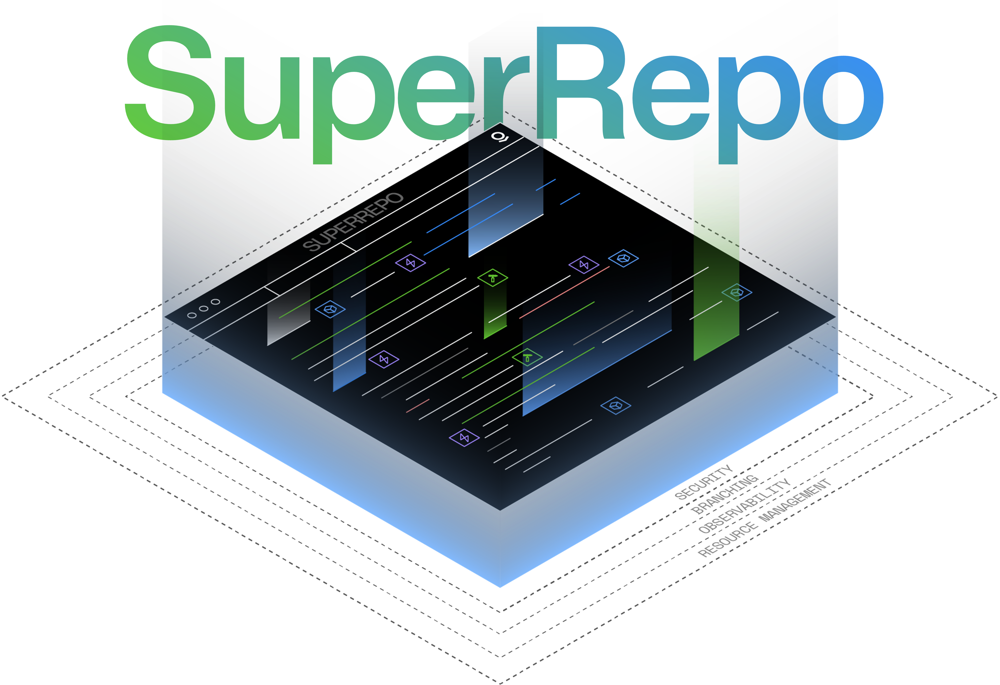
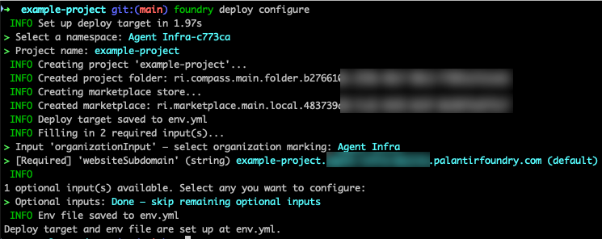
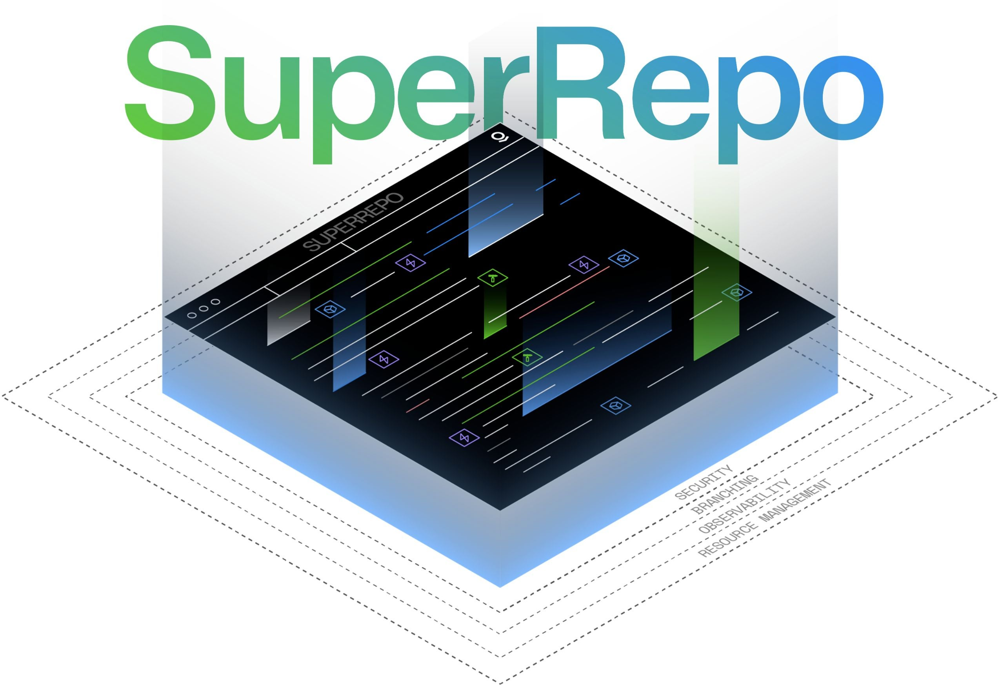

# SuperRepo：Foundry 的 Ontology-first 全栈 Monorepo

> 状态：已完成（基于公开资料）
> 最后核验：2026-09-03
> 产品状态：Beta；功能、可用性与支持范围均可能变化。



## 一句话结论

SuperRepo 不是一个独立的开源框架或通用 monorepo 工具；它是 Palantir Foundry 的一套 **Ontology-first、pro-code 全栈交付模型**。一个仓库可把 Ontology 定义、TypeScript Functions 与 React/Ontology SDK 应用组织成同一个可预览、构建、版本化和部署的产品包。

它的关键价值是把以前跨越“领域模型 → 后端函数/动作 → 前端”的改动收敛为同一条本地开发循环，并在部署时生成可安装的 Marketplace 产品。其关键前提也是 Foundry：CLI、Embedded Ontology、OSDK 生成、签名包和 Marketplace 安装链路属于平台能力，不能等同于一个可脱离 Foundry 自建的开源方案。

## 已确认事实

| 主题 | 公开资料确认的内容 | 对工程的含义 |
| --- | --- | --- |
| 定位 | 2026-08-04 发布为 Beta；面向围绕 Ontology 的复杂全栈应用 | 应以试点能力看待，不应假设 API 或流程稳定 |
| 组件 | 默认项目可以声明 `ONTOLOGY`、`TYPESCRIPT_FUNCTIONS`、`APP` 三类组件 | 模型、函数与 UI 被作为一个产品的组成部分 |
| 本地预览 | Foundry CLI 在本地启动 Embedded Ontology、函数预览运行时与应用；其行为是对真实 Foundry 的近似 | 可以做跨层集成验证，但不能把本地结果当作完整生产等价证据 |
| 类型契约 | Ontology-as-code 变化会触发本地 OSDK 绑定再生成，函数与应用直接消费 | 消除了“改模型后先发布/再等待 SDK”的一段人工链路 |
| 既有模型 | 已存在的 Ontology 实体可用 `foundry import ontology` 导入；导入元数据会写入应提交的 lock 文件 | 可渐进接入，不要求先把所有 UI 建模迁移为代码 |
| 构建与部署 | `foundry.yml` 发现组件；可使用默认工具链或自带构建系统；产物可打包为 Marketplace 产品 | Nx/Turborepo/pnpm workspace 可承担任务编排，但不能替代 Foundry 语义与交付链路 |
| 外部 CI | 源码可以托管在平台外，并通过终端或 CI（文档举例 GitHub Actions、CircleCI）用 Foundry CLI 部署 | GitHub 是代码与 CI 宿主，不是 Foundry 部署能力本身 |

## 工作流与架构

```text
 TypeScript Ontology-as-code
            │  change / watch
            ▼
      Local OSDK generation
          ┌─────┴─────┐
          ▼           ▼
 TypeScript functions  React / OSDK app
          │           │
          └─────┬─────┘
                ▼
        Embedded Ontology preview
                │
                ▼
  foundry bundle → signed Marketplace product → foundry deploy
```

默认的 `foundry.yml` 以组件清单描述项目形状；教程示例包含 Ontology、TypeScript Functions 与 App。组件可增删或重复，CLI 据此协调预览和构建。文档明确表示可以自带构建系统：因此 SuperRepo 和 Nx 并非互斥关系——前者持有 Foundry 组件语义、预览与产品化，后者可负责任务图、缓存或包管理生态。



部署时，`foundry deploy configure` 可写出 `env.yml`，以环境文件映射安装输入；`foundry bundle --project-version <VERSION>` 则生成以语义化版本标识的产品产物。产品可经 Marketplace 安装至一个或多个 Foundry enrollment。

## 开发体验：真正缩短的是哪一段

1. 以 TypeScript 定义或导入 Ontology 实体（对象、链接、接口、动作等）。
2. CLI 监听 Ontology 变更并重新生成本地 OSDK 类型。
3. Functions 使用这些生成类型；函数支持的动作经 Embedded Ontology 路由。
4. React/Ontology SDK 应用在同一套本地服务上预览。
5. 集成测试可覆盖模型、函数和 UI 的一条跨层路径；随后打包、签名并由 CI 或平台完成部署。

这不是“任意 React 项目在本地连一个模拟 API”。Embedded Ontology 在文档中被明确为行为近似，并且启动时会使用 seed data 填充新的本地数据库；权限、真实数据、外部依赖与线上运行时仍须单独验证。



## 能力边界与风险

### 当前应视为支持的核心

- Ontology-as-code 与已有 Ontology 的导入。
- TypeScript v2 Functions。
- React / Ontology SDK 应用。
- Foundry CLI 本地预览、打包与 Marketplace 部署。
- 由外部 CI 承载的构建、版本化和部署流程。

### 官方列为“开发中”或尚不可用的方向

公告列出了 Python Functions、Agent Engine/Agent SDK、外部数据源、Automate 与数据管道为后续方向。因而不宜将 SuperRepo 目前描述为覆盖 Foundry 全部资源的统一仓库模型，也不应承诺 PySpark Transform、Compute Module、Workshop、Object View 或 Widget Set 已作为 SuperRepo 一级组件；公开的组件模型与教程并未给出这些结论。

### 需要在试点中补齐的验证

- Embedded Ontology 与目标 enrollment 的动作、权限、数据与失败行为差异。
- 生成 OSDK 的变更审查、lock 文件更新和兼容性策略。
- Marketplace 输入、`env.yml` 与多环境配置的密钥/敏感值管理。
- 从 GitHub Actions 调用 Foundry CLI 的身份、发布审批、回滚和审计证据。
- Beta 版本更新对 `foundry.yml`、CLI 版本与模板的影响。

## 与常见工具的职责比较

| 能力 | SuperRepo | Nx / Turborepo / pnpm workspace |
| --- | --- | --- |
| 组件语义 | 识别 Foundry Ontology、Functions、App | 识别包、任务与依赖图 |
| 领域模型契约 | Ontology-as-code 与自动 OSDK | 不提供平台领域模型 |
| 本地全栈模拟 | Embedded Ontology 与 Foundry preview runtime | 通常由项目自行实现 |
| 交付物 | 可签名的 Marketplace 产品 | 构建产物、容器或静态站点等 |
| 环境安装 | Foundry CLI / Marketplace | 由自建 CD 或第三方平台完成 |

因此，SuperRepo 最适合被理解为“Foundry 垂直集成开发面”，不是 Nx 的替代品。团队依旧可以采用熟悉的 monorepo 编排工具，但需要让 Foundry CLI 保持对 Ontology、OSDK、bundle 与 deploy 的权威性。

## 对 EOS / Workshop 方向的可借鉴点

以下是架构类推，不是 Palantir 官方承诺：

1. **把领域契约作为首级工件。** 当 Object Type / Link / Action 的定义可版本化并能生成消费者类型时，前后端联调的等待点显著减少。
2. **让跨层预览拥有明确边界。** 可以构造与 Ontology、Function、App 一起启动的开发闭环，但必须标记模拟数据、鉴权、网络与生产行为的差异。
3. **把变更的交付单位提升为“产品”。** 一项同时改变模型、操作和 UI 的功能，应该有一个可追溯版本与环境映射，而不是三条松散发布链。
4. **将导入与锁定显式化。** 对既有模型的依赖应像 SuperRepo 的 import metadata 一样可审阅、可复现，避免运行时悄然漂移。
5. **保留现有工具职责。** Workshop、Object View、Widget 与微前端运行时不必为了“统一”而强行迁移；先定义适配边界和可验证的端到端场景。
6. **优先做一个跨层试点。** 选择一个对象类型变更 + Function/Action + React 消费的闭环，建立生成契约、预览、CI 和 Hosted 验收的分层证据后，再扩展范围。

## 参考图片

本专题将直接支撑研究结论的 3 张 Palantir 官方图片本地保存于 `assets/`。来源 URL、文件大小、SHA-256、获取日期和使用说明见 [assets.md](assets.md)。这些图片的版权与商标权利仍归原权利人；本仓库只作带来源的研究引用。

## 来源与证据边界

本报告以 Palantir 官方公告和文档为一手资料。逐条链接及各自可支撑的主张见 [sources.md](sources.md)。除明确标注为“对 EOS / Workshop 的可借鉴点”的内容外，正文均为这些资料的中文概括，而非功能保证或实施说明。
