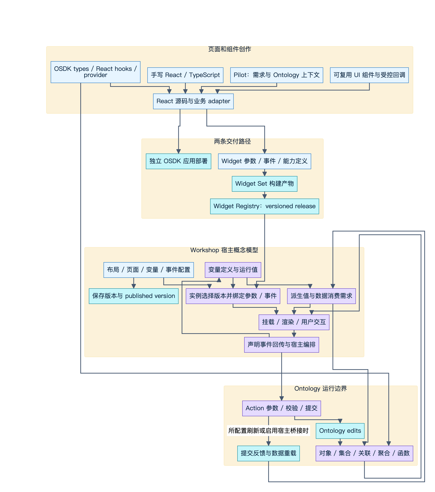
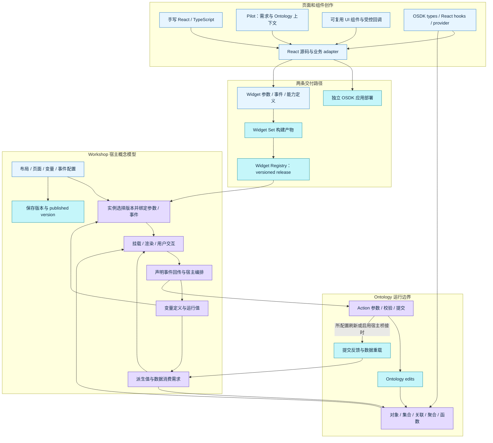
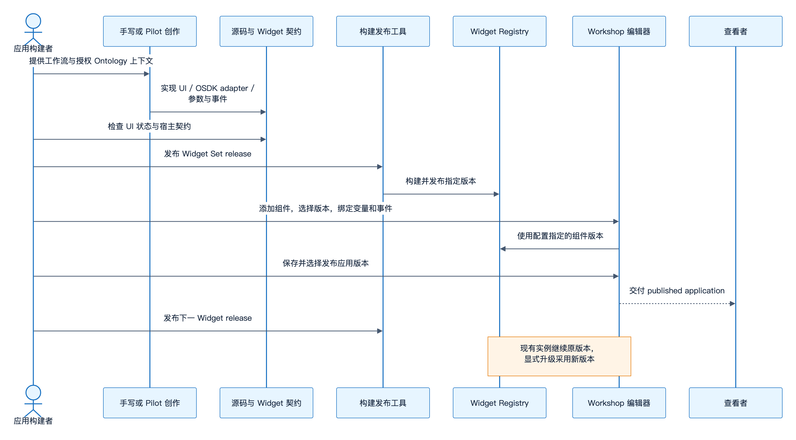
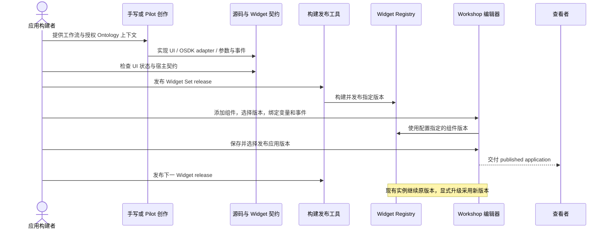
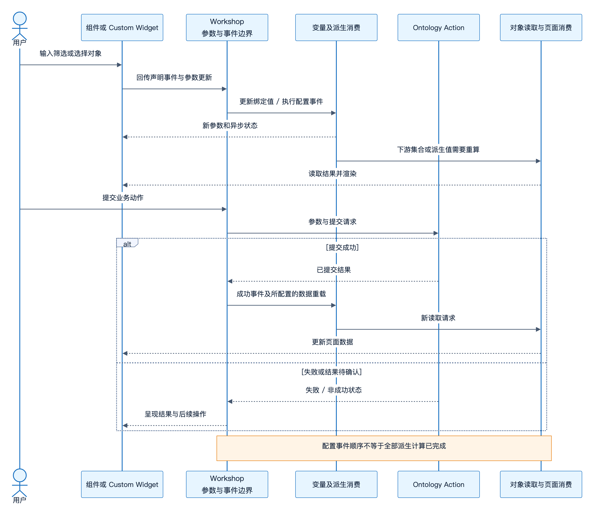
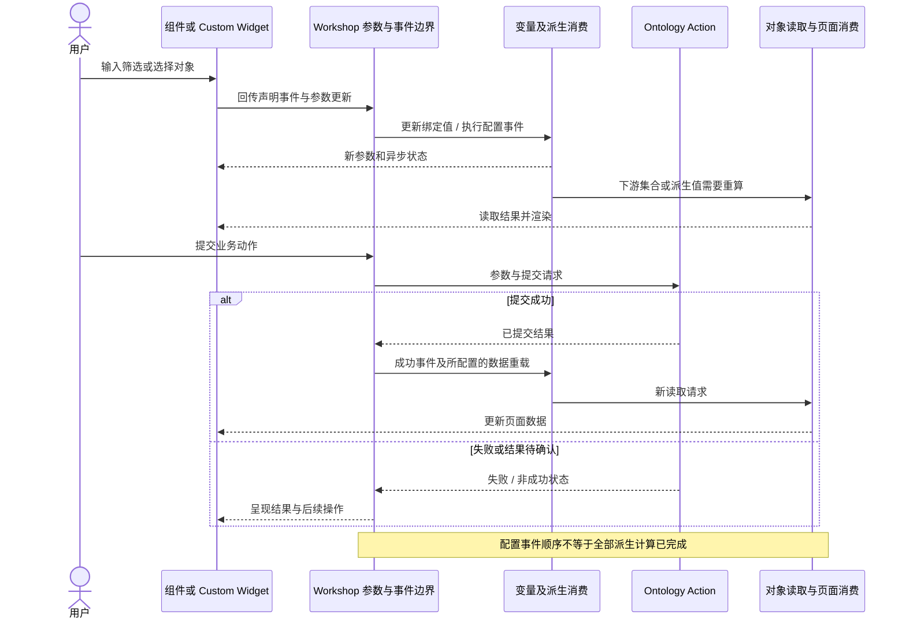

# Workshop 宿主运行机制：从 React 与 OSDK 到页面编排、数据写回和版本治理

> 公开研究草稿，待内容审阅及独立 draft PR。核验日期：2026-10-01。
> 主体证据：Palantir 官方产品文档、公开 OSDK 源码及既有专题的固定版本研究。未登录 Foundry 租户，未执行真实业务 Action、Registry 发布或性能测试。另附经项目负责人明确授权公开的 EOS 现状对照；源码仅用根目录相对路径引用，不包含原始源码包、个人信息或内部服务地址。

## 阅读目标

应用架构研究需要连接三种产物：React 源应用、可嵌入 Widget Set，以及 Workshop 中的布局/变量/事件配置。它们能复用部分 UI 和业务数据契约，却有各自的发布、身份、状态与权限边界。本文用总架构和两条端到端序列说明这些边界，再深入宿主变量、事件、数据加载与保存语义。

Workshop 以对象数据组织 operational applications，用 Actions 写回、Functions 表达业务逻辑、Derived properties 构造运行计算值；布局和事件提供交互编排。[Workshop overview](https://www.palantir.com/docs/foundry/workshop/overview/)

阅读顺序：本正文 → [变量与事件](variables-events.md) → [数据、Actions 与版本](data-actions-versioning.md) → [来源矩阵](sources.md)与[验证边界](checks.md)。既有 [Pilot](../pilot-2026-09/README.md)、[OSDK TypeScript](../osdk-typescript-2026-09/README.md)、[OSDK React Components](../osdk-react-components-2026-09/README.md)、[AI FDE](../ai-fde-2026-10/README.md)解释生成和库能力；[Custom Widgets](../custom-widgets-2026-10/README.md)解释宿主协议与发布包。本次展开它们进入 Workshop 后的运行职责，不重做其协议探针或组件图鉴。

## 1. 总架构：来源、交付、宿主和业务执行

*基于公开资料的概念归纳，并非官方内部结构；[可缩放SVG](diagrams/01-public-lifecycle.svg)。*

查看可编辑Mermaid源

这是公开产品关系的概念图，不是 Palantir 闭源服务拓扑。图中“配置”不宣称已获得完整 Workshop canonical DSL/schema；“数据重载”也不表示已知宿主缓存键、TTL或存储实现。独立应用部署和 Widget Registry 是两条路径，不要求所有 React 应用经过 Registry。[Pilot application deployment](https://www.palantir.com/docs/foundry/pilot/deploy-an-application/)、[Pilot widget deployment](https://www.palantir.com/docs/foundry/pilot/deploy-a-widget/)

## 2. 手写或 AI 生成页面：复用的是哪些契约

Pilot 的应用创建会形成 Ontology、设计规范和源应用；提供已有 Ontology 上下文可避免生成重复实体。其设计说明包含视图布局、主题和交互。Widget 模式则生成嵌入 Workshop 的组件，并定义 typed parameters 和事件。[Build an application](https://www.palantir.com/docs/foundry/pilot/build-an-application/)、[Build a custom widget](https://www.palantir.com/docs/foundry/pilot/build-a-widget/)

`@osdk/react` 把 typed Ontology client 接到 React 生命周期，提供对象/集合/关联/聚合、Action与函数 hooks，并共享 normalized cache及Action后同步。`@osdk/react-components` 在其上提供表格、筛选、表单与媒体等界面，可组合自有组件或下探 hooks。[OSDK React](https://www.palantir.com/docs/foundry/ontology-sdk-react-applications/osdk-react/)、[OSDK React components](https://www.palantir.com/docs/foundry/ontology-sdk-react-applications/osdk-react-components/)

Widget 内 OSDK 在运行时使用当前用户的 token 并遵守其权限；官方要求以 `window.location.origin` 配置 client，并使用 Widget token provider。此宿主认证上下文是组件交付契约的一部分：独立应用与 Widget 的认证配置不能因为复用同一 React UI 就直接互换。[Configure OSDK in a widget](https://www.palantir.com/docs/foundry/custom-widgets/use-osdk/#configure-the-osdk-in-your-widget)

应分别记录以下契约；表中是研究组织和设计建议，不是新增官方 API：

| 契约 | 应明确的输入与输出 | 不能混同的边界 |
|---|---|---|
| UI 组件 | props、受控值、回调、加载/空/错误、键盘/主题 | React callback本身不是可序列化宿主事件 |
| OSDK 数据 | generated types、对象身份、集合查询、Action结果 | 高码数据 cache不自动等于Workshop宿主cache |
| Widget Host | 参数类型、事件及回传值、异步参数状态、能力 | 能构建并不证明真实宿主授权和绑定验收 |
| 页面编排 | 变量定义、组件输入输出、布局状态、交互事件 | 参数更新不等于所有下游求值同步完成 |
| 发布治理 | 源修订、组件release、实例采用版本、应用发布版本 | Widget发布不自动切换既有Workshop实例 |

Custom Widget 的公共客户端和 React adapter 细节见[协议](../custom-widgets-2026-10/protocol-api.md)与[adapter](../custom-widgets-2026-10/react-adapter.md)。固定源码 [`client.ts`](https://github.com/palantir/osdk-ts/blob/fb8ec172d540ef7819382ff036aa2a692614af75/packages/widget.client/src/client.ts) 的可观察边界是宿主注入 API；不能将其当成整个 iframe transport 已开源。本文图中的“回传”止于这个公共契约，不补造底层消息或 origin 校验。

## 3. 创作到发布：源码和页面配置分别治理

*基于公开资料的概念归纳，并非官方内部结构；[可缩放SVG](diagrams/02-widget-release.svg)。*

查看可编辑Mermaid源

Pilot 的 tag release 触发 Foundry CI 后进入 Registry；已有实例保持所配置版本。若创作提出了 Ontology变更，需先按部署流程将实体提升到 Main。[Deploy a custom widget](https://www.palantir.com/docs/foundry/pilot/deploy-a-widget/)。外部源码、Vite manifest、CLI/ZIP和dev mode路径沿用[构建发布专题](../custom-widgets-2026-10/build-release.md)及[官方发布文档](https://www.palantir.com/docs/foundry/custom-widgets/publish/)，本次没有实测这些平台动作。

生产预览本身可能执行业务写入。Pilot application deploy view 在Main执行的Action立即影响Main，deployment branch预览的修改只在该分支；不能只看到“preview”名称便把它理解为禁写。[Deploy an application](https://www.palantir.com/docs/foundry/pilot/deploy-an-application/)

## 4. 宿主怎样让页面联动

宿主研究的中心是变量、组件输出、派生关系、事件和生命周期的组合。组件既消费变量，也把选择或输入写回变量；布局可由变量驱动。详细类型、筛选形状、模块接口和事件传播规则见[变量与事件附录](variables-events.md)。

*基于公开资料的概念归纳，并非官方内部结构；[可缩放SVG](diagrams/03-runtime-action.svg)。*

查看可编辑Mermaid源

这是组合场景示意：Custom Widget参数/事件来源见[官方参数指南](https://www.palantir.com/docs/foundry/custom-widgets/parameters-and-events/)；事件顺序和Action回调的确切规则分别见两篇附录。图没有宣称每个Action都会自动刷新全部组件，也不推断failed事件、重试或unknown状态的统一宿主协议。

页面结构包括持久header、pages、sections和overlays；sections支持rows、columns、tabs等布局，loop可按集合/数组重复嵌入模块。[Layouts](https://www.palantir.com/docs/foundry/workshop/concepts-layouts/)。运行状态的反向同步要看布局类型，不能统一假定“任何导航都会更新backing variable”。具体页、折叠、tab和overlay的差异见附录 L01。

## 5. 三条数据路径与两种缓存保证

| 路径 | 本次确证的公开职责 | 证据与限制 |
|---|---|---|
| 独立 React / Widget内部 OSDK hooks | typed读取、共享normalized objects、Action后cache同步 | [OSDK React](https://www.palantir.com/docs/foundry/ontology-sdk-react-applications/osdk-react/)；公开库细节见既有OSDK专题，不外推为整个Workshop的缓存实现 |
| Workshop变量与标准组件 | 定义/依赖/生命周期驱动计算；Function-backed值有公开缓存行为 | [数据附录](data-actions-versioning.md)；宿主query key/TTL/物理缓存没有在本次文档中完整公开 |
| Ontology写入与外部更新 | Action一致性契约、显式reload、auto-refresh watch各有适用条件 | [数据附录](data-actions-versioning.md)；Ontology commit和页面完成重载是不同观察时点 |

Widget 内部 OSDK Action 与宿主读取还有一个公开桥接选项：启用 `refreshHostDataOnAction` 后，宿主会刷新传给该 Widget 的 ObjectSet 参数。新建 Widget Set 默认在 plugin 层启用，已有 Set 可手动启用，单个 Widget 可覆盖默认值。这个范围不能推广为宿主与 OSDK 共享全局 cache，也不证明所有下游界面已经渲染完成。[Refresh host data on action](https://www.palantir.com/docs/foundry/custom-widgets/use-osdk/#refresh-host-data-on-action)

架构决策上，应先对齐可观察行为：筛选和选择谁拥有、何时请求、Action何时成功、哪些读取需重做、隐藏页面是否继续保留状态。选择normalized cache还是dataset缓存属于实现决策；公开资料不足以要求所有复刻系统必须采用同一内部策略。

## 6. 配置版本、运行状态和可分享链接

Workshop版本历史记录保存版本，发布操作控制查看者使用的版本；state saving是用户显式保存运行变量/可选页面；路由是URL中的可分享初始化状态。三者应分别解释。前两者的细节见[版本与state saving附录](data-actions-versioning.md)。

启用routing后，有ID的当前页写入URL；接口变量可配置visible-use/always/never写入行为，默认值不必写入。匹配external ID的URL值可在加载时初始化接口变量，URL写入设置和初始化规则不同；shareable URL并不证明跨设备保存了未完成表单草稿。[Routing](https://www.palantir.com/docs/foundry/workshop/routing/)

URL 不直接支持 ObjectSet filter，ObjectSet 仅支持以 RID 指定的单个对象；可用其他路由变量间接构造这些值。它与支持规定变量类型的显式 state saving 有不同范围，不能把已保存状态整体视为可分享 URL。嵌入模块也不继承 routing 配置，需映射父模块接口变量。[Routing limitations](https://www.palantir.com/docs/foundry/workshop/routing/#limitations)

Changelog可比较保存版本并呈现changed/added/deleted/moved/made-unused节点、层级与JSON diff；rebase时可对照main、branch和current session解决配置冲突。它提供应用变更观察面，不等于公开了整个配置schema或服务端并发协议。[Changelog panel](https://www.palantir.com/docs/foundry/workshop/changelog/)

## 7. 权限与可观察性也是应用架构

模块查看/编辑权限与对象、Action、Function权限独立；Check access能检查模块及资源访问要求。官方还明确行列读访问控制的作用边界，不应把组件显示过滤直接推广为所有exports、writes、downstream function保护。[Workshop permissions](https://www.palantir.com/docs/foundry/workshop/concepts-permissions/)

Performance Profiler在编辑态reload后记录模块初始化，显示总load time、Widget/变量load/reload timeline及分项；切页面或触发Action/Function/events后可继续观察，按页/overlay过滤。[Performance Profiler](https://www.palantir.com/docs/foundry/workshop/performance-profiler/)。这类观测更接近应用架构的验收：分别记录生成产物、组件版本、页面状态、业务调用和渲染时点，而不是仅检查页面能打开。

运行态AIP组件的会话、工具输入输出和执行权限见[数据附录的AIP部分](data-actions-versioning.md)。Pilot创作、AI FDE研发Agent和运行态AIP具有不同产物及副作用，不应合成一个笼统“AI生成页面”机制。

## 8. 面向页面与应用建设的取舍（研究建议）

以下建议只由公开产品边界归纳，不描述任何公司的现有系统：

1. **先定义可复用组件的消费契约。** 同一UI可给高码应用和低码组件使用；分别维护props/callback adapter与参数/事件adapter，记录数据、主题、加载、错误、空值和只读行为。
2. **页面生成分两条产物路径。** 源应用产出TSX及依赖锁；低码编排产出宿主认可的配置。不要因为AI能生成React，就宣称已经生成可编辑Workshop应用定义。
3. **把事件传播作为显式验收点。** 用“筛选→列表→选中→详情”和“写入→重读→渲染”场景记录目标值/下游值，不把event order当作全链一致性屏障。
4. **让发布分别回答两个问题。** 什么组件release可用；什么应用版本/实例已经采用它。升级验证应覆盖参数绑定、业务身份和失败恢复。
5. **数据与权限沿真实消费路径检查。** UI隐藏、生成上下文、查询授权、Action提交和AIP执行身份分别核验；禁写预览要落实到服务能力，而非单一展示flag。

优先验证页面联动和Action刷新，其次验证嵌入/版本升级，再扩大生成模板或复杂页面。建议不涉及整个数据平台重建，不构成官方架构或团队实施决定。

## 9. 仍未公开或本次未验证的内容

- Workshop闭源frontend的状态库、依赖调度算法、查询合并/cache key/TTL、全链事务和完整canonical应用schema。
- 模块autosave、未完成控件草稿、并发覆盖/CAS、未知保存结果恢复的完整协议；自动发布开关不能作为这些能力的证据。
- 真实租户中的Registry发布、Widget权限、事件echo与故障恢复、具体部署开关及性能数字。
- OSDK库保证、Ontology一致性、Workshop重载和页面渲染之间的完整跨层完成屏障。

本次已完成公开文档读取、既有专题引用核对和图的语义审阅。附录给出的未知项与组合场景用于下一轮有授权实例测试，不能把未见文档直接写成产品不存在该能力。

## 10. EOS 已有实现的现状对照

[EOS 对照总览](eos-comparison/README.md)将当前源码接线对应到上述职责，避免重复设计已存在的变量、事件、查询和保存机制。四份细证据分别讨论[变量状态](eos-comparison/variables-state-evidence.md)、[事件与数据](eos-comparison/events-data-evidence.md)、[DSL保存](eos-comparison/dsl-save-evidence.md)与[AI方案及ADR](eos-comparison/ai-generation-adr-evidence.md)。

代码基线为 `eos-workshop` 的 `main @ ea071209ca3bce25e45bbca87a9f90f959ef59ed`，现行方案判断另包含读取时未提交的工作区文档，不能将两者混称该commit的已批准设计。对照区分实际装配、未接入helper、静态时序风险和未做运行实验的范围；研究仓库没有EOS源码，相对引用需在拥有相应checkout时核查。EOS项目始终只读。

IR取舍需注明证据与评审状态。既有[Custom Widget研究](../custom-widgets-2026-10/README.md)明确未检查EOS源码，其中保留Composition IR的建议属于外部研究建议；本次直接读取EOS后的现行方案推荐不设独立Composition IR，但主方案仍待评审、ADR 0004仍为proposed。两份建议均不能转写成已批准决定，后续评审应回到当前契约与验证案例。

主体图是公开产品关系的概念归纳，EOS图是当前前端源码接线归纳。两组图均不能证明Palantir内部实现或EOS后端/部署状态。所有图的源、尺寸和校验值见 [assets](assets.md)。
