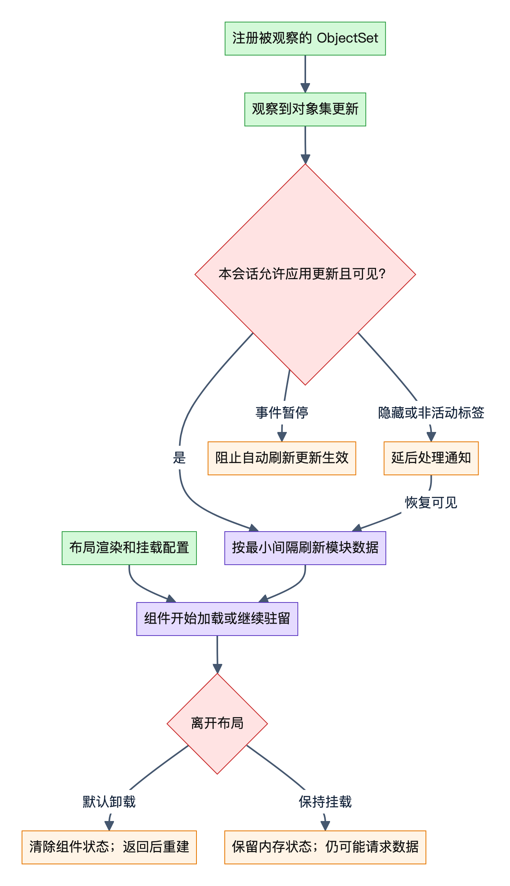
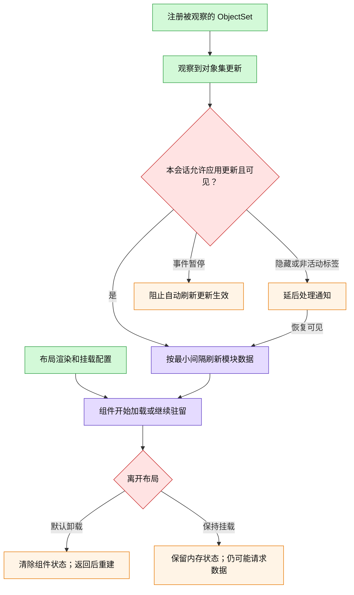
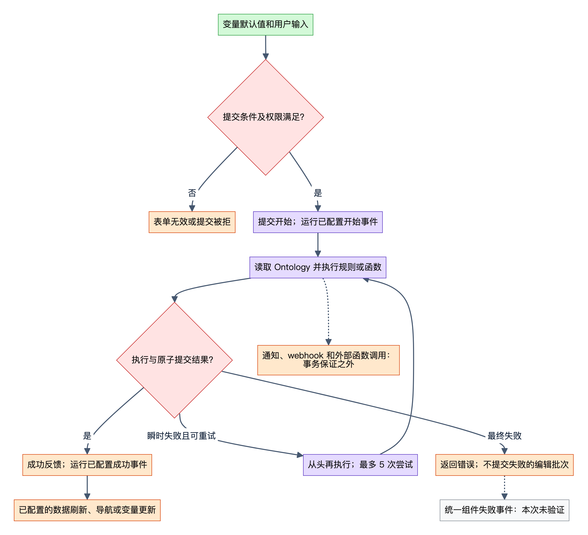
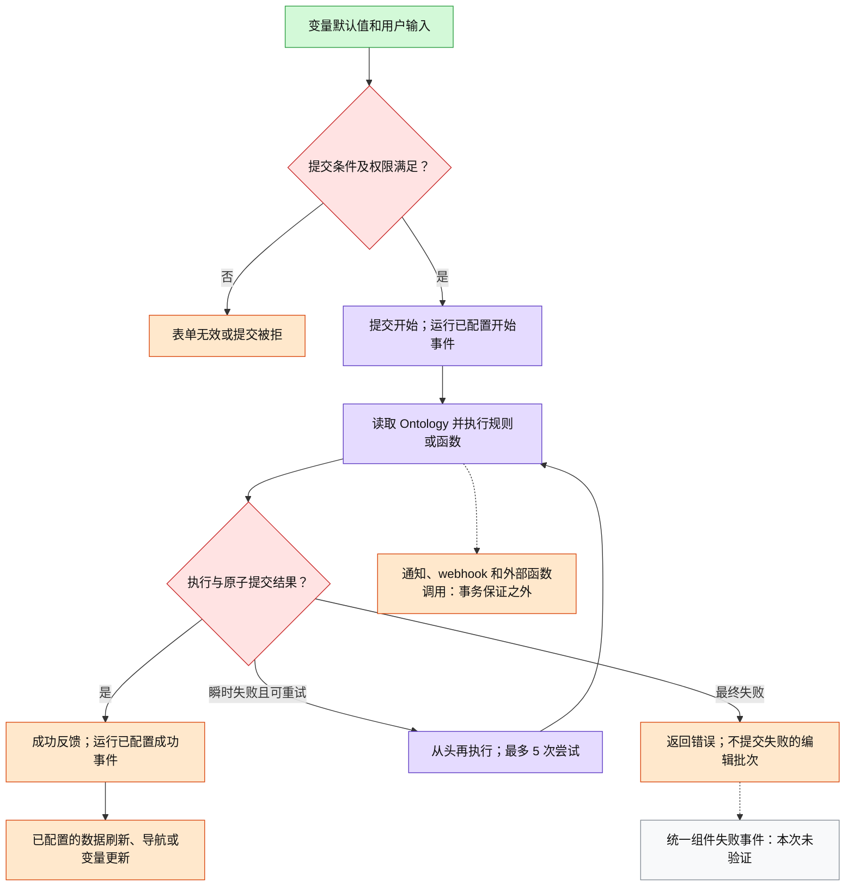
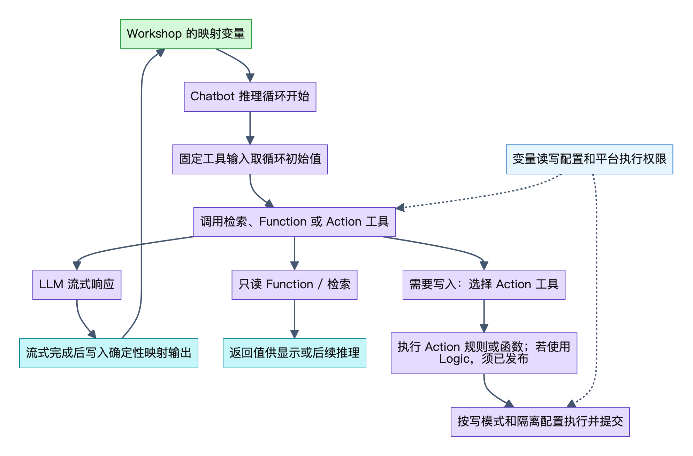
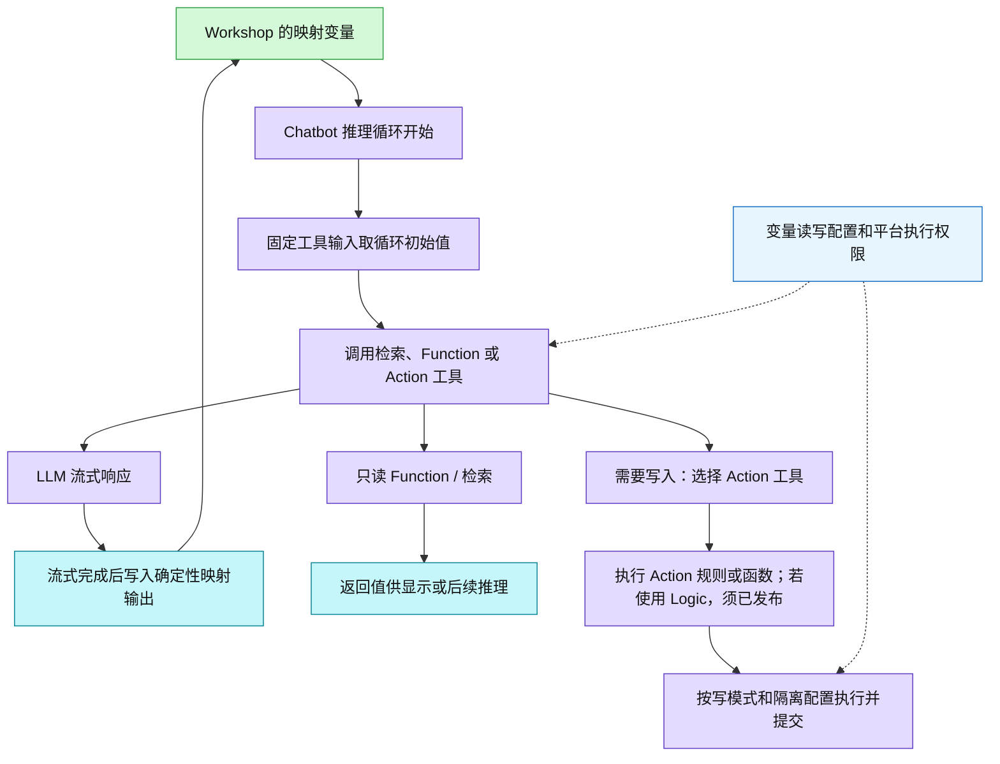

# Palantir Workshop 公开研究附录：数据、Actions、保存与 AIP 运行边界

研究日期：2026-10-01。状态：公开资料草稿，待合并审阅。

本附录仅依据 Palantir 第一方公开文档，描述其产品契约和可观察语义。未登录 Foundry 环境、未运行租户实验、未读取任何本地业务项目。文档会持续更新；文中的默认值、上限和 Beta 状态是本次查阅的文档声明，不证明某一 enrollment 已部署相同功能。变量求值、基础权限、路由、Profiler 和 Custom Widget 的完整专题由主报告承担，本附录只在必要处链接。

## 1. 数据请求、驻留与缓存：可以确认到哪一层

### D1. 布局决定组件生命周期

默认组件在所属布局渲染时挂载，布局离开时卸载；返回时重载数据并重建组件内部状态。可配置延后至进入视口再挂载、立即预加载、离开视口卸载或保持挂载。保持挂载会保留 DOM、React 状态和内存数据，变量变化仍可能引起数据请求。离开整个模块会重置全部组件。立即挂载必须配合保持挂载；嵌入模块中的立即挂载还要求外层组件也立即挂载。隐藏组件的选择等行为可能仍执行。[官方：Widget display optimization](https://www.palantir.com/docs/foundry/workshop/widget-display-optimization)

**研究解释：**“返回时快”既可能来自组件一直驻留，也可能涉及其他机制。以上资料足以证明浏览器内存状态的保留，不能据此指定查询缓存库、请求去重算法或跨模块缓存范围。

### D2. 函数变量有明确的结果缓存契约

函数变量接收到相同输入时，Workshop 返回此前缓存结果，避免再次计算。官方指向赋值事件或重算行为配置来控制重新求值。直接使用需要 OAuth 出站授权的函数不能唤起交互授权；用户尚未授权时调用失败，应把该函数包装为函数支持的 Action，让 Action 执行显示授权流程。[官方：Use Functions in Workshop](https://www.palantir.com/docs/foundry/workshop/functions-use)

**未公开于本次资料：**缓存键的序列化、ObjectSet 输入相等判定、TTL、容量、淘汰、缓存位置、失败是否缓存、并发请求合并，以及模块刷新如何使此缓存失效。不能将函数变量结果缓存推论为所有对象查询的统一缓存。

### D3. 表格按显示需要计算，排序可扩大计算范围

Object Table 的函数列可输入当前显示的对象，以减少计算；也可输入完整对象集变量。函数列排序会等待全表函数执行后再显示数据；超过 10,000 个对象时，用户不能按该列排序，默认函数列排序只作用于逐页加载的数据。部分大型属性默认不加载，用户可按需请求。[官方：Object Table](https://www.palantir.com/docs/foundry/workshop/widgets-object-table)

### D4. 派生属性属于运行时计算

派生属性按模块和对象类型定义，可基于关联属性、聚合或列运算即时计算，可能增加加载时间。运行时派生属性只支持一跳关联；引用它的 ObjectSet 不支持保存状态；使用它排序的对象集上限为 200 行。列运算可引用本地属性和聚合派生属性，但不能引用另一个列运算派生属性。[官方：Derived properties](https://www.palantir.com/docs/foundry/workshop/derived-properties)

### D5. 官方公开了 OSS 的查询策略，但没有公开 Workshop 查询缓存实现

Object Set Service 负责查询和取回 Ontology 对象；按复杂度、规模和计算资源选择存储下推、内存执行或 Spark 执行，单次查询的不同阶段可选择不同策略。文档列出 Search Around/派生计算的默认 100,000 对象转换阈值、超过 25 个 OSv2 数据页触发 Spark，以及 Search Around 单数据源叶结果 1,000 万对象、总加载 3,000 万对象的限制。这些属于服务执行策略，不能据此推断浏览器缓存。[官方：Object Set Service limitations](https://www.palantir.com/docs/foundry/ontologies/oss-limitations)

### D6. 数据刷新是 watch 与显示状态共同控制的行为

自动刷新观察注册的 ObjectSet；更新到达时刷新当前模块全部数据。最短间隔为 10 秒；可在编辑模式禁用，也可用事件暂停/恢复应用更新。仅支持 OSv2，关联对象类型须单独观察。被观察变量要由可见组件使用；隐藏或非活动浏览器标签的通知延后到可见时处理。自动刷新配置在嵌入模块上下文中不生效，不能靠给子模块配置 watch 来继承此能力。部分过滤器不支持；输入状态可能因刷新重置，官方建议调整重算行为或用独立模块隔离。[官方：Auto-refresh](https://www.palantir.com/docs/foundry/workshop/auto-refresh)

### D7. “新鲜度”显示的是索引时间

Data Freshness 展示配置对象类型和数据源最近索引的时间；24 小时内使用相对时间，更早使用绝对时间。它不是某个组件最近请求成功的时间，也不是本次用户读取的端到端一致性证明；后二者是对其指标定义的研究解释。[官方：Data Freshness](https://www.palantir.com/docs/foundry/workshop/widgets-data-freshness)

下面是 D1/D6 的产品行为示意；没有表示未公开的推送协议、缓存层或调度器。

*基于公开资料的概念归纳，并非官方内部结构；[可缩放SVG](diagrams/05-auto-refresh.svg)。*

查看可编辑Mermaid源

## 2. Actions：校验、提交、事务、错误与刷新

### A1. Action 表单来自定义；参数映射只是输入默认值

Action 定义生成表单。Workshop 可用模块变量设置参数默认值，并让参数可编辑、隐藏或只读；没有默认值的参数由用户填写。校验通过后可提交，成功显示反馈。按钮可绑定提交开始或成功后的 Workshop 事件，用于刷新、导航和变量更新。[官方：Use Actions in Workshop](https://www.palantir.com/docs/foundry/workshop/actions-use)

Button Group 同样记录上述两个生命周期触发点。它还提醒：一个按钮配置多个普通事件时，后续事件运行前，变量依赖更新可能尚未完成。因此，Action 的成功事件是特定生命周期节点，不能直接等同“全图下游计算已完成”。[官方：Button Group](https://www.palantir.com/docs/foundry/workshop/widgets-button-group)

### A2. Inline Action 有自己的输入和输出契约

Inline Action 支持表单和表格；表格可用 ObjectSet 预填对象引用参数，类型必须匹配。参数默认值未覆盖时使用 Ontology 定义。无效表单可禁用或隐藏。成功提交可触发事件，还可指定创建或修改对象的输出 ObjectSet。表格存在批量调用上限及编辑不得冲突的要求，并非所有表单能力都已在表格提供。[官方：Inline Action](https://www.palantir.com/docs/foundry/workshop/widgets-inline-action-form)

### A3. 校验和权限不是纯前端按钮规则

提交条件可结合用户、参数、对象和执行上下文；全部条件满足才可提交，独立于编辑 Action 类型本身的权限。[官方：Submission criteria](https://www.palantir.com/docs/foundry/action-types/submission-criteria)

Action 调用还检查对象/关联类型及数据源访问、相应编辑策略和日志对象权限。缺少日志对象权限可使提交失败。提交条件失败时不执行副作用；通知失败时对象编辑仍可能成功。读时行列控制不会自动传播到写入，需另行考虑标记和写授权。[官方：Action type permissions](https://www.palantir.com/docs/foundry/action-types/permissions)

模块自身权限另见主报告及 [Permissions in Workshop](https://www.palantir.com/docs/foundry/workshop/concepts-permissions)。

### A4. Ontology 编辑有事务保证，外部副作用没有同等保证

Action 的 Ontology 编辑按约束原子提交并持久化；完成后新启动的查询/Action 看到完整编辑。默认批量写执行内不能读取自己的未提交修改；暂存写可以。新批量写 Action 默认快照隔离；暂存写当前仅支持旧隔离模式。冲突按对象检测，即使改不同属性也可能失败，失败编辑整体丢弃；只读对象不参与写冲突，仍可能产生写偏斜。外部调用不在快照/原子保证内。瞬时错误可从头重跑、最多 5 次尝试；默认只重试无外部调用的 Action，也可选全部重试或禁用。读取已提交模式在文档中仍标为即将提供。[官方：Consistency and isolation](https://www.palantir.com/docs/foundry/action-types/consistency-guarantees)

**研究解释：**成功提交、刷新请求和 UI 中所有下游值完成更新应分别讨论。事务完成后新查询的保证不能证明旧请求、旧缓存结果或异步变量计算已全部替换。也不能把副作用失败推论为 Ontology 编辑回滚。

### A5. 错误信息和撤销属于不同能力

函数可抛出 `UserFacingError`，在 Workshop 的函数 Action 中展示面向用户的信息。[官方：User-facing errors](https://www.palantir.com/docs/foundry/functions/user-facing-error)

Action 撤销受配置和 OSv2 支持限制，目前只能由原执行用户在成功提示中操作；对象发生后续任意属性编辑后就可能无法撤销。撤销只处理对象实例编辑，不撤销通知或 webhook。它是提交后的补偿能力，不能当作提交失败回滚接口。[官方：Undo or revert Actions](https://www.palantir.com/docs/foundry/action-types/action-reverts)

### A6. 失败有监控路径，但未验证统一的组件失败事件

平台可监控 Action 执行时长 p95、时间窗口内失败数，并以 Workshop 作为动态范围跟踪模块所用 Action。[官方：Action monitoring](https://www.palantir.com/docs/foundry/action-types/monitoring)

本次 Workshop 组件文档明确列出的生命周期绑定为开始与成功；未找到统一的失败事件、组件级取消句柄或统一失败变量。这个结论只表示本次公开资料未验证，不能写成平台绝无此能力。瞬时重试和提交后撤销已由 A4/A5 公开说明，不能同时笼统称“Action 重试/回滚都未公开”。

下图合并 A1/A3/A4 的公开机制，灰色分支标记尚未验证的组件接口。

*基于公开资料的概念归纳，并非官方内部结构；[可缩放SVG](diagrams/06-action-transaction.svg)。*

查看可编辑Mermaid源

## 3. 保存、版本、发布和用户状态应分开说明

### P1. 模块配置版本与已发布版本

保存产生带时间、编辑者和可选描述的历史版本；可发布任一已保存版本供浏览者访问，也可查看或恢复历史版本。恢复把历史内容保存为最新版本。可配置保存时自动发布及保存时提示版本描述。分支若落后于主分支，需重基、解决冲突、保存后再合并。[官方：Publishing and versioning](https://www.palantir.com/docs/foundry/workshop/versions)

**未验证：**该页的自动发布选项不能证明编辑器自动保存；本次未验证自动保存周期、防抖、离线重试、冲突合并协议或多人同时编辑锁。发布版本如何在已打开的浏览者会话中切换也未在本次资料中明确。

### P2. 保存状态是用户主动保存的配置变量快照

保存状态保存启用变量的当前值和可选当前页；变量值通过外部 ID 对应，改 ID 可能破坏历史状态重载。它须用户主动保存和重载，不自动跨会话保留逐用户偏好。支持规定基础类型、数组、ObjectSet 和过滤器；可设默认状态。嵌入模块不继承，需通过接口接入父模块保存变量；使用者须有平台访问，浏览模式须显示模块头部。[官方：State saving](https://www.palantir.com/docs/foundry/workshop/state-saving)

| 被保存的内容 | 作用范围 | 证据 |
|---|---|---|
| 模块配置历史版本 | 构建、恢复、指定发布版本 | P1 |
| 用户显式保存状态 | 选定变量及可选页面 | P2 |
| 已挂载组件内部状态 | 当前模块的浏览器内存生命周期 | D1 |
| AIP Analyst 未保存会话 | 浏览器标签存续期，另有重置规则 | I3 |

这是研究分类，用于避免把四种不同的持久性混称“自动保存”；不声称它们共用某个存储服务。

## 4. AIP：变量接口、会话边界与 Ontology 写入

### I1. 生成内容具有明确的加载与输出接口

AIP Generated Content 可显示 Logic 函数输出、直接流式 LLM 输出或函数生成的提示词输出；结果写入字符串或 ObjectSet 变量。可配置加载消息/转圈，以及提示词变化时清空显示。用户必须能访问 AIP Logic，否则组件会加载报错。文档中的模型列表较旧，不能将它扩展为当前所有 enrollment 的模型能力清单。[官方：AIP Generated Content](https://www.palantir.com/docs/foundry/workshop/widgets-aip-generated-content)

### I2. Chatbot 和 Workshop 的连接有输入时点与权限边界

Workshop 选择 Chatbot 及其发布版本，映射应用变量，按 Chatbot Studio 读写权限交互；外部修改聊天输入变量可自动发消息。旧版 Workshop 内定义模式已弃用。[官方：AIP Chatbot](https://www.palantir.com/docs/foundry/workshop/widgets-aip-chatbot)

Studio 支持字符串/ObjectSet 应用状态。工具或检索的确定性输出在 LLM 流式输出结束时写入映射变量；另有模型决定更新变量的工具。Action/Function 的固定输入只支持字符串/ObjectSet，固定在推理循环开始时的值，同次查询前序工具更新不会改变它们。变量可作为上下文输入而不让模型直接看值；直接参与动态提示词的值则需可见。[官方：Application state](https://www.palantir.com/docs/foundry/chatbot-studio/application-state)

### I3. Analyst 的会话是专用机制，不能照搬普通组件卸载语义

Analyst 输入变量变化可自动开分析；聊天启动后停止监听 ObjectSet 输入更新，直至重置/新聊天。可输出当前标签运行布尔值、消息和对象集；Vega 规格含数据快照，工具消息 JSON 无兼容保证。默认未保存聊天在浏览器标签内存驻留，隐藏再显示保留；刷新/关闭清空。可用导航清空选项或重置变量重置。加载保存分析时，组件工具配置优先；已有聊天不使用新的输入配置。发消息前/代理停止后可执行已配置 Action；前者早于消息写入输出，后者运行时阻止新消息。[官方：AIP Analyst Workshop widget](https://www.palantir.com/docs/foundry/aip-analyst/workshop-widget)

### I4. Logic 输出和写入是两条能力路径

Logic 函数可像其他函数用于 Workshop；要编辑 Ontology，必须发布并从 Action 调用。[官方：Logic core concepts](https://www.palantir.com/docs/foundry/logic/core-concepts)

默认按用户权限执行；也可按所在项目权限执行。用户范围日志仅本人可见、保留 24 小时；项目范围日志由项目访问者查看，资源须导入同项目且用户仍须相应标记权限。项目范围可配置历史数据集，保留最近 10,000 次执行。[官方：Execution mode settings](https://www.palantir.com/docs/foundry/logic/execution-mode-settings)

启用 Logic 暂存写后，嵌套调用的编辑对本次后续读取可见，临时暂存并在结束时应用；输出不再是编辑列表。切换模式可能产生主版本，兼容版本范围不会跨主版本自动升级。本次文档仍标记 Beta、按 enrollment 可用；与 A4 的 Action 隔离/原子边界一起阅读。[官方：Staged writes in AIP Logic](https://www.palantir.com/docs/foundry/logic/staged-writes)

Logic 使用平台用户/函数安全模型；读时控制限制模型代表用户读取的数据，但不会自动传播到输出或所构造的编辑。[官方：AIP Logic overview](https://www.palantir.com/docs/foundry/logic/overview)

下面是 I2/I4 的连接示意；AIP Analyst 的会话规则应按 I3 单独理解。

*基于公开资料的概念归纳，并非官方内部结构；[可缩放SVG](diagrams/07-aip-tools.svg)。*

查看可编辑Mermaid源

## 5. 多页证据矩阵

所有正文技术结论就近链接到来源。下表提供复查定位，不重复展开每页内容；括号中的 L 为本次公开抓取正文行号，仅辅助审阅，网页后续改版可能改变行号。

| 证据编号 | 第一方页面 | 本次正文定位 | 支持事项 | 可确认层级 |
|---|---|---|---|---|
| D1 | [Widget display optimization](https://www.palantir.com/docs/foundry/workshop/widget-display-optimization) | Configuration options / Performance considerations / Limitations，L434–502 | 组件生命周期 | 文档明确 |
| D2 | [Use Functions in Workshop](https://www.palantir.com/docs/foundry/workshop/functions-use) | Function-backed variables / OAuth-backed functions，L543–546 | 函数缓存与授权 | 文档明确 |
| D3 | [Object Table](https://www.palantir.com/docs/foundry/workshop/widgets-object-table) | 配置，L458；函数列输入，L664；排序，L932–936 | 加载与计算范围 | 文档明确 |
| D4 | [Derived properties](https://www.palantir.com/docs/foundry/workshop/derived-properties) | Configuration / Limitations，L433–471 | 派生计算限制 | 文档明确 |
| D5 | [Object Set Service limitations](https://www.palantir.com/docs/foundry/ontologies/oss-limitations) | Query execution strategies / OSv2，L556–611 | 服务执行策略 | 文档明确；非前端实现证据 |
| D6 | [Auto-refresh](https://www.palantir.com/docs/foundry/workshop/auto-refresh) | Settings / Limitations，L434–490 | 观察刷新 | 文档明确 |
| D7 | [Data Freshness](https://www.palantir.com/docs/foundry/workshop/widgets-data-freshness) | 说明与配置，L433–443 | 指标含义 | 文档明确 |
| A1 | [Use Actions in Workshop](https://www.palantir.com/docs/foundry/workshop/actions-use) | Button Groups，L500–530 | 表单与生命周期 | 文档明确 |
| A1 | [Button Group](https://www.palantir.com/docs/foundry/workshop/widgets-button-group) | On click / Chaining，L471、L493–499 | 生命周期交叉佐证 | 文档明确 |
| A2 | [Inline Action](https://www.palantir.com/docs/foundry/workshop/widgets-inline-action-form) | Configuration，L449–460 | 输入输出接口 | 文档明确 |
| A3 | [Submission criteria](https://www.palantir.com/docs/foundry/action-types/submission-criteria) | 说明，L556–566 | 提交条件 | 文档明确 |
| A3 | [Action type permissions](https://www.palantir.com/docs/foundry/action-types/permissions) | Apply action / Side effect permissions，L562–600 | 授权与副作用 | 文档明确 |
| A4 | [Consistency and isolation](https://www.palantir.com/docs/foundry/action-types/consistency-guarantees) | ACID / Write modes / Isolation / Retry，L556–680 | 提交与重试 | 文档明确；部署现状须租户核对 |
| A5 | [User-facing errors](https://www.palantir.com/docs/foundry/functions/user-facing-error) | 说明与 Workshop 示例，L556、L638–644 | 函数错误展示 | 文档明确 |
| A5 | [Undo or revert Actions](https://www.palantir.com/docs/foundry/action-types/action-reverts) | Configure / Caveats，L556–591 | 撤销限制 | 文档明确 |
| A6 | [Action monitoring](https://www.palantir.com/docs/foundry/action-types/monitoring) | Available monitoring rules / Dynamic scopes，L559–576 | 失败监控 | 文档明确 |
| P1 | [Publishing and versioning](https://www.palantir.com/docs/foundry/workshop/versions) | Version history / Branching，L433–462 | 版本和发布 | 文档明确 |
| P2 | [State saving](https://www.palantir.com/docs/foundry/workshop/state-saving) | 说明 / Variables / Limitations，L439–465、L498–532 | 状态持久性 | 文档明确 |
| I1 | [AIP Generated Content](https://www.palantir.com/docs/foundry/workshop/widgets-aip-generated-content) | Configuration，L433–455 | 生成加载输出 | 文档明确 |
| I2 | [AIP Chatbot](https://www.palantir.com/docs/foundry/workshop/widgets-aip-chatbot) | Base configuration，L436–460 | 发布版本和映射 | 文档明确 |
| I2 | [Application state](https://www.palantir.com/docs/foundry/chatbot-studio/application-state) | Configure / Automatic updates / Deterministic inputs，L161–189 | 推理状态时点 | 文档明确 |
| I3 | [AIP Analyst Workshop widget](https://www.palantir.com/docs/foundry/aip-analyst/workshop-widget) | Inputs / Outputs / Apply actions / Session persistence，L176–208、L256–262 | 专用会话生命周期 | 文档明确 |
| I4 | [Logic core concepts](https://www.palantir.com/docs/foundry/logic/core-concepts) | Logic function，L164–166 | 写入入口 | 文档明确 |
| I4 | [Execution mode settings](https://www.palantir.com/docs/foundry/logic/execution-mode-settings) | User / Project scoped，L161–177 | 执行权限和日志 | 文档明确 |
| I4 | [Staged writes in AIP Logic](https://www.palantir.com/docs/foundry/logic/staged-writes) | Key differences / Versioning，L163–203 | 暂存与升级 | 文档明确；Beta |
| I4 | [AIP Logic overview](https://www.palantir.com/docs/foundry/logic/overview) | 安全边界，L171–174 | 读时控制传播范围 | 文档明确 |

相关可观察工具见 [Performance Profiler](https://www.palantir.com/docs/foundry/workshop/performance-profiler)，版本差异见 [Changelog panel](https://www.palantir.com/docs/foundry/workshop/changelog)，正文由主报告展开。

## 6. 未公开、未验证及后续核对

| 问题 | 本次证据状态 | 应如何表述 |
|---|---|---|
| Workshop ObjectSet 查询缓存库、键、TTL、去重和淘汰 | 没有直接公开实现证据 | 保留为未知；D2 只证明函数变量结果复用 |
| React/Jotai/TanStack 等内部运行时组织 | D1 明确 React state；没有其余库的 Workshop 证明 | 不从 SDK 或其他产品代码反推 Workshop |
| Auto-refresh 通知传输协议、失败恢复、订阅共享 | D6 只提供产品行为与部分排错 | 不指定 WebSocket、SSE 或轮询实现 |
| Action 成功后的自动刷新范围、缓存失效顺序、旧请求取消 | 有生命周期绑定与事务读保证，缺统一 UI 完成屏障证据 | 说明可配置刷新，并把事务与 UI 更新分开 |
| 统一的失败事件、取消句柄、错误状态变量 | 本次组件页没有验证 | 不写成不存在；A4/A6 的重试和监控已公开 |
| 编辑器自动保存、多人编辑及断网恢复协议 | P1 未说明 | 自动发布不可替代自动保存证据 |
| 发布后已有浏览会话何时采用新版本 | 未验证 | 新会话与已打开会话分别实测 |
| 普通状态保存是否包含完整对象属性快照 | P2 说明变量值，未证明全量物化属性 | 不把 ObjectSet 保存解释为离线数据备份 |
| AIP 各组件的取消、超时、服务重试和流中断恢复 | 未验证统一契约 | 按组件和 Logic/Action 配置分别核对 |
| 具体租户是否有所有新增/Beta能力 | 没有租户实验 | 以实际设置、版本和文档状态核对 |

如后续获得公开测试环境，可依次验证：布局切换时状态和网络请求；相同函数输入与显式重算；Action 冲突、外部副作用失败及成功后读取；保存状态再打开与配置 ID 迁移；AIP 推理循环内变量变化和 Analyst 重置。以上是后续实验建议，当前研究没有把它们当作已测结论。
