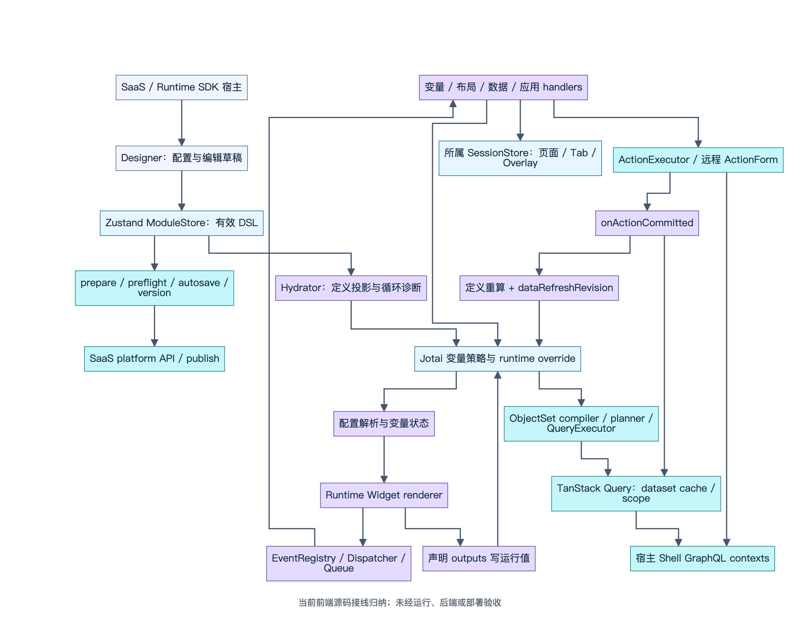
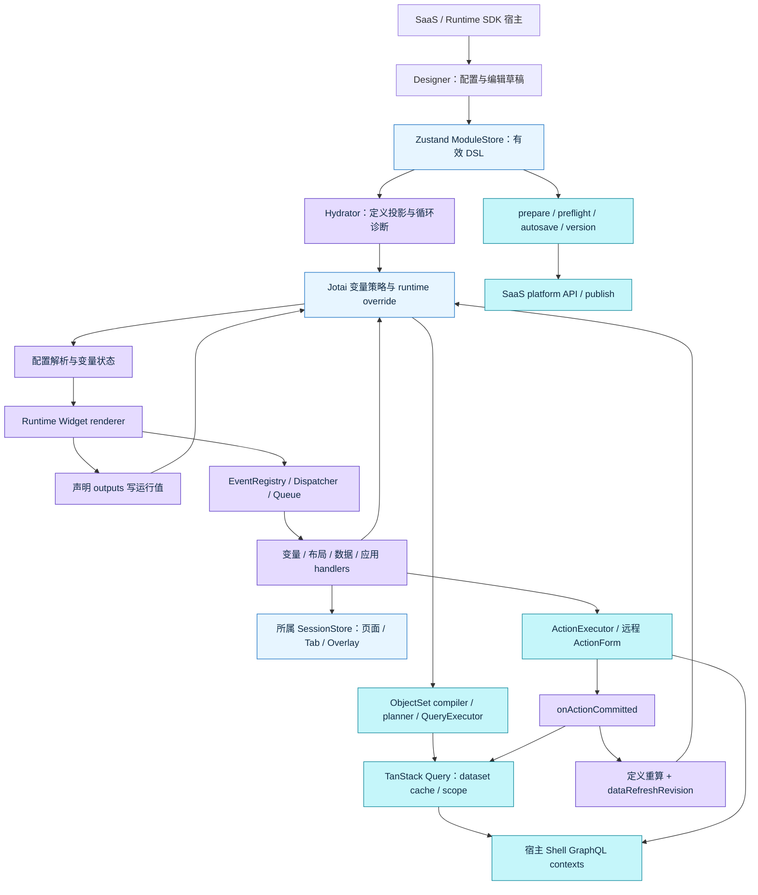

# Workshop 运行机制：EOS 当前实现与 Palantir 对照（公开授权现状对照稿）

> 本稿由既有只读报告转换为公开审阅拷贝，以下“本次核对”沿用原静态研究记录。本研究仓库不包含 EOS 源码；相对引用用于用户已有 `eos-workshop` checkout 核查，无法在本仓库直接打开。转换未重新审计 EOS 行为；随后仅只读核验相对路径与行号。未运行 EOS 测试、后端或部署。

> 日期：2026-10-01。经用户明确授权，本目录作为 EOS 当前实现与 Palantir 的公开现状对照稿；包括架构图、具体差异与相对源码证据。
> EOS 项目只读；本稿中的“已实现”指当前源码中存在并已追到消费者/装配点，不代表已部署、测试通过或生产验收。

## 1. 交付主旨与阅读顺序

完整研究由两部分组成：公开资料稿讲清手写或 Pilot 生成 React、OSDK 数据与 UI 契约、Widget Set 发布、Registry、Workshop 宿主变量/事件、Ontology 读写和页面运行；本 EOS 对照稿将这些职责与已有 EOS 源码对应，避免重复设计已存在的系统。Custom Widget 的协议与构建沿用另一专题，本次只核对宿主运行机制与衔接点。

1. [公开主稿](../README.md)：总架构与端到端流程，包含官方证据和公开未知项。
2. [变量与状态证据](variables-state-evidence.md)：状态域、依赖传播、输出、重算与实例边界。
3. [事件与数据证据](events-data-evidence.md)：事件队列、查询缓存、Action 提交后刷新、离线与元数据边界。
4. [DSL 保存证据](dsl-save-evidence.md)：编辑草稿、autosave、版本与发布、校验和恢复。
5. [AI / ADR 证据](ai-generation-adr-evidence.md)：现行评审状态、可复用能力和候选生成缺口。

## 2. 源码基线与工作区快照

源码证据以 `eos-workshop` 根目录为相对引用起点；基线与当前工作区文档分别记录如下。

| 项目 | 当前事实 |
|---|---|
| 分支 | `main` |
| HEAD | `ea071209ca3bce25e45bbca87a9f90f959ef59ed` |
| HEAD 内容 | `docs: 补齐 Workshop AI 能力目录与架构评审依据`，提交时间 `2026-09-30 18:59:19 +0800` |
| 与本地远程跟踪引用关系 | `HEAD...origin/main` 为 ahead 1 / behind 2；未 fetch，不代表远端实时状态 |
| 工作区 | 已有 27 个 tracked 文档修改/删除、5 个 untracked 顶层条目；无暂存 diff。研究按当前工作区文件，而非只按 HEAD |
| 研究操作 | 只读 `rg` / `cat` / `sed` / Git 无可选锁命令；未安装、运行产品脚本、构建、测试、提交、推送或修改 EOS |

原只读核对阶段没有剩余文件读取阻碍。

## 3. 文档已经组织成体系，应先复用

根 AGENTS.md（`AGENTS.md:18`） 给出分层、依赖红线和数据链；已读 kernel/runtime/designer 包级 AGENTS。已读 `.agents/skills/openspec-explore/SKILL.md`，按其只读探索方式工作；`lowcode-engine-skill` 是阿里低代码引擎参考资料，不能当 EOS 实现证据。

| 文档组 | 本次采用方式 |
|---|---|
| docs/index.md（`docs/index.md:26`）、架构台账（`docs/architecture/README.md:5`） | 现行入口，区分 architecture / reference / proposals / research / reports / 历史稿 |
| 总体架构、数据层、GraphQL 三域、变量联动、事件总览 | 建立职责地图后追当前源码；其中旧示例、旧 atom 命名和无 scope 的失效片段不得覆盖新接线 |
| student Filter List → Table 示例 | 概念联动有效；scalar/enum introspection 等旧细节已被当前 metadata binding 规则替代 |
| DSL 规范与 migration/ autosave 旧 spec | 历史设计背景；当前 schema、preflight、autosave hook 与 service 为准 |
| ADR 0003 | `accepted`，前端编辑草稿隔离有实现；后端硬校验、部署和存量审计未经本次核实 |
| AI 导航（`docs/ai-generation/README.md:10`）、主评审方案、ADR 0004 | 方案 `待评审`，ADR `proposed`；“不采用独立 Composition IR”是现行 Agent 推荐，不是已批准或已实现决定 |
| OpenSpec V5.1 ADR 和验收报告 | 可解释历史决策；四态、全量 fallback、持久化/幂等宣称需和当前双轴/scope/queue源码核对，旧测试报告不作为本次验证 |

## 4. 已有运行架构：继续建设这些接线

*当前前端源码接线归纳；未经运行、后端或部署验收。[可缩放 SVG](diagrams/08-eos-runtime-overview.svg)。*

查看可编辑 Mermaid 源

本图只归纳当前前端代码。它不表示 Palantir 使用同一技术栈，也不表示 EOS 后端事务或全部多实例交互已经验收。装配入口见 WorkshopRuntimeProvider（`packages/runtime/src/bootstrap/WorkshopRuntimeProvider.tsx:212`）、变量/事件 Runtime Provider（`packages/runtime/src/bootstrap/VariableEngineRuntimeProvider.tsx:197`）。

已有机制与研究意义：

| 环节 | 源码确认 | 后续沿用 |
|---|---|---|
| 状态分工 | DSL/module、session/UI、Jotai变量、Query缓存分域；SDK已有独立 module/session/engine | 保留现有状态真值；区分实例隔离与仍引用全局的局部操作 |
| 依赖与输出 | 策略中的 Jotai `get` 建立依赖，Widget output 写 override，配置读取端重新解析；静态 collector 服务诊断 | 研究重算/惰性/事件等待语义，不另建第二套变量图 |
| 事件 | Registry→Dispatcher→handlers 已装配，顺序执行、tracked result、queued等待、unknown观察均有代码 | 明确 batch、计算传播、后台等待和取消的产品契约 |
| 数据 | ObjectSet 是查询表达式，编译/规划/执行/字段投影及统一 key 已有 | 沿用现有查询链，核对 scope、刷新与元数据生命周期 |
| Action | 在线成功与远程表单结果汇合到 committed 回调，缓存失效+主动重算+revision | 不将“启动刷新”说成“全部消费者已读到新结果” |
| 保存 | 有效 DSL 校验、autosave调度、manual version、main publish、错误外壳与定向恢复 | 验证并发、未知写入和后端约束，而非重设计 basic save |
| AI | 模板、DSL、Widget模块、Runtime和initialDslJson创建能力存在 | 补目录投影/严格候选验证/禁写预览/确认采用，不把proposal当产品 |

## 5. Palantir 对照应聚焦语义差异

官方变量/事件、Actions、state saving、versions、AIP 的具体事实及链接集中在公开两篇附录。以下列出经用户授权公开的 EOS 现状与研究问题；建议仍需后续验证和评审。

| 编号 | EOS 当前证据与边界 | 对照问题 / 建议验证 | 优先级 |
|---|---|---|---|
| D1 | lazyLoadController 只定位到声明/导出；三种 recompute controller 只在 numericAggregation 接入 | 用可见/隐藏/Tab/Overlay/嵌套模块案例界定惰性与重算范围；避免仅因为helper存在便宣称调度策略完备 | P1 |
| D2 | 普通recalculate写module定义后立即读atom，Hydrator effect异步同步；聚合有generation专用路径 | 测目标READY是否属于新一代计算、下一事件读取下游的值；明确等待目标与等待完整DAG的区别 | P0 验证 |
| D3 | ObjectSet setVariableValue默认动态引用，materialize分支才取值；事件文档仍写复制 | 明确引用/快照与官方即时赋值语义差别，校准文档并建立案例，但本任务不改项目 | P1 |
| D4 | 在线/手动失效有scope，离线SyncManager未传scope；queue为内存数组 | 验证分支/模块隔离、重连、刷新/进程重启、未知终态；后端幂等须单独核验 | P0 验证 |
| D5 | ActionExecutor默认mutation只传parameters，客户端queue的idempotencyKey不等于后端去重；mutation retry默认1 | 明确服务端唯一键/重放/自动重试保证，测试重复写与unknown后恢复；不能仅凭ADR断言已幂等 | P0 验证 |
| D6 | 元数据provider成功Promise缓存无TTL/invalidate，普通refresh只刷新data | 定义ObjectType/ActionType/apiName变化的失效与provider重建时机 | P1 |
| D7 | 当前 schema `1.0.0`，migration registry为空；Widget config开放additionalProperties | 区分结构校验、组件语义校验、引用/授权校验和历史兼容；列清实际支持范围 | P0 生成门槛 |
| D8 | Runtime非编辑态仍装配真实ActionExecutor，默认QueryClient共享 | 设计期候选需专门禁写profile、独立cache、权限上下文、取消与过期处理；“预览”flag不足 | P0 生成门槛 |
| D9 | adapter不消费/回投顶层widget.displayName，candidate往返可能丢值 | 定向往返保真案例；保持原DSL与转换后DSL可比较，未运行前不称已复现bug | P0 验证 |
| D10 | 状态保存UI暂不可用；session偏好与autosave有效DSL是其他能力 | 对照显式named state、URL输入、运行值持久化、跨设备恢复的分别承诺 | P2 |

优先级是本轮研究建议，未创建Issue、未获架构批准。D2/D4/D5/D9目前为静态风险/待验证，不是已复现故障。

## 6. 下一轮验证范围与完成标准

建议按四个小场景推进，沿用现有系统：筛选→列表→选择→详情；Action成功/失败/queued→刷新；有效DSL与未完成编辑草稿→autosave/version/publish；隔离AI候选→校验→禁写原生预览→确认新建。每个场景记录输入、模块/分支身份、发生的事件、目标/下游generation、网络请求、缓存scope、保存的DSL和失败恢复结果。先验证P0边界，再决定是否改设计；避免把Palantir前端内部实现想象成必需依赖。

EOS 源码核对未运行测试、应用或业务请求；浏览器仅用于离线图像渲染，未读取 eos-core 后端。因此真实身份授权、服务器CAS/事务/幂等、部署状态、性能数字与实际故障恢复都没有本次实测证据。原核对阶段当前源码可读且无阻塞。本对照稿的相对源码路径、内部状态图、差异表与优先级建议已经用户明确授权公开；本稿以独立draft PR审阅，不回写EOS源码。

原只读报告完成时再次读取的 HEAD 仍为 `ea071209ca3bce25e45bbca87a9f90f959ef59ed`，Git porcelain工作区状态与首次观测完全一致。原核对记录确认五份报告的145个源码文件链接（98个唯一文件）目标和行号有效；这只验证证据定位，不证明运行行为。本次公开转换将这些链接改为相对路径代码文本，并再次只读核验399个唯一文件引用及5个目录/通配引用的目标和行号，未发现缺失或越界。公开主稿7张概念图与本对照稿8张当前前端图均已使用现有本机 Mermaid 10.9.1 实际解析、离线导出 PNG/SVG，并以原尺寸视觉复核。未安装依赖；图的渲染通过不代表 EOS 产品运行验收。素材出处、尺寸和校验值见 [assets](../assets.md)，完整检查见 [checks](../checks.md)。
