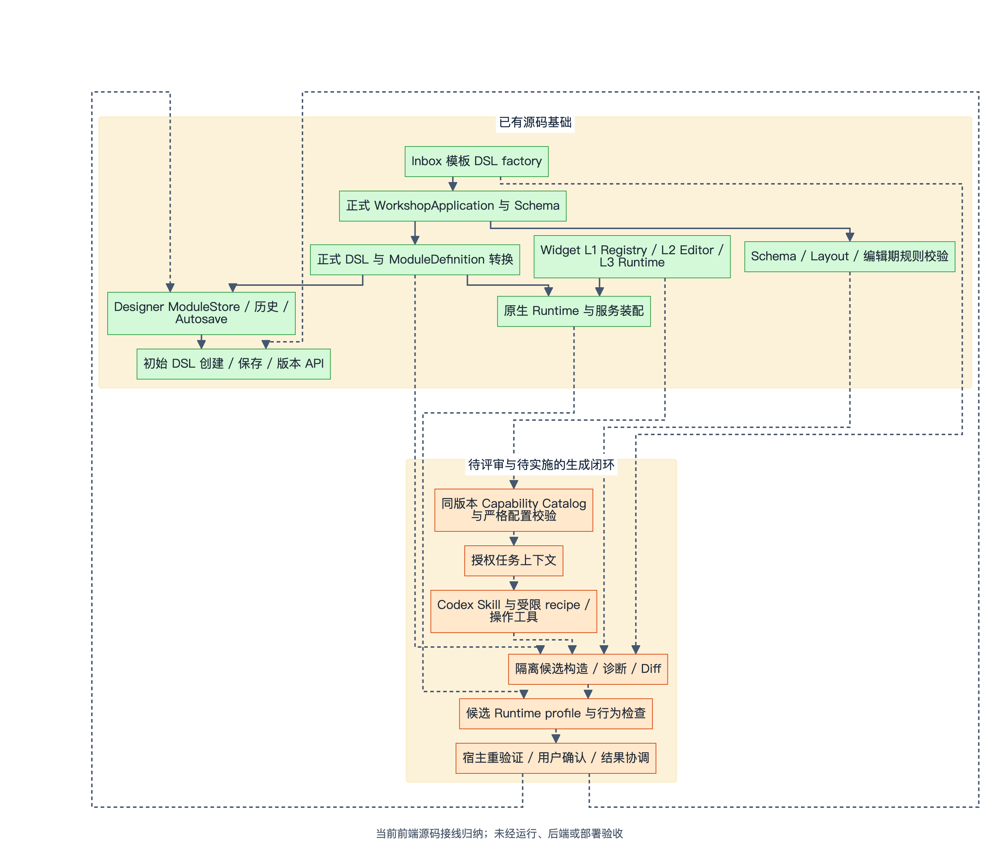
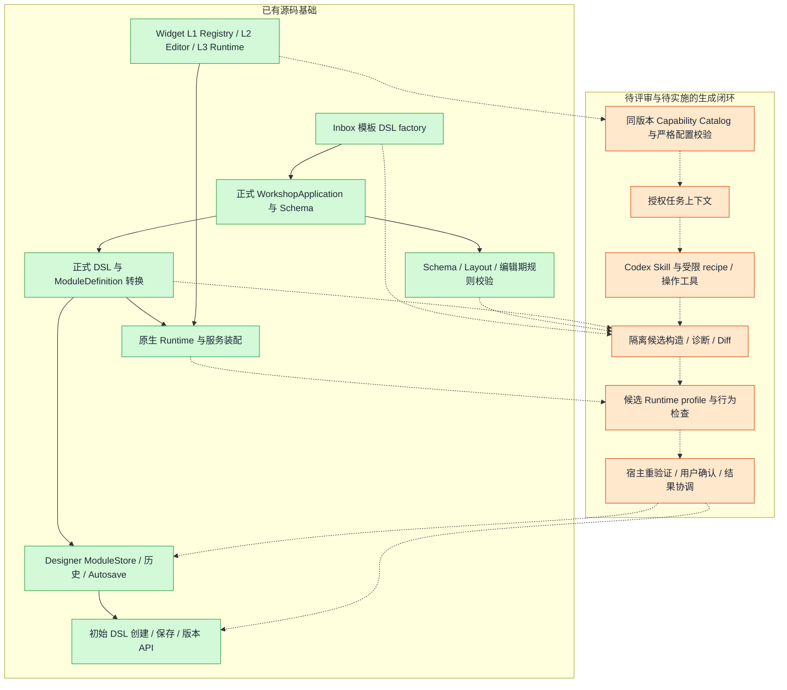

# EOS Workshop AI 生成与 ADR：公开授权源码证据报告

> 本稿由既有只读报告转换为公开审阅拷贝，以下“本次核对”沿用原静态研究记录。本研究仓库不包含 EOS 源码；相对引用用于用户已有 `eos-workshop` checkout 核查，无法在本仓库直接打开。转换未重新审计 EOS 行为；随后仅只读核验相对路径与行号。未运行 EOS 测试、后端或部署。
> 统一基线：`main @ ea071209ca3bce25e45bbca87a9f90f959ef59ed`；原观测工作区已有27个 tracked 文档变化和5个 untracked 项。本稿包含当时的工作区文档现状，不将其视为固定 HEAD 中已提交内容。

> 经用户明确授权公开的 EOS 实现现状、边界与风险对照稿，源码证据只使用根目录相对路径。
> 检查日期：2026-10-01。检查方式：只读源码与文档，未运行构建、测试、生成脚本、真实业务调用或网络请求。
> 源码引用根目录：`eos-workshop`。
> Git 基线：`main @ ea071209ca3bce25e45bbca87a9f90f959ef59ed`；结论同时包含当前未提交工作区文档。

## 结论与证据边界

Workshop 已有可继续人工编辑的正式 DSL、Widget 资产契约、Inbox 模板构造、编辑期校验、原生 Runtime 和初始 DSL 创建 API。当前 AI 应用生成仍处于方案评审与研究阶段，不能把这些基础能力合称为已经完成的 AI 生成产品。

工作区的 AI 主方案是唯一综合评审入口；ADR 0004 的状态为 `proposed`。放弃独立 Composition IR 是 Agent 在历史方案与当前工程基础之间作出的建议，非用户指定或团队已批准决定，也没有同条件生成效果实验。当前推荐使用正式 DSL 候选，稳定新建采用受限 recipe，局部编辑采用受限领域操作，直接 DSL 保留为对照和受控长尾路径。

最需要补齐的是版本化 Widget 能力描述及严格校验、无副作用候选构造、候选宿主接收与确认、预览服务隔离，以及正式转换和保存往返保真。已有实现应作为接点复用；拟议接口与保证仍须实施验证。

本文使用以下证据分级：

| 标记 | 含义 |
| --- | --- |
| 源码事实 | 已直接读取当前实现，能说明该代码路径的存在或行为；没有宣称真实环境验收通过。 |
| 文档状态 | 文档自身明示的 accepted、proposed、待评审、历史或研究状态；不是运行证明。 |
| 静态推断 | 根据代码路径推断的限制或风险，尚未运行案例复现。 |
| 建议 | 本报告提出的后续核验或投入顺序，不是已批准方案或排期。 |

本次没有重复 Custom Widget 专题，没有读取无关项目或外传源码。读取了根/包级 AGENTS、CONTEXT 和相关本地 SKILL；使用只读探索指引建立现状，并按 Mermaid Visualizer 的语法约定绘制下图。

## 文档入口、状态与历史演进

| 入口 | 当前状态 | 使用方式与边界 |
| --- | --- | --- |
| docs/ai-generation/README.md:3（`docs/ai-generation/README.md:3`） | 2026-10-01 主题整理 | `docs/ai-generation/README.md:10` 指定主方案为唯一综合评审入口，`docs/ai-generation/README.md:22–24` 区分研究、评审推荐、已批准决定和已实现系统。 |
| AI 架构评审方案:4（`docs/proposals/EOS Workshop AI 生成架构评审方案.md:4`） | Proposal / 待架构评审，2026-09-30 | `docs/proposals/EOS Workshop AI 生成架构评审方案.md:6–10` 分别记录历史研究和补充核查快照；`docs/proposals/EOS Workshop AI 生成架构评审方案.md:14–16` 给出本轮推荐；`docs/proposals/EOS Workshop AI 生成架构评审方案.md:36` 明确接口与门槛是拟新增契约；`docs/proposals/EOS Workshop AI 生成架构评审方案.md:738` 明确目录工具、CLI、宿主接收入口待实施。 |
| ADR 0004:1（`docs/adr/0004-workshop-generation-without-composition-ir.md:1`） | proposed | `docs/adr/0004-workshop-generation-without-composition-ir.md:7–15` 记录不采用独立 Composition IR 的工程取舍；没有批准或效果实验保证。受限操作参数可广义称 IR，此 ADR 针对独立页面语义协议及专用 Compiler。 |
| 研究 README:5（`docs/research/ai-generation/README.md:5`） | 一手资料研究与架构建议，2026-09-30 | 六篇独立研究覆盖 json-render、AI SDK、A2UI、baoyu-design、Codex、DeepSeek Harness。`docs/research/ai-generation/README.md:38–49` 记录固定源码快照和未验证范围；不证明已经接入、批准或通过效果实验。 |
| architecture-landscape.md（`docs/research/ai-generation/architecture-landscape.md`） | 研究建议 | Workshop DSL 与未来 Code Repo 源码两条路径共用规范、组件知识和体验契约。研究索引 `docs/research/ai-generation/README.md:9–17` 明示图中职责不是已实现服务。 |
| 历史提案 README:3（`docs/proposals/archive/ai-generation/README.md:3`） | 历史推导 | 四月工程/IR/综合讨论与六月 Copilot Draft；`docs/proposals/archive/ai-generation/README.md:8–15` 标明原位置、旧推荐与历史图。不能沿用旧稿“最终推荐”标题作为现行实施依据。 |
| 历史研究 README:3（`docs/research/ai-generation/archive/README.md:3`） | 历史研究，未重新验证 | AI SDK 4.x 与早期 json-render 笔记保留旧基线；不作为当前版本教程或“必须采用”的要求。 |
| Architecture 台账（`docs/architecture/README.md`） | 当前实现文档入口 | 按架构、变量、数据、事件、Widget 等分工维护事实源；“AI 生成相关文档”明确其仍在方案评审与研究阶段。 |
| CONTEXT.md:111（`CONTEXT.md:111`） | 领域术语与边界 | Registry 是发现入口；Capability Catalog 是能力知识；Generation Support 必须绑定 Widget 版本及具体范围；Task Context Pack 不是权限凭证。定义存在不表示服务实现。 |

现有 ADR 0001、0002、0003 都为 `accepted`：Object View 消费版本化 MF、Workshop 专属格式化引用只随应用保存、编辑草稿与有效 DSL 分离。它们可作为生成约束来源，但不能将这些 ADR 的 accepted 状态转移到 ADR 0004。尤其 ADR 0003:7（`docs/adr/0003-separate-editor-drafts-from-valid-dsl.md:7`） 要求有效 DSL 与未完成编辑草稿分开，后续候选交接应服从这条边界。

当前未提交文档整理包括主方案、README、docs 索引及历史稿迁移；`docs/ai-generation/`、`docs/research/ai-generation/`、`docs/proposals/archive/` 为未跟踪目录。报告使用其当前内容，不假定它们已提交、合入或发布。

## 当前可复用实现与拟新增边界

以下图用实线描述已存在的基础关系，用虚线描述本轮方案建议的 AI 连接；绿色节点为已读源码模块，橙色节点为待评审、待实施能力。此图不是运行成功或产品上线证明。

*当前前端源码接线归纳；未经运行、后端或部署验收。[可缩放 SVG](diagrams/15-eos-ai-candidate.svg)。*

查看可编辑 Mermaid 源

### 正式 DSL、校验与已有 AI 规范

**源码事实：** dsl.schema.json:1（`packages/contracts/schemas/dsl.schema.json:1`） 定义正式 `WorkshopApplication`，要求 schemaVersion、definition、metadata、branch，应用定义含布局、Widget、变量等。版本锁在 application.ts:53（`packages/contracts/src/dsl/application.ts:53`） 的 `metadata.widgetVersionLocks`，不是旧稿的 versionRequirements。

**源码事实：** currentSchemaValidator.ts:70（`packages/kernel/src/dsl-migration/currentSchemaValidator.ts:70`） 合并 JSON Schema、布局结构和派生属性 ID/记录键一致性校验，返回可定位错误。AJV 的 `strict:false` 配置不表示放弃数据校验；具体限制应看 Schema 内容。

**限制：** WidgetConfig:1705（`packages/contracts/schemas/dsl.schema.json:1705`） 仍是 `object + additionalProperties:true`。顶层 schema 合法不能证明 Widget 某个配置路径、输入类型、真实 Ontology 引用或 AI 开放子集正确。

**源码事实：** validationEffects.ts:36（`packages/kernel/src/store/subscriptions/validationEffects.ts:36`） 已有显示名、数据源、变量引用、Action 粗结构规则，支持 registerRule。`packages/kernel/src/store/subscriptions/validationEffects.ts:180–223` 的私有 `validateWidgetConfig` 依赖 ModuleStore；`packages/kernel/src/store/subscriptions/validationEffects.ts:203` 的变量值仍是 placeholder，`packages/kernel/src/store/subscriptions/validationEffects.ts:217–219` 捕获规则异常后记录日志，`packages/kernel/src/store/subscriptions/validationEffects.ts:267–272` 将错误写入 SessionStore。这是编辑期校验，可复用部分规则；不是拟议 Catalog 的严格生成验证入口。

**文档状态：** UI 当前规范快照:27（`docs/guides/Workshop UI 当前规范快照.md:27`） 已为 AI 与人工评审提供组件优先级、主题语义、截图映射与国际化约束。它是现有 AI 开发指导，不是机器可执行的生成能力目录。

### Widget 契约与 Catalog

**源码事实：** editor-module.ts:60（`packages/contracts/src/widget/editor-module.ts:60`） 提供 manifest、configSpec、Ontology dependency collector、默认尺寸及升级钩子；runtime-module.ts:31（`packages/contracts/src/widget/runtime-module.ts:31`） 提供 render、migrate、upgrade 和可选 outputs。现有 SDK collector:29（`packages/widget-sdk/src/widget-factory.ts:29`） 遍历配置收集对象、属性、Action、Link、Function 引用；收集引用不等于确认真实存在或授予业务权限。

**源码事实：** editor-module.ts:5（`packages/contracts/src/widget/editor-module.ts:5`） 明确 configSpec 可含函数、ReactNode 和组件引用；SDK factory `packages/widget-sdk/src/widget-factory.ts:218–259` 保留这些代码能力而不序列化。因此不能直接 stringify 一次就得到完整、安全、同版本的 AI 配置 Schema。

**文档状态：** 主方案 `docs/proposals/EOS Workshop AI 生成架构评审方案.md:184–265` 拟从现有资产提取轻量发现与首批详细描述，由 Widget 作者补用途、限制、示例，由生成适配维护者补开放子集和严格校验。`listed` 与 `supported` 分开，描述及支持声明绑定版本和范围；目录不授予授权。首批详细范围为 filter-list、object-table、property-list 的只读 recipe 子集。

### 首个 recipe 与现有创建

**源码事实：** templateRegistry.ts:14（`apps/workshop-saas/src/home/templates/templateRegistry.ts:14`） 的 blank、inbox 已开放，map、metrics 为 disabled。InboxTemplateInput:3（`apps/workshop-saas/src/home/templates/inbox/inboxTypes.ts:3`） 仅包含 ObjectType。factory:346（`apps/workshop-saas/src/home/templates/inbox/createInboxTemplateDsl.ts:346`） 读取蓝图，自动选择字段、改写表格/详情/筛选并更新 Ontology 使用清单；可直接作为受限新建的基础，不应重新发明同一联动模板。

**源码事实：** filter-list outputs:9（`packages/widgets/filter-list/src/outputs.ts:9`） 的 filters 为 objectSetFilter；object-table outputs:11（`packages/widgets/object-table/src/outputs.ts:11`） 的 activeObject 为 objectSet，selectedObjects/rightClickedObject 亦为 objectSet 且不默认自动创建。方案中正确的连接是筛选条件 → 派生 ObjectSet → 表格 → activeObject 对象集 → 详情。不能按输出名字误当单对象值，也不能把 filters 直接接 objectSet 输入。

**源码事实：** compassCreateAdapters.ts:146（`apps/workshop-saas/src/home/compassCreateAdapters.ts:146`） 已接受 initialDslJson，传 schemaVersion、project/folder、Ontology/globalBranch 并调用 CreateWorkshopModule；`apps/workshop-saas/src/home/compassCreateAdapters.ts:216–228` 解析创建 RID。这是已有创建接点，尚不能证明 AI 候选审阅、幂等、unknown 结果查询或恢复能力。

### 原生 Runtime、预览与运行态 AI

**源码事实：** WorkshopRuntime.tsx:218（`packages/runtime/src/sdk/WorkshopRuntime.tsx:218`） 创建实例 ModuleStore，`packages/runtime/src/sdk/WorkshopRuntime.tsx:229` 创建相应 SessionStore。候选预览可复用原生渲染，但不能只看 store 隔离。

**源码事实：** `renderMode='preview'` 的已读消费点 WorkshopRuntime.tsx:358（`packages/runtime/src/sdk/WorkshopRuntime.tsx:358`） 只判断是否编辑态；Provider:212（`packages/runtime/src/bootstrap/WorkshopRuntimeProvider.tsx:212`） 未注入 QueryClient 或 options 时使用 defaultQueryClient；createRuntimeServices.ts:393（`packages/runtime/src/bootstrap/createRuntimeServices.ts:393`） 在宿主未提供可用执行器时创建 ActionExecutor，`packages/runtime/src/bootstrap/createRuntimeServices.ts:487–502` 对外装配执行能力。仅设置 actionExecutor capability 为 false 可能触发补齐，不能据此承诺拒绝写入。

**静态推断：** 候选预览需明确独立 QueryClient/缓存、最终装配后的 Action/Function/LLM/外部调用策略，以及异步清理和数据模式。默认 preview flag 没有展示出这些保证。真实运行态 Action 的授权与 Workshop 设计写入授权仍是不同边界。

**源码事实：** aiPorts.ts:9（`packages/kernel/src/contracts/ports/aiPorts.ts:9`） 已有 AIP/LLM 服务抽象，事件 handler 可消费；eventRuntimeServices.ts:98（`packages/runtime/src/infra/services/eventRuntimeServices.ts:98`） 与 `packages/runtime/src/infra/services/eventRuntimeServices.ts:128–135` 的默认实现仍报 unavailable。运行态服务注入能力不能替代设计期 AI 生成闭环。

## 静态缺口与对后续研究的影响

| 缺口 | 当前证据 | 影响与下一步核验 |
| --- | --- | --- |
| 通用生成闭环未定位 | apps/packages/scripts/.agents/skills 定向检索未定位 prepareCandidate、preflightAccept、createFromCandidate、applyExisting、describeWidget、getWidgetExamples、TaskContextPack、CapabilityCatalog；package/lock 检索未发现目标 AI SDK/生成框架入口。主方案 `docs/proposals/EOS Workshop AI 生成架构评审方案.md:738` 同样明示待实施。 | 检索未命中不是全仓绝对不存在的证明，但足以禁止把拟议模块描述为已交付产品。后续以真实接点验证而非包名或图谱概念验收。 |
| 严格组件与业务引用验证不足 | 正式 WidgetConfig 为开放对象；编辑规则只覆盖部分通用约束。object-table normalization `packages/widgets/object-table/src/configNormalization.ts:108–126` 会过滤非法列；property-list normalization `packages/widgets/property-list/src/configNormalization.ts:122–151` 会过滤不支持组件/section。 | Runtime 容错可能把错误提案渲染成少内容页面。生成校验应报告明确路径，不把静默删除视为成功，且复核最终候选。 |
| 当前 Widget 构造有外部副作用 | WidgetCreatePipeline.ts:147（`packages/kernel/src/domain/widget/WidgetCreatePipeline.ts:147`） 读写全局 registry；`packages/kernel/src/domain/widget/WidgetCreatePipeline.ts:192–200` 同样处理布局默认；`packages/kernel/src/domain/widget/WidgetCreatePipeline.ts:268–278` 向默认 ModuleStore 添加变量并修改传入 initialConfig。 | 不能原样调用来构造隔离候选。提取首批纯规则或证明具体适配的隔离性；不为此复制整套领域构造系统。 |
| 预览禁写和缓存隔离没有自动保证 | preview 编辑态判断、默认 QueryClient、执行器补齐路径如上。 | 在已有 Runtime 周围定义候选 profile，验证最终服务集合。首期只读联动，不把生产 Action 当预览测试。 |
| 正式 adapter 往返可能丢显示名 | schema `packages/contracts/schemas/dsl.schema.json:1695–1700` 推荐顶层 displayName 并将 commonConfig 标为 deprecated；输入 adapter:205（`packages/kernel/src/adapters/applicationToModuleDefinition.ts:205`） 仅从 commonConfig.displayName 读取，否则 id；输出 adapter:56（`packages/kernel/src/adapters/kernelToApplicationDefinition.ts:56`） 重建 widgetName/config/commonConfig，未输出顶层 displayName。 | 静态可推断存在字段往返保真风险，尚未运行案例。生成前先验证 base/candidate 经正式 adapters、外壳、save prepare 后仍保持要求的字段与业务语义。 |
| 候选确认、过期及结果协调待实施 | 主方案 `docs/proposals/EOS Workshop AI 生成架构评审方案.md:338–340` 拟议宿主交接，`docs/proposals/EOS Workshop AI 生成架构评审方案.md:408–411` 拟议接口，`docs/proposals/EOS Workshop AI 生成架构评审方案.md:430–464` 拟议身份、过期、单次采用及提交故障保证。 | CLI 报 passed/hash 不授予采用权；宿主需重验证、冻结实际候选并确认。后端幂等/查询/CAS 与权限须独立验收，当前源码入口不是这些保证的证明。 |
| 权限文档有历史状态说明 | CONTEXT.md:196（`CONTEXT.md:196`） 记录 2026-08-20 master 暂不消费 canEdit/canPublish/canRebase；本次 EditorRoute/workshopModuleService 定向检索也未看到这些字段的直接消费。 | 该文档日期早于当前基线，不能据此评判所有产品入口的实际权限。生成宿主应重新核对当前身份/授权，不把目录、上下文或确认 UI 当权限凭证。 |

以上缺口均未通过真实运行复现。有关字段保真与预览装配的判断是明确代码路径推断；服务端是否已有额外保护、本地环境是否可用、真实身份下权限结果均未核验。

## 后续验证建议优先级

本优先级用于组织下一轮核验，未授权改 EOS，也不是团队已批准的产品排期。

| 顺序 | 建议范围 | 可验收结果 |
| --- | --- | --- |
| P0：固定候选接点 | 先用现有 Inbox 与固定合法 DSL 验证 adapters 往返、save prepare、原生预览的最终服务策略和 initialDslJson 创建回执；先复核字段保真风险。 | 无模型参与即可展示正确筛选—表格—详情联动；候选不污染 live store/autosave；创建结果可打开、保存并重新编辑；未知结果有明确处理。 |
| P0：首批能力事实 | 基于当前 L1/L2/L3 补三组件的版本化用途、开放配置路径、输入输出、限制、fixture 和严格校验；复用已有输出声明与规则。 | 每项 supported 绑定版本和范围，拒绝错误类型/引用/未支持配置；运行容错删除不会被算作通过。 |
| P1：工程师受限生成 | 沿主方案用 Codex Skill/程序工具和轻量宿主交接，recipe 优先；实际候选由宿主重验证并确认创建。 | 工程师无需手改 JSON 或应用源码，能够从需求得到可保存、重开的模块；可区分生成、预览、创建、保存各阶段结果。 |
| P2：有限存量编辑 | 在需求与试点结果支持时补有限领域操作、范围保护、基线过期、撤销与失败恢复。 | 无关人工配置保留；一次修改形成可审查 Diff 和一次历史；过期/失败不误报已应用。 |
| P3：Copilot 与高码路径 | 后续产品会话/模型服务或 Code Repo 源码交付复用同版本知识与体验契约，分别按自身正式产物验收。 | 不把未来高码、Harness、MCP 或任意 Action 扩充成 Workshop M0/M1 的隐含前提。 |

Palantir 对照可围绕真实运行机制展开：同类型变量与输出连接、选择/清空/空结果语义、Action 成功后的刷新、设计与运行权限、候选预览及保存边界。当前报告没有联网核实 Palantir 行为，不能据历史竞品材料宣称其内部生成架构、IR 或 Harness 实现。

## 相对来源清单

下列路径均相对项目根目录；行号只对应本次 `ea071209c` 与当前工作区快照。此清单便于公开对照稿追踪出处，不包含源码正文。

| 编号 | 文件及行段 | 支持内容 |
| --- | --- | --- |
| D01 | `docs/ai-generation/README.md:3–24` | 当前导航、唯一主方案、文档状态与演进。 |
| D02 | `docs/proposals/EOS Workshop AI 生成架构评审方案.md:4–36,184–265,338–340,402–464,501–505,640–679,738` | 待评审、拟议目录/候选/预览/分期及未实现声明。 |
| D03 | `docs/adr/0004-workshop-generation-without-composition-ir.md:1–17` | proposed 与 IR 取舍边界。 |
| D04 | `docs/research/ai-generation/README.md:5–17,38–49,72–85` | 研究状态、固定快照、验证限制与当前复用范围。 |
| D05 | `docs/proposals/archive/ai-generation/README.md:3–21`；`docs/research/ai-generation/archive/README.md:3–11` | 历史稿原位置、替代关系及过时口径。 |
| D06 | `CONTEXT.md:111–132,194–196`；`docs/guides/Workshop UI 当前规范快照.md:3–46` | AI 术语、授权边界、历史权限状态与现有 AI UI 规范。 |
| D07 | `docs/adr/0001-object-view-widget-consumes-versioned-mf.md:1–11`；`docs/adr/0002-workshop-formatting-host-references.md:1–9`；`docs/adr/0003-separate-editor-drafts-from-valid-dsl.md:1–19` | 已 accepted 的相邻领域决定，不包括 AI 路线批准。 |
| C01 | `packages/contracts/schemas/dsl.schema.json:1–71,1690–1705`；`packages/contracts/src/dsl/application.ts:53–80` | 正式 DSL、开放 WidgetConfig、顶层 displayName 与版本锁。 |
| C02 | `packages/kernel/src/dsl-migration/currentSchemaValidator.ts:12–25,44–99` | schema、布局和派生属性身份校验。 |
| C03 | `packages/contracts/src/widget/editor-module.ts:5–7,27–66`；`packages/contracts/src/widget/runtime-module.ts:21–38` | 可执行配置、引用 collector 与输出协议来源。 |
| C04 | `packages/widget-sdk/src/widget-factory.ts:29–119,207–259` | 引用收集、editor factory 与非 JSON-safe 配置。 |
| C05 | `apps/workshop-saas/src/home/templates/templateRegistry.ts:14–35`；`apps/workshop-saas/src/home/templates/inbox/inboxTypes.ts:3–5`；`apps/workshop-saas/src/home/templates/inbox/createInboxTemplateDsl.ts:329–370` | 已开放模板、输入范围与确定性 DSL 构造。 |
| C06 | `packages/widgets/filter-list/src/outputs.ts:9–16`；`packages/widgets/object-table/src/outputs.ts:11–32` | 真实 filters/selection 输出类型。 |
| C07 | `packages/widgets/object-table/src/configNormalization.ts:108–126`；`packages/widgets/property-list/src/configNormalization.ts:115–151` | 运行时容错过滤行为。 |
| C08 | `apps/workshop-saas/src/home/compassCreateAdapters.ts:146–167,216–228` | initialDslJson 创建与 RID 解析。 |
| C09 | `packages/kernel/src/domain/widget/WidgetCreatePipeline.ts:147–155,192–200,268–278,445–472` | 构造链读写全局状态与变更输入。 |
| C10 | `packages/runtime/src/sdk/WorkshopRuntime.tsx:218–229,336–365`；`packages/runtime/src/bootstrap/WorkshopRuntimeProvider.tsx:212–238`；`packages/runtime/src/bootstrap/createRuntimeServices.ts:393–414,487–505` | 实例 stores、preview 消费、QueryClient 与默认执行器装配。 |
| C11 | `packages/kernel/src/contracts/ports/aiPorts.ts:9–26`；`packages/runtime/src/infra/services/eventRuntimeServices.ts:98–108,128–135,235–243` | 运行态 AI 端口和默认不可用 stub。 |
| C12 | `packages/kernel/src/adapters/applicationToModuleDefinition.ts:205–224`；`packages/kernel/src/adapters/kernelToApplicationDefinition.ts:56–68` | 顶层 Widget displayName 往返风险。 |
| C13 | `packages/kernel/src/store/subscriptions/validationEffects.ts:36–105,180–223,249–274` | 编辑期规则、扩展接点与异常/状态输出边界。 |

复核记录：仅使用定向文件列表、rg/sed/cat/nl 和 `git --no-optional-locks` 读取。没有 fetch、依赖安装、构建测试、提交或推送；没有修改 EOS 源码、配置或已有文档。
