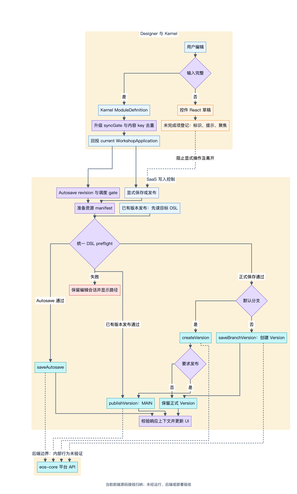
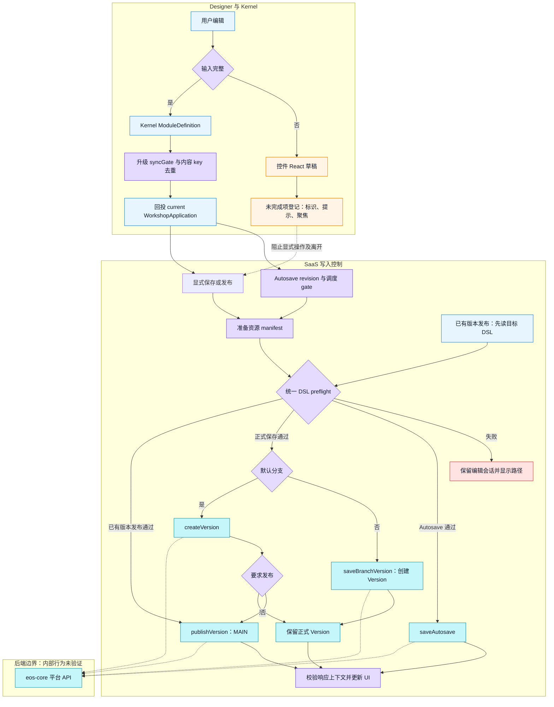
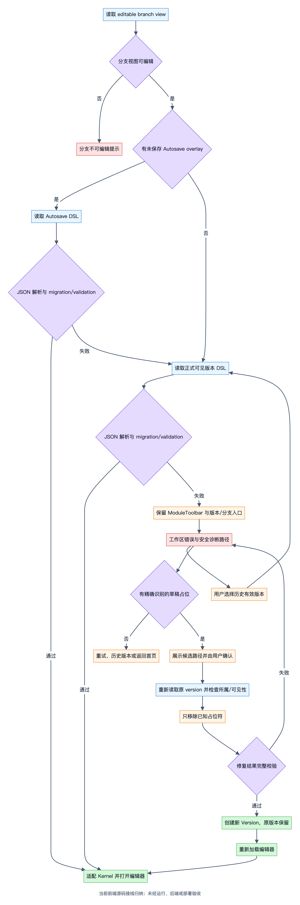
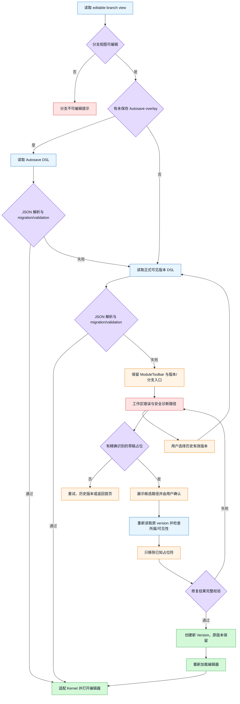

# EOS Workshop DSL 保存机制：公开授权源码证据报告

> 本稿由既有只读报告转换为公开审阅拷贝，以下“本次核对”沿用原静态研究记录。本研究仓库不包含 EOS 源码；相对引用用于用户已有 `eos-workshop` checkout 核查，无法在本仓库直接打开。转换未重新审计 EOS 行为；随后仅只读核验相对路径与行号。未运行 EOS 测试、后端或部署。
> 统一基线：`main @ ea071209ca3bce25e45bbca87a9f90f959ef59ed`；原观测工作区已有27个 tracked 文档变化和5个 untracked 项。本稿包含当时的工作区文档现状，不将其视为固定 HEAD 中已提交内容。

日期：2026-10-01。源码引用根目录：`eos-workshop`。本报告基于当前本地文件的只读静态核对；分支、commit 和工作区修改状态由同任务的项目总览记录。本报告中的源码行号均以本次读取时的文件为准，后续修改可能使行号移动。

这是经用户明确授权公开的架构现状对照稿。未修改 EOS 源码、配置或依赖；未构建、执行测试、启动应用、调用真实 API、提交或推送；原核对阶段未联网；本稿只含说明、图与相对证据引用，不含原始源码整包。Custom Widget 专题不在本报告范围内。

## 1. 结论与证据等级

当前 Workshop 已有完整的前端 DSL 编辑投影、自动保存、正式版本保存、默认分支发布以及错误恢复控制链。Designer 复用 Kernel Module Store 作为模块事实源，SaaS 应用层持有平台持久化接口；有效 DSL 与未完成筛选交互草稿分开。

“已实现”在本报告中只表示当前源码存在相应控制流，并不表示已经在真实环境运行验收、部署或启用后端保护。文档中的设计要求单独标记，不用文档状态替代实现证据。

| 等级 | 本报告采用的含义 |
| --- | --- |
| 确定源码事实 | 可在当前实现文件中直接观察的类型、分支、调用、状态和接口参数 |
| 静态推断 | 多个实现文件合并后推导出的行为；未运行验证，边界条件可能受宿主或后端影响 |
| 文档要求 | 已接受 ADR 或设计稿对系统的要求；不等同于全部落实或已部署 |
| 未验证 | 本次没有读取对应后台实现，或没有真实环境/测试运行证据 |

三个容易被误读的边界：

- DSL schema migration 引擎已经存在，但迁移注册表为空，当前协议仍是单一 `1.0.0`；没有可据此宣称的历史版本迁移链。
- 保存 preflight 是当前顶层协议、变量/派生协议、布局结构等检查；Widget config 在顶层 schema 中仍是宽松 object，因此它不代表全量 Widget 语义校验。
- 当前前端保存入口有 preflight，平台 service 的普通保存方法只转发 GraphQL；后台写入硬校验和存量审计是否已完成，本次没有证据。

## 2. 协议、状态与平台边界

### 2.1 当前持久化协议

`WorkshopApplication` 包含 `schemaVersion`、`definition`、`metadata`、`branch`。`definition` 包含 layout、configuration、widgets、variableDefinitions、derivedProperties、variableFolders 和可选 savedColors。`metadata` 包含 title、widgetVersionLocks、ontologyEntitiesUsed 等；branch 是 main 或 branch RID 的引用。

当前 `CURRENT_SCHEMA_VERSION = '1.0.0'`，`SchemaVersion` 类型只包含该常量。JSON Schema 顶层同样要求 `schemaVersion` 为 `1.0.0`，并拒绝额外顶层属性。

证据：

- `packages/contracts/src/dsl/application.ts:20`：schema 常量、类型和顶层结构。
- `packages/contracts/src/dsl/application.ts:33`：ApplicationDefinition。
- `packages/contracts/src/dsl/application.ts:53`：ApplicationMetadata。
- `packages/contracts/schemas/dsl.schema.json:1`：schema 声明、顶层字段和版本约束。

### 2.2 模块事实源与 UI 状态

根 AGENTS 明确 Designer 和 Runtime 依赖 Kernel；Designer 不自建第二套模块、变量或渲染系统。版本列表和发布指针的 UI 缓存由 App 层注入 `versionStore`，Store 不承担真实 API 请求。`publishVersion` Store action 只是调用 `markPublished`；它不能被误认为后端发布入口。

证据：

- `AGENTS.md`：分层、平台自举 API 归属和 Workshop/Global Branching 约定。
- `packages/designer/AGENTS.md`：EditorShell 的 store 同步、回写与 syncGate 约束。
- `packages/kernel/AGENTS.md`：平台 Autosave/Version/Publish/Branch service 归 SaaS 应用层。
- `packages/kernel/src/store/slices/version/versionStore.ts:5`：App 注入数据，Store 只管理状态。
- `packages/kernel/src/store/slices/version/versionStore.ts:91`、`packages/kernel/src/store/slices/version/versionStore.ts:106`、`packages/kernel/src/store/slices/version/versionStore.ts:119`、`packages/kernel/src/store/slices/version/versionStore.ts:129`：列表、发布标记、增加版本和本地 publish action。

根 AGENTS 的当前口径是 Workshop 不自建 branch/proposal/review/merge/change-tracking 生命周期；WorkshopModule、Draft、Version、DSL JSON 和发布指针属于 Workshop，分支生命周期由 Global Branching 承接。这里只将该口径用作职责边界，不由本地 mock branch store 推断全局后端设计。

## 3. 编辑器回写、草稿与资源准备

### 3.1 DSL 装载与内容变更

1. EditorShell 将输入 application 适配为 Kernel ModuleDefinition。
2. 使用“适配后再回投”的规范化 DSL 建立 `lastEmittedContentKey` 基线，然后装载 Module Store、进入 edit 模式。
3. 订阅 `state.moduleDefinition`。只读状态直接返回；内容 key 相同不回调。
4. 变化通过 `kernelModuleDefinitionToWorkshopApplication` 回投成完整 Application，调用 `onApplicationChange` 给宿主持久化链。

规范化基线避免初始默认值补齐和重复初始化产生待保存编辑。内容 key 排除 `metadata.ontologyEntitiesUsed`；资源清单是派生执行依赖，不单独触发用户内容 autosave。Kernel 回投固定写 current schema，并序列化 Maps 等内部模型；它同时规范化主题、activePageId 和可持久化文本源。

证据：

- `packages/designer/src/shell/EditorShell.tsx:88`：公开变更回调、preparer 和未完成项回调。
- `packages/designer/src/shell/EditorShell.tsx:368`：装载、规范化内容基线。
- `packages/designer/src/shell/EditorShell.tsx:379`：内容比较与完整应用回投。
- `packages/designer/src/shell/EditorShell.tsx:411`：Module Store 订阅。
- `packages/designer/src/shell/editorShellState.ts:15`：内容 key 排除资源清单。
- `packages/kernel/src/adapters/kernelToApplicationDefinition.ts:29`、`packages/kernel/src/adapters/kernelToApplicationDefinition.ts:49`：完整回投、current schema 和序列化。

### 3.2 syncGate 的明确用途

`createUpgradeSyncGate` 只有 paused/pending 两个局部布尔状态。未暂停时捕获变化返回 true；暂停时只记 pending；resume 清理 pending，并告诉调用方是否需要发出合并变化。EditorShell 根据 `upgradingName` 暂停与恢复。

确定事实是 Widget 升级期间避免把中间步骤连续回写到宿主，完成后投影当前 ModuleDefinition。它不是通用分布式事务、数据库锁或所有编辑操作的事务引擎。

证据：`packages/designer/src/hooks/useWidgetUpgradeFlow.ts:53`；`packages/designer/src/shell/EditorShell.tsx:417`、`packages/designer/src/shell/EditorShell.tsx:427`。

### 3.3 未完成筛选草稿与有效 DSL

共享 ObjectSetEditor 在本地 React state 持有 propertyFilterDrafts/linkFilterDrafts。修改结果为 incomplete 时只更新本地草稿并 return，不调用正式条件更新；结果完整后移除草稿，并在已有有效条件中原子替换或追加。由此正在修改的旧有效条件继续参与运行和保存。

关联对象聚合目标筛选编辑器采用同样模型。已存在但 UI 无法编辑的 extraFilters 等保留内容继续参与筛选构造，并在界面提示，避免静默丢失。

上层 IncompleteEditRegistry 仅存 id、message、focus，不接收筛选值或 DSL 片段。路由的显式保存、发布与导航保护消费这个信号。Autosave 的 `isWriteBlocked` 接入手动写阻塞，不接入未完成项登记；因此其他有效配置修改可以继续自动保存。

证据：

- `packages/designer/src/components/object-set-editor/ObjectSetEditor.tsx:95`、`packages/designer/src/components/object-set-editor/ObjectSetEditor.tsx:151`：本地草稿和未完成登记。
- 同文件 `packages/designer/src/components/object-set-editor/ObjectSetEditor.tsx:285`、`packages/designer/src/components/object-set-editor/ObjectSetEditor.tsx:343`：关联/属性条件未完成时保留草稿，完整后写入有效条件。
- `packages/designer/src/components/object-set-editor/propertyFilterDraftNormalization.ts:81`：complete/incomplete 明确返回协议，不伪造 DSL 占位符。
- `packages/designer/src/components/object-set-editor/propertyFilterDraft.ts:48`、`packages/designer/src/components/object-set-editor/propertyFilterDraft.ts:55`：extraFilters 与不能编辑条件的保留。
- `packages/designer/src/panels/derived-properties/DerivedTargetObjectFilterEditor.tsx:66`、`packages/designer/src/panels/derived-properties/DerivedTargetObjectFilterEditor.tsx:81`、`packages/designer/src/panels/derived-properties/DerivedTargetObjectFilterEditor.tsx:114`、`packages/designer/src/panels/derived-properties/DerivedTargetObjectFilterEditor.tsx:153`：目标筛选事务草稿、登记和保留条件提示。
- `packages/designer/src/shell/incompleteEditRegistry.tsx:11`、`packages/designer/src/shell/incompleteEditRegistry.tsx:18`、`packages/designer/src/shell/incompleteEditRegistry.tsx:30`：轻量协调登记。
- `apps/workshop-saas/src/routes/EditorRoute.tsx:678`、`apps/workshop-saas/src/routes/EditorRoute.tsx:703`、`apps/workshop-saas/src/routes/EditorRoute.tsx:756`、`apps/workshop-saas/src/routes/EditorRoute.tsx:763`、`apps/workshop-saas/src/routes/EditorRoute.tsx:1402`：定位未完成项、Autosave 装配、离开保护和显式保存拦截。

静态推断：有效 Module Store 在这些共享筛选消费者的未完成输入期间保持上一次有效条件。此结论不扩展为“所有控件都已完成相同草稿隔离”；本次没有逐个审计全部 Setter。

### 3.4 保存前资源清单重建

EditorShell 注册 `ApplicationPreparer`。preparer 根据传入应用快照、当前 global branch、Widget 编辑模块和 metadata loaders 执行 prepareRuntimeResourceManifest，返回更新后的 Application。

另有实时资源清单生命周期：基于变量定义、派生属性、Widget 配置、版本锁和 global branch 计算输入 key，收集 usage，使用 buildId 排除迟到生成结果，按 usage fingerprint 去重，hydrate 依赖 metadata，更新 Kernel metadata 并 seed Runtime。即使资源清单实时更新不算用户编辑，真正保存仍会重建并持久化它。

证据：

- `packages/designer/src/shell/useRuntimeResourceManifestLifecycle.ts:30`：资源构建输入 key。
- 同文件 `packages/designer/src/shell/useRuntimeResourceManifestLifecycle.ts:89`、`packages/designer/src/shell/useRuntimeResourceManifestLifecycle.ts:108`、`packages/designer/src/shell/useRuntimeResourceManifestLifecycle.ts:114`：保存 preparer 及注册。
- 同文件 `packages/designer/src/shell/useRuntimeResourceManifestLifecycle.ts:119`、`packages/designer/src/shell/useRuntimeResourceManifestLifecycle.ts:127`、`packages/designer/src/shell/useRuntimeResourceManifestLifecycle.ts:133`、`packages/designer/src/shell/useRuntimeResourceManifestLifecycle.ts:148`：实时构建、迟到结果检查、usage 去重和 metadata seed。
- `apps/workshop-saas/src/routes/EditorRoute.tsx:644`：宿主持有 preparer；未注册时保存准备报错。

## 4. 当前保存主链

图中实线对应原静态核对阶段可见的EOS前端调用；后台节点只表示请求目标，其内部校验、事务和并发实现未核验。未完成输入的草稿支线仅覆盖本次追到的共享筛选编辑器，不能据此承诺所有控件均隔离未完成草稿。

*当前前端源码接线归纳；未经运行、后端或部署验收。[可缩放 SVG](diagrams/13-eos-edit-save.svg)。*

查看可编辑 Mermaid 源

### 4.1 同一套前端 preflight

`assertWorkshopApplicationCanBeSaved` 调用 Kernel 的 `validateCurrentWorkshopApplication`，失败时只提取首个安全路径，并抛带 `4xx.INVALID_PARAMETER` 分类的本地错误，使既有写入恢复流程将其判为已知拒绝。

Kernel validator 组合三类检查：Ajv contracts JSON Schema、layout 结构 validator、derivedProperties 的 record key/id 一致性。Autosave 在资源准备后、请求提交前调用；显式保存同样调用；发布已有版本先加载目标应用，再校验后发布。

证据：

- `packages/kernel/src/dsl-migration/currentSchemaValidator.ts:12`、`packages/kernel/src/dsl-migration/currentSchemaValidator.ts:70`、`packages/kernel/src/dsl-migration/currentSchemaValidator.ts:84`：schema 和附加结构校验。
- `apps/workshop-saas/src/hooks/workshopSavePreflight.ts:14`、`apps/workshop-saas/src/hooks/workshopSavePreflight.ts:25`：本地拒绝分类与安全路径。
- `apps/workshop-saas/src/hooks/useWorkshopEditorAutosave.ts:159`：自动保存准备/校验。
- `apps/workshop-saas/src/hooks/useWorkshopSaveOperation.ts:242`、`apps/workshop-saas/src/hooks/useWorkshopSaveOperation.ts:280`：保存和已有版本发布。

保存 API 边界还没有本仓统一再次校验：`workshopModuleService.saveAutosave/createVersion` 将 `input.application` 和 `application.schemaVersion` 直接放入 GraphQL variables；`publishVersion` 提交目标 versionId。本次未读后台，不知道 eos-core 是否已经对这些边界执行 ADR 所要求的硬校验。

### 4.2 Autosave 调度、并发与脏状态

内容变化更新 latestApplication ref、dirty revision 自增，立即设 `hasUnsavedVersionChanges=true`。idle timer 每次重置到 10 秒；max wait 首次开启后 30 秒触发，不随持续编辑重置。普通保存只要求页面 visible，不要求 focus。

Gate 的结构化结果区分 duplicate、manual-saved、hidden、in-flight、blocked、stale；同一时刻只允许一个保存。保存成功后若 dirty revision 已更新，立即继续尝试新 revision。手动保存标记 saved revision，消除其对应 pending；期间产生的新 revision 仍保留。

Autosave 请求提交前冻结应用快照，保存上下文包含 moduleRid、route branchRid、globalBranchRid、sequence 和 revision。迟到结果须与当前上下文一致；响应提供 clientRevision/globalBranchRid 时还须匹配。成功更新 autosave 状态，不将正式版本 dirty 一并清空。

证据：

- `apps/workshop-saas/src/hooks/editorAutosaveGate.ts:1`、`apps/workshop-saas/src/hooks/editorAutosaveGate.ts:49`、`apps/workshop-saas/src/hooks/editorAutosaveGate.ts:87`：调度常量、去重/门控和手动保存标记。
- `apps/workshop-saas/src/hooks/useWorkshopEditorAutosave.ts:96`、`apps/workshop-saas/src/hooks/useWorkshopEditorAutosave.ts:105`：上下文当前性与可运行条件。
- 同文件 `apps/workshop-saas/src/hooks/useWorkshopEditorAutosave.ts:146`、`apps/workshop-saas/src/hooks/useWorkshopEditorAutosave.ts:164`、`apps/workshop-saas/src/hooks/useWorkshopEditorAutosave.ts:173`：快照、请求参数和响应匹配。
- 同文件 `apps/workshop-saas/src/hooks/useWorkshopEditorAutosave.ts:247`、`apps/workshop-saas/src/hooks/useWorkshopEditorAutosave.ts:280`、`apps/workshop-saas/src/hooks/useWorkshopEditorAutosave.ts:299`、`apps/workshop-saas/src/hooks/useWorkshopEditorAutosave.ts:309`：补存、timer、revision 和手动保存清理。
- 同文件 `apps/workshop-saas/src/hooks/useWorkshopEditorAutosave.ts:376`、`apps/workshop-saas/src/hooks/useWorkshopEditorAutosave.ts:383`：手动保存后续调度、模块/分支切换重置。
- 同文件 `apps/workshop-saas/src/hooks/useWorkshopEditorAutosave.ts:395`：blur、visibilitychange、pagehide、beforeunload 和 focus 事件。

页面退出 flush 使用异步请求，仅有尽力发起语义。当前 cleanup 清除 timer、重置 gate，没有独立的 unmount flush；不应把历史 spec 中的“所有 unmount 均 flush”当源码事实。是否关闭页面仍可完成提交，需要真实浏览器和 transport 验证。

### 4.3 正式版本与发布

`useWorkshopSaveOperation` 将手动操作分为 creatingVersion/publishingVersion 两阶段，并记录 targetVersionId 和 versionCreated。保存先 prepare、preflight、业务 validate，再选择默认分支 `createVersion` 或非默认分支 `saveBranchVersion`。版本已确认创建后回调 UI；只有默认分支且 `publish=true` 才追加发布。

EditorRoute 在创建版本后加入版本列表、记录最新/基准版本、标记该 revision 已手动保存，清 Autosave 标记；是否仍有未保存内容取决于当前 revision 是否比此次保存新。发布回调只更新发布指针/选中版本并清错误。

已有版本发布先加载该版本的 DSL，再执行同一 preflight 和发布业务约束。当前还有 Open Object View 事件专属发布约束；这是业务检查的一个具体入口，不是通用全量语义 validator。

证据：

- `apps/workshop-saas/src/hooks/useWorkshopSaveOperation.ts:24`、`apps/workshop-saas/src/hooks/useWorkshopSaveOperation.ts:129`、`apps/workshop-saas/src/hooks/useWorkshopSaveOperation.ts:218`、`apps/workshop-saas/src/hooks/useWorkshopSaveOperation.ts:236`、`apps/workshop-saas/src/hooks/useWorkshopSaveOperation.ts:272`：阶段、写阻塞、保存和发布。
- `apps/workshop-saas/src/routes/EditorRoute.tsx:728`、`apps/workshop-saas/src/routes/EditorRoute.tsx:743`：创建/发布确认后的 Store 更新。
- 同文件 `apps/workshop-saas/src/routes/EditorRoute.tsx:1363`、`apps/workshop-saas/src/routes/EditorRoute.tsx:1385`：具体发布业务约束和显式保存装配。
- `apps/workshop-saas/src/platform-api/workshopModuleService.ts:1219`、`apps/workshop-saas/src/platform-api/workshopModuleService.ts:1266`、`apps/workshop-saas/src/platform-api/workshopModuleService.ts:1387`、`apps/workshop-saas/src/platform-api/workshopModuleService.ts:1862`、`apps/workshop-saas/src/platform-api/workshopModuleService.ts:1880`：Autosave、Version、发布及 service helper。

### 4.4 平台 GraphQL 与分支

平台请求通过 main-scoped requester。保存 Autosave/创建 Version 在 variables 中显式传 globalBranchRid，`ontologyRid` 使用平台默认常量；publishVersion 固定默认 global branch。非默认分支 `saveBranchVersion` 直接委托同一个 createVersion。

三个 mutation 的职责与数据形态明确不同：

| 操作 | 提交字段 | 可见返回 |
| --- | --- | --- |
| SaveWorkshopModuleAutosave | moduleRid、dslJson、dslSchemaVersion、clientRevision、globalBranchRid、ontologyRid | success、savedAt、clientRevision、globalBranchRid |
| CreateWorkshopModuleVersion | moduleRid、dslJson、dslSchemaVersion、description、globalBranchRid、ontologyRid | version、versionNumber、createdFromVersionId、commitResourceResult、projectionStatus、retryable 等 |
| PublishWorkshopModuleVersion | moduleRid、versionId、publishDescription、默认 globalBranchRid、ontologyRid | version、currentPublishedVersionId |

证据：`apps/workshop-saas/src/platform-api/workshopModuleService.ts:249`、`apps/workshop-saas/src/platform-api/workshopModuleService.ts:1219`、`apps/workshop-saas/src/platform-api/workshopModuleService.ts:1266`、`apps/workshop-saas/src/platform-api/workshopModuleService.ts:1387`；对应 `apps/workshop-saas/src/platform-api/graphql/mutations/platform/SaveWorkshopModuleAutosave.graphql:2`、`apps/workshop-saas/src/platform-api/graphql/mutations/platform/CreateWorkshopModuleVersion.graphql:2`、`apps/workshop-saas/src/platform-api/graphql/mutations/platform/PublishWorkshopModuleVersion.graphql:2`。

这些字段证明客户端声明并调用相应接口，不足以证明后台是否按此部署，或其 commit/projection 事务、并发覆盖策略与 branch 合并状态机如何实现。

## 5. 写入错误和读取恢复

### 5.1 写入结果拒绝与未确认

Autosave 对已知拒绝和提交后未确认结果分别记录 failedAttempt，保留 snapshot/revision。`canRunAutosave` 要求没有 failedAttempt，因此失败后不会继续自动叠加写入；rejected 提供显式 retry，unconfirmed 提供 status check/resume。

status check 在原冻结分支上下文重新加载 editable module。比较 module、source=autosave、clientRevision 和应用 JSON，观察 snapshot-present/different/failed。源码明确这个观察只比较当前快照，不据此推断历史请求全部结果或自动允许重放。

手动保存记录已完成阶段。若 Version 创建成功但 Publish 失败，保留 targetVersionId；重试只发布该目标，不重建 Version。checkStatus 在目标已成为 currentPublishedVersionId 时确认发布并更新 UI；创建结果不确定时可以显式恢复后续写入。创建 Version 与发布并非本仓一个原子事务。

证据：

- `apps/workshop-saas/src/hooks/useWorkshopEditorAutosave.ts:181`、`apps/workshop-saas/src/hooks/useWorkshopEditorAutosave.ts:325`、`apps/workshop-saas/src/hooks/useWorkshopEditorAutosave.ts:333`、`apps/workshop-saas/src/hooks/useWorkshopEditorAutosave.ts:341`。
- `apps/workshop-saas/src/hooks/editorAutosaveRecovery.ts:62`。
- `apps/workshop-saas/src/hooks/useWorkshopSaveOperation.ts:161`、`apps/workshop-saas/src/hooks/useWorkshopSaveOperation.ts:296`、`apps/workshop-saas/src/hooks/useWorkshopSaveOperation.ts:335`、`apps/workshop-saas/src/hooks/useWorkshopSaveOperation.ts:350`。
- `apps/workshop-saas/src/routes/EditorRoute.tsx:2547`：统一写入恢复提示与导航 blocker。

### 5.2 读取顺序与非法 Autosave 回退

平台 raw dslJson 先解析 JSON，再调用 migrateWorkshopApplication。失败生成带 category、moduleRid、versionId、安全 validationPaths 和 known repairCandidates 的 WorkshopDslLoadError。

可编辑 branch view 必须 ACTIVE 且 moduleVisible。存在未保存 Autosave overlay 且 includeAutosave=true 时，编辑应用先取 overlay；基准版本取 collaborationHead/latestVisible/currentPublished。没有 overlay 时选择正式可见版本。Autosave 校验失败可以回退正式版本；正式版本失败不猜测修复或降级渲染。

查看态默认分支 latest 读取当前发布版本；dev 或非默认分支 latest 读取最新保存版本。此语义与可编辑工作态读取不同。

证据：`apps/workshop-saas/src/platform-api/workshopModuleService.ts:676`、`apps/workshop-saas/src/platform-api/workshopModuleService.ts:813`、`apps/workshop-saas/src/platform-api/workshopModuleService.ts:848`、`apps/workshop-saas/src/platform-api/workshopModuleService.ts:876`、`apps/workshop-saas/src/platform-api/workshopModuleService.ts:1690`。

### 5.3 坏版本外壳与定向修复

EditorRoute DSL 加载错误时仍渲染 ModuleToolbar、版本/分支选择、文件/帮助等，保存入口禁用；工作区显示错误和重试/首页/受支持修复入口，不挂载 EditorShell 消费坏 DSL。

用户确认修复时展示待删除候选路径，service 重新读取原 version，验证所属 module 和 branch 可见性，精确识别已知 `_workshopDraft` 占位，删除后重新 migration/validation，通过后 createVersion。原 version 不覆盖，未知非法结构不自动猜测修复。

证据：`apps/workshop-saas/src/routes/EditorRoute.tsx:2486`、`apps/workshop-saas/src/routes/EditorRoute.tsx:2498`、`apps/workshop-saas/src/routes/EditorRoute.tsx:2588`；`apps/workshop-saas/src/platform-api/workshopModuleService.ts:1314`、`apps/workshop-saas/src/platform-api/workshopModuleService.ts:1324`、`apps/workshop-saas/src/platform-api/workshopModuleService.ts:1328`。

*当前前端源码接线归纳；未经运行、后端或部署验收。[可缩放 SVG](diagrams/14-eos-save-publish.svg)。*

查看可编辑 Mermaid 源

## 6. Migration 和校验能力的实际范围

### 6.1 有迁移治理框架，暂没有实际历史链

preflight 会拒绝缺少 schemaVersion、比当前高的未来版本、当前版本非法数据和缺少迁移路径。相同版本直接校验；低版本使用 planner 规划 registry 路径。executor 可按步骤执行、阻断 manual、记录 lossy warning，并最终验证 current schema。

但 `MIGRATIONS` 当前是空数组，SchemaVersion 类型也只有 `1.0.0`。因此确定事实是“平台具备迁移入口和治理骨架，并对未知版本明确阻断”；没有当前已注册历史结构转换。设计第一阶段本来就允许 registry 为空，不能把空表自动判为遗漏实现。

证据：

- `packages/kernel/src/dsl-migration/current.ts:11`：统一入口。
- `packages/kernel/src/dsl-migration/preflight.ts:32`、`packages/kernel/src/dsl-migration/preflight.ts:50`、`packages/kernel/src/dsl-migration/preflight.ts:62`、`packages/kernel/src/dsl-migration/preflight.ts:84`：版本、校验和路径阻断。
- `packages/kernel/src/dsl-migration/executor.ts:29`、`packages/kernel/src/dsl-migration/executor.ts:51`、`packages/kernel/src/dsl-migration/executor.ts:73`：风险、步骤和最终校验。
- `packages/kernel/src/dsl-migration/registry.ts:8`：空迁移注册表。
- `docs/superpowers/plans/2026-04-22-schema-version-migration.md:39`：首期允许 migration 目录为空。

### 6.2 顶层 schema 不等同所有 Widget config 语义

WidgetDefinition 要求 widgetName 和 config，但 additionalProperties=true；WidgetConfig 仅要求 object、additionalProperties=true。当前保存 validator 不按 widgetName 加载 configSpec，不检查所有 Widget 所需字段、全部跨引用存在性、业务资源可达性或输出绑定语义。

确定事实是 schema 的检查边界宽松。静态推断是若只依赖当前 preflight 作为 AI 生成验收，某些结构合法但配置不可用的 Widget 仍可能通过；这需要在后续生成/运行验收研究中逐项核验，不在本次擅自增加实现。

证据：`packages/contracts/schemas/dsl.schema.json:1690`、`packages/contracts/schemas/dsl.schema.json:1705`；`packages/kernel/src/dsl-migration/currentSchemaValidator.ts:70`。

### 6.3 后端硬校验仍没有本次证据

ADR0003要求后台在 Autosave、Version、Publish 边界再次校验，并说明先落实前端、再存量分类、最后开启硬校验。当前前端普通 service.saveAutosave/createVersion 直接转发，不二次执行本地 validator；发布请求提交 versionId。后端是否已经部署相同 schema 与校验、是否完成历史非法数据扫描，需要读取 eos-core 或真实环境确认。

证据：`docs/adr/0003-separate-editor-drafts-from-valid-dsl.md:17`、`docs/adr/0003-separate-editor-drafts-from-valid-dsl.md:29`；`apps/workshop-saas/src/platform-api/workshopModuleService.ts:1219`、`apps/workshop-saas/src/platform-api/workshopModuleService.ts:1266`、`apps/workshop-saas/src/platform-api/workshopModuleService.ts:1387`。

## 7. 文档状态与漂移清单

| 文档或索引 | 状态与应如何使用 |
| --- | --- |
| `docs/architecture/README.md:3` | 明确当前事实源放 architecture，历史蓝图入 archive；可用来选取当前总体、数据层、事件等资料。 |
| `docs/adr/0003-separate-editor-drafts-from-valid-dsl.md:1` | accepted。当前前端草稿/校验/恢复源码有对应；后台硬校验、存量扫描和线上恢复不能从 accepted 推定完成。 |
| `CHANGELOG.md:202` | 2026-09-22 #1694 与当前代码对应；`CHANGELOG.md:207` 明确不包含部署、线上数据修复或生产发布。 |
| `discuss/Workshop 筛选草稿与 DSL 校验修复技术规格.md` | 技术规格/修复设计。开头“当前故障链”描述修复前缺口；前端阶段已由源码覆盖，后端写入硬校验仍单列后续阶段。不能全文当当前缺陷清单。 |
| `docs/reference/DSL协议版本治理&迁移技术方案.md` | 迁移分层和治理主张与框架对应，但示例 app 文件名仍有 dslPersistenceService/mockModuleService 等旧归属；实际入口以当前源码为准。 |
| `docs/superpowers/specs/2026-04-22-schema-version-migration-design.md` | 设计稿；框架已落地，首阶段不补历史版本大迁移。示意的后续相邻迁移链是制度设计，不是当前已有步骤。 |
| `docs/superpowers/plans/2026-04-22-schema-version-migration.md` | 历史实施计划。未勾选 checkbox 不代表源码未实现；路径和 React 等版本属于当时快照。 |
| `docs/superpowers/specs/2026-06-17-workshop-autosave-draft-redesign.md:104` | 10秒 idle/30秒 max wait、focus 门槛移除等可与当前源码对应；saveDraft 命名、30秒自动 retry、unmount flush 等已经漂移。当前失败暂停，提供显式 retry/status check/resume。 |
| `docs/superpowers/plans/2026-06-17-workshop-autosave-draft-redesign.md` | 同时期历史计划，不能作为当前失败恢复算法的事实源。 |
| `CHANGELOG.md:7338` | 记录 2026-06-17 autosave 改造；“失败自动 retry”是历史实现描述，不覆盖当前 hook 恢复流程。 |
| `docs/reference/Workshop DSL 最终版规范.md:5`、`docs/reference/Workshop DSL 最终版规范.md:21` | 虽称完整正式规范，最近更新仍为 2026-04-22，canonical fixture 仍写 dsl-v2；字段、mock fixture 等以当前 contracts/schema 和 dsl-v3 加载代码为准。 |
| `apps/workshop-saas/README.md` mock 描述 | 仍称 mock 保存 localStorage。当前 mock service 使用会话 Map，刷新以 dsl-v3 为基线；该段过时。 |
| `CHANGELOG.md:3553` | 2026-08-05 记录 mock 转为内存，与 `apps/workshop-saas/src/shell-integration/mocks/mockWorkshopModuleService.ts:39`、`apps/workshop-saas/src/shell-integration/mocks/mockWorkshopModuleService.ts:253` 一致。 |
| `apps/workshop-saas/src/storage/dslDraftStorage.ts:80` | 旧本地持久化能力仍保留，也有调用者；不能因文件存在就将它说成当前 mock module persistence。 |

本次读过根和 kernel/designer/runtime AGENTS，及 `.agents/skills/lowcode-engine-skill/SKILL.md`、`.agents/skills/code-review-expert/SKILL.md`。前者是 Alibaba LowCode 参考资料；后者明确不适用于纯代码说明，因此未借其流程将本次工作扩大成修复或 PR 审查。制图使用本机 `mermaid-visualizer` 的语法约定。

## 8. 后续官方 Palantir 对照研究的问题

本报告只建立 EOS 现状，没有重新浏览 Palantir，也未把本地参考文档对 Palantir 的描述作为已经核验的官方事实。下一轮宜围绕具体机制对照：

1. **工作态与控件草稿。** 官方 Workshop 的 current working state、有效应用定义、未完成控件输入分别何时持久化；面板切换、刷新、跨设备是否恢复，以及不能编辑的旧条件如何保留。
2. **Autosave 与协作一致性。** 服务端覆盖/追加语义、revision/base-version/token、并发编辑、冲突检测、离线和未知提交结果；是否有幂等键及可安全重试的契约。
3. **正式版本与发布。** 最新保存版、已发布版、Autosave overlay、collaboration head、branch 可见性和 merge/proposal 的关系；应用保存与分支资源 commit/projection 如何关联。
4. **版本协议治理。** schema 支持窗口、历史模型升级、不可逆迁移提示、Widget config 版本与顶层 schema 如何分工。EOS 当前只有框架和 `1.0.0`，应先明确确需支持的历史演进范围。
5. **语义验证与预览。** Schema 之外的 Widget required、输入/输出绑定、变量引用、Ontology/resource binding、行为预览和发布检查怎样分层；EOS 当前保存 preflight 不足以单独充当完整 AI 生成验收。
6. **恢复与可审计性。** 非法版本如何保留导航与历史恢复；定向修复是否创建新版本、如何展示差异与保存审计。

## 9. 未运行和未确认事项

- 没有执行单元/集成/E2E 测试、类型检查、lint、构建或运行 CLI；只读取源码和相关文档。测试文件存在不等于本次测试通过。
- 没有浏览器真实交互、后端 API 调用、真实坏版本恢复或保存回读；不能宣称线上已修复或已部署。
- 没有读取 eos-core 的持久化写入校验、事务、revision、commit/projection 与 Global Branching 内部实现；相关接口返回字段只证明客户端合约。
- 没有核验全部控件/Setter 的草稿隔离或所有 Widget config 的语义检查，不能把共享筛选实例推广到全系统。
- 两张 Mermaid 图已实际离线渲染为 PNG/SVG并视觉复核；这只验证图像，不证明 EOS 保存与发布行为。具体记录见 [checks](../checks.md)。

本阶段无本地读取阻塞。剩余工作属于后续官方资料对照和后端/真实环境验证，不构成本次只读现状核对的未完成实现任务。
