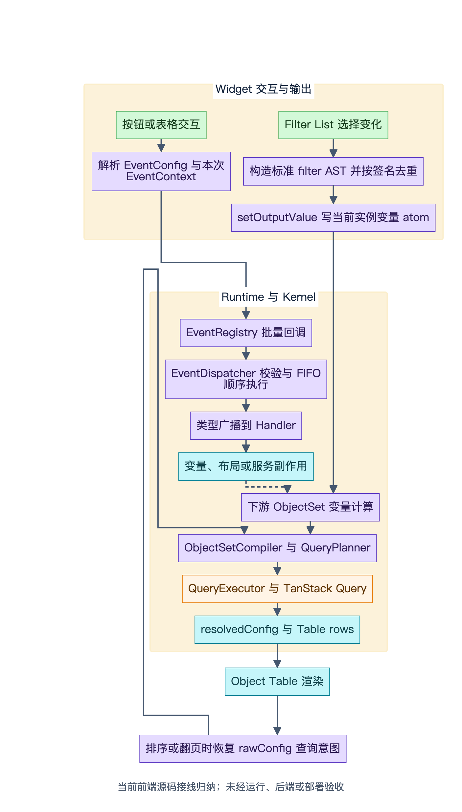
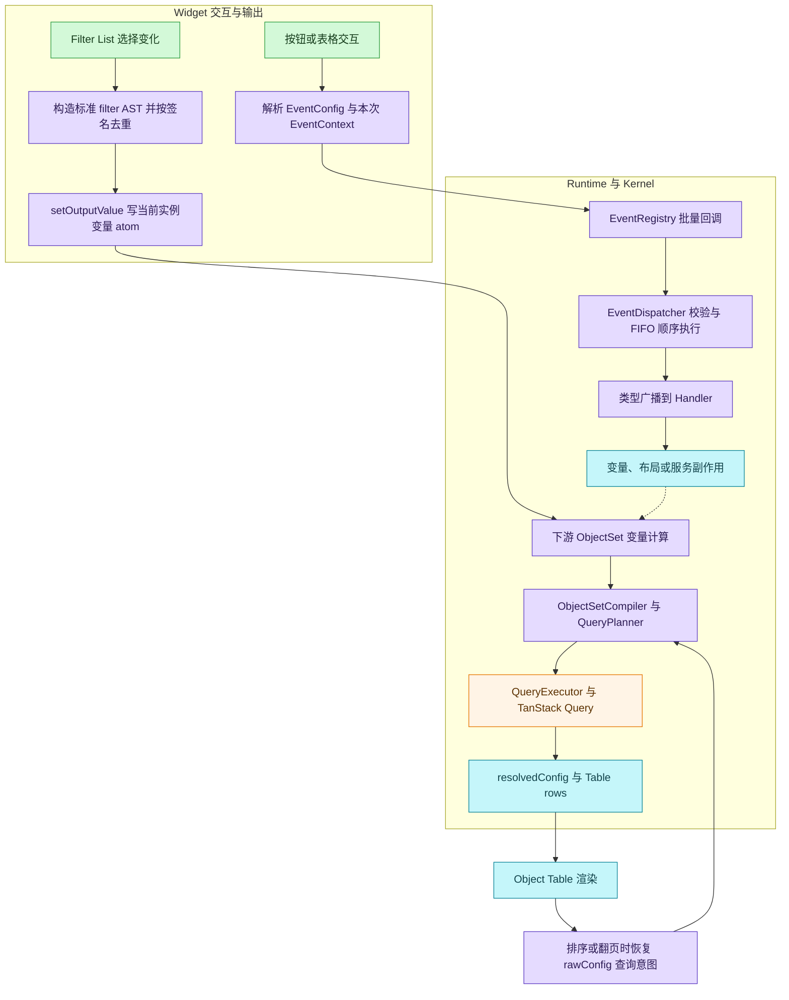
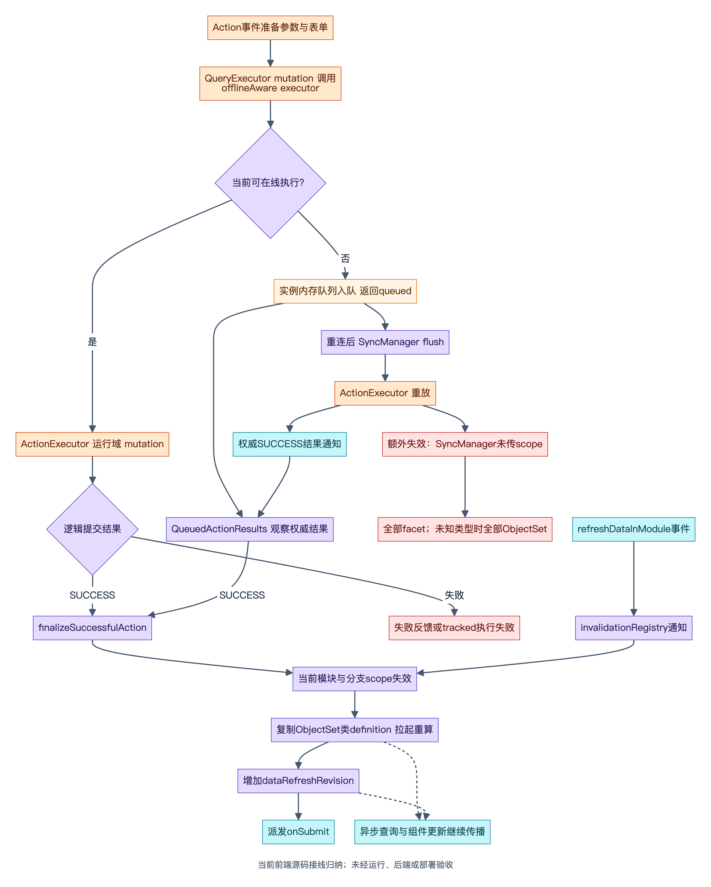
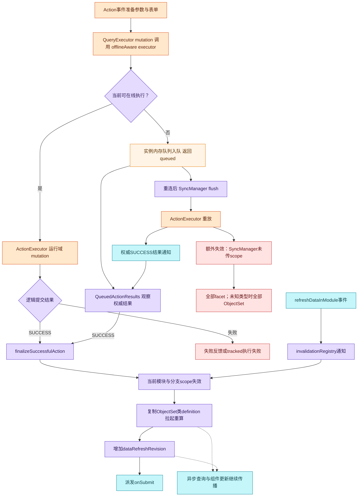

# EOS Workshop：事件、组件联动与数据刷新现状证据

> 本稿由既有只读报告转换为公开审阅拷贝，以下“本次核对”沿用原静态研究记录。本研究仓库不包含 EOS 源码；相对引用用于用户已有 `eos-workshop` checkout 核查，无法在本仓库直接打开。转换未重新审计 EOS 行为；随后仅只读核验相对路径与行号。未运行 EOS 测试、后端或部署。
> 统一基线：`main @ ea071209ca3bce25e45bbca87a9f90f959ef59ed`；原观测工作区已有27个 tracked 文档变化和5个 untracked 项。本稿包含当时的工作区文档现状，不将其视为固定 HEAD 中已提交内容。

日期：2026-10-01。用途：经用户明确授权公开的架构现状报告，供后续 Palantir Workshop 官方资料对照。原核对阶段未联网；本稿只含说明、图与相对证据引用，不含原始源码整包，未修改 EOS 项目。

源码引用根目录：`eos-workshop`。本文不独立核验分支、commit、工作区变更；这些由主报告统一记录。

结论：默认 Runtime 已经接通事件分发、Widget 输出变量、ObjectSet 查询与缓存、Action 成功后失效和重新计算，以及离线 Action 入队和结果观察。后续研究应围绕现有语义、实际旁路与一致性边界展开，不应重复设计基本事件总线或缓存体系。离线重放的失效范围、元数据变更通知、跨会话离线恢复、提交重试幂等是值得明确对照的问题。

## 证据范围与判定口径

- **源码事实**：当前文件明确存在的控制流、参数、调用、声明或实现。
- **静态接线推断**：通过入口和调用链可以确认默认装配关系，但未启动应用验证现场行为。
- **未验证**：后端契约、真实请求、生产缓存隔离、应用交互和测试是否通过。
- 本次只读使用文件检索、源码/文档读取；没有安装依赖、运行测试、构建、生成 SDK、执行可能写入 EOS 的脚本、提交或推送。
- 事件、数据、变量与 Widget 交互的证据可以覆盖联动机制；本文没有重复开展 Custom Widget 专题审阅。

## 文档台账

| 材料 | 本次读取内容 | 与当前源码关系 |
| --- | --- | --- |
| 根 AGENTS.md（`AGENTS.md`） | 包职责、依赖边界、数据链、QueryKey/freshness、专题文档入口 | 当前项目约束；明确 ObjectSet 是查询表达式，dataset 是缓存值 |
| Kernel AGENTS（`packages/kernel/AGENTS.md`） | store/variable-engine/query-engine 入口与查询失效检查口径 | 当前局部约束 |
| Runtime AGENTS（`packages/runtime/AGENTS.md`） | Provider/bootstrap、渲染、services/registry 生命周期 | 当前局部约束 |
| `.agents/skills/openspec-explore/SKILL.md` | 只读探索与实际代码调查规则 | 已采用，不执行 CLI 或创建 EOS 工程制品 |
| 事件系统架构总览（`docs/architecture/Workshop 事件系统架构总览.md:250`） | 能力矩阵、事件主链、顺序语义、Action/offline 生命周期 | 大部分接线可核实；变量赋值描述需要考虑当前 ObjectSet 引用分支 |
| `docs/architecture/Workshop 事件系统细节设计.md` | 通过相关章节检索核对协议与默认 runtime 接线描述 | 补充材料，不作为未读取全段的独立事实源 |
| 数据层架构与落地规范（`docs/architecture/Workshop 数据层架构与落地规范.md:759`） | QueryKey、时效、失效、离线持久化与双轴状态 | 832–850 的失效示例仍不带 scope，不能覆盖当前在线/手动接线 |
| GraphQL 三消费域接入架构（`docs/architecture/Workshop GraphQL 三消费域接入架构.md:118`） | resource binding、runtime query scope、RID/apiName、metadata 生命周期 | 132/142/150 的现行口径更贴近当前源码；offline SyncManager 仍有例外 |
| student 示例数据流（`docs/architecture/student 示例：Filter List 与 Object Table 数据流.md:7`） | Filter List 输出、下游 ObjectSet、Table 排序/分页、原始 DSL 与 runtime value | 示例主链成立；数据是 2026-05-25 快照，部分字段获取说明仍有历史内容 |
| 旧 ADR | 本子任务未独立定位/读取具体 ADR 文件 | 不把旧 ADR 作为当前实现事实；主报告可补充其路径和历史决策背景 |

## 一、事件系统已有实际运行时接线

**源码事实。** `packages/runtime/src/bootstrap/VariableEngineRuntimeProvider.tsx:197` 创建实例 event bridge；345–380 创建 `WorkshopEventsInitializer` 并注入变量引擎 store、当前 module/session stores、Action/Query executors、toast/logger/navigation 和 `onActionCommitted`；383–388 在 effect 中初始化并清理。不是仅存在一个 Dispatcher 类。

`packages/kernel/src/events/WorkshopEventsInitializer.ts:107–123` 创建 Dispatcher、绑定跨 handler 依赖、给 registry 绑定 Dispatcher、快照默认值、注册事件类型监听。135–163 创建六类 handler：Widget、Appearance、Data、Layout、Variable、Application。214–217 用所有 `WORKSHOP_EVENT_TYPES` 注册类型广播消费者。

**实际触发链。** `packages/widgets/button-group/src/domain/ActionBridge.ts:59–79` 从 EventConfig 取出可派发事件并调用 `eventBridge.getCallbackForEvents(events, context)()`；`packages/widgets/object-table/src/domain/ActionBridge.ts:79–112` 对行选择同样派发。表格右键动作60–72会把本次点击对象作为参数变量 override 放进 EventContext，避免必须先全局改写 activeObject 才能解析参数。

`packages/kernel/src/events/EventRegistry.ts:91–124` 先发精确事件通道再发类型通道；批量调用优先委托 Dispatcher。文档和源码注释均明确：精确事件对象监听是预留，按类型广播是当前主通道。

关键证据：Runtime 装配（`packages/runtime/src/bootstrap/VariableEngineRuntimeProvider.tsx:345`）、Initializer（`packages/kernel/src/events/WorkshopEventsInitializer.ts:107`）、Registry（`packages/kernel/src/events/EventRegistry.ts:91`）。

## 二、顺序、错误与后台等待已经有明确语义

**源码事实。** `packages/kernel/src/events/EventDispatcher.ts:78–87` 的普通批量派发先 canonical 归一化，再 FIFO 入队。149–240 按数组顺序 await callback，校验事件、读取 descriptor，注入 batchId/traceId/orderIndex，处理默认 continue、descriptor policy、failFast、terminal 和观测日志。

`executeEvents` 路径90–125与普通派发不同：不先丢弃损坏事件，逐项失败必须可观察；返回 `executionId`、`committedActions`、`status`。90–120的 observationSignal 仅停止视图监听，业务执行不因观察取消而撤销。

`packages/kernel/src/events/EventQueue.ts:33–71` 在后台结果等待时释放当前派发位置，结果 ready 后重新排队取得位置；完整业务 Promise 继续保留。`packages/kernel/src/events/QueuedActionResults.ts:12–42`报告 queued/running/unknown，只有权威 SUCCESS 后调用成功回调。67–95 默认5分钟超时报告 unknown；超时不生成失败/取消终态，也不消费以后返回的权威结果。宿主销毁会清理并中止为 unknown。

**边界。** 事件总览367–370的“顺序执行、不等待前一事件的下游计算传播”是普通基线，而不是所有分支均不 await。`packages/kernel/src/events/handlers/VariableAccessor.ts:142–163` 的 numericAggregation 重算等待变量结果并检查 generation；tracked 非 aggregation 重算也 await目标变量 READY。这里没有全图完成屏障。

`packages/kernel/src/events/handlers/ApplicationEventHandler.ts:360–378` 的 composite/conditional 已执行子事件；Initializer197–199将它接到 `dispatchNestedEvents`，复用校验/错误语义且避免子事件等待自身队列位置。`packages/kernel/src/events/handlers/WidgetEventHandler.ts:19–22` 的 widgetEffect当前只是debug，不能算作跨 Widget imperative命令已实现。

关键证据：Dispatcher（`packages/kernel/src/events/EventDispatcher.ts:90`）、队列（`packages/kernel/src/events/EventQueue.ts:33`）、后台结果（`packages/kernel/src/events/QueuedActionResults.ts:12`）、重算等待（`packages/kernel/src/events/handlers/VariableAccessor.ts:142`）。

## 三、Widget 联动依靠声明输出与查询意图传播

**源码事实。** `packages/runtime/src/runtime/widget/hooks/useWidgetDataBinding.ts:42–48` 从当前实例 registry中锁定版本的runtime module读取 outputs；56–64解析输入配置、输出变量ID与状态。66–83的 `setOutputValue` 检查绑定与变量定义，针对ObjectSet检查类型兼容，写入当前实例 `variableAtomFamily`；undefined转为runtimeUndefinedValue。它不是写一个Widget私有全局缓存。

`packages/runtime/src/runtime/widget/WidgetRuntimeRenderer.tsx:149–168` 把变量定义与当前变量值getter装配成 `objectSetHelpers.resolveObjectSetQuery`。208–230将解析配置、输出 setter、eventBridge、queryExecutor、objectSetHelpers、dataRefreshRevision交给模块渲染器；`packages/runtime/src/runtime/widget/WidgetModuleRenderer.tsx:177–206`最终透传给真实Widget。

**student具体链。** `packages/widgets/filter-list/src/hooks/useFilterListSelectionState.ts:327–379`将本地选项/范围/日期/关键词状态构造成标准objectSetFilter AST；稳定签名不变时不重复写输出，变化才 `setOutputValue('filters', filtersState)`。Table消费下游filteredStudents，而非直接订阅Filter List组件。

Table排序/翻页不会只用当前rows推回查询。`packages/runtime/src/runtime/widget/objectSetQueryResolver.ts:104–135`先尝试runtime value中保留的query DSL，否则反查引用变量的definition，再解析嵌套变量并可追加filter；`packages/widgets/object-table/src/hooks/useObjectTableQueryExecution.ts:72–106`将ObjectSet key、原配置key、dataRefreshRevision合成resolutionKey，并清理旧解析回调。`packages/widgets/object-table/src/ObjectTableWidget.tsx:282–315`实际调用该hook，并将revision传给显式分页hook。

**补充语义。** `packages/kernel/src/events/handlers/VariableEventHandler.ts:74–79`对双方ObjectSet且 `materializeObjectSet !== true` 使用动态source引用；82–90才是解析值后复制。`packages/kernel/src/events/handlers/VariableAccessor.ts:133–139`清除目标runtime override并将target definition设为变量引用。

关键证据：输出桥（`packages/runtime/src/runtime/widget/hooks/useWidgetDataBinding.ts:66`）、查询意图恢复（`packages/runtime/src/runtime/widget/objectSetQueryResolver.ts:104`）、Table刷新解析（`packages/widgets/object-table/src/hooks/useObjectTableQueryExecution.ts:72`）、ObjectSet赋值（`packages/kernel/src/events/handlers/VariableEventHandler.ts:74`）。

*当前前端源码接线归纳；未经运行、后端或部署验收。[可缩放 SVG](diagrams/11-eos-event-runtime.svg)。*

查看可编辑 Mermaid 源

图表示源码接线，不宣称每次交互已在真实后端运行验收。

## 四、查询加载、批量规划与dataset缓存已有实现

**源码事实。** `packages/runtime/src/bootstrap/createRuntimeServices.ts:352–425`创建resource resolver、模块级ObjectType/ActionType metadata providers、ActionExecutor、ObjectSetCompiler、QueryPlanner、canonical QueryExecutor。不是Widget各自拼业务endpoint。

`packages/kernel/src/query-engine/runtime-query/QueryExecutor.ts:798–840`将ObjectSet请求入队；1156–1248使用microtask汇集、过滤已取消请求、验证derived selection、planner规划，再并行执行计划并向各consumer投影字段。字段有界/无界、排序、分页与partition会参与执行计划和查询缓存key。

`packages/kernel/src/query-engine/cache/queryKeys.ts:60–108`是ObjectSet/facet key工厂，包含ObjectSet/queryShape稳定hash、executionPlanFingerprint、partitionId、pageSize/pageToken、branchRid/globalBranchRid。`packages/kernel/src/query-engine/runtime-query/QueryExecutor.ts:1338–1371`再接运行域context cache key，fetchQuery metadata保存实际affectedObjectTypes/runtimeQueryScope；请求用runtime binding与对应requester执行。

**缓存失败语义。** 同文件1381–1409：历史缓存存在则继续返回dataset，浏览器离线标OFFLINE_HIT，其它请求错误标STALE，并保留内部warningCause；无缓存继续抛错。Widget安全边界 `packages/runtime/src/runtime/widget/infra/createWidgetQueryExecutor.ts:19–85`只返回公开结果与安全刷新失败文案，内部错误不直接显示。

**时效与默认值必须分层描述。** `packages/kernel/src/query-engine/cache/freshness.ts:7–12`为metadata30分钟、ObjectSet2分钟、aggregation5分钟、realtime0、moduleConfig∞。realtime0表示立即stale，不意味着不存储缓存。`packages/runtime/src/bootstrap/WorkshopRuntimeProvider.tsx:212–220`的默认/选项QueryClient来自 `packages/kernel/src/hooks/queries`；该工厂 `packages/kernel/src/hooks/queries/queryClient.ts:21–96`默认staleTime5分钟、GC30分钟、查询retry2、mutationretry1、关闭focus refetch、开启reconnect refetch。QueryExecutor的具体fetch显式应用预设，可覆盖默认5分钟。`packages/kernel/src/query-engine/shared/queryClientConfig.ts`另外提供默认staleTime2分钟的工厂，不能把两者混为同一个入口。

**未接活能力。** `enableQueryCachePersistence` helper存在于 `packages/kernel/src/query-engine/shared/queryClientConfig.ts:41–69`，默认Provider未调用；本次在相关Runtime、runtime-query与SaaS目录限定检索也未见调用。数据层规范853起明确持久化为可选能力。不能据此声称默认已有跨重启数据缓存。

关键证据：Query执行与缓存（`packages/kernel/src/query-engine/runtime-query/QueryExecutor.ts:1338`）、QueryKey（`packages/kernel/src/query-engine/cache/queryKeys.ts:60`）、默认QueryClient（`packages/kernel/src/hooks/queries/queryClient.ts:21`）、持久化helper（`packages/kernel/src/query-engine/shared/queryClientConfig.ts:41`）。

## 五、Action提交成功后的刷新闭环已经接通

**源码事实。** `packages/kernel/src/events/handlers/ApplicationEventHandler.ts:229–305`校验actionTypeRid、准备参数/表单；远程表单已执行结果244–248进入统一成功finalize。Workshop自身执行路径258–283先onStart，再 `QueryExecutor.executeAction(input, runtimeActionExecutor)`。queued分支285–296不立即提交后生命周期，而是观察权威结果；SUCCESS才调用finalize。

`packages/kernel/src/query-engine/runtime-query/ActionExecutor.ts:74–91`按稳定RID解析actionType binding，校验GraphQL操作名和参数名，查询argument contract，构造动态mutation，并使用binding对应的运行域requester。不会把branch字段作为业务参数任意发送。返回影响类型可能为null，默认解析部分无结构结果为SUCCESS（113–139），这一成功判定仍依赖实际后端contract正确。

`packages/kernel/src/query-engine/runtime-query/QueryExecutor.ts:1643–1675`用TanStack mutation执行，queued时跳过直接失效；普通resolved payload执行scope失效。需注意：1669在逻辑status不是SUCCESS时仍用未知affected types触发fallback；后续handler再判断业务失败，所以源码不能表述为仅逻辑SUCCESS才发生该处缓存失效。

`packages/kernel/src/events/handlers/ApplicationEventHandler.ts:770–779`在成功finalize记录committedActions、await onActionCommitted，再派发onSubmit。普通派发时刷新异常仅记warning，不反向把已提交Action改为失败（1117–1130）；tracked路径则将刷新异常传播给执行结果，committedActions仍能表达已发生提交。

**默认刷新装配。** `packages/runtime/src/bootstrap/VariableEngineRuntimeProvider.tsx:198–206`按scope失效，调用 `refreshObjectSetVariablesAfterAction`，再递增dataRefreshRevision。后者按ObjectSet/aggregation类型和静态ObjectType命中筛选；影响类型缺失或变量静态类型无法识别时保守重算（`packages/runtime/src/bootstrap/refreshObjectSetVariablesAfterAction.ts:79–136`）。它复制definition对象、调用engine.setDefinitions，但没有await所有新的后端查询完成。

**静态接线推断。** 已接通的是“提交后主动重新拉起读取与Widget刷新”，不是“onSubmit开始时所有下游组件已读到新数据”的一致性屏障。真实后端写入可见延迟、读取版本与UI最终一致时间未测。

独立ActionForm Widget也有回调桥，但顺序不同：成功后先写isSubmitting/lastSubmitSucceeded output，异步notifyCommitted，再立即派发onSuccess；刷新失败显示refreshFailed，不改写提交成功（`packages/widgets/action-form/src/ActionFormSession.tsx:111–128`）。不应将该独立路径描述为await刷新完成后再onSuccess。

关键证据：Action主链（`packages/kernel/src/events/handlers/ApplicationEventHandler.ts:229`）、mutation失效（`packages/kernel/src/query-engine/runtime-query/QueryExecutor.ts:1643`）、默认刷新（`packages/runtime/src/bootstrap/VariableEngineRuntimeProvider.tsx:198`）、变量刷新策略（`packages/runtime/src/bootstrap/refreshObjectSetVariablesAfterAction.ts:108`）。

## 六、在线与手动失效已隔离，离线重放有scope例外

**源码事实。** `packages/kernel/src/query-engine/cache/invalidation.ts:30–70`比较globalBranchRid、moduleRid、resource identity fingerprint、metadataSessionKey；86–107有scope时只命中该scope的objectSet/facet家族，影响类型未知也只fallback该scope。Provider198–204明确传入 `services.runtimeGraphQLQueryScope?.()`；QueryExecutor1670传入其runtimeQueryScope。`packages/runtime/src/bootstrap/createRuntimeServices.ts:238–285`构造由实际ObjectType集合与Shellcontext cacheKey组成的运行域scope/key，404–422给QueryExecutor注入模块、资源identity、metadataSession、globalBranch。

手动refreshDataInModule不是直接扫所有QueryClient缓存。`packages/kernel/src/events/handlers/DataEventHandler.ts:17–24`调用invalidationRegistry.invalidateAll，Provider390–399监听它并调用当前Runtime的refreshModuleData。

**已接线例外。** `packages/runtime/src/bootstrap/createRuntimeOfflineActionBridge.ts:152`创建 `SyncManager(networkMonitor, queue, queryClient)`；SyncManager46–48在每项重放execute后调用 `invalidateObjectSetWithFallback(queryClient, mutation.affectedObjectTypes)`，没有runtimeQueryScope。于是走helper110–122：所有facet失效，影响类型缺失则所有objectSet失效，影响类型已知则按对象类型跨scope匹配。后续成功结果回调还会触发当前Runtime scoped刷新，但不会撤回已发生的宽范围失效。

**静态风险，不是已复现故障。** 当多个Runtime/feature分支共享QueryClient时，此offline旁路可能使其它scope缓存被标stale/重取。是否导致真实跨分支请求或体验问题需要现场验证；当前源码足以证明隔离策略未覆盖全部路径。

**持久性边界。** `packages/kernel/src/query-engine/offline/OfflineMutationQueue.ts:22–69`仅实例数组，enqueue要求idempotencyKey、同轮flush去重、失败最多3轮；没有磁盘/IndexedDB恢复。`packages/runtime/src/bootstrap/createRuntimeOfflineActionBridge.ts:90–95`的监听与结果缓存也仅内存。入队和权威queued结果观察已接活，跨关闭/重开会话恢复不可宣称完成。

关键证据：scope失效（`packages/kernel/src/query-engine/cache/invalidation.ts:86`）、离线旁路（`packages/kernel/src/query-engine/offline/SyncManager.ts:46`）、离线桥装配（`packages/runtime/src/bootstrap/createRuntimeOfflineActionBridge.ts:152`）、内存队列（`packages/kernel/src/query-engine/offline/OfflineMutationQueue.ts:22`）。

*当前前端源码接线归纳；未经运行、后端或部署验收。[可缩放 SVG](diagrams/12-eos-data-refresh.svg)。*

查看可编辑 Mermaid 源

图只表示已核实接线；在线QueryExecutor自身在mutation resolved时还先失效一次，图压缩为成功回调的主刷新链。failed逻辑payload也可能经过mutation onSuccess失效，详见第五节。独立ActionForm的异步notifyCommitted/onSuccess路径不包含在这张事件Action主链图中。

## 七、metadata生命周期与幂等保证仍有边界

**metadata源码事实。** `packages/kernel/src/query-engine/runtime-query/RuntimeObjectTypeMetadataProvider.ts:26–60`缓存RID到Promise；并发复用、失败删除缓存；成功没有TTL、invalidate或资源变更订阅。ActionType provider32起同构。`packages/runtime/src/bootstrap/createRuntimeServices.ts:352–390`创建模块级resolver/providers。当前普通refreshModuleData仅失效objectSet/facet、刷新变量与revision，不清除或重建这些metadata providers。

三消费域文档142明确“Ontology Manager修改apiName后，需要刷新或重开模块以重建provider；当前没有资源变更事件订阅”。本次在相关Runtime/runtime-query/SaaS目录限定检索未找到资源/metadata变更订阅。这里的刷新应理解为能重建服务实例的模块刷新/重开，不能直接等同于refreshDataInModule事件。

**幂等源码事实。** Application handler726–734创建ExecuteActionInput.idempotencyKey，offline桥34–56保留它，队列46–51只在同轮flush去重。默认ActionExecutor81–90只从input.parameters构造mutation variables，没有看到发送input.idempotencyKey的参数或header；`packages/kernel/src/hooks/queries/queryClient.ts:71–75`默认mutationretry1，QueryExecutor1643–1675未为Action override retry。

**未确认的静态风险。** 客户端队列内去重不证明后端去重。请求已经提交但响应丢失、mutation重试、offline重放是否重复提交，取决于requester/header、Shell或后端Action contract；本次没有运行请求或审查全部外部依赖契约。因此应写“后端幂等保证未确认”，不写“已复现重复提交”。

关键证据：metadata缓存（`packages/kernel/src/query-engine/runtime-query/RuntimeObjectTypeMetadataProvider.ts:26`）、默认Action传输（`packages/kernel/src/query-engine/runtime-query/ActionExecutor.ts:74`）、mutation默认重试（`packages/kernel/src/hooks/queries/queryClient.ts:71`）。

## 八、文档漂移与后续Palantir对照范围

| 现有描述 | 当前证据 | 报告应采用的口径 |
| --- | --- | --- |
| 数据层规范832–850、历史全量fallback模型 | 当前在线/手动传scope；offline SyncManager未传scope | 不笼统声称全量，也不笼统声称全部路径隔离 |
| 事件总览268：setVariableValue仍source-to-target复制 | ObjectSet非materialize分支设动态引用 | 复制与动态引用分支并存 |
| 事件总览367–370：不等待下游计算传播 | tracked重算await目标READY；numericAggregation有generation检查 | 顺序handler完成与全图传播完成不是同一承诺 |
| student文档754：通过ObjectType scalar/enum introspection取得字段 | 三消费域150当前禁止Query root/ObjectType全量introspection；QueryExecutor1320起从runtime binding构造generated binding | 保留示例联动链；字段获取以当前metadata binding为准。Action/aggregation contract introspection是不同范围，不应说项目完全没有introspection |
| student文档的接口和数据返回 | 文档7明确2026-05-25快照 | 用于理解形态，不能当作当前接口/数据量的实时证据 |
| realtime staleTime0被注释为无缓存 | fetchQuery仍有cache；0是立即stale | 不把时效与是否储存缓存混用 |
| 持久化helper与offline队列存在 | 默认未接数据持久化；mutation队列是内存 | 明确会话内能力与跨会话恢复的差异 |

优先对照官方Palantir资料的问题：

1. **事件与状态传播边界**：批次顺序、变量赋值后读值、目标READY与全图稳定、子事件与后台等待应承诺什么？现有FIFO、tracked执行、generation机制作为比较起点。
2. **ObjectSet引用与物化**：动态查询意图、当前dataset、单对象选择、输出变量赋值怎样定义；避免把已有query resolver再设计一遍。
3. **Action后读取一致性**：提交成功、读取可见、组件刷新完成的时点怎样区分；onSubmit/onSuccess应等待哪个阶段？
4. **缓存失效边界**：影响类型精确失效、未知类型fallback、模块/版本/分支隔离、offline重放是否统一scope。
5. **异步Action生命周期**：queued/unknown/cancelled的权威性，观察取消与任务取消，跨宿主关闭的任务恢复与可见性。
6. **metadata变更通知**：RID稳定而apiName/schema变化时如何重建provider、清理旧缓存、保持模块版本/分支隔离。
7. **离线可靠性与幂等**：默认持久化、重试、去重、权威结果订阅、断连后重放的后端保障。

本文没有读取Palantir网页，因此上述仅为后续研究范围，不是Palantir产品行为结论。

## 完成与剩余验证

本公开授权对照稿保留报告与两张 Mermaid 图源。源码事实与默认接线已分别记录。EOS代码/配置保持只读。

剩余验证：真实应用交互、后端提交和读取一致性、shared QueryClient离线隔离、后端幂等contract、跨会话恢复以及测试执行结果；它们没有被本次静态检查证明，也没有因本报告而被修改。
