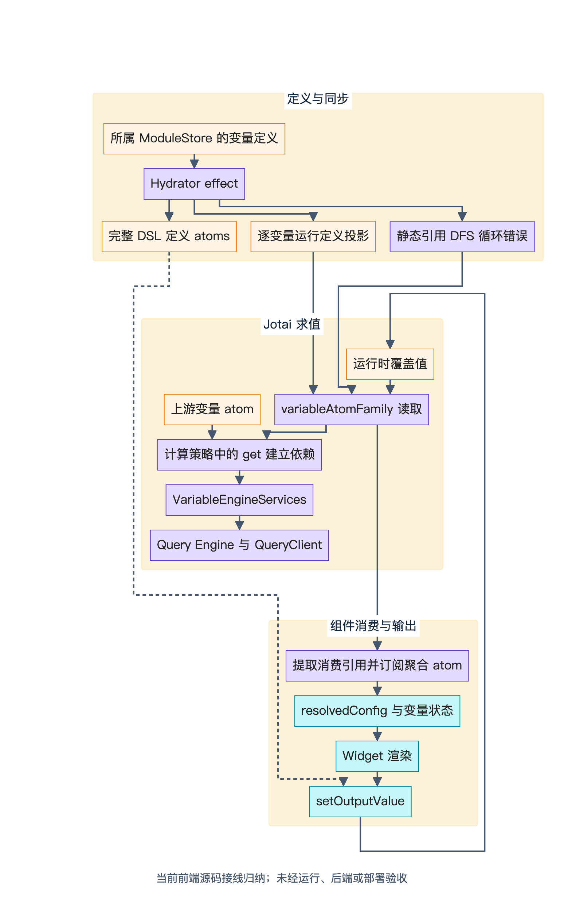
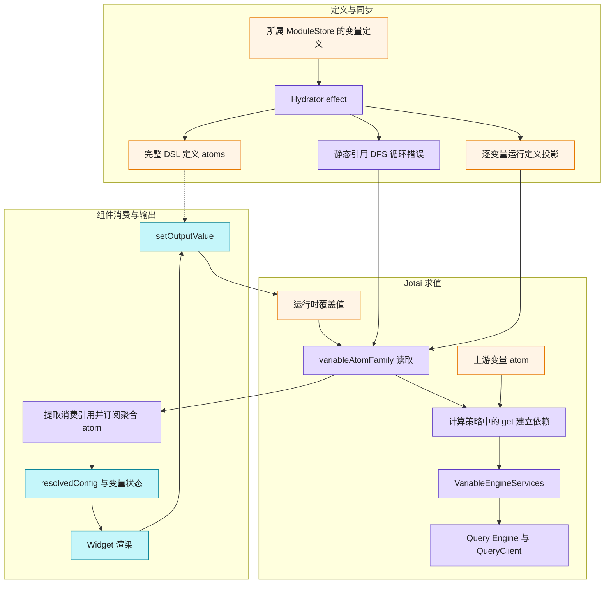
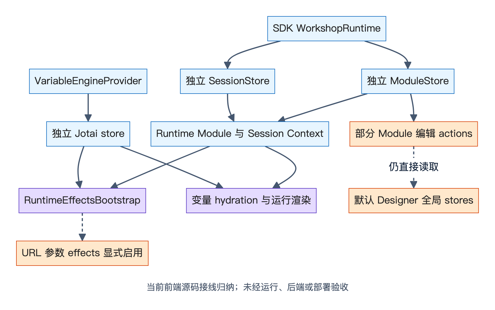
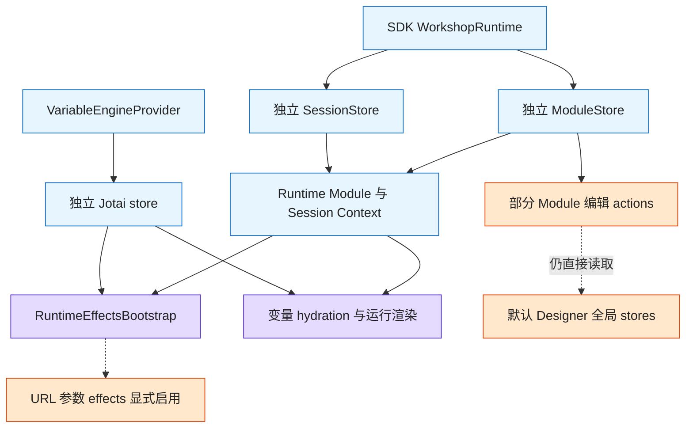

# EOS Workshop 变量与状态机制：只读源码证据

> 本稿由既有只读报告转换为公开审阅拷贝，以下“本次核对”沿用原静态研究记录。本研究仓库不包含 EOS 源码；相对引用用于用户已有 `eos-workshop` checkout 核查，无法在本仓库直接打开。转换未重新审计 EOS 行为；随后仅只读核验相对路径与行号。未运行 EOS 测试、后端或部署。
> 统一基线：`main @ ea071209ca3bce25e45bbca87a9f90f959ef59ed`；原观测工作区已有27个 tracked 文档变化和5个 untracked 项。本稿包含当时的工作区文档现状，不将其视为固定 HEAD 中已提交内容。

日期：2026-10-01

范围：变量定义、运行值、依赖传播、组件数据绑定、实例隔离，以及 cycle / recompute / lazy / state-saving 的当前边界。

源码引用根目录：`eos-workshop`。

本报告是经用户明确授权公开的现状对照资料。原核对阶段没有修改 EOS 项目、安装依赖、运行测试/构建/CLI、fetch、联网、提交、推送或上传内部内容；本稿以独立draft PR审阅，不回写EOS源码。Custom Widget 专题不在本报告范围。

## 1. 阅读方式与证据等级

以下“源码确认”表示实际实现文件中存在相应逻辑与调用关系，不能等同于真实运行验收。“静态推断”表示根据调用顺序、检索结果或边界关系提出的分析；“建议”仅用于后续研究选题。原EOS源码核对阶段没有运行项目、测试或业务浏览器页面，也没有验证后端行为；本次浏览器仅用于离线图像渲染。已有测试文件仅作为当前代码意图的补充，不作为“本次通过”的证据。

源码行号来自本次读取的工作区，后续修改可能使行号移动。下文源码证据均以 `eos-workshop` 根目录相对路径的代码文本引用。分支、commit 与工作区改动状态由主报告统一记录，本子报告不另行推定。

## 2. 已有实现的结论

现有实现已经具备完整的变量联动主链，后续研究应从这些机制出发，无需重新设计一套状态系统：

1. Module DSL、编辑器 UI、Session 分属 Zustand store；变量运行值和依赖计算分属 Jotai；服务端请求缓存由 QueryClient 管理。
2. Runtime 从所属 moduleStore 读取变量定义，通过 Hydrator 注入引擎；引擎将完整 DSL 元数据与计算输入投影分开，减少元数据更新引发的求值。
3. 每个变量以 `variableAtomFamily` 为统一读写入口；运行时输出优先于 DSL 计算；策略中的 `get` 负责建立真实依赖。
4. Widget 消费配置通过变量订阅和解析进入渲染；Widget 输出通过回调写运行时覆盖值，驱动下游变量与消费组件更新。
5. SDK Runtime 已实际创建并注入独立 module/session store 和 Jotai 引擎，但部分 module 编辑操作仍直接读取默认全局 session/UI，隔离范围不能扩大到全部交互。
6. 三种 recompute 模式已进入 `numericAggregation` 路径；懒加载队列控制器存在，但本次静态搜索没有找到非测试调用；变量状态保存仍是协议/展示入口，未发现运行值持久化接线。

## 3. 状态边界

| 状态域 | 当前事实源 | 已确认职责 | 持久化 / 生命周期 |
| --- | --- | --- | --- |
| Module | `packages/kernel/src/store/slices/module/moduleStore.ts` | DSL、加载状态、变量/Widget/布局定义；zundo Undo/Redo | Undo 只追踪 `moduleDefinition`，上限 100；工厂可创建独立实例 |
| UI | `packages/kernel/src/store/slices/ui/uiStore.ts` | 选中、编辑模式、悬停、高亮、拖拽、面板、保存指示、分辨率、布局树 | 默认 `ui-storage` 仅保存面板、选中态、模式、分辨率覆盖和布局树等偏好 |
| Session | `packages/kernel/src/store/slices/session/sessionStore.ts` | 页面、Overlay、运行时折叠、Tab 命令、诊断、嵌入模块状态 | 默认 Designer 保存页面与少量开关；独立实例使用无写入 storage |
| Variable Engine | `packages/kernel/src/variable-engine/core/VariableEngine.ts`、`packages/kernel/src/variable-engine/atoms/*` | 完整定义、计算投影、运行覆盖值、异步求值、循环错误 | 每引擎独立 Jotai store；运行值不写回 DSL |
| Widget 内部 UI | `packages/runtime/src/hooks/state/useWidgetState.ts` | 展开、分页等组件内部状态 | React `useState`，由组件生命周期管理 |
| 服务端数据 | QueryClient / Query Engine | 请求缓存、失效、服务端状态 | 由 QueryKey 与请求 scope 管理，详见数据加载子报告 |

关键源码：

- moduleStore.ts:56（`packages/kernel/src/store/slices/module/moduleStore.ts:56`）：实际中间件是 `devtools → subscribeWithSelector → temporal`。
- moduleStore.ts:160（`packages/kernel/src/store/slices/module/moduleStore.ts:160`）：Undo limit、partialize、batch controller。
- sessionStore.ts:86（`packages/kernel/src/store/slices/session/sessionStore.ts:86`）：SessionState 实际字段；`widgetState` 已标 deprecated。
- sessionStore.ts:315（`packages/kernel/src/store/slices/session/sessionStore.ts:315`）：非持久化 storage 为 no-op。
- sessionStore.ts:655（`packages/kernel/src/store/slices/session/sessionStore.ts:655`）：持久化只包含 current/selected page 与三项开关；默认实例显式 `persist: true`。
- uiStore.ts:955（`packages/kernel/src/store/slices/ui/uiStore.ts:955`）：UI 偏好 partialize；保存指示和变量运行值不在其中。
- useWidgetState.ts:52（`packages/runtime/src/hooks/state/useWidgetState.ts:52`）：Widget 状态使用 React 本地状态。

## 4. 完整变量链路

*当前前端源码接线归纳；未经运行、后端或部署验收。[可缩放 SVG](diagrams/09-eos-variable-ownership.svg)。*

查看可编辑 Mermaid 源

图表示源码确认的接线。虚线是输出写入前读取完整定义进行存在性/类型检查。图中的依赖方向表达数据流；实际 Jotai 依赖由消费策略执行 `get` 建立，没有单独确认一个显式拓扑排序调度器。

### 4.1 设计态定义写入

`createVariableActions` 通过复制 Map 和 ModuleDefinition 实现变量增、改、删。变量定义的 displayName、promoted、usageMetadata、settings、recomputeBehavior 与实际 `definition` 一起维护。此路径属于 Module DSL 及 Undo 域。

证据：variableActions.ts:21（`packages/kernel/src/store/slices/module/variableActions.ts:21`）、variableActions.ts:55（`packages/kernel/src/store/slices/module/variableActions.ts:55`）、variableActions.ts:84（`packages/kernel/src/store/slices/module/variableActions.ts:84`）。

### 4.2 Runtime 注入与 hydration

`VariableEngineRuntimeProvider` 使用 `useRuntimeModuleStore` 读取当前实例的变量定义。渲染树接入 `VariableEngineServicesProvider → VariableEngineHydrator → RuntimeRenderProvider`；services adapter 在 effect 写入当前 engine。

Hydrator 在 `useEffect` 比较 added/removed/updated，调用 `engine.setDefinitions`，在求值依赖可能变化时执行 cycle 检测；新引擎首次注入前不渲染 children，后续更新不反复卸载。

证据：VariableEngineRuntimeProvider.tsx:313（`packages/runtime/src/bootstrap/VariableEngineRuntimeProvider.tsx:313`）、VariableEngineRuntimeProvider.tsx:431（`packages/runtime/src/bootstrap/VariableEngineRuntimeProvider.tsx:431`）、ServicesProvider.tsx:106（`packages/kernel/src/variable-engine/ServicesProvider.tsx:106`）、Hydrator.tsx:129（`packages/kernel/src/variable-engine/hydration/Hydrator.tsx:129`）、Hydrator.tsx:176（`packages/kernel/src/variable-engine/hydration/Hydrator.tsx:176`）。

### 4.3 完整定义与求值投影

当前有三组定义 atoms：全量 `variableDefinitionsAtom`、单变量完整 `variableDefinitionAtomFamily`、单变量计算输入 `variableRuntimeDefinitionAtomFamily`。计算只读最后一组。

`VariableEngine.createRuntimeDefinition` 保留 id、definition、recomputeBehavior、变量类型及“是否有生产 Widget”的必要语义；ObjectSet 类型统一投影为 `{ type: 'objectSet' }`，不把 Module Interface constraints 带入父变量计算。displayName/promoted/settings/消费 metadata 不参与运行定义比较。定义等价检查以引用为基础，而非对整个 DSL 作深比较。

变量删除时清除当前 store 的定义/覆盖值、聚合 controller 和引擎内 loadable cache；atomFamily 身份跨 store 共享，不移除其他实例可能仍使用的 atom。

证据：definitionAtoms.ts:32（`packages/kernel/src/variable-engine/atoms/definitionAtoms.ts:32`）、VariableEngine.ts:82（`packages/kernel/src/variable-engine/core/VariableEngine.ts:82`）、VariableEngine.ts:102（`packages/kernel/src/variable-engine/core/VariableEngine.ts:102`）、VariableEngine.ts:205（`packages/kernel/src/variable-engine/core/VariableEngine.ts:205`）。

已有 `packages/kernel/src/variable-engine/core/__tests__/VariableEngine.runtimeDependencies.test.ts:27` 覆盖 metadata-only 与 ObjectSet 类型约束变化不重算、实际定义变化重算。本次仅读取测试源码，没有执行。

### 4.4 求值与状态

变量 atom 为异步可写 atom。读取优先级为：

1. 已写 runtime override：直接 READY，result type 为 runtime，不进入 DSL 策略；
2. 静态 cycle error：ERROR；
3. 缺少运行定义：ERROR；
4. 尚未初始化的生产变量占位：LOADING；
5. 根据定义类型调用策略。

输出变量的静态默认值仍求值；只有空 ObjectType 的 base ObjectSet 被视为输出占位，已有有效查询会初始化，避免消费与输出互相等待。

证据：variableAtom.ts:43（`packages/kernel/src/variable-engine/atoms/variableAtom.ts:43`）、variableAtom.ts:98（`packages/kernel/src/variable-engine/atoms/variableAtom.ts:98`）、variableAtom.ts:149（`packages/kernel/src/variable-engine/atoms/variableAtom.ts:149`）。

当前真实策略包括 static、variable、function、aggregation/numericAggregation、objectProperty、objectSetFilter、objectSet、stringConcat、conditional、transform/transformList。geoPoint、geoShape、timeSeries、timeSeriesSet、multipassAttribute、objectSetAggregation 注册为显式 ERROR stub，不能因有策略文件就视为已启用。

证据：strategyRegistry.ts:40（`packages/kernel/src/variable-engine/compute/strategyRegistry.ts:40`）、strategyRegistry.ts:59（`packages/kernel/src/variable-engine/compute/strategyRegistry.ts:59`）。

### 4.5 依赖传播与 ObjectSet 请求

`variableStrategy` 通过 `get(variableAtomFamily(refId))` 建立依赖。WorkshopValue 递归解析器经 `createVariableValueGetter` 读取上游；ObjectSet 策略同时解析运行定义与引用，归一化 filters 后调用唯一 `services.executeObjectSet` 链路，缺服务/类型 RID 时显式 ERROR。

conditional 先读 condition，再只读选中的 then/else 分支，因此实际活依赖可以随条件改变。collector 扫描得到的声明引用列表与此实际读取链不是同一个概念。

证据：variableStrategy.ts:29（`packages/kernel/src/variable-engine/compute/strategies/variableStrategy.ts:29`）、valueResolver.ts:201（`packages/kernel/src/variable-engine/compute/valueResolver.ts:201`）、objectSetStrategy.ts:264（`packages/kernel/src/variable-engine/compute/strategies/objectSetStrategy.ts:264`）、objectSetStrategy.ts:150（`packages/kernel/src/variable-engine/compute/strategies/objectSetStrategy.ts:150`）、conditionalStrategy.ts:69（`packages/kernel/src/variable-engine/compute/strategies/conditionalStrategy.ts:69`）。

atom 不下传 Jotai read signal 到业务请求，注释及调用实现在依赖变化时让请求自然完成、由 Jotai 丢弃过期 read。若捕获 AbortError，返回永远 pending 的 promise 交给最新 read 接管，不将 abort 写成终态。此为源码确认的策略，本次未观察取消、切换和并发请求的真实效果。

证据：variableAtom.ts:167（`packages/kernel/src/variable-engine/atoms/variableAtom.ts:167`）、variableAtom.ts:185（`packages/kernel/src/variable-engine/atoms/variableAtom.ts:185`）。

### 4.6 Widget 消费与输出

`useWidgetDataBinding` 按当前锁定版本读取 outputs；输出变量 ID 从 DSL 配置提取，不依赖运行值，保持稳定引用。消费订阅排除输出变量，降低自身输出反馈导致 effect 循环的风险。消费引用还包含格式化与行条件 `valueReferenceMap`。

聚合 async atom 逐个读取消费变量；仅 READY 值进入 value map，状态另行保留。首次加载与刷新均给当前绑定变量标记 LOADING；刷新时值可保留上一份已提交快照。旧快照在 `useLayoutEffect` 保存，避免被中断的 render 污染后续 fallback。

证据：useWidgetDataBinding.ts:42（`packages/runtime/src/runtime/widget/hooks/useWidgetDataBinding.ts:42`）、useResolvedConfig.ts:42（`packages/runtime/src/hooks/state/useResolvedConfig.ts:42`）、useVariable.ts:57（`packages/runtime/src/hooks/state/useVariable.ts:57`）、useVariable.ts:251（`packages/runtime/src/hooks/state/useVariable.ts:251`）。

`setOutputValue` 检查变量存在性及 ObjectSet 输出类型，然后写当前 engine 的可写 atom；没有触碰 moduleStore。明确的 undefined 输出使用 `runtimeUndefinedValue` sentinel，使 READY undefined 区别于“清除 override 恢复 DSL 计算”。通用 setter 写 undefined 则清除覆盖值。

renderer 将 resolvedConfig、resolvedValues、状态、setOutputValue、outputVariableStates 等投影为 WidgetRuntimeProps；输出状态由另一聚合订阅提供，供 Widget 识别外部重置。

证据：useWidgetDataBinding.ts:66（`packages/runtime/src/runtime/widget/hooks/useWidgetDataBinding.ts:66`）、variableAtom.ts:25（`packages/kernel/src/variable-engine/atoms/variableAtom.ts:25`）、useSetVariableValue.ts:42（`packages/kernel/src/variable-engine/hooks/useSetVariableValue.ts:42`）、useOutputVariableStates.ts:50（`packages/runtime/src/hooks/state/useOutputVariableStates.ts:50`）、WidgetModuleRenderer.tsx:177（`packages/runtime/src/runtime/widget/WidgetModuleRenderer.tsx:177`）。

### 4.7 使用关系 metadata

`setupUsageMetadataEffects` 按 Widget 配置及所属 registry 的锁定版本 output 声明区分 producer/consumer，更新 ModuleDefinition 中 usageMetadata；配置引用改变时增量更新，版本锁、Widget 类型、registry 更新时重新计算。声明未加载时保留 published metadata。它不读取 Jotai 运行值，也不承担变量求值调度。

证据：metadataEffects.ts:27（`packages/kernel/src/store/subscriptions/metadataEffects.ts:27`）、metadataEffects.ts:313（`packages/kernel/src/store/subscriptions/metadataEffects.ts:313`）、metadataEffects.ts:332（`packages/kernel/src/store/subscriptions/metadataEffects.ts:332`）。`DslDependencyAnalyzer` 则分析 ObjectType/property/link/Action/function 等元数据资源依赖，同样不是 Jotai 的运行 DAG 调度器。

## 5. 实例隔离及剩余边界

*当前前端源码接线归纳；未经运行、后端或部署验收。[可缩放 SVG](diagrams/10-eos-variable-compute.svg)。*

查看可编辑 Mermaid 源

实线表示已确认实例主链；橙色及虚线表示条件接线或仍依赖默认全局状态的边界，不表示已确认运行故障。

SDK 按当前定义/模块/分支上下文创建独立 moduleStore，并创建不持久化 sessionStore；加载定义成功后提供两组 Context。Provider 创建自己的 engine，Jotai Provider 绑定 `engine.store`。Runtime effects 比较是否为默认 Designer：独立实例将 module/session/registry 注入 `setupAllEffects`，不启动 Designer 选中态与分辨率 effects，URL 绑定默认关闭，只有 `urlRoutingEnabled: true` 才创建实例私有 parameter scope。

证据：WorkshopRuntime.tsx:218（`packages/runtime/src/sdk/WorkshopRuntime.tsx:218`）、WorkshopRuntime.tsx:275（`packages/runtime/src/sdk/WorkshopRuntime.tsx:275`）、WorkshopRuntime.tsx:335（`packages/runtime/src/sdk/WorkshopRuntime.tsx:335`）、VariableEngineProvider.tsx:57（`packages/kernel/src/variable-engine/VariableEngineProvider.tsx:57`）、WorkshopRuntimeProvider.tsx:260（`packages/runtime/src/bootstrap/WorkshopRuntimeProvider.tsx:260`）、RuntimeEffectsBootstrap.tsx:36（`packages/runtime/src/bootstrap/RuntimeEffectsBootstrap.tsx:36`）、store/index.ts:188（`packages/kernel/src/store/index.ts:188`）、store/index.ts:209（`packages/kernel/src/store/index.ts:209`）。

边界：`RuntimeModuleStoreContext` / `RuntimeSessionStoreContext` 未注入时分别回退 Designer 默认实例。部分 module actions 仍直接访问 `useSessionStore` / `useUiStore`，例如 `packages/kernel/src/store/slices/module/widgetActions.ts:66,104`、`packages/kernel/src/store/slices/module/overlayActions.ts:219`、`packages/kernel/src/store/slices/module/sectionActions.ts:1516`、`packages/kernel/src/store/slices/module/layoutActions.ts:1302`。不能因工厂和 Context 已存在而宣称全部运行时/编辑交互隔离。Kernel README 同样明确这一限制。

## 6. Cycle / Recompute / Lazy / State-saving

### 6.1 Cycle：静态扫描与真实依赖的边界

源码确认：`dependencyCollector` 递归识别 canonical VariableRef，以及 `objectSetVariableId` / `sourceId` legacy 字段；收集 definition 与 variableType。cycleDetector 构建邻接表，用 DFS 返回任意第一条环，忽略不存在的引用；Hydrator 仅在新增、删除或运行 definition/type 变化时重新检测。var atom 在策略计算前短路 cycle error。

证据：dependencyCollector.ts:51（`packages/kernel/src/variable-engine/dependency/dependencyCollector.ts:51`）、dependencyCollector.ts:163（`packages/kernel/src/variable-engine/dependency/dependencyCollector.ts:163`）、cycleDetector.ts:66（`packages/kernel/src/variable-engine/hydration/cycleDetector.ts:66`）、Hydrator.tsx:142（`packages/kernel/src/variable-engine/hydration/Hydrator.tsx:142`）、variableAtom.ts:118（`packages/kernel/src/variable-engine/atoms/variableAtom.ts:118`）。

静态推断：声明图扫描包含未选中 conditional 分支和 variableType；真实求值仅读活分支，ObjectSet 运行投影又剥离接口 constraints。两者可能是有意采用不同语义，不能直接认定误报。只返回第一条环也不等于完整多环诊断。适合后续明确：是否禁止所有声明环、是否只阻止活环、缺失引用如何呈现。

### 6.2 Recompute：当前三态主要用于 numericAggregation

源码确认：controller 定义 `automatic`、`eventTriggered`、`moduleLoadAndEvent`。唯一非测试构造调用为 `packages/kernel/src/variable-engine/atoms/aggregationAtoms.ts:44`；scalarAggregation 调用 controller.run，使用 configuration key、services scope 和 generation 维护快照。automatic 每次执行；非 automatic 可复用 snapshot；eventTriggered 未触发时 READY undefined 并带 waiting 标志。

事件重算对 numericAggregation 写专用 trigger atom、等待变量 READY，并核对 generation 未被覆盖。ObjectProperty UI 将非 automatic 两项 disabled，并显示已存入不支持模式的 warning。

证据：recomputeController.ts:83（`packages/kernel/src/variable-engine/compute/recomputeController.ts:83`）、aggregationAtoms.ts:41（`packages/kernel/src/variable-engine/atoms/aggregationAtoms.ts:41`）、scalarAggregation.ts:41（`packages/kernel/src/variable-engine/compute/scalarAggregation.ts:41`）、VariableAccessor.ts:147（`packages/kernel/src/events/handlers/VariableAccessor.ts:147`）、ObjectPropertyDefinitionForm.tsx:264（`packages/designer/src/panels/variables/components/ObjectPropertyDefinitionForm.tsx:264`）。

静态搜索：对 `packages`、`apps` 的 `.ts/.tsx`，排除 `__tests__`、`dist`、`node_modules`，搜索 `createRecomputeController|shouldRecompute|getModuleLoadVariables|triggerEventRecompute`。外部调用只见 aggregationAtoms 构造和 `shouldRecompute`；module-load/event helper 没有找到调用。普通 var atom 不读取 controller，不能把三态推广为所有变量类型的统一执行策略。此为接线范围判断，不是已验证 bug。

### 6.3 普通变量事件重算：需验证完成语义

源码确认：非 numericAggregation 的 `triggerVariableRecompute` 复制 definition，调用 `setVariableDefinitionValue` 写所属 moduleStore，然后立即读取 Jotai atom；execution 上下文存在时等待并断言 READY。该写入会经过 ModuleStore temporal 路径；没有单独确认一种排除 Undo 的普通重算 command。

证据：VariableAccessor.ts:156（`packages/kernel/src/events/handlers/VariableAccessor.ts:156`）、VariableAccessor.ts:279（`packages/kernel/src/events/handlers/VariableAccessor.ts:279`）。

静态推断：module → atom 的同步在 Hydrator effect，而当前函数写 module 后立即读 atom。后续应定向验证 awaited READY 是旧代还是新代求值、连续事件与 pending 请求是否一致；本次不认定存在实际错误。numericAggregation 的 generation 路径不能作为普通路径已正确的证明。

### 6.4 Lazy / eager：控制器存在，但未找到运行接线

源码确认：`lazyLoadController` 实现 HIGH/NORMAL/LOW 优先级、最大并发数、待执行队列、完成/失败移除、prefetch。routing/stateSaving 配置影响默认优先级。

静态搜索：对 `packages`、`apps` 的 `.ts/.tsx`，排除 `__tests__`、`dist`、`node_modules`，搜索 `createLazyLoadController|LoadPriority`；结果仅声明与 `packages/kernel/src/variable-engine/compute/index.ts` 导出。另对 variable-engine、runtime、runtime-sdk 非测试源码搜索 `eager|prefetch|requestLoad|getNextToLoad|markLoadComplete|markLoadFailed`，只见控制器内部实现。

证据：lazyLoadController.ts:76（`packages/kernel/src/variable-engine/compute/lazyLoadController.ts:76`）、lazyLoadController.ts:99（`packages/kernel/src/variable-engine/compute/lazyLoadController.ts:99`）、compute/index.ts:39（`packages/kernel/src/variable-engine/compute/index.ts:39`）。

静态推断：当前可确认按 atom 读取求值，以及渲染消费订阅；不能宣称优先级队列、变量级并发控制或统一 eager prefetch 已进 Runtime。`useAllResolvedVariables` 有全量读取实现，但原核对在 `packages`、`apps` 非测试路径未找到调用，它不能证明模块加载会自动求值全部变量。

### 6.5 State-saving 与自动刷新

源码确认：`settings.stateSaving` 是协议字段；SettingsTab 显示 FeatureSwitchBlock，但没有 onChange；中文文案写明“保存状态时存储此变量的当前值，功能暂不可用”。Module runtime configuration 也保留 stateSaving 字段，不能据此认定存在变量运行值持久化。

证据：SettingsTab.tsx:356（`packages/designer/src/panels/variables/components/VariableEditorContent/SettingsTab.tsx:356`）、designerVariables.ts:693（`apps/workshop-saas/src/i18n/resources/designerVariables.ts:693`）、`packages/contracts/src/dsl/variable.ts:65`。

`useAutoRefresh` 有按默认全局 session 开关、30 秒定时失效 `['objectSet']` 的实现，页面隐藏时跳过。非测试源码搜索只见定义及 middleware README 示例，未找到产品调用。因此会话开关、hook 文件和示例都不足以证明自动刷新已进入实际 Runtime。

证据：useAutoRefresh.ts:13（`packages/kernel/src/hooks/useAutoRefresh.ts:13`）。

## 7. 现行文档、历史文档与源码差异

本次按 Architecture 台账（`docs/architecture/README.md:1`） 优先读取根 README、总体架构指南、变量/Widget/Ontology 联动架构、kernel/runtime README 和根/包 AGENTS；沿用 `.agents/skills/openspec-explore/SKILL.md` 的探索定位。没有运行其建议的 openspec CLI，遵守用户只读约束。

| 文档 | 台账/文档状态 | 本次使用方式 |
| --- | --- | --- |
| 根 README 状态管理段落，999–1025 | 工程事实源入口，明确 API 以源码/专题为准 | 确认 Store / Variable / Query 三层与路径 |
| Workshop 总体架构指南 | 台账列为当前总体事实源 | 对照 Provider、Store、变量、subscriptions；局部段落仍需源码校准 |
| Workshop 变量、Widget 与 Ontology 联动架构 | 2026-05-24 调研、2026-06-12 复核；明确为概念总览，代码路径为准 | 核对变量 → 查询 → Widget → output 主链，未直接采纳后续建议为现状 |
| packages/kernel README | 当前公开 API 与源码组织 | 重要补充实例隔离、runtime-definition、输出初始化边界 |
| packages/runtime README | 当前 runtime 入口与链路 | 核对变量快照、状态传播、Action 参数保留引用 |
| docs/architecture/archive/* | 台账明确历史蓝图/一次性记录 | 不作为当前实现事实源 |
| RTK版本README、六月 AI Draft | 历史口径 | 未用来证明当前变量运行机制 |

当前仍见需校准的表述：

- 总体指南 528–532 称 moduleStore 使用 autoSave 中间件；当前 `packages/kernel/src/store/slices/module/moduleStore.ts:56` 只有 devtools/subscribeWithSelector/temporal。保存链应以保存专题源码为准。
- 总体指南 578 列出 `actionExecution` 会话字段；当前 `SessionState:86–152` 没有该字段。
- 总体指南 1067–1078 图仍把完整 definition 当计算输入，没有体现新增 runtime-definition 投影；当前 var atom 读取该投影。
- 总体指南 subscriptions 表 1411 列 `setupActionExecutionEffects`；当前 `packages/kernel/src/store/index.ts` 的聚合启动没有该项，不能凭表确认事件/队列实际接线。
- 根 README 74、1013 写“拓扑排序/拓扑计算”；当前确认的是 Jotai 读取建立依赖与静态 DFS 检测，没有确认独立手工拓扑执行器。
- 总体指南 1119–1126 的 activeObject 智能重置归属 ObjectTable 内部逻辑，不是所有变量自动重置的 Kernel 保证。本子报告没有对 ObjectTable 内部选择逻辑作完整验收。

以上是文档与当前工作区源码的差异，不表示整个文档失效，也不表示真实运行故障。

## 8. 后续 Palantir 对照研究范围建议

以下为建议，尚未访问官方资料，也不宣称官方行为：

1. **变量生命周期与覆盖规则**：初始值、Widget output、clear/reset、定义编辑、切换页面/模块、卸载后的覆盖值保留，特别是 READY 空值与未初始化的区别。
2. **声明依赖与活依赖**：条件分支、ObjectSet 类型约束、跨模块输入、缺失引用与多环诊断；官方是否区分配置图与实际执行图。
3. **执行策略**：automatic/event/module-load 的适用变量类型；隐藏组件/页面对求值的影响；懒加载、预加载、并发、优先级和请求取消的契约。
4. **事件完成与刷新一致性**：普通变量重算是否有 generation/事务边界，事件 await 对应何代求值，Action 后缓存失效与变量刷新如何合并。
5. **保存与复现**：变量 state-saving、URL routing、模块输入、会话重置、恢复快照与 DSL 保存各自范围；避免把 UI 偏好持久化当业务状态保存。
6. **实例/嵌入模块隔离**：多 Runtime 共享 metadata、服务端缓存和资源 scope 的边界；父子模块通信与独立 session 的约定。
7. **诊断可观察性**：静态 usage metadata、活 DAG、加载/错误/缓存 fallback 的展示，是否支持准确追踪 producer 和 consumer。

建议先用当前已经成立的过滤输出 → ObjectSet 派生 → 表格消费 → 选中对象输出链做官方语义映射，再针对上述未验证边界补研究，避免重复设计现有主链。

## 9. 交付与限制

本报告提供源码证据和两张 Mermaid 图，可在支持 Mermaid 的 Markdown 阅读器中渲染。按用户明确授权作为公开现状对照稿，不回写 EOS 文档。没有运行验证，因此所有“已确认”均限于静态源码接线；列出的时序、隐藏页面、刷新、持久化与多实例行为仍需后续明确授权的定向运行验收。原核对阶段没有剩余文件读取阻塞。
