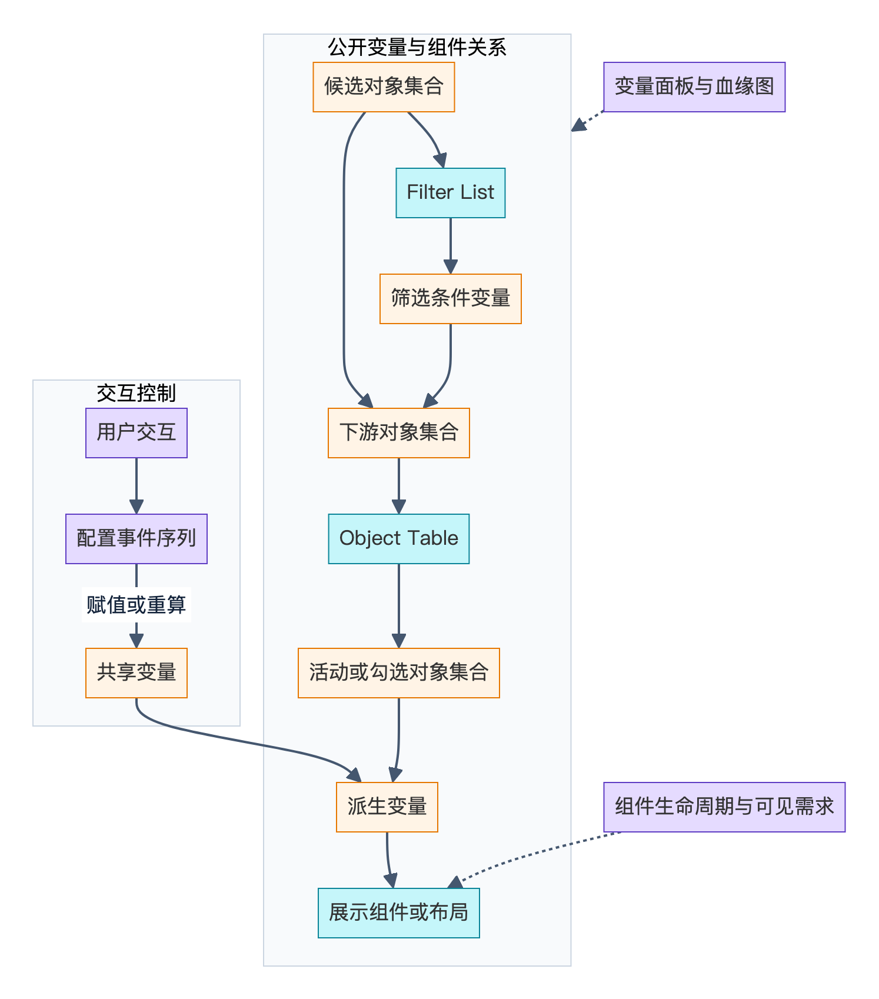
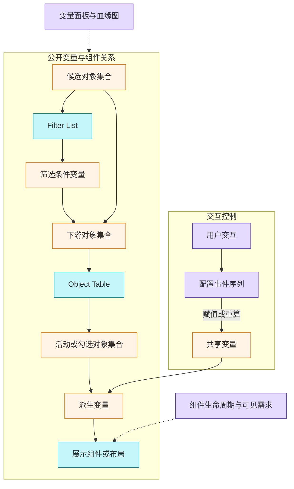

# Palantir Workshop 公开机制附录：变量、依赖与事件

核实日期：2026-10-01。范围仅为 Palantir 官方公开 Foundry 文档；下文描述公开产品行为，不据此断言未公开的调度器、协议、缓存或存储实现。各声明有编号，末尾矩阵提供核查入口。建议把 Workshop 理解为“有类型的共享状态、声明式派生关系、显式交互事件，以及组件生命周期”四个相互作用的维度；这是本文的阅读组织方式。

## 1. 变量的类型与依赖

**V01** 值类型含布尔、数值、字符串、日期、时间戳、地理点/形状、数组、结构体、对象集合/筛选、时间序列集合；定义方式另有静态、函数等，二者是不同维度。[Variables](https://www.palantir.com/docs/foundry/workshop/concepts-variables/)

**V02** 对象集合以对象类型或已有集合为输入，可筛选或沿关联遍历。[Variables](https://www.palantir.com/docs/foundry/workshop/concepts-variables/)

**V03** 变量面板支持名称/ID 搜索、定义/设置筛选及组件/页分区，无文件夹。血缘图显示上下游与读写；时间指应用内上次计算。[Variables](https://www.palantir.com/docs/foundry/workshop/concepts-variables/)

**T01** 变量转换可以串联操作、引用前序结果，在浏览器执行；字符串、数值、日期、布尔等基本类型转换不需要请求 Foundry 服务。公开操作还包括条件、类型转换、算术、日期运算、对象属性提取和对象集合聚合。[Variable transformations](https://www.palantir.com/docs/foundry/workshop/variable-transformations/)

**T02** 应区分“转换在浏览器执行”与“所有输入都在浏览器取得”。该页只对基本类型转换明确给出无需服务往返的保证，不足以证明对象集合聚合的数据取得方式。[Variable transformations](https://www.palantir.com/docs/foundry/workshop/variable-transformations/)

**S01** 结构体专题页说明可由静态值、对象结构体属性或函数初始化，也支持 SQL；暂不支持嵌套结构体。不支持的字段类型会被省略。组件通常通过提取字段使用结构体，而结构体及其数组也可作为函数输入。[Struct variables](https://www.palantir.com/docs/foundry/workshop/struct-variables/)

**S02** 结构体初始化说明在总览和专题页间有差异；本文采用专题说明，具体实例仍需验证。[Variables](https://www.palantir.com/docs/foundry/workshop/concepts-variables/)，[Struct variables](https://www.palantir.com/docs/foundry/workshop/struct-variables/)

**Q01** SQL 变量用一条 Ontology SQL `SELECT` 计算值：对象集合或接口集合绑定为表，其他变量绑定为参数，输入变化时重新计算。它在当前模块内定义，不需要另行发布。[SQL query variables](https://www.palantir.com/docs/foundry/workshop/sql-query-variables/)

**Q02** SQL 返回值受变量类型约束：标量须一行一列；基本类型数组须一列；结构体为一行、列对应字段；结构体数组为每行一个结构体。数组结果须少于 10,000 行，达到上限会报错；对象集合、地理点和地理形状不能用 SQL 定义。需要顺序时应显式排序。[SQL query variables](https://www.palantir.com/docs/foundry/workshop/sql-query-variables/)

## 2. 何时计算与重算

**V04** 函数/聚合/属性/转换/筛选可选默认 `Automatic`、仅事件、加载加事件。自动重算由依赖变化或对象重载引发。对象集合定义近似自动且不可配置，可调上游或改函数定义。[Variables](https://www.palantir.com/docs/foundry/workshop/concepts-variables/)

**V05** 查看/编辑均按可见消费懒计算，隐藏页、Tab、浮层、循环页和嵌入模块适用；需结合 D01。[Variables](https://www.palantir.com/docs/foundry/workshop/concepts-variables/)

**D01** 显示优化可让视觉隐藏组件保持计算/请求，因而需结合挂载配置理解 V05。[Widget display optimization](https://www.palantir.com/docs/foundry/workshop/widget-display-optimization/)；配置细节见 [数据、Actions 与版本附录](data-actions-versioning.md)。

**R01** 自动刷新另有可见性规则。[Auto-refresh](https://www.palantir.com/docs/foundry/workshop/auto-refresh/)；相关限制见 [数据、Actions 与版本附录](data-actions-versioning.md)。

函数缓存和函数服务执行的进一步说明参见 [Use Functions in Workshop](https://www.palantir.com/docs/foundry/workshop/functions-use/)；本附录不展开该专题。加载时序观察工具见 [Performance Profiler](https://www.palantir.com/docs/foundry/workshop/performance-profiler/)。

## 3. 对象集合、筛选状态与组件输出

**W01** Filter List 读取对象集合，输出一个对象集合筛选变量；同一输出变量的默认值又可初始化组件筛选状态。其输出可应用到下游集合；跨对象类型复用要求对应属性 ID 匹配。[Filter List](https://www.palantir.com/docs/foundry/workshop/widgets-filter-list/)

**F01** 筛选变量保存条件，可从空状态捕获组件选择，或用对象类型、属性及内联值/变量设置默认状态。起始条件支持精确匹配、空值、包含；该处“包含”只支持前缀，不能据此假设任意子串匹配。[Object set filter variables](https://www.palantir.com/docs/foundry/workshop/object-set-filter-variables/)

**F02** 开启“筛选变化时更新所用变量”后，匹配默认筛选形状的条件可提取数值范围、日期/时间范围和字符串项到变量。多字符串项需数组，标量仅取首项。跨属性迁移筛选需用提取值重新建立目标属性条件；筛选变量本身不能充当另一个筛选的值。[Object set filter variables](https://www.palantir.com/docs/foundry/workshop/object-set-filter-variables/)

**F03** 移除源属性条件会清空提取变量；仅依赖这些值的目标条件随后被移除。复杂嵌套、分离区间、边界包含方式或否定条件可能不支持提取或产生非预期结果。[Object set filter variables](https://www.palantir.com/docs/foundry/workshop/object-set-filter-variables/)

**W02** Object Table 输出两个对象集合：活动/高亮对象与勾选对象；后者只在启用多选时使用。默认自动选择首行，通常等组件可见后发生，显示优化可使其隐藏时发生；活动行选择也可触发事件。[Object Table](https://www.palantir.com/docs/foundry/workshop/widgets-object-table/)

**W03** Object Dropdown 接受对象集合，输出当前选中的单对象集合，并可允许没有选择。其输出可直接作为其他组件的输入。[Object Dropdown](https://www.palantir.com/docs/foundry/workshop/widgets-object-dropdown/)

建议在说明中明确区分三种量：候选集合、选择结果集合、筛选条件。下图用这个区分组织交互链路；它是概念示意，不表示 Palantir 的内部服务拓扑。

*基于公开资料的概念归纳，并非官方内部结构；[可缩放SVG](diagrams/04-variable-flow.svg)。*

查看可编辑Mermaid源

图中对应 V02–V05、W01–W03、E01–E02；连线表达已公开的消费或写入关系，不预设内部依赖图算法。

## 4. 应用事件的执行边界

**E01** 事件可由按钮、表格选择、下拉选择等交互触发，具体类型随组件而异。配置的多个事件按顺序执行，**不等待前一事件造成的依赖计算完成**。[Events](https://www.palantir.com/docs/foundry/workshop/concepts-events/)

**E02** 赋值事件即时复制源变量当前值到目标；下一事件能读取新目标值，但不能保证依赖它的派生值已更新。Workshop 不支持强制等全部下游传播完成；官方建议需要此边界时拆成多次用户触发。[Events](https://www.palantir.com/docs/foundry/workshop/concepts-events/)

**E03** 重置静态变量恢复定义中的默认值；重算事件按当前输入和定义重新求值，供非静态变量使用。其他公开事件包括布局变化、打开其他应用，以及重新加载模块数据。[Events](https://www.palantir.com/docs/foundry/workshop/concepts-events/)

由 E02 可推出一个设计检查：若事件序列先把 A 复制到 B，再立即消费 `derived(B)`，配置顺序本身不足以证明读取到了新派生值。这是对公开规则的推论，不是关于线程或任务队列的判断。

## 5. 布局状态和跨模块状态

**L01** 布局可由字符串或布尔变量控制；反向同步不能一概而论。[Variable-backed layouts](https://www.palantir.com/docs/foundry/workshop/variable-backed-layouts/)

| 布局状态 | 变量规则 | 对应布局事件会更新变量吗 |
| --- | --- | --- |
| 页选择 | 字符串匹配页 ID | 不会；需要同步时用赋值事件 |
| 区块隐藏 | 布尔，默认真为隐藏，可反转 | 无独立显示事件，用赋值事件 |
| 区块折叠 | 真为折叠，假为展开 | 不会；需要同步时用赋值事件 |
| Tab 选择 | 字符串匹配 Tab ID | 会，用户选择也更新变量 |
| 浮层开关 | 真为打开，假为关闭 | 会，可配置关闭回调 |

表格各行均依据 [Variable-backed layouts](https://www.palantir.com/docs/foundry/workshop/variable-backed-layouts/)。

**I01** 模块接口是供父模块映射及 URL 初始化的变量集合；需 external ID 并启用接口设置。嵌入映射采用父变量定义，忽略子模块原接口变量定义；子模块事件可修改共享值，供父模块或兄弟模块响应。[Module interface](https://www.palantir.com/docs/foundry/workshop/module-interface/)

**I02** URL 参数仅在首次加载时初始化接口变量；加载后改变 URL 不会动态更新值。打开另一个 Workshop 模块的事件使用调用时的当前值生成 URL；它与嵌入模块共享变量的方式应分开理解。[Module interface](https://www.palantir.com/docs/foundry/workshop/module-interface/)

## 6. 明确未知项

以下不是能力缺失声明，而是本次官方公开资料未建立的保证：

1. **依赖调度算法。** 本次资料未说明拓扑调度、批处理、去抖、循环依赖处理、并发求值及过期响应取消。[Variables](https://www.palantir.com/docs/foundry/workshop/concepts-variables/)
2. **惰性与显式触发的组合。** 隐藏变量遇到重算事件、加载加事件策略时，是否立即执行及各规则优先级未被完整定义；不可将默认懒计算推广到所有组合。[Variables](https://www.palantir.com/docs/foundry/workshop/concepts-variables/)，[Widget display optimization](https://www.palantir.com/docs/foundry/workshop/widget-display-optimization/)
3. **事件失败和跨序列一致性。** 顺序与不等待下游已公开；单个事件失败后是否继续、独立交互序列是否交错、是否有事务或重试保证，本次资料未给出。[Events](https://www.palantir.com/docs/foundry/workshop/concepts-events/)
4. **对象集合物理表示。** 从变量和 SQL 的公开能力不能确定所有集合是否完整物化到浏览器，也不能推断查询合并、分页或缓存协议。[Variables](https://www.palantir.com/docs/foundry/workshop/concepts-variables/)，[SQL query variables](https://www.palantir.com/docs/foundry/workshop/sql-query-variables/)
5. **文档与实例差异。** 结构体初始化说明存在 S02 所述不一致；专题页的功能何时及在哪些实例可用，没有统一版本承诺。应将公开文档能力与具体实例验证分开。[Struct variables](https://www.palantir.com/docs/foundry/workshop/struct-variables/)

## 7. 声明与来源矩阵

同一行中所有编号均可逐项在给定页面的对应节核查。矩阵不新增技术声明。

| 声明编号 | 官方页面 URL | 定位节 |
| --- | --- | --- |
| V01 | [concepts-variables](https://www.palantir.com/docs/foundry/workshop/concepts-variables/) | Variable types；Variable definition type |
| V02 | [concepts-variables](https://www.palantir.com/docs/foundry/workshop/concepts-variables/) | Object set |
| V03 | [concepts-variables](https://www.palantir.com/docs/foundry/workshop/concepts-variables/) | Variables panel；Variable lineage graph |
| V04 | [concepts-variables](https://www.palantir.com/docs/foundry/workshop/concepts-variables/) | Recompute variable value |
| V05 | [concepts-variables](https://www.palantir.com/docs/foundry/workshop/concepts-variables/) | Lazy variable loading |
| T01–T02 | [variable-transformations](https://www.palantir.com/docs/foundry/workshop/variable-transformations/) | Execution context；Transformation types |
| S01 | [struct-variables](https://www.palantir.com/docs/foundry/workshop/struct-variables/) | Create a struct variable；Extract a field；Use structs as function inputs |
| S02 | [struct-variables](https://www.palantir.com/docs/foundry/workshop/struct-variables/)，[concepts-variables](https://www.palantir.com/docs/foundry/workshop/concepts-variables/) | 初始化说明对照 |
| Q01 | [sql-query-variables](https://www.palantir.com/docs/foundry/workshop/sql-query-variables/) | Overview；Add tables；Add parameters |
| Q02 | [sql-query-variables](https://www.palantir.com/docs/foundry/workshop/sql-query-variables/) | Supported variable types；Result shapes |
| D01 | [widget-display-optimization](https://www.palantir.com/docs/foundry/workshop/widget-display-optimization/) | Performance considerations |
| R01 | [auto-refresh](https://www.palantir.com/docs/foundry/workshop/auto-refresh/) | Visibility in module |
| W01 | [widgets-filter-list](https://www.palantir.com/docs/foundry/workshop/widgets-filter-list/) | Output data |
| F01 | [object-set-filter-variables](https://www.palantir.com/docs/foundry/workshop/object-set-filter-variables/) | Create；Supported starting filters |
| F02–F03 | [object-set-filter-variables](https://www.palantir.com/docs/foundry/workshop/object-set-filter-variables/) | Filter value extraction；Apply extracted values；Limitations |
| W02 | [widgets-object-table](https://www.palantir.com/docs/foundry/workshop/widgets-object-table/) | Selection |
| W03 | [widgets-object-dropdown](https://www.palantir.com/docs/foundry/workshop/widgets-object-dropdown/) | Input data |
| E01–E02 | [concepts-events](https://www.palantir.com/docs/foundry/workshop/concepts-events/) | Event execution order |
| E03 | [concepts-events](https://www.palantir.com/docs/foundry/workshop/concepts-events/) | Variables；Applications；Data staleness |
| L01及布局表 | [variable-backed-layouts](https://www.palantir.com/docs/foundry/workshop/variable-backed-layouts/) | 各布局状态专节 |
| I01 | [module-interface](https://www.palantir.com/docs/foundry/workshop/module-interface/) | Embedded module interface |
| I02 | [module-interface](https://www.palantir.com/docs/foundry/workshop/module-interface/) | Open Workshop module event；Create a URL |

## 8. 建议用于进一步验证的最小场景

这些是研究建议，没有声称本次已在产品实例中运行：

- 用一个候选集合、一个 Filter List、一个表格和一个派生值，检查“条件变化—集合变化—选择变化—派生值变化”的读写链路。
- 配置连续赋值和使用派生值的事件，再拆成两次点击，观察传播边界；同时记录目标变量和派生变量，而非仅看最终界面。
- 对相同组件比较默认、延迟挂载和立即挂载/保留配置，分别记录隐藏、显示、离屏、后台标签页下的行为。
- 在父子模块映射同一布局变量，确认谁提供定义、谁写入值，再单独测试 URL 首次加载状态。

以上场景旨在补充公开规则的组合边界；不能据实例观察外推未公布的全局架构。
